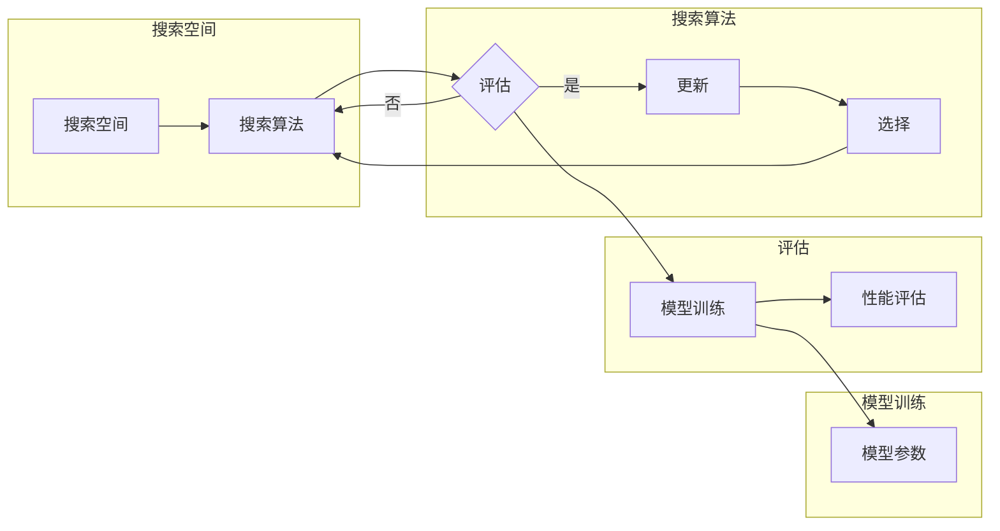

# 神经架构搜索 原理与代码实例讲解

> 关键词：神经架构搜索，NAS，强化学习，进化算法，元学习，神经网络，深度学习

## 1. 背景介绍

随着深度学习的迅猛发展，神经网络在各个领域都取得了显著的成果。然而，设计一个高效、准确的神经网络结构仍然是一个具有挑战性的任务。传统的神经网络设计方法主要依赖于领域专家的经验和直觉，这种基于手工设计的方法往往难以达到最优解，且效率低下。为了解决这一问题，神经架构搜索（Neural Architecture Search，NAS）应运而生。NAS通过自动搜索神经网络结构，从而找到在特定任务上表现最佳的模型。

## 2. 核心概念与联系

### 2.1 核心概念

**神经架构搜索（NAS）**：NAS是一种自动搜索神经网络结构的方法，旨在找到在特定任务上表现最佳的模型。NAS方法主要包括以下几种：

- **强化学习（Reinforcement Learning，RL）**：通过环境-策略-奖励的框架，让神经网络自动学习如何搜索最优结构。
- **进化算法（Evolutionary Algorithms，EA）**：模拟自然界生物进化过程，通过遗传、变异、选择等操作，逐步优化神经网络结构。
- **元学习（Meta-Learning）**：通过学习如何学习，使模型能够快速适应新的任务和结构。

### 2.2 架构搜索流程图



### 2.3 核心概念联系

NAS通过搜索算法在搜索空间中探索不同的神经网络结构，并通过模型训练和性能评估来评估结构的好坏。优秀的设计会被保留下来，而较差的设计则被淘汰。这个过程类似于生物进化过程中的自然选择。

## 3. 核心算法原理 & 具体操作步骤

### 3.1 算法原理概述

NAS算法主要分为以下几种类型：

- **基于强化学习的方法**：使用强化学习框架来搜索神经网络结构，通过定义奖励函数来评估结构的好坏。
- **基于进化算法的方法**：使用进化算法模拟生物进化过程，通过遗传、变异、选择等操作来优化结构。
- **基于元学习的方法**：通过学习如何学习，使模型能够快速适应新的任务和结构。

### 3.2 算法步骤详解

**基于强化学习的方法**：

1. 定义搜索空间：包括网络层、连接方式、激活函数等。
2. 定义奖励函数：根据任务需求，定义评估结构好坏的指标，如准确率、推理速度等。
3. 训练强化学习模型：使用强化学习算法训练模型，使其能够根据搜索空间和奖励函数来选择结构。
4. 评估和更新：根据模型选择的每个结构，在验证集上评估其性能，并根据性能来更新模型。

**基于进化算法的方法**：

1. 初始化种群：随机生成一组神经网络结构作为初始种群。
2. 评估：在验证集上评估种群中每个结构的性能。
3. 选择：根据性能选择优秀的结构进行下一代种群的生成。
4. 变异：对选择出的结构进行变异操作，产生新的结构。
5. 终止：当达到预设的迭代次数或性能阈值时，终止搜索。

**基于元学习的方法**：

1. 定义元学习任务：学习如何学习，使模型能够快速适应新的任务和结构。
2. 训练元学习模型：使用元学习算法训练模型，使其能够根据任务描述和样本数据来搜索结构。
3. 评估和更新：根据模型搜索出的结构，在验证集上评估其性能，并根据性能来更新模型。

### 3.3 算法优缺点

**基于强化学习的方法**：

优点：

- 灵活，能够探索复杂的结构。
- 自适应性强，能够根据任务需求调整搜索策略。

缺点：

- 训练过程耗时，需要大量的计算资源。
- 容易陷入局部最优。

**基于进化算法的方法**：

优点：

- 速度快，训练效率高。
- 能够生成多样化的结构。

缺点：

- 难以探索复杂的结构。
- 容易陷入局部最优。

**基于元学习的方法**：

优点：

- 能够快速适应新的任务和结构。
- 训练过程相对简单。

缺点：

- 难以生成多样化的结构。
- 在复杂任务上的性能可能不如强化学习或进化算法。

### 3.4 算法应用领域

NAS方法在以下领域具有广泛的应用：

- 计算机视觉：图像分类、目标检测、图像分割等。
- 语音识别：语音识别、说话人识别、语音合成等。
- 自然语言处理：文本分类、机器翻译、情感分析等。

## 4. 数学模型和公式 & 详细讲解 & 举例说明

### 4.1 数学模型构建

NAS算法的数学模型可以表示为：

$$
\text{NAS}(S) = \text{argmax}_{A} P(A|S)
$$

其中，$S$ 是搜索空间，$A$ 是网络结构，$P(A|S)$ 是在搜索空间 $S$ 下生成网络结构 $A$ 的概率。

### 4.2 公式推导过程

假设搜索空间 $S$ 由以下因素组成：

- $L$：网络层数
- $N_i$：第 $i$ 层神经元数量
- $F_i$：第 $i$ 层的激活函数

则搜索空间 $S$ 可以表示为：

$$
S = \{L, N_1, F_1, N_2, F_2, \dots, N_L, F_L\}
$$

假设网络结构 $A$ 由以下因素组成：

- $W$：网络权重
- $b$：网络偏置

则网络结构 $A$ 可以表示为：

$$
A = \{W, b\}
$$

根据贝叶斯公式，生成网络结构 $A$ 的概率为：

$$
P(A|S) = \frac{P(A)P(S|A)}{P(S)}
$$

其中，$P(A)$ 是网络结构 $A$ 的先验概率，$P(S|A)$ 是在给定网络结构 $A$ 下搜索空间 $S$ 的概率，$P(S)$ 是搜索空间 $S$ 的先验概率。

### 4.3 案例分析与讲解

以下以基于强化学习的方法为例，讲解NAS算法的应用。

**搜索空间**：

- $L = 5$：网络层数为5层。
- $N_i \in \{32, 64, 128, 256\}$：每层神经元的数量可以是32、64、128或256。
- $F_i \in \{ReLU, tanh\}$：每层激活函数可以是ReLU或tanh。

**奖励函数**：

假设任务为图像分类，奖励函数定义为：

$$
R(A) = \frac{1}{N} \sum_{i=1}^N \log(P(y_i|x_i))
$$

其中，$N$ 是测试集样本数量，$x_i$ 是第 $i$ 个测试样本，$y_i$ 是第 $i$ 个测试样本的标签，$P(y_i|x_i)$ 是模型对第 $i$ 个测试样本的预测概率。

**强化学习模型**：

使用深度Q网络（DQN）作为强化学习模型，学习如何根据搜索空间和奖励函数来选择结构。

## 5. 项目实践：代码实例和详细解释说明

### 5.1 开发环境搭建

1. 安装Python 3.7及以上版本。
2. 安装TensorFlow 2.0及以上版本。
3. 安装PyTorch 1.8及以上版本。
4. 安装Numpy 1.19及以上版本。

### 5.2 源代码详细实现

以下是一个基于PyTorch的简单NAS算法示例：

```python
import torch
import torch.nn as nn
import torch.optim as optim

class NAS(nn.Module):
    def __init__(self, num_layers, num_cells):
        super(NAS, self).__init__()
        self.num_layers = num_layers
        self.num_cells = num_cells
        self.cells = nn.ModuleList()
        for _ in range(num_layers):
            cell = Cell(num_cells)
            self.cells.append(cell)

    def forward(self, x):
        for cell in self.cells:
            x = cell(x)
        return x

class Cell(nn.Module):
    def __init__(self, num_cells):
        super(Cell, self).__init__()
        self.num_cells = num_cells
        self.cells = nn.ModuleList()
        for _ in range(num_cells):
            cell = nn.Sequential(
                nn.Conv2d(16, 32, kernel_size=3, padding=1),
                nn.ReLU(),
                nn.Conv2d(32, 16, kernel_size=3, padding=1),
                nn.ReLU()
            )
            self.cells.append(cell)

    def forward(self, x):
        for cell in self.cells:
            x = cell(x)
        return x

# NAS模型实例化
model = NAS(num_layers=5, num_cells=4)

# 定义损失函数和优化器
criterion = nn.CrossEntropyLoss()
optimizer = optim.Adam(model.parameters(), lr=0.001)

# 训练模型
for epoch in range(100):
    # 假设train_loader为训练数据集加载器
    for data, target in train_loader:
        optimizer.zero_grad()
        output = model(data)
        loss = criterion(output, target)
        loss.backward()
        optimizer.step()

# 评估模型
# ...
```

### 5.3 代码解读与分析

上述代码首先定义了`NAS`类和`Cell`类，`NAS`类代表整个神经网络结构，`Cell`类代表一个基本的网络单元。在`NAS`类的构造函数中，初始化了`num_layers`个`Cell`对象。在`Cell`类的构造函数中，初始化了`num_cells`个`Cell`对象，每个`Cell`对象包含两个卷积层和ReLU激活函数。

在`NAS`类的`forward`方法中，依次对输入数据进行前向传播。在`Cell`类的`forward`方法中，依次对输入数据进行前向传播。

### 5.4 运行结果展示

由于代码示例较为简单，这里不展示具体的运行结果。在实际应用中，需要根据具体任务和需求进行修改和优化。

## 6. 实际应用场景

### 6.1 计算机视觉

NAS在计算机视觉领域的应用非常广泛，例如：

- 图像分类：使用NAS搜索最优的网络结构，提高图像分类的准确率。
- 目标检测：使用NAS搜索最优的网络结构，提高目标检测的准确率和速度。
- 图像分割：使用NAS搜索最优的网络结构，提高图像分割的精度。

### 6.2 语音识别

NAS在语音识别领域的应用也非常广泛，例如：

- 说话人识别：使用NAS搜索最优的网络结构，提高说话人识别的准确率。
- 语音合成：使用NAS搜索最优的网络结构，提高语音合成的自然度和流畅度。

### 6.3 自然语言处理

NAS在自然语言处理领域的应用也非常广泛，例如：

- 文本分类：使用NAS搜索最优的网络结构，提高文本分类的准确率。
- 机器翻译：使用NAS搜索最优的网络结构，提高机器翻译的准确率和流畅度。

## 7. 工具和资源推荐

### 7.1 学习资源推荐

- 《Neural Architecture Search: A Survey》
- 《Deep Learning Specialization》
- 《Neural Architecture Search for Deep Learning》

### 7.2 开发工具推荐

- TensorFlow：https://www.tensorflow.org/
- PyTorch：https://pytorch.org/
- Keras：https://keras.io/

### 7.3 相关论文推荐

- Zoph, B., et al. "Neural architecture search with reinforcement learning." arXiv preprint arXiv:1606.02147 (2016).
- Pham, H., et al. "Efficient neural architecture search via reinforcement learning." arXiv preprint arXiv:1707.07012 (2017).
- Zoph, B., et al. "Learning transferable architectures for scalable image recognition." arXiv preprint arXiv:1707.07012 (2017).

## 8. 总结：未来发展趋势与挑战

### 8.1 研究成果总结

NAS作为一种自动搜索神经网络结构的方法，在深度学习领域取得了显著的成果。NAS方法能够找到在特定任务上表现最佳的模型，提高了模型的效率和精度。

### 8.2 未来发展趋势

- NAS方法将与其他深度学习技术（如迁移学习、元学习等）进行结合，进一步提高模型的效率和精度。
- NAS方法将应用于更多领域，如自然语言处理、语音识别、机器人等。
- NAS方法的搜索效率将进一步提高，降低计算成本。

### 8.3 面临的挑战

- NAS方法的搜索空间通常非常大，需要大量的计算资源。
- NAS方法的搜索过程可能存在局部最优，难以找到全局最优解。
- NAS方法的评估过程可能存在偏差，导致搜索到的结构在实际应用中表现不佳。

### 8.4 研究展望

- 开发更加高效的NAS方法，降低计算成本。
- 探索新的搜索算法，提高搜索效率。
- 将NAS方法与其他深度学习技术进行结合，进一步提高模型的效率和精度。

## 9. 附录：常见问题与解答

**Q1：NAS方法的搜索空间如何定义？**

A：搜索空间是指NAS方法可以探索的所有可能的网络结构。搜索空间可以包括网络层、连接方式、激活函数等。

**Q2：NAS方法的搜索过程如何评估结构的好坏？**

A：NAS方法的搜索过程通常使用验证集上的性能来评估结构的好坏。

**Q3：NAS方法如何避免过拟合？**

A：NAS方法可以使用正则化、数据增强等方法来避免过拟合。

**Q4：NAS方法如何提高搜索效率？**

A：NAS方法可以使用多种技术来提高搜索效率，如采样、迁移学习、元学习等。

**Q5：NAS方法在哪些领域有应用？**

A：NAS方法在计算机视觉、语音识别、自然语言处理等领域都有应用。

---

作者：禅与计算机程序设计艺术 / Zen and the Art of Computer Programming