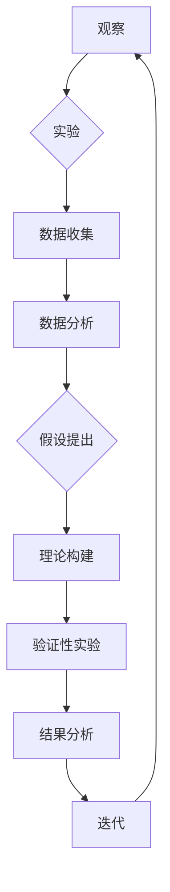

# 科学方法：从观察到实验

> 关键词：科学方法，观察，实验，假设，理论，验证，迭代，验证性实验，假说演绎法

## 1. 背景介绍

科学方法是人类认识世界、探索自然规律的基本途径。它通过观察、实验、假设、理论、验证等步骤，不断积累知识，推动科技发展。本文将深入探讨科学方法的核心概念、原理，并探讨其在信息技术领域的应用。

## 2. 核心概念与联系

### 2.1 观察与实验

科学方法的第一步是观察。观察是指通过感官或仪器对自然现象进行感知和记录。实验则是通过人为控制条件，对研究对象进行操作，以验证假设或理论。



### 2.2 假设与理论

观察到的现象需要通过假设和理论来解释。假设是对观察现象的解释，而理论则是对假设进行系统化、条理化后的知识体系。

### 2.3 验证与迭代

科学方法的核心在于验证。通过实验来验证假设是否成立，通过结果分析来修正或完善理论。这个过程是迭代进行的，每次实验和观察都可能推动科学知识的进步。

## 3. 核心算法原理 & 具体操作步骤

### 3.1 算法原理概述

科学方法是一种迭代的过程，包括以下步骤：

1. 提出问题：观察现象，提出需要解决的问题。
2. 假设：根据已有知识，提出可能的解释。
3. 实验：设计实验，验证假设。
4. 验证：分析实验结果，验证或否定假设。
5. 理论：基于验证结果，构建或修正理论。

### 3.2 算法步骤详解

1. **提出问题**：观察现象，发现规律，提出需要解决的问题。
2. **假设**：根据已有知识和观察结果，提出可能的解释。
3. **实验**：设计实验，控制变量，收集数据。
4. **验证**：分析实验结果，验证或否定假设。
5. **理论**：基于验证结果，构建或修正理论。
6. **迭代**：根据理论，进行新的观察和实验，重复上述过程。

### 3.3 算法优缺点

**优点**：

- **系统性强**：科学方法提供了一套完整的知识获取和验证流程。
- **可重复性**：科学方法强调实验的可重复性，保证了结果的可靠性。
- **可验证性**：科学方法强调假设和理论的验证性，保证了知识的科学性。

**缺点**：

- **耗时费力**：科学方法需要大量的时间和资源。
- **局限性**：科学方法依赖于观察和实验，可能无法涵盖所有现象。

### 3.4 算法应用领域

科学方法在各个领域都有广泛应用，包括：

- **自然科学**：物理学、化学、生物学等。
- **社会科学**：经济学、心理学、社会学等。
- **信息技术**：计算机科学、人工智能、数据科学等。

## 4. 数学模型和公式 & 详细讲解 & 举例说明

### 4.1 数学模型构建

科学方法中的数学模型是对现实世界的抽象和简化。例如，牛顿的运动定律就是一个简单的数学模型，它描述了物体运动的基本规律。

### 4.2 公式推导过程

牛顿的运动定律可以通过以下公式表示：

$$
F = ma
$$

其中，$F$ 是力，$m$ 是质量，$a$ 是加速度。

### 4.3 案例分析与讲解

以下是一个简单的科学方法案例：测量重力加速度。

1. **提出问题**：我们需要知道地球表面的重力加速度是多少。
2. **假设**：地球表面的重力加速度是恒定的。
3. **实验**：使用自由落体实验，测量不同高度的自由落体时间。
4. **验证**：分析实验数据，发现重力加速度与高度无关，验证了假设。
5. **理论**：基于实验结果，我们可以得出结论：地球表面的重力加速度是 $9.8m/s^2$。

## 5. 项目实践：代码实例和详细解释说明

### 5.1 开发环境搭建

为了演示科学方法在信息技术领域的应用，我们将使用Python进行一个简单的线性回归项目。

1. **安装Python**：从官网下载并安装Python。
2. **安装NumPy和Matplotlib**：使用pip安装这些库。

### 5.2 源代码详细实现

```python
import numpy as np
import matplotlib.pyplot as plt

# 生成模拟数据
X = np.linspace(0, 10, 100)
y = 2 * X + 3 + np.random.normal(0, 1, 100)

# 绘制数据点
plt.scatter(X, y, color='blue')

# 训练线性回归模型
m, b = np.polyfit(X, y, 1)

# 绘制拟合线
plt.plot(X, m * X + b, color='red')

# 显示结果
plt.xlabel('X')
plt.ylabel('Y')
plt.title('线性回归')
plt.show()
```

### 5.3 代码解读与分析

- 我们首先生成了一个模拟数据集，其中包含100个样本。
- 然后我们使用NumPy的`polyfit`函数训练了一个线性回归模型，它通过最小化误差平方和来找到最佳拟合线。
- 最后，我们使用Matplotlib绘制了数据点和拟合线。

### 5.4 运行结果展示

运行上述代码，你会看到一个包含数据点和拟合线的图形。这个图形展示了线性回归模型如何根据数据拟合一条直线。

## 6. 实际应用场景

### 6.1 机器学习

在机器学习中，科学方法被广泛应用于各种任务，如分类、回归、聚类等。

### 6.2 数据科学

数据科学家使用科学方法来分析数据，发现数据中的模式和趋势。

### 6.3 人工智能

在人工智能领域，科学方法被用于开发各种智能算法和模型。

## 7. 工具和资源推荐

### 7.1 学习资源推荐

- 《科学方法》
- 《科学革命的结构》
- 《如何阅读一本科学书》

### 7.2 开发工具推荐

- Python
- Jupyter Notebook
- Matplotlib

### 7.3 相关论文推荐

- 《基于科学方法的机器学习》
- 《数据科学的科学方法》
- 《人工智能的科学方法》

## 8. 总结：未来发展趋势与挑战

### 8.1 研究成果总结

科学方法是人类认识世界的重要工具，它通过观察、实验、假设、理论、验证等步骤，不断推动科技发展。

### 8.2 未来发展趋势

科学方法将在各个领域得到更广泛的应用，特别是在信息技术领域，科学方法将推动人工智能、机器学习、数据科学等技术的发展。

### 8.3 面临的挑战

科学方法在应用过程中面临着数据质量、模型复杂性、伦理等问题。

### 8.4 研究展望

未来，科学方法将与信息技术、人工智能等领域深度融合，推动科技创新和社会进步。

## 9. 附录：常见问题与解答

**Q1：科学方法适用于所有领域吗？**

A：科学方法适用于所有领域，但不同领域的应用方式可能有所不同。

**Q2：科学方法是否总是有效？**

A：科学方法并不是万能的，它有其局限性，但在许多情况下，它是获取知识的有效途径。

**Q3：科学方法如何应用于信息技术领域？**

A：在信息技术领域，科学方法可以应用于软件开发、数据分析、人工智能等领域，帮助开发者更好地理解和解决实际问题。

**Q4：科学方法与直觉和经验的关系是什么？**

A：科学方法与直觉和经验相结合，可以更好地指导实践。

**Q5：如何学习科学方法？**

A：学习科学方法可以从阅读相关书籍、参加培训课程、进行实践等方式入手。

作者：禅与计算机程序设计艺术 / Zen and the Art of Computer Programming