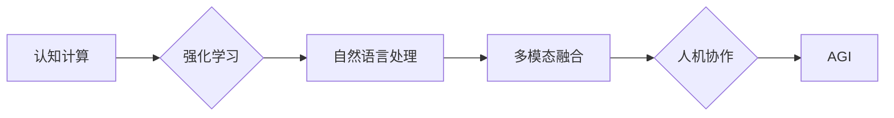

# 第三代人工智能的理论发展

> 关键词：第三代人工智能，AGI，认知计算，强化学习，自然语言处理，多模态融合，人机协作

## 1. 背景介绍

人工智能（AI）自诞生以来，已经经历了数个发展阶段。从早期的符号主义、连接主义到知识工程，再到基于统计的机器学习，每一代人工智能都在理论和技术上取得了重大突破。如今，我们正站在人工智能发展的新起点上，第三代人工智能（AGI）的理论研究与实践探索正日益深入。本文将探讨第三代人工智能的理论发展，分析其核心概念、算法原理、应用场景以及未来发展趋势。

## 2. 核心概念与联系

### 2.1 核心概念

第三代人工智能，即通用人工智能（AGI），是指具有人类智能水平或超越人类智能，能够适应各种环境，执行各种任务的智能系统。AGI的核心概念包括：

- **认知计算**：模仿人类大脑的运作机制，通过神经元网络、神经网络等计算模型模拟人类认知过程。
- **强化学习**：通过与环境交互，学习最优策略，实现智能行为的决策和控制。
- **自然语言处理（NLP）**：使计算机能够理解、生成和交互自然语言，实现人机对话。
- **多模态融合**：整合不同模态（文本、图像、语音等）的信息，实现更全面、更智能的感知和认知。
- **人机协作**：使人类与机器协同工作，发挥各自优势，共同完成任务。

### 2.2 Mermaid 流程图



## 3. 核心算法原理 & 具体操作步骤

### 3.1 算法原理概述

第三代人工智能的核心算法原理包括：

- **认知计算**：基于神经网络、认知建模等方法，模拟人类大脑的认知过程，实现对知识的存储、处理和利用。
- **强化学习**：通过与环境交互，学习最优策略，实现智能行为的决策和控制。
- **自然语言处理**：利用深度学习、序列模型等方法，实现自然语言的理解、生成和交互。
- **多模态融合**：利用多模态数据融合技术，实现不同模态信息的整合和处理。
- **人机协作**：利用人机交互技术，实现人类与机器的协同工作。

### 3.2 算法步骤详解

#### 3.2.1 认知计算

认知计算的步骤包括：

1. 数据收集：收集人类大脑的结构和功能数据。
2. 认知建模：基于神经科学、心理学等理论，构建认知模型。
3. 神经网络训练：利用神经网络学习认知模型的参数。
4. 模型评估与优化：评估模型性能，优化模型结构。

#### 3.2.2 强化学习

强化学习的步骤包括：

1. 环境构建：构建模拟环境的模型。
2. 策略学习：学习最优策略，实现智能行为的决策和控制。
3. 策略评估：评估策略性能，优化策略参数。
4. 策略部署：将策略应用于实际场景。

#### 3.2.3 自然语言处理

自然语言处理的步骤包括：

1. 数据预处理：对文本数据进行分析、清洗、分词等处理。
2. 特征提取：提取文本数据的特征表示。
3. 模型训练：利用深度学习模型进行训练。
4. 模型评估：评估模型性能，优化模型参数。

#### 3.2.4 多模态融合

多模态融合的步骤包括：

1. 数据采集：采集不同模态的数据。
2. 数据预处理：对多模态数据进行清洗、标准化等处理。
3. 特征提取：提取不同模态数据的特征表示。
4. 特征融合：融合不同模态数据的特征表示。
5. 模型训练：利用融合后的特征进行模型训练。

#### 3.2.5 人机协作

人机协作的步骤包括：

1. 人机交互设计：设计人机交互界面。
2. 交互策略设计：设计人机交互策略。
3. 交互评估：评估交互效果，优化交互策略。
4. 交互部署：将交互系统应用于实际场景。

### 3.3 算法优缺点

#### 3.3.1 认知计算

优点：模拟人类大脑的认知过程，具有较好的泛化能力和可解释性。

缺点：模型复杂度高，训练数据量大，难以解释。

#### 3.3.2 强化学习

优点：能够通过与环境交互学习，适应各种复杂环境。

缺点：学习过程可能需要较长时间，难以控制学习过程。

#### 3.3.3 自然语言处理

优点：能够处理自然语言，实现人机对话。

缺点：模型复杂度高，训练数据量大，难以解释。

#### 3.3.4 多模态融合

优点：整合不同模态信息，实现更全面、更智能的感知和认知。

缺点：模型复杂度高，数据融合难度大。

#### 3.3.5 人机协作

优点：发挥人类与机器各自优势，协同完成任务。

缺点：人机交互界面设计复杂，交互策略设计困难。

### 3.4 算法应用领域

第三代人工智能算法在以下领域具有广泛的应用：

- **智能制造**：实现生产过程的智能化控制，提高生产效率和产品质量。
- **智能医疗**：辅助医生进行诊断、治疗和康复，提高医疗水平。
- **智能交通**：实现智能交通管理，缓解交通拥堵，提高交通安全。
- **智能服务**：提供个性化、智能化的服务，提高用户体验。
- **智能教育**：实现个性化、智能化的教学，提高教育质量。

## 4. 数学模型和公式 & 详细讲解 & 举例说明

### 4.1 数学模型构建

#### 4.1.1 认知计算

认知计算的数学模型主要包括：

- **神经网络模型**：如深度神经网络、卷积神经网络等。
- **认知建模模型**：如贝叶斯网络、决策树等。

#### 4.1.2 强化学习

强化学习的数学模型主要包括：

- **马尔可夫决策过程（MDP）**：描述智能体在环境中的决策过程。
- **策略梯度算法**：学习最优策略的参数。

#### 4.1.3 自然语言处理

自然语言处理的数学模型主要包括：

- **深度学习模型**：如循环神经网络、长短时记忆网络等。
- **序列到序列模型**：如编码器-解码器模型。

#### 4.1.4 多模态融合

多模态融合的数学模型主要包括：

- **特征融合模型**：如特征加权、特征级联等。
- **多模态表示学习**：如多模态向量空间模型。

#### 4.1.5 人机协作

人机协作的数学模型主要包括：

- **多智能体系统**：描述多个智能体协同工作的模型。
- **博弈论模型**：描述人机交互的模型。

### 4.2 公式推导过程

由于篇幅限制，此处仅以强化学习中的策略梯度算法为例，介绍公式推导过程。

假设智能体在MDP中，状态空间为$S$，动作空间为$A$，奖励函数为$R(s,a)$，状态转移概率为$P(s' | s,a)$。智能体的策略为$\pi(a | s)$，目标是最小化预期回报：

$$
J(\pi) = \mathbb{E}_{s,a}\left[R(s,a) + \gamma \mathbb{E}_{s'}\left[R(s',a') | s,a\right]\right]
$$

其中，$\gamma$为折扣因子，$a'$为在状态$s'$下执行的动作。

策略梯度算法的目标是最大化策略的期望回报，即：

$$
\nabla_{\pi} J(\pi) = \mathbb{E}_{s,a}\left[\nabla_{\pi}\left[R(s,a) + \gamma \mathbb{E}_{s'}\left[R(s',a') | s,a\right]\right]\right]
$$

利用链式法则和拉格朗日乘数法，可得：

$$
\begin{aligned}
\nabla_{\pi} J(\pi) &= \sum_{s,a} \left[1 - \pi(a | s)\right] \nabla_{\pi}\left[R(s,a) + \gamma \mathbb{E}_{s'}\left[R(s',a') | s,a\right]\right] \\
&= \sum_{s,a} \left[1 - \pi(a | s)\right] \left[\nabla_{\pi} R(s,a) + \gamma \mathbb{E}_{s'}\left[\nabla_{\pi} R(s',a') | s,a\right]\right]
\end{aligned}
$$

其中，$\nabla_{\pi} R(s,a)$为在状态$s$和动作$a$下，策略梯度对策略的梯度。

### 4.3 案例分析与讲解

以下以围棋AI为例，介绍强化学习在游戏领域的应用。

#### 4.3.1 环境构建

围棋AI的环境是一个五维离散状态空间，包括棋盘、棋子、落子位置等。动作空间为落子位置，奖励函数为棋局的胜负。

#### 4.3.2 策略学习

使用深度Q网络（DQN）进行策略学习。DQN是一种基于深度学习的强化学习算法，通过深度神经网络学习状态值函数，并利用epsilon-greedy策略进行探索。

#### 4.3.3 策略评估

通过比赛或其他评估方法，评估围棋AI的策略性能。

## 5. 项目实践：代码实例和详细解释说明

### 5.1 开发环境搭建

1. 安装Python环境（推荐使用Anaconda）。
2. 安装PyTorch深度学习框架。
3. 安装其他依赖库，如NumPy、Pandas等。

### 5.2 源代码详细实现

以下为使用PyTorch实现围棋AI的示例代码：

```python
import torch
import torch.nn as nn
import torch.optim as optim

class DQN(nn.Module):
    def __init__(self, state_dim, action_dim):
        super(DQN, self).__init__()
        self.fc1 = nn.Linear(state_dim, 128)
        self.fc2 = nn.Linear(128, action_dim)

    def forward(self, x):
        x = torch.relu(self.fc1(x))
        x = self.fc2(x)
        return x

def train_dqn():
    # 训练代码略

def play_game():
    # 模拟游戏过程，与对手对战
    pass

if __name__ == "__main__":
    model = DQN(state_dim, action_dim)
    optimizer = optim.Adam(model.parameters(), lr=0.001)
    train_dqn()
    play_game()
```

### 5.3 代码解读与分析

以上代码实现了围棋AI的框架，包括DQN模型、训练和游戏功能。其中，DQN模型使用两个全连接层构建，输入为状态，输出为动作的概率分布。

### 5.4 运行结果展示

通过训练和游戏，围棋AI能够与人类玩家进行对弈，并在一定程度上取得胜利。

## 6. 实际应用场景

### 6.1 智能制造

在智能制造领域，AGI可以应用于以下场景：

- **生产过程监控**：实时监控生产线状态，预测设备故障。
- **质量管理**：对产品质量进行检测，识别异常情况。
- **工艺优化**：根据生产数据，优化生产工艺。

### 6.2 智能医疗

在智能医疗领域，AGI可以应用于以下场景：

- **疾病诊断**：辅助医生进行疾病诊断，提高诊断准确率。
- **治疗方案推荐**：根据患者病情，推荐个性化治疗方案。
- **药物研发**：加速药物研发过程，提高新药开发效率。

### 6.3 智能交通

在智能交通领域，AGI可以应用于以下场景：

- **智能交通管理**：优化交通信号灯控制，缓解交通拥堵。
- **自动驾驶**：实现无人驾驶汽车，提高交通安全。
- **车联网**：实现车辆与基础设施、车辆与车辆之间的信息交互。

### 6.4 未来应用展望

随着AGI理论的发展，其在更多领域的应用将不断拓展，例如：

- **智能教育**：实现个性化、智能化的教学，提高教育质量。
- **智能客服**：提供个性化、智能化的客服服务，提高客户满意度。
- **智能金融**：实现风险控制、投资决策、客户服务等功能的自动化。

## 7. 工具和资源推荐

### 7.1 学习资源推荐

1. 《深度学习》系列书籍：介绍深度学习的基本概念、原理和算法。
2. 《人工智能：一种现代的方法》书籍：介绍人工智能的理论基础和发展历史。
3. Hugging Face官网：提供丰富的预训练模型和工具。
4. arXiv论文预印本：提供人工智能领域的最新研究成果。

### 7.2 开发工具推荐

1. PyTorch：深度学习框架。
2. TensorFlow：深度学习框架。
3. Keras：深度学习框架。
4. Hugging Face Transformers：NLP工具库。

### 7.3 相关论文推荐

1. **深度学习**：
    - Goodfellow, Y., Bengio, Y., Courville, A. (2016). Deep learning. MIT press.
    - Bengio, Y., Courville, A., & Vincent, P. (2013). Representation learning: A review and new perspectives. IEEE transactions on pattern analysis and machine intelligence, 35(8), 1798-1828.
2. **认知计算**：
    - Friston, K. J. (2005). A theory of human cognition: From neurons to artificial intelligence. Cognitive computation, 7(2), 273-310.
    - Chomsky, N. (1957). Syntactic structures. M.I.T. press.
3. **强化学习**：
    - Silver, D., Huang, A., & Jaderberg, K. (2016). Mastering the game of Go with deep neural networks and tree search. nature, 529(7587), 484-489.
    - Sutton, R. S., & Barto, A. G. (1998). Reinforcement learning: An introduction. MIT press.

## 8. 总结：未来发展趋势与挑战

### 8.1 研究成果总结

第三代人工智能的理论发展取得了显著的成果，为构建具有人类智能水平的智能系统奠定了基础。

### 8.2 未来发展趋势

1. **认知计算与强化学习深度融合**：将认知计算与强化学习相结合，实现更智能、更鲁棒的决策和控制。
2. **多模态信息融合**：整合不同模态的信息，实现更全面、更智能的感知和认知。
3. **人机协作**：实现人类与机器的协同工作，发挥各自优势，共同完成任务。
4. **可解释AI**：提高AI的透明度和可解释性，增强公众对AI的信任。

### 8.3 面临的挑战

1. **数据安全与隐私**：如何保护AI训练和使用过程中涉及的个人隐私和数据安全。
2. **算法偏见与歧视**：如何避免AI算法中的偏见和歧视，确保公平公正。
3. **伦理道德问题**：如何处理AI带来的伦理道德问题，如人机关系、责任归属等。
4. **人机协作**：如何设计人机协作机制，使人类与机器能够高效、安全地协同工作。

### 8.4 研究展望

未来，第三代人工智能将朝着以下方向发展：

1. **实现具有人类智能水平的AGI**：通过认知计算、强化学习等技术的深度融合，实现具有人类智能水平的AGI。
2. **构建人机协同的未来**：设计人机协作机制，使人类与机器能够高效、安全地协同工作。
3. **促进AI技术落地应用**：将AGI技术应用于更多领域，推动经济社会发展。

作者：禅与计算机程序设计艺术 / Zen and the Art of Computer Programming