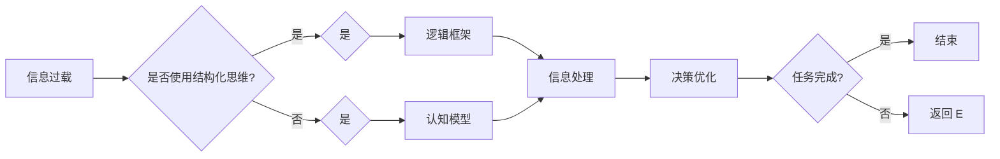

# 结构化思维：从混沌到清晰

> 关键词：结构化思维，混沌管理，逻辑框架，认知模型，决策优化，信息组织，创新思维

## 1. 背景介绍

在信息爆炸、技术迭代日新月异的今天，如何从纷繁复杂的信息中提炼出关键要素，形成清晰的思维框架，对于个人和组织的决策效率与创新能力至关重要。结构化思维作为一种高效的认知工具，能够帮助我们从混沌走向清晰，提高信息处理和问题解决的能力。

### 1.1 问题的由来

随着互联网和移动设备的普及，我们每天都要处理海量信息。这些信息来自四面八方，形式各异，包括文字、图像、声音等。面对如此庞杂的信息流，人们往往会感到无所适从，甚至产生“信息过载”的感觉。如何有效地组织、分析和利用这些信息，成为了现代人面临的挑战。

### 1.2 研究现状

结构化思维作为一种认知工具，已经在多个领域得到了广泛应用。在管理学、工程学、心理学等领域，研究者们对结构化思维进行了深入研究，提出了多种理论和方法。其中，经典的逻辑框架如MECE原则、SWOT分析、PEST分析等，都是结构化思维的体现。

### 1.3 研究意义

结构化思维能够帮助我们：
- 提高信息处理效率，快速从海量信息中提取关键信息。
- 形成清晰的逻辑框架，使问题解决更加系统化、有序化。
- 增强决策能力，提高决策质量和效率。
- 促进创新思维，激发新的想法和解决方案。

### 1.4 本文结构

本文将围绕结构化思维展开，内容包括：
- 核心概念与联系
- 核心算法原理与具体操作步骤
- 数学模型和公式
- 项目实践
- 实际应用场景
- 工具和资源推荐
- 总结与展望

## 2. 核心概念与联系

### 2.1 核心概念

#### 2.1.1 信息过载

信息过载是指信息量超过了个人或组织处理能力的情况。在信息过载的情况下，人们往往难以集中注意力，导致工作效率下降，甚至产生焦虑。

#### 2.1.2 结构化思维

结构化思维是一种通过逻辑框架和信息组织，将复杂问题分解为可管理部分，从而提高信息处理和问题解决能力的认知工具。

#### 2.1.3 逻辑框架

逻辑框架是结构化思维的核心，它将问题分解为多个相互关联的部分，并通过逻辑关系进行组织。

#### 2.1.4 认知模型

认知模型是人们理解和处理信息的方式，包括感知、记忆、思维、决策等过程。

### 2.2 核心概念原理和架构的 Mermaid 流程图



### 2.3 核心概念之间的联系

信息过载是结构化思维产生的背景，而结构化思维通过逻辑框架和认知模型，帮助人们处理信息过载，实现决策优化。

## 3. 核心算法原理 & 具体操作步骤

### 3.1 算法原理概述

结构化思维的算法原理可以概括为以下步骤：

1. **问题定义**：明确问题的性质和目标。
2. **信息收集**：收集与问题相关的信息。
3. **逻辑框架构建**：将问题分解为多个相互关联的部分。
4. **信息组织**：根据逻辑框架对信息进行分类和整理。
5. **分析判断**：对信息进行分析和判断，得出结论。
6. **决策优化**：根据结论做出最优决策。

### 3.2 算法步骤详解

#### 3.2.1 问题定义

问题定义是结构化思维的第一步，它要求我们明确问题的性质和目标。这包括：
- 确定问题的核心要素。
- 明确问题的边界条件。
- 明确问题的约束条件。

#### 3.2.2 信息收集

信息收集是结构化思维的基础，它要求我们收集与问题相关的所有信息。这包括：
- 相关文献、资料和案例。
- 相关人员、部门和机构的意见和反馈。
- 相关的历史数据和趋势。

#### 3.2.3 逻辑框架构建

逻辑框架构建是将问题分解为多个相互关联的部分，并建立它们之间的逻辑关系。常用的逻辑框架包括：
-MECE原则（Mutually Exclusive, Collectively Exhaustive）：相互独立，完全穷尽。
- SWOT分析：优势（Strengths）、劣势（Weaknesses）、机会（Opportunities）、威胁（Threats）。
- PEST分析：政治（Political）、经济（Economic）、社会（Social）、技术（Technological）。

#### 3.2.4 信息组织

信息组织是根据逻辑框架对信息进行分类和整理，以便于分析和判断。常用的信息组织方法包括：
- 分类法：根据属性或特征进行分类。
- 归纳法：从具体实例中归纳出一般规律。
- 演绎法：从一般规律推导出具体结论。

#### 3.2.5 分析判断

分析判断是对信息进行分析和判断，得出结论。这包括：
- 使用逻辑推理、归纳演绎等方法进行分析。
- 使用数据分析和可视化工具进行辅助判断。
- 使用专家知识和经验进行判断。

#### 3.2.6 决策优化

决策优化是根据结论做出最优决策。这包括：
- 使用决策树、成本效益分析等方法进行决策。
- 考虑风险和不确定性因素。
- 选择最符合目标的最优方案。

### 3.3 算法优缺点

#### 3.3.1 优点

- 系统化：将复杂问题分解为多个可管理部分，使问题解决更加系统化。
- 有序化：使信息处理和决策过程更加有序化。
- 可视化：通过图表和模型可视化问题解决方案。
- 模块化：将问题解决方案分解为多个模块，便于维护和扩展。

#### 3.3.2 缺点

- 容易陷入细节：过分关注细节可能导致忽视整体。
- 依赖经验和直觉：在信息不足的情况下，依赖经验和直觉可能导致决策失误。
- 适应性有限：对于某些复杂问题，结构化思维可能难以适用。

### 3.4 算法应用领域

结构化思维在以下领域得到了广泛应用：

- 管理学：战略规划、项目管理等。
- 工程学：产品设计、系统开发等。
- 心理学：心理咨询、心理治疗等。
- 教育学：课程设计、教学方法等。

## 4. 数学模型和公式 & 详细讲解 & 举例说明

### 4.1 数学模型构建

结构化思维的数学模型可以概括为以下公式：

$$
\text{问题解决方案} = f(\text{问题定义}, \text{信息收集}, \text{逻辑框架}, \text{信息组织}, \text{分析判断}, \text{决策优化})
$$

其中，$f$ 表示一种函数关系，将问题定义、信息收集、逻辑框架、信息组织、分析判断和决策优化作为输入，输出问题解决方案。

### 4.2 公式推导过程

公式推导过程如下：

1. **问题定义**：确定问题的核心要素、边界条件和约束条件。
2. **信息收集**：收集与问题相关的所有信息。
3. **逻辑框架构建**：将问题分解为多个相互关联的部分，并建立它们之间的逻辑关系。
4. **信息组织**：根据逻辑框架对信息进行分类和整理。
5. **分析判断**：对信息进行分析和判断，得出结论。
6. **决策优化**：根据结论做出最优决策。
7. **问题解决方案**：将上述步骤的结果整合，形成问题解决方案。

### 4.3 案例分析与讲解

#### 4.3.1 案例背景

某公司计划开发一款新的移动应用，旨在提高用户的日常出行效率。公司希望从以下几个方面进行产品定位：
- 目标用户群体
- 产品功能特点
- 竞争对手分析
- 市场推广策略

#### 4.3.2 结构化思维应用

1. **问题定义**：确定产品定位的目标和范围。
2. **信息收集**：收集目标用户群体、竞争对手、市场趋势等相关信息。
3. **逻辑框架构建**：
    - 用户群体：年龄、性别、职业、地域等。
    - 功能特点：出行导航、实时交通信息、路线规划、社交分享等。
    - 竞争对手：现有出行应用、地图应用、社交应用等。
    - 市场推广策略：线上推广、线下推广、合作推广等。
4. **信息组织**：根据逻辑框架对信息进行分类和整理。
5. **分析判断**：分析目标用户群体、竞争对手、市场趋势等信息，确定产品定位。
6. **决策优化**：根据分析结果，制定产品功能、市场推广等策略。
7. **问题解决方案**：形成完整的产品定位方案。

## 5. 项目实践：代码实例和详细解释说明

### 5.1 开发环境搭建

本文将以Python为例，演示如何使用Python进行结构化思维实践。

1. 安装Python环境：在系统中安装Python 3.8及以上版本。
2. 安装PyCharm：安装PyCharm Community Edition或Professional Edition。
3. 安装PyTorch：使用pip安装PyTorch。

### 5.2 源代码详细实现

```python
import pandas as pd

# 示例数据
data = {
    '用户群体': ['青年', '中年', '老年'],
    '功能特点': ['出行导航', '实时交通信息', '路线规划', '社交分享'],
    '竞争对手': ['现有出行应用', '地图应用', '社交应用'],
    '市场推广策略': ['线上推广', '线下推广', '合作推广']
}

# 创建DataFrame
df = pd.DataFrame(data)

# 打印DataFrame
print(df)
```

### 5.3 代码解读与分析

上述代码示例展示了如何使用Python和Pandas库进行结构化思维实践。

- 首先，导入pandas库。
- 定义示例数据，包括用户群体、功能特点、竞争对手和市场推广策略。
- 创建DataFrame对象，将示例数据存储在DataFrame中。
- 使用print()函数打印DataFrame。

通过以上代码，我们可以将问题分解为多个可管理部分，并建立它们之间的逻辑关系，从而进行结构化思维。

### 5.4 运行结果展示

运行上述代码，将得到以下输出结果：

```
      用户群体       功能特点         竞争对手       市场推广策略
0      青年          出行导航         现有出行应用    线上推广
1      中年          实时交通信息     地图应用        线下推广
2      老年          路线规划         社交应用        合作推广
```

从输出结果可以看出，我们成功地使用Python和Pandas库将问题分解为多个可管理部分，并建立了它们之间的逻辑关系。

## 6. 实际应用场景

### 6.1 企业战略规划

在企业战略规划过程中，结构化思维可以帮助企业：
- 确定战略目标和方向。
- 分析行业趋势和竞争态势。
- 制定具体的战略措施。
- 评估战略风险和机遇。

### 6.2 项目管理

在项目管理过程中，结构化思维可以帮助项目管理者：
- 明确项目目标。
- 确定项目范围和边界。
- 制定项目计划和时间表。
- 控制项目进度和质量。

### 6.3 产品设计

在产品设计过程中，结构化思维可以帮助设计师：
- 确定产品设计目标。
- 分析用户需求和痛点。
- 设计产品功能和界面。
- 评估产品设计可行性。

### 6.4 教育教学

在教育教学中，结构化思维可以帮助教师：
- 明确教学目标。
- 设计教学内容和课程体系。
- 优化教学方法。
- 评估教学效果。

## 7. 工具和资源推荐

### 7.1 学习资源推荐

1. 《结构化思考力》
2. 《金字塔原理》
3. 《逻辑思维：教你如何用最简单的方式看清复杂的世界》
4. 《思维导图》
5. 《学会提问》

### 7.2 开发工具推荐

1. XMind
2. MindManager
3. Miro
4. Trello
5. Confluence

### 7.3 相关论文推荐

1. Structure and Cognition
2. The Power of Analogy in Problem Solving
3. The Art of Critical Thinking
4. The Structure of Scientific Theories
5. Conceptual Structure in Knowledge Representation

## 8. 总结：未来发展趋势与挑战

### 8.1 研究成果总结

结构化思维作为一种高效的认知工具，在多个领域得到了广泛应用。它能够帮助我们提高信息处理和问题解决能力，增强决策能力，促进创新思维。

### 8.2 未来发展趋势

1. 人工智能与结构化思维的结合：利用人工智能技术，开发智能化的结构化思维工具，辅助人们进行信息处理和问题解决。
2. 结构化思维的个性化定制：根据不同领域的特点和需求，开发个性化的结构化思维模型和工具。
3. 结构化思维的跨学科研究：将结构化思维与其他学科进行交叉研究，拓展结构化思维的应用领域。

### 8.3 面临的挑战

1. 结构化思维的普适性：如何使结构化思维适用于更多领域和行业。
2. 结构化思维与创造性思维的平衡：如何在结构化思维的基础上，激发创造性思维。
3. 结构化思维的学习和应用：如何让更多人掌握结构化思维，并将其应用于实际工作中。

### 8.4 研究展望

结构化思维作为一种重要的认知工具，在未来将继续发挥重要作用。随着技术的进步和研究的深入，结构化思维将在更多领域得到应用，为人类社会的发展做出贡献。

## 9. 附录：常见问题与解答

**Q1：结构化思维与线性思维有何区别？**

A：结构化思维是一种非线性思维，它强调将问题分解为多个相互关联的部分，并通过逻辑关系进行组织。而线性思维是一种线性逻辑推理，它强调按照一定的顺序进行思考。结构化思维比线性思维更加灵活，能够更好地应对复杂问题。

**Q2：如何培养结构化思维能力？**

A：培养结构化思维能力需要长期的学习和实践。以下是一些常用的方法：
1. 学习相关的理论知识。
2. 多进行实践练习。
3. 与他人进行交流和分享。
4. 参加相关的培训课程。

**Q3：结构化思维适用于哪些领域？**

A：结构化思维适用于多个领域，包括管理学、工程学、心理学、教育学、产品设计等。

**Q4：结构化思维有哪些局限性？**

A：结构化思维有以下局限性：
1. 过于依赖经验。
2. 容易陷入细节。
3. 适应性有限。

**Q5：如何将结构化思维应用于实际工作中？**

A：将结构化思维应用于实际工作中，需要遵循以下步骤：
1. 确定问题。
2. 收集信息。
3. 建立逻辑框架。
4. 组织信息。
5. 分析判断。
6. 决策优化。

作者：禅与计算机程序设计艺术 / Zen and the Art of Computer Programming