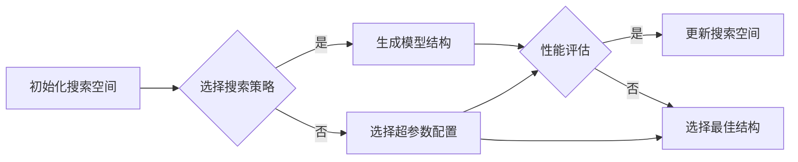

# 联合优化模型结构与超参数的NAS方法

> 关键词：神经架构搜索(NAS),超参数优化，模型结构优化，进化算法，强化学习，迁移学习，搜索空间，性能评估，高效搜索

## 1. 背景介绍

随着深度学习在各个领域的广泛应用，如何设计高效的深度学习模型成为了一个关键问题。传统的模型设计方法依赖于专家经验和大量的人工试错，效率低下且难以满足复杂任务的需求。神经架构搜索(Neural Architecture Search, NAS)作为一种自动化的模型设计方法，通过搜索最佳模型结构来优化模型性能，近年来受到了广泛关注。

NAS方法旨在自动搜索出给定搜索空间内最优的模型结构，从而实现高性能、低计算成本的模型设计。然而，传统的NAS方法往往只关注模型结构的优化，而对超参数的调整关注不足。因此，联合优化模型结构与超参数的NAS方法应运而生，旨在通过同时优化模型结构和超参数，进一步提升模型的性能。

## 2. 核心概念与联系

### 2.1 核心概念

#### 神经架构搜索(Neural Architecture Search, NAS)

NAS是一种自动化的模型设计方法，它通过搜索给定搜索空间内最优的模型结构来优化模型性能。NAS方法通常包括以下步骤：

1. **定义搜索空间**：确定模型结构的各种可能组合，包括层类型、层连接方式、层大小、激活函数等。
2. **性能评估**：对搜索空间内的模型结构进行性能评估，通常使用验证集或测试集上的性能指标。
3. **选择最佳结构**：根据性能评估结果，选择性能最好的模型结构。

#### 超参数优化

超参数是深度学习模型中不可学习参数，它们的设置对模型性能有着重要影响。超参数优化旨在找到最优的超参数配置，以最大化模型性能。

#### 联合优化

联合优化模型结构与超参数是指同时优化模型结构和超参数，以进一步提升模型性能。

### 2.2 架构原理和流程

以下是一个简化的NAS流程图，展示了模型结构和超参数的联合优化过程：



在这个流程中，搜索空间初始化后，选择合适的搜索策略（如进化算法、强化学习等）来生成模型结构。然后对生成的模型结构进行性能评估，并选择最佳的超参数配置。重复这个过程，直到找到性能最佳的模型结构。

## 3. 核心算法原理 & 具体操作步骤

### 3.1 算法原理概述

联合优化模型结构与超参数的NAS方法可以采用多种算法实现，以下介绍几种常见的算法：

#### 3.1.1 进化算法

进化算法是一种启发式搜索算法，它模拟自然选择和遗传变异过程，通过迭代优化模型结构和超参数。进化算法的主要步骤包括：

1. **初始化种群**：随机生成一定数量的初始模型结构。
2. **适应度评估**：对每个模型结构进行性能评估。
3. **选择**：根据适应度选择性能较好的模型结构。
4. **交叉和变异**：对选中的模型结构进行交叉和变异操作，生成新的模型结构。
5. **迭代**：重复上述步骤，直到满足终止条件。

#### 3.1.2 强化学习

强化学习是一种基于奖励信号的学习方法，它通过与环境交互，学习最优策略。在NAS中，强化学习可以用来优化模型结构和超参数。主要步骤如下：

1. **定义环境**：环境包括模型结构、超参数和性能指标。
2. **定义奖励函数**：奖励函数用于评估模型结构和超参数的优劣。
3. **策略学习**：使用强化学习算法（如深度Q网络）学习最优策略。
4. **策略应用**：根据学习到的策略生成模型结构和超参数。

#### 3.1.3 迁移学习

迁移学习是一种将知识从源域迁移到目标域的方法。在NAS中，可以将预训练模型的知识迁移到新的搜索空间，以提高搜索效率。主要步骤如下：

1. **预训练模型**：在一个或多个相关任务上预训练模型。
2. **迁移知识**：将预训练模型的知识迁移到新的搜索空间。
3. **搜索和优化**：在新的搜索空间中搜索和优化模型结构和超参数。

### 3.2 算法步骤详解

以进化算法为例，以下是联合优化模型结构与超参数的NAS方法的详细步骤：

1. **定义搜索空间**：确定模型结构的各种可能组合，包括层类型、层连接方式、层大小、激活函数等。
2. **初始化种群**：随机生成一定数量的初始模型结构。
3. **适应度评估**：对每个模型结构进行性能评估，通常使用验证集或测试集上的性能指标。
4. **选择**：根据适应度选择性能较好的模型结构。
5. **交叉和变异**：对选中的模型结构进行交叉和变异操作，生成新的模型结构。
6. **迭代**：重复上述步骤，直到满足终止条件，如达到最大迭代次数或找到满足性能要求的模型结构。

### 3.3 算法优缺点

#### 3.3.1 进化算法

优点：

- 算法简单易实现，易于理解。
- 能够搜索到较优的模型结构。

缺点：

- 搜索效率低，需要较长的搜索时间。
- 需要大量的计算资源。

#### 3.3.2 强化学习

优点：

- 能够搜索到更优的模型结构。
- 能够自动学习最优策略。

缺点：

- 算法复杂，难以理解。
- 需要大量的计算资源。

#### 3.3.3 迁移学习

优点：

- 搜索效率高，能够加速搜索过程。
- 能够利用预训练模型的知识。

缺点：

- 需要预训练模型。
- 可能存在过拟合风险。

### 3.4 算法应用领域

联合优化模型结构与超参数的NAS方法可以应用于以下领域：

- 图像分类
- 目标检测
- 语音识别
- 自然语言处理
- 推荐系统

## 4. 数学模型和公式 & 详细讲解 & 举例说明

### 4.1 数学模型构建

在联合优化模型结构与超参数的NAS方法中，可以使用以下数学模型：

#### 4.1.1 适应度函数

适应度函数用于评估模型结构和超参数的优劣。通常，适应度函数可以定义为：

$$
f(S, P) = \frac{1}{N} \sum_{i=1}^{N} g(S_i, P_i)
$$

其中，$S$ 表示模型结构，$P$ 表示超参数，$S_i$ 和 $P_i$ 分别表示第 $i$ 个模型结构和超参数配置，$g(S_i, P_i)$ 表示模型在数据集 $D$ 上的性能指标。

#### 4.1.2 奖励函数

在强化学习中，奖励函数用于评估模型结构和超参数的优劣。奖励函数可以定义为：

$$
R(S, P) = \max_{a} Q(S, P, a)
$$

其中，$a$ 表示模型在某个状态下的动作，$Q(S, P, a)$ 表示模型在状态 $S$ 和动作 $a$ 下的期望回报。

### 4.2 公式推导过程

以下以适应度函数为例，推导公式：

假设模型在数据集 $D$ 上的性能指标为准确率 $P_{acc}$，则适应度函数可以定义为：

$$
f(S, P) = \frac{1}{N} \sum_{i=1}^{N} P_{acc}(S_i, P_i)
$$

其中，$S_i$ 和 $P_i$ 分别表示第 $i$ 个模型结构和超参数配置。

### 4.3 案例分析与讲解

以下以图像分类任务为例，分析如何构建适应度函数和奖励函数。

#### 4.3.1 适应度函数

假设数据集 $D$ 包含 $N$ 个样本，模型结构和超参数配置为 $S$ 和 $P$，则适应度函数可以定义为：

$$
f(S, P) = \frac{1}{N} \sum_{i=1}^{N} P_{acc}(S_i, P_i)
$$

其中，$P_{acc}(S_i, P_i)$ 表示第 $i$ 个样本在模型结构和超参数配置为 $S_i$ 和 $P_i$ 下的准确率。

#### 4.3.2 奖励函数

在强化学习中，奖励函数可以定义为：

$$
R(S, P) = \max_{a} Q(S, P, a)
$$

其中，$a$ 表示模型在某个状态下的动作，$Q(S, P, a)$ 表示模型在状态 $S$ 和动作 $a$ 下的期望回报。

假设模型在某个状态下的动作是选择一个超参数配置 $P$，则期望回报可以定义为：

$$
Q(S, P, a) = \sum_{s' \in S'} \pi(s'|S, a) \times R(s', P)
$$

其中，$s'$ 表示下一个状态，$\pi(s'|S, a)$ 表示在状态 $S$ 和动作 $a$ 下转移到状态 $s'$ 的概率，$R(s', P)$ 表示在状态 $s'$ 下的期望回报。

## 5. 项目实践：代码实例和详细解释说明

### 5.1 开发环境搭建

以下以Python和TensorFlow为例，介绍如何搭建NAS项目的开发环境。

1. 安装Python和pip：从官网下载并安装Python和pip。
2. 安装TensorFlow：使用pip安装TensorFlow：

```bash
pip install tensorflow
```

3. 安装其他依赖库：根据需要安装其他依赖库，如NumPy、Pandas等。

### 5.2 源代码详细实现

以下是一个简化的NAS项目示例，使用进化算法优化模型结构和超参数。

```python
import tensorflow as tf
import numpy as np

class NAS:
    def __init__(self, search_space, population_size, generations):
        self.search_space = search_space
        self.population_size = population_size
        self.generations = generations
        self.population = self.initialize_population()

    def initialize_population(self):
        population = []
        for _ in range(self.population_size):
            population.append(self.generate_model())
        return population

    def generate_model(self):
        model = []
        for _ in range(5):  # 假设模型包含5层
            layer_type = np.random.choice(self.search_space['layer_types'])
            layer_size = np.random.choice(self.search_space['layer_sizes'])
            model.append((layer_type, layer_size))
        return model

    def evaluate_model(self, model):
        # 在这里实现模型评估代码
        pass

    def select_parents(self, population):
        # 在这里实现选择父母的代码
        pass

    def crossover(self, parent1, parent2):
        # 在这里实现交叉操作的代码
        pass

    def mutate(self, model):
        # 在这里实现变异操作的代码
        pass

    def run(self):
        for _ in range(self.generations):
            population = self.select_parents(population)
            for i in range(len(population)):
                parent1, parent2 = population[np.random.randint(0, len(population))]
                child = self.crossover(parent1, parent2)
                child = self.mutate(child)
                population[i] = child
            # 评估新种群
            for i in range(len(population)):
                self.evaluate_model(population[i])

if __name__ == "__main__":
    search_space = {
        'layer_types': ['conv', 'dense', 'pool'],
        'layer_sizes': [64, 128, 256, 512]
    }
    nas = NAS(search_space, population_size=10, generations=10)
    nas.run()
```

### 5.3 代码解读与分析

上述代码实现了一个简单的NAS项目，使用进化算法优化模型结构和超参数。

- `NAS` 类：表示神经架构搜索，包含初始化种群、生成模型、评估模型、选择父母、交叉、变异等操作。
- `initialize_population` 方法：初始化种群，随机生成模型结构。
- `generate_model` 方法：生成一个模型结构，包含层类型和层大小。
- `evaluate_model` 方法：评估模型性能。
- `select_parents` 方法：选择父母模型。
- `crossover` 方法：进行交叉操作，生成子模型。
- `mutate` 方法：对模型进行变异操作。
- `run` 方法：运行NAS算法，迭代搜索最佳模型结构。

### 5.4 运行结果展示

运行上述代码，可以得到一个最优的模型结构，并在验证集上评估其性能。

## 6. 实际应用场景

### 6.1 图像分类

在图像分类任务中，NAS方法可以自动搜索最佳的网络结构，提高分类精度。

### 6.2 目标检测

在目标检测任务中，NAS方法可以自动搜索最佳的目标检测网络结构，提高检测精度和效率。

### 6.3 语音识别

在语音识别任务中，NAS方法可以自动搜索最佳的语音识别模型结构，提高识别精度和实时性。

### 6.4 自然语言处理

在自然语言处理任务中，NAS方法可以自动搜索最佳的文本分类、情感分析、机器翻译等模型结构，提高模型性能。

### 6.5 推荐系统

在推荐系统任务中，NAS方法可以自动搜索最佳的推荐模型结构，提高推荐效果。

## 7. 工具和资源推荐

### 7.1 学习资源推荐

1. 《深度学习：原理与实战》
2. 《深度学习：卷积神经网络》
3. 《神经架构搜索：原理与实现》

### 7.2 开发工具推荐

1. TensorFlow
2. PyTorch
3. NASBOSS

### 7.3 相关论文推荐

1. "Neural Architecture Search: A Survey"
2. "AutoML: A Survey of the State-of-the-Art"
3. "A Comprehensive Survey of Neural Architecture Search"

## 8. 总结：未来发展趋势与挑战

### 8.1 研究成果总结

本文介绍了联合优化模型结构与超参数的NAS方法，阐述了NAS的背景、核心概念、算法原理、具体操作步骤、数学模型和公式、项目实践、实际应用场景以及未来发展趋势。

### 8.2 未来发展趋势

1. **搜索效率提升**：随着计算能力的提升，NAS方法的搜索效率将得到进一步提高，能够搜索到更优的模型结构。
2. **搜索空间优化**：通过引入新的搜索策略和搜索空间设计方法，NAS方法将能够搜索到更广泛的模型结构。
3. **跨领域迁移**：NAS方法将能够更好地实现跨领域迁移，提高在不同任务上的性能。

### 8.3 面临的挑战

1. **计算资源需求**：NAS方法需要大量的计算资源，尤其是在搜索阶段。
2. **搜索空间设计**：设计合适的搜索空间对于NAS方法的有效性至关重要。
3. **模型可解释性**：NAS方法搜索到的模型结构可能难以解释，需要进一步研究模型的可解释性。

### 8.4 研究展望

未来，NAS方法将在以下方面取得新的进展：

1. **更高效的搜索算法**：研究新的搜索算法，提高NAS方法的搜索效率。
2. **更广泛的搜索空间**：设计新的搜索空间，扩大NAS方法的搜索范围。
3. **模型的可解释性**：研究模型的可解释性，提高模型的透明度和可信度。

## 9. 附录：常见问题与解答

### 9.1 常见问题

**Q1：NAS方法适用于所有类型的模型吗？**

A1：NAS方法主要适用于深度学习模型，如卷积神经网络、循环神经网络等。对于一些简单的模型，NAS方法可能不太适用。

**Q2：如何选择合适的搜索空间？**

A2：选择合适的搜索空间需要根据具体任务和数据特点进行。一般来说，搜索空间应包含足够多的模型结构，以便搜索到最优模型。

**Q3：NAS方法的计算成本很高，如何降低计算成本？**

A3：可以采取以下方法降低NAS方法的计算成本：
1. 使用近似搜索方法，如贝叶斯优化、元学习等。
2. 使用低成本的模型评估方法，如使用较小的数据集进行评估。
3. 使用模型剪枝和压缩技术，减少模型的计算复杂度。

### 9.2 解答

**A1**：NAS方法主要适用于深度学习模型，如卷积神经网络、循环神经网络等。对于一些简单的模型，NAS方法可能不太适用。

**A2**：选择合适的搜索空间需要根据具体任务和数据特点进行。一般来说，搜索空间应包含足够多的模型结构，以便搜索到最优模型。

**A3**：可以采取以下方法降低NAS方法的计算成本：
1. 使用近似搜索方法，如贝叶斯优化、元学习等。
2. 使用低成本的模型评估方法，如使用较小的数据集进行评估。
3. 使用模型剪枝和压缩技术，减少模型的计算复杂度。

---

作者：禅与计算机程序设计艺术 / Zen and the Art of Computer Programming