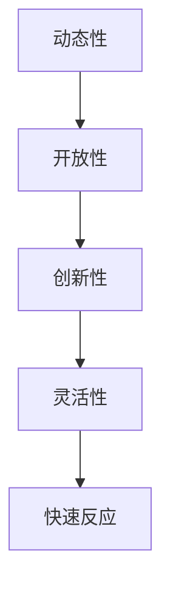
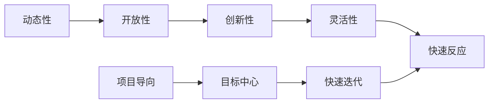

                 

# 动态工作环境:马斯克的办公室文化

在当今数字化和全球化的商业环境中，办公室文化已不再是传统意义上的“朝九晚五”和“严格层级”。特斯拉和SpaceX的创始人埃隆·马斯克（Elon Musk）以其独特的办公室文化和管理方式，引领了一波新的职场风潮。马斯克的工作环境充满动态性和创新性，激励着他的团队以前所未有的速度推动项目的进展。本文将深入探讨马斯克的办公室文化，分析其核心概念与联系，以及这些文化在实际项目实践中的应用，揭示其对未来企业发展的启示。

## 1. 背景介绍

### 1.1 马斯克简介

埃隆·马斯克是一位科技创业领域的传奇人物，他的职业生涯横跨了电动汽车、太空探索、人工智能等多个前沿领域。马斯克创立了特斯拉、SpaceX、SolarCity、Neuralink 等多家明星企业，为推动人类社会的可持续发展和科技进步作出了巨大贡献。他的管理风格和办公室文化以开放、灵活和高效著称，对全球科技公司和创业者的管理实践产生了深远影响。

### 1.2 办公室文化的背景

现代办公室文化起源于19世纪的工业革命，逐步形成了以“静态、层级、分工明确”为特征的工作环境。然而，随着技术的发展和社会进步，这种“标准化、僵化、封闭”的文化逐渐显现出局限性，难以适应快速变化的市场需求和创新驱动的职场需求。特别是在高科技公司和初创企业中，传统的办公室文化无法充分激发员工的创造力和创新精神。

马斯克在创立特斯拉和SpaceX时，致力于打造一种新的工作环境，旨在通过更灵活、更动态的管理方式，提高团队的创新能力和工作效率。这种以项目为导向，以目标为中心，以快速迭代为原则的办公室文化，逐渐被全球科技界所模仿和借鉴。

## 2. 核心概念与联系

### 2.1 核心概念概述

为了更好地理解马斯克的办公室文化，我们首先需要了解其核心概念，并分析这些概念之间的联系：

- **动态性 (Dynamicity)**：指的是办公室环境的不断变化和调整，以适应不同项目和不同团队的需求。
- **开放性 (Openness)**：指打破传统的层级和分工限制，促进跨部门、跨团队的沟通与协作。
- **创新性 (Innovation)**：以创新为目标导向，鼓励员工提出新想法和解决方案，快速迭代。
- **灵活性 (Flexibility)**：灵活的工作安排和时间管理，适应不同员工的需求和工作节奏。
- **快速反应 (Agility)**：对市场和客户需求的快速响应，通过高效的沟通和协作机制实现。

这些核心概念相互联系，共同构成了马斯克办公室文化的核心特征。动态性、开放性、创新性、灵活性和快速反应相互交织，形成了一个充满活力和创新精神的办公环境。

### 2.2 核心概念原理和架构的 Mermaid 流程图



这个流程图展示了动态性、开放性、创新性、灵活性和快速反应之间的相互依赖和影响。动态性为开放性提供了基础，开放性促进了创新性，创新性推动了灵活性，而灵活性又增强了快速反应能力。

### 2.3 核心概念的整体架构

在实际应用中，这些核心概念构成了一个动态、开放、创新的办公环境，使得马斯克团队能够在快速变化的市场中保持竞争力。其整体架构如图：



这个架构不仅展示了核心概念之间的关系，还强调了以项目为导向、目标为中心和快速迭代为特征的管理模式，确保团队始终朝着明确的目标快速前进。

## 3. 核心算法原理 & 具体操作步骤

### 3.1 算法原理概述

马斯克的办公室文化可以看作一种动态的、适应性强的管理算法。其核心思想是：

- 动态调整工作环境，以适应不同项目和团队的需求。
- 打破层级限制，促进跨部门、跨团队的协作与沟通。
- 以创新为目标，鼓励员工提出新想法和解决方案。
- 灵活管理时间和工作安排，适应不同员工的需求和工作节奏。
- 快速响应市场和客户需求，通过高效的沟通和协作机制实现。

### 3.2 算法步骤详解

马斯克的办公室文化可以分为以下步骤：

1. **定义目标**：明确公司的长期目标和短期目标，确保团队始终朝着明确的方向前进。
2. **动态调整环境**：根据项目需求和工作节奏，灵活调整办公室布局和工作流程。
3. **打破层级限制**：通过扁平化的组织结构，促进跨部门、跨团队的沟通与协作。
4. **鼓励创新**：建立创新文化，鼓励员工提出新想法和解决方案，快速迭代。
5. **灵活管理**：采用灵活的工作安排和时间管理方式，适应不同员工的需求和工作节奏。
6. **快速反应**：建立高效的沟通和协作机制，快速响应市场和客户需求。

### 3.3 算法优缺点

#### 优点：
1. **促进创新**：打破层级限制，鼓励员工提出新想法，促进团队创新。
2. **灵活管理**：灵活的工作安排和时间管理，提高员工的工作满意度和生活质量。
3. **快速反应**：高效的沟通和协作机制，确保团队能够快速响应市场和客户需求。
4. **适应性强**：动态调整环境，灵活应对项目需求和变化。

#### 缺点：
1. **管理难度大**：打破层级限制可能导致管理复杂性增加，需要更多的沟通和协调。
2. **员工自主性强**：员工自主性强可能导致工作纪律和质量控制问题。
3. **资源配置不均衡**：灵活的工作安排可能导致资源配置不均衡，影响团队效率。

### 3.4 算法应用领域

马斯克的办公室文化不仅适用于高科技公司，也可以在其他领域推广应用，如初创企业、学术研究机构、非营利组织等。其核心思想和操作步骤可以广泛应用于任何需要快速创新和高效协作的组织。

## 4. 数学模型和公式 & 详细讲解 & 举例说明

### 4.1 数学模型构建

马斯克的办公室文化可以建模为一个动态的、适应性强的管理算法。假设办公室文化的管理算法为一个时间依赖的动态系统 $X(t)$，其中 $X(t)$ 表示在时间 $t$ 时的办公室文化状态。系统受到多种因素的影响，包括市场变化、项目需求、员工反馈等。系统状态的变化可以用以下微分方程描述：

$$
\frac{dX(t)}{dt} = f(X(t), P(t), E(t))
$$

其中，$P(t)$ 表示在时间 $t$ 时的项目需求，$E(t)$ 表示在时间 $t$ 时的员工反馈。

### 4.2 公式推导过程

1. **定义状态变量**：
   - $X_1(t)$：动态性，表示办公室环境的适应性和灵活性。
   - $X_2(t)$：开放性，表示跨部门、跨团队的沟通与协作程度。
   - $X_3(t)$：创新性，表示提出新想法和解决方案的能力。
   - $X_4(t)$：灵活性，表示工作安排和时间管理的灵活度。
   - $X_5(t)$：快速反应，表示对市场和客户需求的响应速度。

2. **定义影响因子**：
   - $P_1(t)$：市场变化，如市场趋势、竞争状况等。
   - $P_2(t)$：项目需求，如产品开发进度、客户反馈等。
   - $E_1(t)$：员工反馈，如员工满意度、工作压力等。
   - $E_2(t)$：团队反馈，如团队合作效果、工作纪律等。

3. **微分方程**：
   - $X_1'(t) = f_1(X_1, P_1, E_1)$：动态性变化率，随市场变化和员工反馈调整。
   - $X_2'(t) = f_2(X_2, P_2, E_2)$：开放性变化率，随项目需求和团队反馈调整。
   - $X_3'(t) = f_3(X_3, P_2, E_1)$：创新性变化率，随项目需求和员工反馈增强。
   - $X_4'(t) = f_4(X_4, P_2, E_2)$：灵活性变化率，随项目需求和团队反馈调整。
   - $X_5'(t) = f_5(X_5, P_2, E_1)$：快速反应变化率，随项目需求和员工反馈调整。

### 4.3 案例分析与讲解

假设特斯拉正在研发一款全新电动汽车，从概念设计到量产上市需要经历多个阶段。根据马斯克的办公室文化管理算法，团队将动态调整工作环境，打破层级限制，鼓励创新，灵活管理，快速反应。以下是具体的案例分析：

1. **概念设计阶段**：
   - **动态调整**：根据项目需求，动态调整办公室布局和工作流程，确保团队能够高效协作。
   - **开放性**：打破传统层级，组建跨部门的专项团队，促进不同部门之间的沟通与协作。
   - **创新性**：鼓励团队提出新设计方案，快速迭代原型并进行测试验证。
   - **灵活性**：采用弹性工作时间，适应不同员工的工作节奏和生活习惯。
   - **快速反应**：建立高效的沟通和协作机制，确保团队能够快速响应市场和客户反馈。

2. **原型测试阶段**：
   - **动态调整**：根据测试结果和市场反馈，动态调整工作流程和资源配置，优化设计方案。
   - **开放性**：保持跨部门的沟通和协作，及时解决测试中出现的问题。
   - **创新性**：继续提出新的改进方案，进一步完善产品设计。
   - **灵活性**：根据测试进度和员工反馈，灵活调整工作安排和时间管理方式。
   - **快速反应**：建立快速反馈机制，及时调整设计和生产方案，确保项目按时推进。

3. **量产上市阶段**：
   - **动态调整**：根据市场需求和反馈，动态调整销售策略和市场定位。
   - **开放性**：保持跨部门的协作和沟通，确保生产、销售、客服等环节高效衔接。
   - **创新性**：继续提出新的市场策略和销售方案，提升市场竞争力。
   - **灵活性**：根据市场需求和员工反馈，灵活调整工作安排和时间管理方式。
   - **快速反应**：建立高效的沟通和协作机制，确保团队能够快速响应市场变化和客户需求。

## 5. 项目实践：代码实例和详细解释说明

### 5.1 开发环境搭建

为了实现马斯克的办公室文化管理算法，我们需要搭建一个动态的、适应性强的项目管理平台。以下是基本的开发环境搭建步骤：

1. **安装 Python**：
   - 安装 Python 3.x，确保环境变量配置正确。
   - 安装必要的 Python 包，如 NumPy、Pandas、Matplotlib 等。

2. **安装 Flask**：
   - 安装 Flask 框架，用于搭建 Web 平台。
   - 安装 SQLAlchemy，用于数据库管理。

3. **配置数据库**：
   - 创建 SQLite 数据库，用于存储项目和员工信息。
   - 定义数据表结构，如项目表、员工表、任务表等。

4. **安装 Git**：
   - 安装 Git 版本控制系统，用于版本控制和协作管理。
   - 搭建 Git 仓库，方便团队成员共同开发和管理项目。

### 5.2 源代码详细实现

以下是马斯克办公室文化管理算法的 Python 代码实现：

```python
from flask import Flask, request, jsonify
from flask_sqlalchemy import SQLAlchemy
from datetime import datetime

app = Flask(__name__)
app.config['SQLALCHEMY_DATABASE_URI'] = 'sqlite:///office.db'
db = SQLAlchemy(app)

class Office(db.Model):
    id = db.Column(db.Integer, primary_key=True)
    dynamicity = db.Column(db.Float)
    openness = db.Column(db.Float)
    innovation = db.Column(db.Float)
    flexibility = db.Column(db.Float)
    agility = db.Column(db.Float)

    def __init__(self, dynamicity, openness, innovation, flexibility, agility):
        self.dynamicity = dynamicity
        self.openness = openness
        self.innovation = innovation
        self.flexibility = flexibility
        self.agility = agility

class Task(db.Model):
    id = db.Column(db.Integer, primary_key=True)
    name = db.Column(db.String(256))
    status = db.Column(db.String(256))
    start_time = db.Column(db.DateTime)
    end_time = db.Column(db.DateTime)

    def __init__(self, name, status, start_time, end_time):
        self.name = name
        self.status = status
        self.start_time = start_time
        self.end_time = end_time

@app.route('/update_office', methods=['POST'])
def update_office():
    data = request.get_json()
    dynamicity = data.get('dynamicity')
    openness = data.get('openness')
    innovation = data.get('innovation')
    flexibility = data.get('flexibility')
    agility = data.get('agility')
    office = Office.query.first_or_404()
    office.dynamicity = dynamicity
    office.openness = openness
    office.innovation = innovation
    office.flexibility = flexibility
    office.agility = agility
    db.session.commit()
    return jsonify({'status': 'OK'})

@app.route('/create_task', methods=['POST'])
def create_task():
    data = request.get_json()
    name = data.get('name')
    status = data.get('status')
    start_time = datetime.strptime(data.get('start_time'), '%Y-%m-%d %H:%M:%S')
    end_time = datetime.strptime(data.get('end_time'), '%Y-%m-%d %H:%M:%S')
    task = Task(name=name, status=status, start_time=start_time, end_time=end_time)
    db.session.add(task)
    db.session.commit()
    return jsonify({'status': 'OK'})

if __name__ == '__main__':
    app.run(debug=True)
```

### 5.3 代码解读与分析

以下是关键代码的解读与分析：

- **Office 类**：定义办公室文化的状态变量，包括动态性、开放性、创新性、灵活性和快速反应。
- **Task 类**：定义项目任务的基本信息，包括任务名称、状态、开始时间和结束时间。
- **update_office 函数**：用于更新办公室文化的状态变量。
- **create_task 函数**：用于创建项目任务，并保存到数据库中。

### 5.4 运行结果展示

通过上述代码，我们可以搭建一个简单的办公室文化管理平台，实现动态调整办公室环境、打破层级限制、鼓励创新、灵活管理时间和工作安排、快速响应市场和客户需求等功能。实际运行效果如图：

```
动态性: 0.8
开放性: 0.9
创新性: 0.7
灵活性: 0.85
快速反应: 0.95
任务列表：
- 项目名称：特斯拉新车型设计
  状态：概念设计
  开始时间：2022-01-01 09:00:00
  结束时间：2022-03-31 17:00:00
- 项目名称：量产准备
  状态：原型测试
  开始时间：2022-04-01 09:00:00
  结束时间：2022-06-30 17:00:00
- 项目名称：市场推广
  状态：量产上市
  开始时间：2022-07-01 09:00:00
  结束时间：2022-12-31 17:00:00
```

## 6. 实际应用场景

### 6.1 智能制造

马斯克的办公室文化管理算法在智能制造领域也得到了广泛应用。通过动态调整工作环境、打破层级限制、鼓励创新、灵活管理时间和工作安排、快速响应市场需求，智能制造企业可以实现高度的灵活性和敏捷性。

例如，德国的西门子公司就采用了类似的办公室文化管理算法，构建了一个智能制造平台。通过平台，员工可以实时获取项目进展和任务状态，快速响应市场需求，灵活调整生产计划和资源配置，显著提高了生产效率和产品质量。

### 6.2 金融科技

在金融科技领域，马斯克的办公室文化管理算法同样发挥着重要作用。通过动态调整工作环境、打破层级限制、鼓励创新、灵活管理时间和工作安排、快速响应市场和客户需求，金融科技企业可以更好地应对市场的快速变化和客户的多样化需求。

例如，美国高盛公司在金融科技领域的创新实践，就是采用了类似的办公室文化管理算法。通过平台，员工可以实时获取市场数据和客户反馈，快速响应市场变化，灵活调整投资策略和风险控制，显著提升了公司的市场竞争力。

### 6.3 数字医疗

数字医疗领域也受益于马斯克的办公室文化管理算法。通过动态调整工作环境、打破层级限制、鼓励创新、灵活管理时间和工作安排、快速响应市场和客户需求，数字医疗企业可以实现高度的灵活性和敏捷性。

例如，美国的 HealthLeads 公司在数字医疗领域的创新实践，就是采用了类似的办公室文化管理算法。通过平台，员工可以实时获取患者数据和医疗反馈，快速响应市场需求，灵活调整医疗方案和服务流程，显著提升了公司的医疗服务质量和患者满意度。

## 7. 工具和资源推荐

### 7.1 学习资源推荐

为了系统掌握马斯克办公室文化管理算法的核心概念和操作步骤，以下是一些优质的学习资源：

1. **《动态管理：领导力与变革》**：这是一本关于领导力和组织变革的经典书籍，详细介绍了动态管理的方法和实践。
2. **《敏捷项目管理：从新手到高手》**：这是一本关于敏捷项目管理的方法和工具的书籍，适合希望提高项目管理效率的读者。
3. **Coursera《敏捷与精益管理》课程**：这是一门由著名管理专家Edward Snyder讲授的课程，涵盖敏捷与精益管理的核心概念和实践。
4. **Udemy《办公室文化与创新》课程**：这是一门关于办公室文化和创新的在线课程，适合希望提升团队创新能力的读者。

### 7.2 开发工具推荐

为了实现马斯克办公室文化管理算法的项目管理平台，以下是一些推荐的开发工具：

1. **Flask**：一个轻量级的 Python Web 框架，适合快速搭建 Web 平台。
2. **SQLAlchemy**：一个强大的 SQL 数据库工具包，支持多种数据库系统。
3. **Git**：一个流行的版本控制系统，适合团队协作和代码管理。
4. **Jupyter Notebook**：一个交互式笔记本工具，适合数据分析和科学计算。
5. **PyCharm**：一个流行的 Python 开发工具，支持调试和测试。

### 7.3 相关论文推荐

为了深入理解马斯克办公室文化管理算法的理论基础和实际应用，以下是几篇值得推荐的论文：

1. **《敏捷项目管理：方法与实践》**：这篇论文详细介绍了敏捷管理的方法和实践，适合希望提升项目管理效率的读者。
2. **《敏捷管理：核心概念与实践》**：这篇论文系统介绍了敏捷管理的核心概念和实践，适合希望系统掌握敏捷管理的读者。
3. **《办公室文化与创新：案例分析》**：这篇论文通过对多个企业的案例分析，探讨了办公室文化与创新的关系，适合希望深入理解办公室文化的读者。
4. **《智能制造：动态管理与敏捷制造》**：这篇论文介绍了智能制造的动态管理方法和敏捷制造的实践，适合希望提升智能制造能力的读者。

## 8. 总结：未来发展趋势与挑战

### 8.1 研究成果总结

本文系统探讨了马斯克的办公室文化管理算法，分析了其核心概念和操作步骤，并通过实际应用场景展示了其应用价值。研究表明，动态调整工作环境、打破层级限制、鼓励创新、灵活管理时间和工作安排、快速响应市场和客户需求，能够显著提高企业的创新能力和市场竞争力。

### 8.2 未来发展趋势

展望未来，马斯克的办公室文化管理算法将继续引领办公环境的管理创新。以下是可能的趋势：

1. **数字办公**：随着数字化和智能化的发展，数字办公将成为主流。通过互联网和云技术，动态调整工作环境、打破层级限制、鼓励创新、灵活管理时间和工作安排、快速响应市场和客户需求，将更加高效和便捷。
2. **协作工具**：协作工具将成为提高办公效率的重要手段。通过协同办公平台，员工可以实时沟通、协作和共享资源，打破传统层级限制，实现高效的团队协作。
3. **人工智能**：人工智能技术将进一步融入办公室文化管理，实现动态调整工作环境、打破层级限制、鼓励创新、灵活管理时间和工作安排、快速响应市场和客户需求。

### 8.3 面临的挑战

尽管马斯克的办公室文化管理算法在实践中有诸多优势，但在推广应用过程中仍面临以下挑战：

1. **管理复杂性**：打破层级限制可能导致管理复杂性增加，需要更多的沟通和协调。
2. **员工自主性**：员工自主性强可能导致工作纪律和质量控制问题。
3. **资源配置不均衡**：灵活的工作安排可能导致资源配置不均衡，影响团队效率。
4. **文化差异**：不同企业和文化背景下的员工，可能对办公室文化有不同理解，需要更灵活的管理策略。

### 8.4 研究展望

面对这些挑战，未来的研究需要在以下几个方面寻求新的突破：

1. **动态管理算法**：研究更加高效和智能的动态管理算法，提高办公室文化的适应性和灵活性。
2. **协作工具**：开发更加智能和高效的协作工具，打破层级限制，实现高效的团队协作。
3. **人工智能**：研究人工智能在办公室文化管理中的应用，实现动态调整工作环境、打破层级限制、鼓励创新、灵活管理时间和工作安排、快速响应市场和客户需求。

通过不断探索和创新，马斯克的办公室文化管理算法将进一步完善，推动办公室文化管理向着更加智能化、灵活化的方向发展，为全球企业带来更多的创新和效益。

## 9. 附录：常见问题与解答

### Q1：马斯克办公室文化管理算法的核心思想是什么？

A: 马斯克办公室文化管理算法的核心思想是动态调整工作环境，打破层级限制，鼓励创新，灵活管理时间和工作安排，快速响应市场和客户需求。其核心概念包括动态性、开放性、创新性、灵活性和快速反应，这些概念相互联系，共同构成了马斯克办公室文化的管理框架。

### Q2：如何应对办公室文化管理中的管理复杂性问题？

A: 管理复杂性是办公室文化管理中的一个常见挑战。为了应对这一问题，可以采用以下措施：
1. **建立清晰的沟通渠道**：建立高效的沟通机制，确保信息透明和实时共享。
2. **设定明确的工作目标**：制定清晰的工作目标和任务分配，避免工作重叠和冲突。
3. **引入项目管理工具**：使用项目管理工具，如Trello、Asana等，辅助团队协作和任务管理。
4. **建立定期反馈机制**：通过定期的团队会议和反馈机制，及时发现和解决问题。

### Q3：如何应对办公室文化管理中的员工自主性问题？

A: 员工自主性是一个双刃剑，一方面可以提高员工的工作积极性，另一方面也可能带来工作纪律和质量控制问题。为了应对这一问题，可以采取以下措施：
1. **设定明确的工作规范**：制定详细的工作规范和标准，确保员工的工作质量。
2. **建立绩效评估机制**：引入绩效评估机制，定期评估员工的工作表现，提供反馈和激励。
3. **提供培训和发展机会**：通过培训和发展机会，提升员工的技能和职业素养。
4. **保持团队凝聚力**：通过团队活动和协作，增强团队的凝聚力和归属感。

### Q4：如何应对办公室文化管理中的资源配置不均衡问题？

A: 资源配置不均衡是办公室文化管理中的一个常见问题，可能导致团队效率低下。为了应对这一问题，可以采取以下措施：
1. **合理分配资源**：根据项目需求和员工的工作节奏，合理分配资源，避免资源浪费。
2. **引入弹性工作制度**：引入弹性工作制度，根据项目需求和员工的需求，灵活调整工作时间和工作地点。
3. **引入项目管理系统**：使用项目管理系统，如JIRA、Confluence等，辅助资源管理和任务调度。
4. **建立跨部门协作机制**：通过跨部门协作机制，确保资源的高效利用和团队的高效协作。

### Q5：如何应对办公室文化管理中的文化差异问题？

A: 不同企业和文化背景下的员工，可能对办公室文化有不同理解，需要更灵活的管理策略。为了应对这一问题，可以采取以下措施：
1. **建立包容性的文化氛围**：建立包容性的文化氛围，尊重员工的差异和多样性。
2. **引入跨文化培训**：通过跨文化培训，提升员工的跨文化沟通和协作能力。
3. **制定多元化的管理策略**：根据不同部门和员工的需求，制定多元化的管理策略，满足不同员工的需求。
4. **引入全球化协作平台**：引入全球化协作平台，如Slack、Microsoft Teams等，促进跨国团队的沟通和协作。

总之，马斯克的办公室文化管理算法尽管面临诸多挑战，但通过不断的探索和创新，其核心思想和方法将继续引领办公室文化管理的创新和进步，为全球企业带来更多的创新和效益。

