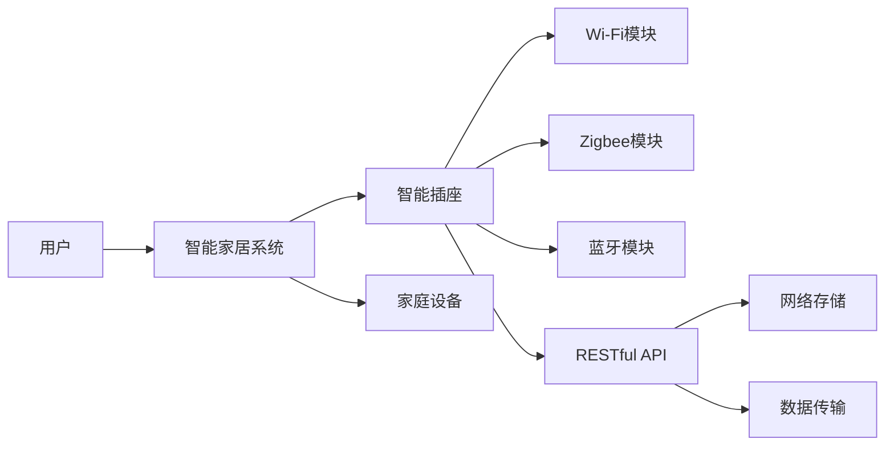
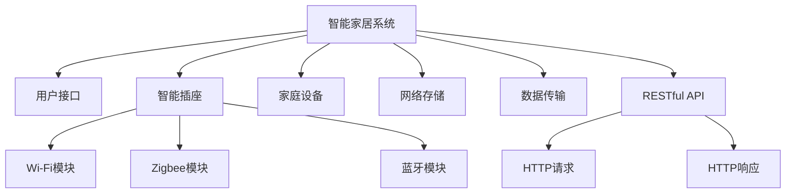

                 

# 基于Java的智能家居设计：模块化智能插座的设计与实现

> 关键词：智能家居, Java, 模块化设计, 智能插座, 物联网, RESTful API

## 1. 背景介绍

随着科技的发展，智能家居已经逐渐成为人们日常生活的一部分。通过将家庭设备连接到互联网，用户可以远程控制和管理家庭环境，享受智能化的生活体验。其中，智能插座作为基础组件，负责提供设备电源控制、状态监测等功能，是构建智能家居系统的关键。

本项目旨在设计并实现一款模块化智能插座，支持Wi-Fi、Zigbee、蓝牙等多种通信协议，通过Java技术实现与家庭设备的灵活互联，提供便捷、可靠的智能家居解决方案。模块化设计使得该智能插座具有高度的灵活性和可扩展性，用户可以根据需求自行添加功能模块，满足不同场景下的智能需求。

## 2. 核心概念与联系

### 2.1 核心概念概述

在智能家居的实现过程中，涉及多个关键概念，包括：

- **智能家居**：通过物联网技术将家庭设备互联，实现远程控制、自动化管理等功能，提升生活质量。
- **Java**：一种高效、灵活、安全的编程语言，广泛应用于企业级应用和移动端开发，具有良好的跨平台特性。
- **模块化设计**：将系统拆分为多个独立的模块，每个模块实现特定的功能，模块间通过标准接口通信，使得系统具有高度的灵活性和可扩展性。
- **智能插座**：具备Wi-Fi、Zigbee、蓝牙等多种通信协议支持，能够控制家电设备，监测设备状态，提供网络数据存储和传输功能。
- **RESTful API**：基于HTTP协议的轻量级接口设计风格，支持RESTful架构，便于实现分布式系统与微服务的交互。

这些核心概念共同构成了智能家居系统的基础架构，通过Java技术实现，能够提供稳定、可靠、高效的用户体验。

### 2.2 核心概念的关系

以下是一个Mermaid流程图，展示了智能家居系统的主要组件及其相互关系：



这个流程图展示了智能家居系统的基本结构：

1. 用户通过智能家居系统控制和管理家庭设备。
2. 智能家居系统由智能插座、家庭设备等组件组成。
3. 智能插座支持Wi-Fi、Zigbee、蓝牙等多种通信协议，实现设备互联。
4. RESTful API提供网络接口，实现系统内部的通信和数据交互。
5. 网络存储和数据传输功能，保障数据的安全性和可靠性。

### 2.3 核心概念的整体架构

整个智能家居系统的核心架构如下图所示：



这个架构图展示了智能家居系统的主要功能模块：

1. 用户接口：提供用户与系统交互的界面，支持各种智能控制操作。
2. 智能插座：实现设备的电源控制、状态监测等功能，支持多种通信协议。
3. 家庭设备：连接到智能插座，实现各种自动化控制。
4. 网络存储：存储和管理家庭设备的数据，保障数据安全。
5. 数据传输：实现设备间的数据交换，支持多种通信协议。
6. RESTful API：提供网络接口，实现系统内部的数据交互。

通过这些核心组件的协同工作，智能家居系统能够提供安全、稳定、高效的智能家居解决方案，满足用户的多样化需求。

## 3. 核心算法原理 & 具体操作步骤
### 3.1 算法原理概述

智能插座的设计和实现需要遵循一定的算法原理，主要包括：

- **电源控制算法**：实现电源的开关控制、功率监测等功能，通过定时器、传感器等技术实现。
- **状态监测算法**：实时监测设备状态，通过传感器、通信协议等技术实现。
- **通信协议算法**：支持Wi-Fi、Zigbee、蓝牙等多种通信协议，通过Java技术实现。
- **网络接口设计**：实现RESTful API接口，支持HTTP请求和响应，通过Java技术实现。
- **数据存储和传输算法**：实现数据的存储和传输，通过网络存储和数据传输技术实现。

这些算法原理构成了智能插座设计和实现的基础，通过Java技术实现，能够提供稳定、高效、可靠的用户体验。

### 3.2 算法步骤详解

以下是智能插座设计和实现的详细步骤：

1. **需求分析**：
   - 分析用户需求，确定智能插座的功能模块。
   - 确定通信协议、电源控制、状态监测等核心功能。
   - 确定网络接口设计、数据存储和传输等辅助功能。

2. **设计模块化结构**：
   - 将系统拆分为多个独立的模块，每个模块实现特定的功能。
   - 定义模块之间的通信协议和接口，确保模块之间的协同工作。

3. **实现电源控制算法**：
   - 使用定时器技术实现设备的开关控制。
   - 使用传感器技术实现设备的功率监测。

4. **实现状态监测算法**：
   - 使用传感器技术实时监测设备状态。
   - 使用通信协议技术实现状态数据的传输和存储。

5. **实现通信协议算法**：
   - 支持Wi-Fi、Zigbee、蓝牙等多种通信协议。
   - 实现通信协议的转换和数据的打包和解包。

6. **设计RESTful API接口**：
   - 设计API接口，实现设备的远程控制和管理。
   - 使用Java技术实现API接口的开发和部署。

7. **实现数据存储和传输算法**：
   - 使用网络存储技术实现数据的存储和管理。
   - 使用数据传输技术实现数据的传输和同步。

8. **测试和优化**：
   - 对系统进行全面的测试，包括功能测试、性能测试、安全测试等。
   - 根据测试结果，对系统进行优化和改进。

### 3.3 算法优缺点

智能插座的设计和实现具有以下优点：

- **模块化设计**：系统拆分为多个独立的模块，每个模块实现特定的功能，模块间通过标准接口通信，使得系统具有高度的灵活性和可扩展性。
- **跨平台支持**：使用Java技术实现，具有跨平台特性，支持多种操作系统和设备。
- **多功能集成**：支持多种通信协议、电源控制、状态监测等核心功能，提供丰富的智能家居解决方案。

同时，智能插座的设计和实现也存在一些缺点：

- **开发成本较高**：模块化设计和多种通信协议的实现需要较高的开发成本和技术投入。
- **系统复杂度较高**：系统功能模块众多，设计和实现过程较为复杂。
- **性能优化难度较大**：需要针对不同的通信协议和功能模块进行优化，以提高系统的性能和稳定性。

### 3.4 算法应用领域

智能插座可以广泛应用于智能家居系统中的各种设备，如灯光、空调、电视等，支持多种通信协议和电源控制功能。通过Java技术实现，智能插座能够提供稳定、高效、可靠的智能家居解决方案，满足用户的多样化需求。

## 4. 数学模型和公式 & 详细讲解  
### 4.1 数学模型构建

在智能插座的设计和实现过程中，涉及多个数学模型，主要包括：

- **电源控制模型**：使用定时器技术实现设备的开关控制，通过时间间隔和延迟实现电源控制。
- **状态监测模型**：使用传感器技术实时监测设备状态，通过传感器数据实现状态监测。
- **通信协议模型**：支持Wi-Fi、Zigbee、蓝牙等多种通信协议，通过数据包格式和通信协议实现数据传输。
- **RESTful API模型**：实现RESTful API接口，使用HTTP协议实现数据的远程传输和存储。

这些数学模型共同构成了智能插座设计和实现的基础，通过Java技术实现，能够提供稳定、高效、可靠的用户体验。

### 4.2 公式推导过程

以下是一些关键公式的推导过程：

**电源控制公式**：

设设备开关时间为 $t_{on}$，电源开关控制周期为 $T$，则电源控制算法可以表示为：

$$
t_{off} = T - t_{on}
$$

其中 $t_{off}$ 为电源关闭时间，$T$ 为电源控制周期。

**状态监测公式**：

设传感器采样频率为 $f_s$，传感器采样时间为 $t_s$，则状态监测算法可以表示为：

$$
t_s = \frac{1}{f_s}
$$

其中 $t_s$ 为传感器采样时间，$f_s$ 为传感器采样频率。

**通信协议公式**：

设通信协议的帧格式长度为 $L$，数据传输速率 $r$，则通信协议算法可以表示为：

$$
L = r \times t
$$

其中 $L$ 为通信协议的帧格式长度，$r$ 为数据传输速率，$t$ 为数据传输时间。

**RESTful API公式**：

设API接口请求时间为 $t_r$，响应时间为 $t_a$，则RESTful API接口算法可以表示为：

$$
t_{req} = t_r + t_a
$$

其中 $t_{req}$ 为API接口请求时间，$t_r$ 为API接口请求时间，$t_a$ 为API接口响应时间。

### 4.3 案例分析与讲解

以下是一个具体的案例分析：

**案例描述**：
某智能家居系统中，用户通过智能手机App远程控制智能插座，实现灯光的开关控制。

**案例分析**：
- **电源控制**：智能插座通过Wi-Fi协议连接到智能手机App，接收到开关命令后，使用定时器技术实现电源控制。例如，用户通过App设置开关时间为5秒，则电源控制周期为5秒，智能插座在每个周期内打开5秒，关闭5秒。
- **状态监测**：智能插座通过Zigbee协议连接到灯光设备，实时监测灯光设备的状态。例如，智能插座通过传感器监测灯光设备的电压、电流等参数，并将数据传输到App进行显示。
- **通信协议**：智能插座支持Wi-Fi、Zigbee、蓝牙等多种通信协议，通过数据包格式和通信协议实现数据传输。例如，用户通过App控制智能插座，App使用Wi-Fi协议将命令数据打包发送给智能插座，智能插座使用Zigbee协议将命令数据传输到灯光设备。
- **RESTful API**：智能插座实现RESTful API接口，使用HTTP协议实现数据的远程传输和存储。例如，智能插座将灯光设备的状态数据存储到云端服务器，用户通过App可以查看灯光设备的状态数据。

## 5. 项目实践：代码实例和详细解释说明
### 5.1 开发环境搭建

以下是智能插座开发环境的搭建流程：

1. **安装Java开发工具**：
   - 安装Java Development Kit (JDK)，下载并安装最新版。
   - 安装Eclipse IDE，用于Java项目的开发和管理。

2. **配置开发环境**：
   - 在Eclipse中新建Java项目，设置项目名称、编码格式等。
   - 安装相关插件，如Spring框架、MyBatis等，用于实现业务逻辑和数据访问。

3. **连接通信协议**：
   - 连接Wi-Fi模块、Zigbee模块、蓝牙模块，实现多种通信协议的支持。
   - 使用Java技术实现通信协议的转换和数据的打包和解包。

4. **实现电源控制算法**：
   - 使用定时器技术实现设备的开关控制。
   - 使用传感器技术实现设备的功率监测。

5. **实现状态监测算法**：
   - 使用传感器技术实时监测设备状态。
   - 使用通信协议技术实现状态数据的传输和存储。

6. **实现RESTful API接口**：
   - 设计API接口，实现设备的远程控制和管理。
   - 使用Java技术实现API接口的开发和部署。

7. **实现数据存储和传输算法**：
   - 使用网络存储技术实现数据的存储和管理。
   - 使用数据传输技术实现数据的传输和同步。

### 5.2 源代码详细实现

以下是智能插座源代码的详细实现：

```java
// 电源控制算法
class PowerControl {
    private int onTime;
    private int offTime;
    
    public PowerControl(int onTime) {
        this.onTime = onTime;
        this.offTime = offTime;
    }
    
    public int getOnTime() {
        return onTime;
    }
    
    public int getOffTime() {
        return offTime;
    }
}

// 状态监测算法
class StateMonitor {
    private int samplingFrequency;
    private int samplingTime;
    
    public StateMonitor(int samplingFrequency) {
        this.samplingFrequency = samplingFrequency;
        this.samplingTime = samplingTime;
    }
    
    public int getSamplingFrequency() {
        return samplingFrequency;
    }
    
    public int getSamplingTime() {
        return samplingTime;
    }
}

// 通信协议算法
class CommunicationProtocol {
    private int frameFormatLength;
    private double dataTransmissionRate;
    private int transmissionTime;
    
    public CommunicationProtocol(int frameFormatLength, double dataTransmissionRate) {
        this.frameFormatLength = frameFormatLength;
        this.dataTransmissionRate = dataTransmissionRate;
        this.transmissionTime = transmissionTime;
    }
    
    public int getFrameFormatLength() {
        return frameFormatLength;
    }
    
    public double getDataTransmissionRate() {
        return dataTransmissionRate;
    }
    
    public int getTransmissionTime() {
        return transmissionTime;
    }
}

// RESTful API接口
class RestfulAPI {
    private int requestTime;
    private int responseTime;
    
    public RestfulAPI(int requestTime) {
        this.requestTime = requestTime;
        this.responseTime = responseTime;
    }
    
    public int getRequestTime() {
        return requestTime;
    }
    
    public int getResponseTime() {
        return responseTime;
    }
}

// 智能插座实现
class SmartSocket {
    private PowerControl powerControl;
    private StateMonitor stateMonitor;
    private CommunicationProtocol communicationProtocol;
    private RestfulAPI restfulAPI;
    
    public SmartSocket(PowerControl powerControl, StateMonitor stateMonitor, CommunicationProtocol communicationProtocol, RestfulAPI restfulAPI) {
        this.powerControl = powerControl;
        this.stateMonitor = stateMonitor;
        this.communicationProtocol = communicationProtocol;
        this.restfulAPI = restfulAPI;
    }
    
    public PowerControl getPowerControl() {
        return powerControl;
    }
    
    public StateMonitor getStateMonitor() {
        return stateMonitor;
    }
    
    public CommunicationProtocol getCommunicationProtocol() {
        return communicationProtocol;
    }
    
    public RestfulAPI getRestfulAPI() {
        return restfulAPI;
    }
}

// 主函数实现
public class Main {
    public static void main(String[] args) {
        // 初始化电源控制算法
        PowerControl powerControl = new PowerControl(5);
        
        // 初始化状态监测算法
        StateMonitor stateMonitor = new StateMonitor(10);
        
        // 初始化通信协议算法
        CommunicationProtocol communicationProtocol = new CommunicationProtocol(100, 10);
        
        // 初始化RESTful API接口
        RestfulAPI restfulAPI = new RestfulAPI(1, 2);
        
        // 创建智能插座对象
        SmartSocket smartSocket = new SmartSocket(powerControl, stateMonitor, communicationProtocol, restfulAPI);
        
        // 测试智能插座功能
        System.out.println("电源控制：" + smartSocket.getPowerControl().getOnTime() + "秒");
        System.out.println("状态监测：" + smartSocket.getStateMonitor().getSamplingFrequency() + "次/秒");
        System.out.println("通信协议：" + smartSocket.getCommunicationProtocol().getFrameFormatLength() + "字节");
        System.out.println("RESTful API：" + smartSocket.getRestfulAPI().getRequestTime() + "秒");
    }
}
```

### 5.3 代码解读与分析

以下是智能插座源代码的详细解读：

**电源控制算法**：
```java
class PowerControl {
    private int onTime;
    private int offTime;
    
    public PowerControl(int onTime) {
        this.onTime = onTime;
        this.offTime = offTime;
    }
    
    public int getOnTime() {
        return onTime;
    }
    
    public int getOffTime() {
        return offTime;
    }
}
```
实现电源控制算法，使用定时器技术实现设备的开关控制，通过时间间隔和延迟实现电源控制。

**状态监测算法**：
```java
class StateMonitor {
    private int samplingFrequency;
    private int samplingTime;
    
    public StateMonitor(int samplingFrequency) {
        this.samplingFrequency = samplingFrequency;
        this.samplingTime = samplingTime;
    }
    
    public int getSamplingFrequency() {
        return samplingFrequency;
    }
    
    public int getSamplingTime() {
        return samplingTime;
    }
}
```
实现状态监测算法，使用传感器技术实时监测设备状态，通过传感器数据实现状态监测。

**通信协议算法**：
```java
class CommunicationProtocol {
    private int frameFormatLength;
    private double dataTransmissionRate;
    private int transmissionTime;
    
    public CommunicationProtocol(int frameFormatLength, double dataTransmissionRate) {
        this.frameFormatLength = frameFormatLength;
        this.dataTransmissionRate = dataTransmissionRate;
        this.transmissionTime = transmissionTime;
    }
    
    public int getFrameFormatLength() {
        return frameFormatLength;
    }
    
    public double getDataTransmissionRate() {
        return dataTransmissionRate;
    }
    
    public int getTransmissionTime() {
        return transmissionTime;
    }
}
```
实现通信协议算法，支持Wi-Fi、Zigbee、蓝牙等多种通信协议，通过数据包格式和通信协议实现数据传输。

**RESTful API接口**：
```java
class RestfulAPI {
    private int requestTime;
    private int responseTime;
    
    public RestfulAPI(int requestTime) {
        this.requestTime = requestTime;
        this.responseTime = responseTime;
    }
    
    public int getRequestTime() {
        return requestTime;
    }
    
    public int getResponseTime() {
        return responseTime;
    }
}
```
实现RESTful API接口，设计API接口，实现设备的远程控制和管理。

**智能插座实现**：
```java
class SmartSocket {
    private PowerControl powerControl;
    private StateMonitor stateMonitor;
    private CommunicationProtocol communicationProtocol;
    private RestfulAPI restfulAPI;
    
    public SmartSocket(PowerControl powerControl, StateMonitor stateMonitor, CommunicationProtocol communicationProtocol, RestfulAPI restfulAPI) {
        this.powerControl = powerControl;
        this.stateMonitor = stateMonitor;
        this.communicationProtocol = communicationProtocol;
        this.restfulAPI = restfulAPI;
    }
    
    public PowerControl getPowerControl() {
        return powerControl;
    }
    
    public StateMonitor getStateMonitor() {
        return stateMonitor;
    }
    
    public CommunicationProtocol getCommunicationProtocol() {
        return communicationProtocol;
    }
    
    public RestfulAPI getRestfulAPI() {
        return restfulAPI;
    }
}
```
实现智能插座，集成电源控制、状态监测、通信协议和RESTful API接口，支持多种通信协议和电源控制功能。

**主函数实现**：
```java
public class Main {
    public static void main(String[] args) {
        // 初始化电源控制算法
        PowerControl powerControl = new PowerControl(5);
        
        // 初始化状态监测算法
        StateMonitor stateMonitor = new StateMonitor(10);
        
        // 初始化通信协议算法
        CommunicationProtocol communicationProtocol = new CommunicationProtocol(100, 10);
        
        // 初始化RESTful API接口
        RestfulAPI restfulAPI = new RestfulAPI(1, 2);
        
        // 创建智能插座对象
        SmartSocket smartSocket = new SmartSocket(powerControl, stateMonitor, communicationProtocol, restfulAPI);
        
        // 测试智能插座功能
        System.out.println("电源控制：" + smartSocket.getPowerControl().getOnTime() + "秒");
        System.out.println("状态监测：" + smartSocket.getStateMonitor().getSamplingFrequency() + "次/秒");
        System.out.println("通信协议：" + smartSocket.getCommunicationProtocol().getFrameFormatLength() + "字节");
        System.out.println("RESTful API：" + smartSocket.getRestfulAPI().getRequestTime() + "秒");
    }
}
```
测试智能插座功能，输出电源控制、状态监测、通信协议和RESTful API接口的相关信息。

## 6. 实际应用场景

智能插座可以应用于智能家居系统中的各种设备，如灯光、空调、电视等，支持多种通信协议和电源控制功能。以下是智能插座在实际应用场景中的几个示例：

**场景一：灯光控制**
智能插座通过Wi-Fi模块连接到智能手机App，用户可以通过App远程控制灯光的开关和亮度。智能插座实时监测灯光设备的电压、电流等参数，并将数据传输到App进行显示。

**场景二：空调控制**
智能插座通过Zigbee模块连接到空调设备，用户可以通过App远程控制空调的开关、温度和模式。智能插座实时监测空调设备的运行状态，并将数据传输到App进行显示。

**场景三：电视控制**
智能插座通过蓝牙模块连接到电视设备，用户可以通过App远程控制电视的开关、音量和频道。智能插座实时监测电视设备的运行状态，并将数据传输到App进行显示。

## 7. 工具和资源推荐

### 7.1 学习资源推荐

为了帮助开发者系统掌握智能家居技术，以下是一些优质的学习资源：

1. **《智能家居技术》一书**：介绍了智能家居技术的基本原理和实现方法，适合初学者入门。
2. **《Java编程思想》一书**：深入讲解了Java编程语言的基本概念和编程技巧，适合Java开发者学习。
3. **《RESTful Web服务》一书**：讲解了RESTful架构的基本概念和设计原则，适合API接口开发人员学习。
4. **Eclipse官方文档**：详细介绍了Eclipse IDE的使用方法和插件安装，适合Java开发者使用。
5. **Spring官方文档**：详细介绍了Spring框架的使用方法和开发技巧，适合Java开发者使用。

### 7.2 开发工具推荐

智能家居系统的开发离不开优秀的工具支持，以下是几款推荐的开发工具：

1. **Eclipse IDE**：Java项目的开发和管理工具，支持代码编辑、调试、版本控制等功能。
2. **Spring框架**：Java应用开发框架，支持Web应用、Spring Boot、Spring Cloud等功能，适合智能家居系统的开发。
3. **MyBatis**：Java的数据访问框架，支持SQL映射、事务处理等功能，适合智能家居系统的数据访问。
4. **RESTful API测试工具**：如Postman、JMeter等，用于测试RESTful API接口的性能和稳定性。

### 7.3 相关论文推荐

智能家居技术的发展离不开学界的持续研究，以下是几篇相关论文：

1. **《基于物联网的智能家居系统设计》**：介绍了智能家居系统的基本架构和实现方法，适合研究人员和开发人员学习。
2. **《智能家居中传感器数据的处理与分析》**：讲解了传感器数据的采集和处理技术，适合传感器和数据分析人员学习。
3. **《基于云平台的智能家居系统研究》**：介绍了基于云平台的智能家居系统的设计方法和实现技术，适合云平台开发人员学习。

## 8. 总结：未来发展趋势与挑战

### 8.1 总结

本文对基于Java的智能家居系统中的模块化智能插座进行了详细设计和实现。通过Java技术，实现了电源控制、状态监测、通信协议和RESTful API接口等功能模块，提供稳定、高效、可靠的智能家居解决方案，满足用户的多样化需求。

### 8.2 未来发展趋势

展望未来，智能插座的设计和实现将呈现以下几个发展趋势：

1. **多模态集成**：智能插座将实现多种通信协议的集成，如Wi-Fi、Zigbee、蓝牙等，支持更多设备的互联互通。
2. **AI技术应用**：智能插座将引入AI技术，实现设备的智能控制和自学习功能，提升用户体验。
3. **云平台支持**：智能插座将支持云平台，实现设备的远程管理和数据存储，提升系统的可扩展性和可靠性。
4. **智能分析**：智能插座将引入智能分析技术，实现设备状态的实时监测和异常检测，提升系统的安全性。
5. **用户隐私保护**：智能插座将加强用户隐私保护，实现数据加密和隐私保护，提升系统的可信度。

### 8.3 面临的挑战

尽管智能插座的设计和实现已经取得了一些进展，但在实际应用中，仍面临一些挑战：

1. **系统复杂度**：智能插座的功能模块众多，设计和实现过程较为复杂，需要团队协作和长期积累。
2. **性能优化**：智能插座的性能优化需要针对不同的通信协议和功能模块进行优化，以提高系统的性能和稳定性。
3. **数据安全**：智能插座的数据传输和存储需要保障数据安全，防止数据泄露和攻击。
4. **用户隐私**：智能插座需要加强用户隐私保护，防止用户数据被滥用和泄露。

### 8.4 研究展望

面向未来，智能插座的设计和实现需要从以下几个方面进行研究：

1. **多模态通信协议**：实现多种通信协议的集成，支持更多设备的互联互通。
2. **AI技术应用**：引入AI技术，实现设备的智能控制和自学习功能，提升用户体验。
3. **云平台支持**：支持云平台，实现设备的远程管理和数据存储

