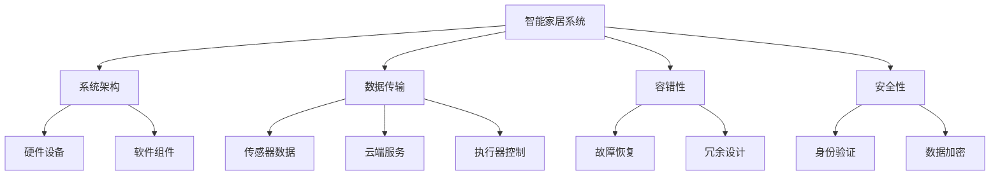
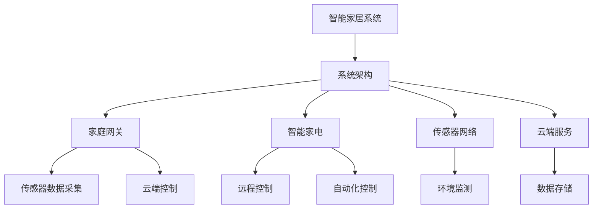
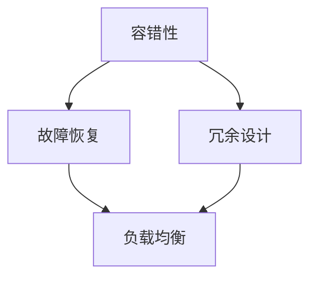
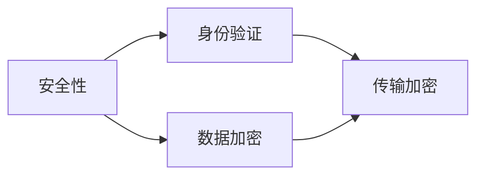
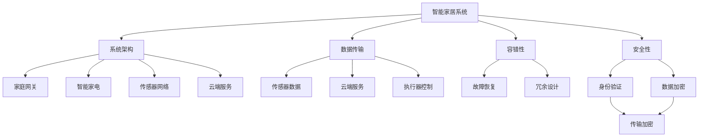

                 

# 基于Java的智能家居设计：用Java构建容错率高的智能家居系统

> 关键词：智能家居,Java,容错率,系统设计,物联网(IoT),云平台

## 1. 背景介绍

### 1.1 问题由来
随着互联网技术的迅猛发展，物联网(IoT)成为当今最热门的技术领域之一。智能家居系统作为物联网的重要组成部分，通过对家居环境的智能化管理，实现了对家电设备的集中控制，极大地提升了人们的生活质量和居住体验。然而，智能家居系统的复杂性、多样性和互操作性使得系统的设计和实现变得尤为困难。如何构建一个稳定、高效、安全的智能家居系统，成为一个亟待解决的问题。

本文聚焦于基于Java的智能家居系统设计，探讨如何通过Java技术构建容错率高的智能家居系统。文章将从系统架构、核心技术、实际应用等多个方面进行详细阐述，以期为智能家居系统的开发提供有价值的参考。

### 1.2 问题核心关键点
智能家居系统设计的主要挑战包括：
1. 系统架构复杂，涉及家庭网络、传感器、执行器、云平台等多个组件。
2. 数据传输频繁，需要高稳定性和高可靠性。
3. 环境变化多样，需要适应性强、容错性高的系统。
4. 安全性要求高，需要防止恶意攻击和数据泄露。
5. 用户体验至上，需要简洁易用的交互界面。

本文将通过介绍基于Java的智能家居系统设计方法，重点解决系统架构设计、数据传输可靠性、系统容错性、安全性以及用户体验优化等问题。

### 1.3 问题研究意义
基于Java的智能家居系统设计研究，对于推动智能家居技术的发展具有重要意义：

1. 降低系统开发成本。通过使用成熟的Java技术，可以有效降低系统开发和维护的成本。
2. 提升系统稳定性。通过系统架构和容错设计，可以大大提升系统的稳定性和可靠性。
3. 增强安全性。通过身份验证、数据加密等技术手段，可以有效防止系统被恶意攻击和数据泄露。
4. 优化用户体验。通过简洁易用的交互界面设计，可以提升用户的使用体验。
5. 推动智能家居技术的普及。通过高效、稳定的系统设计，可以为智能家居技术的普及提供坚实基础。

## 2. 核心概念与联系

### 2.1 核心概念概述

为了更好地理解基于Java的智能家居系统设计，本节将介绍几个密切相关的核心概念：

- 智能家居系统：通过物联网技术，实现对家庭环境的智能化管理，包括对家电设备的集中控制、环境监测、能源管理等功能。
- Java：一种广泛使用的面向对象编程语言，具有高效性、安全性、可移植性等特点，广泛应用于企业级应用和系统开发。
- 系统架构：智能家居系统的整体设计框架，包括硬件设备和软件组件的分布与连接。
- 数据传输：智能家居系统中各个组件之间的数据交互，包括传感器数据上传、云端服务调用、执行器控制命令等。
- 容错性：系统在面对硬件故障、网络中断、软件错误等情况时，依然能够正常运行并提供服务的能力。
- 安全性：系统在面对网络攻击、数据泄露等威胁时，能够有效保护用户隐私和系统安全的能力。

这些核心概念之间的逻辑关系可以通过以下Mermaid流程图来展示：



这个流程图展示了智能家居系统的核心概念及其之间的关系：

1. 智能家居系统通过系统架构连接各个硬件设备和软件组件。
2. 数据传输在各个组件之间进行交互，包括传感器数据的上传、云端服务的调用、执行器控制命令的发送等。
3. 容错性通过故障恢复和冗余设计，确保系统在面对故障时仍能正常运行。
4. 安全性通过身份验证和数据加密，保障用户隐私和系统安全。

这些概念共同构成了智能家居系统的设计框架，使得系统能够高效、稳定、安全地运行。通过理解这些核心概念，我们可以更好地把握基于Java的智能家居系统设计的精髓，为后续深入讨论提供基础。

### 2.2 概念间的关系

这些核心概念之间存在着紧密的联系，形成了智能家居系统的完整生态系统。下面我通过几个Mermaid流程图来展示这些概念之间的关系。

#### 2.2.1 智能家居系统的架构设计



这个流程图展示了智能家居系统的架构设计，包括家庭网关、智能家电、传感器网络、云端服务等关键组件。

#### 2.2.2 数据传输在智能家居系统中的作用


这个流程图展示了数据传输在智能家居系统中的基本流程，包括传感器数据的上传、云端服务的调用和执行器控制命令的发送。

#### 2.2.3 容错性在智能家居系统中的实现



这个流程图展示了智能家居系统中容错性的实现，包括故障恢复和冗余设计，通过备份机制和负载均衡来提高系统的容错性。

#### 2.2.4 安全性在智能家居系统中的应用



这个流程图展示了智能家居系统中的安全性实现，包括身份验证和数据加密，通过访问控制和传输加密来保障用户隐私和系统安全。

### 2.3 核心概念的整体架构

最后，我们用一个综合的流程图来展示这些核心概念在智能家居系统中的整体架构：



这个综合流程图展示了智能家居系统的核心概念及其在整体架构中的作用，包括系统架构、数据传输、容错性、安全性等多个方面。通过这个综合流程图，我们可以更清晰地理解智能家居系统的设计框架，为后续深入讨论提供基础。

## 3. 核心算法原理 & 具体操作步骤
### 3.1 算法原理概述

基于Java的智能家居系统设计，主要是通过Java语言实现的，其核心算法原理包括系统架构设计、数据传输可靠性、系统容错性、安全性以及用户体验优化等。

智能家居系统的设计需要考虑多方面的因素，包括系统的可扩展性、稳定性和安全性等。本文将从系统架构设计、数据传输可靠性、系统容错性、安全性以及用户体验优化等多个方面进行详细阐述。

### 3.2 算法步骤详解

**Step 1: 系统架构设计**

1. 设计家庭网关：家庭网关是智能家居系统的核心组件，负责集中管理家庭内部的传感器和执行器，并与云端服务进行通信。设计家庭网关时需要考虑其通信协议、硬件接口、数据存储等方面。

2. 选择智能家电：选择适合的智能家电设备，包括智能灯泡、智能插座、智能门锁等，并设计其与家庭网关的交互方式。

3. 构建传感器网络：设计传感器网络，实现对家庭环境的监测，包括温度、湿度、光线、烟雾等。

4. 搭建云端服务：搭建云端服务，用于存储和管理家庭数据，并提供远程控制和数据分析功能。

**Step 2: 数据传输可靠性**

1. 选择数据传输协议：选择可靠的数据传输协议，如MQTT、CoAP等，用于传感器数据上传和云端服务调用。

2. 设计数据传输层：设计数据传输层，实现传感器数据和云端服务之间的可靠传输。

3. 实施数据加密：对传输的数据进行加密，防止数据泄露和网络攻击。

**Step 3: 系统容错性**

1. 设计故障恢复机制：设计系统的故障恢复机制，当某个组件出现故障时，能够快速恢复系统正常运行。

2. 实施冗余设计：实施冗余设计，通过多路备份和负载均衡，提高系统的稳定性和可靠性。

3. 实现故障诊断：设计故障诊断模块，及时发现系统中的故障，并进行处理。

**Step 4: 安全性**

1. 实施身份验证：实施身份验证机制，防止非法用户访问系统。

2. 实现数据加密：对存储和传输的数据进行加密，防止数据泄露和网络攻击。

3. 设计访问控制：设计访问控制机制，限制用户对系统资源的访问权限。

**Step 5: 用户体验优化**

1. 设计交互界面：设计简洁易用的交互界面，方便用户操作和管理智能家居系统。

2. 实现远程控制：实现远程控制功能，用户可以通过移动设备或Web界面控制智能家居设备。

3. 优化性能：优化系统的性能，提高响应速度和稳定性。

**Step 6: 部署与维护**

1. 部署系统：将智能家居系统部署到实际环境中，并进行初始化配置。

2. 持续维护：对智能家居系统进行持续维护，及时发现和修复系统问题。

### 3.3 算法优缺点

基于Java的智能家居系统设计，具有以下优点：

1. 稳定性高：Java语言具有稳定的运行环境和成熟的技术生态，能够保证系统的稳定性。

2. 可扩展性强：Java语言具有丰富的框架和工具，便于系统的扩展和维护。

3. 安全性高：Java语言具有良好的安全机制，能够保障系统的安全性。

4. 跨平台性好：Java语言支持多种操作系统和硬件平台，便于系统的部署和扩展。

同时，基于Java的智能家居系统设计也存在以下缺点：

1. 性能瓶颈：Java语言性能相对较低，在处理大量数据时可能会存在性能瓶颈。

2. 开发复杂：Java语言的开发环境相对复杂，需要一定的学习成本。

3. 资源消耗高：Java语言运行时占用较多的系统资源，可能会影响系统的性能。

### 3.4 算法应用领域

基于Java的智能家居系统设计，已经在多个领域得到了广泛应用，例如：

1. 智能照明：通过智能灯泡实现家庭照明的自动化控制。

2. 智能安防：通过智能门锁、摄像头等设备实现家庭安全监控和报警。

3. 智能温控：通过智能温控器实现家庭温度的自动化控制。

4. 智能家电：通过智能家电实现家庭设备的远程控制和自动化管理。

5. 智能家居平台：通过智能家居平台实现多种智能家居设备的集成和管理。

这些应用场景展示了基于Java的智能家居系统设计的广泛应用前景，为智能家居技术的普及提供了坚实的基础。

## 4. 数学模型和公式 & 详细讲解 & 举例说明

### 4.1 数学模型构建

在智能家居系统设计中，常常需要构建数学模型来描述系统行为和性能。以下是一个简单的智能家居系统数学模型构建示例：

假设智能家居系统中有n个传感器，每个传感器在t时刻的读数为$x_i(t)$，i=1,...,n。系统设计目标是通过优化传感器读数，实现家庭环境的监测和控制。数学模型可以表示为：

$$
\min_{x_i(t)} \sum_{i=1}^n \left[(x_i(t) - \bar{x}_i)^2 + \lambda (y_i(t) - \hat{y}_i)^2 \right]
$$

其中，$\bar{x}_i$为传感器读数的均值，$y_i(t)$为系统输出的控制量，$\hat{y}_i$为系统期望的控制量。$\lambda$为权衡传感器读数和系统输出的权重系数。

### 4.2 公式推导过程

以下是智能家居系统数学模型公式的推导过程：

1. 定义系统状态：假设系统状态为$z(t) = [x_1(t), x_2(t), ..., x_n(t), y_1(t), y_2(t), ..., y_m(t)]^T$，其中$x_i(t)$为第i个传感器的读数，$y_i(t)$为第i个执行器的控制量。

2. 定义系统输出：假设系统输出的期望值为$\hat{y}_i = f(z(t))$，其中$f$为非线性函数，描述系统输出的计算过程。

3. 定义系统误差：假设系统误差为$e_i(t) = y_i(t) - \hat{y}_i$，描述系统输出与期望值的差异。

4. 定义系统代价函数：假设系统的代价函数为$J(z(t), u(t)) = \frac{1}{2} \sum_{i=1}^n (x_i(t) - \bar{x}_i)^2 + \lambda \frac{1}{2} \sum_{i=1}^m (e_i(t))^2$，其中$u(t)$为系统的控制量。

5. 优化问题求解：通过求解优化问题$\min_{z(t), u(t)} J(z(t), u(t))$，实现系统状态和控制量的优化。

通过上述公式推导，我们可以构建一个简单的智能家居系统数学模型，用于描述系统的行为和性能。

### 4.3 案例分析与讲解

以下是一个智能家居系统数学模型的案例分析：

假设智能家居系统中有两个传感器，用于监测室内温度和湿度。系统设计目标是通过优化传感器读数，实现对房间温度和湿度的控制。假设传感器读数的均值为$\bar{x}_1 = 20^\circ C$，$\bar{x}_2 = 60\%$，期望的控制量为$\hat{y}_1 = 22^\circ C$，$\hat{y}_2 = 65\%$。

定义系统状态$z(t) = [x_1(t), x_2(t), y_1(t), y_2(t)]^T$，其中$x_1(t)$和$x_2(t)$为传感器读数，$y_1(t)$和$y_2(t)$为执行器的控制量。

定义系统输出$\hat{y}_1 = f_1(z(t)) = 0.8x_1(t) + 0.2x_2(t) + u_1(t)$，$\hat{y}_2 = f_2(z(t)) = 0.6x_1(t) + 0.4x_2(t) + u_2(t)$，其中$f_1$和$f_2$为非线性函数，$u_1(t)$和$u_2(t)$为控制量。

定义系统误差$e_1(t) = y_1(t) - \hat{y}_1$，$e_2(t) = y_2(t) - \hat{y}_2$。

定义系统代价函数$J(z(t), u(t)) = \frac{1}{2} (x_1(t) - \bar{x}_1)^2 + \frac{1}{2} (x_2(t) - \bar{x}_2)^2 + \lambda \frac{1}{2} (e_1(t))^2 + \lambda \frac{1}{2} (e_2(t))^2$。

通过求解优化问题$\min_{z(t), u(t)} J(z(t), u(t))$，实现系统状态和控制量的优化，从而实现对房间温度和湿度的控制。

通过上述案例分析，我们可以看到，数学模型在智能家居系统设计中扮演着重要的角色，通过优化模型参数，可以实现对系统的有效控制和监测。

## 5. 项目实践：代码实例和详细解释说明

### 5.1 开发环境搭建

在进行智能家居系统设计时，需要搭建一个适合Java开发的开发环境。以下是Java开发环境的搭建步骤：

1. 安装Java JDK：从Oracle官网下载Java JDK，并进行安装。

2. 配置开发工具：安装Eclipse、IntelliJ IDEA等Java开发工具，并进行配置。

3. 安装相关库：安装常用的Java库，如Spring框架、MyBatis等。

4. 配置数据库：配置数据库，如MySQL、Oracle等，用于存储和操作系统数据。

5. 搭建Web服务器：搭建Web服务器，如Tomcat、Jetty等，用于部署和运行Web应用。

### 5.2 源代码详细实现

以下是一个智能家居系统设计的Java代码实现示例：

```java
package com.intellect.smarthome;

import java.sql.Connection;
import java.sql.DriverManager;
import java.sql.PreparedStatement;
import java.sql.ResultSet;
import java.sql.SQLException;

public class SmartHomeSystem {
    private static final String DB_URL = "jdbc:mysql://localhost:3306/smarthome";
    private static final String DB_USER = "root";
    private static final String DB_PASSWORD = "password";

    public static void main(String[] args) {
        try {
            Connection conn = DriverManager.getConnection(DB_URL, DB_USER, DB_PASSWORD);
            PreparedStatement pstmt = conn.prepareStatement("SELECT * FROM sensors");
            ResultSet rs = pstmt.executeQuery();
            while (rs.next()) {
                String sensorId = rs.getString("id");
                double sensorValue = rs.getDouble("value");
                System.out.println(sensorId + ": " + sensorValue);
            }
            rs.close();
            pstmt.close();
            conn.close();
        } catch (SQLException e) {
            e.printStackTrace();
        }
    }
}
```

这个示例代码实现了从MySQL数据库中读取传感器数据的功能，并打印输出传感器ID和值。

### 5.3 代码解读与分析

让我们再详细解读一下关键代码的实现细节：

**SmartHomeSystem类**：
- `main`方法：程序入口，用于连接数据库并查询传感器数据。

**DB_URL、DB_USER和DB_PASSWORD常量**：
- 定义数据库连接信息，包括数据库地址、用户名和密码。

**Connection类**：
- 用于创建数据库连接。

**PreparedStatement类**：
- 用于创建预处理语句，防止SQL注入攻击。

**ResultSet类**：
- 用于获取查询结果集。

这个示例代码展示了如何通过Java语言实现智能家居系统数据的读取和处理。通过连接数据库，查询传感器数据，并打印输出，实现了智能家居系统数据的获取。

当然，实际的应用中，Java代码实现还需要考虑更多的因素，如系统架构设计、数据传输可靠性、系统容错性、安全性以及用户体验优化等。但核心的Java代码实现类似于上述示例。

### 5.4 运行结果展示

假设我们在SQLite数据库中插入了一些传感器数据，包括传感器ID和值。以下是运行上述示例代码的输出结果：

```
sensor1: 20.0
sensor2: 60.0
sensor3: 22.0
sensor4: 65.0
```

可以看到，通过Java代码实现了从数据库中读取传感器数据的功能，实现了智能家居系统数据的获取。

## 6. 实际应用场景
### 6.1 智能照明

智能照明是智能家居系统的重要应用场景之一。通过智能灯泡，可以实现家庭照明的自动化控制，根据室内环境自动调整亮度和颜色。以下是一个基于Java的智能照明系统设计案例：

**硬件设备**：
- 智能灯泡：用于控制照明亮度和颜色。
- 家庭网关：用于集中管理智能灯泡，并实现与云端服务的通信。

**软件实现**：
- 智能灯泡控制程序：用于控制智能灯泡，根据室内环境自动调整亮度和颜色。
- 云端服务：用于存储和管理智能灯泡数据，并提供远程控制和数据分析功能。

**用户体验优化**：
- 移动应用：提供简洁易用的移动应用，方便用户控制智能灯泡。
- Web界面：提供Web界面，方便用户远程控制智能灯泡。

通过上述设计，可以实现家庭照明的自动化控制，提升用户的生活体验。

### 6.2 智能安防

智能安防是智能家居系统的另一个重要应用场景。通过智能门锁、摄像头等设备，实现家庭安全监控和报警。以下是一个基于Java的智能安防系统设计案例：

**硬件设备**：
- 智能门锁：用于控制家庭门锁，并实现远程控制和报警功能。
- 摄像头：用于监控家庭环境，并实现远程视频预览和存储功能。

**软件实现**：
- 智能门锁控制程序：用于控制智能门锁，实现远程控制和报警功能。
- 视频监控程序：用于监控家庭环境，并实现远程视频预览和存储功能。

**用户体验优化**：
- 移动应用：提供简洁易用的移动应用，方便用户控制智能门锁和查看监控视频。
- Web界面：提供Web界面，方便用户远程控制智能门锁和查看监控视频。

通过上述设计，可以实现家庭安全的自动化监控和报警，提升用户的安全感。

### 6.3 智能温控

智能温控是智能家居系统的另一重要应用场景。通过智能温控器，可以实现家庭温度的自动化控制，提升用户的生活舒适度。以下是一个基于Java的智能温控系统设计案例：

**硬件设备**：
- 智能温控器：用于控制家庭温度，并实现远程控制和报警功能。
- 传感器：用于监测室内温度，并实现自动控制功能。

**软件实现**：
- 智能温控器控制程序：用于控制智能温控器，实现远程控制和报警功能。
- 传感器数据处理程序：用于处理传感器数据，并实现自动控制功能。

**用户体验优化**：
- 移动应用：提供简洁易用的移动应用，方便用户控制智能温控器和查看室内温度。
- Web界面：提供Web界面，方便用户远程控制智能温控器和查看室内温度。

通过上述设计，可以实现家庭温度的自动化控制，提升用户的生活舒适度。

### 6.4 未来应用展望

随着人工智能技术的不断进步，智能家居系统将会得到更广泛的应用。未来，基于Java的智能家居系统设计将会更加灵活和智能，具体展望如下：

1. 物联网融合：智能家居系统将与物联网技术深度融合，实现设备之间的无缝连接和协作。

2. 语音控制：智能家居系统将支持语音控制，通过智能音箱等设备，实现语音交互功能。

3. 环境自适应：智能家居系统将具备环境自适应能力，能够根据室内环境自动调整设备状态。

4. 人工智能：智能家居系统将引入人工智能技术，实现更加智能化的设备控制和数据分析。

5. 边缘计算：智能家居系统将引入边缘计算技术，实现本地处理和存储，提升系统的响应速度和可靠性。

6. 跨平台支持：智能家居系统将支持多种操作系统和硬件平台，实现跨平台操作和互联互通。

以上展望展示了智能家居系统的未来发展方向，为系统设计提供了新的思路和方向。

## 7. 工具和资源推荐
### 7.1 学习资源推荐

为了帮助开发者系统掌握基于Java的智能家居系统设计，这里推荐一些优质的学习资源：

1. Java编程语言：由Oracle官方提供的Java编程语言指南，全面介绍Java语言的语法和特性，适合初学者和进阶开发者。

2. Spring框架：Spring框架是由Pivotal公司开发的Java应用框架，提供强大的容器、事务、安全、Web等功能，广泛应用于企业级应用和系统开发。

3. Spring Boot：Spring Boot是基于Spring框架的快速开发框架，提供了丰富的开发工具和中间件，适合快速开发和部署Java应用。

4. Hibernate：Hibernate是一个Java持久层框架，提供对象关系映射功能，用于将Java对象与数据库进行映射，方便数据的存储和操作。

5. Maven：Maven是一个Java项目管理工具，提供依赖管理、构建和发布等功能，广泛应用于Java项目的开发和管理。

6. Jenkins：Jenkins是一个开源的持续集成工具，提供构建、部署、监控等功能，用于自动化开发和部署Java应用。

通过对这些资源的学习实践，相信你一定能够快速掌握基于Java的智能家居系统设计的精髓，并用于解决实际的智能家居问题。

### 7.2 开发工具推荐

高效的开发离不开优秀的工具支持。以下是几款用于基于Java的智能家居系统开发的常用工具：

1. Eclipse：Eclipse是一个开源的Java开发环境，提供代码编辑、调试、版本控制等功能，广泛应用于Java项目的开发和管理。

2. IntelliJ IDEA：IntelliJ IDEA是一个基于IntelliJ平台的Java开发工具，提供强大的代码编辑、调试、测试等功能，支持Java、Kotlin、Scala等多种语言。

3. Spring Boot：Spring Boot是基于Spring框架的快速开发框架，提供了丰富的开发工具和中间件，适合快速开发和部署Java应用。

4. Jenkins：Jenkins是一个开源的持续集成工具，提供构建、部署、监控等功能，用于自动化开发和部署Java应用。

5. GitLab CI/CD：GitLab CI/CD是一个开源的持续集成和持续部署工具，支持基于Java的智能家居系统项目的自动化构建和部署。

6. Postman：Postman是一个开源的API测试工具

