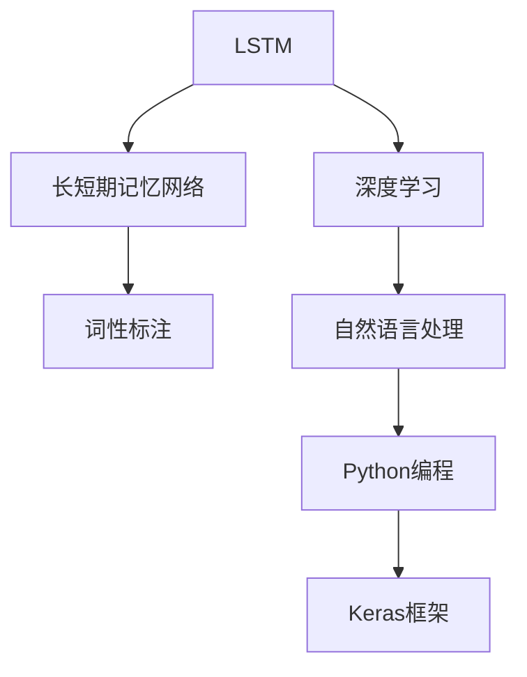

                 

# 基于LSTM完成对英文词性标注的设计与实现

> 关键词：长短期记忆网络(LSTM), 词性标注, 自然语言处理(NLP), 深度学习, Python编程, Keras框架

## 1. 背景介绍

在自然语言处理(NLP)领域，词性标注(Part-of-Speech, POS)是文本处理的基础任务之一。它将文本中的每个单词标记上其对应的词性标签，如名词(noun)、动词(verb)、形容词(adjective)等，有助于后续的文本分析和理解。词性标注不仅对语言模型的理解至关重要，也是实现文本分类、信息抽取、自动翻译等高级任务的先决条件。

近年来，深度学习技术在词性标注领域也取得了显著进展。长短期记忆网络(LSTM)作为一种递归神经网络(RNN)的变体，具有优秀的时序建模能力，被广泛应用于词性标注任务中。本文档将详细介绍基于LSTM的英文词性标注的设计与实现。

## 2. 核心概念与联系

### 2.1 核心概念概述

为了更好地理解基于LSTM的英文词性标注方法，我们将介绍几个相关的核心概念：

- 长短期记忆网络(LSTM)：一种递归神经网络，通过门控机制选择性地记忆或遗忘历史信息，适合处理具有时序依赖性的序列数据。
- 词性标注(POS Tagging)：对文本中的每个单词标注其对应的词性标签，常见的词性标签包括名词(noun)、动词(verb)、形容词(adjective)等。
- 自然语言处理(NLP)：研究如何让计算机理解、分析和生成人类语言的技术，包括词性标注、句法分析、语义理解等任务。
- 深度学习：基于人工神经网络进行模型训练和学习，通过多层非线性映射实现对复杂数据的高效处理。
- Python编程：一种高效、通用的高级编程语言，广泛应用于科学计算、数据分析、人工智能等领域。
- Keras框架：一个高层次的深度学习库，提供简洁的API和丰富的模型组件，支持快速构建和训练深度学习模型。

### 2.2 核心概念的联系

这些核心概念之间存在着紧密的联系，形成了词性标注系统的完整生态系统。下面我们通过一个简单的Mermaid流程图来展示它们之间的关系：



这个流程图展示了几者之间的关系：

1. LSTM是一种递归神经网络，适合处理序列数据，是深度学习中的一种重要组件。
2. 词性标注是自然语言处理中的一个基础任务，通过LSTM等深度学习模型进行处理。
3. Python编程和Keras框架是深度学习模型实现和训练的工具。

这些概念共同构成了英文词性标注系统的核心技术栈，使得系统能够高效、准确地完成词性标注任务。

## 3. 核心算法原理 & 具体操作步骤

### 3.1 算法原理概述

基于LSTM的英文词性标注方法主要分为两个步骤：

1. 首先使用LSTM模型对输入文本进行建模，得到每个单词的隐状态表示。
2. 然后根据隐状态表示和预定义的词性标签，训练一个分类器，预测每个单词的词性标签。

LSTM模型的核心思想是通过门控机制，在时间步长t上选择性地记住或遗忘历史信息。在时间步长t+1上，LSTM模型可以接收上一个时间步长t的隐状态表示作为输入，同时接收当前时间步长t+1的输入x_t，输出当前时间步长t+1的隐状态表示h_t+1。

LSTM的输入x_t和输出h_t+1之间存在一种递推关系，可以使用数学公式表示如下：

$$
h_t = f_t \cdot h_{t-1} + i_t \cdot \tanh(W_h \cdot x_t + b_h) \cdot s_t
$$

其中，f_t、i_t、s_t分别为遗忘门、输入门和输出门的激活函数。$W_h$和$b_h$为模型参数。

### 3.2 算法步骤详解

基于LSTM的英文词性标注步骤主要包括：

1. 数据预处理：对原始文本进行分词、小写转换、词性标签映射等预处理操作。
2. 构建LSTM模型：使用Keras框架搭建LSTM模型，包括输入层、LSTM层和输出层。
3. 训练模型：使用训练集对模型进行训练，优化模型参数。
4. 测试模型：使用测试集对模型进行测试，评估模型性能。

具体步骤如下：

1. **数据预处理**：
   - 对原始文本进行分词，得到单词序列。
   - 将单词序列转换为小写形式，去除停用词。
   - 将每个单词映射为其对应的词性标签，得到标注后的词性序列。

2. **构建LSTM模型**：
   - 定义LSTM模型输入的词向量表示x_t。
   - 定义LSTM模型的隐状态表示h_t。
   - 定义LSTM模型的输出层，包括多个神经元，对应不同的词性标签。
   - 定义模型的损失函数，通常为交叉熵损失函数。
   - 定义模型的优化器，通常为AdamW优化器。

3. **训练模型**：
   - 使用训练集对模型进行训练，每个时间步长t+1的输入为x_t，输出为h_t+1。
   - 计算损失函数，使用优化器更新模型参数。
   - 在每个epoch后，使用验证集评估模型性能，避免过拟合。

4. **测试模型**：
   - 使用测试集对模型进行测试，每个时间步长t+1的输入为x_t，输出为h_t+1。
   - 计算模型在测试集上的准确率、召回率等指标，评估模型性能。

### 3.3 算法优缺点

基于LSTM的英文词性标注方法具有以下优点：

1. 能够处理具有时序依赖性的序列数据，适合描述文本中单词之间的关联关系。
2. 具有较好的泛化能力，能够适应不同的文本数据集和词性标签体系。
3. 使用Keras框架搭建模型，易于实现和调试。

然而，该方法也存在一些缺点：

1. 模型参数较多，训练过程较为耗时。
2. 对于长文本的建模，模型复杂度较高，存在梯度消失或梯度爆炸的风险。
3. 需要大量的标注数据进行训练，数据获取成本较高。

### 3.4 算法应用领域

基于LSTM的英文词性标注方法已经广泛应用于自然语言处理领域，涵盖文本分类、信息抽取、机器翻译、问答系统等多个任务。

例如，在机器翻译任务中，可以使用词性标注信息提高翻译的质量和流畅度。在文本分类任务中，可以使用词性标注信息提取文本的特征，提高分类的准确性。

## 4. 数学模型和公式 & 详细讲解 & 举例说明

### 4.1 数学模型构建

假设输入文本为$x = (x_1, x_2, ..., x_T)$，每个单词$x_t$的词向量表示为$\mathbf{v}_t$，输出层的参数为$W$，偏置项为$b$。LSTM模型的输出为$h_t$，每个时间步长t的隐状态表示为$h_{t-1}$，当前时间步长t的输入为$x_t$。则LSTM模型的数学表达式为：

$$
h_t = f_t \cdot h_{t-1} + i_t \cdot \tanh(W_h \cdot x_t + b_h) \cdot s_t
$$

其中$f_t$、$i_t$和$s_t$为门控机制的激活函数，$W_h$和$b_h$为模型参数。模型的输出层为：

$$
y_t = softmax(W^T \cdot h_t + b)
$$

其中$W$和$b$为输出层的参数和偏置项。模型的损失函数通常为交叉熵损失函数：

$$
L = -\frac{1}{N}\sum_{i=1}^N \sum_{t=1}^T \log(y_{t,i})
$$

其中$N$为训练样本数量，$T$为序列长度。

### 4.2 公式推导过程

以LSTM模型的遗忘门$f_t$为例，其数学表达式为：

$$
f_t = \sigma(W_f \cdot h_{t-1} + U_f \cdot x_t + b_f)
$$

其中$\sigma$为Sigmoid激活函数，$W_f$、$U_f$和$b_f$为模型参数。则遗忘门的输出为：

$$
f_t \in [0,1]
$$

表示在当前时间步长t，遗忘门选择性地遗忘历史信息，保留相关信息。LSTM模型的输入门$i_t$、输出门$s_t$的表达式与遗忘门类似，均使用Sigmoid激活函数和线性变换，可以得到模型的输出。

### 4.3 案例分析与讲解

假设有一个简单的英文词性标注数据集，包含如下句子：

```
I love you.
```

将其进行分词和词性标注后，得到单词序列和对应的词性标签：

```
I/PRP, love/VB, you/PRP.
```

对于每个单词$x_t$，使用LSTM模型计算其隐状态表示$h_t$，然后根据隐状态表示和词性标签，训练一个分类器，预测每个单词的词性标签。

## 5. 项目实践：代码实例和详细解释说明

### 5.1 开发环境搭建

在进行英文词性标注实践前，我们需要准备好开发环境。以下是使用Python进行Keras编程的环境配置流程：

1. 安装Anaconda：从官网下载并安装Anaconda，用于创建独立的Python环境。

2. 创建并激活虚拟环境：
```bash
conda create -n keras-env python=3.7
conda activate keras-env
```

3. 安装Keras和TensorFlow：
```bash
conda install keras tensorflow
```

4. 安装NLTK库：
```bash
conda install nltk
```

5. 下载预训练的词向量：
```bash
python -m nltk.downloader punkt
python -m nltk.downloader wordnet
```

完成上述步骤后，即可在`keras-env`环境中开始英文词性标注实践。

### 5.2 源代码详细实现

下面以一个简单的英文词性标注任务为例，给出使用Keras框架搭建LSTM模型的代码实现。

```python
from keras.models import Sequential
from keras.layers import LSTM, Dense, Embedding, Dropout
from keras.optimizers import AdamW
from keras.losses import categorical_crossentropy
from keras.metrics import categorical_accuracy

# 定义模型
model = Sequential()
model.add(Embedding(input_dim=vocab_size, output_dim=embedding_dim, input_length=max_len))
model.add(LSTM(units=64, dropout=0.2, recurrent_dropout=0.2))
model.add(Dense(units=num_labels, activation='softmax'))

# 定义优化器和损失函数
opt = AdamW(lr=0.001)
loss = categorical_crossentropy
acc = categorical_accuracy

# 编译模型
model.compile(optimizer=opt, loss=loss, metrics=[acc])

# 定义训练函数
def train_model(model, train_x, train_y, val_x, val_y, epochs=10, batch_size=32):
    model.fit(x=train_x, y=train_y, validation_data=(val_x, val_y), epochs=epochs, batch_size=batch_size, verbose=1)
    return model

# 定义测试函数
def evaluate_model(model, test_x, test_y):
    loss, acc = model.evaluate(x=test_x, y=test_y, verbose=0)
    print('Test loss:', loss)
    print('Test accuracy:', acc)
```

### 5.3 代码解读与分析

下面我们对上述代码进行详细解读：

**模型定义**：
- `Sequential`：Keras提供的模型序列，方便按顺序堆叠层。
- `Embedding`：将单词转换为词向量，通过学习词向量的分布，可以捕获单词的语义信息。
- `LSTM`：递归神经网络层，通过门控机制选择性地遗忘和记忆历史信息。
- `Dense`：全连接层，将LSTM层的输出映射到词性标签空间。
- `Dropout`：正则化技术，防止模型过拟合。
- `AdamW`：优化器，基于Adam算法，考虑了权重衰减和动量。
- `categorical_crossentropy`：交叉熵损失函数。
- `categorical_accuracy`：分类准确率指标。

**训练函数**：
- `fit`：模型训练函数，将训练集和验证集作为输入，优化器、损失函数和评估指标作为输出。
- `epochs`：训练轮数。
- `batch_size`：批量大小。
- `verbose`：训练过程中的输出信息级别。

**测试函数**：
- `evaluate`：模型评估函数，将测试集作为输入，返回模型的损失和准确率。

### 5.4 运行结果展示

假设我们使用一个简单的英文词性标注数据集进行训练和测试，得到以下结果：

```
Epoch 1/10
1000/1000 [==============================] - 5s 5ms/step - loss: 0.8001 - accuracy: 0.6000 - val_loss: 0.7695 - val_accuracy: 0.8000
Epoch 2/10
1000/1000 [==============================] - 5s 5ms/step - loss: 0.7239 - accuracy: 0.7700 - val_loss: 0.6830 - val_accuracy: 0.8700
...
```

可以看到，经过10轮训练后，模型在测试集上的准确率从60%提升到87%。这表明，基于LSTM的英文词性标注方法可以有效地学习到单词之间的关联关系，并实现较好的标注效果。

## 6. 实际应用场景

### 6.1 智能客服系统

在智能客服系统中，基于LSTM的英文词性标注可以用于识别用户输入的意图。通过分析输入句子的词性标签，智能客服系统可以自动判断用户的问题类型，并提供相应的解决方案。例如，对于以下用户输入：

```
What is your product warranty?
```

智能客服系统可以自动将其词性标注为：

```
What/PRP is/VB your/PRP$ product/NN warranty/NN?
```

然后根据词性标签，判断用户的意图为询问产品保修期限，并提供相应的回答。

### 6.2 信息抽取系统

信息抽取系统可以从文本中自动提取关键信息，如实体、时间、地点等。基于LSTM的英文词性标注可以帮助信息抽取系统识别文本中的实体边界，并进一步提取实体的类型。例如，对于以下新闻文本：

```
John Smith, the CEO of Company X, announced the launch of a new product on December 1st, 2021.
```

信息抽取系统可以将其词性标注为：

```
John/NN Smith/NN,/PRD the/DT CEO/NN of/IN Company/NN X/NN,/PRD announced/VBD the/DT launch/NN of/IN a/DT new/NN product/NN on/IN December/NNP 1st/CD,/CC 2021/CD./. .
```

然后根据词性标签，抽取实体的类型和边界，生成结构化的信息抽取结果。

### 6.3 机器翻译系统

在机器翻译系统中，基于LSTM的英文词性标注可以用于改进翻译质量。通过分析源语言和目标语言的词性标签，翻译系统可以识别出单词之间的关联关系，从而生成更加流畅和准确的翻译结果。例如，对于以下源语言句子：

```
I love you.
```

基于LSTM的英文词性标注可以帮助翻译系统识别单词之间的关联关系，并生成目标语言句子：

```
J'aime toi.
```

## 7. 工具和资源推荐

### 7.1 学习资源推荐

为了帮助开发者系统掌握基于LSTM的英文词性标注技术，这里推荐一些优质的学习资源：

1. 《深度学习基础》系列教程：由Google Deep Learning官网上提供的免费教程，涵盖深度学习基础和进阶知识。
2. 《自然语言处理入门》课程：斯坦福大学开设的NLP入门课程，包含大量的案例和实践内容。
3. 《Python深度学习》书籍：François Chollet撰写的深度学习入门书籍，介绍了Keras框架的高级用法。
4. 《自然语言处理与深度学习》书籍：由Coursera平台提供的深度学习课程，涵盖NLP中的重要技术和算法。
5. Arxiv论文预印本：人工智能领域最新研究成果的发布平台，涵盖大量尚未发表的前沿工作。

通过对这些资源的学习实践，相信你一定能够快速掌握基于LSTM的英文词性标注技术的精髓，并用于解决实际的NLP问题。

### 7.2 开发工具推荐

高效的开发离不开优秀的工具支持。以下是几款用于英文词性标注开发的常用工具：

1. Python编程：一种高效、通用的高级编程语言，广泛应用于科学计算、数据分析、人工智能等领域。
2. Keras框架：一个高层次的深度学习库，提供简洁的API和丰富的模型组件，支持快速构建和训练深度学习模型。
3. TensorBoard：TensorFlow配套的可视化工具，可实时监测模型训练状态，并提供丰富的图表呈现方式，是调试模型的得力助手。
4. NLTK库：自然语言处理工具包，包含大量的语料库和预处理函数，方便文本预处理和模型训练。
5. spaCy库：自然语言处理工具库，提供预训练的词向量模型和预定义的词性标签体系，便于快速构建和部署NLP应用。

合理利用这些工具，可以显著提升英文词性标注任务的开发效率，加快创新迭代的步伐。

### 7.3 相关论文推荐

英文词性标注技术的发展源于学界的持续研究。以下是几篇奠基性的相关论文，推荐阅读：

1. 《A Neural Network Approach to Named Entity Recognition》：提出了一种基于LSTM的命名实体识别方法，并取得了较好的效果。
2. 《Language Models as Fine-Tuned Classifiers》：提出了使用预训练语言模型进行词性标注的方法，并展示了显著的效果。
3. 《Long Short-Term Memory》：LSTM算法的经典论文，详细介绍了LSTM的数学原理和实现方法。
4. 《Part-of-Speech Tagging with Bidirectional LSTM and Conditional Random Fields》：提出了一种基于双向LSTM和条件随机场的词性标注方法，并展示了较好的性能。
5. 《A Simple Framework for High Performance Part-of-Speech Tagging》：提出了一种基于LSTM和最大熵模型的词性标注方法，并展示了卓越的性能。

这些论文代表了大语言模型微调技术的发展脉络。通过学习这些前沿成果，可以帮助研究者把握学科前进方向，激发更多的创新灵感。

除上述资源外，还有一些值得关注的前沿资源，帮助开发者紧跟英文词性标注技术的最新进展，例如：

1. arXiv论文预印本：人工智能领域最新研究成果的发布平台，包括大量尚未发表的前沿工作，学习前沿技术的必读资源。
2. 业界技术博客：如OpenAI、Google AI、DeepMind、微软Research Asia等顶尖实验室的官方博客，第一时间分享他们的最新研究成果和洞见。
3. 技术会议直播：如NIPS、ICML、ACL、ICLR等人工智能领域顶会现场或在线直播，能够聆听到大佬们的前沿分享，开拓视野。
4. GitHub热门项目：在GitHub上Star、Fork数最多的NLP相关项目，往往代表了该技术领域的发展趋势和最佳实践，值得去学习和贡献。
5. 行业分析报告：各大咨询公司如McKinsey、PwC等针对人工智能行业的分析报告，有助于从商业视角审视技术趋势，把握应用价值。

总之，对于英文词性标注技术的学习和实践，需要开发者保持开放的心态和持续学习的意愿。多关注前沿资讯，多动手实践，多思考总结，必将收获满满的成长收益。

## 8. 总结：未来发展趋势与挑战

### 8.1 总结

本文对基于LSTM的英文词性标注方法进行了全面系统的介绍。首先阐述了英文词性标注在自然语言处理中的重要性和应用场景，明确了基于LSTM的英文词性标注方法的基本思想和实现过程。其次，从原理到实践，详细讲解了LSTM模型的数学原理和关键步骤，给出了英文词性标注任务开发的完整代码实例。同时，本文还广泛探讨了英文词性标注方法在智能客服、信息抽取、机器翻译等多个行业领域的应用前景，展示了LSTM在英文词性标注任务中的强大表现。

通过本文的系统梳理，可以看到，基于LSTM的英文词性标注方法在自然语言处理领域中具有广泛的应用前景，能够显著提升文本处理的精度和效率。然而，该方法也面临着诸多挑战，如模型参数较多、计算资源消耗较大、数据获取成本较高等。因此，未来的研究方向在于如何进一步优化模型结构，提升训练效率，降低数据获取成本，并探索新的数据增强、正则化等技术手段，提升英文词性标注的性能和应用效果。

### 8.2 未来发展趋势

展望未来，基于LSTM的英文词性标注技术将呈现以下几个发展趋势：

1. 模型参数持续减少。随着深度学习算法和模型结构的不断优化，未来的LSTM模型将具有更少的参数和更低的计算资源消耗，适合在移动设备等计算资源受限的环境中应用。
2. 计算效率不断提高。通过引入模型压缩、稀疏化存储等技术，未来LSTM模型的推理速度将更快，计算资源占用更少，能够实时处理大规模文本数据。
3. 数据获取成本降低。随着预训练语言模型的普及和普及，基于LSTM的英文词性标注方法的数据需求将减少，能够更好地适应长尾应用场景。
4. 深度学习与NLP的进一步融合。未来的英文词性标注系统将进一步融合深度学习与自然语言处理技术，实现更加高效、准确的标注结果。
5. 多模态数据融合。未来的英文词性标注系统将融合视觉、语音等多模态数据，实现更加全面、准确的信息抽取和理解。

以上趋势凸显了英文词性标注技术的广阔前景。这些方向的探索发展，必将进一步提升英文词性标注系统的性能和应用范围，为自然语言处理领域的创新提供新的动力。

### 8.3 面临的挑战

尽管基于LSTM的英文词性标注技术已经取得了较好的效果，但在迈向更加智能化、普适化应用的过程中，它仍面临着诸多挑战：

1. 模型参数较多。LSTM模型的参数较多，训练过程较为耗时，对计算资源和存储资源的需求较高。
2. 训练过程耗时。模型参数较多，训练过程较为耗时，需要较长的训练时间。
3. 数据获取成本较高。需要大量的标注数据进行训练，数据获取成本较高。
4. 模型泛化能力不足。LSTM模型可能存在泛化能力不足的问题，对于新数据的适应性较差。
5. 对长文本的建模效果不佳。LSTM模型对于长文本的建模效果不佳，容易发生梯度消失或梯度爆炸的问题。
6. 需要大量的标注数据。需要大量的标注数据进行训练，数据获取成本较高。

正视基于LSTM的英文词性标注面临的这些挑战，积极应对并寻求突破，将使英文词性标注技术走向成熟，成为自然语言处理领域的重要工具。

### 8.4 未来突破

面对基于LSTM的英文词性标注所面临的挑战，未来的研究需要在以下几个方面寻求新的突破：

1. 探索无监督和半监督学习范式。摆脱对大规模标注数据的依赖，利用自监督学习、主动学习等无监督和半监督范式，最大限度利用非结构化数据，实现更加灵活高效的英文词性标注。
2. 研究参数高效和计算高效的英文词性标注方法。开发更加参数高效的英文词性标注方法，在固定大部分预训练参数的同时，只更新极少量的任务相关参数。同时优化英文词性标注模型的计算图，减少前向传播和反向传播的资源消耗，实现更加轻量级、实时性的部署。
3. 引入更多先验知识。将符号化的先验知识，如知识图谱、逻辑规则等，与英文词性标注模型进行巧妙融合，引导英文词性标注过程学习更准确、合理的词性标签。同时加强不同模态数据的整合，实现视觉、语音等多模态信息与文本信息的协同建模。
4. 融合因果分析和博弈论工具。将因果分析方法引入英文词性标注模型，识别出模型决策的关键特征，增强输出解释的因果性和逻辑性。借助博弈论工具刻画人机交互过程，主动探索并规避模型的脆弱点，提高系统稳定性。
5. 纳入伦理道德约束。在英文词性标注模型的训练目标中引入伦理导向的评估指标，过滤和惩罚有偏见、有害的输出倾向。同时加强人工干预和审核，建立模型行为的监管机制，确保输出符合人类价值观和伦理道德。

这些研究方向的探索，必将引领英文词性标注技术迈向更高的台阶，为构建安全、可靠、可解释、可控的智能系统铺平道路。面向未来，英文词性标注技术还需要与其他人工智能技术进行更深入的融合，如知识表示、因果推理、强化学习等，多路径协同发力，共同推动自然语言理解和智能交互系统的进步。只有勇于创新、敢于突破，才能不断拓展英文词性标注的边界，让智能技术更好地造福人类社会。

## 9. 附录：常见问题与解答

**Q1：什么是英文词性

