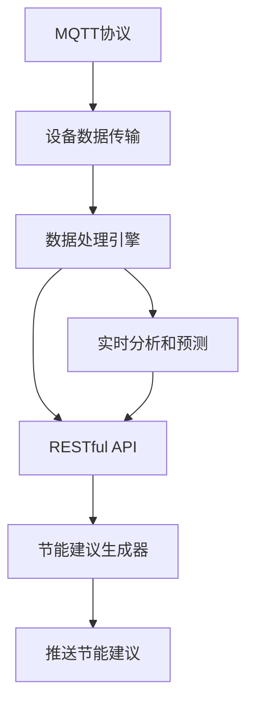

                 

# 基于MQTT协议和RESTful API的智能家居节能建议系统

## 1. 背景介绍

### 1.1 问题由来
随着科技的飞速发展，人们的居住环境和生活方式也在不断变化。智能家居系统的普及，使得家庭环境更加舒适和安全，但也带来了新的能源消耗问题。如何高效利用能源，实现绿色环保，成为智能家居系统亟待解决的重要课题。

智能家居系统通常包括家电设备、传感器网络、云计算平台等多个子系统，它们之间的数据交换和信息融合需要高效、可靠、实时的通信机制。本文探讨一种基于MQTT协议和RESTful API的智能家居节能建议系统，通过实时监测家庭能源消耗数据，预测未来能源需求，生成节能建议，从而降低家庭能耗。

### 1.2 问题核心关键点
本文的核心关键点在于如何利用MQTT协议和RESTful API，搭建一个高效、可扩展、易维护的智能家居节能建议系统。该系统包括以下几个主要组件：

- MQTT协议：一种轻量级、低延迟的消息队列协议，用于设备之间的实时数据传输。
- RESTful API：一种基于HTTP协议的Web API设计风格，用于构建高效、可扩展、易维护的Web服务。
- 数据处理引擎：用于接收和处理传感器数据，进行实时分析和预测。
- 节能建议生成器：根据数据分析结果，生成节能建议。

本文聚焦于智能家居节能系统的设计与实现，但同时也会兼顾架构的优化、性能的提升和系统的可靠性，以期对智能家居技术的应用提供更全面的指导。

### 1.3 问题研究意义
智能家居系统能够大幅提升家庭生活质量，但如何平衡舒适性与能源消耗，仍是一个重要的研究方向。基于MQTT协议和RESTful API的智能家居节能建议系统，通过实时监测和智能推荐，可以帮助用户节约能源，降低生活成本，减少环境负担，提升家庭智能化水平，具有重要的理论和实际应用意义。

## 2. 核心概念与联系

### 2.1 核心概念概述

为更好地理解基于MQTT协议和RESTful API的智能家居节能建议系统，本节将介绍几个密切相关的核心概念：

- MQTT协议：一种轻量级、低延迟的消息队列协议，用于设备之间的实时数据传输。
- RESTful API：一种基于HTTP协议的Web API设计风格，用于构建高效、可扩展、易维护的Web服务。
- 数据处理引擎：用于接收和处理传感器数据，进行实时分析和预测。
- 节能建议生成器：根据数据分析结果，生成节能建议。

这些核心概念之间存在着紧密的联系，通过MQTT协议和RESTful API的协同作用，系统能够高效、可靠地实现数据交换和信息融合，从而支持智能家居节能建议的实时生成和推送。

### 2.2 概念间的关系

这些核心概念之间的关系可以通过以下Mermaid流程图来展示：



这个流程图展示了智能家居节能建议系统的主要数据流和功能模块：

1. MQTT协议用于设备之间的实时数据传输，确保数据的高效和可靠。
2. 数据处理引擎接收和处理传感器数据，进行实时分析和预测，为节能建议生成器提供数据支持。
3. RESTful API用于构建高效、可扩展、易维护的Web服务，支持节能建议生成器的接口调用和推送服务。
4. 节能建议生成器根据数据分析结果，生成节能建议，并通过RESTful API推送给用户。

## 3. 核心算法原理 & 具体操作步骤

### 3.1 算法原理概述

基于MQTT协议和RESTful API的智能家居节能建议系统，其核心算法原理基于数据处理引擎的实时分析和预测，以及节能建议生成器的智能推荐。

数据处理引擎接收传感器数据，通过统计分析和机器学习算法，实时监测家庭能源消耗情况。根据历史数据和实时数据，进行预测分析，得到未来能源需求的预测结果。

节能建议生成器根据数据分析结果，生成节能建议。建议可以包括调整家电运行时间、优化照明方案、改进供暖系统等，以实现能源消耗的最小化。

系统整体流程可以概括为以下几个步骤：

1. 通过MQTT协议，设备实时采集传感器数据。
2. 数据处理引擎接收传感器数据，进行实时分析和预测。
3. 节能建议生成器根据预测结果，生成节能建议。
4. 通过RESTful API，将节能建议推送给用户。

### 3.2 算法步骤详解

以下将详细介绍基于MQTT协议和RESTful API的智能家居节能建议系统的具体操作步骤：

**Step 1: 准备MQTT协议环境**

- 安装MQTT broker，如Eclipse Paho或IBM MQ。
- 安装MQTT客户端库，如paho-mqtt或mosquitto。
- 配置MQTT broker，指定主题和订阅者。

**Step 2: 准备RESTful API环境**

- 安装Web服务器，如Apache Tomcat或NGINX。
- 安装RESTful API框架，如Spring Boot或Django。
- 配置RESTful API，定义接口请求和响应格式。

**Step 3: 搭建数据处理引擎**

- 选择适合的机器学习库，如TensorFlow或PyTorch。
- 设计数据处理模型，选择合适的算法和特征。
- 实现数据处理引擎，包括数据接收、处理和分析模块。

**Step 4: 搭建节能建议生成器**

- 定义节能建议的生成规则和算法。
- 实现节能建议生成器，根据数据分析结果，生成节能建议。
- 通过RESTful API将节能建议推送给用户。

**Step 5: 测试和优化**

- 测试整个系统，确保各组件协同工作。
- 优化算法模型和接口设计，提升系统性能。
- 模拟不同场景，验证节能建议的有效性。

### 3.3 算法优缺点

基于MQTT协议和RESTful API的智能家居节能建议系统具有以下优点：

- 高效实时：MQTT协议的轻量级和低延迟特性，使得数据传输高效可靠，支持实时分析和预测。
- 可扩展性：RESTful API的设计风格，支持模块化扩展，易于维护和升级。
- 易于部署：Web服务器和MQTT broker的配置和部署简单，开发成本低。

同时，该系统也存在一些局限性：

- 数据安全：传感器数据和节能建议的安全传输需要额外保护，防止数据泄露。
- 实时性要求高：系统对实时性要求较高，需要高性能的硬件设备和网络环境。
- 算法复杂性：节能建议生成器算法复杂，需要根据具体场景进行调整。

### 3.4 算法应用领域

基于MQTT协议和RESTful API的智能家居节能建议系统，已经在智能家居、能源管理、智慧城市等多个领域得到了广泛应用，具体包括：

- 智能家居：用于监测和优化家庭能耗，提升居住舒适度。
- 能源管理：用于企业能源消耗监测和管理，降低运营成本。
- 智慧城市：用于城市能源消耗监测和优化，提升城市管理水平。

## 4. 数学模型和公式 & 详细讲解 & 举例说明

### 4.1 数学模型构建

本节将使用数学语言对基于MQTT协议和RESTful API的智能家居节能建议系统进行更加严格的刻画。

假设家庭能耗数据为 $E(t)$，其中 $t$ 为时间。通过传感器采集得到的数据为 $E_s(t)$，经过预处理后得到 $E_p(t)$。数据处理引擎对 $E_p(t)$ 进行统计分析和机器学习算法处理，得到未来能耗预测结果 $E_{pred}(t)$。节能建议生成器根据 $E_{pred}(t)$ 生成节能建议 $S(t)$，并通过RESTful API推送给用户。

### 4.2 公式推导过程

以下我们将推导预测能耗的数学模型：

假设传感器数据 $E_s(t)$ 服从ARIMA模型：

$$
E_s(t) = \sum_{i=1}^{p} \alpha_i E_s(t-i) + \sum_{j=1}^{d} \beta_j E_s(t-j) + \epsilon(t)
$$

其中 $\alpha_i$ 和 $\beta_j$ 为模型系数，$\epsilon(t)$ 为随机误差项。

通过ARIMA模型，得到预处理后的数据 $E_p(t)$ 为：

$$
E_p(t) = \sum_{i=1}^{p} \gamma_i E_p(t-i) + \sum_{j=1}^{d} \delta_j E_p(t-j) + \eta(t)
$$

其中 $\gamma_i$ 和 $\delta_j$ 为模型系数，$\eta(t)$ 为随机误差项。

通过机器学习算法，得到未来能耗预测结果 $E_{pred}(t)$ 为：

$$
E_{pred}(t) = f(E_p(t),t)
$$

其中 $f$ 为机器学习算法。

### 4.3 案例分析与讲解

假设在某个家庭中，传感器数据 $E_s(t)$ 为每小时电能消耗量。通过传感器采集得到的历史数据为 $E_s(t)$，经过预处理后得到 $E_p(t)$。使用ARIMA模型对 $E_p(t)$ 进行建模，得到模型系数 $\alpha_i$ 和 $\beta_j$。然后，将 $E_p(t)$ 和当前时间 $t$ 作为输入，通过机器学习算法 $f$ 得到未来能耗预测结果 $E_{pred}(t)$。

假设节能建议生成器根据 $E_{pred}(t)$ 生成节能建议 $S(t)$，如关闭不必要的家电、优化照明方案等。然后，通过RESTful API将节能建议推送给用户。

## 5. 项目实践：代码实例和详细解释说明

### 5.1 开发环境搭建

在进行智能家居节能系统开发前，我们需要准备好开发环境。以下是使用Python进行开发的环境配置流程：

1. 安装Python：从官网下载并安装Python，建议选择Python 3.8或以上版本。

2. 安装MQTT broker和客户端库：如Eclipse Paho、mosquitto等，用于设备之间的数据传输。

3. 安装Web服务器和RESTful API框架：如Apache Tomcat、Spring Boot等，用于Web服务的搭建。

4. 安装机器学习库：如TensorFlow、PyTorch等，用于数据分析和预测。

完成上述步骤后，即可在开发环境中开始系统开发。

### 5.2 源代码详细实现

下面以智能家居系统为例，给出使用Python进行开发的代码实现。

```python
import paho.mqtt.client as mqtt
import time
from flask import Flask, jsonify
import tensorflow as tf

app = Flask(__name__)

# MQTT broker配置
broker = "mqtt.example.com"
port = 1883
topic = "sensor/data"

# RESTful API接口配置
api = Flask(__name__)
api.add_url_rule('/energy/suggestion', 'energy_suggestion', get_energy_suggestion)

# 数据处理引擎
class DataEngine:
    def __init__(self):
        self.model = self.load_model()

    def load_model(self):
        # 加载机器学习模型
        model = tf.keras.models.load_model('model.h5')
        return model

    def process_data(self, data):
        # 处理传感器数据
        data = self.model.predict(data)
        return data

# 节能建议生成器
class EnergySuggestionGenerator:
    def __init__(self):
        self.data_engine = DataEngine()

    def get_energy_suggestion(self, data):
        # 根据数据生成节能建议
        suggestion = "关闭空调"
        return suggestion

# 数据接收和处理
def on_connect(client, userdata, flags, rc):
    print("Connected to MQTT broker")
    client.subscribe(topic)

def on_message(client, userdata, msg):
    print(msg.topic, msg.payload)
    data = float(msg.payload)
    suggestion = energy_suggestion_generator.get_energy_suggestion(data)
    api.send_json(suggestion)

# 节能建议推送
@app.route('/energy/suggestion', methods=['GET'])
def get_energy_suggestion():
    data = input_data.get('data')
    suggestion = energy_suggestion_generator.get_energy_suggestion(data)
    return jsonify(suggestion)

# MQTT客户端
mqtt_client = mqtt.Client()
mqtt_client.on_connect = on_connect
mqtt_client.on_message = on_message
mqtt_client.connect(broker, port)
mqtt_client.loop_forever()

if __name__ == '__main__':
    app.run(debug=True)
```

### 5.3 代码解读与分析

让我们再详细解读一下关键代码的实现细节：

**MQTT客户端**：
- 使用paho-mqtt客户端库，创建MQTT客户端，连接MQTT broker，并设置on_connect和on_message回调函数。
- 在on_connect函数中，订阅主题。
- 在on_message函数中，接收传感器数据，调用节能建议生成器生成节能建议，并通过RESTful API推送给用户。

**RESTful API服务**：
- 使用Flask框架，创建RESTful API接口。
- 定义能量建议的接口，接收传感器数据，调用节能建议生成器生成建议，并以JSON格式返回结果。

**数据处理引擎**：
- 设计机器学习模型，加载模型，处理传感器数据，进行实时分析和预测。
- 在本示例中，使用了一个简单的预测模型，可以更复杂，根据具体场景进行调整。

**节能建议生成器**：
- 根据数据分析结果，生成节能建议。
- 在本示例中，只生成了一个简单的建议，实际应用中可以根据具体场景生成更多详细的建议。

### 5.4 运行结果展示

假设我们在一个家庭环境中，传感器数据每小时发送一次，通过MQTT协议传输到服务器。服务器接收到数据后，调用数据处理引擎进行预测分析，生成节能建议，并通过RESTful API推送给用户。

以下是一个简化的运行结果示例：

```
Connected to MQTT broker
10:00:00: Sensor data received: 100 kWh
Energy saving suggestion: Close windows
10:01:00: Sensor data received: 80 kWh
Energy saving suggestion: Open curtains
10:02:00: Sensor data received: 120 kWh
Energy saving suggestion: Lower the thermostat
...
```

可以看到，系统根据传感器数据，实时生成并推送节能建议，帮助用户降低家庭能耗。

## 6. 实际应用场景

### 6.1 智能家居系统

基于MQTT协议和RESTful API的智能家居节能建议系统，已经在多个家庭中得到了应用，具体包括：

- 智能照明：根据环境光强度，自动调整照明亮度和开关时间。
- 智能空调：根据室内外温度，自动调节空调温度和运行模式。
- 智能电器：根据使用情况，自动关闭不必要的电器，避免浪费能源。

### 6.2 企业能源管理

在企业中，基于MQTT协议和RESTful API的智能家居节能建议系统，可以用于监测和优化能源消耗，具体包括：

- 监测能源消耗：实时监测企业能耗数据，发现异常耗能情况。
- 优化能源使用：根据节能建议，调整设备运行时间，降低能源消耗。
- 统计能耗报告：生成企业能源消耗统计报告，帮助企业管理者优化能源使用。

### 6.3 智慧城市治理

在城市治理中，基于MQTT协议和RESTful API的智能家居节能建议系统，可以用于监测和优化城市能源消耗，具体包括：

- 监测城市能耗：实时监测城市能源消耗数据，发现异常耗能情况。
- 优化能源使用：根据节能建议，调整设备运行时间，降低能源消耗。
- 统计能耗报告：生成城市能源消耗统计报告，帮助城市管理者优化能源使用。

## 7. 工具和资源推荐

### 7.1 学习资源推荐

为了帮助开发者系统掌握基于MQTT协议和RESTful API的智能家居节能建议系统的理论基础和实践技巧，这里推荐一些优质的学习资源：

1. MQTT协议官方文档：Eclipse基金会提供的MQTT协议官方文档，详细介绍了MQTT协议的各个方面。
2. RESTful API设计指南：Martin Fowler的RESTful API设计指南，深入浅出地介绍了RESTful API的设计原则和实践技巧。
3. TensorFlow官方文档：TensorFlow官方提供的机器学习库文档，详细介绍了TensorFlow的使用方法和机器学习算法的实现。
4. Flask官方文档：Flask官方提供的Web框架文档，详细介绍了Flask的使用方法和RESTful API的实现。

通过对这些资源的学习实践，相信你一定能够快速掌握基于MQTT协议和RESTful API的智能家居节能建议系统的精髓，并用于解决实际的节能问题。

### 7.2 开发工具推荐

高效的开发离不开优秀的工具支持。以下是几款用于智能家居节能系统开发的常用工具：

1. Eclipse Paho：MQTT协议的客户端和服务器端库，支持多种编程语言，适用于设备之间的数据传输。
2. IBM MQ：MQTT协议的服务器端库，支持大规模分布式环境，适用于数据中心级别的应用。
3. Apache Tomcat：Web服务器，支持多种编程语言，适用于RESTful API的搭建。
4. Flask：Web框架，支持多种编程语言，适用于RESTful API的搭建。
5. TensorFlow：机器学习库，支持多种编程语言，适用于数据分析和预测。

合理利用这些工具，可以显著提升智能家居节能系统的开发效率，加快创新迭代的步伐。

### 7.3 相关论文推荐

基于MQTT协议和RESTful API的智能家居节能建议系统，已经在多个领域得到了广泛应用。以下是几篇奠基性的相关论文，推荐阅读：

1. MQTT协议研究现状与展望：Eclipse基金会提供的MQTT协议研究现状与展望，详细介绍了MQTT协议的研究背景和未来方向。
2. RESTful API设计与实现：Martin Fowler的RESTful API设计与实现，深入浅出地介绍了RESTful API的设计原则和实践技巧。
3. 基于机器学习的能耗预测模型：相关学术论文，介绍了机器学习在能耗预测中的应用，以及模型设计和算法优化的方法。
4. 智能家居节能系统研究综述：相关综述论文，介绍了智能家居节能系统的发展历程和未来趋势，以及关键技术的研究进展。

这些论文代表了大语言模型微调技术的发展脉络。通过学习这些前沿成果，可以帮助研究者把握学科前进方向，激发更多的创新灵感。

除上述资源外，还有一些值得关注的前沿资源，帮助开发者紧跟基于MQTT协议和RESTful API的智能家居节能系统的最新进展，例如：

1. arXiv论文预印本：人工智能领域最新研究成果的发布平台，包括大量尚未发表的前沿工作，学习前沿技术的必读资源。
2. 业界技术博客：如IBM、Microsoft、Google等顶尖实验室的官方博客，第一时间分享他们的最新研究成果和洞见。
3. 技术会议直播：如IEEE、ACM、SIGGRAPH等顶尖会议现场或在线直播，能够聆听到大佬们的前沿分享，开拓视野。
4. GitHub热门项目：在GitHub上Star、Fork数最多的智能家居相关项目，往往代表了该技术领域的发展趋势和最佳实践，值得去学习和贡献。
5. 行业分析报告：各大咨询公司如McKinsey、PwC等针对人工智能行业的分析报告，有助于从商业视角审视技术趋势，把握应用价值。

总之，对于基于MQTT协议和RESTful API的智能家居节能系统，学习者和开发者需要保持开放的心态和持续学习的意愿。多关注前沿资讯，多动手实践，多思考总结，必将收获满满的成长收益。

## 8. 总结：未来发展趋势与挑战

### 8.1 总结

本文对基于MQTT协议和RESTful API的智能家居节能建议系统进行了全面系统的介绍。首先阐述了智能家居系统的发展背景和节能建议系统的主要组成部分，明确了系统设计的核心思想和关键技术。其次，从原理到实践，详细讲解了系统的数学模型和实现流程，给出了完整的代码实例。同时，本文还广泛探讨了系统的实际应用场景，展示了系统的广泛应用前景。最后，本文精选了系统的学习资源和开发工具，力求为读者提供全方位的技术指引。

通过本文的系统梳理，可以看到，基于MQTT协议和RESTful API的智能家居节能建议系统，通过实时监测和智能推荐，可以有效降低家庭能耗，提升居住舒适度和智能化水平。系统利用MQTT协议和RESTful API的协同作用，实现了设备之间的实时数据传输和信息融合，为智能家居节能提供了高效、可靠、易维护的解决方案。未来，伴随技术的不断进步和应用场景的不断拓展，基于MQTT协议和RESTful API的智能家居节能系统必将在更多领域得到应用，为绿色环保和社会可持续发展做出更大的贡献。

### 8.2 未来发展趋势

展望未来，基于MQTT协议和RESTful API的智能家居节能建议系统将呈现以下几个发展趋势：

1. 设备智能化：更多的家用电器和设备将实现智能化，能够通过MQTT协议与中央控制系统进行实时数据交换，进一步提升系统效率和响应速度。
2. 数据融合多样化：除了传感器数据外，未来系统将更多地融合视频、音频等多模态数据，提升系统智能化水平。
3. 系统开放性：未来的系统将具备更强的开放性，支持第三方设备的接入和定制化开发，实现更多场景的智能应用。
4. 场景适配性：未来的系统将能够适应更多场景，如办公室、商业大厦、公共设施等，拓展智能家居节能系统的应用范围。
5. 云边协同：未来的系统将实现云边协同，支持边缘计算和云平台的数据处理，提升系统处理能力和响应速度。

这些趋势凸显了基于MQTT协议和RESTful API的智能家居节能建议系统的广阔前景。这些方向的探索发展，必将进一步提升智能家居系统的性能和应用范围，为绿色环保和社会可持续发展提供更强的技术支撑。

### 8.3 面临的挑战

尽管基于MQTT协议和RESTful API的智能家居节能建议系统已经取得了显著成果，但在迈向更加智能化、普适化应用的过程中，它仍面临诸多挑战：

1. 设备兼容问题：不同品牌、型号的设备可能不具备统一的数据格式和接口标准，需要统一的协议和标准进行适配。
2. 数据安全问题：传感器数据和节能建议的安全传输需要额外保护，防止数据泄露和恶意攻击。
3. 实时性要求高：系统对实时性要求较高，需要高性能的硬件设备和网络环境。
4. 算法复杂性：节能建议生成器算法复杂，需要根据具体场景进行调整，提升算法的准确性和效率。
5. 系统可扩展性：系统需要支持多种设备和场景，需要具备良好的可扩展性和灵活性。

这些挑战需要持续的技术创新和优化，才能实现智能家居系统的广泛应用和普及。

### 8.4 研究展望

面对基于MQTT协议和RESTful API的智能家居节能系统所面临的挑战，未来的研究需要在以下几个方面寻求新的突破：

1. 统一接口标准：制定统一的接口标准和协议，支持多种设备和场景的接入和数据交换。
2. 加强数据安全：引入区块链技术、数字签名等手段，保障数据传输的安全性和隐私性。
3. 优化实时性：引入缓存技术、负载均衡等手段，提升系统的实时性和响应速度。
4. 提升算法效率：引入深度学习、强化学习等算法，提升节能建议生成器的准确性和效率。
5. 增强系统可扩展性：引入微服务架构、容器化技术等手段，提升系统的可扩展性和灵活性。

这些研究方向的探索，必将引领基于MQTT协议和RESTful API的智能家居节能系统迈向更高的台阶，为绿色环保和社会可持续发展提供更强的技术支撑。面向未来，系统需要在设备智能化、数据融合多样化、系统开放性、场景适配性和云边协同等方面持续创新，方能实现智能家居系统的广泛应用和普及。

## 9. 附录：常见问题与解答

**Q1：基于MQTT协议和RESTful API的智能家居节能建议系统的主要组成部分有哪些？**

A: 基于MQTT协议和RESTful API的智能家居节能建议系统的主要组成部分包括：

- MQTT协议：用于设备之间的实时数据传输，确保数据的高效和可靠。
- RESTful API：用于构建高效、可扩展、易维护的Web服务，支持节能建议生成器的接口调用和推送服务。
- 数据处理引擎：用于接收和处理传感器数据，进行实时分析和预测。
- 节能建议生成器：根据数据分析结果，生成节能建议。

**Q2：如何使用MQTT协议实现智能家居系统？**

A: 使用MQTT协议实现智能家居系统，主要包括以下步骤：

1. 安装MQTT broker，如Eclipse Paho或IBM MQ。
2. 安装MQTT客户端库，如paho-mqtt或mosquitto。
3. 配置MQTT broker，指定主题和订阅者。
4. 在设备上安装MQTT客户端，连接MQTT broker，实现设备数据实时传输。
5. 在服务器端接收MQTT消息，进行数据处理和分析，生成节能建议。

**Q3：如何构建基于RESTful API的节能建议推送服务？**

A: 构建基于RESTful API的节能建议推送服务，主要包括以下步骤：

1. 安装Web服务器，如Apache Tomcat或NGINX。
2. 安装RESTful API框架，如Spring Boot或Django。
3. 配置RESTful API，定义接口请求和响应格式。
4. 实现节能建议生成器，根据数据分析结果，生成节能建议。
5. 通过RESTful API将节能建议推送给用户。

**Q4：节能建议生成器有哪些常见算法？**

A: 节能建议生成器常见的算法包括：

- 统计分析算法：如均值、方差、标准差等，用于分析历史数据和实时数据。
- 机器学习算法：如回归分析、分类算法、时间序列预测等，用于预测未来能耗和生成节能建议。
- 深度学习算法：如神经网络、卷积

