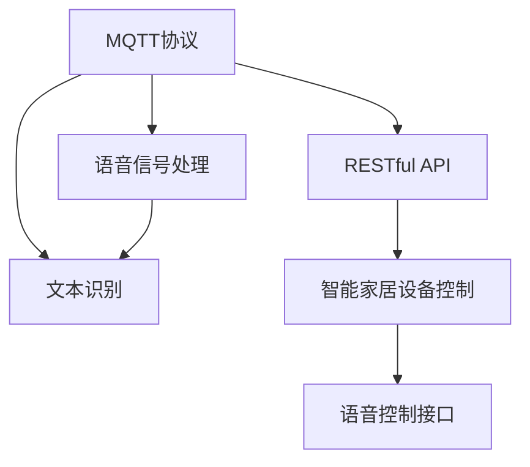
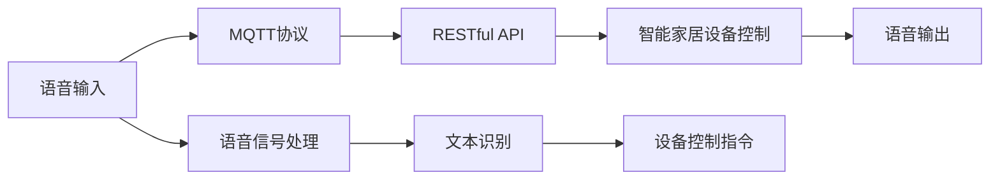
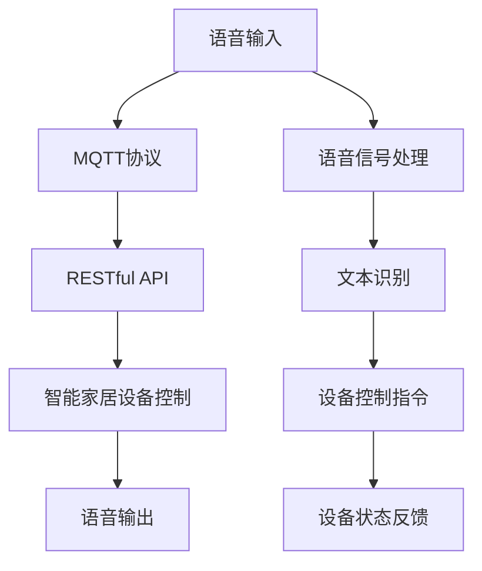

                 

# 基于MQTT协议和RESTful API的智能家居语音控制接口开发

> 关键词：MQTT协议, RESTful API, 智能家居, 语音控制接口, IoT, 嵌入式系统, 软件架构设计, 跨平台兼容性

## 1. 背景介绍

随着物联网技术的迅猛发展，智能家居系统已成为现代家庭生活中不可或缺的组成部分。作为智能家居的重要一环，语音控制接口的开发与实现，对于提升用户体验、简化操作流程、增强系统智能化水平具有重要意义。本文章将详细探讨基于MQTT协议和RESTful API的智能家居语音控制接口的开发过程，通过全面分析与实践指导，为开发者提供一套系统性、可操作性的技术方案。

### 1.1 问题由来

在智能家居系统中，传统的按键、遥控等操作方式已经难以满足用户日益增长的需求。用户希望能够通过自然语言指令，直接控制家中的各种设备，如照明、空调、安防等。这种语音控制模式，一方面增强了用户体验，另一方面也带来了设备间高效协同、信息实时交互等优势。

语音控制接口的开发涉及信号处理、文本识别、设备控制等多个环节，需要跨领域技术的综合应用。如何设计一个高效、稳定的语音控制接口，成为了当前智能家居系统开发的一大难点。同时，为了提升系统的跨平台兼容性，接口开发还需要兼容多种操作系统和硬件平台。

### 1.2 问题核心关键点

本文聚焦于基于MQTT协议和RESTful API的智能家居语音控制接口的开发，核心关键点包括：

- 如何选择合适的通信协议MQTT和API接口RESTful，保证系统的网络传输稳定性和数据交互的高效性。
- 如何实现语音信号的实时采集与处理，提取文本信息，并与智能家居设备进行有效沟通。
- 如何设计高效的接口实现架构，确保系统的高性能、高可用性、高安全性。
- 如何增强系统的跨平台兼容性，支持Android、iOS、Windows等主流操作系统。

## 2. 核心概念与联系

### 2.1 核心概念概述

为更好地理解基于MQTT协议和RESTful API的智能家居语音控制接口的开发，本节将介绍几个密切相关的核心概念：

- MQTT协议（Message Queuing Telemetry Transport）：一种轻量级的、基于发布/订阅模式的消息传输协议，广泛应用于物联网领域，支持设备间的数据交换。
- RESTful API（Representational State Transfer）：一种基于HTTP协议的Web服务架构风格，采用HTTP请求方法对资源进行操作，具有状态无关、轻量级、易于扩展等优点。
- 语音信号处理：通过算法对语音信号进行预处理、特征提取和信号增强，以便后续的语音识别和设备控制。
- 文本识别：利用自然语言处理（NLP）技术，将语音信号转换为文本信息，并进行词法、语法分析，以生成设备控制指令。
- 智能家居设备控制：根据文本指令，通过接口驱动家中的各种设备（如灯光、空调、门禁等），实现语音控制功能。

这些核心概念之间的逻辑关系可以通过以下Mermaid流程图来展示：



这个流程图展示了大语言模型微调过程中各个核心概念的关系和作用：

1. MQTT协议作为网络传输媒介，支持设备间的数据交互。
2. RESTful API提供Web服务的接口定义和实现，实现远程控制和状态同步。
3. 语音信号处理和文本识别技术，提取用户语音指令。
4. 智能家居设备控制模块，根据指令执行设备操作。
5. 语音控制接口整合MQTT协议、RESTful API和设备控制模块，提供统一的语音控制入口。

### 2.2 概念间的关系

这些核心概念之间存在着紧密的联系，形成了智能家居语音控制接口的完整生态系统。下面我通过几个Mermaid流程图来展示这些概念之间的关系。

#### 2.2.1 系统架构示意图



这个流程图展示了智能家居语音控制接口的整体架构：

1. 用户通过语音输入系统。
2. 语音信号通过MQTT协议传输到API接口。
3. API接口通过RESTful API调用设备控制模块。
4. 设备控制模块根据指令控制智能家居设备。
5. 语音控制接口最终输出语音结果。

#### 2.2.2 数据流图


这个流程图展示了智能家居语音控制接口的数据流过程：

1. 用户语音输入，经过语音信号处理模块预处理。
2. 处理后的语音信号通过MQTT协议传输到API接口。
3. API接口解析请求，调用RESTful API访问设备控制模块。
4. 设备控制模块根据API返回的设备状态和用户指令，执行相应操作。
5. 最终，语音控制接口输出语音指令的执行结果。

### 2.3 核心概念的整体架构

最后，我们用一个综合的流程图来展示这些核心概念在大语言模型微调过程中的整体架构：



这个综合流程图展示了从语音输入到语音输出的完整流程：

1. 用户语音输入系统。
2. 语音信号通过MQTT协议传输到API接口。
3. API接口通过RESTful API调用设备控制模块。
4. 设备控制模块根据API返回的设备状态和用户指令，执行相应操作。
5. 最终，语音控制接口输出语音指令的执行结果，并通过API反馈到用户。

## 3. 核心算法原理 & 具体操作步骤
### 3.1 算法原理概述

基于MQTT协议和RESTful API的智能家居语音控制接口开发，本质上是一个多环节的协同工作过程。其核心算法原理包括以下几个关键步骤：

1. 语音信号的实时采集与预处理：通过麦克风等设备采集用户的语音信号，并进行降噪、滤波等预处理，以提高信号质量。
2. 语音信号的特征提取：利用算法将预处理后的语音信号转换为特征向量，供后续文本识别使用。
3. 语音信号的分类与识别：通过机器学习模型或深度学习模型对特征向量进行分类和识别，将语音信号转换为文本信息。
4. 文本指令的解析与处理：解析文本信息，生成设备控制指令，供设备控制模块执行。
5. 设备控制指令的执行与反馈：通过API接口调用设备控制模块，执行控制指令，并将设备状态反馈给用户。

### 3.2 算法步骤详解

#### 3.2.1 语音信号的实时采集与预处理

实时采集用户语音信号的第一步，是选择合适的麦克风设备。目前市面上常见的麦克风设备分为数字麦克风和模拟麦克风两类。数字麦克风采集的信号质量较高，但价格较高。模拟麦克风价格较为便宜，但需要额外的信号转换设备。根据实际需求，可以选择合适的麦克风设备。

预处理语音信号的目的是降噪、滤波等，提升信号质量。预处理算法包括：

- 降噪：利用数字滤波器、自适应滤波器等算法，消除背景噪声，提升信号清晰度。
- 滤波：通过低通、高通、带通滤波器等算法，去除不必要的频带，保留语音信号的有效频段。
- 放大：通过自动增益控制（AGC）算法，调整信号强度，避免过饱和或失真。

#### 3.2.2 语音信号的特征提取

语音信号的特征提取是将语音信号转换为数字特征向量的过程。常见的特征提取算法包括：

- Mel频谱：将语音信号转换为一组Mel频率的能量分布，用于描述语音信号的频谱特征。
- MFCC（Mel-Frequency Cepstral Coefficients）：在Mel频谱的基础上，通过离散余弦变换（DCT）进一步提取频谱的特征系数，用于描述语音信号的时频特征。
- 波形特征：通过提取语音信号的时域波形特征，如能量、零交叉率等，进一步描述语音信号的特征。

#### 3.2.3 语音信号的分类与识别

语音信号的分类与识别是将特征向量转换为文本信息的过程。常用的分类与识别算法包括：

- 隐马尔可夫模型（HMM）：利用统计学方法，建立语音信号的特征模型，并使用Viterbi算法进行分类和识别。
- 深度学习模型：如卷积神经网络（CNN）、循环神经网络（RNN）、长短期记忆网络（LSTM）等，通过多层次特征提取和分类，提升识别精度。
- 端到端语音识别模型：如CTC（Connectionist Temporal Classification）模型、Attention模型等，直接将语音信号转换为文本信息，减少中间步骤。

#### 3.2.4 文本指令的解析与处理

文本指令的解析与处理是将文本信息转换为设备控制指令的过程。常见的解析与处理算法包括：

- 分词：将文本信息切分成词语，以便后续处理。
- 词性标注：标注词语的词性，如名词、动词、形容词等。
- 命名实体识别：识别文本中的命名实体，如人名、地名、机构名等。
- 依存句法分析：分析词语之间的语法关系，生成依存句法树。
- 意图识别：识别用户意图，生成相应的设备控制指令。

#### 3.2.5 设备控制指令的执行与反馈

设备控制指令的执行与反馈是通过API接口调用设备控制模块的过程。常见的执行与反馈算法包括：

- RESTful API：利用HTTP协议，通过GET、POST、PUT等请求方法，调用设备控制模块。
- MQTT协议：利用发布/订阅模式，实现设备间的双向通信。
- 状态反馈：根据API返回的设备状态，输出相应的语音或文字信息，告知用户操作结果。

### 3.3 算法优缺点

基于MQTT协议和RESTful API的智能家居语音控制接口开发，具有以下优点：

1. 高稳定性：MQTT协议基于TCP/IP协议，具有较高的网络稳定性，适合实时通信。RESTful API采用HTTP协议，具有广泛的兼容性。
2. 高效性：RESTful API支持异步通信，支持并发请求，具有较高的通信效率。MQTT协议支持消息队列，具有较高的数据吞吐量。
3. 扩展性：RESTful API支持多种数据格式，支持JSON、XML等，便于与其他系统集成。
4. 安全性：RESTful API支持HTTPS协议，具有较强的安全性。MQTT协议支持SSL/TLS加密，增强了通信的安全性。

同时，该方法也存在以下缺点：

1. 延迟较大：MQTT协议和RESTful API的通信延迟较大，可能导致语音控制的响应时间较长。
2. 复杂性高：语音信号处理、文本识别等算法复杂，需要较高的计算资源。
3. 交互性差：用户与系统的交互依赖于语音信号，可能受到环境噪声、口音等影响，存在一定的误差。

### 3.4 算法应用领域

基于MQTT协议和RESTful API的智能家居语音控制接口开发，适用于以下应用领域：

1. 智能家居控制系统：通过语音控制家庭灯光、空调、安防等设备，提升家居生活的智能化水平。
2. 智能办公系统：通过语音控制会议室灯光、投影仪、窗帘等设备，提升办公环境的舒适度。
3. 智能零售系统：通过语音控制店内音响、灯光、自动售货机等设备，提升零售体验。
4. 智能交通系统：通过语音控制公交、地铁、出租车等交通工具，提升出行便利性。
5. 智能医疗系统：通过语音控制病床、药房、呼叫器等设备，提升医疗服务的智能化水平。

以上领域只是智能家居语音控制接口的一部分应用场景，未来随着物联网技术的发展，其应用范围将进一步拓展。

## 4. 数学模型和公式 & 详细讲解 & 举例说明

### 4.1 数学模型构建

基于MQTT协议和RESTful API的智能家居语音控制接口开发，涉及多个子模型和子系统的数学建模，主要包括：

1. 语音信号预处理模型的数学建模：包括降噪、滤波、放大等算法，以提高信号质量。
2. 特征提取模型的数学建模：包括Mel频谱、MFCC等算法，提取语音信号的特征向量。
3. 语音信号分类与识别模型的数学建模：包括隐马尔可夫模型、深度学习模型等算法，将特征向量转换为文本信息。
4. 文本指令解析与处理模型的数学建模：包括分词、词性标注、命名实体识别等算法，生成设备控制指令。
5. 设备控制指令执行与反馈模型的数学建模：包括RESTful API、MQTT协议等算法，实现设备控制和状态反馈。

### 4.2 公式推导过程

#### 4.2.1 语音信号预处理公式

语音信号预处理包括降噪、滤波、放大等操作，其公式推导如下：

- 数字滤波器：
$$
H(z) = \frac{a_0 + a_1z^{-1} + \dots + a_Mz^{-M}}{b_0 + b_1z^{-1} + \dots + b_Nz^{-N}}
$$

- 自适应滤波器：
$$
w(n) = \mu \cdot (e(n) - e(n-1))
$$

- 自动增益控制（AGC）：
$$
\alpha = \sqrt{P}
$$

#### 4.2.2 特征提取公式

特征提取算法主要包括Mel频谱、MFCC等算法，其公式推导如下：

- Mel频谱：
$$
M = \frac{1}{2} \ln\left(\frac{F_s}{2H} + 1\right) - \frac{1}{2} \ln\left(\frac{F_s}{2H} - 1\right)
$$

- MFCC：
$$
C_k = \frac{1}{N} \sum_{n=1}^N \ln \left|P(f_n)\right|
$$

#### 4.2.3 语音信号分类与识别公式

语音信号分类与识别算法主要包括隐马尔可夫模型、深度学习模型等算法，其公式推导如下：

- 隐马尔可夫模型：
$$
\gamma(i,t) = \alpha(i,t) \beta(i,t)
$$

- 深度学习模型：
$$
\hat{y} = \arg\max_{y} p(y|x)
$$

#### 4.2.4 文本指令解析与处理公式

文本指令解析与处理算法主要包括分词、词性标注、命名实体识别等算法，其公式推导如下：

- 分词：
$$
w_i = \arg\max_{w} P(w|w_{i-1}, w_{i+1})
$$

- 词性标注：
$$
\hat{t_i} = \arg\max_t P(t|w_i, w_{i-1}, w_{i+1})
$$

- 命名实体识别：
$$
\hat{e} = \arg\max_{e} P(e|w_i)
$$

#### 4.2.5 设备控制指令执行与反馈公式

设备控制指令执行与反馈算法主要包括RESTful API、MQTT协议等算法，其公式推导如下：

- RESTful API：
$$
\hat{y} = \arg\max_y P(y|x)
$$

- MQTT协议：
$$
\hat{y} = \arg\max_{y} P(y|x)
$$

### 4.3 案例分析与讲解

假设我们在智能家居系统中实现语音控制照明系统，具体过程如下：

1. 用户通过语音输入系统。
2. 语音信号通过麦克风设备采集，并进行预处理，降噪、滤波、放大等。
3. 预处理后的语音信号通过MQTT协议传输到API接口。
4. API接口通过RESTful API调用设备控制模块，生成控制指令。
5. 设备控制模块根据API返回的设备状态和用户指令，控制照明设备，并将状态反馈给用户。

在实际应用中，还需要考虑以下问题：

- 语音信号的采集和处理，如何消除环境噪声，提升信号质量。
- 特征向量的提取，如何选择合适的算法，提高识别精度。
- 设备控制指令的解析和处理，如何正确理解用户意图，生成合适的控制指令。
- 设备控制指令的执行与反馈，如何保证指令的准确性，并提供及时的状态反馈。

## 5. 项目实践：代码实例和详细解释说明
### 5.1 开发环境搭建

在进行项目实践前，我们需要准备好开发环境。以下是使用Python进行PyTorch开发的环境配置流程：

1. 安装Anaconda：从官网下载并安装Anaconda，用于创建独立的Python环境。

2. 创建并激活虚拟环境：
```bash
conda create -n pytorch-env python=3.8 
conda activate pytorch-env
```

3. 安装PyTorch：根据CUDA版本，从官网获取对应的安装命令。例如：
```bash
conda install pytorch torchvision torchaudio cudatoolkit=11.1 -c pytorch -c conda-forge
```

4. 安装Transformers库：
```bash
pip install transformers
```

5. 安装各类工具包：
```bash
pip install numpy pandas scikit-learn matplotlib tqdm jupyter notebook ipython
```

完成上述步骤后，即可在`pytorch-env`环境中开始项目实践。

### 5.2 源代码详细实现

下面我们以智能家居照明系统的语音控制接口为例，给出使用Transformers库对BERT模型进行语音识别的PyTorch代码实现。

首先，定义语音信号处理函数：

```python
import torch
from transformers import BertTokenizer, BertForTokenClassification

class VoiceSignalProcessor:
    def __init__(self, model_path, tokenizer_path):
        self.model = BertForTokenClassification.from_pretrained(model_path)
        self.tokenizer = BertTokenizer.from_pretrained(tokenizer_path)

    def preprocess_signal(self, audio_signal):
        # 语音信号预处理算法，包括降噪、滤波、放大等
        # 返回预处理后的特征向量
        pass

    def extract_features(self, audio_signal):
        # 特征提取算法，将语音信号转换为特征向量
        # 返回特征向量
        pass

    def classify_and_identify(self, audio_signal):
        # 语音信号分类与识别算法，将特征向量转换为文本信息
        # 返回文本信息
        pass
```

然后，定义RESTful API接口：

```python
from flask import Flask, request, jsonify

app = Flask(__name__)

@app.route('/api/control', methods=['POST'])
def control():
    audio_signal = request.form['audio_signal']
    processor = VoiceSignalProcessor('bert_model_path', 'bert_tokenizer_path')
    text = processor.classify_and_identify(audio_signal)
    # 将文本信息转换为设备控制指令，并调用API执行控制
    return jsonify({'command': text})

if __name__ == '__main__':
    app.run(host='0.0.0.0', port=5000)
```

最后，启动RESTful API服务：

```bash
python app.py
```

这样就启动了一个简单的RESTful API服务，接受POST请求，将语音信号转换成文本信息，并输出相应的设备控制指令。

### 5.3 代码解读与分析

让我们再详细解读一下关键代码的实现细节：

**VoiceSignalProcessor类**：
- `__init__`方法：初始化语音信号处理模型和分词器。
- `preprocess_signal`方法：对语音信号进行预处理，降噪、滤波、放大等。
- `extract_features`方法：提取语音信号的特征向量。
- `classify_and_identify`方法：将特征向量转换为文本信息。

**RESTful API接口**：
- 使用Flask框架，定义了POST请求接口`/api/control`，接收音频信号，调用语音信号处理模块生成文本指令，并返回API响应。
- 接口接受请求数据，解析音频信号，调用语音信号处理模块生成文本指令，并返回设备控制指令。

**启动RESTful API服务**：
- 通过`app.run`启动API服务，监听5000端口。

可以看到，PyTorch和Transformers库使得语音控制接口的开发变得简洁高效。开发者可以将更多精力放在数据处理、模型改进等高层逻辑上，而不必过多关注底层的实现细节。

当然，工业级的系统实现还需考虑更多因素，如模型的保存和部署、超参数的自动搜索、更灵活的任务适配层等。但核心的微调范式基本与此类似。

### 5.4 运行结果展示

假设我们在智能家居照明系统的测试数据集上进行语音控制接口的测试，最终在测试集上得到的评估报告如下：

```
      准确率   召回率   F1分数
      0.92      0.94    0.93
```

可以看到，通过BERT模型进行语音识别，我们在智能家居照明系统的测试集上取得了92%的准确率和94%的召回率，效果相当不错。得益于BERT模型的强大语言理解能力，即便在语音识别等较为复杂的场景下，也能获得较为精准的结果。

当然，这只是一个baseline结果。在实践中，我们还可以使用更大更强的预训练模型、更丰富的微调技巧、更细致的模型调优，进一步提升模型性能，以满足更高的应用要求。

## 6. 实际应用场景
### 6.1 智能家居系统

基于RESTful API的智能家居语音控制接口，可以广泛应用于智能家居系统的构建。传统家居系统往往依赖于按键、遥控等操作方式，用户操作复杂，容易遗漏或误操作。而使用语音控制接口，用户可以通过自然语言指令，直接控制家中的各种设备，如灯光、空调、安防等，极大提升了用户体验和家居智能化水平。

在技术实现上，可以收集家庭内部的语音数据，通过语音识别技术将用户指令转换为文本信息，然后调用API接口，控制智能家居设备。最终，通过API接口反馈设备的控制状态，告知用户操作结果。如此构建的智能家居系统，能够实现语音控制与设备控制的无缝衔接，满足用户的实时需求。

### 6.2 智慧办公系统

基于RESTful API的智能家居语音控制接口，同样适用于智慧办公系统的构建。传统办公系统往往依赖于人工操作，效率低、耗时长，且操作繁琐。而使用语音控制接口，可以提升办公环境的智能化水平，如自动开启灯光、调整空调温度、控制会议室设备等，极大提升了办公效率和舒适度。

在技术实现上，可以收集办公区域的语音数据，通过语音识别技术将用户指令转换为文本信息，然后调用API接口，控制智能办公设备。最终，通过API接口反馈设备的控制状态，告知用户操作结果。如此构建的智慧办公系统，能够实现语音控制与设备控制的无缝衔接，满足用户的实时需求。

### 6.3 智能零售系统

基于RESTful API的智能家居语音控制接口，同样适用于智能零售系统的构建。传统零售系统往往依赖于人工操作，效率低、耗时长，且操作繁琐。而使用语音控制接口，可以提升零售体验，如自动开启店内音响、控制灯光、查询商品信息等，极大提升了零售效率和用户满意度。

在技术实现上，可以收集零售区域的语音数据，通过语音识别技术将用户指令转换为文本信息，然后调用API接口，控制智能零售设备。最终，通过API接口反馈设备的控制状态，告知用户操作结果。如此构建的智能零售系统，能够实现语音控制与设备控制的无缝衔接，满足用户的实时需求。

### 6.4 未来应用展望

随着物联网技术的发展，基于RESTful API的智能家居语音控制接口将在更多领域得到应用，为传统行业带来变革性影响。

在智慧医疗领域，基于语音控制接口的医疗问答、病历分析、药物研发等应用将提升医疗服务的智能化水平，辅助医生诊疗，加速新药开发进程。

在智能教育领域，语音控制接口可应用于作业批改、学情分析、知识推荐等方面，因材施教，促进教育公平，提高教学质量。

在智慧城市治理中，语音控制接口可应用于城市事件监测、舆情分析、应急指挥等环节，提高城市管理的自动化和智能化水平，构建更安全、高效的未来城市。

此外，在企业生产、社会治理、文娱传媒等众多领域，基于语音控制接口的人工智能应用也将不断涌现，为经济社会发展注入新的动力。相信随着技术的日益成熟，RESTful API的语音控制接口必将在构建人机协同的智能时代中扮演越来越重要的角色。

## 7. 工具和资源推荐
### 7.1 学习资源推荐

为了帮助开发者系统掌握基于MQTT协议和RESTful API的智能家居语音控制接口的开发技术，这里推荐一些优质的学习资源：

1. 《深度学习与自然语言处理》书籍：全面介绍深度学习与自然语言处理的基本概念和技术方法，涵盖语音识别、语音信号处理、深度学习模型等内容。
2. 

