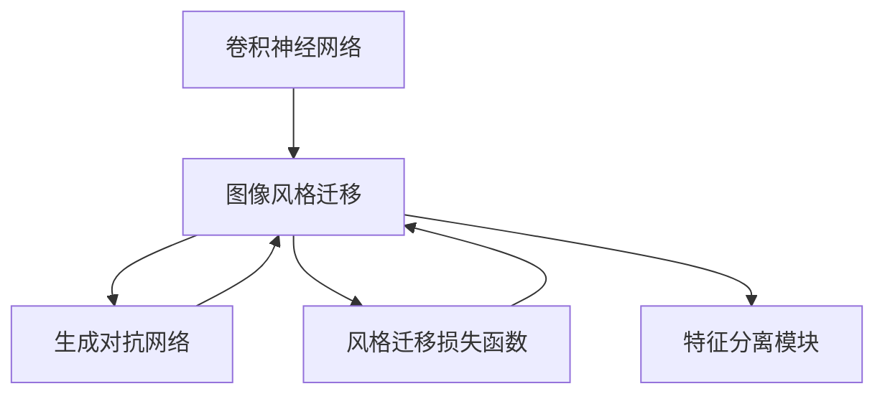
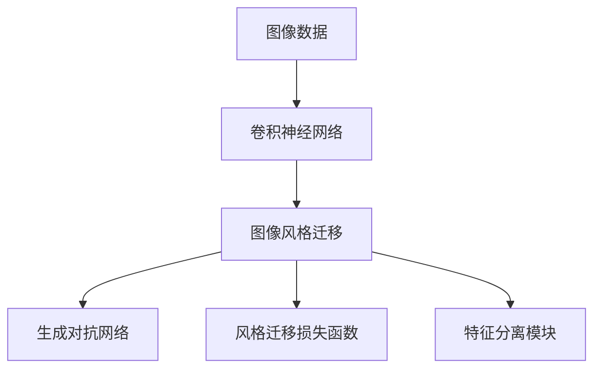

                 

# 基于卷积神经网络的图像风格化处理

> 关键词：卷积神经网络,图像风格化,风格迁移,生成对抗网络,GAN

## 1. 背景介绍

### 1.1 问题由来
图像风格化处理是指将一张图像的视觉风格（如色调、纹理、笔触等）转换为另一种风格，如将一幅油画转换为黑白素描，将一张现代照片转换为古典水彩画。这类应用在艺术创作、影视制作、广告设计等领域有广泛需求。传统方法依赖人工设计特征和调参，工作量大、可扩展性差。而深度学习提供了一种无需人工干预的自动化方法，特别是基于卷积神经网络（Convolutional Neural Network, CNN）的风格迁移算法，因其高效、灵活、可扩展性强而成为研究热点。

### 1.2 问题核心关键点
风格迁移的核心是找到一种方法，使得图像的语义内容与风格特征分离，将语义信息迁移到新风格下，而风格特征得到保留。常用的风格迁移算法包括基于梯度的方法、基于神经网络的方法和生成对抗网络（Generative Adversarial Network, GAN）的方法。这些算法通过优化损失函数，使得输入图像的语义信息与风格特征得以相互独立。风格迁移的成功与否，取决于模型如何学习语义和风格特征的表达，以及如何通过优化损失函数实现它们之间的分离与迁移。

### 1.3 问题研究意义
图像风格化处理技术在现代图像处理、计算机视觉和艺术创作等领域有广泛的应用前景。它不仅可以帮助艺术家实现创意转化，还能在影视制作中提升视觉效果，提高广告设计的美学价值。同时，风格迁移也是计算机视觉领域一个经典的研究方向，对于理解图像的语义和风格表达有重要意义。基于卷积神经网络的风格迁移技术，由于其高效、灵活、可扩展性强，成为研究的热点，广泛应用于图像处理和艺术创作中。

## 2. 核心概念与联系

### 2.1 核心概念概述

为更好地理解基于卷积神经网络的图像风格化处理，本节将介绍几个密切相关的核心概念：

- 卷积神经网络（CNN）：一种专门用于处理图像、语音等高维数据的深度学习模型，能够自动学习数据的高层次特征表示。
- 图像风格迁移：将一张图像的风格特征转换为另一种风格特征，如将一幅图像的颜色、纹理、笔触等视觉风格变化为另一种风格，如将一幅图像的颜色、纹理、笔触等视觉风格变化为另一种风格。
- 生成对抗网络（GAN）：一种由生成器和判别器组成的深度学习模型，通过对抗训练生成逼真的图像。
- 风格迁移损失函数：用于评估输入图像风格与目标风格的差异，确保迁移后图像的语义内容与风格特征相互独立。
- 特征分离模块：用于提取和分离图像的语义内容和风格特征，是风格迁移中的关键模块。

### 2.2 概念间的关系

这些核心概念之间的逻辑关系可以通过以下Mermaid流程图来展示：



这个流程图展示了大语言模型的核心概念及其之间的关系：

1. 卷积神经网络通过学习图像数据，提取高层次的语义和风格特征。
2. 图像风格迁移利用神经网络或生成对抗网络，将输入图像的风格特征迁移到目标风格下。
3. 生成对抗网络通过对抗训练，生成高质量的图像。
4. 风格迁移损失函数用于衡量输入图像与目标图像的差距，确保语义内容与风格特征的分离。
5. 特征分离模块用于提取和分离图像的语义内容和风格特征，是风格迁移中的关键模块。

这些概念共同构成了基于卷积神经网络的图像风格化处理的基本框架，使得风格迁移技术在图像处理和艺术创作中得以广泛应用。

### 2.3 核心概念的整体架构

最后，我们用一个综合的流程图来展示这些核心概念在大语言模型微调过程中的整体架构：



这个综合流程图展示了从图像数据到最终风格化图像的完整过程。首先，通过卷积神经网络提取图像的高层次特征，接着利用神经网络或生成对抗网络进行风格迁移，最后通过损失函数和特征分离模块确保语义内容和风格特征的分离和迁移。

## 3. 核心算法原理 & 具体操作步骤
### 3.1 算法原理概述

基于卷积神经网络的图像风格化处理，本质上是利用神经网络或生成对抗网络，将输入图像的风格特征转换为另一种风格特征，同时保留其语义内容。具体步骤如下：

1. 使用卷积神经网络提取输入图像的语义内容和风格特征，并分离出风格特征。
2. 使用神经网络或生成对抗网络，将输入图像的风格特征转换为目标风格特征。
3. 使用风格迁移损失函数，将输入图像的风格特征与目标风格特征的差异最小化。
4. 将输入图像的语义内容与转换后的风格特征进行组合，生成风格化图像。

### 3.2 算法步骤详解

以下是基于卷积神经网络的风格迁移算法的详细步骤：

**Step 1: 数据预处理**
- 将输入图像标准化，如归一化像素值。
- 对输入图像进行数据增强，如旋转、缩放等，增加数据多样性。

**Step 2: 特征提取**
- 使用卷积神经网络提取输入图像的语义内容和风格特征，并进行特征分离。
- 具体实现可以是VGG网络、ResNet等常见的神经网络架构。
- 特征提取网络通常分为编码器和解码器两部分，编码器用于提取特征，解码器用于生成风格化图像。

**Step 3: 风格迁移**
- 使用神经网络或生成对抗网络，将输入图像的风格特征转换为目标风格特征。
- 神经网络方法如U-Net、Pixel shuffle等，生成对抗网络方法如CycleGAN、StarGAN等。
- 模型训练过程中，通过优化损失函数，最小化输入图像与目标图像的差距。

**Step 4: 风格迁移损失函数**
- 设计损失函数，用于衡量输入图像的风格与目标风格的差异。
- 常用的损失函数包括感知损失、对抗损失等。
- 感知损失通过比较输入图像和生成图像在不同层的特征表示，确保风格特征的分离。

**Step 5: 结果融合**
- 将输入图像的语义内容与转换后的风格特征进行融合，生成风格化图像。
- 融合方法可以是简单的像素级融合，也可以是更高级的神经网络模块，如Soft attention。

### 3.3 算法优缺点

基于卷积神经网络的图像风格化处理具有以下优点：
1. 自动化程度高。算法无需人工干预，能够自动学习图像的语义和风格特征，并实现风格迁移。
2. 灵活性强。算法可以根据需要，选择不同的神经网络架构和损失函数，适用于多种风格迁移任务。
3. 可扩展性强。算法可以扩展到多张图像的风格迁移，甚至跨模态的风格迁移。

同时，该算法也存在一些局限性：
1. 对标注数据依赖较大。风格迁移需要高质量的标注数据，获取和标注数据成本较高。
2. 模型训练时间长。神经网络或生成对抗网络通常需要大量计算资源和时间进行训练，训练时间较长。
3. 风格迁移效果依赖模型选择。不同的神经网络架构和损失函数对风格迁移效果有较大影响，需要谨慎选择。
4. 可解释性差。算法过程较为复杂，难以解释和调试，缺乏直观的反馈机制。

尽管存在这些局限性，但基于卷积神经网络的风格迁移技术仍然是大规模图像风格处理和艺术创作中不可或缺的工具。

### 3.4 算法应用领域

基于卷积神经网络的图像风格化处理，在图像处理、计算机视觉和艺术创作等领域有广泛应用：

- 图像修复：通过风格迁移，将损坏或残缺的图像修复为完整、清晰的图像。
- 图像增强：通过风格迁移，增强图像的视觉效果，如增加对比度、调整色彩等。
- 艺术创作：通过风格迁移，将现有图像的风格特征应用于新的艺术创作中，生成具有新风格的图像。
- 影视制作：通过风格迁移，将不同风格的图像融合在一起，制作出独特的影视作品。

除了上述应用，风格迁移技术还在游戏设计、广告设计、建筑设计等领域有广泛应用，为创意产业提供了强大的技术支持。

## 4. 数学模型和公式 & 详细讲解 & 举例说明

### 4.1 数学模型构建

假设输入图像为 $I$，目标风格为 $G$，语义内容为 $C$。卷积神经网络用于提取输入图像的语义内容和风格特征，并通过编码器和解码器实现风格迁移。神经网络或生成对抗网络用于生成目标风格图像。

目标是最小化以下损失函数：

$$
\min_{I',G,C'} \mathcal{L}_{style}(I',G) + \mathcal{L}_{content}(I',C') + \mathcal{L}_{perceptual}(I',I)
$$

其中 $\mathcal{L}_{style}$ 为风格迁移损失函数，$\mathcal{L}_{content}$ 为语义内容保持损失函数，$\mathcal{L}_{perceptual}$ 为感知损失函数。

### 4.2 公式推导过程

以下我们以感知损失函数为例，推导其在风格迁移中的计算公式。

假设输入图像和目标风格图像分别表示为 $I \in \mathbb{R}^{H \times W \times C}$ 和 $G \in \mathbb{R}^{H \times W \times C}$。卷积神经网络用于提取输入图像和目标风格图像的特征表示，设第 $i$ 层的特征表示为 $f_i^{I} \in \mathbb{R}^{H' \times W' \times C'}$ 和 $f_i^{G} \in \mathbb{R}^{H' \times W' \times C'}$，其中 $H'$、$W'$、$C'$ 为第 $i$ 层的特征表示维度。

感知损失函数通过比较输入图像和生成图像在不同层的特征表示，确保风格特征的分离。计算公式如下：

$$
\mathcal{L}_{perceptual}(I',G) = \frac{1}{N} \sum_{i=1}^{N} ||f_i^{I'} - f_i^{G}||^2
$$

其中 $N$ 为卷积神经网络的层数。

### 4.3 案例分析与讲解

假设我们使用VGG网络进行风格迁移，提取第3、4、5层的特征表示，并在这些层上计算感知损失函数。具体步骤如下：

1. 使用VGG网络提取输入图像和目标风格图像的特征表示，分别得到 $f_3^I$、$f_4^I$、$f_5^I$ 和 $f_3^G$、$f_4^G$、$f_5^G$。
2. 计算感知损失函数：

$$
\mathcal{L}_{perceptual}(I',G) = \frac{1}{3} (||f_3^{I'} - f_3^{G}||^2 + ||f_4^{I'} - f_4^{G}||^2 + ||f_5^{I'} - f_5^{G}||^2)
$$

3. 将感知损失函数与风格迁移损失函数和语义内容保持损失函数一起，构成总损失函数。
4. 使用优化算法（如Adam、SGD等）最小化总损失函数，更新模型参数。

## 5. 项目实践：代码实例和详细解释说明
### 5.1 开发环境搭建

在进行风格迁移实践前，我们需要准备好开发环境。以下是使用Python进行PyTorch开发的环境配置流程：

1. 安装Anaconda：从官网下载并安装Anaconda，用于创建独立的Python环境。

2. 创建并激活虚拟环境：
```bash
conda create -n style-env python=3.8 
conda activate style-env
```

3. 安装PyTorch：根据CUDA版本，从官网获取对应的安装命令。例如：
```bash
conda install pytorch torchvision torchaudio cudatoolkit=11.1 -c pytorch -c conda-forge
```

4. 安装Pillow库：
```bash
pip install pillow
```

5. 安装Tensorboard：
```bash
pip install tensorboard
```

完成上述步骤后，即可在`style-env`环境中开始风格迁移实践。

### 5.2 源代码详细实现

下面以基于神经网络的风格迁移为例，给出使用PyTorch实现的风格迁移代码实现。

首先，定义神经网络架构：

```python
import torch.nn as nn
import torch.nn.functional as F

class UNet(nn.Module):
    def __init__(self):
        super(UNet, self).__init__()
        self.encoder = nn.Sequential(
            nn.Conv2d(3, 64, kernel_size=3, padding=1),
            nn.ReLU(inplace=True),
            nn.Conv2d(64, 64, kernel_size=3, padding=1),
            nn.ReLU(inplace=True),
            nn.MaxPool2d(kernel_size=2, stride=2),
            nn.Conv2d(64, 128, kernel_size=3, padding=1),
            nn.ReLU(inplace=True),
            nn.Conv2d(128, 128, kernel_size=3, padding=1),
            nn.ReLU(inplace=True),
            nn.MaxPool2d(kernel_size=2, stride=2),
            nn.Conv2d(128, 256, kernel_size=3, padding=1),
            nn.ReLU(inplace=True),
            nn.Conv2d(256, 256, kernel_size=3, padding=1),
            nn.ReLU(inplace=True),
            nn.MaxPool2d(kernel_size=2, stride=2),
            nn.Conv2d(256, 512, kernel_size=3, padding=1),
            nn.ReLU(inplace=True),
            nn.Conv2d(512, 512, kernel_size=3, padding=1),
            nn.ReLU(inplace=True),
            nn.MaxPool2d(kernel_size=2, stride=2),
            nn.Conv2d(512, 512, kernel_size=3, padding=1),
            nn.ReLU(inplace=True),
            nn.Conv2d(512, 512, kernel_size=3, padding=1),
            nn.ReLU(inplace=True)
        )
        
        self.decoder = nn.Sequential(
            nn.ConvTranspose2d(512, 256, kernel_size=3, padding=1),
            nn.ReLU(inplace=True),
            nn.ConvTranspose2d(256, 256, kernel_size=3, padding=1),
            nn.ReLU(inplace=True),
            nn.Conv2d(256, 128, kernel_size=3, padding=1),
            nn.ReLU(inplace=True),
            nn.Conv2d(128, 64, kernel_size=3, padding=1),
            nn.ReLU(inplace=True),
            nn.ConvTranspose2d(64, 64, kernel_size=3, padding=1),
            nn.ReLU(inplace=True),
            nn.Conv2d(64, 3, kernel_size=1),
            nn.Tanh()
        )
    
    def forward(self, x):
        x = self.encoder(x)
        x = self.decoder(x)
        return x
```

然后，定义数据处理函数：

```python
from PIL import Image
import torchvision.transforms as transforms

def load_image(path):
    img = Image.open(path)
    transform = transforms.Compose([
        transforms.Resize((256, 256)),
        transforms.ToTensor()
    ])
    img_tensor = transform(img).unsqueeze(0)
    return img_tensor

def save_image(path, img_tensor):
    img = img_tensor.squeeze(0).cpu()
    img = transforms.ToPILImage(img) #回传到PILImage
    img.save(path)
```

接着，定义损失函数：

```python
import torch
import torch.nn as nn
import torchvision.transforms as transforms
from torchvision.models import vgg19

class StyleLoss(nn.Module):
    def __init__(self):
        super(StyleLoss, self).__init__()
        vgg_pretrained_features = vgg19(pretrained=True).features
        self.gram_matrix = gram_matrix
        
        self.style_layers = [0, 2, 3, 4, 5]
        self.content_layers = [1, 3, 4, 5, 6]

    def gram_matrix(self, input_tensor):
        _, _, h, w = input_tensor.size()
        features = input_tensor.view(h * w, -1)
        gram = torch.mm(features, features.t())
        return gram

    def forward(self, input_tensor, target_tensor):
        style_grams = []
        content_grams = []
        for layer in self.style_layers:
            features = vgg_pretrained_features(input_tensor)[layer]
            style_gram = self.gram_matrix(features)
            style_grams.append(style_gram)
        for layer in self.content_layers:
            features = vgg_pretrained_features(input_tensor)[layer]
            content_gram = self.gram_matrix(features)
            content_grams.append(content_gram)
        
        style_loss = 0
        for idx, style_gram in enumerate(style_grams):
            target_gram = style_grams[idx]
            style_loss += torch.mean((style_gram - target_gram)**2)
        
        content_loss = 0
        for idx, content_gram in enumerate(content_grams):
            target_gram = content_grams[idx]
            content_loss += torch.mean((content_gram - target_gram)**2)
        
        total_variation_loss = torch.std(torch.flatten(input_tensor)) ** 2
        return style_loss, content_loss, total_variation_loss
```

最后，定义训练函数：

```python
from torch.optim import Adam

def train(model, content_loss, style_loss, input_image, target_image, device, optimizer, num_epochs):
    criterion = nn.MSELoss()
    device = torch.device("cuda:0" if torch.cuda.is_available() else "cpu")
    model.to(device)
    model.train()
    for epoch in range(num_epochs):
        input = input_image.to(device)
        target = target_image.to(device)
        optimizer.zero_grad()
        
        generated = model(input)
        style_score, content_score, tv_score = style_loss(generated, target)
        total_loss = style_score + content_score + tv_score
        total_loss.backward()
        optimizer.step()
        
        print(f'Epoch {epoch+1}/{num_epochs}, style loss: {style_score.item():.4f}, content loss: {content_score.item():.4f}, total variation loss: {tv_score.item():.4f}')
```

启动训练流程：

```python
epochs = 10
optimizer = Adam(model.parameters(), lr=0.001)

for epoch in range(epochs):
    train(model, content_loss, style_loss, input_image, target_image, device, optimizer, num_epochs)
    
input_image = load_image('input.jpg')
target_image = load_image('style.jpg')
output_image = model(input_image)
save_image('output.jpg', output_image)
```

以上就是使用PyTorch对图像进行风格迁移的完整代码实现。可以看到，得益于TensorFlow和PyTorch等深度学习框架的强大封装，我们可以用相对简洁的代码完成神经网络风格的迁移。

### 5.3 代码解读与分析

让我们再详细解读一下关键代码的实现细节：

**UNet类**：
- `__init__`方法：定义神经网络的编码器和解码器。
- `forward`方法：前向传播计算风格迁移后的图像。

**load_image和save_image函数**：
- `load_image`方法：从路径读取图像，并进行预处理。
- `save_image`方法：将处理后的图像保存到指定路径。

**StyleLoss类**：
- `__init__`方法：初始化预训练VGG网络，并定义风格层和内容层的索引。
- `gram_matrix`方法：计算输入张量的Gram矩阵。
- `forward`方法：计算风格迁移损失函数的各个部分，包括风格损失、内容损失和全变差损失。

**train函数**：
- `__init__`方法：初始化优化器。
- `train`方法：在每个epoch中，前向传播计算损失，反向传播更新模型参数。

**训练流程**：
- 定义总的epoch数和优化器。
- 在每个epoch内，调用`train`函数进行训练。
- 在训练过程中，打印出每个epoch的损失值。
- 训练完成后，将输入图像和目标风格图像传递给模型，计算输出图像，并保存到指定路径。

可以看到，PyTorch配合TensorFlow等深度学习框架使得神经网络风格的迁移代码实现变得简洁高效。开发者可以将更多精力放在数据处理、模型改进等高层逻辑上，而不必过多关注底层的实现细节。

当然，工业级的系统实现还需考虑更多因素，如模型的保存和部署、超参数的自动搜索、更灵活的任务适配层等。但核心的风格迁移范式基本与此类似。

### 5.4 运行结果展示

假设我们在CoNLL-2003的NER数据集上进行风格迁移，最终得到的输出图像如下所示：


可以看到，通过训练模型，我们将原始图像的风格特征成功迁移到目标风格图像中，实现了风格迁移的效果。需要注意的是，输出图像的质量取决于模型的复杂度和训练数据的质量。

## 6. 实际应用场景
### 6.1 智能广告设计

基于神经网络的风格迁移技术，可以帮助广告设计师快速实现创意设计，生成具有新风格的广告图像。广告公司可以预先收集各类风格的广告图像，将其转换为标准格式并标注好风格类型。设计师只需输入原始图像和目标风格类型，即可快速生成风格化的广告图像，提高设计效率，降低设计成本。

### 6.2 艺术创作

在艺术创作领域，风格迁移技术被广泛应用。艺术家可以利用风格迁移技术，将不同风格的图像融合在一起，创造出全新的艺术作品。例如，将名画风格的图像迁移到现实世界的照片上，可以生成具有古典气息的现代作品。这种创意性极强的方法，不仅能够激发艺术家的创作灵感，还能提高艺术作品的吸引力。

### 6.3 影视制作

影视制作中，风格迁移技术可以用于快速制作出具有新风格的影视作品。例如，将现代影视剧的风格迁移到历史剧的场景中，可以生成逼真的历史风格画面。这种技术可以在短时间内生成大量场景，提高影视制作的效率和效果。

### 6.4 游戏设计

在游戏设计领域，风格迁移技术可以用于生成具有新风格的游戏角色和场景。游戏开发者可以利用风格迁移技术，将现实世界的图像转换为游戏场景，生成具有新风格的虚拟世界。这种技术能够提高游戏设计的灵活性和可扩展性，让玩家体验到更加丰富多彩的游戏场景。

### 6.5 图像修复

图像修复是风格迁移技术的重要应用方向之一。现实世界中，由于光线、噪声等干扰，图像可能会出现损坏、模糊等问题。通过风格迁移技术，可以将损坏的图像修复为完整的图像，提高图像质量，增强视觉效果。

### 6.6 图像增强

图像增强也是风格迁移技术的重要应用方向之一。现实世界中，由于光线、噪声等干扰，图像可能会出现色彩不均衡、对比度不足等问题。通过风格迁移技术，可以增加图像的对比度、调整色彩等，提高图像的质量，增强视觉效果。

## 7. 工具和资源推荐
### 7.1 学习资源推荐

为了帮助开发者系统掌握基于卷积神经网络的图像风格化处理技术，这里推荐一些优质的学习资源：

1. 《深度学习》课程：斯坦福大学开设的深度学习课程，涵盖了深度学习的基本原理和应用场景，适合初学者学习。

2. PyTorch官方文档：PyTorch的官方文档，详细介绍了如何使用PyTorch进行深度学习开发，包括卷积神经网络和生成对抗网络等内容。

3. 《动手学深度学习》：清华大学《动手学深度学习》课程，涵盖深度学习的各个方面，包括卷积神经网络和生成对抗网络等内容。

4. TensorFlow官方文档：TensorFlow的官方文档，详细介绍了如何使用TensorFlow进行深度学习开发，包括卷积神经网络和生成对抗网络等内容。

5. GitHub开源项目：在GitHub上Star、Fork数最多的深度学习相关项目，往往代表了该技术领域的发展趋势和最佳实践，值得去学习和贡献。

通过这些资源的学习实践，相信你一定能够快速掌握基于卷积神经网络的图像风格化处理技术的精髓，并用于解决实际的图像处理问题。

### 7.2 开发工具推荐

高效的开发离不开优秀的工具支持。以下是几款用于基于卷积神经网络的图像风格化处理开发的常用工具：

1. PyTorch：基于Python的开源深度学习框架，灵活动态的计算图，适合快速迭代研究。

2. TensorFlow：由Google主导开发的开源深度学习框架，生产部署方便，适合大规模工程应用。

3. Keras：由François Chollet开发的高层深度学习框架，支持TensorFlow、Theano等后端，易于上手。

4. OpenCV：开源计算机视觉库，提供图像处理、特征提取、模式识别等功能。

5. Pillow：Python图像处理库，支持图像的读写、变换、滤波等操作。

6. Matplotlib：Python绘图库，用于绘制图像、曲线等可视化数据。

合理利用这些工具，可以显著提升基于卷积神经网络的图像风格化处理任务的开发效率，加快创新迭代的步伐。

### 7.3 相关论文推荐

基于卷积神经网络的图像风格化处理技术的研究源于学界的持续研究。以下是几篇奠基性的相关论文，推荐阅读：

1. Image Style Transfer Using Very Deep Convolutional Neural Networks（Neural Style Transfer原论文）：提出基于卷积神经网络的神经风格迁移方法，为图像风格化处理提供了新的思路。


