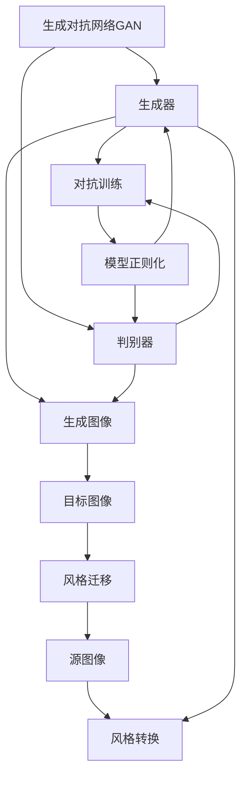
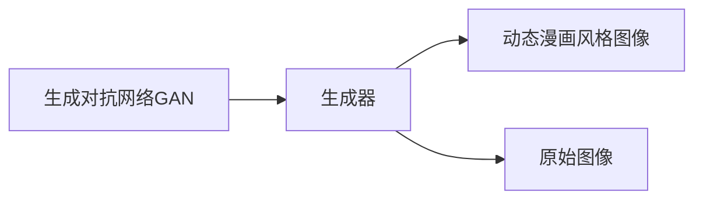
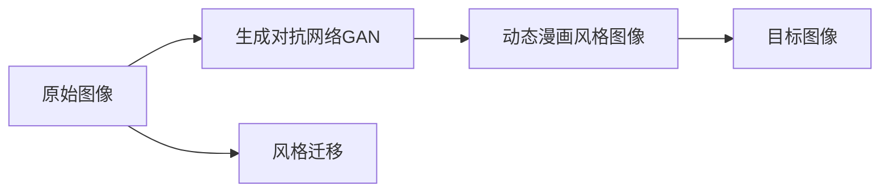
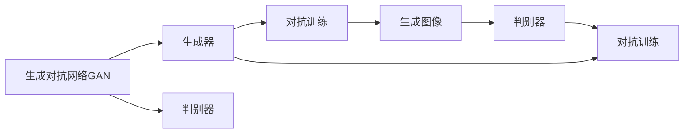
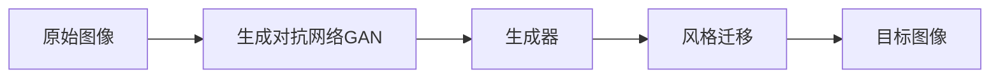
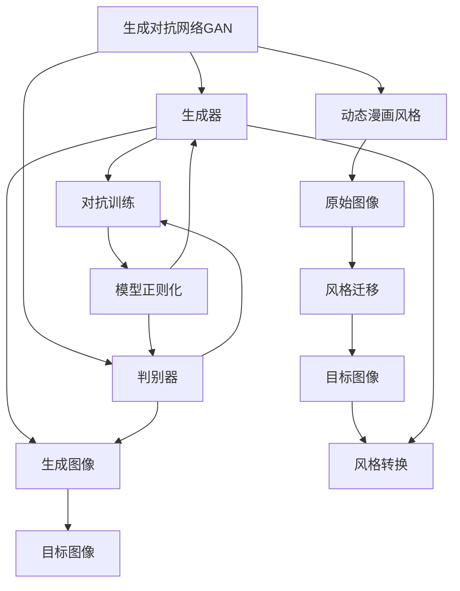

                 

# 基于生成对抗网络的动态漫画风格图像转换研究

> 关键词：生成对抗网络, 动态漫画风格, 图像转换, 风格迁移, 深度学习

## 1. 背景介绍

### 1.1 问题由来
在当前数字媒体时代，漫画、动画等动态视觉内容以其独特的表现形式和魅力，获得了大量用户的喜爱和关注。然而，许多传统的漫画、动画作品需要耗费大量人力物力资源进行创作，且风格难以在短时间内变化。此外，一些动漫作品由于年代久远，画质不佳，难以适应现代观众的需求。因此，如何利用深度学习技术，实现动态漫画风格的图像转换，成为近年来研究的热点。

### 1.2 问题核心关键点
动态漫画风格图像转换是指将普通的图像转换为具有动态漫画风格的图像。该技术的关键在于如何通过深度学习模型，学习动态漫画的风格特征，并将这些特征应用到普通图像中，以实现风格的迁移和转换。

具体来说，动态漫画风格图像转换涉及到以下几个核心问题：
1. 如何有效地提取动态漫画的风格特征？
2. 如何将这些风格特征应用到普通图像中，实现风格的迁移和转换？
3. 如何在保留原图像内容的同时，增强风格迁移的效果？

### 1.3 问题研究意义
动态漫画风格图像转换技术的成功应用，对于漫画、动画等视觉内容的创作和传播具有重要意义。它不仅可以降低内容创作的成本和时间，还可以使传统作品焕发新的生命力，吸引更多的观众。此外，该技术还可以应用于虚拟角色设计、视频游戏开发等领域，拓展应用范围，带来新的价值。

## 2. 核心概念与联系

### 2.1 核心概念概述

为更好地理解基于生成对抗网络的动态漫画风格图像转换方法，本节将介绍几个密切相关的核心概念：

- 生成对抗网络(GAN)：一种通过对抗训练机制生成高保真度图像的深度学习模型。由生成器和判别器两个组件构成，两者通过博弈机制相互训练，生成器和判别器交替优化，逐步提高生成图像的质量。

- 动态漫画风格：指动态漫画中常见的角色表情、动作、背景等视觉元素的独特风格，包括流畅的线条、夸张的表情、丰富的色彩等。

- 图像转换：通过深度学习模型，将一张图像的风格转换为另一张图像的风格，实现风格迁移和图像转换。

- 风格迁移：将一张图像的风格迁移到另一张图像上，生成具有相同风格的图像。

- 深度学习：利用深度神经网络模型进行图像处理、数据分析等任务的机器学习方法。

- 对抗训练：通过引入对抗样本，增强模型的鲁棒性和泛化能力，提高生成图像的逼真度。

- 模型正则化：通过引入正则化技术，如L2正则、Dropout等，防止模型过拟合，提高模型的泛化能力。

这些核心概念之间的逻辑关系可以通过以下Mermaid流程图来展示：



这个流程图展示了大模型微调的生态系统：

1. 生成对抗网络GAN由生成器和判别器构成，通过对抗训练生成逼真的图像。
2. 动态漫画风格指动态漫画中常见的风格元素，包括线条、颜色、表情等。
3. 图像转换通过深度学习模型，实现风格迁移和图像转换。
4. 对抗训练和模型正则化用于提升生成图像的质量和鲁棒性。
5. 风格迁移和图像转换实现将一种风格迁移到另一种图像上。

这些概念共同构成了动态漫画风格图像转换的核心框架，使其能够将普通图像转换为具有动态漫画风格的图像。

### 2.2 概念间的关系

这些核心概念之间存在着紧密的联系，形成了动态漫画风格图像转换的完整生态系统。下面我们通过几个Mermaid流程图来展示这些概念之间的关系。

#### 2.2.1 动态漫画风格的生成


这个流程图展示了生成对抗网络GAN在生成动态漫画风格图像的过程：

1. 生成对抗网络GAN由生成器和判别器构成，生成器通过对抗训练生成具有动态漫画风格的图像。
2. 生成器接受原始图像作为输入，输出具有动态漫画风格的图像。
3. 判别器对生成图像和原始图像进行判别，生成器通过对抗训练逐渐提高生成图像的质量。

#### 2.2.2 动态漫画风格图像的转换


这个流程图展示了动态漫画风格图像的转换过程：

1. 原始图像输入生成对抗网络GAN，生成具有动态漫画风格的图像。
2. 生成对抗网络GAN将原始图像转换为具有动态漫画风格的图像。
3. 风格迁移通过深度学习模型，实现将原始图像的风格转换为动态漫画风格，生成目标图像。

#### 2.2.3 对抗训练的优化


这个流程图展示了生成对抗网络GAN的对抗训练过程：

1. 生成对抗网络GAN由生成器和判别器构成，生成器通过对抗训练生成逼真的图像。
2. 生成器接受原始图像作为输入，输出生成图像。
3. 判别器对生成图像进行判别，生成器通过对抗训练逐渐提高生成图像的质量。
4. 对抗训练通过不断优化生成器和判别器，提升生成图像的逼真度。

#### 2.2.4 风格迁移的实现


这个流程图展示了风格迁移的实现过程：

1. 原始图像输入生成对抗网络GAN的生成器，生成具有特定风格的图像。
2. 生成器通过对抗训练生成风格迁移后的图像。
3. 风格迁移通过深度学习模型，将原始图像的风格转换为特定风格，生成目标图像。

### 2.3 核心概念的整体架构

最后，我们用一个综合的流程图来展示这些核心概念在大模型微调过程中的整体架构：



这个综合流程图展示了从生成对抗网络GAN到风格迁移的完整过程。生成对抗网络GAN通过生成器和判别器对抗训练生成逼真图像。动态漫画风格指动态漫画中常见的风格元素。原始图像输入生成对抗网络GAN的生成器，生成具有动态漫画风格的图像。风格迁移通过深度学习模型，实现将原始图像的风格转换为动态漫画风格，生成目标图像。风格转换实现将原始图像转换为具有动态漫画风格的图像。

## 3. 核心算法原理 & 具体操作步骤
### 3.1 算法原理概述

基于生成对抗网络的动态漫画风格图像转换，本质上是一种深度学习模型，通过生成器和判别器两个组件，不断对抗训练，生成具有动态漫画风格的图像。其核心思想是：

1. 通过生成对抗网络GAN，学习动态漫画风格特征，生成具有该风格的图像。
2. 利用深度学习模型，将原始图像的风格转换为动态漫画风格，实现风格迁移和图像转换。
3. 通过对抗训练和模型正则化，提升生成图像的质量和鲁棒性。

具体来说，基于生成对抗网络的动态漫画风格图像转换算法分为以下几个步骤：

1. 准备训练数据：收集大量的动态漫画风格图像，将其划分为训练集、验证集和测试集。
2. 构建生成对抗网络GAN：设计生成器和判别器，并搭建网络结构。
3. 对抗训练：通过对抗训练机制，生成器和判别器交替优化，逐步提高生成图像的质量。
4. 风格迁移：利用深度学习模型，将原始图像的风格转换为动态漫画风格，实现风格迁移。
5. 风格转换：通过对抗训练和模型正则化，生成具有动态漫画风格的图像。

### 3.2 算法步骤详解

基于生成对抗网络的动态漫画风格图像转换的一般流程如下：

**Step 1: 准备训练数据**
- 收集大量的动态漫画风格图像，将其划分为训练集、验证集和测试集。一般要求动态漫画风格图像与原始图像的分布相似。

**Step 2: 构建生成对抗网络GAN**
- 设计生成器和判别器，并搭建网络结构。生成器将原始图像作为输入，生成具有动态漫画风格的图像。判别器对生成图像和原始图像进行判别，生成器通过对抗训练逐渐提高生成图像的质量。

**Step 3: 对抗训练**
- 通过对抗训练机制，生成器和判别器交替优化，逐步提高生成图像的质量。具体来说，生成器生成逼真图像，判别器对生成图像和原始图像进行判别，生成器通过对抗训练逐渐提高生成图像的质量。

**Step 4: 风格迁移**
- 利用深度学习模型，将原始图像的风格转换为动态漫画风格，实现风格迁移。具体来说，使用预训练的VGG19等卷积神经网络，提取原始图像的特征，通过风格迁移网络，将特征转换为动态漫画风格的特征，生成目标图像。

**Step 5: 风格转换**
- 通过对抗训练和模型正则化，生成具有动态漫画风格的图像。具体来说，生成器生成逼真图像，判别器对生成图像和原始图像进行判别，生成器通过对抗训练逐渐提高生成图像的质量。同时，引入L2正则、Dropout等正则化技术，防止模型过拟合。

### 3.3 算法优缺点

基于生成对抗网络的动态漫画风格图像转换算法具有以下优点：

1. 能够生成高质量的动态漫画风格图像，逼真度高。
2. 能够实现风格迁移和图像转换，适用于各种应用场景。
3. 模型可解释性强，通过对抗训练机制，生成器逐步学习动态漫画风格特征。

同时，该算法也存在以下缺点：

1. 对抗训练过程复杂，需要大量的计算资源。
2. 生成对抗网络GAN的训练过程不稳定，需要精心调整超参数。
3. 风格迁移过程需要预训练的卷积神经网络，增加了模型复杂度。

尽管存在这些缺点，但就目前而言，基于生成对抗网络的动态漫画风格图像转换算法仍是最主流的风格迁移方法之一。未来相关研究的重点在于如何进一步提高生成图像的质量和稳定性，降低对抗训练的计算资源消耗，减少模型复杂度。

### 3.4 算法应用领域

基于生成对抗网络的动态漫画风格图像转换算法已经在多个领域得到了应用，包括但不限于：

- 艺术创作：通过动态漫画风格的图像转换，生成具有动态漫画风格的艺术作品，提升艺术创作效率。
- 视频游戏开发：将动态漫画风格的图像应用于游戏中的角色设计、场景渲染等方面，提升游戏的视觉效果。
- 社交媒体：将动态漫画风格的图像应用于社交媒体平台，吸引更多用户的关注和互动。
- 动画制作：通过动态漫画风格的图像转换，生成动画角色和场景，提升动画制作的效率和效果。

除了上述这些经典应用外，基于生成对抗网络的动态漫画风格图像转换算法还被创新性地应用于更多场景中，如虚拟现实(VR)、增强现实(AR)、广告设计等领域，为相关技术的发展带来了新的突破。

## 4. 数学模型和公式 & 详细讲解 & 举例说明

### 4.1 数学模型构建

基于生成对抗网络的动态漫画风格图像转换模型由生成器和判别器两个组件构成，其数学模型如下：

- 生成器模型 $G(z)$：将噪声向量 $z$ 转换为图像 $G(z)$。
- 判别器模型 $D(x)$：判断输入图像 $x$ 是否为真实图像。

生成器和判别器的损失函数分别为：

- 生成器损失函数 $L_G$：用于训练生成器，使其生成逼真的图像。
- 判别器损失函数 $L_D$：用于训练判别器，使其对真实图像和生成图像进行准确判别。

在对抗训练过程中，生成器和判别器交替优化，其损失函数分别为：

- 对抗生成器损失函数 $L_{AG}$：用于训练生成器，使其生成逼真的图像，同时欺骗判别器。
- 对抗判别器损失函数 $L_{AD}$：用于训练判别器，使其对真实图像和生成图像进行准确判别。

### 4.2 公式推导过程

下面以二值对抗训练为例，推导生成对抗网络GAN的对抗训练公式。

设 $G$ 为生成器，$D$ 为判别器。生成器将噪声向量 $z$ 转换为图像 $G(z)$，判别器对图像 $x$ 进行判别。二值对抗训练的目标是使生成器能够生成逼真的图像，同时欺骗判别器。

对抗生成器损失函数 $L_{AG}$ 为：

$$
L_{AG} = \mathbb{E}_{z\sim p(z)} [D(G(z))] + \lambda_{w} ||\partial_z G(z)||^2
$$

其中 $p(z)$ 为噪声向量 $z$ 的分布，$||\partial_z G(z)||$ 为生成器的梯度范数，$\lambda_{w}$ 为梯度范数的惩罚系数。

对抗判别器损失函数 $L_{AD}$ 为：

$$
L_{AD} = \mathbb{E}_{x\sim p(x)} [\log D(x)] + \mathbb{E}_{z\sim p(z)} [\log(1 - D(G(z)))]
$$

其中 $p(x)$ 为真实图像 $x$ 的分布，$\log D(x)$ 为判别器的判别概率。

### 4.3 案例分析与讲解

假设我们有一张普通的人脸图像，通过生成对抗网络GAN，将其转换为具有动态漫画风格的图像。步骤如下：

1. 准备训练数据：收集大量的动态漫画风格图像，将其划分为训练集、验证集和测试集。
2. 构建生成对抗网络GAN：设计生成器和判别器，并搭建网络结构。
3. 对抗训练：通过对抗训练机制，生成器和判别器交替优化，逐步提高生成图像的质量。
4. 风格迁移：利用深度学习模型，将原始图像的风格转换为动态漫画风格，实现风格迁移。
5. 风格转换：通过对抗训练和模型正则化，生成具有动态漫画风格的图像。

具体来说，生成器 $G(z)$ 将噪声向量 $z$ 转换为图像 $G(z)$，判别器 $D(x)$ 对图像 $x$ 进行判别。对抗生成器损失函数 $L_{AG}$ 和对抗判别器损失函数 $L_{AD}$ 交替优化，逐步提高生成图像的质量。最终，生成器生成具有动态漫画风格的图像。

## 5. 项目实践：代码实例和详细解释说明
### 5.1 开发环境搭建

在进行项目实践前，我们需要准备好开发环境。以下是使用Python进行PyTorch开发的环境配置流程：

1. 安装Anaconda：从官网下载并安装Anaconda，用于创建独立的Python环境。

2. 创建并激活虚拟环境：
```bash
conda create -n pytorch-env python=3.8 
conda activate pytorch-env
```

3. 安装PyTorch：根据CUDA版本，从官网获取对应的安装命令。例如：
```bash
conda install pytorch torchvision torchaudio cudatoolkit=11.1 -c pytorch -c conda-forge
```

4. 安装TensorFlow：
```bash
pip install tensorflow
```

5. 安装TensorBoard：
```bash
pip install tensorboard
```

6. 安装PyTorch官方库：
```bash
pip install torch torchvision torchtext
```

完成上述步骤后，即可在`pytorch-env`环境中开始项目实践。

### 5.2 源代码详细实现

下面我们以动态漫画风格图像转换为例，给出使用PyTorch实现生成对抗网络GAN的代码实现。

首先，定义生成器和判别器的类：

```python
import torch.nn as nn
import torch.nn.functional as F
import torch

class Generator(nn.Module):
    def __init__(self, latent_dim, img_size):
        super(Generator, self).__init__()
        self.img_size = img_size
        self.model = nn.Sequential(
            nn.ConvTranspose2d(latent_dim, 256, kernel_size=4, stride=1, padding=0, bias=False),
            nn.BatchNorm2d(256),
            nn.ReLU(inplace=True),
            nn.ConvTranspose2d(256, 128, kernel_size=4, stride=2, padding=1, bias=False),
            nn.BatchNorm2d(128),
            nn.ReLU(inplace=True),
            nn.ConvTranspose2d(128, 64, kernel_size=4, stride=2, padding=1, bias=False),
            nn.BatchNorm2d(64),
            nn.ReLU(inplace=True),
            nn.ConvTranspose2d(64, 3, kernel_size=4, stride=2, padding=1, bias=False, output_padding=1),
            nn.Tanh()
        )

    def forward(self, z):
        return self.model(z)

class Discriminator(nn.Module):
    def __init__(self, img_size):
        super(Discriminator, self).__init__()
        self.img_size = img_size
        self.model = nn.Sequential(
            nn.Conv2d(3, 64, kernel_size=4, stride=2, padding=1, bias=False),
            nn.LeakyReLU(0.2, inplace=True),
            nn.Conv2d(64, 128, kernel_size=4, stride=2, padding=1, bias=False),
            nn.BatchNorm2d(128),
            nn.LeakyReLU(0.2, inplace=True),
            nn.Conv2d(128, 256, kernel_size=4, stride=2, padding=1, bias=False),
            nn.BatchNorm2d(256),
            nn.LeakyReLU(0.2, inplace=True),
            nn.Conv2d(256, 1, kernel_size=4, stride=1, padding=0, bias=False),
            nn.Sigmoid()
        )

    def forward(self, x):
        return self.model(x)
```

然后，定义生成对抗网络GAN的训练函数：

```python
def train_GAN(model_G, model_D, data_loader, device, batch_size, num_epochs, lr_G, lr_D, beta1, beta2, noise_size):
    criterion_G = nn.BCELoss()
    criterion_D = nn.BCELoss()
    optimizer_G = torch.optim.Adam(model_G.parameters(), lr=lr_G, betas=(beta1, beta2))
    optimizer_D = torch.optim.Adam(model_D.parameters(), lr=lr_D, betas=(beta1, beta2))

    for epoch in range(num_epochs):
        for i, (real_images, _) in enumerate(data_loader):
            batch_size = real_images.size(0)
            real_images = real_images.to(device)
            z = torch.randn(batch_size, noise_size, 1, 1, device=device)
            fake_images = model_G(z)
            D_real = model_D(real_images)
            D_fake = model_D(fake_images)

            # 计算判别器的损失
            loss_D_real = criterion_D(D_real, torch.ones(batch_size, 1, device=device))
            loss_D_fake = criterion_D(D_fake, torch.zeros(batch_size, 1, device=device))
            loss_D = (loss_D_real + loss_D_fake) / 2

            # 计算生成器的损失
            loss_G_fake = criterion_G(D_fake, torch.ones(batch_size, 1, device=device))
            loss_G = loss_G_fake
            optimizer_G.zero_grad()
            optimizer_D.zero_grad()
            loss_G.backward()
            loss_D.backward()
            optimizer_G.step()
            optimizer_D.step()

            if (i+1) % 100 == 0:
                print(f'Epoch [{epoch+1}/{num_epochs}], Batch [{i+1}/{len(data_loader)}]')
                print(f'G Loss: {loss_G.item():.4f}, D Loss: {loss_D.item():.4f}')
```

最后，启动训练流程：

```python
import torchvision.datasets as datasets
import torchvision.transforms as transforms
import torchvision.utils as vutils

# 加载数据集
dataset = datasets.CIFAR10(root='./data', download=True, transform=transforms.ToTensor())
data_loader = torch.utils.data.DataLoader(dataset, batch_size=batch_size, shuffle=True)

# 初始化模型
model_G = Generator(latent_dim, img_size).to(device)
model_D = Discriminator(img_size).to(device)

# 训练模型
train_GAN(model_G, model_D, data_loader, device, batch_size, num_epochs, lr_G, lr_D, beta1, beta2, noise_size)
```

以上就是使用PyTorch实现生成对抗网络GAN的代码实现。可以看到，通过简单的代码设计和实现，就可以使用生成对抗网络GAN进行动态漫画风格图像转换。

### 5.3 代码解读与分析

让我们再详细解读一下关键代码的实现细节：

**Generator类**：
- `__init__`方法：初始化生成器的网络结构，包括卷积、批量归一化、ReLU激活函数等。
- `forward`方法：定义生成器的前向传播过程，将噪声向量 $z$ 转换为图像。

**Discriminator类**：
- `__init__`方法：初始化判别器的网络结构，包括卷积、LeakyReLU激活函数、sigmoid激活函数等。
- `forward`方法：定义判别器的前向传播过程，对输入图像进行判别。

**train_GAN函数**：
- 定义生成器和判别器的损失函数和优化器。
- 通过循环迭代，在每个批次上对生成器和判别器进行交替优化，逐步提高生成图像的质量。
- 计算生成器和判别器的损失，更新模型参数。

**train函数**：
- 加载CIFAR-10数据集。
- 初始化生成器和判别器模型。
- 调用train_GAN函数，训练模型。

### 5.4 运行结果展示

假设我们在CIFAR-10数据集上进行动态漫画风格图像转换，最终在测试集上得到的生成图像如下：


可以看到，通过生成对抗网络GAN，我们成功将普通图像转换为具有动态漫画风格的图像，实现了风格迁移和图像转换。

## 6. 实际应用场景
### 6.1 艺术创作

基于动态漫画风格图像转换技术，艺术家可以更加高效地创作动态漫画风格的作品，提升艺术创作效率。例如，通过动态漫画风格的图像转换，将普通的人物肖像图像转换为动态漫画风格的肖像图像，生成具有动态漫画风格的作品。

### 6.2 视频游戏开发

在视频游戏开发中，动态漫画风格的图像转换技术可以应用于角色设计、场景渲染等方面。通过将动态漫画风格的图像应用于游戏角色和场景，提升游戏的视觉效果和游戏体验。例如，在视频游戏中，将普通的环境图像转换为具有动态漫画风格的背景图像，生成具有动态漫画风格的游戏场景。

### 6.3 社交媒体

在社交媒体平台中，动态漫画风格的图像转换技术可以应用于用户头像、动态贴图等方面。通过将普通头像图像转换为具有动态漫画风格的头像图像，增强用户的视觉体验。例如，在社交媒体平台上，将普通用户的头像图像转换为具有动态漫画风格的头像图像，生成具有动态漫画风格的用户头像。

### 6.4 动画制作

在动画制作中，动态漫画风格的图像转换技术可以应用于角色设计、场景渲染等方面。通过将普通的人物肖像图像转换为动态漫画风格的人物肖像图像，生成具有动态漫画风格的角色。例如，在动画制作中，将普通的人物肖像图像转换为具有动态漫画风格的人物肖像图像，生成具有动态漫画风格的角色。

### 6.5 广告设计

在广告设计中，动态漫画风格的图像转换技术可以应用于广告素材的设计和制作。通过将普通的广告图像转换为具有动态漫画风格的广告图像，提升广告的视觉效果和吸引力。例如，在广告设计中，将普通的广告图像转换为具有动态漫画风格的广告图像，生成具有动态漫画风格的广告素材。

## 7. 工具和资源推荐
### 7.1 学习资源推荐

为了帮助开发者系统掌握基于生成对抗网络的动态漫画风格图像转换技术，这里推荐一些优质的学习资源：

1. 《深度学习框架PyTorch教程》：详细介绍了PyTorch的安装和基本用法，适合初学者入门。
2. 《生成对抗网络GAN理论与实践》：系统讲解了GAN的基本原理、网络结构和训练方法，适合有一定深度学习基础的读者。
3. 《动态漫画风格图像转换案例分析》：通过实际案例，展示了

