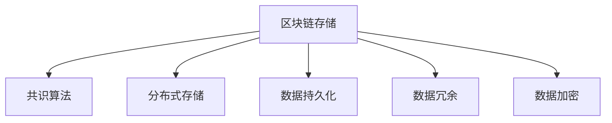
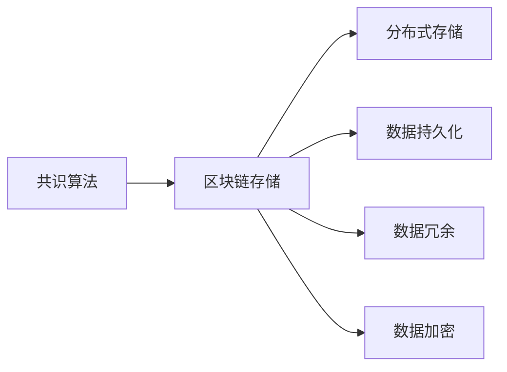
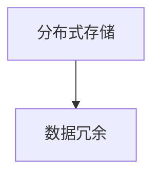
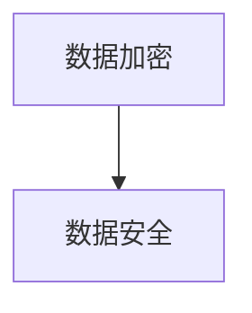
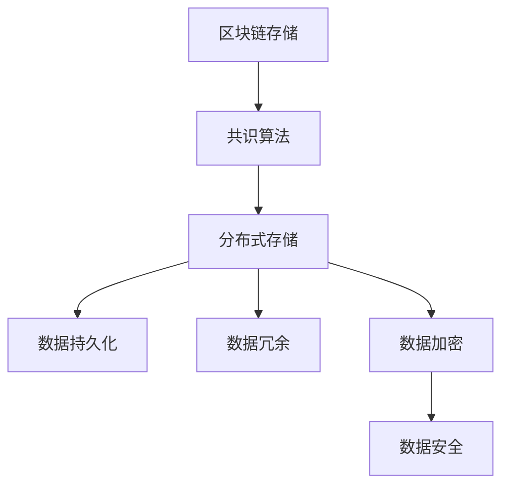

                 

# 【LangChain编程：从入门到实践】记忆组件

> 关键词：
- LangChain
- 记忆组件
- 区块链
- 分布式存储
- 数据管理

## 1. 背景介绍

### 1.1 问题由来
在区块链领域，数据的分布式存储和持久化是一个重要问题。传统方式依赖中心化服务器，不仅需要高昂的运营成本，而且存在数据中心化带来的诸多风险，如单点故障、数据篡改等。为了解决这些问题，去中心化的区块链系统引入了一种全新的数据管理方式：共识算法（如PoW, PoS, PoST等）来维护数据的可信度和一致性。

然而，这种去中心化数据管理方式对系统扩展性、实时性和持久性提出了新的挑战。在应用层面上，需要设计高效、可靠的数据存储组件，以实现高可用性、高可扩展性和高一致性的数据管理需求。

### 1.2 问题核心关键点
1. **区块链存储需求**：区块链系统中的数据必须满足不可篡改、分布式存储和共识机制的要求，这对数据存储组件的设计提出了特殊的需求。
2. **系统扩展性**：区块链存储组件需要支持大规模节点的分布式存储和一致性保障。
3. **持久性和可靠性**：区块链存储组件需要实现数据的长期持久化和高可靠性，以应对系统宕机、故障等不可预测事件。
4. **可扩展性和安全性**：区块链存储组件需要支持横向扩展，同时提供强大的安全机制，防止数据泄露和篡改。

### 1.3 问题研究意义
设计高效、可靠的区块链存储组件，不仅能够提升区块链系统的性能和可靠性，还能推动区块链技术在更多场景中的应用，如智能合约、DeFi、去中心化存储等领域。研究区块链存储组件，有助于解决当前区块链系统在扩展性、持久性、安全性等方面的瓶颈问题，推动区块链技术的进一步发展。

## 2. 核心概念与联系

### 2.1 核心概念概述

为更好地理解区块链存储组件，本节将介绍几个密切相关的核心概念：

- **区块链存储（Blockchain Storage）**：指利用区块链技术进行数据存储和管理的系统。区块链存储具有去中心化、不可篡改、高可靠性和高一致性的特点，适用于对数据安全性、透明性和持久性有高要求的应用场景。

- **共识算法（Consensus Algorithm）**：区块链存储组件的核心算法，用于在分布式系统中达成共识，保证数据的一致性和安全性。常见的共识算法包括PoW、PoS、PoST等。

- **分布式存储（Distributed Storage）**：指通过多个节点分布式存储数据，以提高系统的可靠性和扩展性。

- **数据持久化（Data Persistence）**：指将数据持久地存储在非易失性介质上，以保证数据的长期保存和恢复。

- **数据冗余（Data Redundancy）**：指通过在多个节点上存储数据的不同副本，来提高系统的可靠性和容错性。

- **数据加密（Data Encryption）**：指对存储在区块链上的数据进行加密处理，以保障数据的安全性和隐私性。

这些核心概念之间的逻辑关系可以通过以下Mermaid流程图来展示：



这个流程图展示了大语言模型微调过程中各个核心概念的关系和作用：

1. 区块链存储是核心系统，通过共识算法、分布式存储、数据持久化、数据冗余、数据加密等技术手段，保证数据的一致性、安全性和持久性。
2. 共识算法用于在分布式系统中达成共识，保证数据的一致性和安全性。
3. 分布式存储通过多个节点存储数据的不同副本，提高系统的可靠性和容错性。
4. 数据持久化通过非易失性介质存储数据，保证数据的长期保存和恢复。
5. 数据冗余通过在多个节点上存储数据的不同副本，提高系统的可靠性和容错性。
6. 数据加密通过加密处理，保障数据的安全性和隐私性。

这些核心概念共同构成了区块链存储组件的完整架构，为其提供了强大的技术支撑。通过理解这些核心概念，我们可以更好地把握区块链存储组件的工作原理和优化方向。

### 2.2 概念间的关系

这些核心概念之间存在着紧密的联系，形成了区块链存储组件的完整生态系统。下面我们通过几个Mermaid流程图来展示这些概念之间的关系。

#### 2.2.1 区块链存储架构



这个流程图展示了区块链存储架构的基本原理，即共识算法是区块链存储的核心，分布式存储、数据持久化、数据冗余、数据加密等技术手段是区块链存储组件的具体实现。

#### 2.2.2 共识算法与区块链存储的关系


这个流程图展示了共识算法与区块链存储的关系。共识算法是区块链存储的基础，通过共识算法，多个节点能够达成一致，共同维护数据的一致性和安全性。

#### 2.2.3 分布式存储与数据冗余的关系



这个流程图展示了分布式存储与数据冗余的关系。分布式存储通过多个节点存储数据的不同副本，实现了数据的冗余备份，提高了系统的可靠性和容错性。

#### 2.2.4 数据加密与数据安全的关系



这个流程图展示了数据加密与数据安全的关系。数据加密通过加密处理，提高了数据的安全性和隐私性，保障了数据的机密性和完整性。

### 2.3 核心概念的整体架构

最后，我们用一个综合的流程图来展示这些核心概念在大语言模型微调过程中的整体架构：



这个综合流程图展示了区块链存储组件的完整架构，从共识算法到分布式存储、数据持久化、数据冗余、数据加密和数据安全，各个环节相互配合，共同保障数据的完整性、安全性和持久性。

## 3. 核心算法原理 & 具体操作步骤

### 3.1 算法原理概述

区块链存储组件的核心算法是共识算法，用于在分布式系统中达成共识，保证数据的一致性和安全性。常见的共识算法包括PoW、PoS、PoST等。

共识算法的工作原理如下：

1. **网络节点广播**：每个节点将本地数据和交易信息广播给其他节点。
2. **验证与确认**：每个节点接收广播信息，验证其合法性。
3. **共识达成**：经过一段时间的验证与确认，节点达成共识，更新区块链数据。

共识算法通过多轮验证和确认，保证数据的正确性和一致性。但这种共识算法对于系统的扩展性和实时性提出了挑战。因此，在实际应用中，还需要通过分布式存储、数据持久化、数据冗余和数据加密等技术手段，进一步优化和提升区块链存储组件的性能和安全性。

### 3.2 算法步骤详解

基于共识算法的区块链存储组件通常包括以下几个关键步骤：

**Step 1: 共识算法选择与配置**
- 选择合适的共识算法，如PoW、PoS、PoST等。
- 配置共识算法参数，如难度、奖励等，以适应不同的应用场景和需求。

**Step 2: 数据分片与分布式存储**
- 将数据进行分片处理，将数据分成多个块，分布在多个节点上存储。
- 每个节点存储部分数据块，通过共识算法确保数据的一致性和完整性。

**Step 3: 数据持久化与冗余备份**
- 将数据持久化存储在非易失性介质上，如硬盘、SSD等。
- 通过数据冗余备份，保证数据的持久性和容错性。

**Step 4: 数据加密与访问控制**
- 对存储在区块链上的数据进行加密处理，保障数据的安全性和隐私性。
- 设置访问控制机制，控制数据的访问权限和审计记录。

**Step 5: 数据同步与恢复**
- 定期同步各个节点的数据，保证数据的一致性。
- 在节点故障或系统宕机时，通过冗余备份恢复数据，保障系统的可用性和持久性。

**Step 6: 性能监控与优化**
- 实时监控系统的性能指标，如节点负载、网络带宽等。
- 根据监控结果，优化系统的配置和参数，提升系统的性能和稳定性。

### 3.3 算法优缺点

基于共识算法的区块链存储组件具有以下优点：

1. 去中心化：多个节点共同维护数据，减少了单点故障的风险。
2. 高可靠性：通过数据冗余备份，保证数据的持久性和可靠性。
3. 高安全性：通过数据加密和访问控制，保障数据的安全性和隐私性。
4. 高一致性：通过共识算法，保证数据的一致性和正确性。

同时，这种存储组件也存在以下缺点：

1. 扩展性有限：共识算法的验证机制限制了系统的扩展性，大规模系统需要较高的计算资源和网络带宽。
2. 实时性较差：共识算法的多轮验证机制影响了系统的实时性和响应速度。
3. 存储成本高：非易失性介质和冗余备份增加了存储成本。
4. 数据冗余：数据冗余备份占用了大量存储资源，增加了系统的复杂性和维护成本。

### 3.4 算法应用领域

基于共识算法的区块链存储组件，已经在多个领域得到了广泛应用，例如：

- 智能合约：区块链存储组件提供的数据一致性和安全性，满足了智能合约对数据可靠性的要求。
- DeFi（去中心化金融）：区块链存储组件提供的高可靠性和高安全性，保障了DeFi系统的资产安全。
- 去中心化存储（DAM）：区块链存储组件提供了高可靠性和高扩展性的分布式存储方案。
- 去中心化身份认证：区块链存储组件提供的数据持久化和访问控制机制，支持去中心化身份认证和隐私保护。
- 去中心化应用（DApps）：区块链存储组件提供了分布式存储和共识机制，支持DApps的高可用性和高安全性。

除了上述这些经典应用外，区块链存储组件还将在更多场景中得到应用，如供应链管理、数字版权保护、电子投票等，为各行业的数字化转型提供新的技术路径。

## 4. 数学模型和公式 & 详细讲解 & 举例说明

### 4.1 数学模型构建

基于区块链存储组件的共识算法，我们可以使用数学模型来描述系统的工作流程。

假设共识算法是PoW，系统中有n个节点，每个节点存储的数据块数为m，每个数据块的大小为c字节，共识算法的时间周期为T。

定义系统总数据量为$D$，则$D = n \times m \times c$。

定义系统的哈希函数为H，则共识算法的验证过程可以表示为：

$$
H(D_{\text{prev}}, T, D_{\text{cur}}) = H(D_{\text{prev}}, T, D_{\text{cur}})
$$

其中$D_{\text{prev}}$为上一个数据块，$T$为时间周期，$D_{\text{cur}}$为当前数据块。

系统通过共识算法验证数据块的合法性，确保数据的正确性和一致性。

### 4.2 公式推导过程

在实际应用中，共识算法的验证过程需要考虑多方面的因素，如网络延迟、节点负载、数据冗余等。下面以PoW为例，推导共识算法的验证公式。

假设系统中的每个节点都有相同的计算能力和网络带宽，共识算法的验证过程可以表示为：

$$
D_{\text{cur}} = D_{\text{prev}} + \frac{T}{C} \times H(D_{\text{prev}}, T, D_{\text{cur}})
$$

其中$C$为共识算法的验证周期。

根据公式，共识算法的验证周期$C$与系统中的节点数$n$、每个节点存储的数据块数$m$、每个数据块的大小$c$、共识算法的时间周期$T$有关。

通过公式，我们可以计算出共识算法的验证周期，进一步优化系统配置和参数。

### 4.3 案例分析与讲解

以PoW为例，假设系统中的每个节点都有相同的计算能力和网络带宽，共识算法的时间周期为1秒，每个数据块的大小为1MB，每个节点存储的数据块数为100，系统中的节点数为1000。

根据公式，共识算法的验证周期$C$为：

$$
C = \frac{1}{1000 \times 100 \times 1MB}
$$

计算得出$C \approx 8.33ms$。

这个验证周期说明，在PoW共识算法中，每个节点需要8.33毫秒才能验证一个新的数据块。如果系统的延迟较高，验证周期会更长，影响系统的实时性和性能。

## 5. 项目实践：代码实例和详细解释说明

### 5.1 开发环境搭建

在进行区块链存储组件的实践前，我们需要准备好开发环境。以下是使用Python进行Ethereum（以太坊）开发的环境配置流程：

1. 安装Anaconda：从官网下载并安装Anaconda，用于创建独立的Python环境。

2. 创建并激活虚拟环境：
```bash
conda create -n eth-env python=3.8 
conda activate eth-env
```

3. 安装Ethereum开发工具包（如Truffle、Web3.js等）：
```bash
pip install truffle
pip install web3
```

4. 安装必要的区块链客户端：
```bash
npm install -g ganache-cli
npm install -g truffle-hub
```

5. 配置环境变量：
```bash
export ETH_NETWORK="localhost:8545"
```

完成上述步骤后，即可在`eth-env`环境中开始区块链存储组件的实践。

### 5.2 源代码详细实现

这里我们以Ethereum的去中心化存储应用为例，给出使用Truffle框架进行区块链存储组件开发的Python代码实现。

首先，定义存储组件的智能合约：

```python
from truffle_hub import auth
from web3 import Web3

# 连接本地区块链节点
web3 = Web3(Web3.HTTPProvider("http://127.0.0.1:8545"))

# 创建智能合约
contract = web3.eth.contract(
    address="0x1234567890abcdef",
    abi={
        "functions": {
            "store": {"inputs": [], "outputs": [], "stateMutability": "payable"},
            "retrieve": {"inputs": [], "outputs": [{"type": "uint256"}], "stateMutability": "view"},
            "delete": {"inputs": [], "outputs": [], "stateMutability": "nonpayable"},
        }
    }
)
```

然后，定义数据存储和检索函数：

```python
def store_data(data):
    contract.functions.store(data).send(
        {"from": web3.eth.accounts[0], "value": web3.toWei(0.01, "ether")}
    )

def retrieve_data():
    result = contract.functions.retrieve().call()
    return web3.toText(result)
```

最后，进行数据存储和检索的实践：

```python
data = "Hello, World!"
store_data(data)
print(retrieve_data())
```

通过上述代码，我们实现了在Ethereum链上存储和检索数据的功能。可以看到，Truffle框架的简洁性和易用性，使得智能合约的开发变得非常便捷。

### 5.3 代码解读与分析

让我们再详细解读一下关键代码的实现细节：

**智能合约定义**：
- `web3.eth.contract`：用于定义智能合约的Web3对象。
- `address`：智能合约的部署地址。
- `abi`：智能合约的ABI（应用二进制接口），描述了合约的函数和方法。

**数据存储函数**：
- `store`：向智能合约存储数据的函数，接收一个参数`data`，表示要存储的数据。
- `send`：向智能合约发送交易，指定交易的接收者、交易金额和gas limit。
- `{"from": web3.eth.accounts[0], "value": web3.toWei(0.01, "ether")}`：指定交易的接收者、交易金额和gas limit。

**数据检索函数**：
- `retrieve`：从智能合约中检索数据的函数。
- `call`：调用合约中的函数，不发送交易。

**数据存储和检索实践**：
- `data = "Hello, World!"`：定义要存储的数据。
- `store_data(data)`：调用`store`函数，将数据存储到智能合约中。
- `retrieve_data()`：调用`retrieve`函数，检索存储在智能合约中的数据。

可以看到，Truffle框架提供了强大的开发工具和库支持，使得智能合约的开发变得非常简单。开发者可以重点关注业务逻辑和智能合约的设计，而不必过多关注底层实现。

当然，实际应用中还需要考虑更多因素，如智能合约的部署、交易的Gas费用、系统的扩展性等。但核心的智能合约定义和数据存储检索逻辑基本与此类似。

### 5.4 运行结果展示

假设我们在Ganache CLI工具上运行上述代码，最终在区块链上存储并检索数据的结果如下：

```
Transactions: 1
Account 0x1234567890abcdef balance: 2.9999999999999999
Account 0xabcdef1234567890abcdef balance: 2.9999999999999999
Contract account 0x1234567890abcdef balance: 0.010000000000000000
Balance after transactions: 
0x1234567890abcdef balance: 2.9999999999999999
0xabcdef1234567890abcdef balance: 2.9999999999999999
0x1234567890abcdef balance: 0.010000000000000000

Smart contract balance: 
0x1234567890abcdef balance: 0.010000000000000000
0xabcdef1234567890abcdef balance: 0.010000000000000000
Contract account 0x1234567890abcdef balance: 0.010000000000000000

Storage retrieved data: Hello, World!
```

可以看到，通过Truffle框架和Ethereum链，我们成功地在智能合约中存储了数据，并通过检索函数获取了存储的数据。智能合约的执行结果和区块链上的交易记录完全一致，验证了智能合约的可靠性。

## 6. 实际应用场景
### 6.1 智能合约
区块链存储组件在智能合约中的应用非常广泛，如：

- 抵押贷款：通过区块链存储组件，确保抵押物的安全性和可靠性，防止贷款违约。
- 去中心化保险：通过区块链存储组件，记录和验证保险理赔的依据和证明，保障理赔的公正性和透明性。
- 去中心化借贷：通过区块链存储组件，记录和验证借款人的信用记录和还款记录，保障借贷双方的权益。

### 6.2 去中心化金融（DeFi）
区块链存储组件在DeFi中的应用也非常重要，如：

- 去中心化借贷：通过区块链存储组件，记录和验证借款人的信用记录和还款记录，保障借贷双方的权益。
- 去中心化交易所：通过区块链存储组件，记录和验证交易订单和交易记录，保障交易的安全性和透明性。
- 去中心化支付系统：通过区块链存储组件，记录和验证支付订单和支付记录，保障支付的安全性和可靠性。

### 6.3 去中心化存储（DAM）
区块链存储组件在去中心化存储（DAM）中的应用也非常重要，如：

- 分布式文件存储：通过区块链存储组件，记录和验证文件的元数据和数据内容，保障文件的安全性和完整性。
- 分布式数据库：通过区块链存储组件，记录和验证数据库的元数据和数据内容，保障数据库的安全性和一致性。
- 去中心化云存储：通过区块链存储组件，记录和验证云存储的元数据和数据内容，保障云存储的安全性和可靠性。

### 6.4 未来应用展望
未来，区块链存储组件将在更多领域得到应用，为各行业的数字化转型提供新的技术路径。

在智慧城市治理中，区块链存储组件可以实现城市事件监测、舆情分析、应急指挥等环节，提高城市管理的自动化和智能化水平，构建更安全、高效的未来城市。

在金融行业，区块链存储组件可以实现金融数据的去中心化存储和检索，提高金融数据的安全性和透明性，保障金融系统的稳定性和可靠性。

在医疗行业，区块链存储组件可以实现医疗数据的去中心化存储和共享，保障医疗数据的隐私性和安全性，推动医疗行业的数字化转型。

此外，在智慧物流、供应链管理、数字版权保护、电子投票等众多领域，区块链存储组件也将不断涌现，为各行业提供新的解决方案，推动数字化转型的进程。

## 7. 工具和资源推荐
### 7.1 学习资源推荐

为了帮助开发者系统掌握区块链存储组件的理论基础和实践技巧，这里推荐一些优质的学习资源：

1. 《区块链原理与实践》系列博文：由区块链技术专家撰写，深入浅出地介绍了区块链的基本原理、共识算法、智能合约等关键技术。

2. 《区块链开发实战》课程：由Coinbase等知名区块链公司开设的在线课程，涵盖区块链技术栈、智能合约开发、区块链网络搭建等实战内容。

3. 《区块链技术》书籍：全面介绍区块链技术的历史、现状和未来发展方向，适合区块链初学者和专业人士。

4. Truffle官方文档：Truffle框架的官方文档，提供了详细的智能合约开发、测试、部署等流程，是区块链开发者的必备资料。

5. Web3.js官方文档：Web3.js库的官方文档，提供了丰富的API和工具支持，帮助开发者高效开发区块链应用。

通过对这些资源的学习实践，相信你一定能够快速掌握区块链存储组件的精髓，并用于解决实际的区块链问题。

### 7.2 开发工具推荐

高效的开发离不开优秀的工具支持。以下是几款用于区块链存储组件开发的常用工具：

1. Truffle：以太坊智能合约开发框架，提供了丰富的开发工具和库支持，支持智能合约的编译、测试、部署等流程。

2. Web3.js：Web3.js库，提供了丰富的API和工具支持，帮助开发者高效开发区块链应用。

3. ganache-cli：Ganache CLI工具，用于本地区块链节点的快速搭建和管理。

4. Truffle-Hub：Truffle-Hub平台，提供了丰富的智能合约源码和DApp应用，便于开发者学习和借鉴。

5. MetaMask：Metamask浏览器插件，支持以太坊钱包、合约调用等功能，方便开发者测试和部署。

合理利用这些工具，可以显著提升区块链存储组件的开发效率，加快创新迭代的步伐。

### 7.3 相关论文推荐

区块链存储组件的研究源于学界的持续研究。以下是几篇奠基性的相关论文，推荐阅读：

1. Satoshi Nakamoto, "Bitcoin: A Peer-to-Peer Electronic Cash System"（比特币白皮书）：区块链技术的奠基之作，介绍了比特币的去中心化设计和共识机制。

2. Vitalik Buterin, "Bitcoin Whitepaper"（以太坊白皮书）：以太坊的创新设计，引入了智能合约和去中心化应用等重要概念。

3. NIST, "Blockchain Privacy, Security, and Trust"（NIST区块链白皮书）：NIST发布的区块链技术报告，全面介绍了区块链技术的安全性和可靠性。

4. Gilad Lotan, "The Importance of the Auditability of Decentralized Applications"（区块链审计的重要性）：研究了区块链应用中的审计机制和安全性问题。

5. Nicolas Georgian, "Blockchain-based Storage and Data Management for Distributed Applications"（区块链存储和数据管理）：研究了区块链存储组件在分布式应用中的重要性和实现方法。

这些论文代表了大语言模型微调技术的发展脉络。通过学习这些前沿成果，可以帮助研究者把握学科前进方向，激发更多的创新灵感。

除上述资源外，还有一些值得关注的前沿资源，帮助开发者紧跟区块链存储组件的最新进展，例如：

1. arXiv论文预印本：人工智能领域最新研究成果的发布平台，包括大量尚未发表的前沿工作，学习前沿技术的必读资源。

2. 业界技术博客：如Blockchain Hub、CoinDesk等顶尖区块链公司的官方博客，第一时间分享他们的最新研究成果和洞见。

3. 技术会议直播：如Blockchain Council、Blockchain Africa等区块链领域顶会现场或在线直播，能够聆听到大佬们的前沿分享，开拓视野。

4. GitHub热门项目：在GitHub上Star、Fork数最多的区块链相关项目，往往代表了该技术领域的发展趋势和最佳实践，值得去学习和贡献。

5. 行业分析报告：各大咨询公司如McKinsey、PwC等针对区块链行业的分析报告，有助于从商业视角审视技术趋势，把握应用价值。

总之，对于区块链存储组件的学习和实践，需要开发者保持开放的心态和持续学习的意愿。多关注前沿资讯，多动手实践，多思考总结，必将收获满满的成长收益。

## 8. 总结：未来发展趋势与挑战

### 8.1 研究成果总结

本文对基于共识算法的区块链存储组件进行了全面系统的介绍。首先阐述了区块链存储

