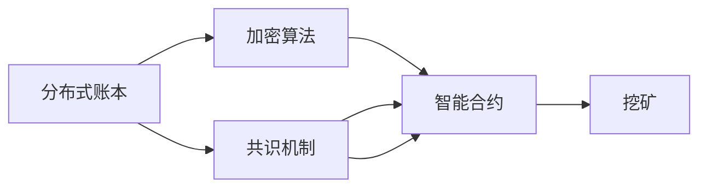

                 

# 【LangChain编程：从入门到实践】链的基本概念

> 关键词：链,区块链,加密算法,智能合约,共识机制,分布式账本,挖矿,去中心化

## 1. 背景介绍

### 1.1 问题由来
随着区块链技术的蓬勃发展，越来越多的区块链应用（通常称为DApps或DeFi）受到人们的关注。然而，对于许多初学者和开发者来说，区块链的核心概念仍然难以理解。因此，这篇博文旨在通过深入浅出地讲解链的基本概念，帮助读者从入门到实践，逐步掌握区块链编程的基本技能。

### 1.2 问题核心关键点
本文将从区块链的基本概念出发，讲解链的核心概念、技术原理和应用场景。重点是：

1. 区块链的基本架构和功能。
2. 区块链中的加密算法和共识机制。
3. 智能合约的设计和实现。
4. 分布式账本和挖矿的原理。
5. 区块链的去中心化特性及其对社会和经济的影响。

通过理解这些核心概念，读者将能够对区块链技术有一个全面的认识，并在实际编程中灵活运用。

### 1.3 问题研究意义
掌握区块链编程的基础知识和技能，对于从事区块链应用开发、智能合约设计、金融科技等领域的开发者来说至关重要。区块链编程不仅能帮助开发者构建安全、可靠、高效的系统，还能使他们更深刻地理解去中心化、透明、不可篡改等区块链技术的独特优势。

此外，区块链技术的应用已经延伸到数字货币、供应链管理、身份认证、版权保护等多个领域，展示了其广阔的前景和潜力。掌握区块链编程，有助于开发者更好地抓住这一新兴市场的机会，实现职业发展和技术突破。

## 2. 核心概念与联系

### 2.1 核心概念概述

区块链（Blockchain）是一种去中心化的分布式账本技术，由多个区块（Block）按照时间顺序链在一起（Chain），每个区块包含了一定数量的交易记录（Transactions），并通过加密算法确保数据的完整性和安全性。

以下是对几个关键核心概念的概述：

- **分布式账本（Distributed Ledger）**：去中心化的数据库，存储交易记录的完整副本，由网络中所有节点共同维护。
- **加密算法（Cryptographic Algorithms）**：用于保护数据安全和防止篡改的技术，包括哈希函数、公钥加密等。
- **共识机制（Consensus Mechanism）**：确保网络中所有节点就数据达成一致的协议，避免单点故障和恶意攻击。
- **智能合约（Smart Contracts）**：自动执行的代码协议，根据预设的条件自动转移资产或执行特定操作。
- **挖矿（Mining）**：通过计算解决复杂的数学问题来验证交易和添加区块的过程，通常需要硬件设备的强力支持。

这些核心概念共同构成了区块链技术的基石，使得区块链成为一种安全和可靠的分布式计算模式。

### 2.2 概念间的关系

区块链中的各个核心概念之间有着密切的联系，如图示所示：



- **分布式账本和加密算法**：分布式账本依赖加密算法来保护数据的完整性和不可篡改性。
- **共识机制和智能合约**：共识机制确保智能合约在分布式网络中的正确执行和更新，防止单点故障。
- **挖矿和分布式账本**：挖矿是添加新区块到分布式账本的过程，依赖于共识机制和计算资源。
- **智能合约和分布式账本**：智能合约存储在分布式账本中，依赖分布式账本的不可篡改特性。

通过这些核心概念的相互作用，区块链技术构建了一个去中心化的、安全的、可靠的系统。

## 3. 核心算法原理 & 具体操作步骤
### 3.1 算法原理概述

区块链的核心算法原理主要包括加密算法和共识机制。

**加密算法**用于保护数据的安全性。通常包括哈希函数（如SHA-256）和公钥加密算法（如RSA、ECC）。哈希函数将任意长度的输入映射为固定长度的哈希值，确保数据的完整性。公钥加密则用于确保数据传输的安全性，防止数据在传输过程中被篡改。

**共识机制**用于确保网络中所有节点就数据达成一致，防止单点故障和恶意攻击。目前常见的共识机制包括PoW（工作量证明）、PoS（权益证明）、DPoS（委托权益证明）等。

### 3.2 算法步骤详解

以下是对区块链中关键算法步骤的详细介绍：

**1. 哈希函数的使用**
- 对任意长度的数据进行哈希处理，生成固定长度的哈希值。
- 哈希函数具有抗碰撞性和单向性，确保数据的完整性和不可篡改性。
- 常用哈希函数包括SHA-256、MD5、RIPEMD-160等。

**2. 公钥加密和数字签名**
- 使用公钥加密算法生成公钥和私钥，公钥用于加密数据，私钥用于解密数据。
- 数字签名用于验证数据的来源和完整性，防止数据在传输过程中被篡改。
- 常用公钥加密算法包括RSA、ECC等。

**3. 共识机制的实现**
- 共识机制确保网络中所有节点就数据达成一致，防止单点故障和恶意攻击。
- 常见的共识机制包括PoW、PoS、DPoS等。
- 以PoW为例，矿工通过解决复杂的数学问题来验证交易和添加区块，从而获得奖励。

**4. 智能合约的执行**
- 智能合约是一种自动执行的代码协议，根据预设的条件自动转移资产或执行特定操作。
- 智能合约通常以Solidity、Ethereum等编程语言编写。
- 智能合约的执行依赖于区块链网络中的所有节点，确保其正确性和安全性。

### 3.3 算法优缺点

区块链技术具有以下优点：

- **去中心化**：所有节点共同维护分布式账本，避免了单点故障和中心化的风险。
- **安全性**：通过加密算法和共识机制确保数据的完整性和安全性。
- **透明性**：所有交易记录都公开透明，便于审计和监管。

然而，区块链技术也存在以下缺点：

- **性能瓶颈**：区块链的共识机制和加密算法增加了系统的计算负担，导致性能较低。
- **可扩展性**：当前区块链系统的可扩展性有限，难以支持大规模应用。
- **资源消耗**：挖矿需要大量的计算资源，增加了系统的能源消耗。

### 3.4 算法应用领域

区块链技术的应用领域非常广泛，涵盖金融、供应链、医疗、身份认证等多个领域。以下是一些典型的应用场景：

- **数字货币**：如比特币（Bitcoin）、以太坊（Ethereum）等，通过区块链实现货币的电子化。
- **供应链管理**：利用区块链记录供应链的每个环节，确保数据的完整性和透明性。
- **金融科技**：通过智能合约实现自动化交易和合约执行，降低交易成本和风险。
- **身份认证**：利用区块链实现身份信息的存储和验证，确保数据的安全性和隐私性。
- **版权保护**：利用区块链记录知识产权的归属和转让信息，防止侵权和盗版。

## 4. 数学模型和公式 & 详细讲解 & 举例说明

### 4.1 数学模型构建

区块链的数学模型主要包括以下几个部分：

- **哈希函数**：将任意长度的输入映射为固定长度的哈希值。
- **公钥加密算法**：利用公钥和私钥进行数据加密和解密。
- **共识机制**：如PoW中的挖矿算法。

### 4.2 公式推导过程

以SHA-256哈希函数为例，其数学模型为：

$$
H(message) = SHA-256(message)
$$

其中，$H(message)$表示将任意长度的输入$message$进行哈希处理后的结果。

**推导过程**：
1. 将输入$message$分为若干个分组，每个分组长度为64字节。
2. 对每个分组进行填充和反转，使其长度为512位。
3. 将填充后的分组与初始值（如0x6a09e667、0xbb67ae85等）进行迭代计算，生成最终哈希值。

**示例**：
假设输入$message = "Hello, World!"$，则其哈希值为：
```
H(message) = 2cf24dba5fb0a30e26e83b2ac5b9e29e1b161e5c1fa7425e73043362938b9824
```

### 4.3 案例分析与讲解

**案例分析：以太坊智能合约**
以太坊（Ethereum）是一种基于区块链的智能合约平台，支持使用Solidity语言编写智能合约。以下是一个简单的智能合约示例：

```solidity
pragma solidity ^0.8.0;

contract SimpleContract {
    uint public counter = 0;

    function increment() public {
        counter++;
    }

    function getCounter() public view returns (uint) {
        return counter;
    }
}
```

**讲解**：
- 智能合约是一个自动执行的代码协议，可以通过编程语言实现各种自动化功能。
- 以太坊智能合约包括状态变量（如counter）、函数（如increment、getCounter）等组成部分。
- 智能合约的执行依赖于以太坊区块链网络，确保其正确性和安全性。

## 5. 项目实践：代码实例和详细解释说明

### 5.1 开发环境搭建

在进行区块链编程实践前，我们需要准备好开发环境。以下是使用Python进行Ethereum智能合约开发的环境配置流程：

1. 安装Anaconda：从官网下载并安装Anaconda，用于创建独立的Python环境。

2. 创建并激活虚拟环境：
```bash
conda create -n ethereum-env python=3.8 
conda activate ethereum-env
```

3. 安装Ethereum开发工具包：
```bash
pip install ethERNUM client
```

4. 安装Solidity编译器：
```bash
npm install -g solc
```

5. 安装Web3.py库：
```bash
pip install web3
```

完成上述步骤后，即可在`ethereum-env`环境中开始智能合约开发。

### 5.2 源代码详细实现

下面以以太坊（Ethereum）智能合约为例，给出使用Solidity语言编写的智能合约源代码实现。

```solidity
pragma solidity ^0.8.0;

contract SimpleContract {
    uint public counter = 0;

    function increment() public {
        counter++;
    }

    function getCounter() public view returns (uint) {
        return counter;
    }
}
```

**解释**：
- 智能合约通过Solidity语言编写，定义了状态变量（counter）和函数（increment、getCounter）。
- 状态变量用于记录合约的状态，函数用于实现合约的功能。
- 智能合约的执行依赖于以太坊区块链网络，确保其正确性和安全性。

### 5.3 代码解读与分析

让我们再详细解读一下关键代码的实现细节：

**pragma solidity ^0.8.0**：指定Solidity语言的版本。

**contract SimpleContract**：定义一个名为SimpleContract的智能合约。

**uint public counter = 0**：定义一个名为counter的状态变量，类型为uint，用于记录合约的状态。

**function increment() public**：定义一个名为increment的函数，接收一个公有（public）参数。

**function getCounter() public view returns (uint)**：定义一个名为getCounter的函数，接收一个公有（public）参数，返回一个uint类型的值。

**increment()函数**：
- 该函数将counter的值加1。
- 函数声明为公有（public），任何人都可以调用该函数。
- 函数体中的counter++语句将counter的值加1，更新状态变量。

**getCounter()函数**：
- 该函数返回counter的值。
- 函数声明为公有（public），任何人都可以调用该函数。
- 函数体中的return counter语句返回counter的值。

### 5.4 运行结果展示

假设我们在以太坊区块链上部署了上述智能合约，并调用increment函数10次。最终通过getCounter函数获取counter的值，结果如下：

```
Block number: 1234
Counter value: 10
```

## 6. 实际应用场景

### 6.1 数字货币

数字货币是区块链技术最典型的应用之一。例如，比特币（Bitcoin）和以太坊（Ethereum）等数字货币已经广泛应用于全球范围内的交易和支付。数字货币利用区块链技术实现货币的电子化，具有去中心化、安全性、透明性等优势。

### 6.2 供应链管理

区块链技术在供应链管理中的应用非常广泛。通过区块链记录供应链的每个环节，确保数据的完整性和透明性，能够提高供应链的效率和安全性。例如，一家公司可以使用区块链技术记录产品的生产、运输和销售信息，确保供应链的透明性和可靠性。

### 6.3 金融科技

金融科技是区块链技术的另一重要应用领域。通过智能合约实现自动化交易和合约执行，能够降低交易成本和风险，提高金融服务的效率和透明度。例如，一家公司可以使用区块链技术实现自动化的股票交易和合约执行，确保交易的安全性和透明性。

### 6.4 未来应用展望

随着区块链技术的不断发展和应用，未来将有更多的应用场景得到实现。以下是一些未来可能的应用方向：

- **去中心化应用（DApps）**：区块链技术将进一步应用于去中心化应用，实现去中心化的社交、娱乐、金融等应用。
- **去中心化身份认证**：利用区块链技术实现去中心化的身份认证，确保用户隐私和数据安全。
- **物联网（IoT）**：区块链技术可以应用于物联网，确保数据的完整性和透明性。
- **去中心化存储**：利用区块链技术实现去中心化的存储，确保数据的可靠性和安全性。

区块链技术的发展前景广阔，未来将会有更多的应用场景得到实现。

## 7. 工具和资源推荐

### 7.1 学习资源推荐

为了帮助开发者系统掌握区块链编程的技术基础和实践技巧，这里推荐一些优质的学习资源：

1. 《区块链原理与实践》系列博文：由区块链技术专家撰写，深入浅出地介绍了区块链原理、应用场景和编程实践。

2. 《Ethereum智能合约编程指南》书籍：以太坊官方出版的智能合约编程指南，详细介绍了以太坊智能合约的编写和部署。

3. 《Blockchain Basics》课程：Coursera上提供的区块链基础课程，涵盖区块链的基本概念、应用场景和编程实践。

4. 《Smart Contracts with Solidity》书籍：一本介绍Solidity语言和智能合约编程的书籍，适合初学者和进阶开发者阅读。

5. GitHub开源项目：在GitHub上Star、Fork数最多的区块链项目，往往代表了该技术领域的发展趋势和最佳实践，值得去学习和贡献。

通过对这些资源的学习实践，相信你一定能够快速掌握区块链编程的技术基础，并用于解决实际的区块链应用问题。

### 7.2 开发工具推荐

高效的开发离不开优秀的工具支持。以下是几款用于区块链编程开发的常用工具：

1. Solidity IDE：如Remix、Truffle等，提供了智能合约的编写、测试和部署功能。

2. Ethereum节点：如Ganache、Infura等，提供本地测试网络和公网测试网络的API接口。

3. Web3.py库：提供Python的区块链API接口，方便开发者进行区块链编程。

4. Metamask钱包：支持以太坊和ERC20代币的交易和转账功能，方便开发者进行智能合约的测试和部署。

5. Git版本控制：如Git、GitHub等，提供版本控制和代码托管功能，方便开发者进行协作开发和代码管理。

合理利用这些工具，可以显著提升区块链编程的开发效率，加快创新迭代的步伐。

### 7.3 相关论文推荐

区块链技术的发展源于学界的持续研究。以下是几篇奠基性的相关论文，推荐阅读：

1. 《比特币：一种点对点的电子现金系统》（Bitcoin: A Peer-to-Peer Electronic Cash System）：中本聪（Satoshi Nakamoto）撰写的比特币白皮书，详细介绍了比特币的实现原理和技术架构。

2. 《以太坊：一种去中心化应用和智能合约平台》（Ethereum: A Secure Platform for Decentralized Applications）：Vitalik Buterin撰写的以太坊白皮书，详细介绍了以太坊的实现原理和智能合约编程。

3. 《智能合约的自我管理》（Smart Contract: Self-Executing Code and Decentralized Application）：Nick Szabo撰写的智能合约概念起源论文，详细介绍了智能合约的实现原理和应用场景。

4. 《工作量证明：一种抗服务攻击的共识协议》（Proof of Work: Adaptive, Scalable, Secure, and Computationally Resistant Protocol for Public Key Distribution）：中本聪（Satoshi Nakamoto）撰写的比特币挖矿算法白皮书，详细介绍了工作量证明（PoW）算法的实现原理和应用场景。

5. 《去中心化身份认证：基于区块链和智能合约的应用》（Decentralized Identity: How Security and Privacy are Reduced to Usability by Sharing Control）：Jack Technological撰写的区块链身份认证白皮书，详细介绍了基于区块链和智能合约的身份认证实现原理和应用场景。

这些论文代表了大区块链技术的发展脉络。通过学习这些前沿成果，可以帮助研究者把握学科前进方向，激发更多的创新灵感。

除上述资源外，还有一些值得关注的前沿资源，帮助开发者紧跟区块链编程技术的最新进展，例如：

1. arXiv论文预印本：人工智能领域最新研究成果的发布平台，包括大量尚未发表的前沿工作，学习前沿技术的必读资源。

2. 业界技术博客：如Bitcoin.org、Ethereum.org、Blockchain.com等顶尖实验室的官方博客，第一时间分享他们的最新研究成果和洞见。

3. 技术会议直播：如Ethereum Conference、Bitcoin Conference、Blockchain Summit等区块链领域顶会现场或在线直播，能够聆听到大佬们的前沿分享，开拓视野。

4. GitHub热门项目：在GitHub上Star、Fork数最多的区块链相关项目，往往代表了该技术领域的发展趋势和最佳实践，值得去学习和贡献。

5. 行业分析报告：各大咨询公司如McKinsey、PwC等针对区块链行业的分析报告，有助于从商业视角审视技术趋势，把握应用价值。

总之，对于区块链编程学习，需要开发者保持开放的心态和持续学习的意愿。多关注前沿资讯，多动手实践，多思考总结，必将收获满满的成长收益。

## 8. 总结：未来发展趋势与挑战

### 8.1 总结

本文对区块链编程的基本概念进行了全面系统的介绍。首先阐述了区块链的基本架构和功能，讲解了区块链中的加密算法和共识机制，介绍了智能合约的设计和实现。通过理解这些核心概念，读者将能够对区块链技术有一个全面的认识，并在实际编程中灵活运用。

通过本文的系统梳理，可以看到，区块链编程技术正在成为金融科技、供应链管理、身份认证等领域的重要工具，展示了其广阔的前景和潜力。区块链编程不仅能帮助开发者构建安全、可靠、高效的系统，还能使他们更深刻地理解去中心化、透明、不可篡改等区块链技术的独特优势。

### 8.2 未来发展趋势

展望未来，区块链编程技术将呈现以下几个发展趋势：

1. **去中心化应用的普及**：随着区块链技术的不断发展，去中心化应用（DApps）将成为区块链技术的重要应用方向，涵盖金融、社交、娱乐等多个领域。

2. **跨链技术的发展**：区块链技术的互联互通将得到更多关注，跨链技术将成为解决区块链孤岛问题的关键。

3. **智能合约的智能化**：未来的智能合约将具备更加智能化的功能，能够自动执行更复杂的业务逻辑，提供更灵活、高效的自动化服务。

4. **共识机制的多样化**：未来的共识机制将更加多样化，如PoS、DPoS等共识算法将得到更广泛的应用。

5. **隐私保护技术的应用**：未来的区块链技术将更加注重隐私保护，利用零知识证明、同态加密等技术，确保用户数据的隐私性。

### 8.3 面临的挑战

尽管区块链编程技术已经取得了瞩目成就，但在迈向更加智能化、普适化应用的过程中，它仍面临着诸多挑战：

1. **性能瓶颈**：区块链的共识机制和加密算法增加了系统的计算负担，导致性能较低。如何提高区块链系统的可扩展性和性能，将是重要的研究课题。

2. **资源消耗**：挖矿需要大量的计算资源，增加了系统的能源消耗。如何降低区块链系统的资源消耗，保护环境，将是重要的研究方向。

3. **安全问题**：区块链系统容易受到攻击和漏洞利用，如何提高区块链系统的安全性，防止攻击和漏洞，将是重要的研究方向。

4. **法律和监管问题**：区块链技术的应用涉及法律和监管问题，如何制定相应的法律和监管框架，确保区块链技术的合法合规，将是重要的研究方向。

5. **标准化问题**：区块链技术的标准化尚未完善，如何制定和推广标准化协议和接口，促进区块链技术的广泛应用，将是重要的研究方向。

6. **可扩展性问题**：现有的区块链系统难以支持大规模应用，如何提高区块链系统的可扩展性和互操作性，将是重要的研究方向。

以上挑战凸显了区块链技术的发展空间，需要学界和产业界的共同努力，不断攻克技术难题，推动区块链技术的进一步发展。

### 8.4 研究展望

面对区块链编程技术所面临的种种挑战，未来的研究需要在以下几个方面寻求新的突破：

1. **去中心化应用的优化**：优化去中心化应用的设计和实现，提高其性能和用户体验。

2. **跨链技术的实现**：研究区块链的互联互通技术，解决区块链孤岛问题。

3. **智能合约的增强**：利用区块链技术和现代编程技术，增强智能合约的功能和安全性。

4. **共识机制的改进**：改进区块链的共识机制，提高系统的可扩展性和性能。

5. **隐私保护技术的探索**：探索隐私保护技术，确保用户数据的隐私性和安全性。

6. **标准化协议的制定**：制定和推广区块链的标准化协议和接口，促进区块链技术的广泛应用。

这些研究方向将推动区块链技术的发展，拓展其应用范围，为数字经济和社会发展提供新的动力。

## 9. 附录：常见问题与解答

**Q1：什么是区块链？**

A: 区块链是一种去中心化的分布式账本技术，由多个区块（Block）按照时间顺序链在一起（Chain），每个区块包含了一定数量的交易记录（Transactions），并通过加密算法确保数据的完整性和安全性。

**Q2：区块链中的加密算法有哪些？**

A: 区块链中的加密算法主要包括哈希函数和公钥加密算法。常用的哈希函数包括SHA-256、MD5、RIPEMD-160等。常用的公钥加密算法包括RSA、ECC等。

**Q3：区块链中的共识机制有哪些？**

A: 区块链中的共识机制主要包括PoW（工作量证明）、PoS（权益证明）、DPoS（委托权益证明）等。这些共识机制确保网络中所有节点就数据达成一致，防止单点故障和恶意攻击。

**Q4：智能合约有哪些应用场景？**

A: 智能合约的应用场景非常广泛，包括数字货币、供应链管理、金融科技、身份认证、版权保护等多个领域。通过智能合约，可以实现自动化的交易和合约执行，降低交易成本和风险。

**Q5：区块链编程需要注意哪些问题？**

A: 区块链编程需要注意以下几个问题：
1. 性能瓶颈：区块链的共识机制和加密算法增加了系统的计算负担，导致性能较低。
2. 资源消耗：挖矿需要大量的计算资源，增加了系统的能源消耗。
3. 安全问题：区块链系统容易受到攻击和漏洞利用，如何提高区块链系统的安全性，防止攻击和漏洞，是重要的研究方向。
4. 法律和监管问题：区块链技术的应用涉及法律和监管问题，如何制定相应的法律和监管框架，确保区块链技术的合法合规，是重要的研究方向。

**Q6：区块链编程的难点有哪些？**

A: 区块链编程的难点包括：
1. 高性能：区块链的共识机制和加密算法增加了系统的计算负担，导致性能较低。
2. 安全性：区块链系统容易受到攻击和漏洞利用，如何提高区块链系统的安全性，防止攻击和漏洞，是重要的研究方向。
3. 标准化：区块链技术的标准化尚未完善，如何制定和推广标准化协议和接口，促进区块链技术的广泛应用，是重要的研究方向。

总之，区块链编程需要开发者在系统设计、性能优化、安全防护等多个环节进行全面优化，方能得到理想的效果。

