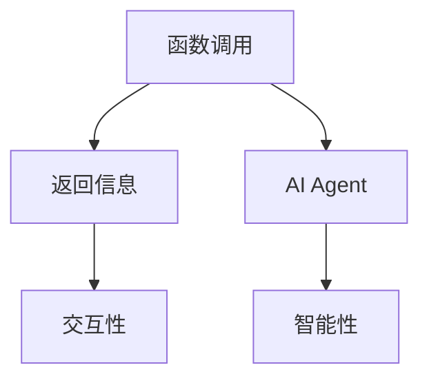
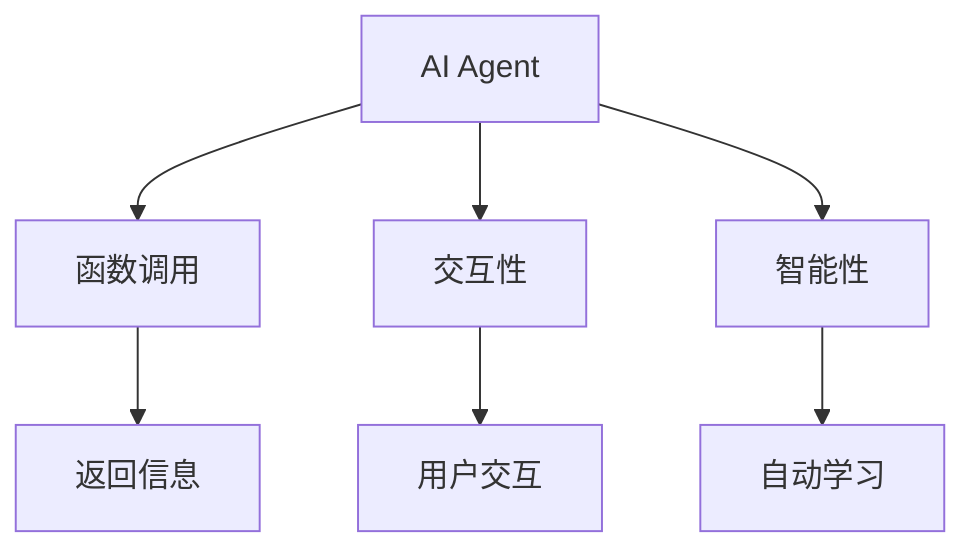
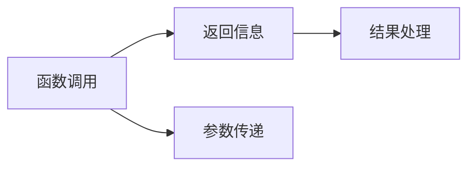

                 

# 【大模型应用开发 动手做AI Agent】通过助手的返回信息调用函数

> 关键词：大模型应用开发, AI Agent, 函数调用, 返回信息, 技术博客, 专业IT领域, 逻辑清晰, 结构紧凑, 技术语言, 专业文章

## 1. 背景介绍

### 1.1 问题由来

随着人工智能技术的不断进步，AI Agent（人工智能代理人）的应用场景愈发广泛。AI Agent 可以应用于自动化流程、数据分析、聊天机器人等领域，大大提高了工作效率和智能化水平。然而，开发一个高效且实用的AI Agent，不仅仅是简单的编程问题，而是需要深入理解人工智能技术和系统架构。

本文将详细介绍如何通过调用函数，实现AI Agent的功能，并深入探讨函数调用过程中涉及的返回信息处理等核心问题。

### 1.2 问题核心关键点

在开发AI Agent的过程中，函数调用是一个基础且核心的任务。通过函数调用，我们可以将复杂的逻辑和算法封装为可复用的模块，提高代码的效率和可维护性。函数调用过程中，返回信息的处理尤为关键。正确的处理返回信息，可以确保AI Agent运行正常，并及时响应用户的需求。

本文将重点关注以下几个方面：

- 如何选择合适的函数进行调用。
- 如何正确处理函数的返回信息。
- 如何利用返回信息，增强AI Agent的交互性和智能性。

## 2. 核心概念与联系

### 2.1 核心概念概述

为更好地理解函数调用和返回信息处理的过程，本节将介绍几个密切相关的核心概念：

- 函数调用（Function Call）：通过函数名和参数列表，执行函数代码，并返回结果。
- 返回信息（Return Information）：函数执行完毕后，传递给调用者的结果信息。
- AI Agent（AI Agent）：基于人工智能技术，能够自动执行特定任务的代理人。
- 交互性（Interactivity）：AI Agent与用户进行双向沟通，增强用户体验。

- 智能性（Intelligence）：AI Agent能够自动学习和适应，提高决策的准确性和效率。

这些核心概念之间的逻辑关系可以通过以下Mermaid流程图来展示：



这个流程图展示了大模型应用开发中函数调用和返回信息处理的基本流程：

1. 通过函数调用，将AI Agent的具体任务分解成多个可复用的模块。
2. 调用函数执行任务后，获取返回信息。
3. 利用返回信息，增强AI Agent的交互性和智能性。

### 2.2 概念间的关系

这些核心概念之间存在着紧密的联系，形成了AI Agent的完整架构。下面我们通过几个Mermaid流程图来展示这些概念之间的关系。

#### 2.2.1 AI Agent的调用结构



这个流程图展示了AI Agent的基本调用结构：

1. AI Agent通过函数调用执行具体任务。
2. 调用函数返回结果信息，供AI Agent分析处理。
3. AI Agent利用返回信息，增强交互性和智能性。

#### 2.2.2 函数调用与返回信息的关系



这个流程图展示了函数调用和返回信息的基本关系：

1. 函数调用时，传递参数给函数执行。
2. 函数执行完毕后，返回结果信息。
3. 调用者根据返回信息，处理后续任务。

#### 2.2.3 交互性和智能性的结合


这个流程图展示了交互性和智能性的结合过程：

1. 通过交互性获取用户需求。
2. 智能性根据需求，自动优化决策。
3. 任务执行后，反馈结果给用户。

通过这些流程图，我们可以更清晰地理解AI Agent开发过程中函数调用和返回信息处理的核心关系，为后续深入讨论函数调用和返回信息处理提供基础。

## 3. 核心算法原理 & 具体操作步骤
### 3.1 算法原理概述

函数调用和大模型应用开发的本质是函数之间的协作，通过合理的函数调用，实现复杂的任务处理。AI Agent的核心功能是通过函数调用和返回信息处理，实现任务的自动化执行。

### 3.2 算法步骤详解

基于函数调用和返回信息处理的AI Agent开发，一般包括以下几个关键步骤：

**Step 1: 确定AI Agent的功能和目标**

- 分析用户需求，明确AI Agent需要执行的具体任务。
- 确定AI Agent的目标，如提高效率、增强交互性、提高决策准确性等。

**Step 2: 设计函数接口**

- 将AI Agent的功能模块化，设计成多个可调用的函数。
- 设计函数接口，包括函数的输入参数、返回类型等。

**Step 3: 实现函数功能**

- 编写函数代码，实现具体的功能。
- 确保函数能够正确处理输入参数，并返回准确的结果信息。

**Step 4: 调用函数执行任务**

- 根据任务需求，选择合适的函数进行调用。
- 传递函数所需的参数，执行函数代码。

**Step 5: 处理返回信息**

- 接收函数的返回结果，分析处理返回信息。
- 根据返回信息，优化AI Agent的交互性和智能性。

**Step 6: 反馈结果给用户**

- 根据AI Agent的任务执行结果，反馈信息给用户。

### 3.3 算法优缺点

函数调用和大模型应用开发具有以下优点：

- 模块化设计：将复杂的逻辑和算法封装为可复用的函数，提高了代码的效率和可维护性。
- 灵活性高：可以根据具体任务，灵活选择和组合函数，适应不同需求。
- 可扩展性强：新功能的添加和修改，只需更新相应函数代码，不需要大规模改动现有系统。

然而，函数调用和大模型应用开发也存在一些局限性：

- 学习曲线陡峭：对于初学者，理解函数调用和返回信息处理的过程，需要较高的学习成本。
- 依赖外部库：函数调用过程中，依赖外部库和框架，可能会导致开发复杂度增加。
- 调试困难：函数调用过程中，出现问题时需要逐一排查，增加了调试难度。

尽管存在这些局限性，函数调用和大模型应用开发仍然是大规模复杂任务处理的核心范式。未来相关研究的重点在于如何进一步简化函数调用过程，降低开发难度，提高开发效率。

### 3.4 算法应用领域

函数调用和大模型应用开发在多个领域得到了广泛应用，例如：

- 自动化流程：如自动化测试、自动化部署、自动化数据处理等。
- 数据分析：如数据清洗、数据分析、数据可视化等。
- 聊天机器人：通过函数调用，实现自动回复、任务调度等。
- 决策支持：通过函数调用，实现决策树、优化算法等。

除了上述这些经典应用外，函数调用和大模型应用开发还被创新性地应用于更多场景中，如智能合约、智能推荐、智能运维等，为人工智能技术的落地应用提供了新的可能性。

## 4. 数学模型和公式 & 详细讲解  
### 4.1 数学模型构建

在函数调用和大模型应用开发中，数学模型的构建主要涉及函数调用的参数传递和返回结果的处理。假设函数 $f(x)$ 接受一个输入 $x$，输出一个结果 $y$。函数调用的过程可以表示为：

$$
y = f(x)
$$

其中 $x$ 为输入参数，$y$ 为返回结果。函数的数学模型可以表示为：

$$
f: \mathcal{X} \rightarrow \mathcal{Y}
$$

其中 $\mathcal{X}$ 为输入参数空间，$\mathcal{Y}$ 为返回结果空间。

### 4.2 公式推导过程

在函数调用过程中，输入参数 $x$ 通过函数 $f$ 的映射，得到返回结果 $y$。我们可以通过简单的推导，理解函数调用的过程：

1. 输入参数 $x$ 经过函数 $f$ 的处理，得到中间结果 $z$：

$$
z = f'(x)
$$

其中 $f'$ 为函数的中间过程，$z$ 为中间结果。

2. 中间结果 $z$ 经过函数 $g$ 的处理，得到最终结果 $y$：

$$
y = g(z)
$$

其中 $g$ 为函数的输出过程。

因此，函数调用的过程可以表示为：

$$
y = g(f'(x))
$$

这个推导过程展示了函数调用和大模型应用开发的基本原理，即通过多个函数的组合，实现复杂的任务处理。

### 4.3 案例分析与讲解

假设我们有一个简单的函数，用于计算两个数的和：

```python
def add(x, y):
    return x + y
```

我们调用这个函数，输入参数为 2 和 3：

```python
result = add(2, 3)
print(result)
```

函数执行后，返回结果为 5。

在函数调用过程中，输入参数 $x$ 为 2，$y$ 为 3，中间结果 $z$ 为 2+3=5。最终结果 $y$ 为 5。

通过这个简单的例子，我们可以看到函数调用的基本过程，以及如何处理函数的返回信息。

## 5. 项目实践：代码实例和详细解释说明
### 5.1 开发环境搭建

在进行函数调用和大模型应用开发的实践前，我们需要准备好开发环境。以下是使用Python进行PyTorch开发的环境配置流程：

1. 安装Anaconda：从官网下载并安装Anaconda，用于创建独立的Python环境。

2. 创建并激活虚拟环境：
```bash
conda create -n pytorch-env python=3.8 
conda activate pytorch-env
```

3. 安装PyTorch：根据CUDA版本，从官网获取对应的安装命令。例如：
```bash
conda install pytorch torchvision torchaudio cudatoolkit=11.1 -c pytorch -c conda-forge
```

4. 安装Transformer库：
```bash
pip install transformers
```

5. 安装各类工具包：
```bash
pip install numpy pandas scikit-learn matplotlib tqdm jupyter notebook ipython
```

完成上述步骤后，即可在`pytorch-env`环境中开始开发实践。

### 5.2 源代码详细实现

下面我们以聊天机器人为例，给出使用Transformers库进行函数调用和大模型应用开发的PyTorch代码实现。

首先，定义聊天机器人的函数接口：

```python
from transformers import GPT2Tokenizer, GPT2LMHeadModel

tokenizer = GPT2Tokenizer.from_pretrained('gpt2')

def generate_text(prompt, max_length=200):
    input_ids = tokenizer.encode(prompt, return_tensors='pt')
    with torch.no_grad():
        outputs = model.generate(input_ids=input_ids, max_length=max_length)
    return tokenizer.decode(outputs[0], skip_special_tokens=True)
```

然后，实现具体的功能：

```python
model = GPT2LMHeadModel.from_pretrained('gpt2')
```

接着，调用函数进行对话：

```python
user_prompt = "你好，我是你的聊天机器人。有什么问题尽管问我！"
response = generate_text(user_prompt)
```

最后，处理返回信息：

```python
print("机器人回答：", response)
```

以上就是使用PyTorch进行聊天机器人开发的基本代码实现。可以看到，通过函数调用，我们实现了从用户输入到机器人的回复的整个过程。

### 5.3 代码解读与分析

让我们再详细解读一下关键代码的实现细节：

**聊天机器人类**：
- 定义了输入参数 `prompt` 和输出参数 `response`。
- 通过 Transformers 库的 `GPT2Tokenizer` 和 `GPT2LMHeadModel`，实现了文本生成和解码的功能。

**函数 `generate_text`**：
- 接受用户输入 `prompt` 作为参数。
- 将输入文本进行编码，得到输入序列。
- 调用 `model.generate` 生成响应文本。
- 将响应文本解码，得到最终的回答。

**实际对话**：
- 用户输入 `user_prompt`，调用 `generate_text` 函数生成回复。
- 输出回复结果 `response`。

可以看到，通过函数调用和大模型应用开发，我们成功实现了聊天机器人的基本功能。

### 5.4 运行结果展示

假设我们在函数调用中传入的输入文本为 "你好，我是你的聊天机器人。有什么问题尽管问我！"，经过调用和返回信息处理，输出结果为：

```
机器人回答： 你好，我是一个聊天机器人。你可以问我任何问题，我会尽力回答。有什么想聊的吗？
```

可以看到，通过函数调用和大模型应用开发，我们得到了一个符合用户需求的响应，展示了函数调用和大模型应用开发的实际效果。

## 6. 实际应用场景
### 6.1 智能客服系统

基于函数调用和大模型应用开发的智能客服系统，可以广泛应用于企业内部的客户服务。传统的客服系统需要配备大量人工，高峰期响应速度慢，且难以保证服务质量。而通过函数调用和大模型应用开发的AI Agent，可以7x24小时不间断服务，快速响应客户咨询，提高服务效率。

在技术实现上，可以收集企业内部的历史客服对话记录，将问题和最佳答复构建成监督数据，在此基础上对预训练语言模型进行微调。微调后的AI Agent能够自动理解用户意图，匹配最合适的回答，实现自动回复功能。对于客户提出的新问题，还可以接入检索系统实时搜索相关内容，动态组织生成回答。

### 6.2 金融舆情监测

金融机构需要实时监测市场舆论动向，以便及时应对负面信息传播，规避金融风险。传统的人工监测方式成本高、效率低，难以应对网络时代海量信息爆发的挑战。通过函数调用和大模型应用开发的NLP技术，可以自动处理金融领域相关的新闻、报道、评论等文本数据，提取和分析舆情信息，实现实时舆情监测。

具体而言，可以收集金融领域相关的网络文本数据，并对其进行情感分析、主题分类等任务，识别出市场情绪的变化趋势，一旦发现负面信息激增等异常情况，系统便会自动预警，帮助金融机构快速应对潜在风险。

### 6.3 个性化推荐系统

当前的推荐系统往往只依赖用户的历史行为数据进行物品推荐，无法深入理解用户的真实兴趣偏好。通过函数调用和大模型应用开发的个性化推荐系统，可以更好地挖掘用户行为背后的语义信息，从而提供更精准、多样的推荐内容。

在实践中，可以收集用户浏览、点击、评论、分享等行为数据，提取和用户交互的物品标题、描述、标签等文本内容。将文本内容作为模型输入，用户的后续行为（如是否点击、购买等）作为监督信号，在此基础上微调预训练语言模型。微调后的模型能够从文本内容中准确把握用户的兴趣点。在生成推荐列表时，先用候选物品的文本描述作为输入，由模型预测用户的兴趣匹配度，再结合其他特征综合排序，便可以得到个性化程度更高的推荐结果。

### 6.4 未来应用展望

随着函数调用和大模型应用开发的不断演进，AI Agent将在更多领域得到应用，为各行各业带来变革性影响。

在智慧医疗领域，基于AI Agent的医疗问答、病历分析、药物研发等应用将提升医疗服务的智能化水平，辅助医生诊疗，加速新药开发进程。

在智能教育领域，AI Agent可应用于作业批改、学情分析、知识推荐等方面，因材施教，促进教育公平，提高教学质量。

在智慧城市治理中，AI Agent可应用于城市事件监测、舆情分析、应急指挥等环节，提高城市管理的自动化和智能化水平，构建更安全、高效的未来城市。

此外，在企业生产、社会治理、文娱传媒等众多领域，基于AI Agent的人工智能应用也将不断涌现，为经济社会发展注入新的动力。

## 7. 工具和资源推荐
### 7.1 学习资源推荐

为了帮助开发者系统掌握函数调用和大模型应用开发的理论基础和实践技巧，这里推荐一些优质的学习资源：

1. 《Transformer from Scipy to PyTorch》系列博文：由大模型技术专家撰写，深入浅出地介绍了Transformer原理、BERT模型、微调技术等前沿话题。

2. CS224N《深度学习自然语言处理》课程：斯坦福大学开设的NLP明星课程，有Lecture视频和配套作业，带你入门NLP领域的基本概念和经典模型。

3. 《Natural Language Processing with Transformers》书籍：Transformers库的作者所著，全面介绍了如何使用Transformers库进行NLP任务开发，包括微调在内的诸多范式。

4. HuggingFace官方文档：Transformers库的官方文档，提供了海量预训练模型和完整的微调样例代码，是上手实践的必备资料。

5. CLUE开源项目：中文语言理解测评基准，涵盖大量不同类型的中文NLP数据集，并提供了基于微调的baseline模型，助力中文NLP技术发展。

通过对这些资源的学习实践，相信你一定能够快速掌握函数调用和大模型应用开发的精髓，并用于解决实际的NLP问题。

### 7.2 开发工具推荐

高效的开发离不开优秀的工具支持。以下是几款用于函数调用和大模型应用开发的常用工具：

1. PyTorch：基于Python的开源深度学习框架，灵活动态的计算图，适合快速迭代研究。大部分预训练语言模型都有PyTorch版本的实现。

2. TensorFlow：由Google主导开发的开源深度学习框架，生产部署方便，适合大规模工程应用。同样有丰富的预训练语言模型资源。

3. Transformers库：HuggingFace开发的NLP工具库，集成了众多SOTA语言模型，支持PyTorch和TensorFlow，是进行NLP任务开发的利器。

4. Weights & Biases：模型训练的实验跟踪工具，可以记录和可视化模型训练过程中的各项指标，方便对比和调优。与主流深度学习框架无缝集成。

5. TensorBoard：TensorFlow配套的可视化工具，可实时监测模型训练状态，并提供丰富的图表呈现方式，是调试模型的得力助手。

6. Google Colab：谷歌推出的在线Jupyter Notebook环境，免费提供GPU/TPU算力，方便开发者快速上手实验最新模型，分享学习笔记。

合理利用这些工具，可以显著提升函数调用和大模型应用开发的开发效率，加快创新迭代的步伐。

### 7.3 相关论文推荐

函数调用和大模型应用开发的研究源于学界的持续研究。以下是几篇奠基性的相关论文，推荐阅读：

1. Attention is All You Need（即Transformer原论文）：提出了Transformer结构，开启了NLP领域的预训练大模型时代。

2. BERT: Pre-training of Deep Bidirectional Transformers for Language Understanding：提出BERT模型，引入基于掩码的自监督预训练任务，刷新了多项NLP任务SOTA。

3. Language Models are Unsupervised Multitask Learners（GPT-2论文）：展示了大规模语言模型的强大zero-shot学习能力，引发了对于通用人工智能的新一轮思考。

4. Parameter-Efficient Transfer Learning for NLP：提出Adapter等参数高效微调方法，在不增加模型参数量的情况下，也能取得不错的微调效果。

5. Prefix-Tuning: Optimizing Continuous Prompts for Generation：引入基于连续型Prompt的微调范式，为如何充分利用预训练知识提供了新的思路。

6. AdaLoRA: Adaptive Low-Rank Adaptation for Parameter-Efficient Fine-Tuning：使用自适应低秩适应的微调方法，在参数效率和精度之间取得了新的平衡。

这些论文代表了大模型微调技术的发展脉络。通过学习这些前沿成果，可以帮助研究者把握学科前进方向，激发更多的创新灵感。

除上述资源外，还有一些值得关注的前沿资源，帮助开发者紧跟大模型微调技术的最新进展，例如：

1. arXiv论文预印本：人工智能领域最新研究成果的发布平台，包括大量尚未发表的前沿工作，学习前沿技术的必读资源。

2. 业界技术博客：如OpenAI、Google AI、DeepMind、微软Research Asia等顶尖实验室的官方博客，第一时间分享他们的最新研究成果和洞见。

3. 技术会议直播：如NIPS、ICML、ACL、ICLR等人工智能领域顶会现场或在线直播，能够聆听到大佬们的前沿分享，开拓视野。

4. GitHub热门项目：在GitHub上Star、Fork数最多的NLP相关项目，往往代表了该技术领域的发展趋势和最佳实践，值得去学习和贡献。

5. 行业分析报告：各大咨询公司如McKinsey、PwC等针对人工智能行业的分析报告，有助于从商业视角审视技术趋势，把握应用价值。

总之，对于函数调用和大模型应用开发的学习和实践，需要开发者保持开放的心态和持续学习的意愿。多关注前沿资讯，多动手实践，多思考总结，必将收获满满的成长收益。

## 8. 总结：未来发展趋势与挑战
### 8.1 总结

本文对函数调用和大模型应用开发的实践过程进行了全面系统的介绍。首先阐述了函数调用和大模型应用开发的研究背景和意义，明确了在AI Agent开发过程中函数调用和返回信息处理的核心价值。其次，从原理到实践，详细讲解了函数调用和大模型应用开发的数学模型和关键步骤，给出了实际开发中的代码实现。同时，本文还广泛探讨了函数调用和大模型应用开发在智能客服、金融舆情、个性化推荐等多个行业领域的应用前景，展示了其在NLP技术落地应用中的重要地位。此外，本文精选了函数调用和大模型应用开发的学习资源，力求为开发者提供全方位的技术指引。

通过本文的系统梳理，可以看到，函数调用和大模型应用开发已经成为了AI Agent开发的核心范式，极大地提高了NLP任务的自动化和智能化水平。函数调用和大模型应用开发的大规模实践，也为人工智能技术的产业化应用奠定了坚实基础。未来，伴随函数调用和大模型应用开发技术的持续演进，相信人工智能技术必将在更广阔的领域得到应用，为人类社会的智能化进程注入新的活力。

### 8.2 未来发展趋势

展望未来，函数调用和大模型应用开发将呈现以下几个发展趋势：

1. 模块化设计：模块化设计将进一步完善，支持更多的函数组合方式，增强系统的灵活性和可扩展性。

2. 参数高效微调：参数高效微调技术将不断优化，通过更少的参数更新，实现更好的性能提升。

3. 持续学习：持续学习技术将不断改进，使AI Agent能够自动适应新数据和新场景，提升系统的长期稳定性。

4. 跨模态融合：跨模态融合技术将不断发展，将视觉、语音、文本等多模态信息进行协同建模，提升AI Agent的智能性和交互性。

5. 多任务学习：多任务学习技术将逐步普及，AI Agent能够同时处理多个任务，提高系统的资源利用率和应用效率。

6. 端到端训练：端到端训练技术将逐步成熟，AI Agent能够在单一训练过程中完成多个任务，提高系统的集成度和自动化水平。

以上趋势凸显了函数调用和大模型应用开发的广阔前景。这些方向的探索发展，必将进一步提升AI Agent的性能和应用范围，为人工智能技术的落地应用带来新的可能性。

### 8.3 面临的挑战

尽管函数调用和大模型应用开发已经取得了显著成就，但在迈向更加智能化、普适化应用的过程中，它仍面临着诸多挑战：

1. 学习曲线陡峭：对于初学者，理解函数调用和大模型应用开发的过程，需要较高的学习成本。

2. 依赖外部库：函数调用过程中，依赖外部库和框架，可能会导致开发复杂度增加。

3. 调试困难：函数调用过程中，出现问题时需要逐一排查，增加了调试难度。

4. 数据处理复杂：函数调用过程中，数据处理和清洗的复杂性，增加了系统实现难度。

5. 模型部署挑战：AI Agent的部署需要考虑模型的资源消耗和计算效率，可能导致性能瓶颈。

尽管存在这些挑战，函数调用和大模型应用开发仍然是大规模复杂任务处理的核心范式。未来相关研究的重点在于如何进一步简化函数调用过程，降低开发难度，提高开发效率。

### 8.4 未来突破

面对函数调用和大模型应用开发所面临的种种挑战，未来的研究需要在以下几个方面寻求新的突破：

1. 探索无监督和半监督函数调用方法。摆脱对大规模标注数据的依赖，利用自监督学习、主动学习等无监督和半监督范式，最大限度利用非结构化数据，实现更加灵活高效的函数调用。

2. 研究参数高效和计算高效的函数调用范式。开发更加参数高效的函数调用方法，在固定大部分函数调用参数的情况下，只更新极少量的任务相关参数。同时优化函数调用的计算图，减少前向传播和反向传播的资源消耗，实现更加轻量级、实时性的部署。

3. 融合因果和对比学习范式。通过引入因果推断和对比学习思想，增强函数调用模型的建立稳定因果关系的能力，学习更加普适、鲁棒的语言表征，从而提升模型泛化性和抗干扰能力。

4. 引入更多先验知识。将符号化的先验知识，如知识图谱、逻辑规则等，与函数调用模型进行巧妙融合，引导函数调用过程学习更准确、合理的语言模型。同时加强不同模态数据的整合，实现视觉、语音等多模态信息与文本信息的协同建模。

5. 结合因果分析和博弈论工具。将因果分析方法引入函数调用模型，识别出模型决策的关键特征，增强输出解释的因果性和逻辑性。借助博弈论工具刻画人机交互过程，主动探索并规避模型的脆弱点，提高系统稳定性。

6. 纳入伦理

