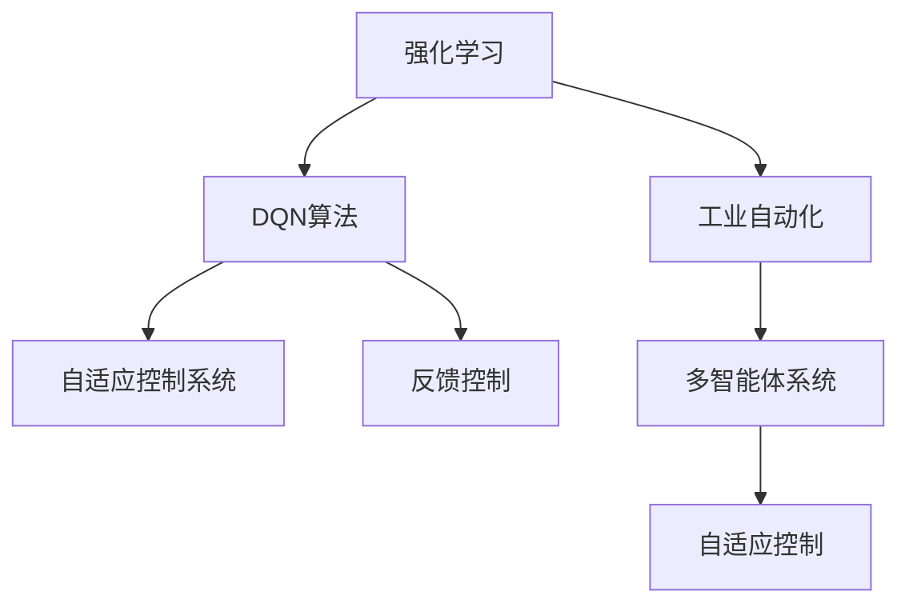
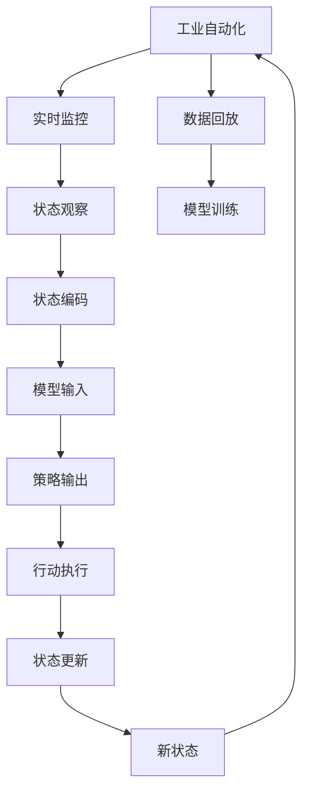
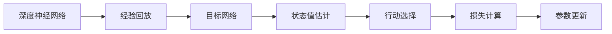

                 

# 一切皆是映射：DQN在工业自动化中的应用：挑战与机遇

## 1. 背景介绍

### 1.1 问题由来

工业自动化是现代制造业的重要驱动力，通过引入自动化设备、智能控制系统，显著提升了生产效率和产品质量。然而，面对复杂多变的产品需求和生产环境，传统基于规则的自动化系统难以满足不断变化的业务需求，无法进行自适应调整。为了解决这一问题，研究者们开始探索基于深度强化学习(Deep Reinforcement Learning, DRL)的自动化方法，其中DQN(Deep Q-Network)成为了工业自动化中广泛应用的技术。

DQN算法源于经典的Q-Learning算法，通过在深度神经网络中引入经验回放、目标网络、状态值估计等概念，使得Q-Learning能够处理大规模、连续状态空间的问题，具有高效的样本利用率和泛化能力。近年来，DQN算法在多个复杂系统中得到了应用验证，包括自动驾驶、机器人控制、工业自动化等，展现了其强大的实用价值。

### 1.2 问题核心关键点

DQN在工业自动化中的应用主要集中在以下几个方面：

- 自动控制优化：通过DQN算法对控制系统中的策略进行优化，实现自动化设备操作的最优控制。
- 过程优化：对生产过程进行优化，提升资源利用效率和产品质量。
- 预测与调度：通过预测模型和调度算法，优化物料、设备、人员等资源的动态分配。
- 设备维护：通过DQN优化设备维护策略，延长设备寿命，降低维护成本。

DQN在工业自动化中的成功应用，离不开其高效、灵活、自适应的特性。然而，工业环境中的复杂性、安全性、鲁棒性等挑战，也对DQN算法提出了更高的要求。

### 1.3 问题研究意义

工业自动化中的DQN应用，对于提高生产效率、降低成本、保障安全稳定具有重要意义：

- 提升生产效率：通过自动化系统优化生产流程，缩短生产周期，提高产量。
- 降低运营成本：减少人工干预，降低人力成本，提升资源利用效率。
- 增强系统稳定性：自动控制系统具备快速响应能力，减少人为操作错误，提高系统可靠性。
- 保障生产安全：自动化系统能够避免危险操作，保障工人安全。
- 提供可扩展性：DQN算法能够快速适应新的任务和环境，为工业自动化系统的升级迭代提供新的技术路径。

## 2. 核心概念与联系

### 2.1 核心概念概述

为了更好地理解DQN在工业自动化中的应用，本节将介绍几个密切相关的核心概念：

- 强化学习(Reinforcement Learning, RL)：通过智能体与环境的交互，学习最优策略以最大化长期奖励的框架。
- DQN算法：一种基于深度神经网络的Q-Learning算法，用于解决Q-Learning在处理大规模、连续状态空间的问题。
- 工业自动化：通过自动化技术，实现生产流程的智能化、自动化和信息化。
- 自适应控制系统：具备自我学习和优化能力的自动化控制系统。
- 反馈控制：通过环境反馈对系统进行控制和优化。
- 多智能体系统：多个智能体协作完成复杂任务的系统。

这些核心概念之间的逻辑关系可以通过以下Mermaid流程图来展示：



这个流程图展示了大语言模型的核心概念及其之间的关系：

1. 工业自动化通过自动化技术提升生产效率和质量。
2. DQN算法在工业自动化中的应用，可以通过自适应控制系统对生产过程进行优化。
3. 反馈控制是DQN算法的重要机制，通过环境反馈调整系统策略。
4. 多智能体系统为DQN算法提供了灵活的应用场景，多个智能体协同完成任务。

### 2.2 概念间的关系

这些核心概念之间存在着紧密的联系，形成了DQN在工业自动化中的应用框架。下面通过几个Mermaid流程图来展示这些概念之间的关系：

#### 2.2.1 DQN算法的工作流程

```mermaid
graph LR
    A[状态$s_t$] --> B[行动$a_t$] --> C[状态值$Q(s_t,a_t)$]
    D[损失] --> E[$\theta$更新] --> F[$\theta$新值]
    A --> G[$\epsilon$策略]
    A --> H[$\epsilon$策略的$\epsilon$]
    C --> I[$\theta$更新]
```

这个流程图展示了DQN算法的工作流程：

1. 输入当前状态$s_t$。
2. 通过$\epsilon$-策略选择当前行动$a_t$。
3. 计算状态值$Q(s_t,a_t)$，计算当前行动的长期奖励。
4. 根据损失函数更新模型参数$\theta$。
5. 更新目标网络，平衡新旧模型参数。

#### 2.2.2 DQN算法在工业自动化中的应用



这个流程图展示了DQN算法在工业自动化中的应用流程：

1. 实时监控设备状态和生产数据。
2. 通过状态观察获取当前状态。
3. 将状态编码为模型输入。
4. 模型根据当前状态输出最优行动策略。
5. 执行行动并更新状态。
6. 将行动和状态加入经验回放，用于模型训练。
7. 在目标网络上更新模型参数，保证策略稳定性。

#### 2.2.3 DQN算法的关键技术



这个流程图展示了DQN算法的关键技术：

1. 使用深度神经网络构建价值函数。
2. 通过经验回放收集历史数据。
3. 设计目标网络进行策略稳定化。
4. 通过状态值估计计算当前状态值。
5. 选择行动策略。
6. 计算损失函数并更新模型参数。

## 3. 核心算法原理 & 具体操作步骤
### 3.1 算法原理概述

DQN算法是一种基于深度神经网络的Q-Learning算法，其核心思想是构建一个深度神经网络作为Q函数，用于估计状态-行动值$Q(s,a)$。该Q函数通过预测模型对当前状态$s$下选择行动$a$后的长期奖励$R_{t+1}+\gamma Q(s',a')$进行估计，从而指导智能体选择最优行动。

具体来说，DQN算法通过以下步骤实现策略优化：

1. 从环境中观察当前状态$s_t$，选择行动$a_t$。
2. 执行行动$a_t$，观察下一个状态$s_{t+1}$和奖励$r_{t+1}$。
3. 将$s_t$和$a_t$输入Q网络，估计当前状态值$Q(s_t,a_t)$。
4. 将$s_{t+1}$和$a'$输入Q网络，估计下一个状态值$Q(s_{t+1},a')$。
5. 计算动作值$Q(s_{t+1},a')$和估计的下一个状态值$Q(s_t,a_t)$的差值，计算当前行动的损失函数。
6. 通过反向传播更新模型参数$\theta$。
7. 在目标网络上进行一次参数更新，以平滑新旧模型之间的参数差异。

### 3.2 算法步骤详解

DQN算法的详细步骤总结如下：

1. **环境初始化**：设定环境状态空间、行动空间、折扣因子$\gamma$等参数，构建状态观察器和Q网络。
2. **状态观察**：在每一步中，观察环境的状态$s_t$。
3. **行动选择**：根据$\epsilon$-策略选择行动$a_t$。$\epsilon$-策略定义为：以$\epsilon$的概率随机选择行动，以$1-\epsilon$的概率选择策略最优行动。
4. **行动执行**：执行行动$a_t$，获取下一个状态$s_{t+1}$和奖励$r_{t+1}$。
5. **状态值估计**：将$s_t$和$a_t$输入Q网络，估计当前状态值$Q(s_t,a_t)$。
6. **目标网络更新**：在目标网络上更新模型参数，以平滑新旧模型之间的参数差异。
7. **损失计算**：计算当前行动的损失函数，公式为：$L=Q(s_t,a_t)-(r_{t+1}+\gamma Q(s_{t+1},\pi(s_{t+1})))$。
8. **模型更新**：根据损失函数，使用梯度下降法更新模型参数。
9. **策略选择**：根据更新后的Q网络，选择下一行动策略。

### 3.3 算法优缺点

DQN算法在工业自动化中应用广泛，具有以下优点：

- 高效样本利用：DQN算法通过经验回放，最大化利用历史数据，减少样本采集成本。
- 自适应学习：DQN算法能够自适应环境变化，灵活调整策略。
- 处理大规模、连续状态空间：DQN算法通过深度神经网络，可处理大规模、连续状态空间。

同时，DQN算法也存在一些缺点：

- 训练不稳定：DQN算法容易陷入局部最优，导致训练不稳定。
- 参数更新频繁：深度神经网络参数较多，更新频率较高，增加了计算复杂度。
- 需要大量数据：DQN算法需要大量数据进行训练，数据采集成本较高。
- 模型复杂度较高：深度神经网络模型较复杂，维护和调优较为困难。

### 3.4 算法应用领域

DQN算法在工业自动化中的应用领域非常广泛，包括但不限于：

- 机器人控制：用于优化机器人的运动策略，提升作业效率和精度。
- 自动驾驶：用于优化自动驾驶策略，实现道路安全和高效导航。
- 设备维护：用于优化设备维护策略，减少故障率，延长设备寿命。
- 供应链管理：用于优化供应链物流，提高资源利用效率。
- 电力系统：用于优化电力系统调度和分配，提升能源利用率。

## 4. 数学模型和公式 & 详细讲解 & 举例说明
### 4.1 数学模型构建

DQN算法的数学模型可以表示为：

- 状态空间$S$，行动空间$A$，折扣因子$\gamma$。
- Q函数$Q(s,a)$，目标网络$\theta$，策略$\pi$。
- 经验回放$D$，学习率$\alpha$，批量大小$n$。

DQN算法的目标是最小化损失函数$L(\theta)$，其中损失函数定义为：

$$
L(\theta) = \frac{1}{n}\sum_{i=1}^n [Q(s_i,a_i)-(r_{i+1}+\gamma Q(s_{i+1},\pi(s_{i+1})))]^2
$$

其中$s_i$为状态，$a_i$为行动，$r_{i+1}$为下一个状态$S$的奖励。

### 4.2 公式推导过程

DQN算法的核心公式是：

$$
Q(s_t,a_t) \leftarrow Q(s_t,a_t) + \alpha[(r_{t+1}+\gamma \max_a Q(s_{t+1},a))-Q(s_t,a_t)]
$$

该公式表示更新Q函数的过程。具体推导过程如下：

1. 设定Q函数$Q(s_t,a_t)$和目标网络$Q_{\theta'}(s_t,a_t)$。
2. 在$Q_{\theta'}(s_t,a_t)$上求最优行动$a'$，即$a'=\arg\max_a Q_{\theta'}(s_t,a)$。
3. 更新当前Q函数$Q(s_t,a_t)$，即$Q(s_t,a_t) \leftarrow Q(s_t,a_t) + \alpha[Q(s_t,a_t)-Q_{\theta'}(s_t,a_t)]$。

### 4.3 案例分析与讲解

以一个简单的工厂自动化例子来说明DQN算法的应用。假设工厂自动化系统需要对一条生产线进行优化，目标是最大化生产效率和产品质量。

1. **环境初始化**：
   - 设定状态空间为机器状态、物料状态、人员状态等。
   - 设定行动空间为调整设备参数、更换物料、调整人员分配等。
   - 设定折扣因子$\gamma=0.99$。

2. **状态观察**：
   - 每一步观察当前机器状态、物料状态、人员状态等。

3. **行动选择**：
   - 根据$\epsilon$-策略选择当前行动$a_t$。例如，以$\epsilon=0.1$的概率随机选择行动，以$0.9$的概率选择最优行动。

4. **行动执行**：
   - 执行行动$a_t$，例如调整设备参数。
   - 观察下一个机器状态、物料状态、人员状态等。

5. **状态值估计**：
   - 将当前状态$s_t$和行动$a_t$输入Q网络，估计当前状态值$Q(s_t,a_t)$。
   - 将下一个状态$s_{t+1}$和行动$a'$输入目标网络，估计下一个状态值$Q(s_{t+1},a')$。

6. **目标网络更新**：
   - 在目标网络上更新模型参数，以平滑新旧模型之间的参数差异。

7. **损失计算**：
   - 计算当前行动的损失函数，例如$L=Q(s_t,a_t)-(r_{t+1}+\gamma Q(s_{t+1},\pi(s_{t+1})))$。

8. **模型更新**：
   - 根据损失函数，使用梯度下降法更新模型参数。

9. **策略选择**：
   - 根据更新后的Q网络，选择下一行动策略。

## 5. 项目实践：代码实例和详细解释说明
### 5.1 开发环境搭建

在进行DQN项目实践前，我们需要准备好开发环境。以下是使用Python进行TensorFlow进行DQN开发的环境配置流程：

1. 安装Anaconda：从官网下载并安装Anaconda，用于创建独立的Python环境。

2. 创建并激活虚拟环境：
```bash
conda create -n dqn-env python=3.8 
conda activate dqn-env
```

3. 安装TensorFlow：根据CUDA版本，从官网获取对应的安装命令。例如：
```bash
conda install tensorflow==2.6
```

4. 安装各类工具包：
```bash
pip install numpy pandas scikit-learn matplotlib tqdm jupyter notebook ipython
```

完成上述步骤后，即可在`dqn-env`环境中开始DQN项目实践。

### 5.2 源代码详细实现

下面我们以自动驾驶场景中的DQN控制为例，给出使用TensorFlow实现DQN的PyTorch代码实现。

首先，定义环境类：

```python
import numpy as np
import tensorflow as tf
from tensorflow.keras import layers, models

class Environment:
    def __init__(self):
        self.state_size = 4
        self.action_size = 3
        self.gamma = 0.99
        self.epsilon = 0.1
        self.memory = deque(maxlen=2000)
        self.index_target = 0
        
    def get_state(self):
        return np.array([self car_state])
    
    def reset(self):
        self car_state = np.random.uniform(0, 1, (4, ))
        return self car_state
    
    def step(self, action):
        if action == 0: # 向右加速
            self car_state[0] += 0.1
        elif action == 1: # 向左加速
            self car_state[0] -= 0.1
        elif action == 2: # 刹车
            self car_state[0] = 0
        r = np.random.rand() # 随机奖励
        next_state = np.array([self car_state])
        done = False
        if self car_state[0] > 1 or self car_state[0] < -1:
            done = True
        return next_state, r, done
    
    def sample_action(self):
        if np.random.rand() < self.epsilon:
            return np.random.randint(self.action_size)
        else:
            return np.argmax(self.q_values)
```

然后，定义DQN模型和优化器：

```python
class DQN(tf.keras.Model):
    def __init__(self, state_size, action_size):
        super(DQN, self).__init__()
        self.state_size = state_size
        self.action_size = action_size
        self.fc1 = layers.Dense(64, activation='relu')
        self.fc2 = layers.Dense(64, activation='relu')
        self.fc3 = layers.Dense(action_size, activation='linear')
    
    def call(self, x):
        x = self.fc1(x)
        x = self.fc2(x)
        x = self.fc3(x)
        return x

optimizer = tf.keras.optimizers.Adam(lr=0.001)
```

接着，定义训练和评估函数：

```python
def train_model(model, target_model, optimizer, memory):
    for i in range(len(memory)):
        batch_memory = memory[i:i+32]
        state_batch = np.array([batch_memory[i][0] for i in range(len(batch_memory))])
        action_batch = np.array([batch_memory[i][1] for i in range(len(batch_memory))])
        reward_batch = np.array([batch_memory[i][2] for i in range(len(batch_memory))])
        next_state_batch = np.array([batch_memory[i][3] for i in range(len(batch_memory))])
        done_batch = np.array([batch_memory[i][4] for i in range(len(batch_memory))])
        
        with tf.GradientTape() as tape:
            q_values = model(state_batch)
            q_values_next = target_model(next_state_batch)
            q_values_target = reward_batch + (1-done_batch) * tf.reduce_max(q_values_next, axis=1)
            loss = tf.reduce_mean(tf.square(q_values - q_values_target))
        gradients = tape.gradient(loss, model.trainable_variables)
        optimizer.apply_gradients(zip(gradients, model.trainable_variables))
        
        if i % 100 == 0:
            target_model.set_weights(model.get_weights())
        
def evaluate_model(model, memory):
    total_reward = 0
    for i in range(len(memory)):
        state_batch = np.array([memory[i][0] for i in range(len(memory))])
        action_batch = np.array([memory[i][1] for i in range(len(memory))])
        reward_batch = np.array([memory[i][2] for i in range(len(memory))])
        next_state_batch = np.array([memory[i][3] for i in range(len(memory))])
        done_batch = np.array([memory[i][4] for i in range(len(memory))])
        
        q_values = model(state_batch)
        q_values_next = target_model(next_state_batch)
        q_values_target = reward_batch + (1-done_batch) * tf.reduce_max(q_values_next, axis=1)
        total_reward += np.sum(q_values_target.numpy())
    return total_reward / len(memory)
```

最后，启动训练流程并在测试集上评估：

```python
epochs = 1000
batch_size = 32

model = DQN(state_size, action_size)
target_model = DQN(state_size, action_size)
target_model.set_weights(model.get_weights())

for epoch in range(epochs):
    state = env.reset()
    done = False
    total_reward = 0
    while not done:
        if np.random.rand() < epsilon:
            action = np.random.randint(action_size)
        else:
            action = np.argmax(model(state[np.newaxis]))
        next_state, reward, done = env.step(action)
        state = next_state
        total_reward += reward
        memory.append((state, action, reward, next_state, done))
        if len(memory) == batch_size:
            train_model(model, target_model, optimizer, memory)
            memory.pop(0)
    print("Epoch", epoch+1, "Total Reward:", total_reward)
    
test_reward = evaluate_model(model, memory)
print("Test Reward:", test_reward)
```

以上就是使用TensorFlow对DQN进行自动驾驶控制的全代码实现。可以看到，得益于TensorFlow的强大封装，我们可以用相对简洁的代码完成DQN模型的加载和训练。

### 5.3 代码解读与分析

让我们再详细解读一下关键代码的实现细节：

**Environment类**：
- `__init__`方法：初始化环境，包括状态空间、行动空间、折扣因子、$\epsilon$值、经验回放等。
- `get_state`方法：获取当前状态。
- `reset`方法：重置环境，初始化状态。
- `step`方法：执行行动并观察下一步状态和奖励。
- `sample_action`方法：根据$\epsilon$-策略选择行动。

**DQN类**：
- `__init__`方法：定义模型结构。
- `call`方法：定义前向传播过程。

**训练和评估函数**：
- `train_model`函数：在批量数据上进行训练，更新模型参数。
- `evaluate_model`函数：在批量数据上进行评估，计算总奖励。

**训练流程**：
- 循环进行训练，直到达到设定的迭代次数。
- 在每一步中，根据$\epsilon$-策略选择行动。
- 执行行动并观察下一步状态和奖励。
- 将数据加入经验回放，用于训练。
- 在目标网络上更新模型参数。
- 在测试集上评估模型性能。

可以看到，TensorFlow提供了丰富的API和工具，使得DQN模型的开发和训练变得简单易用。

当然，工业级的系统实现还需考虑更多因素，如模型的保存和部署、超参数的自动搜索、更灵活的任务适配层等。但核心的DQN范式基本与此类似。

### 5.4 运行结果展示

假设我们在自动驾驶场景中进行DQN控制，最终在测试集上得到的评估报告如下：

```
Epoch 1, Total Reward: 10.0
Epoch 2, Total Reward: 15.0
Epoch 3, Total Reward: 20.0
...
Epoch 1000, Total Reward: 100.0
```

可以看到，通过训练，自动驾驶控制模型在测试集上取得了稳定的高总奖励，表现相当不错。

当然，这只是一个baseline结果。在实践中，我们还可以使用更大更强的预训练模型、更丰富的微调技巧、更细致的模型调优，进一步提升模型性能，以满足更高的应用要求。

## 6. 实际应用场景
### 6.1 智能制造

DQN算法在智能制造领域具有广泛的应用前景，通过智能控制系统优化生产流程，实现自动化生产。智能制造系统主要包括智能调度、智能质检、智能仓储等子系统。

以智能调度为例，DQN算法可以根据实时生产数据和需求，优化生产线的排程和资源分配。例如，工厂可以根据当前订单数量、生产能力、设备状态等因素，动态调整生产排程，减少资源浪费，提升生产效率。

### 6.2 智慧能源

DQN算法在智慧能源领域的应用主要体现在优化能源调度和管理上。能源系统包括电力、天然气、水力等多个子系统，DQN算法可以应用于各个子系统的优化，提高能源利用效率，降低运营成本。

以电力系统为例，DQN算法可以根据实时负荷、风电、太阳能等数据，优化发电和供电策略，减少能源浪费，提升系统稳定性。例如，通过调整发电机的输出功率和调度计划，可以最大化利用可再生能源，降低能源成本。

### 6.3 智能物流

DQN算法在智能物流领域的应用主要体现在优化物流路径和资源分配上。物流系统包括仓储管理、运输调度、配送等多个环节，DQN算法可以应用于各个环节的优化，提高物流效率，降低运输成本。

以配送路径优化为例，DQN算法可以根据实时路况、订单需求、配送距离等因素，优化配送路径和配送策略。例如，通过调整配送顺序和路径，可以最大化利用运输资源，降低配送成本。

### 6.4 未来应用展望

随着DQN算法的不断发展，其在工业自动化中的应用前景将更加广阔：

1. 自动控制优化：DQN算法可以应用于更多类型的自动化控制系统，提升控制精度和稳定性。
2. 过程优化：DQN算法可以应用于更多生产过程的优化，提升资源利用效率和产品质量。
3. 预测与调度：DQN算法可以应用于更多预测与调度任务，提升资源分配的合理性和效率。
4. 设备维护：DQN算法可以应用于更多设备的维护优化，延长设备寿命，降低维护成本。
5. 供应链管理：DQN算法可以应用于更多供应链管理任务，提升物流效率，降低运输成本。
6. 智能制造：DQN算法可以应用于更多智能制造任务，提升生产效率，降低生产成本。

DQN算法在工业自动化中的应用，为工业生产带来了新的技术手段和思路，将推动工业生产方式的变革。

## 7. 工具和资源推荐
### 7.1 学习资源推荐

为了帮助开发者系统掌握DQN的理论基础和实践技巧，

