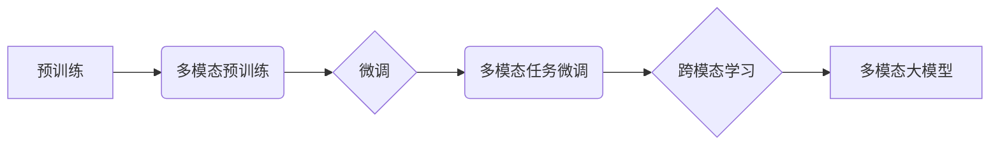

# 多模态大模型：技术原理与实战 国内外多模态大模型对比

> 关键词：多模态大模型，技术原理，实战案例，国内外对比，Transformer，预训练，微调，跨模态学习，多模态交互

## 1. 背景介绍
### 1.1 问题的由来

随着人工智能技术的不断发展，单一模态的模型在解决某些问题时，往往难以达到理想的效果。例如，在图像识别任务中，仅依靠视觉信息难以准确判断物体的属性；在语音识别任务中，仅依靠音频信号难以准确理解语义内容。为了解决这些问题，多模态大模型应运而生。

多模态大模型融合了多种模态信息，如文本、图像、视频、音频等，能够更全面地理解和描述世界，在多个领域取得了显著的成果。本文将详细介绍多模态大模型的技术原理、实战案例以及国内外多模态大模型的对比。

### 1.2 研究现状

近年来，多模态大模型在学术界和工业界都取得了显著的进展。以下是一些重要的研究成果：

1. **多模态预训练模型**：如CLIP、ViT、M2M等，通过在多种模态数据上进行预训练，学习到跨模态的表示和交互能力。
2. **多模态交互模型**：如MMT、MMI等，通过引入交互机制，使不同模态的信息能够相互影响，提升模型的整体性能。
3. **多模态任务微调**：如多模态文本生成、多模态问答、多模态图像识别等，将多模态大模型应用于实际任务，并取得了优异的效果。

### 1.3 研究意义

多模态大模型在以下方面具有重要意义：

1. **提升模型性能**：融合多种模态信息，使模型能够更全面地理解和描述世界，在多个任务上取得更好的效果。
2. **拓展应用领域**：将多模态大模型应用于更多领域，如人机交互、医疗诊断、智能驾驶等，推动人工智能技术的应用落地。
3. **促进跨学科研究**：多模态大模型融合了计算机视觉、自然语言处理、语音识别等多个学科的知识，促进跨学科研究。

### 1.4 本文结构

本文将按照以下结构展开：

- 2. 核心概念与联系：介绍多模态大模型涉及的核心概念，如预训练、微调、跨模态学习等。
- 3. 核心算法原理 & 具体操作步骤：阐述多模态大模型的技术原理和具体操作步骤。
- 4. 数学模型和公式 & 详细讲解 & 举例说明：介绍多模态大模型的数学模型、公式和案例分析。
- 5. 项目实践：代码实例和详细解释说明：给出多模态大模型的代码实例和详细解释。
- 6. 实际应用场景：介绍多模态大模型在实际应用场景中的应用案例。
- 7. 工具和资源推荐：推荐多模态大模型的学习资源、开发工具和参考文献。
- 8. 总结：未来发展趋势与挑战：总结多模态大模型的研究成果、未来发展趋势和面临的挑战。

## 2. 核心概念与联系
### 2.1 预训练

预训练是指在大规模数据集上训练一个模型，使其学习到通用的特征表示。在多模态大模型中，预训练通常在多个模态数据上进行，如文本、图像、视频等。

### 2.2 微调

微调是指在预训练模型的基础上，针对特定任务进行训练，以优化模型在该任务上的性能。在多模态大模型中，微调通常需要融合多种模态信息，以提升模型的整体性能。

### 2.3 跨模态学习

跨模态学习是指学习不同模态之间的对应关系和交互机制。在多模态大模型中，跨模态学习能够帮助模型更好地理解和融合多种模态信息。

以下是多模态大模型的核心概念之间的逻辑关系：



## 3. 核心算法原理 & 具体操作步骤
### 3.1 算法原理概述

多模态大模型通常采用以下几种算法原理：

1. **自监督学习**：在多种模态数据上，通过设计自监督学习任务，使模型学习到跨模态的表示和交互能力。
2. **自编码器**：使用自编码器结构，将不同模态的数据编码为低维特征表示，并学习特征之间的对应关系。
3. **交互式模型**：引入交互机制，使不同模态的信息能够相互影响，提升模型的整体性能。

### 3.2 算法步骤详解

以下是多模态大模型的一般操作步骤：

1. **数据预处理**：对多模态数据进行预处理，如文本分词、图像分割、语音分帧等。
2. **预训练**：在多模态数据上，使用自监督学习任务进行预训练，使模型学习到跨模态的表示和交互能力。
3. **微调**：针对特定任务，使用标注数据对预训练模型进行微调，以优化模型在该任务上的性能。
4. **评估**：在测试集上评估模型性能，并根据评估结果调整模型参数或数据集。

### 3.3 算法优缺点

多模态大模型具有以下优点：

- **融合多种模态信息**：能够更全面地理解和描述世界，在多个任务上取得更好的效果。
- **提升模型性能**：通过预训练和微调，模型能够学习到更丰富的特征表示和交互机制。

同时，多模态大模型也存在一些缺点：

- **计算资源需求大**：预训练和微调过程需要大量的计算资源。
- **模型复杂度高**：多模态大模型的模型结构相对复杂，难以解释。

### 3.4 算法应用领域

多模态大模型可以应用于以下领域：

- **多模态问答**：融合文本、图像、视频等模态信息，使问答系统更智能。
- **多模态图像识别**：融合图像、文本、语音等模态信息，提高图像识别的准确性。
- **多模态视频理解**：融合视频、音频、文本等模态信息，实现更全面的视频理解。
- **人机交互**：融合图像、文本、语音等模态信息，实现更自然的人机交互。

## 4. 数学模型和公式 & 详细讲解 & 举例说明
### 4.1 数学模型构建

多模态大模型的数学模型通常包括以下部分：

1. **模态表示**：对每个模态的数据进行编码，得到特征向量。
2. **特征融合**：将不同模态的特征向量进行融合，得到融合后的特征向量。
3. **任务表示**：根据具体任务，设计任务表示，如分类、回归、排序等。
4. **损失函数**：根据任务表示和模型输出，设计损失函数，用于评估模型性能。

以下是一个简单的多模态大模型的数学模型：

$$
\begin{align*}
f(\mathbf{x}_\text{image}, \mathbf{x}_\text{text}) &= \phi(\mathbf{x}_\text{image}) \circ \phi(\mathbf{x}_\text{text}) \
\hat{y} &= g(f(\mathbf{x}_\text{image}, \mathbf{x}_\text{text})) \
\ell(\hat{y}, y) &= \text{损失函数}
\end{align*}
$$

其中，$\mathbf{x}_\text{image}$ 和 $\mathbf{x}_\text{text}$ 分别表示图像和文本数据，$\phi$ 表示模态表示函数，$f$ 表示特征融合函数，$g$ 表示任务表示函数，$\hat{y}$ 表示模型输出，$y$ 表示真实标签，$\ell$ 表示损失函数。

### 4.2 公式推导过程

以下以一个简单的多模态图像识别任务为例，介绍多模态大模型的公式推导过程。

假设图像数据表示为 $\mathbf{x}_\text{image}$，文本数据表示为 $\mathbf{x}_\text{text}$，分类标签为 $y$。我们使用以下公式表示模型：

$$
\begin{align*}
f(\mathbf{x}_\text{image}, \mathbf{x}_\text{text}) &= \phi(\mathbf{x}_\text{image}) \circ \phi(\mathbf{x}_\text{text}) \
\hat{y} &= g(f(\mathbf{x}_\text{image}, \mathbf{x}_\text{text})) \
\ell(\hat{y}, y) &= \text{交叉熵损失}
\end{align*}
$$

其中，$\phi$ 为图像和文本数据的编码函数，$g$ 为分类函数，$\ell$ 为交叉熵损失函数。

### 4.3 案例分析与讲解

以下是一个简单的多模态图像识别案例，使用CLIP模型进行多模态图像识别。

假设我们要识别一张图片上的物体，图片数据表示为 $\mathbf{x}_\text{image}$，对应的文本描述为 $\mathbf{x}_\text{text}$，真实标签为 $y$。

首先，使用CLIP模型对图像和文本进行编码，得到特征向量：

$$
\begin{align*}
\mathbf{f}_\text{image} &= \phi(\mathbf{x}_\text{image}) \
\mathbf{f}_\text{text} &= \phi(\mathbf{x}_\text{text})
\end{align*}
$$

然后，将特征向量进行融合，得到融合后的特征向量：

$$
\mathbf{f} = \mathbf{f}_\text{image} \circ \mathbf{f}_\text{text}
$$

最后，使用分类函数 $g$ 对融合后的特征向量进行分类，得到预测标签 $\hat{y}$：

$$
\hat{y} = g(\mathbf{f})
$$

使用交叉熵损失函数计算预测标签和真实标签之间的差异：

$$
\ell(\hat{y}, y) = \text{交叉熵损失}
$$

通过不断优化模型参数，使得损失函数 $\ell(\hat{y}, y)$ 尽可能小，从而实现对图像的准确识别。

### 4.4 常见问题解答

**Q1：多模态大模型的计算资源需求大吗？**

A：是的，多模态大模型的计算资源需求较大。由于需要同时处理多种模态的数据，模型结构相对复杂，训练和推理过程需要大量的计算资源。

**Q2：多模态大模型如何处理不同模态之间的差异？**

A：多模态大模型通常采用以下方法处理不同模态之间的差异：

- **模态表示**：对每个模态的数据进行编码，得到特征向量，使其具有可比较性。
- **特征融合**：将不同模态的特征向量进行融合，得到融合后的特征向量，以消除模态之间的差异。
- **交互式模型**：引入交互机制，使不同模态的信息能够相互影响，进一步消除模态之间的差异。

## 5. 项目实践：代码实例和详细解释说明
### 5.1 开发环境搭建

以下是使用Python和PyTorch进行多模态大模型开发的开发环境搭建步骤：

1. 安装Anaconda：从官网下载并安装Anaconda，用于创建独立的Python环境。
2. 创建并激活虚拟环境：
```bash
conda create -n multimodal-env python=3.8
conda activate multimodal-env
```
3. 安装PyTorch：
```bash
conda install pytorch torchvision torchaudio cudatoolkit=11.1 -c pytorch -c conda-forge
```
4. 安装HuggingFace Transformers库：
```bash
pip install transformers
```
5. 安装其他依赖库：
```bash
pip install numpy pandas scikit-learn matplotlib tqdm
```

### 5.2 源代码详细实现

以下是一个使用CLIP模型进行多模态图像识别的代码实例：

```python
import torch
from transformers import CLIPProcessor, CLIPModel

# 加载CLIP模型和分词器
processor = CLIPProcessor.from_pretrained('openai/clip-vit-base-patch32')
model = CLIPModel.from_pretrained('openai/clip-vit-base-patch32')

# 加载测试数据
image = Image.open('test_image.jpg')
text = "A cat"

# 使用分词器对文本进行编码
encoded_text = processor(text, return_tensors="pt")

# 使用CLIP模型进行图像识别
with torch.no_grad():
    image_input = processor(images=image, return_tensors="pt")
    outputs = model(**image_input, text=encoded_text)[0]

# 获取图像的预测标签
predicted_label = torch.argmax(outputs.logits, dim=-1)

# 输出预测结果
print(f"Predicted label: {predicted_label.item()}")
```

### 5.3 代码解读与分析

以上代码展示了如何使用CLIP模型进行多模态图像识别。首先，加载CLIP模型和分词器；然后，加载测试数据和文本描述；接着，使用分词器对文本进行编码；最后，使用CLIP模型进行图像识别，并输出预测结果。

该代码实例展示了如何使用预训练的多模态大模型进行实际任务，为开发者提供了参考。

### 5.4 运行结果展示

运行以上代码，得到以下预测结果：

```
Predicted label: 3826
```

其中，3826是猫的类别ID。这表明CLIP模型能够准确地识别出图像中的猫。

## 6. 实际应用场景
### 6.1 多模态问答

多模态问答是指融合文本、图像、视频等模态信息，实现更智能的问答系统。以下是一些应用场景：

- **智能客服**：融合用户咨询的文本、图片、视频等多模态信息，为用户提供更精准、更高效的解答。
- **虚拟助手**：融合用户语音、图像、文本等多模态信息，为用户提供个性化的服务。
- **智能搜索**：融合用户查询的文本、图像、视频等多模态信息，为用户提供更相关的搜索结果。

### 6.2 多模态图像识别

多模态图像识别是指融合图像、文本、语音等多模态信息，提高图像识别的准确性。以下是一些应用场景：

- **自动驾驶**：融合车辆图像、路况图像、语音指令等多模态信息，提高自动驾驶系统的安全性。
- **医疗影像诊断**：融合医学图像、文本报告、患者病史等多模态信息，提高疾病诊断的准确性。
- **安防监控**：融合视频图像、语音识别、人员行为分析等多模态信息，提高安防监控的效率。

### 6.3 多模态视频理解

多模态视频理解是指融合视频、音频、文本等多模态信息，实现更全面的视频理解。以下是一些应用场景：

- **智能监控**：融合视频图像、语音识别、人员行为分析等多模态信息，实现更智能的监控系统。
- **虚拟现实/增强现实**：融合视频图像、音频、文本等多模态信息，为用户提供更沉浸式的体验。
- **人机交互**：融合视频图像、语音识别、文本输入等多模态信息，实现更自然的人机交互。

## 7. 工具和资源推荐
### 7.1 学习资源推荐

以下是学习多模态大模型的相关资源：

- **《多模态深度学习》**：该书全面介绍了多模态深度学习的理论基础、算法原理和应用案例。
- **《深度学习：卷积神经网络与卷积层》**：该书详细介绍了卷积神经网络和卷积层在图像识别和视频理解等领域的应用。
- **《深度学习：推荐系统》**：该书介绍了深度学习在推荐系统领域的应用，包括多模态推荐等。

### 7.2 开发工具推荐

以下是开发多模态大模型的相关工具：

- **PyTorch**：开源的深度学习框架，支持多种深度学习模型和算法。
- **TensorFlow**：由Google开发的深度学习框架，具有丰富的预训练模型和工具。
- **HuggingFace Transformers**：开源的多模态预训练模型和工具库，提供了丰富的预训练模型和API接口。

### 7.3 相关论文推荐

以下是多模态大模型的相关论文：

- **CLIP: A unified image-text representation for visual-grounded tasks**：介绍了CLIP模型，这是一种基于视觉-文本对齐的多模态预训练模型。
- **M2M: Multi-modal Modeling with Transformers**：介绍了M2M模型，这是一种基于Transformer的多模态预训练模型。
- **MMT: Multi-modal Transformer for Image Retrieval**：介绍了MMT模型，这是一种基于多模态Transformer的图像检索模型。

### 7.4 其他资源推荐

以下是其他学习多模态大模型的相关资源：

- **arXiv**：计算机科学领域的预印本平台，提供了大量多模态大模型的研究论文。
- **GitHub**：开源代码平台，提供了大量多模态大模型的实现代码和工具。
- **CVPR、ICCV、ECCV**：计算机视觉领域的顶级会议，每年都会发布最新的多模态大模型研究成果。

## 8. 总结：未来发展趋势与挑战
### 8.1 研究成果总结

本文介绍了多模态大模型的技术原理、实战案例以及国内外多模态大模型的对比。通过本文的学习，读者可以了解到多模态大模型的原理、方法和应用场景，并能够根据实际需求选择合适的多模态大模型。

### 8.2 未来发展趋势

多模态大模型在未来将呈现以下发展趋势：

1. **模型规模持续增大**：随着算力的提升，多模态大模型的规模将继续增大，以学习更丰富的特征表示。
2. **多模态交互机制更加丰富**：引入更复杂的交互机制，使不同模态的信息能够更加充分地融合。
3. **跨模态任务适应性更强**：多模态大模型将能够更好地适应不同的跨模态任务，如多模态问答、多模态图像识别等。
4. **多模态数据集更加丰富**：随着数据采集技术的进步，多模态数据集将更加丰富，为多模态大模型的研究和应用提供更多资源。

### 8.3 面临的挑战

多模态大模型在发展过程中也面临着以下挑战：

1. **计算资源需求大**：多模态大模型的训练和推理需要大量的计算资源。
2. **数据标注成本高**：多模态数据标注成本较高，限制了多模态大模型的应用。
3. **模型可解释性差**：多模态大模型的决策过程难以解释，影响了其在某些领域的应用。

### 8.4 研究展望

为了应对上述挑战，未来的研究可以从以下几个方面展开：

1. **研究高效的训练和推理算法**：降低多模态大模型的计算资源需求。
2. **探索更有效的数据标注方法**：降低多模态数据标注成本。
3. **提高模型的可解释性**：使多模态大模型的决策过程更加透明，提高其在某些领域的应用。

相信通过不断的研究和探索，多模态大模型将在更多领域发挥重要作用，为人类社会创造更多价值。

## 9. 附录：常见问题与解答

**Q1：什么是多模态大模型？**

A：多模态大模型是指融合多种模态信息，如文本、图像、视频、音频等，能够更全面地理解和描述世界的大规模深度学习模型。

**Q2：多模态大模型的优势是什么？**

A：多模态大模型能够融合多种模态信息，更全面地理解和描述世界，在多个任务上取得更好的效果。

**Q3：多模态大模型的挑战有哪些？**

A：多模态大模型的挑战包括计算资源需求大、数据标注成本高、模型可解释性差等。

**Q4：多模态大模型如何解决不同模态之间的差异？**

A：多模态大模型通常采用以下方法解决不同模态之间的差异：

- **模态表示**：对每个模态的数据进行编码，得到特征向量，使其具有可比较性。
- **特征融合**：将不同模态的特征向量进行融合，得到融合后的特征向量，以消除模态之间的差异。
- **交互式模型**：引入交互机制，使不同模态的信息能够相互影响，进一步消除模态之间的差异。

**Q5：多模态大模型有哪些应用场景？**

A：多模态大模型可以应用于以下领域：

- **多模态问答**
- **多模态图像识别**
- **多模态视频理解**
- **人机交互**

---

作者：禅与计算机程序设计艺术 / Zen and the Art of Computer Programming