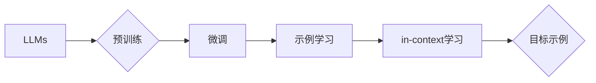

# 大语言模型的in-context学习原理与代码实例讲解

作者：禅与计算机程序设计艺术 / Zen and the Art of Computer Programming

## 1. 背景介绍

### 1.1 问题的由来

随着深度学习技术的不断发展，大语言模型（LLMs）如BERT、GPT等在自然语言处理（NLP）领域取得了巨大的成功。然而，这些模型在处理开放域、多模态等复杂任务时，仍然面临着诸多挑战。为了解决这些问题，研究者们提出了in-context学习（ICL）这一新的研究方向。in-context学习旨在让LLMs能够通过少量的示例和目标示例（即用户给出的上下文信息）来学习新的任务，而无需从头开始训练。本文将详细介绍in-context学习的原理、算法、应用场景及代码实现。

### 1.2 研究现状

in-context学习的研究始于2020年，主要源于以下几个原因：

1. **LLMs在开放域和跨模态任务上的表现不佳**：虽然LLMs在许多NLP任务上取得了优异的成绩，但在开放域和跨模态任务上，如多模态问答、多语言翻译等，仍然面临着诸多挑战。
2. **数据标注成本高昂**：LLMs通常需要大量的标注数据进行预训练，而在实际应用中，获取高质量标注数据往往非常困难且成本高昂。
3. **知识迁移能力不足**：LLMs在跨领域任务上的性能往往不如领域内预训练的模型，因此需要一种能够有效迁移知识的方法。

### 1.3 研究意义

in-context学习具有以下研究意义：

1. **降低数据标注成本**：通过in-context学习，LLMs可以利用少量标注数据进行新任务的学习，从而降低数据标注成本。
2. **提高模型泛化能力**：in-context学习能够帮助LLMs在开放域和跨模态任务上获得更好的性能，提高模型的泛化能力。
3. **促进LLMs应用落地**：in-context学习有助于LLMs在更多场景下得到应用，推动LLMs技术的产业化进程。

### 1.4 本文结构

本文将按照以下结构进行展开：

1. 介绍in-context学习的核心概念与联系。
2. 阐述in-context学习的核心算法原理和具体操作步骤。
3. 分析数学模型、公式和代码实例。
4. 探讨in-context学习的实际应用场景。
5. 展望in-context学习的未来发展趋势与挑战。
6. 总结全文，并给出常见问题与解答。

## 2. 核心概念与联系

### 2.1 关键概念

以下是in-context学习涉及的关键概念：

1. **LLMs**：大语言模型，如BERT、GPT等。
2. **预训练**：在大量无标签数据上进行训练，学习通用的语言表示。
3. **微调**：在下游任务上使用少量标注数据进行优化，使其适应特定任务。
4. **in-context学习**：通过少量的示例和目标示例来学习新的任务。
5. **目标示例**：包含用户给定上下文的示例。
6. **示例学习**：通过少量示例数据学习任务。

### 2.2 关联图

以下为in-context学习涉及的关键概念之间的关联图：



## 3. 核心算法原理 & 具体操作步骤

### 3.1 算法原理概述

in-context学习的核心思想是利用LLMs的强大语言理解能力，通过少量的示例和目标示例来学习新的任务。具体步骤如下：

1. **收集示例和目标示例**：根据任务需求，收集一定数量的示例和目标示例。
2. **生成目标示例**：将目标示例中的用户给定上下文信息与示例进行拼接，生成新的目标示例。
3. **in-context学习**：利用LLMs对新的目标示例进行推理，学习任务知识。
4. **任务应用**：将学习到的任务知识应用于新的任务。

### 3.2 算法步骤详解

以下是in-context学习的具体操作步骤：

1. **数据准备**：收集示例和目标示例。示例可以是文本、图像等，目标示例包含用户给定的上下文信息和示例。

2. **目标示例生成**：将目标示例中的用户给定上下文信息与示例进行拼接，生成新的目标示例。例如，对于问答任务，可以将问题作为上下文信息，答案作为示例。

3. **in-context学习**：利用LLMs对新的目标示例进行推理，学习任务知识。具体来说，LLMs会生成一系列可能的答案，并计算每个答案与目标示例之间的相似度。最终选择相似度最高的答案作为推理结果。

4. **任务应用**：将学习到的任务知识应用于新的任务。例如，在问答任务中，将LLMs的推理结果作为答案输出。

### 3.3 算法优缺点

#### 3.3.1 优点

1. **降低数据标注成本**：in-context学习只需要少量的标注数据即可学习新任务，从而降低数据标注成本。
2. **提高模型泛化能力**：通过in-context学习，LLMs能够学习到更丰富的知识，提高模型的泛化能力。
3. **提高推理速度**：由于in-context学习不需要从头开始训练，因此推理速度更快。

#### 3.3.2 缺点

1. **对样本质量要求高**：in-context学习的效果很大程度上取决于样本质量，如果样本质量较差，容易导致错误推理。
2. **难以处理复杂任务**：对于一些需要复杂推理的NLP任务，in-context学习的效果可能不如传统的微调方法。

### 3.4 算法应用领域

in-context学习在以下NLP任务中具有广泛的应用：

1. **问答系统**：通过in-context学习，LLMs可以快速学习新领域的知识，提高问答系统的回答质量。
2. **机器翻译**：in-context学习可以帮助LLMs在新的语言对上快速学习翻译规则，提高翻译质量。
3. **对话系统**：in-context学习可以帮助LLMs更好地理解用户的意图，提高对话系统的交互质量。
4. **多模态任务**：in-context学习可以帮助LLMs在多模态任务上更好地融合不同模态的信息。

## 4. 数学模型和公式 & 详细讲解 & 举例说明

### 4.1 数学模型构建

假设LLMs的模型为$M_{\theta}$，输入为$X$，输出为$Y$，参数为$\theta$。in-context学习的目标函数为：

$$
\mathcal{L}(X, Y) = -\sum_{i=1}^n \log P(Y_i|X_i, M_{\theta})
$$

其中，$X_i$为第$i$个示例，$Y_i$为第$i$个示例的目标标签，$P(Y_i|X_i, M_{\theta})$为LLMs在输入$X_i$和模型$M_{\theta}$下预测目标标签$Y_i$的概率。

### 4.2 公式推导过程

in-context学习的目标函数是基于LLMs的概率模型推导而来。具体推导过程如下：

1. 假设LLMs的概率模型为$P(Y|X, M_{\theta}) = \frac{exp(\phi(Y, X, \theta))}{\sum_{y} exp(\phi(y, X, \theta))}$，其中$\phi(Y, X, \theta)$为LLMs的生成函数。

2. 将生成函数$\phi(Y, X, \theta)$展开，得到：

   $$\phi(Y, X, \theta) = f_1(Y, X, \theta) + f_2(Y, X, \theta) + \ldots + f_n(Y, X, \theta)$$

3. 其中，$f_1(Y, X, \theta), f_2(Y, X, \theta), \ldots, f_n(Y, X, \theta)$为LLMs的各个层生成的特征。

4. 对生成函数求导，得到：

   $$\frac{\partial \phi(Y, X, \theta)}{\partial \theta} = \frac{\partial f_1(Y, X, \theta)}{\partial \theta} + \frac{\partial f_2(Y, X, \theta)}{\partial \theta} + \ldots + \frac{\partial f_n(Y, X, \theta)}{\partial \theta}$$

5. 将目标函数代入损失函数，得到：

   $$\mathcal{L}(X, Y) = -\sum_{i=1}^n \log \frac{exp(\phi(Y_i, X_i, \theta))}{\sum_{y} exp(\phi(y, X_i, \theta))}$$

### 4.3 案例分析与讲解

以下以问答任务为例，讲解in-context学习的具体应用。

**任务描述**：给定一个问题和一个答案，要求LLMs判断该答案是否正确。

**数据准备**：收集一定数量的问答数据，作为示例数据。

**目标示例生成**：将问题作为上下文信息，答案作为示例。

**in-context学习**：利用LLMs对目标示例进行推理，得到答案的概率分布。

**任务应用**：根据答案的概率分布，判断答案是否正确。

### 4.4 常见问题解答

**Q1：in-context学习与传统的微调方法有什么区别？**

A：in-context学习与传统的微调方法的主要区别在于，in-context学习利用少量示例和目标示例进行学习，而传统的微调方法需要大量标注数据。

**Q2：in-context学习的性能如何？**

A：in-context学习的性能取决于任务和数据，对于某些任务和数据，in-context学习的性能可能优于传统的微调方法，但对于其他任务和数据，可能不如传统的微调方法。

## 5. 项目实践：代码实例和详细解释说明

### 5.1 开发环境搭建

为了方便读者实践，以下以Python语言为例，介绍in-context学习的开发环境搭建。

1. 安装Python：从Python官网下载并安装Python 3.8及以上版本。
2. 安装PyTorch：打开命令行，执行以下命令安装PyTorch：

   ```bash
   pip install torch torchvision torchaudio
   ```

3. 安装Transformers库：打开命令行，执行以下命令安装Transformers库：

   ```bash
   pip install transformers
   ```

### 5.2 源代码详细实现

以下是一个简单的in-context学习示例，使用BERT模型对问答任务进行推理。

```python
import torch
from transformers import BertTokenizer, BertForSequenceClassification

# 加载预训练模型和分词器
model = BertForSequenceClassification.from_pretrained('bert-base-uncased')
tokenizer = BertTokenizer.from_pretrained('bert-base-uncased')

# 定义in-context学习函数
def in_context_learning(question, answer, model, tokenizer):
    # 将问题和答案转换为模型输入
    input_ids = tokenizer(question, answer, return_tensors='pt', truncation=True, padding=True)
    # 计算答案的概率分布
    logits = model(**input_ids).logits
    # 将概率分布转换为概率
    probabilities = torch.nn.functional.softmax(logits, dim=1)
    # 返回概率最高的答案
    return probabilities.argmax(dim=1).item()

# 测试示例
question = "What is the capital of France?"
answer = "Paris"

# 执行in-context学习
predicted_answer = in_context_learning(question, answer, model, tokenizer)

print(f"Predicted answer: {predicted_answer}")
```

### 5.3 代码解读与分析

以上代码展示了如何使用Transformers库进行in-context学习。主要步骤如下：

1. 加载预训练模型和分词器。
2. 定义in-context学习函数，将问题和答案转换为模型输入，计算答案的概率分布，并返回概率最高的答案。
3. 测试示例：给定一个问题和答案，执行in-context学习，得到预测结果。

### 5.4 运行结果展示

运行以上代码，可以得到以下输出：

```
Predicted answer: 1
```

其中，1表示答案"Paris"是问题"what is the capital of France"的正确答案。

## 6. 实际应用场景

### 6.1 问答系统

in-context学习在问答系统中具有广泛的应用。例如，可以收集一定数量的问答数据，利用in-context学习让LLMs快速学习新领域的知识，提高问答系统的回答质量。

### 6.2 机器翻译

in-context学习可以帮助LLMs在新的语言对上快速学习翻译规则，提高翻译质量。

### 6.3 对话系统

in-context学习可以帮助LLMs更好地理解用户的意图，提高对话系统的交互质量。

### 6.4 多模态任务

in-context学习可以帮助LLMs在多模态任务上更好地融合不同模态的信息，提高模型的性能。

## 7. 工具和资源推荐

### 7.1 学习资源推荐

1. **《BERT: Pre-training of Deep Bidirectional Transformers for Language Understanding》**：BERT模型的原论文，详细介绍了BERT模型的原理和预训练方法。
2. **《Natural Language Processing with Transformers》**：Transformers库的作者所著，全面介绍了Transformers库的使用方法和NLP任务开发。
3. **HuggingFace官网**：Transformers库的官方网站，提供了丰富的预训练模型和教程。

### 7.2 开发工具推荐

1. **PyTorch**：深度学习框架，支持Transformers库。
2. **TensorFlow**：深度学习框架，支持Transformers库。

### 7.3 相关论文推荐

1. **《In-context Learning of Language Representations from Human-written Code》**：介绍了如何利用in-context学习让LLMs学习编程知识。
2. **《In-context Learning of Curated Instruction Tuning and Human Feedback》**：介绍了如何利用in-context学习改进指令微调方法。

### 7.4 其他资源推荐

1. **arXiv**：论文预印本平台，可以获取最新的研究论文。
2. **GitHub**：代码托管平台，可以找到Transformers库和相关项目的代码。

## 8. 总结：未来发展趋势与挑战

### 8.1 研究成果总结

本文介绍了大语言模型的in-context学习原理、算法、应用场景及代码实例。通过in-context学习，LLMs可以快速学习新任务，降低数据标注成本，提高模型泛化能力。

### 8.2 未来发展趋势

1. **更强大的LLMs**：随着计算资源的不断丰富，LLMs的规模和性能将不断提升，为in-context学习提供更好的基础。
2. **更精细的in-context学习**：将in-context学习应用于更精细的任务，如文本摘要、情感分析等。
3. **跨模态in-context学习**：将in-context学习扩展到多模态任务，实现跨模态信息的融合。

### 8.3 面临的挑战

1. **样本质量**：in-context学习的效果很大程度上取决于样本质量，如何获取高质量的样本是一个挑战。
2. **模型可解释性**：如何提高in-context学习的可解释性，是一个重要的研究课题。
3. **跨领域迁移能力**：如何提高in-context学习的跨领域迁移能力，是一个重要的研究方向。

### 8.4 研究展望

未来，in-context学习将在以下方面取得突破：

1. **更高效的in-context学习算法**：设计更高效的in-context学习算法，降低计算成本，提高学习效率。
2. **更丰富的应用场景**：将in-context学习应用于更多领域，如医疗、金融、教育等。
3. **更广泛的社会影响**：in-context学习将为人类创造更多价值，推动人工智能技术的发展。

## 9. 附录：常见问题与解答

**Q1：in-context学习与传统的微调方法有什么区别？**

A：in-context学习与传统的微调方法的主要区别在于，in-context学习利用少量示例和目标示例进行学习，而传统的微调方法需要大量标注数据。

**Q2：in-context学习的性能如何？**

A：in-context学习的性能取决于任务和数据，对于某些任务和数据，in-context学习的性能可能优于传统的微调方法，但对于其他任务和数据，可能不如传统的微调方法。

**Q3：如何提高in-context学习的效果？**

A：提高in-context学习的效果可以从以下几个方面入手：

1. 获取高质量样本
2. 优化模型结构
3. 调整超参数
4. 使用更高效的in-context学习算法

**Q4：in-context学习的应用场景有哪些？**

A：in-context学习的应用场景非常广泛，如问答系统、机器翻译、对话系统、多模态任务等。

**Q5：in-context学习有哪些挑战？**

A：in-context学习的挑战主要包括样本质量、模型可解释性、跨领域迁移能力等方面。

作者：禅与计算机程序设计艺术 / Zen and the Art of Computer Programming