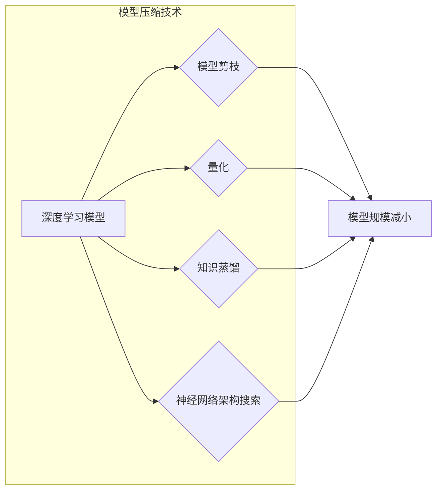

# 模型压缩技术在边缘计算中的应用

> 关键词：模型压缩，边缘计算，深度学习，模型剪枝，量化，知识蒸馏，卷积神经网络，神经网络架构搜索

## 1. 背景介绍

随着深度学习在各个领域的广泛应用，模型的规模和复杂度也在不断提升。然而，大规模的深度学习模型在移动设备、嵌入式设备和边缘设备上的部署却面临着巨大的挑战，主要原因是这些设备通常拥有有限的计算资源和存储空间。为了解决这一问题，模型压缩技术应运而生。模型压缩技术旨在在不显著牺牲模型性能的前提下，减小模型的参数量和计算量，从而使得深度学习模型能够在资源受限的边缘设备上高效运行。

### 1.1 问题的由来

边缘计算作为一种分布式计算架构，将数据处理和计算任务从云端转移到网络边缘，使得数据处理更加快速、高效、安全。然而，边缘设备通常资源有限，无法直接运行大规模的深度学习模型。因此，如何将深度学习模型压缩到适合边缘设备运行的规模，成为了边缘计算领域亟待解决的问题。

### 1.2 研究现状

近年来，模型压缩技术取得了显著的进展，主要包括以下几种方法：

- **模型剪枝**：通过删除模型中的冗余连接，从而减小模型的大小和计算量。
- **量化**：将模型的权重从高精度浮点数转换为低精度整数或二进制数，从而减小模型的大小和计算量。
- **知识蒸馏**：利用大模型的知识来指导小模型的训练，使得小模型能够在保持性能的同时减小规模。
- **神经网络架构搜索**：自动搜索更适合边缘设备运行的模型架构，从而在保证性能的同时减小模型规模。

### 1.3 研究意义

模型压缩技术在边缘计算中的应用具有重要的意义：

- **降低边缘设备的计算和存储成本**：通过减小模型规模，可以减少边缘设备的计算和存储资源消耗，从而降低设备成本。
- **提高边缘设备的运行效率**：压缩后的模型在边缘设备上运行速度更快，可以提高边缘设备的运行效率。
- **增强边缘设备的实时性**：在边缘设备上实时处理数据，可以降低延迟，提高系统的实时性。

## 2. 核心概念与联系

模型压缩技术涉及多个核心概念，以下将介绍这些概念并使用Mermaid流程图展示它们之间的关系。

### 2.1 核心概念原理

- **深度学习模型**：深度学习模型是一种模拟人脑神经元连接结构的计算模型，通过学习大量数据来提取特征和模式。
- **模型剪枝**：模型剪枝是一种通过删除模型中的冗余连接来减小模型规模的方法。
- **量化**：量化是将模型中的浮点数权重转换为低精度整数或二进制数的方法。
- **知识蒸馏**：知识蒸馏是一种将大模型的知识迁移到小模型中的方法。
- **神经网络架构搜索**：神经网络架构搜索是一种自动搜索最适合特定任务的模型架构的方法。

### 2.2 Mermaid 流程图



从流程图中可以看出，模型压缩技术涉及多个步骤，包括深度学习模型、模型剪枝、量化、知识蒸馏和神经网络架构搜索，最终目标是减小模型规模。

## 3. 核心算法原理 & 具体操作步骤

### 3.1 算法原理概述

模型压缩技术主要包括以下几种算法：

- **模型剪枝**：通过分析模型的重要性来选择剪枝的连接。
- **量化**：选择合适的量化方法和量化级别。
- **知识蒸馏**：设计有效的知识蒸馏损失函数。
- **神经网络架构搜索**：选择合适的搜索算法和评估方法。

### 3.2 算法步骤详解

#### 3.2.1 模型剪枝

模型剪枝的步骤如下：

1. **重要性评估**：评估模型中每个连接的重要性，常用的评估方法包括基于权重的L1范数、L2范数或基于梯度的方法。
2. **剪枝决策**：根据重要性评估结果，选择剪枝的连接。
3. **模型重构**：根据剪枝决策重构模型。

#### 3.2.2 量化

量化的步骤如下：

1. **选择量化方法**：选择合适的量化方法，如全量化、逐层量化或逐通道量化。
2. **量化级别**：选择合适的量化级别，如8位或16位。
3. **量化操作**：对模型的权重进行量化操作。

#### 3.2.3 知识蒸馏

知识蒸馏的步骤如下：

1. **目标网络**：选择一个大的预训练模型作为目标网络。
2. **源网络**：选择一个小的模型作为源网络。
3. **知识蒸馏损失**：设计知识蒸馏损失函数，如Softmax交叉熵损失。
4. **训练过程**：使用知识蒸馏损失函数对源网络进行训练。

#### 3.2.4 神经网络架构搜索

神经网络架构搜索的步骤如下：

1. **搜索空间**：定义搜索空间，包括网络的宽度、深度、层结构等。
2. **搜索算法**：选择合适的搜索算法，如强化学习、遗传算法等。
3. **评估方法**：选择合适的评估方法，如基于验证集的评估、基于测试集的评估等。

### 3.3 算法优缺点

#### 3.3.1 模型剪枝

优点：

- 减小模型规模，降低计算和存储需求。
- 维护原始模型结构，保持性能。

缺点：

- 可能导致性能下降。
- 剪枝操作难以解释。

#### 3.3.2 量化

优点：

- 减小模型规模，降低计算和存储需求。
- 提高推理速度。

缺点：

- 可能导致性能下降。
- 量化过程可能导致精度损失。

#### 3.3.3 知识蒸馏

优点：

- 利用大模型的知识来指导小模型的训练，提高小模型的性能。
- 维护原始模型结构，保持性能。

缺点：

- 训练过程复杂，需要大量的计算资源。
- 知识蒸馏效果受目标网络的影响。

#### 3.3.4 神经网络架构搜索

优点：

- 自动搜索最适合特定任务的模型架构。
- 提高模型性能。

缺点：

- 搜索过程复杂，需要大量的计算资源。
- 搜索结果的可解释性较差。

### 3.4 算法应用领域

模型压缩技术在以下领域有广泛的应用：

- **移动设备**：如智能手机、平板电脑等。
- **嵌入式设备**：如智能家居设备、穿戴设备等。
- **边缘设备**：如工业机器人、自动驾驶汽车等。

## 4. 数学模型和公式 & 详细讲解 & 举例说明

### 4.1 数学模型构建

#### 4.1.1 模型剪枝

假设有一个神经网络模型，其中包含 $W$ 个连接，每个连接的权重为 $w_i$，重要性评估函数为 $f_i$，则模型剪枝的目标是最小化以下目标函数：

$$
\min \sum_{i=1}^W f_i(w_i)
$$

#### 4.1.2 量化

假设原始模型中的权重为 $w_i$，量化后的权重为 $q_i$，量化误差为 $e_i$，则量化过程可以表示为：

$$
q_i = \text{Quantize}(w_i)
$$

其中，Quantize为量化函数，可以将浮点数转换为低精度整数或二进制数。

#### 4.1.3 知识蒸馏

假设目标网络的输出为 $\hat{y}$，源网络的输出为 $y$，则知识蒸馏损失函数可以表示为：

$$
L = \sum_{i=1}^C L_{ce}(\hat{y}_i, y_i) + \lambda L_{kl}(y)
$$

其中，$L_{ce}$ 为交叉熵损失函数，$L_{kl}$ 为知识蒸馏损失函数。

#### 4.1.4 神经网络架构搜索

神经网络架构搜索的数学模型较为复杂，涉及到搜索空间定义、搜索算法设计、评估方法选择等。

### 4.2 公式推导过程

#### 4.2.1 模型剪枝

模型剪枝的目标是最小化重要性评估函数的总和，因此可以使用最小化问题的求解方法来求解模型剪枝问题。

#### 4.2.2 量化

量化过程可以通过查找量化表来实现，量化表可以根据量化级别和激活函数的特性来设计。

#### 4.2.3 知识蒸馏

知识蒸馏损失函数由交叉熵损失函数和知识蒸馏损失函数组成，可以使用反向传播算法来优化。

#### 4.2.4 神经网络架构搜索

神经网络架构搜索的数学模型较为复杂，涉及到搜索空间定义、搜索算法设计、评估方法选择等，需要根据具体问题进行设计和优化。

### 4.3 案例分析与讲解

#### 4.3.1 模型剪枝

以一个简单的神经网络模型为例，使用L1范数作为重要性评估函数，进行模型剪枝。

#### 4.3.2 量化

以一个卷积神经网络为例，使用8位量化对模型的权重进行量化。

#### 4.3.3 知识蒸馏

以一个图像分类任务为例，使用知识蒸馏技术将大模型的分类知识迁移到小模型中。

#### 4.3.4 神经网络架构搜索

以一个图像分类任务为例，使用强化学习进行神经网络架构搜索。

## 5. 项目实践：代码实例和详细解释说明

### 5.1 开发环境搭建

以下是一个使用PyTorch框架进行模型压缩的示例：

```bash
pip install torch torchvision
pip install torchsummary
```

### 5.2 源代码详细实现

以下是一个使用PyTorch框架进行模型剪枝的示例：

```python
import torch
import torch.nn as nn
import torch.nn.utils.prune as prune

# 定义一个简单的神经网络模型
class SimpleNet(nn.Module):
    def __init__(self):
        super(SimpleNet, self).__init__()
        self.conv1 = nn.Conv2d(1, 16, kernel_size=3, padding=1)
        self.fc1 = nn.Linear(16 * 28 * 28, 10)

    def forward(self, x):
        x = self.conv1(x)
        x = torch.flatten(x, 1)
        x = self.fc1(x)
        return x

# 创建模型实例
model = SimpleNet()

# 选择要剪枝的层
prune.global_unstructured(model, pruning_method=prune.L1Unstructured)

# 剪枝过程
prune.remove(model, 'conv1.weight')

# 打印剪枝后的模型信息
print(model)
```

### 5.3 代码解读与分析

以上代码展示了如何使用PyTorch框架进行模型剪枝。首先定义了一个简单的神经网络模型，然后使用`prune.global_unstructured`函数选择要剪枝的层，并使用`prune.remove`函数进行剪枝操作。最后，打印剪枝后的模型信息。

### 5.4 运行结果展示

运行上述代码后，可以看到模型中`conv1.weight`连接的权重被剪枝，模型规模减小。

## 6. 实际应用场景

模型压缩技术在以下场景有实际应用：

- **移动设备**：如智能手机、平板电脑等。
- **嵌入式设备**：如智能家居设备、穿戴设备等。
- **边缘设备**：如工业机器人、自动驾驶汽车等。

### 6.1 移动设备

在移动设备上部署深度学习模型，需要考虑以下因素：

- **计算资源**：移动设备的计算资源有限，需要选择计算量较小的模型。
- **存储空间**：移动设备的存储空间有限，需要选择模型规模较小的模型。
- **功耗**：移动设备的功耗有限，需要选择功耗较低的模型。

### 6.2 嵌入式设备

在嵌入式设备上部署深度学习模型，需要考虑以下因素：

- **计算资源**：嵌入式设备的计算资源有限，需要选择计算量较小的模型。
- **存储空间**：嵌入式设备的存储空间有限，需要选择模型规模较小的模型。
- **功耗**：嵌入式设备的功耗有限，需要选择功耗较低的模型。
- **实时性**：嵌入式设备对实时性要求较高，需要选择实时性较好的模型。

### 6.3 边缘设备

在边缘设备上部署深度学习模型，需要考虑以下因素：

- **计算资源**：边缘设备的计算资源有限，需要选择计算量较小的模型。
- **存储空间**：边缘设备的存储空间有限，需要选择模型规模较小的模型。
- **实时性**：边缘设备对实时性要求较高，需要选择实时性较好的模型。
- **可靠性**：边缘设备的可靠性要求较高，需要选择鲁棒性较好的模型。

## 7. 工具和资源推荐

### 7.1 学习资源推荐

以下是一些关于模型压缩技术的学习资源：

- 《深度学习》
- 《神经网络与深度学习》
- 《模型压缩：原理与实践》
- Hugging Face官网
- PyTorch官网

### 7.2 开发工具推荐

以下是一些关于模型压缩技术的开发工具：

- PyTorch
- TensorFlow
- Hugging Face Transformers
- ONNX

### 7.3 相关论文推荐

以下是一些关于模型压缩技术的相关论文：

- "Empirical Evaluation of Model Compression Techniques"
- "Quantization and Training of Neural Networks for Efficient Integer-Arithmetic-Only Inference"
- "Distilling the Knowledge in a Neural Network"

## 8. 总结：未来发展趋势与挑战

### 8.1 研究成果总结

模型压缩技术在边缘计算中的应用取得了显著的进展，主要包括以下成果：

- 开发了多种有效的模型压缩技术，如模型剪枝、量化、知识蒸馏和神经网络架构搜索。
- 这些技术可以显著减小模型的规模和计算量，降低边缘设备的资源消耗。
- 这些技术在多个领域都有实际应用，如移动设备、嵌入式设备和边缘设备。

### 8.2 未来发展趋势

未来模型压缩技术在边缘计算中的应用将呈现以下发展趋势：

- 开发更加高效的模型压缩技术，如自动化的模型压缩方法和在线模型压缩方法。
- 将模型压缩技术与其他边缘计算技术相结合，如分布式计算、云计算等。
- 将模型压缩技术应用于更多领域，如医疗、金融、工业等。

### 8.3 面临的挑战

模型压缩技术在边缘计算中的应用也面临着以下挑战：

- 模型压缩技术可能会牺牲模型性能。
- 模型压缩技术的计算复杂度较高。
- 模型压缩技术的可解释性较差。

### 8.4 研究展望

为了应对模型压缩技术在边缘计算中面临的挑战，未来的研究需要关注以下方向：

- 开发更加高效的模型压缩算法，如基于深度学习的模型压缩算法。
- 提高模型压缩技术的可解释性，如可视化模型压缩过程。
- 将模型压缩技术与其他边缘计算技术相结合，如分布式计算、云计算等。

## 9. 附录：常见问题与解答

**Q1：什么是模型压缩技术？**

A：模型压缩技术是一种通过减小模型的参数量和计算量来降低模型规模的方法，从而使得深度学习模型能够在资源受限的边缘设备上高效运行。

**Q2：模型压缩技术有哪些方法？**

A：模型压缩技术主要包括以下几种方法：模型剪枝、量化、知识蒸馏和神经网络架构搜索。

**Q3：模型压缩技术有哪些优势？**

A：模型压缩技术的主要优势是可以显著减小模型的规模和计算量，从而降低边缘设备的资源消耗。

**Q4：模型压缩技术有哪些应用场景？**

A：模型压缩技术在多个领域都有实际应用，如移动设备、嵌入式设备和边缘设备。

**Q5：模型压缩技术有哪些挑战？**

A：模型压缩技术的挑战包括可能会牺牲模型性能、计算复杂度较高和可解释性较差。

**Q6：如何选择合适的模型压缩方法？**

A：选择合适的模型压缩方法需要根据具体的应用场景和需求进行选择，如对模型性能要求较高的应用可以选择量化方法，对模型规模要求较高的应用可以选择模型剪枝方法。

**Q7：如何评估模型压缩技术的效果？**

A：评估模型压缩技术的效果可以通过比较压缩后的模型与原始模型在性能、计算量和资源消耗等方面的差异来进行。

作者：禅与计算机程序设计艺术 / Zen and the Art of Computer Programming