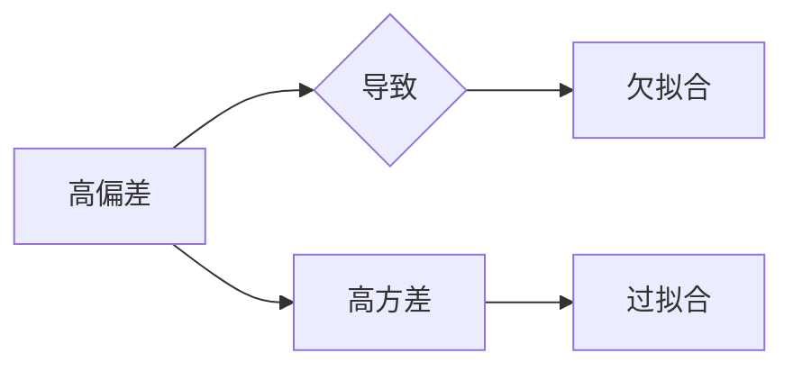

# 欠拟合 (Underfitting)

> 关键词：欠拟合，过拟合，机器学习，模型选择，数据集，特征工程，正则化，偏差方差分解

## 1. 背景介绍

在机器学习领域，欠拟合（Underfitting）是一个常见且重要的概念。它指的是模型过于简单，无法捕捉到训练数据中的复杂模式，导致模型在训练数据上表现不佳，同时在测试集上的泛化能力也较差。本文将深入探讨欠拟合的原因、影响、识别方法以及缓解策略。

## 2. 核心概念与联系

### 2.1 欠拟合的定义

欠拟合是指机器学习模型未能捕捉到训练数据中的足够信息，导致模型在训练数据上拟合不佳的现象。这种情况下，模型可能会在训练数据上表现出高偏差（High Bias）和低方差（Low Variance）。

### 2.2 偏差-方差分解

欠拟合可以用偏差-方差分解（Bias-Variance Decomposition）来解释。偏差是指模型对训练数据的平均误差，方差是指模型预测的变异性。欠拟合通常是由于高偏差导致的，即模型对训练数据的拟合不足。

### 2.3 Mermaid 流程图

以下是一个简化的 Mermaid 流程图，展示了欠拟合的概念和关系：



### 2.4 核心概念联系

欠拟合与过拟合是机器学习中两个相对的概念。欠拟合与高偏差相关，而过拟合与高方差相关。在实际应用中，需要平衡偏差和方差，以获得最佳的模型性能。

## 3. 核心算法原理 & 具体操作步骤

### 3.1 算法原理概述

欠拟合的原理主要与模型复杂度有关。一个简单模型（如线性回归）可能会在训练数据上表现不佳，因为它无法捕捉到数据中的非线性关系。因此，提高模型复杂度通常是解决欠拟合问题的第一步。

### 3.2 算法步骤详解

#### 3.2.1 检测欠拟合

1. 比较训练集和测试集的性能。
2. 如果模型在训练集上表现良好，但在测试集上表现不佳，则可能存在欠拟合问题。

#### 3.2.2 缓解欠拟合

1. 增加模型复杂度：例如，使用非线性模型（如多项式回归、神经网络）。
2. 特征工程：创建新的特征或使用更复杂的特征组合。
3. 使用交叉验证：以更全面的方式评估模型的泛化能力。

### 3.3 算法优缺点

#### 3.3.1 优点

- 简单易行，可以通过增加模型复杂度来解决。
- 可以通过特征工程来改善。

#### 3.3.2 缺点

- 可能会导致过拟合，需要仔细控制模型复杂度。
- 特征工程可能需要大量时间和专业知识。

### 3.4 算法应用领域

欠拟合通常在以下情况下出现：

- 数据集较小，模型复杂度过高。
- 模型无法捕捉到数据的复杂模式。
- 特征工程不足。

## 4. 数学模型和公式 & 详细讲解 & 举例说明

### 4.1 数学模型构建

欠拟合的数学模型可以表示为：

$$
L(\theta) = \sum_{i=1}^{N} (y_i - f(x_i, \theta))^2
$$

其中，$L(\theta)$ 是损失函数，$y_i$ 是真实标签，$f(x_i, \theta)$ 是模型的预测值，$\theta$ 是模型参数。

### 4.2 公式推导过程

欠拟合的损失函数可以通过泰勒展开来近似：

$$
L(\theta) \approx L(\theta_0) + \nabla L(\theta_0)^T (\theta - \theta_0) + \frac{1}{2} (\theta - \theta_0)^T H(\theta_0) (\theta - \theta_0)
$$

其中，$\theta_0$ 是当前的最优参数，$H(\theta_0)$ 是Hessian矩阵。

### 4.3 案例分析与讲解

假设我们使用线性回归模型来拟合以下数据点：

$$
\begin{align*}
x_1 &= 1, & y_1 &= 2 \\
x_2 &= 2, & y_2 &= 4 \\
x_3 &= 3, & y_3 &= 6 \\
\end{align*}
$$

我们可以用以下公式来表示线性回归模型：

$$
f(x, \theta) = \theta_0 + \theta_1 x
$$

通过最小化损失函数，我们可以找到最佳的参数：

$$
\theta_0 = 1, \theta_1 = 2
$$

然而，如果我们使用更复杂的模型，如多项式回归模型：

$$
f(x, \theta) = \theta_0 + \theta_1 x + \theta_2 x^2
$$

我们可以得到更好的拟合效果：

$$
\theta_0 = 1.5, \theta_1 = 1.5, \theta_2 = 1
$$

这表明，增加模型复杂度可以缓解欠拟合问题。

## 5. 项目实践：代码实例和详细解释说明

### 5.1 开发环境搭建

为了进行欠拟合的实践，我们需要搭建以下开发环境：

1. Python 3.7+
2. scikit-learn
3. matplotlib

### 5.2 源代码详细实现

以下是一个简单的欠拟合示例，使用 scikit-learn 的线性回归模型：

```python
import numpy as np
import matplotlib.pyplot as plt
from sklearn.linear_model import LinearRegression
from sklearn.model_selection import train_test_split

# 创建数据
X = np.array([[1], [2], [3]])
y = np.array([2, 4, 6])

# 划分训练集和测试集
X_train, X_test, y_train, y_test = train_test_split(X, y, test_size=0.2, random_state=42)

# 创建线性回归模型
model = LinearRegression()

# 训练模型
model.fit(X_train, y_train)

# 预测测试集
y_pred = model.predict(X_test)

# 绘制结果
plt.scatter(X_test, y_test, label='Actual')
plt.plot(X_test, y_pred, label='Predicted', color='red')
plt.xlabel('x')
plt.ylabel('y')
plt.title('Linear Regression - Underfitting')
plt.legend()
plt.show()
```

### 5.3 代码解读与分析

在这个示例中，我们使用线性回归模型来拟合一个简单的线性关系。由于模型过于简单，它无法很好地拟合数据，导致欠拟合。红色曲线表示模型的预测值，可以看到预测值与实际值之间存在较大的差距。

### 5.4 运行结果展示

运行上述代码，我们可以看到一个明显的欠拟合现象，红色曲线与实际数据点之间的差距较大。

## 6. 实际应用场景

欠拟合在实际应用中很常见，以下是一些常见的场景：

- 使用简单的模型来拟合复杂的非线性数据。
- 特征工程不足，无法提取足够的信息。
- 训练数据集太小，无法充分训练模型。

## 7. 工具和资源推荐

### 7.1 学习资源推荐

- scikit-learn 官方文档：https://scikit-learn.org/stable/
- 机器学习 Yearning：https://zhuanlan.zhihu.com/p/23590395

### 7.2 开发工具推荐

- Jupyter Notebook：https://jupyter.org/
- scikit-learn：https://scikit-learn.org/stable/

### 7.3 相关论文推荐

- "Understanding the Bias-Variance Tradeoff" by Andrew Ng
- "On Overfitting and Regularization" by Trevor Hastie, Robert Tibshirani, and Jerome Friedman

## 8. 总结：未来发展趋势与挑战

### 8.1 研究成果总结

本文深入探讨了欠拟合的概念、原因、影响和缓解策略。通过增加模型复杂度、特征工程和交叉验证等方法，可以有效缓解欠拟合问题。

### 8.2 未来发展趋势

随着机器学习技术的不断发展，未来欠拟合的研究将更加关注以下方面：

- 自动化特征工程
- 增强模型的可解释性
- 降低模型复杂度

### 8.3 面临的挑战

欠拟合的挑战主要包括：

- 如何在增加模型复杂度的同时避免过拟合
- 如何在不牺牲模型性能的情况下降低模型复杂度
- 如何有效地进行特征工程

### 8.4 研究展望

随着研究的深入，欠拟合问题将得到更好的解决，机器学习模型的性能和可解释性将得到进一步提升。

## 9. 附录：常见问题与解答

**Q1：什么是欠拟合？**

A：欠拟合是指模型未能捕捉到训练数据中的足够信息，导致模型在训练数据上拟合不佳的现象。

**Q2：如何检测欠拟合？**

A：可以通过比较模型在训练集和测试集上的性能来检测欠拟合。如果模型在训练集上表现良好，但在测试集上表现不佳，则可能存在欠拟合问题。

**Q3：如何缓解欠拟合？**

A：可以通过增加模型复杂度、特征工程和交叉验证等方法来缓解欠拟合问题。

**Q4：欠拟合和过拟合有什么区别？**

A：欠拟合和过拟合是机器学习中两个相对的概念。欠拟合与高偏差相关，而过拟合与高方差相关。欠拟合的模型无法捕捉到数据的复杂模式，而过拟合的模型则对训练数据的拟合过度，导致泛化能力差。

**Q5：如何选择合适的模型来避免欠拟合和过拟合？**

A：选择合适的模型需要考虑数据集的大小、特征的数量和类型以及任务的复杂性。通常，可以通过交叉验证和模型选择来找到最佳的模型。

---

作者：禅与计算机程序设计艺术 / Zen and the Art of Computer Programming