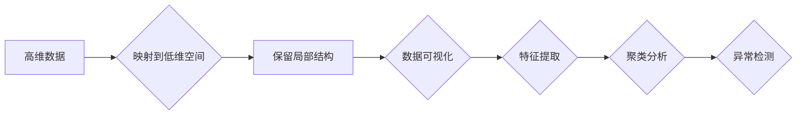

# 流形学习 (Manifold Learning) 原理与代码实例讲解

> 关键词：流形学习，降维，数据可视化，非线性特征提取，非线性映射，主成分分析，等高映射，t-SNE，局部线性嵌入

## 1. 背景介绍

在数据科学和机器学习领域，数据可视化是一个至关重要的步骤。随着数据量的爆炸式增长，如何有效地将高维数据可视化成为了一个挑战。流形学习（Manifold Learning）作为一种降维技术，通过保留数据的局部几何结构，提供了从高维空间到低维空间的映射，使得复杂的数据集变得更容易理解和分析。

### 1.1 问题的由来

高维数据通常具有以下特点：

- **高维度**：数据集可能包含成百上千的特征，直接在三维空间中可视化几乎不可能。
- **复杂性**：高维数据往往具有复杂的非线性结构，难以直观地理解和分析。
- **噪声**：高维数据中可能包含大量的噪声，影响数据的质量和可解释性。

流形学习旨在解决这些问题，通过找到数据中的低维流形结构，将高维数据映射到低维空间，使得数据在新的坐标系下更容易被理解和分析。

### 1.2 研究现状

流形学习的研究可以追溯到20世纪60年代，随着计算能力的提升和算法的改进，流形学习在数据可视化、图像处理、生物信息学等领域得到了广泛应用。常见的流形学习方法包括：

- 主成分分析（PCA）
- 等高映射（Isomap）
- 局部线性嵌入（LLE）
- 高斯过程回归（GPR）
- t-SNE

### 1.3 研究意义

流形学习在以下方面具有重要意义：

- **数据可视化**：将高维数据可视化，便于人类直观地理解和分析。
- **特征提取**：提取数据中的关键特征，简化模型训练过程。
- **聚类分析**：帮助识别数据中的聚类结构，进行更有效的聚类分析。
- **异常检测**：识别数据中的异常点，提高数据质量。

### 1.4 本文结构

本文将分为以下几个部分：

- 核心概念与联系
- 核心算法原理与操作步骤
- 数学模型和公式
- 项目实践：代码实例与详细解释说明
- 实际应用场景
- 工具和资源推荐
- 总结：未来发展趋势与挑战
- 附录：常见问题与解答

## 2. 核心概念与联系

### 2.1 核心概念

- **流形**：在数学中，流形是一个局部欧几里得空间。在数据科学中，流形是指数据集中样本之间的局部几何结构。
- **降维**：降维是指将高维数据映射到低维空间，保留数据的主要特征。
- **非线性映射**：非线性映射是指将数据从高维空间映射到低维空间的函数，该函数不是线性的。

### 2.2 核心概念原理和架构的 Mermaid 流程图



## 3. 核心算法原理 & 具体操作步骤

### 3.1 算法原理概述

流形学习的核心思想是寻找数据集中的低维流形结构，并利用这些结构将数据映射到低维空间。

### 3.2 算法步骤详解

1. **数据预处理**：对数据进行标准化或归一化处理，以确保数据集的每个特征都具有相似的范围和尺度。
2. **选择流形学习方法**：根据数据的特点和需求选择合适的流形学习方法，如PCA、Isomap、LLE等。
3. **训练流形学习方法**：使用训练数据训练选择的流形学习方法，找到数据中的低维流形结构。
4. **映射到低维空间**：将训练好的流形学习方法应用到测试数据上，将数据映射到低维空间。
5. **数据可视化**：使用可视化工具将映射后的低维数据可视化。

### 3.3 算法优缺点

#### 3.3.1 优点

- **保留局部结构**：流形学习方法能够保留数据集中的局部几何结构，使得数据在低维空间中仍然保持相似性。
- **提高可解释性**：通过降维，数据在低维空间中更容易被理解和分析。
- **减少计算复杂度**：将高维数据降维可以减少计算复杂度，提高模型的训练速度。

#### 3.3.2 缺点

- **局部最优**：流形学习方法可能陷入局部最优解，导致无法找到全局最优解。
- **参数选择**：流形学习方法通常需要选择多个参数，如邻域大小、嵌入维度等，参数选择不当可能影响结果。
- **计算复杂度**：一些流形学习方法，如LLE，计算复杂度较高，需要大量的计算资源。

### 3.4 算法应用领域

- **数据可视化**：流形学习方法可以用于将高维数据可视化，例如在聚类、分类、异常检测等任务中。
- **特征提取**：流形学习方法可以用于提取数据中的关键特征，例如在图像识别、语音识别等任务中。
- **聚类分析**：流形学习方法可以用于识别数据中的聚类结构，例如在市场细分、客户细分等任务中。
- **异常检测**：流形学习方法可以用于识别数据中的异常点，例如在欺诈检测、故障检测等任务中。

## 4. 数学模型和公式 & 详细讲解 & 举例说明

### 4.1 数学模型构建

流形学习的数学模型可以表示为：

$$
X \rightarrow f(X) \rightarrow L(X) \rightarrow Y
$$

其中，$X$ 是高维数据，$f(X)$ 是非线性映射，$L(X)$ 是局部线性映射，$Y$ 是低维空间。

### 4.2 公式推导过程

以Isomap算法为例，其核心思想是将高维空间中的点映射到低维空间中，使得相邻点在低维空间中仍然保持相邻。

Isomap算法的公式推导过程如下：

1. 计算数据集中每个点之间的距离矩阵 $D$。
2. 使用K最近邻方法找到每个点在低维空间中的邻居。
3. 使用最小二乘法拟合低维空间中的球面，使得球面上的点对应高维空间中的邻居。

### 4.3 案例分析与讲解

以下是一个使用t-SNE算法进行数据可视化的案例：

```python
import numpy as np
import matplotlib.pyplot as plt
from sklearn import datasets
from sklearn.manifold import TSNE

# 加载鸢尾花数据集
iris = datasets.load_iris()
X = iris.data
y = iris.target

# 使用t-SNE进行降维
tsne = TSNE(n_components=2, random_state=0)
X_tsne = tsne.fit_transform(X)

# 绘制降维后的数据
plt.scatter(X_tsne[:, 0], X_tsne[:, 1], c=y)
plt.xlabel('t-SNE feature 1')
plt.ylabel('t-SNE feature 2')
plt.colorbar()
plt.show()
```

上述代码使用t-SNE算法将鸢尾花数据集降维到二维空间，并绘制了降维后的数据。可以看到，不同种类的鸢尾花在二维空间中仍然保持了一定的聚类结构。

## 5. 项目实践：代码实例和详细解释说明

### 5.1 开发环境搭建

为了进行流形学习实践，我们需要安装以下软件和库：

- Python 3.x
- NumPy
- Matplotlib
- Scikit-learn

可以使用pip安装这些库：

```bash
pip install numpy matplotlib scikit-learn
```

### 5.2 源代码详细实现

以下是一个使用LLE算法进行降维的代码实例：

```python
import numpy as np
from sklearn.manifold import LocallyLinearEmbedding

# 加载鸢尾花数据集
iris = datasets.load_iris()
X = iris.data

# 使用LLE进行降维
lle = LocallyLinearEmbedding(n_neighbors=5, n_components=2, random_state=0)
X_lle = lle.fit_transform(X)

# 绘制降维后的数据
plt.scatter(X_lle[:, 0], X_lle[:, 1])
plt.xlabel('LLE feature 1')
plt.ylabel('LLE feature 2')
plt.show()
```

### 5.3 代码解读与分析

上述代码使用Scikit-learn库中的`LocallyLinearEmbedding`类实现LLE算法。首先，加载鸢尾花数据集，并使用LLE算法将其降维到二维空间。最后，使用Matplotlib绘制降维后的数据。

### 5.4 运行结果展示

运行上述代码后，会得到一个二维散点图，展示了鸢尾花数据集降维后的结构。

## 6. 实际应用场景

流形学习在以下实际应用场景中具有广泛的应用：

- **数据可视化**：将高维数据可视化，例如在聚类、分类、异常检测等任务中。
- **特征提取**：提取数据中的关键特征，例如在图像识别、语音识别等任务中。
- **聚类分析**：识别数据中的聚类结构，例如在市场细分、客户细分等任务中。
- **异常检测**：识别数据中的异常点，例如在欺诈检测、故障检测等任务中。

## 7. 工具和资源推荐

### 7.1 学习资源推荐

- 《Pattern Recognition and Machine Learning》 by Christopher M. Bishop
- 《Dimensionality Reduction: A Data Mining Perspective》 by Ian W. Daniel
- 《Manifold Learning》 by John B. H. Frey and Ian C. Davidson

### 7.2 开发工具推荐

- Python
- NumPy
- Matplotlib
- Scikit-learn
- TensorFlow
- PyTorch

### 7.3 相关论文推荐

- “Isomap” by Joachim von Luxburg
- “Locally Linear Embedding” by Sam T. Roweis and Lawrence K. Saul
- “t-distributed Stochastic Neighbor Embedding” by Laurens van der Maaten and Geoffrey Hinton

## 8. 总结：未来发展趋势与挑战

### 8.1 研究成果总结

流形学习作为一种有效的降维技术，在数据科学和机器学习领域得到了广泛的应用。通过保留数据的局部几何结构，流形学习使得高维数据变得更容易理解和分析。

### 8.2 未来发展趋势

未来，流形学习将朝着以下方向发展：

- **算法改进**：开发更加高效的流形学习算法，降低计算复杂度。
- **模型融合**：将流形学习与其他机器学习算法融合，提高模型性能。
- **多模态数据**：将流形学习应用于多模态数据，如文本、图像、语音等。

### 8.3 面临的挑战

流形学习在以下方面面临着挑战：

- **计算复杂度**：一些流形学习算法的计算复杂度较高，需要大量的计算资源。
- **参数选择**：流形学习方法通常需要选择多个参数，参数选择不当可能影响结果。
- **可解释性**：流形学习模型的决策过程缺乏可解释性，难以理解其内部工作机制。

### 8.4 研究展望

未来，流形学习将在以下方面取得突破：

- **理论上的突破**：深入研究流形学习的理论基础，提高算法的稳定性和鲁棒性。
- **应用领域的拓展**：将流形学习应用于更多领域，如生物信息学、医学、金融等。
- **与其他技术的融合**：将流形学习与其他机器学习技术融合，构建更加强大的模型。

## 9. 附录：常见问题与解答

**Q1：什么是流形学习？**

A：流形学习是一种降维技术，通过找到数据中的低维流形结构，将高维数据映射到低维空间，使得数据在新的坐标系下更容易被理解和分析。

**Q2：流形学习有哪些应用场景？**

A：流形学习在数据可视化、特征提取、聚类分析、异常检测等领域具有广泛的应用。

**Q3：如何选择合适的流形学习方法？**

A：选择合适的流形学习方法需要考虑数据的特点和需求，例如数据规模、数据分布、计算资源等。

**Q4：流形学习的计算复杂度如何？**

A：一些流形学习算法的计算复杂度较高，需要大量的计算资源。

**Q5：流形学习模型的决策过程是否可解释？**

A：流形学习模型的决策过程缺乏可解释性，难以理解其内部工作机制。

作者：禅与计算机程序设计艺术 / Zen and the Art of Computer Programming