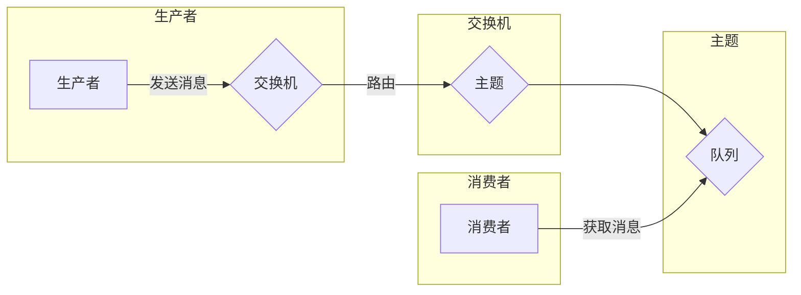

# 消息队列 原理与代码实例讲解

> 关键词：消息队列，分布式系统，异步通信，消息中间件，RabbitMQ，Kafka，ActiveMQ，ZeroMQ

## 1. 背景介绍

在分布式系统中，异步通信是一种常见的解耦机制，它允许系统组件之间不直接调用，而是通过消息传递来交换信息。消息队列作为实现异步通信的核心技术之一，已经广泛应用于各种场景，如微服务架构、实时数据处理、云服务等领域。本文将深入探讨消息队列的原理，并通过代码实例讲解如何在实际项目中应用。

### 1.1 问题的由来

随着互联网和云计算的快速发展，系统的规模和复杂性日益增加。传统的同步调用模式在处理高并发、低延迟的场景时显得力不从心。为了提高系统的可扩展性和容错性，异步通信和消息队列应运而生。

### 1.2 研究现状

目前，市面上流行的消息队列产品有很多，如RabbitMQ、Kafka、ActiveMQ、ZeroMQ等。这些消息队列产品各自具有不同的特点和适用场景。本文将重点介绍RabbitMQ和Kafka，并通过代码实例讲解如何使用它们。

### 1.3 研究意义

了解消息队列的原理和实现，对于开发分布式系统和微服务架构至关重要。掌握消息队列的使用，可以帮助开发者构建高可用、高可靠、可扩展的系统。

## 2. 核心概念与联系

### 2.1 核心概念

- **消息队列**：一种存储消息并允许生产者和消费者异步通信的数据结构。
- **生产者**：发送消息到消息队列的组件。
- **消费者**：从消息队列中获取并处理消息的组件。
- **主题（Topic）**：消息队列中的一个分类，生产者可以将消息发送到主题，消费者可以订阅主题来获取消息。
- **交换机（Exchange）**：连接生产者和主题的组件，用于将消息路由到对应的主题。
- **路由键（Routing Key）**：用于消息路由的标识符，生产者在发送消息时指定路由键，消费者在订阅时指定路由键来匹配消息。

### 2.2 架构图

以下是一个简单的消息队列架构图，展示生产者、消费者、主题、交换机和队列之间的关系。



### 2.3 关系

生产者和消费者通过消息队列进行异步通信，生产者将消息发送到交换机，交换机根据路由键将消息路由到对应的主题，主题将消息存储在队列中，消费者从队列中获取消息进行处理。

## 3. 核心算法原理 & 具体操作步骤

### 3.1 算法原理概述

消息队列的核心算法是消息的持久化和复制。持久化确保了消息不会因为系统故障而丢失，复制则提高了系统的可用性和容错性。

### 3.2 算法步骤详解

1. **消息发送**：生产者将消息和路由键发送到交换机。
2. **消息路由**：交换机根据路由键将消息路由到对应的主题。
3. **消息存储**：主题将消息存储在队列中，可以是内存队列或磁盘队列。
4. **消息获取**：消费者从队列中获取消息进行处理。

### 3.3 算法优缺点

**优点**：

- **解耦**：生产者和消费者之间解耦，降低系统耦合度。
- **异步**：支持异步通信，提高系统响应速度。
- **可靠**：支持消息持久化和复制，确保消息不丢失。
- **可扩展**：支持水平扩展，提高系统吞吐量。

**缺点**：

- **延迟**：消息在队列中可能存在延迟，影响实时性。
- **复杂度**：引入消息队列后，系统架构更加复杂。
- **性能**：消息队列本身也会带来一定的性能开销。

### 3.4 算法应用领域

- **微服务架构**：用于服务之间的异步通信和数据交换。
- **分布式系统**：用于解耦系统组件，提高系统可用性和容错性。
- **实时数据处理**：用于处理高并发、高吞吐量的数据。
- **云服务**：用于构建可扩展的云服务架构。

## 4. 数学模型和公式 & 详细讲解 & 举例说明

### 4.1 数学模型构建

消息队列的数学模型可以通过以下公式表示：

$$
P_t = P_0 + I_t - R_t
$$

其中，$P_t$ 是时间 $t$ 时的生产者消息数量，$P_0$ 是初始消息数量，$I_t$ 是时间 $t$ 内到达的消息数量，$R_t$ 是时间 $t$ 内发送的消息数量。

### 4.2 公式推导过程

- $P_0$ 是初始消息数量，假设为0。
- $I_t$ 是时间 $t$ 内到达的消息数量，假设为 $\Delta I_t$。
- $R_t$ 是时间 $t$ 内发送的消息数量，假设为 $\Delta R_t$。

因此，消息队列的数学模型可以表示为：

$$
P_t = 0 + \Delta I_t - \Delta R_t
$$

即：

$$
P_t = \Delta I_t - \Delta R_t
$$

### 4.3 案例分析与讲解

假设有一个消息队列，初始时队列中没有消息。在接下来的5分钟内，到达了100条消息，同时每分钟处理10条消息。则根据上述公式，5分钟后的消息数量为：

$$
P_5 = 100 - 10 \times 5 = 50
$$

## 5. 项目实践：代码实例和详细解释说明

### 5.1 开发环境搭建

以下是使用RabbitMQ和Kafka进行消息队列实践的开发环境搭建步骤：

1. 安装RabbitMQ和Kafka。
2. 启动RabbitMQ和Kafka服务。
3. 创建RabbitMQ交换机和队列。
4. 创建Kafka主题。

### 5.2 源代码详细实现

以下是一个使用RabbitMQ进行消息队列的简单示例：

**生产者**：

```python
import pika

# 创建连接
connection = pika.BlockingConnection(pika.ConnectionParameters('localhost'))
channel = connection.channel()

# 创建交换机
channel.exchange_declare(exchange='logs', exchange_type='fanout')

# 发送消息
channel.basic_publish(exchange='logs', routing_key='', body='Hello World!')
print(" [x] Sent 'Hello World!'")
connection.close()
```

**消费者**：

```python
import pika

# 创建连接
connection = pika.BlockingConnection(pika.ConnectionParameters('localhost'))
channel = connection.channel()

# 创建队列，并绑定交换机
channel.queue_declare(queue='hello')

# 定义回调函数
def callback(ch, method, properties, body):
    print(" [x] Received %r" % body)

# 设置消息处理回调
channel.basic_consume(queue='hello', on_message_callback=callback, auto_ack=True)

print(' [*] Waiting for messages. To exit press CTRL+C')
channel.start_consuming()
```

### 5.3 代码解读与分析

上述示例中，生产者将消息发送到名为“logs”的交换机，消费者从名为“hello”的队列中获取消息。

- 生产者首先创建连接和通道，然后声明一个名为“logs”的交换机。由于是扇出交换机（fanout），所有发送到该交换机的消息都会被路由到所有绑定的队列。
- 生产者使用`basic_publish`方法发送消息，其中`exchange`参数指定交换机名称，`routing_key`参数为空，表示不指定路由键。
- 消费者首先创建连接和通道，然后声明一个名为“hello”的队列，并将其绑定到交换机。
- 消费者定义了一个回调函数`callback`，用于处理接收到的消息。`auto_ack=True`参数表示在接收到消息后自动确认。
- 消费者使用`basic_consume`方法订阅队列，并开始消费消息。

### 5.4 运行结果展示

运行生产者代码，控制台将输出：

```
 [x] Sent 'Hello World!'
```

运行消费者代码，控制台将输出：

```
 [*] Waiting for messages. To exit press CTRL+C
 [x] Received 'Hello World!'
```

这表明生产者和消费者已经成功通信。

## 6. 实际应用场景

### 6.1 微服务架构

在微服务架构中，各个服务之间通过消息队列进行异步通信，降低服务之间的耦合度，提高系统的可扩展性和容错性。

### 6.2 实时数据处理

在实时数据处理场景中，消息队列可以用于收集和处理海量数据，如日志、传感器数据等。

### 6.3 云服务

在云服务中，消息队列可以用于构建可扩展的架构，提高服务的可用性和容错性。

## 7. 工具和资源推荐

### 7.1 学习资源推荐

- 《RabbitMQ实战》
- 《Kafka权威指南》
- 《分布式系统原理与范型》

### 7.2 开发工具推荐

- RabbitMQ
- Kafka
- ActiveMQ
- ZeroMQ

### 7.3 相关论文推荐

- 《The Design of the Message Passing Interface》
- 《The Akka Actors Model》

## 8. 总结：未来发展趋势与挑战

### 8.1 研究成果总结

本文介绍了消息队列的原理和实现，并通过代码实例讲解了如何使用RabbitMQ和Kafka进行消息队列实践。消息队列是一种有效的异步通信机制，在分布式系统、微服务架构、实时数据处理等领域得到了广泛应用。

### 8.2 未来发展趋势

- **更高性能**：消息队列的性能将进一步提高，以支持更高的并发和吞吐量。
- **更易用**：消息队列的使用将更加简单易用，降低开发门槛。
- **更多特性**：消息队列将集成更多特性，如流处理、事件驱动等。

### 8.3 面临的挑战

- **数据一致性问题**：如何保证消息的一致性是一个挑战。
- **系统稳定性**：如何保证消息队列系统的稳定性是一个挑战。
- **安全性**：如何保证消息队列的安全性和隐私性是一个挑战。

### 8.4 研究展望

- **多协议支持**：支持更多协议，如AMQP、MQTT等。
- **跨语言支持**：支持更多编程语言，提高易用性。
- **云原生**：与云原生技术相结合，提高弹性扩展能力。

## 9. 附录：常见问题与解答

**Q1：消息队列和轮询有什么区别？**

A: 消息队列和轮询是两种不同的异步通信机制。

- **消息队列**：生产者发送消息到队列，消费者从队列中获取消息。消息队列可以保证消息的顺序性和可靠性。
- **轮询**：消费者定期从生产者那里获取消息。轮询无法保证消息的顺序性和可靠性。

**Q2：消息队列如何保证消息的一致性？**

A: 消息队列通常通过以下方式保证消息的一致性：

- **顺序性**：保证消息的发送顺序与接收顺序一致。
- **持久性**：确保消息在发送成功后不会丢失。
- **可靠性**：确保消息被成功消费。

**Q3：消息队列适用于哪些场景？**

A: 消息队列适用于以下场景：

- **高并发、高吞吐量**：如实时数据处理、日志收集等。
- **分布式系统**：如微服务架构、服务解耦等。
- **长连接场景**：如聊天、在线游戏等。

作者：禅与计算机程序设计艺术 / Zen and the Art of Computer Programming