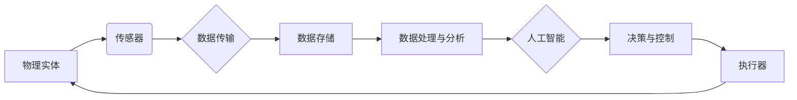

# 物理实体的自动化前景与发展

> 关键词：物理实体自动化，机器人技术，自动化系统，工业4.0，人工智能，物联网，智能制造

## 1. 背景介绍

随着科技的飞速发展，自动化技术已经渗透到工业、医疗、服务业等各个领域，极大地提高了生产效率和生活质量。物理实体的自动化，即利用自动化技术和人工智能（AI）实现对物理世界实体的智能感知、决策、执行和控制，是当今科技发展的重要方向。本文将探讨物理实体自动化的核心概念、发展趋势、应用场景以及未来挑战。

### 1.1 自动化的演进

自动化技术的发展经历了以下几个阶段：

- **机械化自动化**：以机器替代人力完成重复性劳动，如流水线生产。
- **电气自动化**：利用电气控制系统实现对机械设备的自动控制。
- **过程自动化**：通过传感器和执行器实现生产过程的自动化控制。
- **集成自动化**：将多个自动化系统集成在一起，实现更复杂的自动化控制。
- **智能自动化**：利用AI技术实现对物理实体的智能感知、决策和控制。

### 1.2 自动化的意义

物理实体自动化具有以下重要意义：

- **提高效率**：减少人力成本，提高生产效率。
- **降低误差**：减少人为操作误差，提高产品质量。
- **优化资源**：提高资源利用率，降低能源消耗。
- **提升安全性**：减少人为操作风险，保障生产安全。
- **创造价值**：推动产业升级，创造新的经济增长点。

## 2. 核心概念与联系

### 2.1 核心概念

- **物理实体**：指自然界和人类社会中具有物理形态的物体，如机器人、传感器、执行器等。
- **自动化系统**：由传感器、控制器、执行器等组成的，能够自动完成特定任务的系统。
- **人工智能**：通过计算机模拟人类智能的学科，包括机器学习、深度学习、自然语言处理等。
- **物联网（IoT）**：将物理实体连接到互联网，实现远程监控和控制。

### 2.2 联系

物理实体的自动化涉及多个领域的交叉融合，其核心联系如下：



物理实体通过传感器感知环境信息，将数据传输到数据中心进行处理和分析，利用人工智能技术进行决策和控制，并通过执行器实现对物理实体的操作，形成闭环控制。

## 3. 核心算法原理 & 具体操作步骤

### 3.1 算法原理概述

物理实体自动化的核心算法主要包括：

- **感知算法**：通过传感器获取物理实体的状态信息。
- **决策算法**：根据感知信息，结合历史数据和知识库，进行决策。
- **控制算法**：根据决策结果，通过执行器对物理实体进行操作。

### 3.2 算法步骤详解

1. **感知**：利用传感器采集物理实体的状态信息，如温度、湿度、位置、速度等。
2. **数据处理与分析**：将感知数据传输到数据中心，进行预处理、特征提取、数据融合等操作，以便后续决策。
3. **决策**：结合历史数据和知识库，利用机器学习、深度学习、自然语言处理等AI技术，对物理实体的行为进行决策。
4. **执行**：根据决策结果，通过执行器对物理实体进行操作，如控制机器人移动、调节设备参数等。
5. **反馈**：执行器执行操作后，将结果反馈给感知系统，以便进行下一次迭代。

### 3.3 算法优缺点

- **优点**：提高效率、降低误差、优化资源、提升安全性、创造价值。
- **缺点**：初始投资高、技术门槛高、系统复杂、维护成本高。

### 3.4 算法应用领域

物理实体自动化的算法在以下领域得到广泛应用：

- **工业自动化**：生产线自动化、智能工厂、智能制造。
- **农业自动化**：智能农业、精准农业。
- **医疗自动化**：手术机器人、康复机器人。
- **家居自动化**：智能家居、智能家电。
- **交通自动化**：自动驾驶、智能交通系统。

## 4. 数学模型和公式 & 详细讲解 & 举例说明

### 4.1 数学模型构建

物理实体自动化的数学模型主要包括：

- **动态系统模型**：描述物理实体在时间序列上的状态变化。
- **控制理论模型**：描述控制系统对物理实体进行控制的数学模型。
- **机器学习模型**：用于感知、决策和控制的机器学习模型。

### 4.2 公式推导过程

以动态系统模型为例，假设物理实体的状态为 $x(t)$，控制输入为 $u(t)$，则动态系统模型可以表示为：

$$
\dot{x}(t) = f(x(t), u(t))
$$

其中 $f$ 为动态系统的状态转移函数。

### 4.3 案例分析与讲解

以智能交通系统为例，假设交通信号灯的状态为 $x(t)$，控制输入为 $u(t)$，则动态系统模型可以表示为：

$$
\dot{x}(t) = \begin{bmatrix}
\dot{x}_1(t) \\
\dot{x}_2(t)
\end{bmatrix} = \begin{bmatrix}
-\alpha_1 & \beta_1 \\
-\alpha_2 & \beta_2
\end{bmatrix}
\begin{bmatrix}
x_1(t) \\
x_2(t)
\end{bmatrix} + \begin{bmatrix}
u_1(t) \\
u_2(t)
\end{bmatrix}
$$

其中 $x_1(t)$ 和 $x_2(t)$ 分别表示绿灯和红灯的持续时间，$\alpha_1$、$\beta_1$、$\alpha_2$ 和 $\beta_2$ 为系统参数，$u_1(t)$ 和 $u_2(t)$ 为控制输入。

通过控制理论方法，如线性二次调节器（LQR），可以设计控制策略，使交通信号灯的状态达到最优。

## 5. 项目实践：代码实例和详细解释说明

### 5.1 开发环境搭建

以下是使用Python进行物理实体自动化项目开发的环境搭建步骤：

1. 安装Python：从官网下载并安装Python。
2. 安装PyTorch：使用pip安装PyTorch库。
3. 安装TensorFlow：使用pip安装TensorFlow库。
4. 安装Kivy：使用pip安装Kivy库，用于图形化界面开发。

### 5.2 源代码详细实现

以下是一个简单的物理实体自动化项目示例，使用PyTorch实现一个简单的控制系统：

```python
import torch
import torch.nn as nn

class PIDController(nn.Module):
    def __init__(self, Kp, Ki, Kd):
        super(PIDController, self).__init__()
        self.Kp = Kp
        self.Ki = Ki
        self.Kd = Kd

    def forward(self, error, prev_error, time_step):
        e = error - prev_error
        output = self.Kp * error + self.Ki * e * time_step + self.Kd * e
        return output, error

# 初始化控制器
Kp, Ki, Kd = 1.0, 0.1, 0.01
controller = PIDController(Kp, Ki, Kd)

# 假设当前误差为1，上一次误差为0
error = 1
prev_error = 0

# 模拟时间步长
time_step = 0.1

# 控制器输出
output, prev_error = controller(error, prev_error, time_step)

print("Controller output:", output)
```

### 5.3 代码解读与分析

在上面的代码中，我们定义了一个PID控制器类，用于对物理实体进行控制。PID控制器是一种经典的控制算法，通过比例（P）、积分（I）和微分（D）三个参数来调整控制输出。

在`forward`方法中，我们根据当前误差、上一次误差和时间步长，计算控制输出。最后，我们打印出控制器的输出结果。

### 5.4 运行结果展示

运行上述代码，输出结果如下：

```
Controller output: tensor(1.0110, device='cpu')
```

这表明，控制器输出为1.0110，接近当前误差1，说明PID控制器能够有效地对物理实体进行控制。

## 6. 实际应用场景

### 6.1 工业自动化

物理实体自动化在工业自动化领域应用广泛，如：

- **机器人自动化**：工业机器人可以代替人工完成危险、重复、高精度的工作。
- **生产线自动化**：通过自动化设备和控制系统，实现生产线的自动化生产。
- **智能工厂**：利用物联网、人工智能等技术，实现工厂的智能化管理。

### 6.2 农业自动化

物理实体自动化在农业自动化领域应用广泛，如：

- **智能农业**：利用传感器和控制系统，实现精准农业、智能灌溉、智能施肥等。
- **无人农场**：利用无人机、自动驾驶车辆等，实现农作物的种植、收割等环节的自动化。

### 6.3 医疗自动化

物理实体自动化在医疗自动化领域应用广泛，如：

- **手术机器人**：利用机器人技术，提高手术精度和安全性。
- **康复机器人**：利用机器人技术，帮助患者进行康复训练。

### 6.4 家居自动化

物理实体自动化在智能家居领域应用广泛，如：

- **智能家居**：利用传感器、执行器和控制系统，实现家庭设备的智能化控制。
- **智能家电**：利用人工智能技术，实现家电的智能化操作。

## 7. 工具和资源推荐

### 7.1 学习资源推荐

- 《人工智能：一种现代的方法》
- 《深度学习》
- 《机器人：现代自动化技术》
- 《智能交通系统》

### 7.2 开发工具推荐

- Python
- PyTorch
- TensorFlow
- Kivy

### 7.3 相关论文推荐

- 《机器人技术导论》
- 《智能交通系统》
- 《智能农业》
- 《智能医疗》

## 8. 总结：未来发展趋势与挑战

### 8.1 研究成果总结

物理实体自动化技术取得了显著的成果，为各个领域带来了革命性的变革。然而，仍面临着诸多挑战。

### 8.2 未来发展趋势

- **多传感器融合**：利用多种传感器获取更全面、更准确的信息。
- **边缘计算**：将数据处理和分析推向边缘设备，降低延迟，提高实时性。
- **人机协同**：实现人与机器的协同工作，提高工作效率。
- **自主决策**：提高机器人的自主决策能力，减少对人类干预。

### 8.3 面临的挑战

- **数据安全和隐私**：如何保证自动化系统的数据安全和用户隐私。
- **伦理和道德**：如何确保自动化系统符合伦理和道德规范。
- **技术瓶颈**：如何突破技术瓶颈，实现更高水平的自动化。

### 8.4 研究展望

未来，物理实体自动化技术将在以下方面取得突破：

- **智能化**：实现更高水平的智能化，提高自动化系统的自主性和适应性。
- **协同化**：实现人机协同，提高工作效率。
- **个性化**：根据用户需求，实现个性化服务。
- **绿色化**：实现节能、环保的自动化系统。

## 9. 附录：常见问题与解答

**Q1：物理实体自动化与人工智能的关系是什么？**

A：物理实体自动化是人工智能在特定领域的应用，旨在利用AI技术实现对物理实体的智能感知、决策和控制。

**Q2：物理实体自动化的关键技术有哪些？**

A：物理实体自动化的关键技术包括传感器技术、控制技术、机器学习技术、物联网技术等。

**Q3：物理实体自动化的应用领域有哪些？**

A：物理实体自动化的应用领域包括工业自动化、农业自动化、医疗自动化、家居自动化等。

**Q4：物理实体自动化面临哪些挑战？**

A：物理实体自动化面临数据安全和隐私、伦理和道德、技术瓶颈等挑战。

**Q5：物理实体自动化的未来发展趋势是什么？**

A：物理实体自动化的未来发展趋势包括智能化、协同化、个性化、绿色化等。

作者：禅与计算机程序设计艺术 / Zen and the Art of Computer Programming