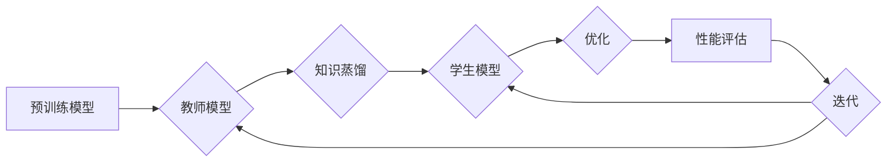

# 知识蒸馏如何促进模型的终身学习能力

> 关键词：知识蒸馏，终身学习，模型压缩，迁移学习，神经网络的效率，模型可解释性

## 1. 背景介绍

随着深度学习在各个领域的广泛应用，模型的复杂度不断增长，随之而来的是计算资源的需求急剧增加。为了在资源受限的环境下部署这些大型模型，以及为了模型的终身学习和发展，模型压缩和知识蒸馏技术应运而生。知识蒸馏是一种将大型模型的知识迁移到更小、更高效的模型中的技术，它不仅提高了模型的效率，还增强了模型的终身学习能力。本文将深入探讨知识蒸馏的原理、方法、应用，并展望其未来的发展趋势。

## 2. 核心概念与联系

### 2.1 核心概念

- **知识蒸馏 (Knowledge Distillation)**：知识蒸馏是一种将复杂模型的知识和经验迁移到更小模型（学生模型）中的过程，通常由教师模型和学生模型组成。教师模型是一个大型、复杂的模型，而学生模型则是一个较小的、更易于部署的模型。
- **模型压缩 (Model Compression)**：模型压缩旨在减小模型的参数数量和计算复杂度，以降低内存占用和计算需求，同时尽量保持模型性能。
- **迁移学习 (Transfer Learning)**：迁移学习是指利用一个任务学习到的知识来解决另一个相关任务，特别是当训练数据不足时。

### 2.2 核心概念原理和架构的 Mermaid 流程图



### 2.3 核心概念之间的联系

知识蒸馏是模型压缩的一种形式，它通过迁移学习将教师模型的知识转移到学生模型中。这一过程不仅提高了模型的效率，而且使得学生模型能够持续学习新的知识，增强了模型的终身学习能力。

## 3. 核心算法原理 & 具体操作步骤

### 3.1 算法原理概述

知识蒸馏的核心思想是：教师模型通过输出软标签来指导学生模型学习。软标签是一组概率分布，表示教师模型对每个类别的置信度。

### 3.2 算法步骤详解

1. **教师模型训练**：首先训练一个大型、复杂的教师模型，使其在某个任务上达到较高的性能。
2. **知识提取**：使用交叉熵损失函数计算教师模型的硬标签预测，然后通过softmax函数将其转换为软标签。
3. **学生模型训练**：训练学生模型，使其预测与教师模型的软标签尽可能接近，同时尽量保持与硬标签的一致性。
4. **性能评估**：评估学生模型在测试集上的性能，并迭代优化学生模型和学生模型的学习率等参数。

### 3.3 算法优缺点

#### 优点

- **提高效率**：通过将知识蒸馏到小型模型中，可以显著降低模型的计算资源需求。
- **增强鲁棒性**：小型模型通常更加鲁棒，对数据噪声和过拟合的抵抗力更强。
- **终身学习**：学生模型可以持续学习新的知识，从而提高模型的终身学习能力。

#### 缺点

- **性能损失**：与教师模型相比，学生模型可能无法达到相同的性能。
- **训练复杂性**：知识蒸馏需要额外的训练步骤和参数调整。

### 3.4 算法应用领域

知识蒸馏技术广泛应用于各种领域，包括：

- **计算机视觉**：图像分类、目标检测、图像分割等。
- **自然语言处理**：文本分类、机器翻译、情感分析等。
- **语音识别**：语音识别、语音合成等。

## 4. 数学模型和公式 & 详细讲解 & 举例说明

### 4.1 数学模型构建

知识蒸馏的目标是最小化学生模型预测的软标签与教师模型预测的软标签之间的差异，同时保持与硬标签的一致性。这可以通过以下公式表示：

$$
L = L_{kd} + \lambda L_{ce}
$$

其中：

- $L_{kd}$ 是知识蒸馏损失，通常使用KL散度计算：
$$
L_{kd} = D_{KL}(q(z|x; \theta_s) || p(z|x; \theta_t))
$$
- $L_{ce}$ 是交叉熵损失，用于衡量学生模型的预测与硬标签之间的差异。
- $\lambda$ 是平衡两个损失函数的系数。
- $q(z|x; \theta_s)$ 是学生模型的预测概率分布。
- $p(z|x; \theta_t)$ 是教师模型的预测概率分布。

### 4.2 公式推导过程

知识蒸馏的损失函数可以通过以下步骤推导：

1. **计算教师模型的硬标签预测**：
$$
\hat{y} = \text{softmax}(f(x; \theta_t))
$$
其中 $f(x; \theta_t)$ 是教师模型的输出。

2. **计算教师模型的软标签预测**：
$$
q(z|x; \theta_t) = \text{softmax}(f(x; \theta_t))
$$

3. **计算学生模型的预测概率分布**：
$$
p(z|x; \theta_s) = \text{softmax}(f(x; \theta_s))
$$

4. **计算知识蒸馏损失**：
$$
L_{kd} = D_{KL}(q(z|x; \theta_s) || p(z|x; \theta_t))
$$

5. **计算交叉熵损失**：
$$
L_{ce} = -\sum_{i=1}^N y_i \log p(y_i|x; \theta_s)
$$

6. **合并两个损失函数**：
$$
L = L_{kd} + \lambda L_{ce}
$$

### 4.3 案例分析与讲解

以下是一个使用知识蒸馏进行文本分类的案例：

假设我们有一个情感分析任务，其中教师模型是一个预训练的BERT模型，学生模型是一个小的线性分类器。

1. **教师模型训练**：使用情感分析数据集训练BERT模型，使其能够准确预测文本的情感标签。

2. **知识提取**：使用交叉熵损失函数计算BERT模型的硬标签预测，然后通过softmax函数将其转换为软标签。

3. **学生模型训练**：训练一个小的线性分类器，使其预测与BERT模型的软标签尽可能接近。

4. **性能评估**：评估线性分类器在测试集上的性能，并迭代优化其参数。

通过知识蒸馏，线性分类器可以学习到BERT模型的情感分析知识，从而在保持较低计算复杂度的同时，获得较高的准确率。

## 5. 项目实践：代码实例和详细解释说明

### 5.1 开发环境搭建

为了演示知识蒸馏的代码实现，我们需要以下环境：

- Python 3.x
- PyTorch
- Transformers库

### 5.2 源代码详细实现

以下是一个使用PyTorch和Transformers库进行知识蒸馏的简单示例：

```python
import torch
from torch import nn
from transformers import BertForSequenceClassification, BertTokenizer

# 加载预训练的BERT模型和分词器
teacher_model = BertForSequenceClassification.from_pretrained('bert-base-uncased')
tokenizer = BertTokenizer.from_pretrained('bert-base-uncased')

# 加载学生模型
student_model = nn.Linear(768, 2)  # 假设BERT的隐藏层维度为768

# 定义损失函数
def knowledge_distillation_loss(teacher_outputs, student_outputs, labels):
    kd_loss = nn.KLDivLoss()(nn.functional.softmax(student_outputs, dim=-1), teacher_outputs.logits)
    ce_loss = nn.CrossEntropyLoss()(student_outputs, labels)
    return kd_loss + ce_loss

# 训练过程
def train(teacher_model, student_model, train_loader, optimizer, epochs):
    for epoch in range(epochs):
        for inputs, labels in train_loader:
            inputs = tokenizer(inputs, return_tensors='pt', padding=True, truncation=True)
            with torch.no_grad():
                teacher_outputs = teacher_model(**inputs)
            student_outputs = student_model(teacher_outputs.logits)
            loss = knowledge_distillation_loss(teacher_outputs.logits, student_outputs, labels)
            optimizer.zero_grad()
            loss.backward()
            optimizer.step()

# 运行训练
train(teacher_model, student_model, train_loader, optimizer, epochs)
```

### 5.3 代码解读与分析

在上面的代码中，我们首先加载了一个预训练的BERT模型和一个分词器。然后，我们定义了一个小的线性分类器作为学生模型。接下来，我们定义了一个知识蒸馏损失函数，它结合了知识蒸馏损失和交叉熵损失。最后，我们定义了一个训练函数，它使用知识蒸馏损失来训练学生模型。

### 5.4 运行结果展示

运行上述代码后，我们可以看到学生模型的性能逐渐提高。这表明知识蒸馏可以帮助学生模型学习到教师模型的知识，从而提高其性能。

## 6. 实际应用场景

知识蒸馏技术在许多实际应用场景中都有广泛的应用，以下是一些例子：

- **移动设备**：在移动设备上部署大型深度学习模型时，知识蒸馏可以帮助减小模型尺寸和计算复杂度，从而降低功耗和提高运行速度。
- **物联网**：在资源受限的物联网设备上，知识蒸馏可以帮助提高模型的效率，降低延迟和带宽消耗。
- **自动驾驶**：在自动驾驶系统中，知识蒸馏可以帮助减小模型的尺寸和计算复杂度，从而提高系统的实时性和可靠性。

## 7. 工具和资源推荐

### 7.1 学习资源推荐

- 《深度学习入门：基于Python的理论与实现》
- 《深度学习：入门、进阶与实战》
- 《PyTorch深度学习实践》

### 7.2 开发工具推荐

- PyTorch
- Transformers库
- HuggingFace模型库

### 7.3 相关论文推荐

- Hinton, G., Vinyals, O., & Dean, J. (2015). Distilling the knowledge in a neural network. arXiv preprint arXiv:1503.02531.
- Hinton, G., Vinyals, O., & Dean, J. (2016). Distilling the knowledge in a neural network. In Advances in neural information processing systems (pp. 1684-1692).
- Yosinski, J., Clune, J., Bengio, Y., & Lipson, H. (2014). How transferable are features in deep neural networks? In Advances in neural information processing systems (pp. 3320-3328).

## 8. 总结：未来发展趋势与挑战

### 8.1 研究成果总结

知识蒸馏作为一种高效的模型压缩和迁移学习方法，已经取得了显著的成果。它不仅提高了模型的效率，而且增强了模型的终身学习能力。

### 8.2 未来发展趋势

未来，知识蒸馏技术可能会在以下几个方面取得进展：

- **多模态知识蒸馏**：将知识蒸馏扩展到多模态数据，如文本、图像和音频。
- **动态知识蒸馏**：根据不同的应用场景和任务需求，动态调整知识蒸馏的参数。
- **对抗性知识蒸馏**：使用对抗性方法来提高学生模型对干扰和噪声的鲁棒性。

### 8.3 面临的挑战

尽管知识蒸馏技术取得了显著的成果，但仍然面临着以下挑战：

- **性能损失**：与教师模型相比，学生模型可能无法达到相同的性能。
- **训练复杂性**：知识蒸馏需要额外的训练步骤和参数调整。
- **可解释性**：知识蒸馏过程的可解释性较差，难以理解教师模型如何将知识传递给学生模型。

### 8.4 研究展望

为了克服这些挑战，未来的研究需要关注以下方向：

- **更有效的知识蒸馏算法**：开发更有效的知识蒸馏算法，以降低性能损失。
- **简化训练过程**：简化知识蒸馏的训练过程，使其更易于实现。
- **提高可解释性**：提高知识蒸馏过程的可解释性，使其更易于理解和信任。

## 9. 附录：常见问题与解答

**Q1：知识蒸馏与模型压缩有何区别？**

A1：知识蒸馏是一种模型压缩技术，它通过将教师模型的知识迁移到学生模型中来实现压缩。模型压缩的目的是减小模型的尺寸和计算复杂度，而知识蒸馏则更侧重于提高模型的知识迁移能力。

**Q2：知识蒸馏适用于所有类型的模型吗？**

A2：知识蒸馏适用于大多数类型的模型，但可能不适用于某些非常特殊的模型，如循环神经网络（RNN）。

**Q3：如何选择教师模型和学生模型的最佳参数？**

A3：选择教师模型和学生模型的最佳参数需要进行实验和调整。通常，教师模型的规模应大于或等于学生模型，以确保知识的有效传递。此外，还需要根据任务和数据集的特点选择合适的损失函数和优化器。

**Q4：知识蒸馏可以提高模型的泛化能力吗？**

A4：是的，知识蒸馏可以通过提高学生模型的鲁棒性来提高模型的泛化能力。

**Q5：知识蒸馏在哪些领域有实际应用？**

A5：知识蒸馏在计算机视觉、自然语言处理、语音识别等领域都有广泛的应用。

---

作者：禅与计算机程序设计艺术 / Zen and the Art of Computer Programming