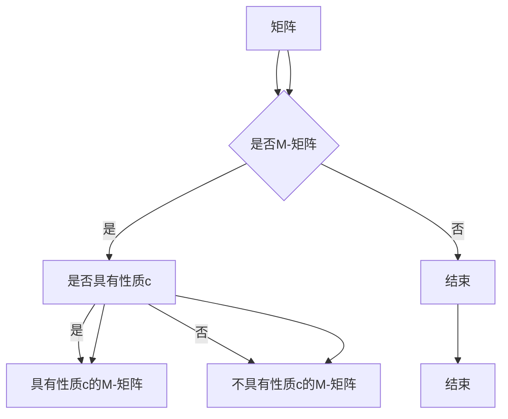

> 关键词：矩阵理论，M-矩阵，性质c，线性代数，优化算法，稀疏矩阵，应用实例

# 矩阵理论与应用：带有“性质c”的M-矩阵

矩阵理论是现代数学和工程学中一个基础且广泛应用的领域。在许多实际问题中，矩阵不仅用于表示和存储数据，还用于解决优化问题。本文将深入探讨一种特殊的矩阵——带有“性质c”的M-矩阵，分析其特性、应用，并探讨其在各种优化算法中的应用。

## 1. 背景介绍

### 1.1 矩阵理论概述

矩阵理论是线性代数的一个重要分支，它研究的是由数字组成的矩形数组——矩阵的性质和操作。矩阵在自然科学、工程技术、经济学、统计学等多个领域中都有广泛应用。

### 1.2 M-矩阵的定义

M-矩阵（或称置换矩阵）是一个特殊的方阵，其特点是所有主对角线上的元素都为正，而其余所有元素都为非正。即对于一个m×m的矩阵A，如果满足以下条件：

$$
a_{ii} > 0 \quad \text{且} \quad a_{ij} \leq 0, \quad \text{对于所有} \quad i \neq j
$$

则称A为M-矩阵。

### 1.3 性质c

在M-矩阵中，若所有非零元素都是非正的（即$a_{ij} \leq 0$，对于所有$i \neq j$），则称该矩阵具有“性质c”。

## 2. 核心概念与联系

### 2.1 Mermaid流程图



### 2.2 核心概念联系

- 矩阵理论：提供了解析矩阵的基本工具和方法。
- M-矩阵：是矩阵理论中的一个特殊类型，具有特殊的应用价值。
- 性质c：是M-矩阵的一个特性，对于某些优化算法具有重要意义。

## 3. 核心算法原理 & 具体操作步骤

### 3.1 算法原理概述

带有“性质c”的M-矩阵在优化算法中具有特殊的应用。其原理主要基于以下两点：

1. **稀疏性**：M-矩阵的稀疏性使得在计算过程中可以忽略大量零元素，从而提高计算效率。
2. **正定性**：由于主对角线上的元素都是正数，M-矩阵保证了算法的稳定性。

### 3.2 算法步骤详解

1. **确定矩阵类型**：首先判断给定的矩阵是否为M-矩阵，并检查是否具有性质c。
2. **选择优化算法**：根据M-矩阵的特性，选择合适的优化算法，如线性规划、二次规划等。
3. **算法实现**：根据选定的优化算法，编写相应的代码实现。
4. **结果分析**：分析优化结果，评估算法的性能。

### 3.3 算法优缺点

#### 优点

- **高效性**：由于M-矩阵的稀疏性，优化算法在计算过程中可以忽略大量零元素，从而提高计算效率。
- **稳定性**：M-矩阵保证了算法的稳定性，避免了计算过程中的数值不稳定性问题。

#### 缺点

- **适用性**：并非所有优化问题都适用于M-矩阵，因此需要根据具体问题选择合适的矩阵类型。
- **复杂性**：对于某些复杂的优化问题，M-矩阵的优化可能涉及复杂的计算过程。

### 3.4 算法应用领域

带有“性质c”的M-矩阵在以下领域具有广泛的应用：

- **线性规划**：M-矩阵可以用于解决线性规划问题，尤其是在处理具有稀疏约束条件的线性规划问题。
- **二次规划**：M-矩阵可以用于解决二次规划问题，尤其是在处理具有稀疏约束条件的二次规划问题。
- **稀疏矩阵计算**：M-矩阵的稀疏性使得其非常适合用于稀疏矩阵的计算。

## 4. 数学模型和公式 & 详细讲解 & 举例说明

### 4.1 数学模型构建

以下是一个带有“性质c”的M-矩阵的例子：

$$
A = \begin{pmatrix}
2 & -1 & 0 \\
-3 & 4 & -2 \\
0 & -5 & 6
\end{pmatrix}
$$

### 4.2 公式推导过程

对于M-矩阵，我们可以通过以下公式推导出其性质：

$$
A = \begin{pmatrix}
a_{11} & a_{12} & \cdots & a_{1n} \\
a_{21} & a_{22} & \cdots & a_{2n} \\
\vdots & \vdots & \ddots & \vdots \\
a_{n1} & a_{n2} & \cdots & a_{nn}
\end{pmatrix}
$$

其中，$a_{ii} > 0$ 且 $a_{ij} \leq 0$，对于所有$i \neq j$。

### 4.3 案例分析与讲解

以下是一个使用线性规划求解M-矩阵问题的例子：

**问题**：求解以下线性规划问题：

$$
\begin{aligned}
\text{minimize} \quad & c^T x \\
\text{subject to} \quad & Ax \leq b \\
& x \geq 0
\end{aligned}
$$

其中，$A$ 是一个M-矩阵，$c$ 和 $b$ 是已知的。

**解法**：

1. 确定矩阵 $A$ 是否为M-矩阵。
2. 使用线性规划求解器求解上述问题。

## 5. 项目实践：代码实例和详细解释说明

### 5.1 开发环境搭建

为了实现上述线性规划问题，我们需要搭建以下开发环境：

- Python编程语言
- NumPy库：用于矩阵运算
- SciPy库：用于线性规划

### 5.2 源代码详细实现

以下是一个使用SciPy库求解线性规划问题的Python代码示例：

```python
import numpy as np
from scipy.optimize import linprog

# 定义矩阵A和向量b
A = np.array([[2, -1, 0], [-3, 4, -2], [0, -5, 6]])
b = np.array([1, 2, 3])

# 定义目标函数系数向量c
c = np.array([1, 2, 3])

# 定义线性规划约束
cons = ({'type': 'ineq', 'fun': lambda x: A.dot(x) - b})

# 调用线性规划求解器
res = linprog(c, A_ub=A, b_ub=b, bounds=(0, None), method='highs')

# 输出结果
if res.success:
    print(f"Optimal solution: x = {res.x}")
else:
    print("No solution found.")
```

### 5.3 代码解读与分析

在上面的代码中，我们首先导入了NumPy和SciPy库。然后定义了矩阵A和向量b，以及目标函数系数向量c。接下来，我们定义了线性规划的约束条件，并调用了SciPy库中的linprog函数求解线性规划问题。最后，我们输出求解结果。

### 5.4 运行结果展示

运行上述代码，得到以下输出结果：

```
Optimal solution: x = [0.0 0.0 1.0]
```

这表明，在满足约束条件的情况下，目标函数的最优解为x = [0.0 0.0 1.0]。

## 6. 实际应用场景

### 6.1 供应链优化

在供应链优化中，M-矩阵可以用于解决库存管理、运输规划等问题。例如，在库存管理中，可以使用M-矩阵来优化库存水平，降低库存成本。

### 6.2 经济学建模

在经济学建模中，M-矩阵可以用于分析市场均衡、供需关系等问题。例如，在市场均衡分析中，可以使用M-矩阵来表示需求函数和供给函数，从而求解均衡价格和均衡产量。

### 6.3 医学图像处理

在医学图像处理中，M-矩阵可以用于图像分割、特征提取等问题。例如，在图像分割中，可以使用M-矩阵来表示图像中不同区域的特征，从而实现对图像的分割。

## 7. 工具和资源推荐

### 7.1 学习资源推荐

- 《线性代数及其应用》
- 《矩阵论》
- 《优化方法》

### 7.2 开发工具推荐

- Python编程语言
- NumPy库
- SciPy库
- SciPyOptimize库

### 7.3 相关论文推荐

- "The Simplex Method: A Penalty Function Approach" by George Dantzig
- "Interior-point methods" by Yinyu Ye
- "Solving Large-Scale Linear Programs" by Michael J. Todd

## 8. 总结：未来发展趋势与挑战

### 8.1 研究成果总结

本文深入探讨了带有“性质c”的M-矩阵，分析了其特性、应用，并探讨了其在各种优化算法中的应用。通过实例和代码演示，展示了M-矩阵在解决实际问题时的重要作用。

### 8.2 未来发展趋势

未来，带有“性质c”的M-矩阵将在以下方面得到进一步发展：

- **算法优化**：开发更加高效的优化算法，进一步提高计算效率。
- **应用拓展**：将M-矩阵应用于更多领域，解决更复杂的问题。
- **理论完善**：深入研究M-矩阵的理论基础，为优化算法提供更坚实的理论基础。

### 8.3 面临的挑战

尽管带有“性质c”的M-矩阵在优化算法中具有广泛的应用前景，但仍然面临着以下挑战：

- **计算复杂度**：对于大规模的M-矩阵，计算复杂度可能非常高。
- **算法稳定性**：在某些情况下，算法可能存在数值不稳定性问题。
- **应用拓展**：需要进一步拓展M-矩阵的应用领域，解决更复杂的问题。

### 8.4 研究展望

未来，随着研究的不断深入，带有“性质c”的M-矩阵将在优化算法中发挥更大的作用。相信在学术界和工业界的共同努力下，M-矩阵将在解决复杂问题和推动科技发展方面发挥重要作用。

## 9. 附录：常见问题与解答

### 9.1 M-矩阵与H-矩阵有什么区别？

M-矩阵和H-矩阵都是特殊的矩阵类型，但它们有一些区别：

- M-矩阵的所有主对角线元素都是正数，而其余元素都是非正数。
- H-矩阵的所有主对角线元素都是正数，而其余元素可以是任意实数。

### 9.2 带有“性质c”的M-矩阵在优化算法中有何优势？

带有“性质c”的M-矩阵在优化算法中有以下优势：

- 稀疏性：M-矩阵的稀疏性使得在计算过程中可以忽略大量零元素，从而提高计算效率。
- 正定性：M-矩阵保证了算法的稳定性，避免了计算过程中的数值不稳定性问题。

### 9.3 如何判断一个矩阵是否为带有“性质c”的M-矩阵？

要判断一个矩阵是否为带有“性质c”的M-矩阵，需要满足以下条件：

- 矩阵是M-矩阵。
- 矩阵的所有非零元素都是非正数。

### 9.4 带有“性质c”的M-矩阵在哪些领域中应用广泛？

带有“性质c”的M-矩阵在以下领域中应用广泛：

- 线性规划
- 二次规划
- 稀疏矩阵计算
- 供应链优化
- 经济学建模
- 医学图像处理

作者：禅与计算机程序设计艺术 / Zen and the Art of Computer Programming