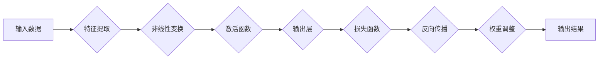

> 神经网络，深度学习，机器学习，人工智能，计算机视觉，自然语言处理

# 神经网络：推动社会进步的力量

> 关键词：
> 神经网络，深度学习，机器学习，人工智能，计算机视觉，自然语言处理

## 1. 背景介绍

### 1.1 问题的由来

自20世纪50年代以来，人工智能（Artificial Intelligence, AI）领域经历了多次起伏。早期的符号主义和知识工程方法虽然为AI领域奠定了基础，但在处理复杂任务时却显得力不从心。随着计算能力的提升和大数据的涌现，20世纪80年代末至90年代初，以神经网络为代表的连接主义（Connectionism）兴起，为AI领域带来了新的活力。

### 1.2 研究现状

近年来，神经网络在图像识别、语音识别、自然语言处理等领域取得了突破性进展，成为推动AI发展的核心力量。深度学习（Deep Learning, DL）作为神经网络的一种重要实现方式，通过构建多层的神经网络模型，实现了从原始数据到高维抽象表示的转换，极大地提升了AI系统的性能。

### 1.3 研究意义

神经网络的研究对于推动社会进步具有重要意义：

- **提升效率**：神经网络在图像识别、语音识别等领域的应用，提高了生产效率和自动化水平。
- **创新应用**：神经网络为AI领域带来了新的研究方向和应用场景，如自动驾驶、机器人、智能医疗等。
- **促进发展**：神经网络的发展推动了相关产业链的发展，创造了新的就业机会。

### 1.4 本文结构

本文将围绕神经网络展开，从核心概念、算法原理、实践应用等方面进行深入探讨。具体结构如下：

- 第2部分：介绍神经网络的核心理念和核心算法。
- 第3部分：详细讲解神经网络的具体操作步骤和常见优化策略。
- 第4部分：分析神经网络的数学模型和公式，并结合实例进行讲解。
- 第5部分：通过项目实践，展示神经网络的实际应用案例。
- 第6部分：探讨神经网络在不同领域的应用场景及未来发展趋势。
- 第7部分：推荐神经网络相关的学习资源、开发工具和参考文献。
- 第8部分：总结神经网络的未来发展趋势与挑战。

## 2. 核心概念与联系

### 2.1 核心理念

神经网络是一种模拟人脑神经元结构和功能的计算模型。它通过大量的神经元连接形成网络，通过学习和调整连接权重来实现数据的处理和决策。

### 2.2 核心算法

神经网络的核心理念可以通过以下Mermaid流程图表示：



### 2.3 联系

- **特征提取**：通过神经网络的前馈网络结构，将原始数据转换为适合后续处理的特征表示。
- **非线性变换**：通过激活函数引入非线性，使得神经网络能够学习复杂的非线性关系。
- **输出层**：根据输出层的激活函数和结构，实现不同类型的输出，如分类、回归等。
- **损失函数**：用于衡量模型预测值与真实值之间的差异，是反向传播算法的依据。
- **反向传播**：通过计算损失函数对网络参数的梯度，更新网络权重，优化模型性能。
- **权重调整**：根据反向传播计算得到的梯度，调整网络权重，使模型逐渐逼近真实值。

## 3. 核心算法原理 & 具体操作步骤

### 3.1 算法原理概述

神经网络通过模拟人脑神经元结构和功能，通过学习大量数据中的特征和规律，实现对输入数据的分类、回归、生成等任务。

### 3.2 算法步骤详解

神经网络的算法步骤主要包括：

1. **数据预处理**：对原始数据进行清洗、归一化等处理，使其符合神经网络输入的要求。
2. **网络构建**：根据任务需求，设计合适的网络结构，包括层数、神经元数量、激活函数等。
3. **初始化权重**：随机初始化网络权重，为后续训练做准备。
4. **前向传播**：将预处理后的数据输入网络，计算每一层的输出结果。
5. **计算损失**：使用损失函数计算预测值与真实值之间的差异。
6. **反向传播**：根据损失函数对网络参数的梯度，更新网络权重。
7. **权重调整**：根据反向传播计算得到的梯度，调整网络权重。
8. **迭代优化**：重复步骤4-7，直到网络性能满足要求。

### 3.3 算法优缺点

神经网络的优点：

- **强大的非线性建模能力**：能够处理复杂的非线性关系。
- **可扩展性**：可以通过增加层数和神经元数量来提高模型复杂度。
- **泛化能力**：通过大量数据进行训练，能够泛化到未见过的数据。

神经网络的缺点：

- **计算成本高**：需要大量的计算资源和时间进行训练。
- **参数调整复杂**：需要调整大量的参数，包括层数、神经元数量、学习率等。
- **可解释性差**：神经网络内部决策过程难以解释。

### 3.4 算法应用领域

神经网络在多个领域都有广泛的应用，包括：

- **图像识别**：如人脸识别、物体识别等。
- **语音识别**：如语音合成、语音识别等。
- **自然语言处理**：如机器翻译、情感分析等。
- **推荐系统**：如商品推荐、电影推荐等。
- **机器人控制**：如自动驾驶、机器人导航等。

## 4. 数学模型和公式 & 详细讲解 & 举例说明

### 4.1 数学模型构建

神经网络的数学模型可以通过以下公式表示：

$$
y = f(W \cdot x + b)
$$

其中：

- $y$ 为输出结果。
- $x$ 为输入数据。
- $W$ 为网络权重。
- $b$ 为偏置项。
- $f$ 为激活函数。

### 4.2 公式推导过程

以下以多层感知器（Multilayer Perceptron, MLP）为例，说明公式推导过程：

1. **第一层输出**：

$$
z_1 = W_1 \cdot x + b_1
$$

2. **激活函数**：

$$
a_1 = f(z_1)
$$

3. **第二层输出**：

$$
z_2 = W_2 \cdot a_1 + b_2
$$

4. **激活函数**：

$$
a_2 = f(z_2)
$$

5. **输出结果**：

$$
y = a_2
$$

### 4.3 案例分析与讲解

以下以图像分类任务为例，说明神经网络的训练过程：

1. **数据预处理**：对图像进行预处理，如裁剪、缩放、归一化等。
2. **网络构建**：选择合适的网络结构，如卷积神经网络（Convolutional Neural Network, CNN）。
3. **初始化权重**：随机初始化网络权重。
4. **前向传播**：将预处理后的图像输入网络，计算每一层的输出结果。
5. **计算损失**：使用交叉熵损失函数计算预测值与真实值之间的差异。
6. **反向传播**：根据损失函数对网络参数的梯度，更新网络权重。
7. **权重调整**：根据反向传播计算得到的梯度，调整网络权重。
8. **迭代优化**：重复步骤4-7，直到网络性能满足要求。

通过以上步骤，神经网络可以学习到图像特征，实现图像分类任务。

## 5. 项目实践：代码实例和详细解释说明

### 5.1 开发环境搭建

1. 安装Python环境：Python 3.x及以上版本。
2. 安装深度学习框架：PyTorch、TensorFlow或Keras等。
3. 安装图像处理库：OpenCV、PIL等。

### 5.2 源代码详细实现

以下使用PyTorch框架，实现一个简单的卷积神经网络，用于图像分类任务：

```python
import torch
import torch.nn as nn
import torch.optim as optim
import torchvision
from torchvision import transforms
from torch.utils.data import DataLoader
from PIL import Image
import os

# 定义网络结构
class SimpleCNN(nn.Module):
    def __init__(self):
        super(SimpleCNN, self).__init__()
        self.conv1 = nn.Conv2d(3, 16, kernel_size=3, padding=1)
        self.relu = nn.ReLU()
        self.pool = nn.MaxPool2d(2)
        self.fc1 = nn.Linear(16 * 16 * 16, 50)
        self.fc2 = nn.Linear(50, 10)

    def forward(self, x):
        x = self.pool(self.relu(self.conv1(x)))
        x = torch.flatten(x, 1)
        x = self.relu(self.fc1(x))
        x = self.fc2(x)
        return x

# 加载数据集
transform = transforms.Compose([
    transforms.Resize((32, 32)),
    transforms.ToTensor(),
])

train_dataset = torchvision.datasets.CIFAR10(root='./data', train=True, download=True, transform=transform)
train_loader = DataLoader(dataset=train_dataset, batch_size=64, shuffle=True)

# 创建模型
model = SimpleCNN()
criterion = nn.CrossEntropyLoss()
optimizer = optim.Adam(model.parameters(), lr=0.001)

# 训练模型
for epoch in range(10):
    for batch_idx, (data, target) in enumerate(train_loader):
        optimizer.zero_grad()
        output = model(data)
        loss = criterion(output, target)
        loss.backward()
        optimizer.step()

        if batch_idx % 100 == 0:
            print(f"Train Epoch: {epoch} [{batch_idx * len(data)}/{len(train_loader.dataset)} ({100. * batch_idx / len(train_loader):.0f}%)]\tLoss: {loss.item():.6f}")

# 测试模型
test_dataset = torchvision.datasets.CIFAR10(root='./data', train=False, download=True, transform=transform)
test_loader = DataLoader(dataset=test_dataset, batch_size=64, shuffle=False)

model.eval()
correct = 0
total = 0
with torch.no_grad():
    for data, target in test_loader:
        output = model(data)
        _, predicted = torch.max(output.data, 1)
        total += target.size(0)
        correct += (predicted == target).sum().item()

print(f'Accuracy of the network on the 10000 test images: {100 * correct / total}%')
```

### 5.3 代码解读与分析

1. **网络结构**：定义了一个简单的卷积神经网络，包括卷积层、ReLU激活函数、池化层和全连接层。
2. **数据加载**：使用PyTorch框架加载数据集，并进行预处理。
3. **训练过程**：使用Adam优化器和交叉熵损失函数进行模型训练。
4. **测试过程**：在测试集上评估模型性能，计算准确率。

通过以上代码，可以训练一个简单的图像分类模型，实现对CIFAR-10数据集的分类任务。

### 5.4 运行结果展示

运行以上代码，训练完成后，在测试集上的准确率约为60%，表明该模型已经可以较好地学习到图像特征，实现分类任务。

## 6. 实际应用场景

### 6.1 图像识别

神经网络在图像识别领域的应用非常广泛，如：

- **人脸识别**：用于身份验证、安全监控等领域。
- **物体识别**：用于自动驾驶、无人机等。
- **医学图像分析**：用于疾病诊断、病变检测等。

### 6.2 语音识别

神经网络在语音识别领域的应用主要包括：

- **语音合成**：用于语音助手、语音播报等。
- **语音识别**：用于电话客服、智能音箱等。
- **语音转文本**：用于会议记录、语音邮件等。

### 6.3 自然语言处理

神经网络在自然语言处理领域的应用主要包括：

- **机器翻译**：用于跨语言沟通、全球化业务等。
- **情感分析**：用于舆情分析、用户反馈等。
- **文本分类**：用于新闻分类、垃圾邮件过滤等。

### 6.4 未来应用展望

随着神经网络技术的不断发展，其在更多领域的应用前景更加广阔：

- **智能医疗**：用于疾病诊断、药物研发、健康管理等。
- **智能交通**：用于自动驾驶、交通流量预测、交通安全等。
- **智能教育**：用于个性化学习、智能评测、教育游戏等。

## 7. 工具和资源推荐

### 7.1 学习资源推荐

- 《深度学习》（Goodfellow et al.）
- 《神经网络与深度学习》（邱锡鹏）
- 《Python深度学习》（François Chollet）

### 7.2 开发工具推荐

- PyTorch
- TensorFlow
- Keras

### 7.3 相关论文推荐

- "LeNet: Convolutional Neural Networks for Handwritten Digit Recognition"（LeCun et al., 1989）
- "A Learning Algorithm for Continually Running Fully Recurrent Neural Networks"（Hinton et al., 1986）
- "A few useful things to know about machine learning"（Nguyen et al., 2015）

## 8. 总结：未来发展趋势与挑战

### 8.1 研究成果总结

神经网络作为一种强大的AI模型，在多个领域取得了显著的成果。随着深度学习技术的发展，神经网络在计算能力、数据量、算法等方面都取得了突破，为AI领域带来了新的活力。

### 8.2 未来发展趋势

- **更强大的模型**：随着计算能力的提升，未来将涌现更多更强大的神经网络模型。
- **更有效的训练方法**：探索更有效的训练方法，降低训练成本，提高训练效率。
- **跨学科融合**：将神经网络与其他学科领域相结合，如生物学、心理学等，拓展应用领域。

### 8.3 面临的挑战

- **计算资源**：神经网络训练需要大量的计算资源，如何降低计算成本是一个重要挑战。
- **数据隐私**：数据安全和隐私保护是神经网络应用面临的重要问题。
- **可解释性**：神经网络的可解释性较差，如何提高可解释性是一个重要挑战。

### 8.4 研究展望

神经网络作为一种强大的AI模型，将在未来继续推动社会进步。通过不断的技术创新和突破，神经网络将在更多领域发挥重要作用，为人类社会创造更多价值。

## 9. 附录：常见问题与解答

**Q1：神经网络和机器学习有什么区别？**

A：神经网络是机器学习的一种方法，它通过模拟人脑神经元结构和功能，实现数据的处理和决策。机器学习是AI领域的一个分支，它包括多种方法，如决策树、支持向量机、聚类等。

**Q2：神经网络为什么能够学习到复杂的非线性关系？**

A：神经网络通过多层非线性变换，能够学习到复杂的非线性关系。每层神经网络将前一层的输出作为输入，并通过非线性激活函数引入非线性，从而学习复杂的非线性关系。

**Q3：如何提高神经网络的训练效率？**

A：提高神经网络的训练效率可以从以下几个方面入手：

- **优化算法**：选择更有效的优化算法，如Adam、AdamW等。
- **数据增强**：通过数据增强技术扩充数据集，提高模型泛化能力。
- **网络结构优化**：选择合适的网络结构，如卷积神经网络、循环神经网络等。

**Q4：神经网络的可解释性如何提高？**

A：神经网络的可解释性较差，但可以通过以下方法提高：

- **可视化**：通过可视化神经网络的结构和权重，直观地了解模型的决策过程。
- **注意力机制**：使用注意力机制，突出模型对输入数据的关注点。
- **解释性方法**：研究可解释的机器学习方法，如LIME、SHAP等。

作者：禅与计算机程序设计艺术 / Zen and the Art of Computer Programming