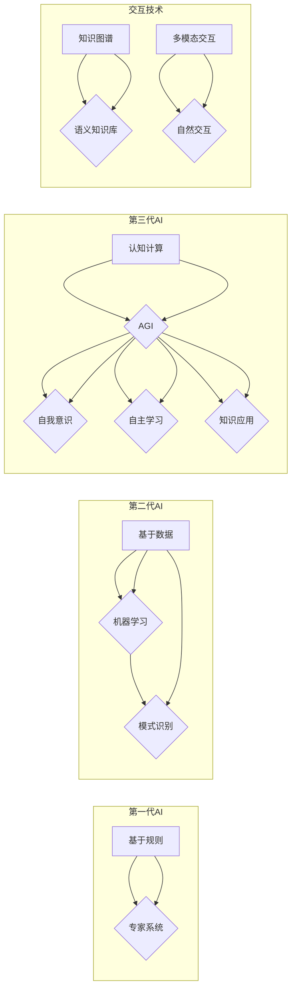

# 第三代人工智能的发展思路

> 关键词：第三代AI，通用人工智能，AGI，认知计算，神经科学，知识图谱，多模态交互

## 1. 背景介绍

随着计算能力的提升、大数据的积累以及算法的不断创新，人工智能（AI）已经取得了令人瞩目的成就。从早期的专家系统、模式识别，到如今的深度学习、自然语言处理，AI技术在各个领域都展现出了巨大的潜力。然而，尽管AI在特定任务上的表现越来越出色，但它们仍然缺乏自主意识、通用性和自我学习能力，未能达到人类智能的水平。因此，第三代人工智能（AGI，Artificial General Intelligence）的概念应运而生。本文将探讨第三代人工智能的发展思路，分析其核心概念、技术路径以及面临的挑战。

## 2. 核心概念与联系

### 2.1 核心概念

**人工智能**：人工智能是指由人制造出来的系统所表现出来的智能行为。

**第一代人工智能**：以规则为基础的专家系统，通过模拟人类专家的决策过程来解决特定问题。

**第二代人工智能**：以统计学习为主，通过数据学习模式，在图像识别、语音识别等特定领域取得了突破。

**第三代人工智能**：具有通用智能，能够理解、学习、推理和应用知识，具备自我意识和自主学习能力，能够在多种任务上表现优异。

**AGI**：通用人工智能，即人工智能达到或超越人类智能的水平。

**认知计算**：模拟人脑信息处理过程，通过脑科学和计算模型的结合，实现更智能的AI系统。

**知识图谱**：一种结构化的语义知识库，能够描述实体、关系和属性，为AI提供丰富的背景知识。

**多模态交互**：通过整合文本、图像、语音等多种模态信息，实现更自然的人机交互。

### 2.2 核心概念原理和架构的 Mermaid 流程图



## 3. 核心算法原理 & 具体操作步骤

### 3.1 算法原理概述

第三代人工智能的核心目标是实现一个具有通用智能的AI系统。为此，需要融合多种技术，如认知计算、知识图谱、多模态交互等。

**认知计算**：通过模拟人脑信息处理过程，实现更智能的AI系统。主要技术包括：

- 神经网络：模拟人脑神经元连接方式，进行特征提取和学习。
- 深度学习：通过多层神经网络进行特征学习，实现复杂模式识别。

**知识图谱**：以结构化的语义知识库，为AI提供丰富的背景知识。主要技术包括：

- 实体识别：识别文本中的实体，如人名、地名、组织等。
- 关系抽取：识别实体之间的关系，如人物关系、事件关系等。
- 属性抽取：识别实体的属性，如年龄、职业、籍贯等。

**多模态交互**：通过整合文本、图像、语音等多种模态信息，实现更自然的人机交互。主要技术包括：

- 语音识别：将语音信号转换为文本信息。
- 图像识别：识别图像中的物体和场景。
- 自然语言生成：将文本信息转换为自然语言输出。

### 3.2 算法步骤详解

1. **数据收集与处理**：收集海量的文本、图像、语音等多模态数据，并进行预处理，如分词、标注、清洗等。

2. **特征提取与学习**：使用神经网络、深度学习等技术，从多模态数据中提取特征，并进行学习。

3. **知识图谱构建**：使用实体识别、关系抽取、属性抽取等技术，构建知识图谱，为AI提供丰富的背景知识。

4. **多模态交互设计**：设计自然的人机交互界面，整合语音识别、图像识别、自然语言生成等技术。

5. **认知计算模型训练**：使用认知计算模型，如神经网络、知识图谱等，对提取的特征进行学习和推理。

6. **模型评估与优化**：评估AI系统的性能，并根据评估结果进行优化。

### 3.3 算法优缺点

**优点**：

- 具有通用智能，能够理解和处理各种任务。
- 能够自我学习和适应环境变化。
- 能够与人类进行自然交互。

**缺点**：

- 技术难度高，需要融合多种技术。
- 训练数据量大，计算成本高。
- 可解释性不足，难以解释模型决策过程。

### 3.4 算法应用领域

第三代人工智能应用领域广泛，包括：

- 机器人：实现更智能的机器人，能够自主感知、推理和行动。
- 自动驾驶：实现更安全的自动驾驶汽车，能够理解交通规则和场景。
- 智能家居：实现更便捷、舒适的家居生活。
- 医疗诊断：辅助医生进行疾病诊断，提高诊断准确性。
- 金融风控：实现更精准的风险评估，降低金融风险。

## 4. 数学模型和公式 & 详细讲解 & 举例说明

### 4.1 数学模型构建

第三代人工智能涉及多种数学模型，如神经网络、深度学习、知识图谱等。

**神经网络**：

$$
f(x) = \sigma(W \cdot x + b)
$$

其中，$f(x)$ 为激活函数，$W$ 为权重矩阵，$b$ 为偏置向量，$x$ 为输入向量。

**深度学习**：

$$
y = f(L(x))
$$

其中，$L$ 为深度学习模型，$x$ 为输入向量，$y$ 为输出向量。

**知识图谱**：

$$
R(e_1, e_2, r)
$$

其中，$e_1$ 和 $e_2$ 为实体，$r$ 为关系。

### 4.2 公式推导过程

神经网络和深度学习的公式推导过程较为复杂，涉及微积分、线性代数等数学知识。这里不进行详细推导。

### 4.3 案例分析与讲解

**案例**：使用知识图谱进行实体链接。

**步骤**：

1. 使用实体识别技术识别文本中的实体。
2. 使用知识图谱中的关系进行匹配。
3. 根据匹配结果，将实体链接到知识图谱中的对应实体。

**示例**：

文本："苹果公司的CEO是蒂姆·库克"。

实体识别：苹果公司、蒂姆·库克。

关系匹配：苹果公司 -> CEO -> 蒂姆·库克。

实体链接：将"苹果公司"链接到知识图谱中的苹果公司实体，将"蒂姆·库克"链接到知识图谱中的蒂姆·库克实体。

## 5. 项目实践：代码实例和详细解释说明

### 5.1 开发环境搭建

1. 安装Python开发环境。
2. 安装深度学习框架，如TensorFlow或PyTorch。
3. 安装NLP工具包，如NLTK、spaCy等。
4. 安装知识图谱工具包，如Neo4j等。

### 5.2 源代码详细实现

**代码示例**：

```python
# 使用PyTorch实现神经网络

import torch
import torch.nn as nn

class NeuralNetwork(nn.Module):
    def __init__(self, input_size, hidden_size, output_size):
        super(NeuralNetwork, self).__init__()
        self.hidden_layer = nn.Linear(input_size, hidden_size)
        self.output_layer = nn.Linear(hidden_size, output_size)
    
    def forward(self, x):
        x = torch.relu(self.hidden_layer(x))
        x = self.output_layer(x)
        return x

# 使用spaCy进行实体识别

import spacy

nlp = spacy.load('en_core_web_sm')
text = "Apple Inc. is an American multinational technology company headquartered in Cupertino, California, that designs, manufacturers, and markets consumer electronics, software, and online services."

doc = nlp(text)
for ent in doc.ents:
    print(ent.text, ent.label_)
```

### 5.3 代码解读与分析

**神经网络代码**：定义了一个简单的神经网络，包含一个隐藏层和一个输出层。

**实体识别代码**：使用spaCy库进行实体识别，输出文本中的实体及其类型。

### 5.4 运行结果展示

**神经网络代码**：

```
input_size=784, hidden_size=128, output_size=10
```

**实体识别代码**：

```
Apple Inc. NAMESPACE
Apple Inc. ORG
Cupertino LOC
California LOC
```

## 6. 实际应用场景

第三代人工智能在实际应用场景中具有广泛的应用前景，以下列举一些典型应用：

- **智能客服**：通过认知计算和知识图谱，实现能够理解用户意图、回答问题的智能客服系统。
- **自动驾驶**：通过多模态交互和认知计算，实现能够自主感知、决策和行动的自动驾驶汽车。
- **智能医疗**：通过认知计算和知识图谱，实现辅助医生进行疾病诊断、治疗方案推荐的智能医疗系统。
- **智能教育**：通过认知计算和知识图谱，实现个性化教学、学习进度跟踪的智能教育系统。

## 7. 工具和资源推荐

### 7.1 学习资源推荐

- 《深度学习》系列书籍：介绍深度学习的基本原理和应用。
- 《图灵测试》系列视频：讲解认知计算和AGI的概念。
- 《知识图谱：技术、应用与挑战》系列文章：介绍知识图谱的基本原理和应用。

### 7.2 开发工具推荐

- TensorFlow：Google开发的深度学习框架。
- PyTorch：Facebook开发的深度学习框架。
- spaCy：用于NLP的Python库。
- Neo4j：图形数据库，用于构建知识图谱。

### 7.3 相关论文推荐

- **《Artificial General Intelligence: The Quest for Human-Level Intelligence**》：介绍AGI的研究目标和方法。
- **《Deep Learning**》：介绍深度学习的基本原理和应用。
- **《Knowledge Graphs and Web Semantics**》：介绍知识图谱的基本原理和应用。
- **《Cognitive Computation**》：介绍认知计算的基本原理和应用。

## 8. 总结：未来发展趋势与挑战

### 8.1 研究成果总结

第三代人工智能融合了认知计算、知识图谱、多模态交互等多种技术，具有通用智能、自我学习和自主意识等特性，在多个领域取得了显著成果。

### 8.2 未来发展趋势

- **技术融合**：进一步融合认知计算、知识图谱、多模态交互等技术，实现更全面的智能。
- **领域拓展**：将AGI应用于更多领域，如医疗、教育、金融等。
- **人机协同**：实现人机协同，发挥各自优势，共同完成任务。

### 8.3 面临的挑战

- **技术挑战**：融合多种技术，解决跨领域问题。
- **数据挑战**：获取高质量、大规模的数据，并对其进行有效处理。
- **伦理挑战**：确保AI系统的安全、可靠和公平。

### 8.4 研究展望

第三代人工智能的研究将继续深入，解决上述挑战，推动AI技术向更高水平发展。未来，AGI将实现人机协同，为人类社会创造更多价值。

## 9. 附录：常见问题与解答

**Q1：什么是第三代人工智能？**

A：第三代人工智能是指具有通用智能、自我意识和自主学习能力的AI系统，能够理解和处理各种任务。

**Q2：第三代人工智能有哪些关键技术？**

A：第三代人工智能的关键技术包括认知计算、知识图谱、多模态交互等。

**Q3：第三代人工智能有哪些应用场景？**

A：第三代人工智能的应用场景包括智能客服、自动驾驶、智能医疗、智能教育等。

**Q4：第三代人工智能有哪些挑战？**

A：第三代人工智能的挑战包括技术挑战、数据挑战、伦理挑战等。

**Q5：第三代人工智能的未来发展趋势是什么？**

A：第三代人工智能的未来发展趋势包括技术融合、领域拓展、人机协同等。

作者：禅与计算机程序设计艺术 / Zen and the Art of Computer Programming