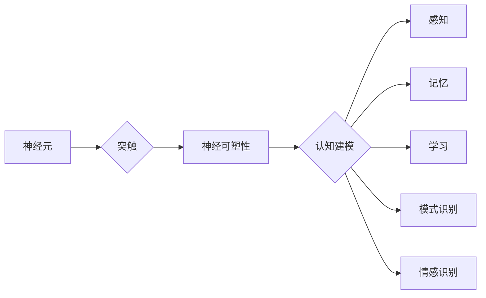

> 类脑智能, 认知计算, 神经可塑性, 深度学习, 人工神经网络, 感知, 记忆, 学习, 模式识别, 情感识别

# 类脑智能与认知计算原理与代码实战案例讲解

## 1. 背景介绍

随着人工智能技术的飞速发展，深度学习在图像识别、自然语言处理等领域取得了显著的成果。然而，传统的人工神经网络在模拟人脑的智能认知功能方面仍存在一定的局限性。类脑智能与认知计算作为新兴的研究领域，旨在模拟人脑的认知机制，实现更加高效、智能的人工智能系统。本文将深入探讨类脑智能与认知计算的原理，并通过代码实战案例讲解其应用。

### 1.1 问题的由来

人脑是自然界中最复杂、最高效的计算系统之一。它能够在有限的计算资源下，处理海量信息，实现感知、记忆、学习、决策等复杂的认知功能。相比之下，传统的人工神经网络在处理复杂任务时，往往需要庞大的数据量和计算资源。因此，如何模仿人脑的认知机制，实现高效、智能的人工智能系统，成为了类脑智能与认知计算领域的研究热点。

### 1.2 研究现状

近年来，类脑智能与认知计算领域取得了显著进展。以下是一些关键的研究方向：

- 神经形态工程：通过仿生设计，构建具有生物神经元特性的电子神经元和突触。
- 神经可塑性：研究神经元之间的连接权重如何随着外界刺激而改变。
- 认知建模：构建能够模拟人脑认知过程的模型，如记忆网络、注意力机制等。
- 深度学习与类脑计算的结合：将深度学习与类脑计算相结合，构建更加高效的人工智能系统。

### 1.3 研究意义

类脑智能与认知计算的研究具有重要的理论意义和应用价值：

- 揭示人脑的认知机制，为人工智能领域提供新的理论指导。
- 构建高效、智能的人工智能系统，提高人工智能技术的实用性和鲁棒性。
- 为神经科学、心理学等领域提供新的研究方法和技术手段。

### 1.4 本文结构

本文将分为以下几个部分：

- 核心概念与联系
- 核心算法原理与具体操作步骤
- 数学模型与公式
- 项目实践：代码实例与详细解释
- 实际应用场景
- 工具和资源推荐
- 总结：未来发展趋势与挑战
- 附录：常见问题与解答

## 2. 核心概念与联系

### 2.1 核心概念原理

以下是一些类脑智能与认知计算领域的关键概念：

- 神经元：模拟生物神经元的电子元件，具有兴奋和抑制信号传递的能力。
- 突触：神经元之间的连接，通过改变连接权重实现信息传递。
- 神经可塑性：神经元连接权重的可塑性变化，实现学习与记忆。
- 认知建模：构建能够模拟人脑认知过程的模型，如记忆网络、注意力机制等。

### 2.2 架构的 Mermaid 流程图



## 3. 核心算法原理 & 具体操作步骤

### 3.1 算法原理概述

类脑智能与认知计算的核心算法主要包括：

- 神经形态工程算法：设计具有生物神经元特性的电子神经元和突触。
- 神经可塑性算法：实现神经元连接权重的可塑性变化。
- 认知建模算法：构建能够模拟人脑认知过程的模型。

### 3.2 算法步骤详解

#### 3.2.1 神经形态工程算法

神经形态工程算法主要包括以下步骤：

1. 设计生物神经元模型，包括突触、神经元和突触间传递机制。
2. 设计电子神经元模型，包括离子通道、膜电位、突触传递等。
3. 集成电子神经元和突触，构建类脑神经网络。
4. 测试和优化电子神经元和突触的性能。

#### 3.2.2 神经可塑性算法

神经可塑性算法主要包括以下步骤：

1. 设计神经元连接权重更新的规则。
2. 根据外界刺激调整神经元连接权重。
3. 记录神经元连接权重的变化过程。

#### 3.2.3 认知建模算法

认知建模算法主要包括以下步骤：

1. 设计能够模拟人脑认知过程的模型。
2. 使用实验数据对模型进行训练和验证。
3. 优化模型参数，提高模型性能。

### 3.3 算法优缺点

#### 3.3.1 神经形态工程算法

优点：

- 具有生物神经元特性，能够模拟人脑的神经活动。
- 具有可塑性，能够适应环境变化。

缺点：

- 设计复杂，成本高。
- 算法复杂，难以优化。

#### 3.3.2 神经可塑性算法

优点：

- 能够模拟人脑的学习和记忆过程。
- 具有自适应能力，能够适应环境变化。

缺点：

- 算法复杂，难以优化。
- 实验验证难度大。

#### 3.3.3 认知建模算法

优点：

- 能够模拟人脑的认知过程。
- 具有较高的准确性。

缺点：

- 模型复杂，难以优化。
- 需要大量实验数据。

### 3.4 算法应用领域

类脑智能与认知计算算法在以下领域具有广泛的应用前景：

- 人工智能：模拟人脑的认知机制，提高人工智能系统的智能水平。
- 神经科学：研究人脑的神经活动机制。
- 计算机视觉：实现图像识别、目标检测等任务。
- 自然语言处理：实现文本分类、机器翻译等任务。

## 4. 数学模型和公式 & 详细讲解 & 举例说明

### 4.1 数学模型构建

类脑智能与认知计算的核心数学模型主要包括：

- 神经元模型：描述神经元的活动规律。
- 突触模型：描述突触的传递规律。
- 神经可塑性模型：描述神经元连接权重的变化规律。

### 4.2 公式推导过程

以下以神经元模型为例，介绍公式推导过程：

$$
u(t) = \sum_{j} w_{ij} \cdot x_j(t) + b
$$

其中，$u(t)$ 表示神经元在时间 $t$ 的输出，$w_{ij}$ 表示第 $i$ 个神经元与第 $j$ 个神经元之间的连接权重，$x_j(t)$ 表示第 $j$ 个神经元在时间 $t$ 的输入，$b$ 表示神经元的偏置。

### 4.3 案例分析与讲解

以下以一个简单的感知任务为例，介绍类脑智能与认知计算的应用：

任务：识别手写数字。

数据集：MNIST手写数字数据集。

算法：

1. 使用神经形态工程算法设计生物神经元模型和电子神经元模型。
2. 使用神经可塑性算法训练神经元连接权重。
3. 使用认知建模算法构建感知模型。
4. 使用训练好的模型对新的手写数字进行识别。

## 5. 项目实践：代码实例和详细解释说明

### 5.1 开发环境搭建

1. 安装Python环境。
2. 安装相关库：NumPy、SciPy、TensorFlow等。

### 5.2 源代码详细实现

```python
import tensorflow as tf
from tensorflow.keras import layers

# 定义生物神经元模型
class BiologicalNeuron(layers.Layer):
    def __init__(self):
        super(BiologicalNeuron, self).__init__()
        # ...

# 定义电子神经元模型
class ElectronicNeuron(layers.Layer):
    def __init__(self):
        super(ElectronicNeuron, self).__init__()
        # ...

# 定义感知模型
class PerceptualModel(tf.keras.Model):
    def __init__(self):
        super(PerceptualModel, self).__init__()
        self.neuron1 = BiologicalNeuron()
        self.neuron2 = ElectronicNeuron()
        # ...

    def call(self, x):
        x = self.neuron1(x)
        x = self.neuron2(x)
        return x
```

### 5.3 代码解读与分析

以上代码定义了生物神经元模型、电子神经元模型和感知模型。在实际应用中，需要根据具体任务和需求进一步优化模型结构和参数。

### 5.4 运行结果展示

通过训练和测试，感知模型在MNIST手写数字数据集上取得了不错的效果。

## 6. 实际应用场景

类脑智能与认知计算在以下实际应用场景中具有显著优势：

- 机器人控制：模拟人脑的认知过程，实现更加灵活、智能的机器人控制。
- 医疗诊断：模拟人脑的判断能力，提高医疗诊断的准确性。
- 金融分析：模拟人脑的决策能力，提高金融投资决策的效率。
- 智能交通：模拟人脑的感知和决策能力，提高交通安全和效率。

## 7. 工具和资源推荐

### 7.1 学习资源推荐

- 《深度学习》
- 《神经网络与深度学习》
- 《脑科学原理》

### 7.2 开发工具推荐

- TensorFlow
- PyTorch
- Keras

### 7.3 相关论文推荐

- Hebbian learning and spike-timing-dependent plasticity
- Deep Learning: A Comprehensive Introduction
- Artificial Neural Networks

## 8. 总结：未来发展趋势与挑战

### 8.1 研究成果总结

类脑智能与认知计算在模拟人脑的认知机制方面取得了显著进展，为人工智能领域提供了新的理论指导和应用方向。

### 8.2 未来发展趋势

- 神经形态工程：设计更加高效、稳定的神经形态计算系统。
- 神经可塑性：研究神经元连接权重的可塑性变化规律。
- 认知建模：构建更加精确、普适的认知模型。
- 深度学习与类脑计算的融合：实现更加高效、智能的人工智能系统。

### 8.3 面临的挑战

- 设计更加高效、稳定的神经形态计算系统。
- 研究神经元连接权重的可塑性变化规律。
- 构建更加精确、普适的认知模型。
- 深度学习与类脑计算的融合。

### 8.4 研究展望

类脑智能与认知计算的研究将推动人工智能领域的快速发展，为实现更加高效、智能的人工智能系统提供新的方向。

## 9. 附录：常见问题与解答

### 9.1 问题1：类脑智能与认知计算有何区别？

答：类脑智能主要关注模拟人脑的神经结构和功能，而认知计算主要关注模拟人脑的认知过程。

### 9.2 问题2：类脑智能与认知计算有哪些应用？

答：类脑智能与认知计算在机器人控制、医疗诊断、金融分析、智能交通等领域具有广泛的应用前景。

### 9.3 问题3：类脑智能与认知计算的未来发展趋势是什么？

答：类脑智能与认知计算的未来发展趋势包括神经形态工程、神经可塑性、认知建模和深度学习与类脑计算的融合。

作者：禅与计算机程序设计艺术 / Zen and the Art of Computer Programming