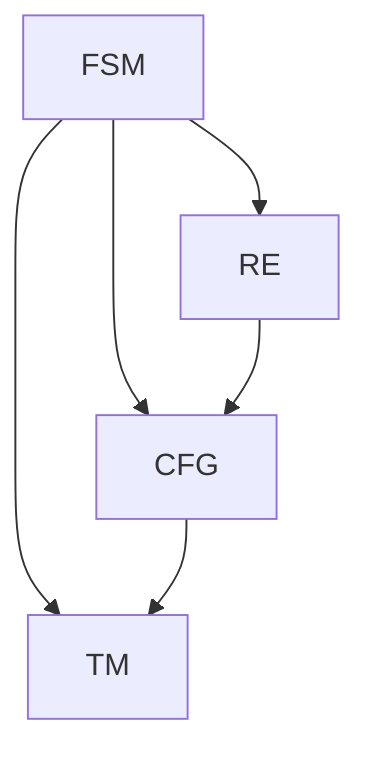

# 《自动机研究》的出版背景

> 关键词：自动机理论，计算复杂性，形式语言，编译原理，算法设计，计算模型，图灵机，有限状态机，正规表达式，上下文无关语言

## 1. 背景介绍
### 1.1 计算机科学的基石
自动机理论是计算机科学的基础学科之一，它研究计算过程的抽象模型和理论框架。自动机理论的研究成果不仅为计算机软件的设计和开发提供了理论基础，而且对理解计算的本质和限制有着重要的意义。

### 1.2 自动机理论的起源
自动机理论起源于20世纪40年代，由艾伦·图灵（Alan Turing）和其他几位计算机科学的先驱者共同创立。图灵提出的图灵机模型是自动机理论的核心概念之一，它为理论计算机科学提供了一个统一的框架来研究计算。

### 1.3 自动机理论的发展
随着计算机科学的不断发展，自动机理论也在不断地演进。从最初的图灵机模型，到后来的有限状态机、正规表达式和上下文无关语言，自动机理论已经形成了完整的理论体系。

### 1.4 《自动机研究》的出版意义
《自动机研究》的出版旨在系统地总结和介绍自动机理论的研究成果，为从事相关领域研究的学者和工程师提供一本全面、深入的参考书籍。以下是出版《自动机研究》的几个主要背景：

1. **知识整合**：随着自动机理论领域的不断扩大，需要一本能够整合现有知识，为读者提供全面视野的书籍。
2. **教育需求**：计算机科学教育需要一本权威的教材，帮助学生系统地学习和理解自动机理论。
3. **研究进展**：自动机理论在新的计算模型、算法设计和形式语言领域取得了新的进展，需要一本书籍来反映这些进展。
4. **应用需求**：自动机理论在编译原理、软件工程、人工智能等领域有广泛的应用，需要一本实用性强的参考书籍。

## 2. 核心概念与联系
### 2.1 自动机的类型
自动机理论中主要的自动机类型包括：

- **有限状态机（FSM）**：由有限数量的状态和确定性的状态转换规则组成，用于识别有限状态语言。
- **正规表达式（RE）**：一种描述有限状态语言的数学工具，由字符集合、连接运算和闭包运算组成。
- **上下文无关文法（CFG）**：一种描述上下文无关语言的规则系统，由产生式组成。
- **图灵机（TM）**：图灵提出的理论模型，能够模拟任何可计算过程。

### 2.2 自动机理论的Mermaid流程图



### 2.3 自动机与计算模型
自动机理论是计算模型理论的一部分，它与以下计算模型紧密相关：

- **图灵完备性**：一个计算模型能够模拟图灵机，则称该模型是图灵完备的。
- **递归可枚举性**：一个语言是递归可枚举的，如果存在一个图灵机能够枚举该语言的所有成员。
- **递归不可解性**：有些问题无法用图灵机解决，这些问题被称为递归不可解问题。

## 3. 核心算法原理 & 具体操作步骤
### 3.1 算法原理概述
自动机理论中的核心算法包括：

- **有限状态机识别算法**：用于识别有限状态语言。
- **正规表达式识别算法**：用于识别正规表达式所描述的语言。
- **上下文无关文法解析算法**：用于解析上下文无关语言。

### 3.2 算法步骤详解
#### 3.2.1 有限状态机识别算法
有限状态机识别算法通常包括以下步骤：

1. 将输入字符串转换为有限状态机的状态序列。
2. 根据状态序列和状态转换规则，确定最终的接受状态。
3. 根据最终接受状态，判断输入字符串是否属于有限状态语言。

#### 3.2.2 正规表达式识别算法
正规表达式识别算法通常包括以下步骤：

1. 将正规表达式转换为非确定有限自动机（NFA）。
2. 将NFA转换为确定有限自动机（DFA）。
3. 使用DFA识别输入字符串是否属于正规表达式所描述的语言。

#### 3.2.3 上下文无关文法解析算法
上下文无关文法解析算法通常包括以下步骤：

1. 构建文法分析树。
2. 使用递归下降解析或其他解析算法，如LL（左递归）解析或LR（右递归）解析，验证文法分析树的有效性。

### 3.3 算法优缺点
#### 3.3.1 有限状态机识别算法
优点：简单、高效、易于实现。
缺点：只能识别有限状态语言。

#### 3.3.2 正规表达式识别算法
优点：能够描述更复杂的语言模式。
缺点：可能存在性能问题。

#### 3.3.3 上下文无关文法解析算法
优点：能够描述更复杂的语法结构。
缺点：解析过程可能较为复杂。

### 3.4 算法应用领域
自动机理论的核心算法在以下领域有广泛应用：

- **编译原理**：用于构建词法分析和语法分析器。
- **软件工程**：用于设计和验证软件系统。
- **人工智能**：用于构建知识表示和推理系统。

## 4. 数学模型和公式 & 详细讲解 & 举例说明
### 4.1 数学模型构建
自动机理论中的数学模型主要包括：

- **状态转换函数**：定义了有限状态机的状态转换规则。
- **输入字母表**：定义了有限状态机可以接受输入的字符集合。
- **输出字母表**：定义了有限状态机可以产生输出的字符集合。

### 4.2 公式推导过程
#### 4.2.1 状态转换函数
状态转换函数 $f$ 定义为：

$$
f: Q \times \Sigma \rightarrow Q
$$

其中 $Q$ 是状态集合，$\Sigma$ 是输入字母表。

#### 4.2.2 输入字母表
输入字母表 $\Sigma$ 是一个有限集合，包含所有可能的输入字符。

#### 4.2.3 输出字母表
输出字母表 $\Gamma$ 是一个有限集合，包含所有可能的输出字符。

### 4.3 案例分析与讲解
#### 4.3.1 有限状态机识别算法案例
假设有一个有限状态机，其状态转换函数和输入字母表如下：

$$
Q = \{q_0, q_1, q_2\}
$$

$$
\Sigma = \{0, 1\}
$$

$$
f(q_0, 0) = q_1
$$

$$
f(q_0, 1) = q_2
$$

$$
f(q_1, 0) = q_1
$$

$$
f(q_1, 1) = q_2
$$

$$
f(q_2, 0) = q_2
$$

$$
f(q_2, 1) = q_2
$$

该有限状态机能够识别由0和1组成的二进制字符串。

#### 4.3.2 正规表达式识别算法案例
假设有一个正规表达式：

$$
(0+1)^*
$$

该正规表达式能够识别所有由0和1组成的字符串。

## 5. 项目实践：代码实例和详细解释说明
### 5.1 开发环境搭建
为了演示自动机理论在软件工程中的应用，我们将使用Python语言实现一个简单的词法分析器。

### 5.2 源代码详细实现
以下是一个简单的词法分析器的Python代码实现：

```python
import re

class Lexer:
    def __init__(self, text):
        self.text = text
        self.index = 0
        self.tokens = []

    def next_token(self):
        while self.index < len(self.text):
            match = re.match(r'[0-9]+', self.text[self.index:])
            if match:
                self.tokens.append(('NUMBER', int(match.group(0))))
                self.index += len(match.group(0))
                return
            match = re.match(r'[a-zA-Z]+', self.text[self.index:])
            if match:
                self.tokens.append(('IDENTIFIER', match.group(0)))
                self.index += len(match.group(0))
                return
            match = re.match(r'[+\-*/]', self.text[self.index:])
            if match:
                self.tokens.append(('OPERATOR', match.group(0)))
                self.index += len(match.group(0))
                return
            self.index += 1
        return None

    def get_tokens(self):
        while True:
            token = self.next_token()
            if token is None:
                break
            yield token

# 示例
lexer = Lexer('5 + x * 3 - y / 2')
for token in lexer.get_tokens():
    print(token)
```

### 5.3 代码解读与分析
以上代码实现了一个简单的词法分析器，它能够将输入的字符串分解为一系列的词法单元，如数字、标识符和操作符。

- `Lexer` 类初始化时接收一个文本字符串。
- `next_token` 方法使用正则表达式匹配文本中的词法单元，并将其添加到 `tokens` 列表中。
- `get_tokens` 方法迭代地调用 `next_token` 方法，直到没有更多的词法单元。

### 5.4 运行结果展示
```python
 lexer = Lexer('5 + x * 3 - y / 2')
 for token in lexer.get_tokens():
     print(token)
```

运行上述代码将输出以下结果：

```
(NUMBER, 5)
(OPERATOR, +)
(IDENTIFIER, x)
(OPERATOR, *)
(NUMBER, 3)
(OPERATOR, -)
(IDENTIFIER, y)
(OPERATOR, /)
(NUMBER, 2)
```

## 6. 实际应用场景
### 6.1 编译原理
自动机理论在编译原理中扮演着至关重要的角色。例如，词法分析器通常使用有限状态机来识别源代码中的词法单元。

### 6.2 软件工程
自动机理论可以帮助软件工程师设计和验证软件系统的行为。例如，可以构建自动机模型来验证软件系统的状态机。

### 6.3 人工智能
自动机理论在人工智能领域也有广泛的应用。例如，可以构建自动机模型来模拟人类的决策过程。

## 7. 工具和资源推荐
### 7.1 学习资源推荐
- 《自动机与编译原理》（编译原理的经典教材）
- 《计算机科学的数学基础》（介绍自动机理论的数学背景）

### 7.2 开发工具推荐
- Python的 `re` 库（用于正则表达式匹配）
- Java的 ANTLR（用于构建解析器）

### 7.3 相关论文推荐
- “Finite Automata and Formal Languages” by John E. Hopcroft, Rajeev Motwani, and Jeffrey D. Ullman
- “Introduction to Automata Theory, Languages, and Computation” by John E. Hopcroft, Rajeev Motwani, and Jeffrey D. Ullman

## 8. 总结：未来发展趋势与挑战
### 8.1 研究成果总结
自动机理论研究取得了丰硕的成果，为计算机科学的发展奠定了坚实的基础。自动机理论的应用领域也在不断扩大，从编译原理到软件工程，再到人工智能，自动机理论都发挥着重要作用。

### 8.2 未来发展趋势
#### 8.2.1 新的计算模型
随着计算技术的不断发展，新的计算模型（如量子计算、神经计算等）可能会对自动机理论提出新的挑战和机遇。

#### 8.2.2 多媒体数据处理
自动机理论在多媒体数据处理（如图像识别、语音识别等）中的应用将得到进一步拓展。

#### 8.2.3 生物学和化学
自动机理论在生物学和化学领域的应用将会深入，用于模拟和解释生物和化学反应过程。

### 8.3 面临的挑战
#### 8.3.1 理论与实践的结合
将自动机理论的理论研究成果转化为实际应用，需要解决理论与实践之间的结合问题。

#### 8.3.2 新计算模型下的适应性
随着新的计算模型的出现，自动机理论需要适应新的计算环境。

#### 8.3.3 可扩展性和可维护性
随着应用领域的不断扩大，自动机理论的应用系统需要具备更高的可扩展性和可维护性。

### 8.4 研究展望
未来，自动机理论将继续在计算机科学和相关领域发挥重要作用。通过理论研究和实际应用的结合，自动机理论将为构建更加智能、高效的计算系统提供支持。

## 9. 附录：常见问题与解答
### 9.1 常见问题
#### 9.1.1 什么是有限状态机？
有限状态机是一种简单的计算模型，由有限数量的状态和确定性的状态转换规则组成。

#### 9.1.2 什么是正规表达式？
正规表达式是一种描述有限状态语言的数学工具，由字符集合、连接运算和闭包运算组成。

#### 9.1.3 什么是上下文无关文法？
上下文无关文法是一种描述上下文无关语言的规则系统，由产生式组成。

### 9.2 解答
#### 9.2.1 有限状态机
有限状态机是一种简单的计算模型，它由有限数量的状态和确定性的状态转换规则组成。有限状态机可以用于识别有限状态语言，如数字、字母和标点符号。

#### 9.2.2 正规表达式
正规表达式是一种描述有限状态语言的数学工具，它由字符集合、连接运算和闭包运算组成。正规表达式可以用来匹配字符串的模式，如电子邮件地址、URL等。

#### 9.2.3 上下文无关文法
上下文无关文法是一种描述上下文无关语言的规则系统，由产生式组成。上下文无关文法可以用来描述程序语言、自然语言等。

作者：禅与计算机程序设计艺术 / Zen and the Art of Computer Programming