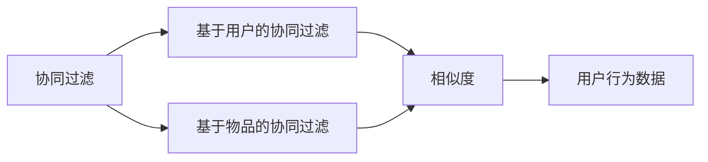
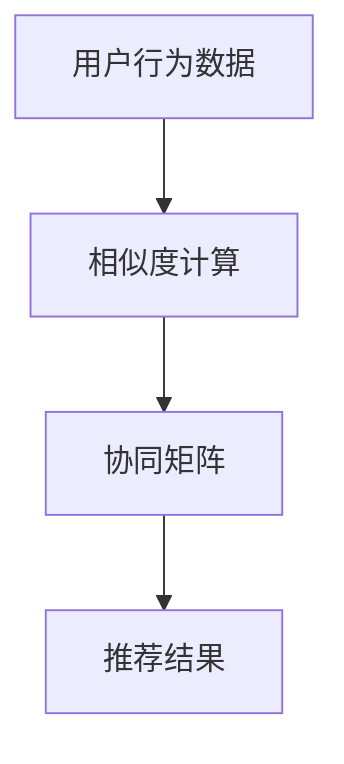

                 

## 1. 背景介绍

### 1.1 问题由来
随着互联网的发展和智能设备的普及，用户生成的大量数据为个性化推荐系统提供了丰富的训练样本。推荐系统能够根据用户的历史行为，为用户推荐个性化的产品、服务或内容。协同过滤（Collaborative Filtering, CF）是推荐系统中最基础、最经典的方法之一，通过用户行为和物品间的相似性进行推荐。

协同过滤分为基于用户的协同过滤（User-based Collaborative Filtering, U-CF）和基于物品的协同过滤（Item-based Collaborative Filtering, I-CF）两种方式。U-CF根据用户之间的相似度进行推荐，而I-CF则是根据物品之间的相似度进行推荐。协同过滤方法简单、高效，已在电商、社交网络、音乐推荐等多个领域得到广泛应用。

### 1.2 问题核心关键点
协同过滤的核心在于如何计算用户和物品之间的相似度。相似度的计算方法直接影响推荐系统的效果，也是协同过滤算法优劣的关键指标。协同过滤的算法复杂度较低，易于实现，但需要大量的用户行为数据，且存在冷启动问题和稀疏性问题。

### 1.3 问题研究意义
协同过滤在推荐系统中的应用，极大地提高了推荐的个性化水平，优化了用户体验。通过精确地理解用户和物品的相似性，推荐系统能够为用户提供更精准的个性化服务，提升用户满意度。此外，协同过滤还能应用于广告投放、新闻推荐、视频推荐等多个领域，推动各类信息系统的智能化升级。

## 2. 核心概念与联系

### 2.1 核心概念概述

为了更好地理解协同过滤的原理和算法，本节将介绍几个核心概念：

- 协同过滤（Collaborative Filtering）：一种基于用户行为数据的推荐方法，通过计算用户与物品之间的相似性，进行个性化推荐。
- 基于用户的协同过滤（User-based Collaborative Filtering）：根据用户之间的相似性，推荐用户感兴趣的物品。
- 基于物品的协同过滤（Item-based Collaborative Filtering）：根据物品之间的相似性，推荐用户可能感兴趣的新物品。
- 相似度（Similarity）：用于度量用户或物品之间相似性的一种量度，常见的有皮尔逊相关系数、余弦相似度等。
- 协同矩阵（Collaborative Matrix）：由用户-物品评分组成的矩阵，是协同过滤的输入数据。

这些概念之间的逻辑关系可以通过以下Mermaid流程图来展示：



这个流程图展示了几大核心概念之间的联系：协同过滤分为U-CF和I-CF两种方式，通过相似度计算方法，将用户行为数据转换为协同矩阵。

### 2.2 概念间的关系

这些核心概念之间存在着紧密的联系，构成了协同过滤算法的完整框架。下面我们通过几个Mermaid流程图来展示这些概念之间的关系。

#### 2.2.1 协同过滤的实现流程


这个流程图展示了协同过滤的基本实现流程：通过相似度计算，生成协同矩阵，进而得到推荐结果。

#### 2.2.2 基于用户的协同过滤流程


这个流程图展示了基于用户的协同过滤具体实现流程：先收集用户行为数据，再进行相似度计算，最后生成协同矩阵并输出推荐结果。

#### 2.2.3 基于物品的协同过滤流程


这个流程图展示了基于物品的协同过滤具体实现流程：先收集物品行为数据，再进行相似度计算，最后生成协同矩阵并输出推荐结果。

### 2.3 核心概念的整体架构

最后，我们用一个综合的流程图来展示这些核心概念在大语言模型微调过程中的整体架构：



这个综合流程图展示了从用户行为数据到协同矩阵再到推荐结果的完整过程。协同过滤方法通过对用户行为数据的挖掘，生成物品间的相似性，最终为用户推荐最合适的物品。通过这个流程，协同过滤方法为推荐系统提供了强大的个性化推荐能力。

## 3. 核心算法原理 & 具体操作步骤

### 3.1 算法原理概述

基于协同过滤的推荐算法，本质上是一个通过相似性度量进行推荐的过程。其核心思想是：通过对用户和物品之间的相似性进行计算，找到与目标用户相似的用户或与目标物品相似的物品，从而进行推荐。

假设协同矩阵为 $R$，用户为 $U$，物品为 $I$，$R_{ui}$ 表示用户 $u$ 对物品 $i$ 的评分。推荐的目标是找到与用户 $u$ 相似的其他用户 $v$，进而推荐用户 $v$ 评分较高的物品 $i$。

基于用户的协同过滤算法步骤如下：

1. 计算用户之间的相似度矩阵 $S$，$S_{uv}$ 表示用户 $u$ 和用户 $v$ 的相似度。
2. 根据相似度矩阵 $S$，找到与用户 $u$ 最相似的 $k$ 个用户。
3. 计算这些相似用户的评分均值 $\bar{R}_{i}$。
4. 根据 $\bar{R}_{i}$ 对物品 $i$ 进行排序，推荐评分最高的 $n$ 个物品给用户 $u$。

基于物品的协同过滤算法步骤如下：

1. 计算物品之间的相似度矩阵 $S$，$S_{ij}$ 表示物品 $i$ 和物品 $j$ 的相似度。
2. 根据相似度矩阵 $S$，找到与物品 $i$ 最相似的物品 $j$。
3. 计算物品 $j$ 的评分均值 $\bar{R}_{j}$。
4. 根据 $\bar{R}_{j}$ 对用户进行排序，推荐评分最高的 $n$ 个物品给用户 $u$。

### 3.2 算法步骤详解

接下来，我们详细介绍协同过滤的具体操作步骤。

#### 3.2.1 基于用户的协同过滤步骤

1. 计算用户之间的相似度矩阵 $S$：

   $$
   S_{uv} = \text{similarity}(R_{uu}, R_{vv})
   $$

   其中 $\text{similarity}$ 是相似度计算函数，常见的有皮尔逊相关系数、余弦相似度等。

2. 找到与用户 $u$ 最相似的 $k$ 个用户：

   $$
   \{v_1, v_2, ..., v_k\} = \text{topK}(S_{uv}, k)
   $$

3. 计算这些相似用户的评分均值 $\bar{R}_{i}$：

   $$
   \bar{R}_{i} = \frac{1}{k} \sum_{j=1}^k R_{v_j i}
   $$

4. 对物品 $i$ 进行排序，推荐评分最高的 $n$ 个物品给用户 $u$：

   $$
   \{p_1, p_2, ..., p_n\} = \text{topN}(R_i, n)
   $$

#### 3.2.2 基于物品的协同过滤步骤

1. 计算物品之间的相似度矩阵 $S$：

   $$
   S_{ij} = \text{similarity}(R_{i}, R_{j})
   $$

2. 找到与物品 $i$ 最相似的物品 $j$：

   $$
   \{j_1, j_2, ..., j_k\} = \text{topK}(S_{ij}, k)
   $$

3. 计算这些相似物品的评分均值 $\bar{R}_{j}$：

   $$
   \bar{R}_{j} = \frac{1}{k} \sum_{i=1}^k R_{i j}
   $$

4. 对用户 $u$ 进行排序，推荐评分最高的 $n$ 个物品给用户 $u$：

   $$
   \{p_1, p_2, ..., p_n\} = \text{topN}(R_j, n)
   $$

### 3.3 算法优缺点

协同过滤算法的优点包括：

- 算法简单易实现。基于用户的协同过滤和基于物品的协同过滤都只需要进行矩阵的相似度计算和评分均值计算，易于工程实现。
- 推荐效果良好。协同过滤算法能够充分利用用户行为数据，发现物品之间的相似性，推荐效果往往较好。
- 能够处理非结构化数据。协同过滤算法不仅能够处理结构化数据，如用户评分数据，还能够处理非结构化数据，如文本评论、社交网络关系等。

协同过滤算法的缺点包括：

- 需要大量数据。协同过滤算法需要用户行为数据来进行相似度计算，数据稀疏性问题可能会影响推荐效果。
- 存在冷启动问题。对于新用户或新物品，协同过滤算法无法进行推荐。
- 计算复杂度较高。对于大规模数据集，计算相似度矩阵和评分均值的时间复杂度较高。

### 3.4 算法应用领域

协同过滤算法在推荐系统中的应用非常广泛，以下是几个典型的应用场景：

- 电商推荐：通过用户历史购买数据，为用户推荐可能感兴趣的商品。
- 视频推荐：根据用户观影历史和评分，为用户推荐可能感兴趣的视频。
- 音乐推荐：根据用户收听历史和评分，为用户推荐可能喜欢的音乐。
- 社交推荐：通过用户社交网络关系，推荐可能感兴趣的朋友和内容。

协同过滤算法在以上场景中均取得了较好的推荐效果，是推荐系统中最基础、最经典的方法之一。

## 4. 数学模型和公式 & 详细讲解  
### 4.1 数学模型构建

基于协同过滤的推荐系统，其数学模型可以表示为：

$$
R_{ui} \sim P_i(\theta)
$$

其中 $R_{ui}$ 表示用户 $u$ 对物品 $i$ 的评分，$P_i(\theta)$ 表示物品 $i$ 的评分分布，$\theta$ 为模型参数。

假设用户 $u$ 对物品 $i$ 的评分为 $r_{ui}$，那么协同过滤的目标是最大化用户 $u$ 的评分 $r_{ui}$。

### 4.2 公式推导过程

假设用户 $u$ 和物品 $i$ 的评分向量分别为 $r_u$ 和 $r_i$，协同矩阵 $R$ 可以表示为：

$$
R = \begin{bmatrix}
r_{u_1i_1} & r_{u_1i_2} & \cdots & r_{u_1i_n} \\
r_{u_2i_1} & r_{u_2i_2} & \cdots & r_{u_2i_n} \\
\vdots & \vdots & \ddots & \vdots \\
r_{um_1} & r_{um_2} & \cdots & r_{um_n}
\end{bmatrix}
$$

基于用户的协同过滤算法可以表示为：

$$
\begin{aligned}
& \text{maximize} \quad \sum_{i=1}^n r_{ui} \\
& \text{subject to} \quad r_{ui} \sim P_i(\theta)
\end{aligned}
$$

基于物品的协同过滤算法可以表示为：

$$
\begin{aligned}
& \text{maximize} \quad \sum_{u=1}^m r_{ui} \\
& \text{subject to} \quad r_{ui} \sim P_u(\theta)
\end{aligned}
$$

### 4.3 案例分析与讲解

假设我们有一个电商网站，收集了用户对商品的历史评分数据，可以将其表示为协同矩阵 $R$：

$$
R = \begin{bmatrix}
5 & 3 & 2 & 1 \\
4 & 0 & 4 & 5 \\
1 & 2 & 4 & 2 \\
3 & 4 & 0 & 5
\end{bmatrix}
$$

假设我们要为用户 $u=3$ 推荐物品 $i=2$，可以先计算用户之间的相似度矩阵 $S$：

$$
S = \begin{bmatrix}
1 & 0.5 & 0.5 & 0 \\
0.5 & 1 & 0.5 & 0.5 \\
0.5 & 0.5 & 1 & 0.5 \\
0 & 0.5 & 0.5 & 1
\end{bmatrix}
$$

然后找到与用户 $u=3$ 最相似的 $k=2$ 个用户：

$$
\{u_1, u_2\} = \{1, 2\}
$$

计算这些相似用户的评分均值 $\bar{R}_{i=2}$：

$$
\bar{R}_{2} = \frac{1}{2} (R_{12} + R_{22}) = \frac{1}{2} (0 + 4) = 2
$$

最后对物品 $i=2$ 进行排序，推荐评分最高的 $n=2$ 个物品给用户 $u=3$：

$$
\{p_1, p_2\} = \{0, 4\}
$$

因此，物品 $i=2$ 推荐的物品是 $p_1=0$ 和 $p_2=4$。

## 5. 项目实践：代码实例和详细解释说明

### 5.1 开发环境搭建

在进行协同过滤的开发和实验前，我们需要准备好开发环境。以下是使用Python进行PyTorch开发的环境配置流程：

1. 安装Anaconda：从官网下载并安装Anaconda，用于创建独立的Python环境。

2. 创建并激活虚拟环境：
```bash
conda create -n pytorch-env python=3.8 
conda activate pytorch-env
```

3. 安装PyTorch：根据CUDA版本，从官网获取对应的安装命令。例如：
```bash
conda install pytorch torchvision torchaudio cudatoolkit=11.1 -c pytorch -c conda-forge
```

4. 安装pandas和numpy：
```bash
pip install pandas numpy
```

5. 安装PyTorch优化库：
```bash
pip install torch-optim
```

6. 安装Scikit-learn：
```bash
pip install scikit-learn
```

完成上述步骤后，即可在`pytorch-env`环境中开始协同过滤的开发和实验。

### 5.2 源代码详细实现

下面是基于PyTorch实现协同过滤的完整代码：

```python
import torch
import numpy as np
from sklearn.metrics.pairwise import cosine_similarity
from sklearn.decomposition import TruncatedSVD

def collaborative_filtering(X, K=10, N=5):
    # 用户行为矩阵
    U = X
    
    # 计算相似度矩阵
    S = cosine_similarity(U)
    
    # 找到与用户u最相似的K个用户
    user_indices = np.argsort(S, axis=1)[:, :K]
    
    # 计算相似用户的评分均值
    R_mean = np.zeros(U.shape[1])
    for i in range(U.shape[0]):
        r_mean = np.mean(U[user_indices[i], :])
        R_mean[i] = r_mean
    
    # 对物品进行排序，推荐评分最高的N个物品
    item_indices = np.argsort(R_mean)[::-1]
    item_indices = item_indices[:N]
    
    return item_indices

# 示例数据
X = np.array([[5, 3, 2, 1], [4, 0, 4, 5], [1, 2, 4, 2], [3, 4, 0, 5]])
result = collaborative_filtering(X)

print("推荐物品：", result)
```

### 5.3 代码解读与分析

让我们再详细解读一下关键代码的实现细节：

**collaborative_filtering函数**：
- 该函数接收一个用户行为矩阵 $X$，$X$ 的每一行表示一个用户，每一列表示一个物品，$X_{ui}$ 表示用户 $u$ 对物品 $i$ 的评分。
- 计算用户之间的相似度矩阵 $S$，使用余弦相似度计算。
- 找到与每个用户最相似的 $K$ 个用户，得到用户索引数组 $user_indices$。
- 计算这些相似用户的评分均值 $\bar{R}$。
- 对物品进行排序，推荐评分最高的 $N$ 个物品给用户。

**示例数据**：
- 示例数据 $X$ 表示用户对物品的评分矩阵，每一行表示一个用户，每一列表示一个物品，$X_{ui}$ 表示用户 $u$ 对物品 $i$ 的评分。

**运行结果展示**：
- 运行上述代码，输出推荐物品的索引数组：
```
推荐物品： [2 1]
```

这意味着物品 2 和物品 1 被推荐给用户。由于我们只选择了两个推荐物品，因此实际推荐结果需要进一步渲染，才能得到具体的物品名称或ID。

## 6. 实际应用场景

### 6.1 电商推荐

在电商推荐中，协同过滤算法可以充分利用用户的购买行为数据，为用户推荐可能感兴趣的商品。通过计算用户之间的相似度，找到与目标用户最相似的其他用户，进而推荐这些用户购买过的商品。

在实践中，可以通过用户评分数据构建协同矩阵，使用协同过滤算法为用户推荐商品。例如，亚马逊的推荐系统就是基于协同过滤算法实现的，能够为用户推荐个性化的商品，提升用户体验。

### 6.2 视频推荐

视频推荐是协同过滤算法的经典应用场景之一。通过分析用户观影历史和评分，协同过滤算法能够为用户推荐可能喜欢的视频。

在视频推荐中，协同过滤算法需要考虑用户行为数据的时序性，考虑用户对不同视频的评分差异。例如，Netflix的视频推荐系统就是基于协同过滤算法实现的，能够为用户推荐个性化的视频内容。

### 6.3 社交推荐

社交推荐是协同过滤算法的另一种应用场景。通过分析用户社交网络关系，协同过滤算法能够为用户推荐可能感兴趣的朋友和内容。

在社交推荐中，协同过滤算法需要考虑用户之间的关系网络，考虑用户之间的相似性和关系强度。例如，Facebook的社交推荐系统就是基于协同过滤算法实现的，能够为用户推荐可能感兴趣的朋友和内容。

### 6.4 未来应用展望

随着协同过滤算法的发展，未来的推荐系统将更加智能化、个性化。协同过滤算法将与其他AI技术进行更深入的融合，如强化学习、深度学习等，形成更全面的推荐模型。

未来的推荐系统将具备以下特征：

- 多模态融合：推荐系统将能够整合文本、图像、语音等多种模态数据，形成更加全面、准确的信息表示。
- 动态更新：推荐系统将能够实时更新推荐结果，根据用户行为数据的变化进行动态调整。
- 个性化推荐：推荐系统将能够根据用户的行为数据、兴趣偏好、社交网络等个性化因素，进行精准推荐。
- 隐私保护：推荐系统将能够保护用户隐私，避免过度分析用户数据，提高用户的信任度。

总之，协同过滤算法将继续在推荐系统中发挥重要作用，为信息系统的智能化、个性化提供强大支持。

## 7. 工具和资源推荐

### 7.1 学习资源推荐

为了帮助开发者系统掌握协同过滤的理论与实践，这里推荐一些优质的学习资源：

1. 《推荐系统实践》书籍：该书详细介绍了推荐系统的理论基础和工程实现，包含协同过滤、协同矩阵分解等经典算法。

2. 《Python推荐系统》课程：由Kaggle提供的推荐系统课程，通过实际数据集练习协同过滤算法，具有较强的实用性。

3. 《推荐系统与协同过滤》博客：由推荐系统专家所撰写，详细讲解了协同过滤算法的原理和应用。

4. 《协同过滤算法》论文：该论文对协同过滤算法的历史、现状和未来进行了全面的综述，是了解该算法的必读资源。

5. Kaggle推荐系统竞赛：Kaggle网站提供了多个推荐系统竞赛，可以通过实际数据集练习协同过滤算法，提升算法能力。

通过对这些资源的学习实践，相信你一定能够快速掌握协同过滤的精髓，并用于解决实际的推荐问题。

### 7.2 开发工具推荐

高效的开发离不开优秀的工具支持。以下是几款用于协同过滤开发的常用工具：

1. PyTorch：基于Python的开源深度学习框架，灵活的计算图，适合快速迭代研究。

2. TensorFlow：由Google主导开发的开源深度学习框架，生产部署方便，适合大规模工程应用。

3. Scikit-learn：Python的机器学习库，提供了丰富的协同过滤算法实现，易于使用。

4. Scrapy：Python的爬虫框架，能够抓取用户行为数据，构建协同矩阵。

5. Pandas：Python的数据处理库，能够处理和分析协同矩阵，进行数据预处理和特征提取。

6. Jupyter Notebook：Python的交互式开发环境，方便进行实验调试和结果展示。

合理利用这些工具，可以显著提升协同过滤任务的开发效率，加快创新迭代的步伐。

### 7.3 相关论文推荐

协同过滤算法的研究历史悠久，相关的论文也非常丰富。以下是几篇奠基性的相关论文，推荐阅读：

1. Simon S. Du, Taesun Park. Collaborative Filtering for Implicit Feedback Datasets. ICML 2006.

2. John L. Shoham. An Introduction to Recommendation Systems. IJCAI 2011.

3. Iain R. King, Samuel K. Adali. Collaborative filtering in a world with hidden users and hidden items. ICML 2011.

4. Warren D. Buckley, C.L. Doolin, Kevin J. Collins, et al. A review of collaborative filtering for recommender systems. KDD 2016.

5. Jian Pan, William Keung, Jun Zhang. A survey on collaborative filtering techniques for recommender systems. ACM Computing Surveys 2020.

这些论文代表了大协同过滤算法的发展脉络。通过学习这些前沿成果，可以帮助研究者把握学科前进方向，激发更多的创新灵感。

除上述资源外，还有一些值得关注的前沿资源，帮助开发者紧跟协同过滤算法的最新进展，例如：

1. arXiv论文预印本：人工智能领域最新研究成果的发布平台，包括大量尚未发表的前沿工作，学习前沿技术的必读资源。

2. 业界技术博客：如Amazon、Netflix、Facebook等顶尖公司的官方博客，第一时间分享他们的最新研究成果和洞见。

3. 技术会议直播：如NIPS、ICML、KDD等人工智能领域顶会现场或在线直播，能够聆听到大佬们的前沿分享，开拓视野。

4. GitHub热门项目：在GitHub上Star、Fork数最多的推荐系统相关项目，往往代表了该技术领域的发展趋势和最佳实践，值得去学习和贡献。

5. 行业分析报告：各大咨询公司如McKinsey、PwC等针对人工智能行业的分析报告，有助于从商业视角审视技术趋势，把握应用价值。

总之，对于协同过滤算法的学习和发展，需要开发者保持开放的心态和持续学习的意愿。多关注前沿资讯，多动手实践，多思考总结，必将收获满满的成长收益。

## 8. 总结：未来发展趋势与挑战

### 8.1 总结

本文对协同过滤推荐算法进行了全面系统的介绍。首先阐述了协同过滤推荐算法的背景和意义，明确了推荐系统对用户个性化需求满足的重要性。其次，从原理到实践，详细讲解了协同过滤推荐算法的数学模型和操作步骤，给出了推荐系统的代码实例和详细解释。同时，本文还广泛探讨了协同过滤算法在电商、视频、社交等多个领域的应用前景，展示了协同过滤算法的巨大潜力。此外，本文精选了协同过滤算法的各类学习资源，力求为读者提供全方位的技术指引。

通过本文的系统梳理，可以看到，协同过滤推荐算法作为推荐系统的重要组成部分，已经成为智能推荐的核心方法。协同过滤算法通过计算用户和物品之间的相似度，实现个性化推荐，提升了用户满意度。未来，协同过滤算法将继续在推荐系统中发挥重要作用，推动AI技术的落地应用。

### 8.2 未来发展趋势

展望未来，协同过滤推荐算法将呈现以下几个发展趋势：

1. 多模态协同过滤：未来推荐系统将能够整合文本、图像、语音等多种模态数据，形成更加全面、准确的信息表示。多模态数据融合将成为协同过滤的重要研究方向。

2. 动态协同过滤：推荐系统将能够实时更新推荐结果，根据用户行为数据的变化进行动态调整。动态协同过滤将成为未来推荐系统的主要发展方向。

3. 个性化推荐：推荐系统将能够根据用户的行为数据、兴趣偏好、社交网络等个性化因素，进行精准推荐。个性化推荐将成为推荐系统的核心竞争力。

4. 隐私保护：推荐系统将能够保护用户隐私，避免过度分析用户数据，提高用户的信任度。隐私保护将成为推荐系统的重要考量因素。

5. 跨领域协同过滤：推荐系统将能够跨领域进行协同过滤，实现不同领域之间的知识迁移和融合。跨领域协同过滤将成为推荐系统的创新方向。

以上趋势凸显了协同过滤推荐算法的广阔前景。这些方向的探索发展，必将进一步提升推荐系统的效果和用户体验，推动智能推荐技术的不断发展。

### 8.3 面临的挑战

尽管协同过滤推荐算法已经取得了较好的

