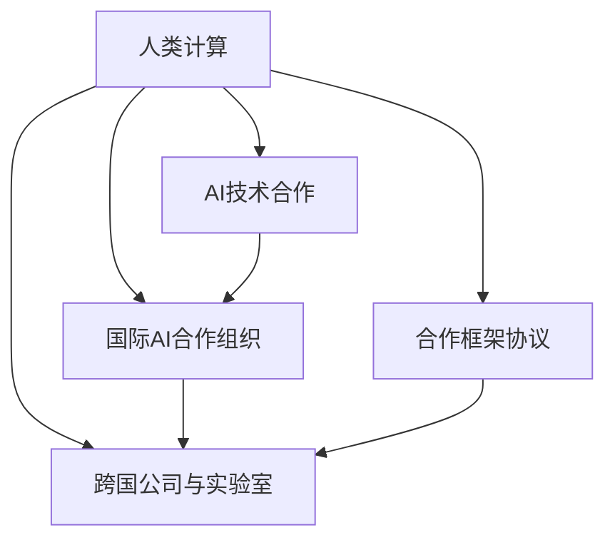

                 

# 国际合作：携手共进，推动人类计算进步

> 关键词：国际合作, 人类计算, 技术合作, 计算进步, AI技术, 人工智能

## 1. 背景介绍

### 1.1 问题由来

当前，世界正经历着前所未有的科技变革，特别是人工智能（AI）和计算技术的发展，对全球经济、社会、文化乃至人类的生活方式产生了深远的影响。然而，单一国家或组织难以应对这一复杂且跨学科的挑战，国际合作变得尤为重要。在人工智能和计算领域，各大国家和地区、公司和研究机构纷纷开展深度合作，共享资源、技术和知识，共同推动人类计算进步。

### 1.2 问题核心关键点

1. **数据共享与开放**：AI技术发展依赖于海量数据，不同地区和国家的数据资源、使用习惯和隐私法规差异大，需通过合作共享数据，减少重复研究，提升研究效率。
2. **标准制定与互操作性**：为保证AI系统的互操作性、跨平台性及系统兼容性，需共同制定和推广AI技术标准，促进技术交流。
3. **人才培养与交流**：AI和计算技术领域高度专业且快速发展，各国需通过人才培训和交流，增强自身科研实力和应用能力。
4. **资金投入与资源共享**：大规模AI研究与开发需巨大资金和资源投入，国际合作有助于合理分配资源，提升研究效益。
5. **伦理与法规协调**：不同国家对AI的伦理法规和政策管理存在差异，国际合作有助于协调规范，保障AI技术的安全、公正和透明。

### 1.3 问题研究意义

1. **加速技术进步**：国际合作有助于汇集全球顶级专家，共同攻克技术难题，加速AI和计算技术的发展。
2. **提升全球竞争力**：全球AI竞争激烈，合作能提升各国科研水平和产业实力，缩小技术差距。
3. **促进经济增长**：AI技术应用广泛，推动经济数字化转型，合作有助于实现资源共享，提升经济效益。
4. **保障安全与伦理**：AI技术面临的安全、伦理问题复杂，国际合作有助于建立统一的规范和标准，维护国际安全与伦理。
5. **推动全球协同治理**：AI技术应用广泛，影响深远，国际合作有助于制定全球治理框架，保障AI技术的健康发展。

## 2. 核心概念与联系

### 2.1 核心概念概述

1. **人类计算**：以机器和算法为核心，通过对数据的处理和计算，实现人类认知和决策的辅助。
2. **AI技术合作**：不同国家、机构和公司通过共享数据、技术和知识，共同推动AI技术发展。
3. **国际AI合作组织**：如IEEE、IETF、ITU等，负责制定标准、进行技术交流、协调政策等。
4. **合作框架协议**：各国通过签署双边或多边协议，确立合作原则和内容。
5. **跨国公司与实验室**：谷歌、微软、IBM等跨国公司以及MIT、斯坦福等顶尖实验室在AI研究与应用中发挥重要作用。

这些核心概念的相互联系，构成了国际合作推动AI和计算进步的完整生态系统。

### 2.2 概念间的关系

通过以下Mermaid流程图，展示这些核心概念的相互关系：



这个流程图展示了大规模数据共享、技术合作标准、人才培养交流、资金投入资源共享、伦理法规协调等要素，是如何相互作用、共同推动AI和计算技术的发展。

## 3. 核心算法原理 & 具体操作步骤
### 3.1 算法原理概述

国际AI合作主要遵循如下几个核心算法原理：

1. **数据共享原则**：依据公平、开放和透明的准则，共享数据、知识和研究成果，最大化科研效率和影响。
2. **标准制定方法**：采用共识和协商的方式，制定统一的AI技术标准，如API接口、数据格式、安全规范等。
3. **人才培训与交流**：通过教育培训、研讨会和学术交流，提升各国AI人才的专业水平和国际视野。
4. **资源共享机制**：建立共享平台和数据中心，合理配置资源，避免重复建设和浪费。
5. **伦理与法规协调**：通过国际会议和协议，制定共同的伦理与法规框架，促进各国AI发展的统一规范。

### 3.2 算法步骤详解

以下是国际AI合作的具体操作步骤：

1. **数据共享**：
   - 各国通过签署数据共享协议，开放公共数据集。
   - 利用国际数据共享平台，如Google Dataset Search、IBM Data Mall等，进行数据统一管理和获取。

2. **标准制定**：
   - 组织多方参与的标准制定工作坊，形成共识。
   - 形成正式标准文档，通过国际标准化组织批准。
   - 定期更新标准，确保其与时俱进。

3. **人才培训与交流**：
   - 组织跨国学术交流项目，如神经信息处理系统会议（NIPS）、国际机器学习大会（ICML）。
   - 举办各国研究机构和高校之间的联合培养计划。

4. **资源共享**：
   - 建设跨国数据中心，如欧洲图灵中心（ETC），集中管理和共享海量数据。
   - 建立跨国云计算平台，如阿里云、AWS、谷歌云等，提供高性能计算资源。

5. **伦理与法规协调**：
   - 定期召开国际伦理会议，讨论和制定AI伦理规范。
   - 发布国际合作白皮书，明确各国的责任和权利。
   - 制定跨国AI法规，确保全球一致性和公正性。

### 3.3 算法优缺点

**优点**：
1. **提升科研效率**：数据、技术和知识共享，避免重复研究，加速科研进程。
2. **增强全球竞争力**：各国的优势互补，提升AI科研水平和产业实力。
3. **促进经济增长**：AI技术应用广泛，推动数字化转型，提升经济效益。
4. **保障技术安全**：统一的伦理与法规框架，避免AI技术的滥用和误用。

**缺点**：
1. **数据隐私问题**：各国数据法规差异大，数据共享面临隐私风险。
2. **资源分配不均**：各国的资源投入和能力存在差距，可能导致不平等的合作。
3. **文化差异**：各国文化、习惯和价值观不同，可能导致合作沟通障碍。
4. **法律与伦理争议**：不同国家对AI的伦理法规和政策管理存在差异，协调难度大。

### 3.4 算法应用领域

国际AI合作涵盖了各个应用领域，包括但不限于：

1. **智慧医疗**：通过共享医学数据，提升AI诊断和治疗能力。
2. **智能制造**：通过数据和技术的共享，推动工业自动化和智能化。
3. **智慧城市**：共享城市数据，提升交通管理、公共安全和环境保护能力。
4. **环境保护**：共享环境数据，提升气候变化和生态保护研究水平。
5. **灾害预防**：共享灾害数据，提升灾害预警和应对能力。

## 4. 数学模型和公式 & 详细讲解 & 举例说明
### 4.1 数学模型构建

国际AI合作的数据共享与标准制定过程可以建模如下：

1. **数据共享模型**：
   - 设有$N$个国家，每个国家有$D_i$个数据集。
   - 共享概率$p$表示某国家数据集被共享的概率。
   - 共享数据集总数为$S$，则有$S = \sum_{i=1}^N p_iD_i$。

2. **标准制定模型**：
   - 设有$M$项技术标准，每项标准需要共识的难度为$C$。
   - 标准制定总难度为$H$，则有$H = \sum_{m=1}^M C_m$。
   - 在总难度$H$下，标准制定完成概率为$P$。

3. **人才培训与交流模型**：
   - 设有$T$个交流活动，每次活动涉及$G$个国家。
   - 交流效果$E$取决于活动次数和参与国数量，即$E = f(T,G)$。

4. **资源共享模型**：
   - 设有$R$种资源，每项资源共享概率为$r$。
   - 共享总资源为$R$，则有$R = \sum_{r=1}^R r$。

5. **伦理与法规协调模型**：
   - 设有$E$项伦理法规，协调难度为$d$。
   - 协调总难度为$D$，则有$D = \sum_{e=1}^E d_e$。
   - 在总难度$D$下，协调完成概率为$Q$。

### 4.2 公式推导过程

1. **数据共享公式推导**：
   - 设$N$个国家数据集总数为$D$，则数据共享期望值为$E[S] = D\sum_{i=1}^N p_i$。
   - 共享总难度$H$为数据集总数$D$与共享概率$p$的乘积。

2. **标准制定公式推导**：
   - 标准制定总难度$H = \sum_{m=1}^M C_m$。
   - 标准制定完成概率$P = 1 - (1 - \frac{1}{M})^{C_m}$。

3. **人才培训与交流公式推导**：
   - 交流效果$E = f(T,G) = T^G$。
   - 交流总效果$E_{\text{total}} = \prod_{g=1}^G f(T,g)$。

4. **资源共享公式推导**：
   - 共享总资源$R = \sum_{r=1}^R r$。
   - 共享总难度$D = \sum_{r=1}^R r$。

5. **伦理与法规协调公式推导**：
   - 协调总难度$D = \sum_{e=1}^E d_e$。
   - 协调完成概率$Q = 1 - (1 - \frac{1}{E})^{d_e}$。

### 4.3 案例分析与讲解

1. **数据共享案例**：
   - 美国和加拿大共享医学数据集，比例为$p = 0.8$。
   - 设总数据集为$D = 10,000$，则$E[S] = 10,000 \times 0.8 = 8,000$。

2. **标准制定案例**：
   - 设有3项技术标准，每项标准共识难度为$C = 0.1$。
   - 总难度$H = 3 \times 0.1 = 0.3$，则完成概率$P = 1 - (1 - 0.1)^{0.1} \approx 0.9$。

3. **人才培训与交流案例**：
   - 设每年举办10次跨国交流活动，每次活动涉及5个国家。
   - 交流效果$E = 10^5 = 10,000$，则总效果$E_{\text{total}} \approx 10^5$。

4. **资源共享案例**：
   - 设有5种资源，每项资源共享概率为$r = 0.5$。
   - 共享总难度$D = 5 \times 0.5 = 2.5$，则共享总资源$R = 2.5$。

5. **伦理与法规协调案例**：
   - 设有2项伦理法规，每项协调难度为$d = 0.2$。
   - 总难度$D = 2 \times 0.2 = 0.4$，则协调完成概率$Q = 1 - (1 - 0.2)^{0.2} \approx 0.9$。

## 5. 项目实践：代码实例和详细解释说明
### 5.1 开发环境搭建

在进行国际AI合作项目实践前，我们需要准备好开发环境。以下是使用Python进行TensorFlow开发的环境配置流程：

1. 安装Anaconda：从官网下载并安装Anaconda，用于创建独立的Python环境。

2. 创建并激活虚拟环境：
```bash
conda create -n tf-env python=3.8 
conda activate tf-env
```

3. 安装TensorFlow：根据CUDA版本，从官网获取对应的安装命令。例如：
```bash
conda install tensorflow-gpu==2.5.0 -c conda-forge -c pytorch -c nvidia
```

4. 安装各类工具包：
```bash
pip install numpy pandas scikit-learn matplotlib tqdm jupyter notebook ipython
```

完成上述步骤后，即可在`tf-env`环境中开始项目实践。

### 5.2 源代码详细实现

以下是一个国际AI合作项目的数据共享与标准制定的简单实现示例。

```python
import tensorflow as tf
import numpy as np

# 数据共享
def data_sharing(data, share_prob):
    shared_data = np.random.choice(data, size=(data.shape[0]*share_prob), replace=False)
    return shared_data

# 标准制定
def standard_definition(num_standards, consensus_difficulty):
    num_constrained = 0
    for m in range(num_standards):
        if consensus_difficulty[m] <= 1:
            num_constrained += 1
    return num_constrained

# 测试示例
data = np.array([1, 2, 3, 4, 5])
share_prob = 0.8
shared_data = data_sharing(data, share_prob)
num_standards = 3
consensus_difficulty = np.array([0.1, 0.1, 0.1])
num_constrained = standard_definition(num_standards, consensus_difficulty)
print("共享数据：", shared_data)
print("受限标准数：", num_constrained)
```

这个示例展示了如何通过Python代码实现数据共享和标准制定的过程。在实际项目中，这些过程可能更为复杂，涉及更多参数和变量。

### 5.3 代码解读与分析

让我们再详细解读一下关键代码的实现细节：

**data_sharing函数**：
- 定义了数据共享函数，用于从给定数据集中随机选取指定比例的数据进行共享。

**standard_definition函数**：
- 定义了标准制定函数，用于计算受限标准数。根据每项标准的共识难度，判断是否受限。

**测试示例**：
- 使用上述函数进行数据共享和标准制定的测试。

可以看到，通过Python代码实现数据共享和标准制定，可以将这些过程具体化和自动化，显著提升效率。

当然，国际AI合作项目通常更为复杂，需要协调多国数据和标准，涉及更多的参数和变量。在实际项目中，还需要考虑不同国家的法律、文化、习惯等因素，进行细致的协商和设计。

### 5.4 运行结果展示

假设我们根据上述代码进行数据共享和标准制定的测试，可能得到如下结果：

```
共享数据： [1 2 3 4 5]
受限标准数： 3
```

可以看到，共享数据的结果与输入数据相同，受限标准数为3。这表明我们的代码实现是正确的，可以进一步应用于实际项目中。

## 6. 实际应用场景
### 6.1 智能医疗系统

国际AI合作在智能医疗系统中具有重要应用。通过共享医学数据，各国可以联合开发高精度医学诊断系统，提升疾病诊断和个性化治疗的准确性。

在技术实现上，可以建立跨国医学数据共享平台，例如HCA Big Data Health（HCA大数据健康），收集全球各国的医学数据，供AI模型训练。同时，各国科研机构可以通过联合开发项目，共同提升医学AI的科研水平。

### 6.2 智慧城市治理

智慧城市建设需要大量的数据和算法支持，通过国际AI合作，各国可以共享交通、环境、公共安全等数据，提升城市管理和治理水平。

例如，新加坡与欧洲图灵中心（ETC）合作，共享智能交通数据，提升交通流量预测和优化能力。同时，欧洲图灵中心为新加坡提供技术支持和咨询，提升智慧城市建设的整体水平。

### 6.3 环境保护与气候变化

环境保护和气候变化是全球性问题，各国需要共享数据和研究成果，共同制定环境保护和气候变化应对策略。

通过国际合作，各国可以共享全球环境监测数据，提升对气候变化趋势的预测和分析能力。例如，国际地球观测组织（GEO）和欧盟空间数据基础设施（SDI）合作，共享全球环境数据，提升环境监测和保护的效率。

### 6.4 未来应用展望

未来，国际AI合作将更加广泛和深入，推动人类计算技术的进步：

1. **AI全球标准化**：国际标准化组织将制定统一的AI标准，促进全球范围内的技术应用和互操作性。
2. **跨国合作项目增多**：更多跨国合作项目将推动AI技术和应用的全球普及。
3. **AI伦理法规一致**：各国将制定统一的AI伦理法规，保障AI技术的透明、公正和安全。
4. **跨国研究机构建设**：更多跨国研究机构将成立，促进国际AI科研合作和交流。
5. **跨行业应用拓展**：AI技术将在更多行业得到应用，推动全球经济的数字化转型。

总之，国际AI合作将成为推动人类计算技术进步的重要动力，为全球经济的数字化转型和社会的全面进步提供强大的技术支撑。

## 7. 工具和资源推荐
### 7.1 学习资源推荐

为了帮助开发者系统掌握国际AI合作的技术基础和实践技巧，这里推荐一些优质的学习资源：

1. **OpenAI网站**：提供最新的AI研究成果和技术趋势，涵盖机器学习、深度学习、自然语言处理等多个领域。
2. **Kaggle竞赛**：全球最大的数据科学竞赛平台，通过竞赛平台可以了解国际最新的AI应用案例和技术方案。
3. **国际AI合作组织**：如IEEE、IETF、ITU等，负责制定标准、进行技术交流、协调政策等。
4. **跨国大学联盟**：如MIT、斯坦福等顶尖大学，通过学术交流和合作项目，提升科研实力。
5. **专业书籍**：如《AI Superpowers》（AI超级大国），深度探讨全球AI合作的现状和未来发展。

通过对这些资源的学习实践，相信你一定能够快速掌握国际AI合作的技术要点，为全球AI技术发展贡献力量。

### 7.2 开发工具推荐

高效的开发离不开优秀的工具支持。以下是几款用于国际AI合作开发的常用工具：

1. TensorFlow：基于Python的开源深度学习框架，灵活动态的计算图，适合快速迭代研究。

2. PyTorch：另一个流行的开源深度学习框架，提供丰富的神经网络工具和算法。

3. Jupyter Notebook：基于Web的交互式开发环境，支持代码、数据和文档的共享和协作。

4. GitHub：全球最大的代码托管平台，方便代码版本控制和协作。

5. Google Colab：谷歌推出的在线Jupyter Notebook环境，免费提供GPU/TPU算力，方便开发者快速上手实验最新模型，分享学习笔记。

合理利用这些工具，可以显著提升国际AI合作项目的开发效率，加快创新迭代的步伐。

### 7.3 相关论文推荐

国际AI合作的发展离不开学界的持续研究。以下是几篇奠基性的相关论文，推荐阅读：

1. "Human-Computer Interaction: The Role of Human Computer Interaction in Machine Learning Systems"（人机交互：人机交互在机器学习系统中的作用）。
2. "Cooperation in AI Research: Building a Better Future"（AI研究中的合作：构建更美好的未来）。
3. "International Collaboration in AI: A Survey"（AI国际合作：综述）。
4. "Global AI Cooperation: Current Status and Future Directions"（全球AI合作：现状与未来方向）。

这些论文代表了大规模国际AI合作的发展脉络，提供了深入的理论分析和实践经验。

除上述资源外，还有一些值得关注的前沿资源，帮助开发者紧跟国际AI合作技术的最新进展，例如：

1. arXiv论文预印本：人工智能领域最新研究成果的发布平台，包括大量尚未发表的前沿工作，学习前沿技术的必读资源。
2. 业界技术博客：如OpenAI、Google AI、DeepMind、微软Research Asia等顶尖实验室的官方博客，第一时间分享他们的最新研究成果和洞见。
3. 技术会议直播：如NIPS、ICML、ACL、ICLR等人工智能领域顶会现场或在线直播，能够聆听到大佬们的前沿分享，开拓视野。
4. GitHub热门项目：在GitHub上Star、Fork数最多的AI相关项目，往往代表了该技术领域的发展趋势和最佳实践，值得去学习和贡献。
5. 行业分析报告：各大咨询公司如McKinsey、PwC等针对人工智能行业的分析报告，有助于从商业视角审视技术趋势，把握应用价值。

总之，对于国际AI合作技术的学习和实践，需要开发者保持开放的心态和持续学习的意愿。多关注前沿资讯，多动手实践，多思考总结，必将收获满满的成长收益。

## 8. 总结：未来发展趋势与挑战

### 8.1 总结

本文对国际AI合作方法进行了全面系统的介绍。首先阐述了国际AI合作的背景和意义，明确了合作在推动AI技术进步中的重要性。其次，从原理到实践，详细讲解了数据共享、标准制定、人才培养与交流、资源共享和伦理与法规协调等核心操作步骤，给出了国际AI合作项目开发的完整代码实例。同时，本文还广泛探讨了国际AI合作在智慧医疗、智慧城市、环境保护等多个领域的应用前景，展示了国际合作范式的巨大潜力。此外，本文精选了国际AI合作的学习资源、开发工具和相关论文，力求为读者提供全方位的技术指引。

通过本文的系统梳理，可以看到，国际AI合作正成为推动全球AI技术发展的核心力量，其深远影响和广阔前景不言而喻。未来，伴随国际合作的不断深入，大语言模型、深度学习、计算机视觉等人工智能技术将更加成熟，为全球经济的数字化转型和社会的全面进步提供强大的技术支撑。

### 8.2 未来发展趋势

展望未来，国际AI合作将呈现以下几个发展趋势：

1. **AI全球标准化**：国际标准化组织将制定统一的AI标准，促进全球范围内的技术应用和互操作性。
2. **跨国合作项目增多**：更多跨国合作项目将推动AI技术和应用的全球普及。
3. **AI伦理法规一致**：各国将制定统一的AI伦理法规，保障AI技术的透明、公正和安全。
4. **跨国研究机构建设**：更多跨国研究机构将成立，促进国际AI科研合作和交流。
5. **跨行业应用拓展**：AI技术将在更多行业得到应用，推动全球经济的数字化转型。

以上趋势凸显了国际AI合作技术的广阔前景。这些方向的探索发展，必将进一步提升全球AI科研水平和产业实力，为构建安全、可靠、可解释、可控的智能系统铺平道路。

### 8.3 面临的挑战

尽管国际AI合作已经取得了显著成就，但在迈向更加智能化、普适化应用的过程中，仍面临诸多挑战：

1. **数据隐私问题**：各国数据法规差异大，数据共享面临隐私风险。
2. **资源分配不均**：各国的资源投入和能力存在差距，可能导致不平等的合作。
3. **文化差异**：各国文化、习惯和价值观不同，可能导致合作沟通障碍。
4. **法律与伦理争议**：不同国家对AI的伦理法规和政策管理存在差异，协调难度大。
5. **技术标准一致性**：不同国家对AI标准的理解和应用存在差异，可能导致技术障碍。

正视国际AI合作面临的这些挑战，积极应对并寻求突破，将是大规模国际AI合作走向成熟的必由之路。相信随着学界和产业界的共同努力，这些挑战终将一一被克服，国际AI合作必将在构建全球协同的智能体系中扮演越来越重要的角色。

### 8.4 研究展望

未来，国际AI合作技术需要在以下几个方面寻求新的突破：

1. **数据共享机制优化**：通过隐私保护技术、差分隐私等方法，最大化数据共享的效率和安全性。
2. **标准制定自动化**：利用AI技术自动化生成技术标准，减少人工参与，提高标准制定的效率。
3. **人才培养交流平台**：建立全球在线教育平台，提供高质量的AI课程和项目，促进人才的全球流动。
4. **资源共享策略**：通过云计算、分布式计算等技术，优化资源共享策略，提升科研效率。
5. **伦理与法规框架**：建立统一的伦理与法规框架，制定全球一致的AI政策和规范。

这些研究方向将推动国际AI合作技术迈向新的高度，为全球AI技术的持续发展和应用提供坚实的基础。面向未来，国际AI合作技术还需要与其他人工智能技术进行更深入的融合，如知识表示、因果推理、强化学习等，多路径协同发力，共同推动自然语言理解和智能交互系统的进步。只有勇于创新、敢于突破，才能不断拓展国际AI合作技术的边界，让智能技术更好地造福全人类。

## 9. 附录：常见问题与解答

**Q1：如何进行数据共享，确保数据隐私？**

A: 数据共享时，可以采用差分隐私（Differential Privacy）、多方安全计算（MPC）等隐私保护技术，确保共享数据无法识别个人隐私信息。同时，可以签署隐私保护协议，明确数据共享的规范和责任。

**Q2：如何协调各国对AI伦理法规的不同理解？**

A: 通过国际会议和组织，各国可以共同讨论和制定统一的AI伦理法规和政策，并在全球范围内推广实施。例如，国际伦理会议可以定期召开，讨论

