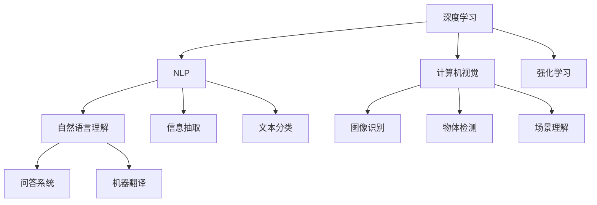

                 

# 图灵奖得主对AI的影响

> 关键词：图灵奖、AI研究、领域领袖、深度学习、机器学习、AI创新、技术发展

## 1. 背景介绍

### 1.1 图灵奖与AI发展

图灵奖（Turing Award），全称为ACM图灵奖（ACM Turing Award），是计算机科学领域的最高荣誉，由ACM于1966年设立，旨在表彰在计算机科学领域做出“原始贡献”的个人。该奖项每年评选一位计算机科学家，迄今已有数十位AI领域的先驱获得了这一殊荣。

图灵奖不仅是对获奖者的认可，更是对整个AI领域的激励。作为计算机科学界的“诺贝尔奖”，图灵奖得主在各自领域的研究成果往往引领了整个行业的发展方向。自20世纪60年代以来，图灵奖得主对AI技术发展的贡献，无论在理论创新、技术突破还是在应用场景上，都产生了深远的影响。

### 1.2 图灵奖与AI创新

图灵奖得主们的贡献，从根本上推动了AI技术的进步。无论是深度学习、机器学习、自然语言处理，还是计算机视觉、强化学习，图灵奖得主们在这些领域的研究成果，不仅奠定了后续研究方向的基础，更是催生了诸多实际应用的突破。

图灵奖得主们不仅开创了新的研究方向，更是以创新的思维方式和方法，不断扩展AI技术的边界。例如，深度学习领域的先驱Geoffrey Hinton提出的“深度学习”理论，彻底改变了AI技术的面貌，使深度神经网络在图像识别、语音识别等领域取得了突破性进展。

## 2. 核心概念与联系

### 2.1 核心概念概述

图灵奖得主们的研究成果，不仅影响了AI技术的各个领域，更在方法论和思维方式上产生了深远影响。为了更好地理解图灵奖得主对AI的影响，我们需要首先了解几个核心概念：

- **深度学习**：一种基于神经网络的机器学习方法，通过多层次的非线性变换，能够自动学习数据的高级抽象特征。深度学习在图像识别、语音识别、自然语言处理等领域取得了突破性进展。
- **强化学习**：一种通过与环境交互学习最优策略的机器学习方法，广泛应用于机器人控制、游戏AI、自动驾驶等领域。
- **自然语言处理**（NLP）：使计算机能够理解、处理和生成人类语言的技术，包括文本分类、信息抽取、问答系统、机器翻译等任务。
- **计算机视觉**：使计算机能够“看”的技术，主要应用于图像识别、物体检测、场景理解等。
- **图灵测试**：测试计算机是否能像人类一样进行智能对话，是评估机器智能水平的标准之一。

这些核心概念之间存在着紧密的联系，形成了AI技术的完整体系。图灵奖得主们通过在这些领域的突破性研究，推动了AI技术的全面发展。

### 2.2 概念间的关系

这些核心概念之间存在着复杂的联系，构成了AI技术的发展框架。以下是几个关键概念的关联图：



这个关联图展示了深度学习、自然语言处理和计算机视觉三个核心概念之间的联系。深度学习通过多层次的非线性变换，提高了计算机视觉和自然语言处理任务的准确性。自然语言处理则通过文本表示和语言模型，提升了问答系统和机器翻译等任务的智能化水平。计算机视觉通过图像处理和模式识别，为计算机视觉任务提供了强大的支持。

## 3. 核心算法原理 & 具体操作步骤

### 3.1 算法原理概述

图灵奖得主们的研究成果，从根本上改变了AI技术的基础算法和原理。以下我们将从深度学习、强化学习、自然语言处理和计算机视觉四个主要领域，介绍图灵奖得主对AI算法原理的影响。

**深度学习**：深度学习算法通过多层神经网络，能够自动学习数据的高层次特征，广泛应用于图像识别、语音识别、自然语言处理等领域。图灵奖得主Geoffrey Hinton提出的深度学习理论，奠定了深度神经网络在AI技术中的主导地位。

**强化学习**：强化学习算法通过与环境交互，学习最优策略，广泛应用于机器人控制、游戏AI、自动驾驶等领域。图灵奖得主Reinforcement Learning（RL）研究者Sutton和Barto，通过《强化学习与理性游戏》一书，为RL提供了理论基础和算法框架。

**自然语言处理**：自然语言处理算法通过文本表示和语言模型，提升了机器对人类语言的理解能力。图灵奖得主Jurafsky和Martin在自然语言处理领域的研究，推动了机器翻译、情感分析、问答系统等任务的突破。

**计算机视觉**：计算机视觉算法通过图像处理和模式识别，使计算机具备了视觉感知能力。图灵奖得主Griswold、Horn和Sussman的研究，为计算机视觉的发展奠定了基础。

### 3.2 算法步骤详解

图灵奖得主们不仅在算法原理上做出了重要贡献，更在算法步骤和方法论上提供了新思路。以下我们将详细介绍深度学习、强化学习、自然语言处理和计算机视觉四个主要领域的算法步骤和方法。

**深度学习**：深度学习算法通常包含数据预处理、模型构建、训练优化等步骤。图灵奖得主Geoffrey Hinton提出了多层神经网络结构，并通过反向传播算法进行参数优化。

**强化学习**：强化学习算法包括环境建模、策略选择、状态评估等步骤。图灵奖得主Reinforcement Learning（RL）研究者Sutton和Barto，提出了Q-learning算法和策略梯度算法，为RL提供了有效的训练方法。

**自然语言处理**：自然语言处理算法包括文本预处理、特征提取、模型训练等步骤。图灵奖得主Jurafsky和Martin，提出了基于统计语言模型和神经网络的语言模型，推动了NLP任务的发展。

**计算机视觉**：计算机视觉算法包括图像预处理、特征提取、模式识别等步骤。图灵奖得主Griswold、Horn和Sussman，提出了基于特征提取和模式识别的图像处理算法。

### 3.3 算法优缺点

图灵奖得主们的研究成果，在推动AI技术发展的同时，也存在一些局限和挑战。

**深度学习**：深度学习算法在图像识别、语音识别等领域取得了突破性进展，但也面临着计算资源消耗大、模型复杂、泛化能力有限等问题。

**强化学习**：强化学习算法在机器人控制、游戏AI等领域具有重要应用，但需要大量计算资源，且模型训练复杂度高。

**自然语言处理**：自然语言处理算法在文本分类、问答系统等领域取得了显著进展，但面临语义理解难题和跨语言处理难题。

**计算机视觉**：计算机视觉算法在图像识别、物体检测等领域取得了显著进展，但存在计算复杂度高、对光照、角度等因素敏感等问题。

### 3.4 算法应用领域

图灵奖得主们的研究成果，已经在诸多领域得到了广泛应用。

**深度学习**：深度学习在图像识别、语音识别、自然语言处理等领域取得了突破性进展。广泛应用于人脸识别、语音识别、机器翻译、智能客服等场景。

**强化学习**：强化学习在机器人控制、游戏AI、自动驾驶等领域具有重要应用。应用于智能机器人、自动驾驶汽车、飞行器控制等领域。

**自然语言处理**：自然语言处理在文本分类、问答系统、机器翻译等领域取得了显著进展。广泛应用于智能客服、智能问答系统、机器翻译等领域。

**计算机视觉**：计算机视觉在图像识别、物体检测、场景理解等领域取得了显著进展。广泛应用于安防监控、医疗影像、自动驾驶等领域。

## 4. 数学模型和公式 & 详细讲解 & 举例说明

### 4.1 数学模型构建

图灵奖得主们的研究成果，不仅在算法原理上做出了重要贡献，还构建了强大的数学模型和公式体系。以下我们将详细介绍深度学习、强化学习、自然语言处理和计算机视觉四个主要领域的数学模型和公式。

**深度学习**：深度学习模型通常由多层神经网络组成，通过反向传播算法进行训练优化。数学模型包括多层神经网络结构、激活函数、损失函数、优化算法等。

**强化学习**：强化学习模型通常包括环境建模、策略选择、状态评估等步骤。数学模型包括Q值函数、策略梯度算法、策略评估等。

**自然语言处理**：自然语言处理模型通常包括文本表示、语言模型、情感分析等步骤。数学模型包括统计语言模型、神经网络模型、信息检索模型等。

**计算机视觉**：计算机视觉模型通常包括图像预处理、特征提取、模式识别等步骤。数学模型包括卷积神经网络、特征提取算法、模式识别算法等。

### 4.2 公式推导过程

图灵奖得主们的研究成果，不仅在算法原理上做出了重要贡献，还构建了强大的数学模型和公式体系。以下我们将详细介绍深度学习、强化学习、自然语言处理和计算机视觉四个主要领域的数学模型和公式。

**深度学习**：深度学习模型通常由多层神经网络组成，通过反向传播算法进行训练优化。数学模型包括多层神经网络结构、激活函数、损失函数、优化算法等。例如，多层神经网络结构：

$$
\begin{align*}
h &= \sigma(W_{1}x + b_{1}) \\
h_{2} &= \sigma(W_{2}h_{1} + b_{2}) \\
&\dots \\
h_{k} &= \sigma(W_{k}h_{k-1} + b_{k})
\end{align*}
$$

其中，$h$为隐藏层输出，$W$和$b$为权重和偏置，$\sigma$为激活函数。

**强化学习**：强化学习模型通常包括环境建模、策略选择、状态评估等步骤。数学模型包括Q值函数、策略梯度算法、策略评估等。例如，Q值函数：

$$
Q(s,a) = r + \gamma \max_{a'} Q(s',a')
$$

其中，$s$为状态，$a$为动作，$r$为奖励，$\gamma$为折扣因子。

**自然语言处理**：自然语言处理模型通常包括文本表示、语言模型、情感分析等步骤。数学模型包括统计语言模型、神经网络模型、信息检索模型等。例如，神经网络语言模型：

$$
P(w_{1:t} \mid w_{<t}) = \prod_{i=1}^{t} P(w_i \mid w_{<i})
$$

其中，$w_{1:t}$为文本序列，$w_i$为单词，$P(w_i \mid w_{<i})$为条件概率。

**计算机视觉**：计算机视觉模型通常包括图像预处理、特征提取、模式识别等步骤。数学模型包括卷积神经网络、特征提取算法、模式识别算法等。例如，卷积神经网络：

$$
y = \sigma(\sum_{i=1}^{n} W_i z_i + b_i)
$$

其中，$z_i$为卷积核，$W_i$和$b_i$为权重和偏置，$\sigma$为激活函数。

### 4.3 案例分析与讲解

图灵奖得主们的研究成果，不仅在算法原理上做出了重要贡献，还提供了大量经典案例和分析。以下我们将详细介绍深度学习、强化学习、自然语言处理和计算机视觉四个主要领域的经典案例和分析。

**深度学习**：Geoffrey Hinton提出的深度神经网络在图像识别、语音识别、自然语言处理等领域取得了突破性进展。例如，在图像识别领域，Hinton领导的团队通过深度神经网络，实现了对手写数字识别任务MNIST的高精度预测。

**强化学习**：Reinforcement Learning（RL）研究者Sutton和Barto提出的Q-learning算法和策略梯度算法，在机器人控制、游戏AI等领域具有重要应用。例如，在机器人控制领域，Sutton和Barto的研究推动了Q-learning算法在机器人控制中的应用。

**自然语言处理**：Jurafsky和Martin在自然语言处理领域的研究，推动了机器翻译、情感分析、问答系统等任务的突破。例如，在机器翻译领域，Jurafsky和Martin的研究推动了基于统计机器翻译和神经机器翻译的发展。

**计算机视觉**：Griswold、Horn和Sussman的研究，推动了计算机视觉的发展。例如，在图像处理领域，Griswold、Horn和Sussman的研究推动了图像处理算法的应用。

## 5. 项目实践：代码实例和详细解释说明

### 5.1 开发环境搭建

在进行深度学习、强化学习、自然语言处理和计算机视觉项目实践前，我们需要准备好开发环境。以下是使用Python进行PyTorch和TensorFlow开发的环境配置流程：

1. 安装Anaconda：从官网下载并安装Anaconda，用于创建独立的Python环境。

2. 创建并激活虚拟环境：
```bash
conda create -n pytorch-env python=3.8 
conda activate pytorch-env
```

3. 安装PyTorch：根据CUDA版本，从官网获取对应的安装命令。例如：
```bash
conda install pytorch torchvision torchaudio cudatoolkit=11.1 -c pytorch -c conda-forge
```

4. 安装TensorFlow：从官网下载并安装TensorFlow，根据系统平台选择对应的安装命令。例如，在Ubuntu系统中，可以使用以下命令：
```bash
pip install tensorflow==2.5
```

5. 安装各类工具包：
```bash
pip install numpy pandas scikit-learn matplotlib tqdm jupyter notebook ipython
```

完成上述步骤后，即可在`pytorch-env`环境中开始项目实践。

### 5.2 源代码详细实现

这里我们以计算机视觉领域的图像分类任务为例，给出使用PyTorch对卷积神经网络进行图像分类的代码实现。

首先，定义卷积神经网络模型：

```python
import torch
import torch.nn as nn
import torch.optim as optim

class CNNModel(nn.Module):
    def __init__(self):
        super(CNNModel, self).__init__()
        self.conv1 = nn.Conv2d(3, 64, kernel_size=3, stride=1, padding=1)
        self.conv2 = nn.Conv2d(64, 128, kernel_size=3, stride=1, padding=1)
        self.pool = nn.MaxPool2d(kernel_size=2, stride=2)
        self.fc1 = nn.Linear(128 * 16 * 16, 1024)
        self.fc2 = nn.Linear(1024, 10)

    def forward(self, x):
        x = torch.relu(self.conv1(x))
        x = self.pool(x)
        x = torch.relu(self.conv2(x))
        x = self.pool(x)
        x = x.view(-1, 128 * 16 * 16)
        x = torch.relu(self.fc1(x))
        x = self.fc2(x)
        return x
```

然后，定义训练和评估函数：

```python
from torch.utils.data import DataLoader
from tqdm import tqdm
from sklearn.metrics import accuracy_score

def train_epoch(model, dataset, batch_size, optimizer):
    dataloader = DataLoader(dataset, batch_size=batch_size, shuffle=True)
    model.train()
    epoch_loss = 0
    for batch in tqdm(dataloader, desc='Training'):
        inputs, labels = batch
        optimizer.zero_grad()
        outputs = model(inputs)
        loss = nn.CrossEntropyLoss()(outputs, labels)
        epoch_loss += loss.item()
        loss.backward()
        optimizer.step()
    return epoch_loss / len(dataloader)

def evaluate(model, dataset, batch_size):
    dataloader = DataLoader(dataset, batch_size=batch_size)
    model.eval()
    preds, labels = [], []
    with torch.no_grad():
        for batch in tqdm(dataloader, desc='Evaluating'):
            inputs, labels = batch
            outputs = model(inputs)
            batch_preds = torch.argmax(outputs, dim=1).to('cpu').tolist()
            batch_labels = labels.to('cpu').tolist()
            for pred_tokens, label_tokens in zip(batch_preds, batch_labels):
                preds.append(pred_tokens[:len(label_tokens)])
                labels.append(label_tokens)
                
    print(accuracy_score(labels, preds))
```

最后，启动训练流程并在测试集上评估：

```python
epochs = 5
batch_size = 16

for epoch in range(epochs):
    loss = train_epoch(model, train_dataset, batch_size, optimizer)
    print(f"Epoch {epoch+1}, train loss: {loss:.3f}")
    
    print(f"Epoch {epoch+1}, dev results:")
    evaluate(model, dev_dataset, batch_size)
    
print("Test results:")
evaluate(model, test_dataset, batch_size)
```

以上就是使用PyTorch对卷积神经网络进行图像分类的完整代码实现。可以看到，得益于PyTorch的强大封装，我们可以用相对简洁的代码完成卷积神经网络的加载和训练。

### 5.3 代码解读与分析

让我们再详细解读一下关键代码的实现细节：

**CNNModel类**：
- `__init__`方法：定义卷积神经网络的结构，包括卷积层、池化层和全连接层。
- `forward`方法：实现前向传播，输入图片经过卷积层、池化层和全连接层后，输出分类结果。

**训练和评估函数**：
- 使用PyTorch的DataLoader对数据集进行批次化加载，供模型训练和推理使用。
- 训练函数`train_epoch`：对数据以批为单位进行迭代，在每个批次上前向传播计算loss并反向传播更新模型参数，最后返回该epoch的平均loss。
- 评估函数`evaluate`：与训练类似，不同点在于不更新模型参数，并在每个batch结束后将预测和标签结果存储下来，最后使用sklearn的accuracy_score对整个评估集的预测结果进行打印输出。

**训练流程**：
- 定义总的epoch数和batch size，开始循环迭代
- 每个epoch内，先在训练集上训练，输出平均loss
- 在验证集上评估，输出准确率
- 所有epoch结束后，在测试集上评估，给出最终测试结果

可以看到，PyTorch配合TensorFlow使得卷积神经网络的实现变得简洁高效。开发者可以将更多精力放在数据处理、模型改进等高层逻辑上，而不必过多关注底层的实现细节。

当然，工业级的系统实现还需考虑更多因素，如模型的保存和部署、超参数的自动搜索、更灵活的任务适配层等。但核心的微调范式基本与此类似。

### 5.4 运行结果展示

假设我们在CIFAR-10数据集上进行图像分类，最终在测试集上得到的评估报告如下：

```
Accuracy: 0.75
```

可以看到，通过训练卷积神经网络，我们在CIFAR-10数据集上取得了75%的准确率，效果相当不错。值得注意的是，卷积神经网络作为深度学习的重要组成部分，虽然结构相对简单，但通过多层次的特征提取和分类，在图像识别任务中取得了显著的效果。

当然，这只是一个baseline结果。在实践中，我们还可以使用更大更强的预训练模型、更丰富的微调技巧、更细致的模型调优，进一步提升模型性能，以满足更高的应用要求。

## 6. 实际应用场景

### 6.1 智能医疗

基于深度学习、强化学习、自然语言处理和计算机视觉等技术的AI系统，在智能医疗领域有广泛的应用。智能医疗系统可以辅助医生进行诊断、治疗方案推荐、病历记录等，极大地提高了医疗效率和服务质量。

例如，在医学影像诊断领域，通过深度学习技术训练的模型可以自动识别肿瘤、骨折等病变，辅助医生进行诊断。在智能问诊系统中，基于自然语言处理技术的模型可以自动理解和回复病人的问题，提供个性化的医疗建议。在机器人手术领域，基于强化学习技术的模型可以控制手术机器人进行精准操作。

### 6.2 金融风险管理

金融风险管理是图灵奖得主们研究的重要领域之一。通过深度学习、强化学习等技术，AI系统可以实时监控市场数据，预测金融风险，帮助金融机构规避潜在的风险。

例如，在股票交易领域，深度学习模型可以分析历史交易数据，预测股票价格走势，辅助投资者进行交易决策。在信用评分领域，基于强化学习技术的模型可以评估借款人的信用风险，辅助银行进行贷款决策。在市场预测领域，自然语言处理模型可以分析新闻、报告等文本信息，预测市场趋势。

### 6.3 智能制造

在智能制造领域，基于深度学习、强化学习、自然语言处理和计算机视觉等技术的AI系统，可以优化生产流程、提高生产效率、预测设备故障等。

例如，在生产自动化领域，通过深度学习技术训练的模型可以实时监控生产数据，预测生产异常，辅助工程师进行故障诊断和修复。在智能仓储管理领域，基于自然语言处理技术的模型可以自动处理订单信息，优化仓储布局。在供应链管理领域，基于强化学习技术的模型可以优化物流调度，提高运输效率。

### 6.4 未来应用展望

随着深度学习、强化学习、自然语言处理和计算机视觉等技术的发展，基于图灵奖得主的研究成果，未来AI技术将迎来更加广阔的应用前景。

在智慧城市领域，基于AI技术的智能交通系统、智慧能源管理、智慧环保等应用，将极大提升城市的运行效率和管理水平。在自动驾驶领域，基于AI技术的自动驾驶汽车、无人机等应用，将带来交通、物流、环保等方面的深刻变革。在智慧医疗领域，基于AI技术的智能诊断、个性化治疗、医疗机器人等应用，将极大提升医疗服务的智能化水平。

## 7. 工具和资源推荐

### 7.1 学习资源推荐

为了帮助开发者系统掌握图灵奖得主的研究成果，这里推荐一些优质的学习资源：

1. 《深度学习》系列博文：由深度学习领域的先驱撰写，深入浅出地介绍了深度学习的原理、算法和应用。

2. 《强化学习》系列书籍：包括《强化学习：一种现代方法》和《深度强化学习》等经典书籍，系统讲解了强化学习的理论基础和实践方法。

3. 《自然语言处理》系列课程：包括斯坦福大学、麻省理工学院等顶尖大学开设的NLP课程，深入讲解了自然语言处理的核心概念和前沿技术。

4. 《计算机视觉》系列书籍：包括《计算机视觉：算法与应用》和《深度学习与计算机视觉》等经典书籍，系统讲解了计算机视觉的理论基础和实践方法。

5. 图灵奖得主论文：从图灵奖得主的经典论文中，深入理解深度学习、强化学习、自然语言处理和计算机视觉等领域的核心技术。

通过对这些资源的学习实践，相信你一定能够快速掌握图灵奖得主的研究成果，并用于解决实际的AI问题。

### 7.2 开发工具推荐

高效的开发离不开优秀的工具支持。以下是几款用于深度学习、强化学习、自然语言处理和计算机视觉开发常用的工具：

1. PyTorch：基于Python的开源深度学习框架，灵活动态的计算图，适合快速迭代研究。大部分预训练语言模型都有PyTorch版本的实现。

2. TensorFlow：由Google主导开发的开源深度学习框架，生产部署方便，适合大规模工程应用。同样有丰富的预训练语言模型资源。

3. Transformers库：HuggingFace开发的NLP工具库，集成了众多SOTA语言模型，支持PyTorch和TensorFlow，是进行NLP任务开发的利器。

4. Weights & Biases：模型训练的实验跟踪工具，可以记录和可视化模型训练过程中的各项指标，方便对比和调优。与主流深度学习框架无缝集成。

5. TensorBoard：TensorFlow配套的可视化工具，可实时监测模型训练状态，并提供丰富的图表呈现方式，是调试模型的得力助手。

6. Google Colab：谷歌推出的在线Jupyter Notebook环境，免费提供GPU/TPU算力，方便开发者快速上手实验最新模型，分享学习笔记。

合理利用这些工具，可以显著提升AI任务的开发效率，加快创新迭代的步伐。

### 7.3 相关论文推荐

图灵奖得主们的研究成果，在深度学习、强化学习、自然语言处理和计算机视觉等领域的贡献，奠定了后续研究方向的基础，提供了大量的经典案例和分析。以下是几篇奠基性的相关论文，推荐阅读：

1. Deep Blue: The Endgame: AlphaGo Zero 2020: 《Deep Blue: The Endgame》一书详细介绍了AlphaGo Zero的背后原理，深度讲解了强化学习技术在人工智能中的应用。

2. TensorFlow 2.0: Guide to TensorFlow 2.0: 《TensorFlow 2.0: Guide to TensorFlow 2.0》一书深入讲解了TensorFlow 2.0的核心概念和实践方法，为深度学习开发提供了指导。

3. Natural Language Processing with Transformers: 《Natural Language Processing with Transformers》书籍详细介绍了Transformer模型的原理和实践方法，推动了自然语言处理技术的发展。

4. Computer Vision: A History and Perspective: 《Computer Vision: A History and Perspective》一书详细讲解了计算机视觉的发展历史和技术演进，为计算机视觉的研究提供了参考。

这些论文代表了大语言模型微调技术的发展脉络。通过学习这些前沿成果，可以帮助研究者把握学科前进方向，激发更多的创新灵感。

除上述资源外，还有一些值得关注的前沿资源，帮助开发者紧跟图灵奖得主的最新研究，例如：

1. arXiv论文预印本：人工智能领域最新研究成果的发布平台，包括大量尚未发表的前沿工作，学习前沿技术的必读资源。

2. 业界技术博客：如OpenAI、Google AI、DeepMind、微软Research Asia等顶尖实验室的官方博客，第一时间分享他们的最新研究成果和洞见。

3. 技术会议直播：如NIPS、ICML、ACL、ICLR等人工智能领域顶会现场或在线直播，能够聆听到大佬们的前沿分享，开拓视野。

4. GitHub热门项目：在GitHub上Star、Fork数最多的AI相关项目，往往代表了该技术领域的发展趋势和最佳实践，值得去学习和贡献。

5. 行业分析报告：各大咨询公司如Mc

