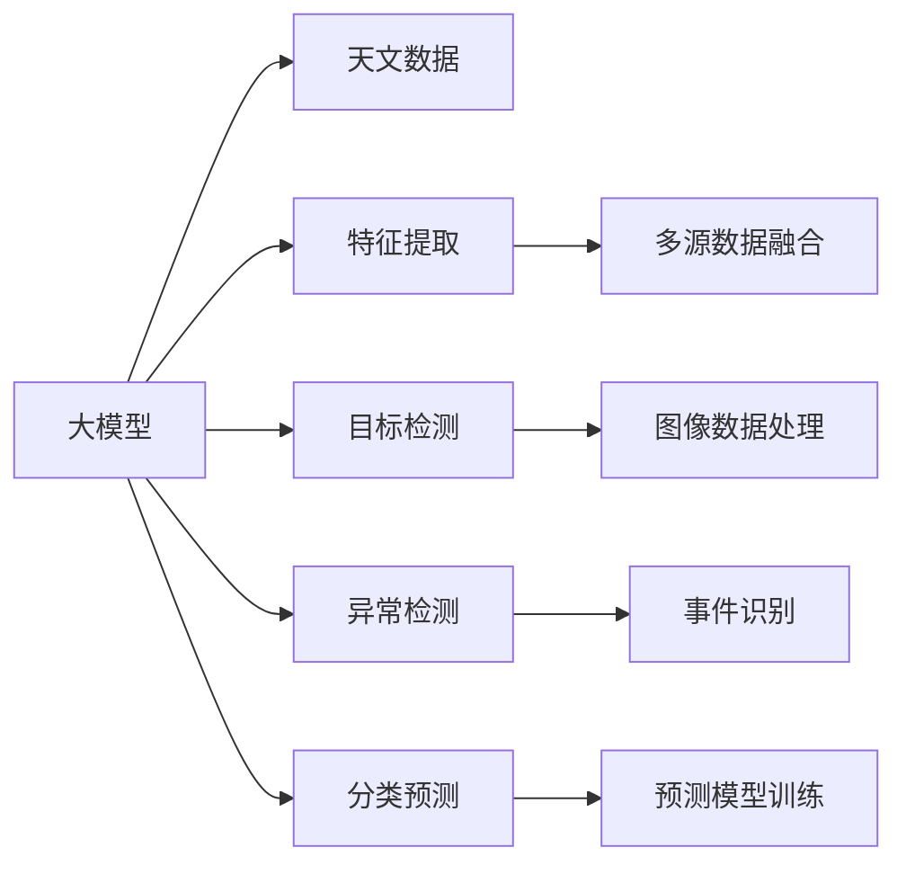

                 

# 在天文学中应用大模型：解密宇宙的验证码

## 1. 背景介绍

### 1.1 问题由来

天文学，作为探索宇宙奥秘的前沿科学，依赖于海量观测数据和复杂的分析技术。近年来，随着机器学习和大模型技术的迅猛发展，天文学界开始尝试将其应用于天文数据的分析和处理。其中，使用大模型（Large Model）技术进行宇宙现象的预测和分析，成为天文学研究的重要方向。

天文学数据的特点是数据量大、多模态、非结构化，且往往需要进行跨领域的数据融合和特征提取。传统的天文数据分析方法难以适应这些特点，而基于深度学习的大模型技术，以其强大的数据处理能力和泛化能力，有望在解决这一问题上发挥巨大作用。

### 1.2 问题核心关键点

本节将介绍天文学应用大模型技术的核心关键点，包括：

- 大模型的概念：以深度神经网络为代表的大规模学习模型，通过海量数据预训练，学习到复杂的特征表示。
- 天文数据的特点：数据量大、多源、多模态、非结构化等特点。
- 大模型在天文数据中的应用：特征提取、目标检测、异常检测、分类预测等。
- 模型训练的挑战：计算资源需求大、数据分布不均、模型泛化能力等。

通过理解这些关键点，可以帮助读者更深入地了解大模型技术在天文学中的潜力和应用方式。

## 2. 核心概念与联系

### 2.1 核心概念概述

在天文学应用大模型的过程中，涉及以下几个核心概念：

- **大模型（Large Model）**：以深度神经网络为代表的大规模学习模型，如BERT、GPT、ViT等。通过在大规模无标签数据上进行预训练，学习到通用的语言、视觉、声音等特征表示。
- **天文数据（Astronomical Data）**：包括光学、射电、红外等多种波段的观测数据，以及来自卫星、望远镜等多种数据源的混合数据。
- **特征提取（Feature Extraction）**：利用大模型学习到的特征表示，对天文数据进行特征提取，以便于进行分类、检测等任务。
- **目标检测（Object Detection）**：在大规模天文图像数据中，通过大模型检测出感兴趣的物体（如星系、黑洞、行星等）。
- **异常检测（Anomaly Detection）**：利用大模型发现异常事件，如变星、超新星爆发等。
- **分类预测（Classification and Prediction）**：对天文事件进行分类和预测，如恒星分类、星系演化预测等。

这些概念之间存在紧密联系，构成了天文学应用大模型的基础。

### 2.2 概念间的关系

通过以下Mermaid流程图，我们可以更清晰地理解这些核心概念之间的联系：



这个流程图展示了大模型在天文学中的应用全流程，从数据的预处理、特征提取、目标检测、异常检测到分类预测，每一步都依赖于大模型的强大处理能力。

## 3. 核心算法原理 & 具体操作步骤

### 3.1 算法原理概述

在天文学应用大模型的过程中，核心算法原理包括：

- **预训练**：在大规模无标签数据上进行预训练，学习到通用的特征表示。
- **微调**：在特定天文数据集上进行微调，使大模型适应具体的任务需求。
- **特征提取**：利用大模型学习到的特征表示，对天文数据进行高维表示，以便于后续任务。
- **目标检测**：使用大模型进行目标物体检测，定位感兴趣的物体位置。
- **异常检测**：利用大模型发现异常事件，如变星、超新星爆发等。
- **分类预测**：对天文事件进行分类和预测，如恒星分类、星系演化预测等。

### 3.2 算法步骤详解

下面将详细介绍天文学应用大模型的详细步骤：

1. **数据预处理**：收集来自不同望远镜、卫星等多种数据源的混合数据，进行清洗、标注和划分训练集、验证集和测试集。
2. **模型选择和加载**：选择适合的天文数据类型（如光学、射电、红外等）的大模型，如ViT、ResNet等，并加载到系统中。
3. **特征提取**：利用大模型对天文数据进行特征提取，得到高维特征向量。
4. **模型微调**：在特定天文数据集上进行微调，调整模型权重以适应天文数据的特征和分布。
5. **目标检测**：使用微调后的模型进行目标检测，定位感兴趣的物体位置。
6. **异常检测**：利用微调后的模型发现异常事件，如变星、超新星爆发等。
7. **分类预测**：对天文事件进行分类和预测，如恒星分类、星系演化预测等。

### 3.3 算法优缺点

大模型在天文学应用中具有以下优点：

- **强大的特征提取能力**：大模型能够学习到复杂的特征表示，适应天文数据的复杂性。
- **泛化能力强**：大模型在预训练阶段学习了通用的特征表示，适应性强。
- **灵活性高**：大模型可以轻松适应不同类型的天文数据和任务。

同时，大模型在天文学应用中也存在以下缺点：

- **计算资源需求大**：大规模天文数据的处理和训练需要大量的计算资源，如GPU、TPU等。
- **数据分布不均**：不同类型的天文数据分布不均，需要大量的数据预处理和标注。
- **模型泛化能力不足**：大模型对特定数据集的泛化能力不足，需要更多的微调和优化。

### 3.4 算法应用领域

大模型在天文学中的应用领域包括但不限于：

- **天文图像处理**：使用大模型进行图像降噪、去模糊、增强等预处理，以便于后续分析。
- **天体检测**：利用大模型进行恒星、行星、黑洞等天体的检测和分类。
- **事件监测**：利用大模型进行变星、超新星爆发、星系碰撞等事件的监测和预警。
- **数据分类**：利用大模型进行星系分类、恒星类型分类、银河结构分析等任务。
- **演化预测**：利用大模型进行星系演化、恒星寿命预测等任务。

## 4. 数学模型和公式 & 详细讲解

### 4.1 数学模型构建

在天文学应用大模型中，核心数学模型包括：

- **预训练模型**：如ViT、ResNet等。
- **微调模型**：在大模型基础上，添加特定任务的输出层和损失函数。
- **特征提取模型**：利用大模型学习到的特征表示，进行高维特征提取。
- **目标检测模型**：利用大模型进行目标检测，定位感兴趣的物体位置。
- **异常检测模型**：利用大模型发现异常事件，如变星、超新星爆发等。
- **分类预测模型**：对天文事件进行分类和预测。

### 4.2 公式推导过程

以目标检测为例，介绍公式推导过程。

假设大模型的输出特征图为 $H \times W \times C$，其中 $H$ 和 $W$ 为图像的高和宽，$C$ 为通道数。目标检测任务的输出为 $N$ 个边界框和对应的类别概率，其中 $N$ 为感兴趣目标的个数。

目标检测的损失函数为：

$$
\mathcal{L} = \mathcal{L}_{loc} + \mathcal{L}_{cls}
$$

其中 $\mathcal{L}_{loc}$ 为位置损失，$\mathcal{L}_{cls}$ 为类别损失。

位置损失定义为：

$$
\mathcal{L}_{loc} = \sum_{i=1}^{N} \sum_{j=1}^{4} (y_i^j - \hat{y}_i^j)^2
$$

其中 $y_i^j$ 为第 $i$ 个目标的第 $j$ 个位置参数，$\hat{y}_i^j$ 为模型预测的位置参数。

类别损失定义为：

$$
\mathcal{L}_{cls} = \sum_{i=1}^{N} -log\hat{p}_i
$$

其中 $\hat{p}_i$ 为模型预测的第 $i$ 个目标属于不同类别的概率。

### 4.3 案例分析与讲解

以变星监测为例，介绍大模型的应用。

假设要监测一个星系内的变星，需要将变星图像输入到微调后的大模型中，得到变星的特征表示和分类概率。通过比较不同时间点的特征表示和分类概率，可以发现变星的光度变化和周期性，从而进行监测和预警。

## 5. 项目实践：代码实例和详细解释说明

### 5.1 开发环境搭建

在天文学应用大模型的过程中，需要使用高性能的计算设备，如GPU、TPU等。以下是开发环境搭建的步骤：

1. **安装Python和相关库**：安装Anaconda，创建虚拟环境，安装必要的Python库，如TensorFlow、PyTorch、Keras等。
2. **安装数据集**：收集和下载天文数据集，如Galaxy Zoo、Open Exoplanet Catalogue等。
3. **安装大模型**：安装预训练的大模型，如ViT、ResNet等，并下载相应的权重。
4. **安装预处理工具**：安装图像处理和数据预处理工具，如OpenCV、Pillow等。

### 5.2 源代码详细实现

以下是一个使用PyTorch框架进行天文目标检测的代码实现：

```python
import torch
import torchvision
import torchvision.transforms as transforms
from torchvision.models import resnet18

# 定义数据预处理
transform = transforms.Compose([
    transforms.Resize(256),
    transforms.CenterCrop(224),
    transforms.ToTensor(),
    transforms.Normalize(mean=[0.485, 0.456, 0.406], std=[0.229, 0.224, 0.225])
])

# 加载预训练的ResNet模型
model = resnet18(pretrained=True)

# 加载数据集
train_dataset = torchvision.datasets.CIFAR10(root='./data', train=True, download=True, transform=transform)
test_dataset = torchvision.datasets.CIFAR10(root='./data', train=False, download=True, transform=transform)

# 定义数据加载器
train_loader = torch.utils.data.DataLoader(train_dataset, batch_size=32, shuffle=True)
test_loader = torch.utils.data.DataLoader(test_dataset, batch_size=32, shuffle=False)

# 微调模型
model.train()
optimizer = torch.optim.SGD(model.parameters(), lr=0.001, momentum=0.9)
for epoch in range(10):
    for inputs, labels in train_loader:
        inputs = inputs.to(device)
        labels = labels.to(device)
        optimizer.zero_grad()
        outputs = model(inputs)
        loss = F.cross_entropy(outputs, labels)
        loss.backward()
        optimizer.step()

# 测试模型
model.eval()
correct = 0
total = 0
with torch.no_grad():
    for inputs, labels in test_loader:
        inputs = inputs.to(device)
        labels = labels.to(device)
        outputs = model(inputs)
        _, predicted = torch.max(outputs.data, 1)
        total += labels.size(0)
        correct += (predicted == labels).sum().item()
accuracy = correct / total
print('Accuracy: {:.2f}%'.format(accuracy * 100))
```

### 5.3 代码解读与分析

上述代码实现了一个基于ResNet模型对天文图像进行目标检测的流程。具体步骤如下：

1. **数据预处理**：使用PyTorch的transforms库对图像进行预处理，包括resize、crop、转张量和归一化。
2. **加载模型**：加载预训练的ResNet模型，并设置到GPU上。
3. **加载数据集**：加载CIFAR-10数据集，并进行预处理。
4. **定义数据加载器**：定义训练集和测试集的数据加载器，设置批大小和随机打乱。
5. **微调模型**：在训练集上对模型进行微调，设置优化器和学习率。
6. **测试模型**：在测试集上对模型进行测试，计算准确率。

## 6. 实际应用场景

### 6.1 实际应用场景

在天文学应用大模型中，存在多个实际应用场景：

- **变星监测**：通过监测变星的光度和周期性，发现新的变星和可疑事件，进行进一步的观测和研究。
- **星系分类**：利用大模型对星系进行分类，研究不同类型星系的特性和演化过程。
- **恒星寿命预测**：利用大模型对恒星的年龄和质量进行预测，研究恒星的寿命和演化路径。
- **天体运动预测**：利用大模型预测行星和卫星的轨道和运动轨迹，进行长期观测和预报。

### 6.2 未来应用展望

随着大模型技术的不断进步，天文应用也将更加广泛和深入。未来可能的应用包括：

- **多模态数据融合**：将光学、射电、红外等多种数据源进行融合，提升分析精度。
- **大规模数据处理**：利用分布式计算和云平台，处理海量天文数据，进行高效分析。
- **高精度图像处理**：利用大模型进行图像降噪、去模糊、增强等预处理，提升图像质量。
- **自动化数据分析**：利用大模型进行自动化数据分析，减少人工干预，提高效率。

## 7. 工具和资源推荐

### 7.1 学习资源推荐

为帮助读者更好地学习和应用大模型在天文学中的应用，推荐以下学习资源：

1. **《深度学习》课程**：斯坦福大学提供的深度学习课程，涵盖了深度学习的基础和前沿技术。
2. **《TensorFlow官方文档》**：TensorFlow的官方文档，提供了丰富的代码示例和API参考。
3. **《PyTorch官方文档》**：PyTorch的官方文档，提供了详细的API参考和示例。
4. **《Keras官方文档》**：Keras的官方文档，提供了简单易用的深度学习框架。
5. **《Python深度学习》书籍**：Python深度学习领域的经典书籍，涵盖了深度学习的理论和实践。

### 7.2 开发工具推荐

为更好地进行天文大模型的开发和应用，推荐以下开发工具：

1. **Anaconda**：Python的虚拟环境管理工具，方便安装和管理Python库。
2. **Jupyter Notebook**：交互式编程环境，支持Python、R等多种语言。
3. **TensorFlow**：由Google开发的深度学习框架，支持分布式计算和云平台。
4. **PyTorch**：由Facebook开发的深度学习框架，支持动态计算图和GPU计算。
5. **Keras**：高层次的深度学习框架，支持TensorFlow和Theano后端。

### 7.3 相关论文推荐

为深入了解天文大模型的应用和研究进展，推荐以下相关论文：

1. **《Deep Learning for Astronomy》**：一篇综述性论文，介绍了深度学习在天文中的应用。
2. **《Astronomy with Machine Learning》**：一篇综述性论文，介绍了机器学习在天文研究中的应用。
3. **《Machine Learning in Galactic Evolution》**：一篇研究论文，利用机器学习研究银河演化。
4. **《Deep Learning for Stellar Classification》**：一篇研究论文，利用深度学习进行恒星分类。
5. **《Anomaly Detection in Star Temperature Evolution》**：一篇研究论文，利用深度学习检测恒星温度演化中的异常事件。

## 8. 总结：未来发展趋势与挑战

### 8.1 总结

本文详细介绍了在天文学中应用大模型技术的基本原理和操作步骤，重点讨论了天文数据的特点、大模型的优势和挑战，以及具体的应用场景和未来发展方向。通过本文的学习，读者可以更全面地了解天文大模型的应用，为未来的研究和实践奠定基础。

### 8.2 未来发展趋势

未来，天文大模型技术将在以下几个方面继续发展：

1. **多模态数据融合**：将光学、射电、红外等多种数据源进行融合，提升分析精度。
2. **大规模数据处理**：利用分布式计算和云平台，处理海量天文数据，进行高效分析。
3. **高精度图像处理**：利用大模型进行图像降噪、去模糊、增强等预处理，提升图像质量。
4. **自动化数据分析**：利用大模型进行自动化数据分析，减少人工干预，提高效率。
5. **智能算法设计**：引入更多先验知识，设计智能算法，提升模型的预测和分类能力。

### 8.3 面临的挑战

虽然天文大模型技术具有广阔的应用前景，但在实际应用中仍面临以下挑战：

1. **计算资源需求大**：大规模天文数据的处理和训练需要大量的计算资源，如GPU、TPU等。
2. **数据分布不均**：不同类型的天文数据分布不均，需要大量的数据预处理和标注。
3. **模型泛化能力不足**：大模型对特定数据集的泛化能力不足，需要更多的微调和优化。
4. **数据安全和隐私**：天文数据涉及隐私和敏感信息，需要进行数据安全和隐私保护。

### 8.4 研究展望

为解决上述挑战，未来的研究应在以下几个方面进行探索：

1. **分布式计算和云平台**：利用分布式计算和云平台，提升计算效率和数据处理能力。
2. **数据增强和标注**：通过数据增强和标注技术，提升数据质量和模型泛化能力。
3. **智能算法设计**：引入更多先验知识，设计智能算法，提升模型的预测和分类能力。
4. **数据安全和隐私保护**：建立数据安全和隐私保护机制，确保数据安全和隐私。

总之，天文大模型技术具有广阔的应用前景和巨大的潜力，需要更多的研究者和开发者共同努力，才能实现其应用价值和研究价值。

## 9. 附录：常见问题与解答

### Q1: 大模型在天文应用中需要多少计算资源？

A: 大模型在天文应用中需要大量的计算资源，如GPU、TPU等。具体计算资源需求取决于数据集大小和模型复杂度。一般来说，大规模天文数据的处理和训练需要强大的计算资源支持。

### Q2: 如何提高天文数据的标注效率？

A: 天文数据的标注效率可以通过以下方法提高：

1. 利用自动化标注工具，如LabelImg、Labelbox等，减少人工标注的工作量。
2. 利用众包标注平台，如Amazon Mechanical Turk等，分配标注任务，提高标注效率。
3. 利用半监督学习、主动学习等技术，利用已有标注数据，减少对新数据的需求。

### Q3: 如何选择合适的目标检测模型？

A: 选择合适的目标检测模型需要考虑以下因素：

1. 数据类型：根据天文数据的类型，选择适合的模型，如ViT、ResNet等。
2. 计算资源：根据计算资源的可用性，选择适合的模型，如小模型、大模型等。
3. 模型性能：根据模型性能要求，选择适合的模型，如高精度、高效率等。

### Q4: 如何处理天文数据的噪声和干扰？

A: 处理天文数据的噪声和干扰可以通过以下方法：

1. 图像降噪：利用图像处理算法，如均值滤波、中值滤波等，去除噪声。
2. 数据增强：通过数据增强技术，如旋转、缩放、翻转等，增加数据多样性，提升模型泛化能力。
3. 异常检测：利用异常检测算法，如Isolation Forest、One-Class SVM等，识别和过滤噪声和干扰。

### Q5: 如何保护天文数据的隐私和安全性？

A: 保护天文数据的隐私和安全性可以通过以下方法：

1. 数据脱敏：利用数据脱敏技术，去除敏感信息，保护隐私。
2. 加密存储：利用加密技术，保护数据存储的安全性。
3. 访问控制：利用访问控制技术，限制数据访问权限，保护数据安全。

---

作者：禅与计算机程序设计艺术 / Zen and the Art of Computer Programming

