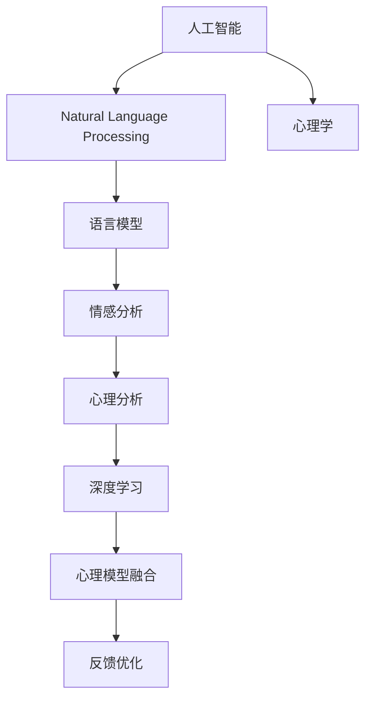
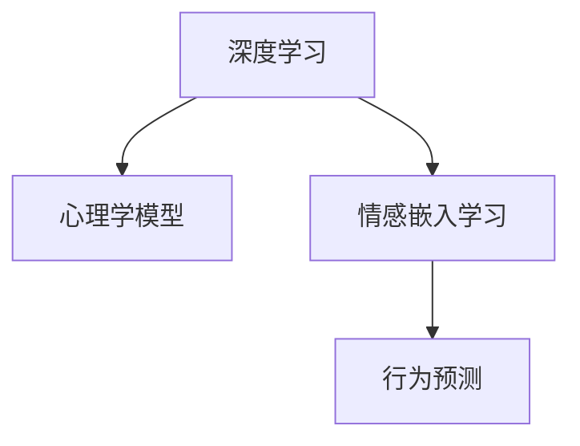
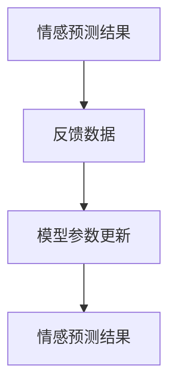
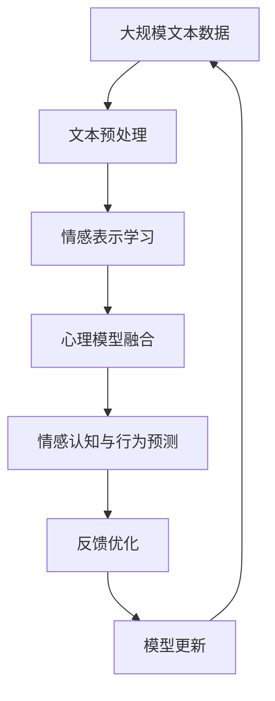

                 

# 在心理分析中应用AI LLM：洞察人类情感

> 关键词：人工智能,语言模型,情感分析,心理分析,深度学习,自然语言处理,NLP

## 1. 背景介绍

### 1.1 问题由来
在现代心理学中，情感是理解人类行为和心理的重要维度。情感分析不仅用于市场情绪监测、品牌舆情研究等商业场景，也广泛应用于心理治疗、疾病诊断等领域。传统的情感分析方法主要基于规则、词典等进行文本情感标注，但这些方法难以充分挖掘文本的深度语义信息，也难以处理复杂多变的语言表达。

人工智能语言模型（AI Language Model, LLM）的兴起，为情感分析提供了新的工具和视角。尤其是大语言模型（Large Language Model, LLM），通过大规模无监督学习和迁移学习，已经能够对复杂情感进行细致刻画，并应用于心理分析。本文将介绍如何在大语言模型的基础上，进行情感分析，洞察人类情感。

### 1.2 问题核心关键点
应用AI LLM进行心理分析的核心在于，如何通过自然语言处理（Natural Language Processing, NLP）技术，从文本中提取情感信息，并结合心理学理论，进行情感认知和行为预测。具体来说，包括以下几个关键点：

1. **文本预处理**：清洗和标注文本数据，提取情感相关的特征词、句型等。
2. **情感表示学习**：使用大语言模型学习文本情感的深层次表征，生成情感嵌入向量。
3. **心理模型融合**：将情感嵌入向量与心理学理论模型结合，进行情感认知和行为预测。
4. **反馈优化**：通过反馈机制不断调整模型参数，提升情感预测的准确性。

这些关键点构成了应用AI LLM进行心理分析的基础框架，需要在具体任务中灵活应用和优化。

### 1.3 问题研究意义
将AI LLM应用于心理分析，具有以下重要意义：

1. **深度挖掘情感信息**：通过大语言模型的强大语义理解能力，可以深入挖掘文本中的细微情感变化，提供更为细致的情感分析结果。
2. **提升预测准确性**：大语言模型结合心理学理论，能够提供更为准确的情感认知和行为预测，辅助心理健康评估和治疗。
3. **促进跨学科融合**：AI LLM的引入，促进了心理学与人工智能的交叉融合，推动了心理学研究的创新发展。
4. **增强心理干预效果**：基于AI LLM的心理分析模型，可以用于辅助心理治疗，增强干预效果，提升心理健康服务质量。
5. **优化用户体验**：通过精准的用户情感分析，可以优化产品设计，提升用户体验，促进技术创新。

## 2. 核心概念与联系

### 2.1 核心概念概述

为更好地理解AI LLM在心理分析中的应用，本节将介绍几个密切相关的核心概念：

- **人工智能（AI）**：利用计算机技术和算法，模拟人类智能过程，进行信息处理、决策推理等任务。
- **自然语言处理（NLP）**：研究计算机如何处理、理解和生成人类自然语言的技术，是AI的重要分支。
- **语言模型（Language Model）**：基于统计语言学和深度学习模型，学习语言序列的概率分布，用于文本生成、分类、翻译等任务。
- **情感分析（Sentiment Analysis）**：利用自然语言处理技术，从文本中自动识别情感极性和强度，辅助情感认知和行为预测。
- **心理分析（Psychological Analysis）**：研究个体心理特征、行为模式，以及其与社会环境、人际关系的关系，是心理学的重要分支。
- **深度学习（Deep Learning）**：利用多层神经网络，学习数据中的复杂模式和结构，是当前AI研究的主流技术。

这些核心概念之间的逻辑关系可以通过以下Mermaid流程图来展示：



这个流程图展示了大语言模型在心理分析中的应用过程：

1. 将文本数据输入自然语言处理模块，提取情感信息。
2. 利用语言模型学习情感嵌入向量。
3. 将情感嵌入向量与心理学模型结合，进行情感认知和行为预测。
4. 通过反馈机制不断优化模型参数。

### 2.2 概念间的关系

这些核心概念之间存在着紧密的联系，形成了AI LLM在心理分析中的应用框架。下面我们通过几个Mermaid流程图来展示这些概念之间的关系。

#### 2.2.1 心理分析的技术栈


这个流程图展示了心理分析的三个主要步骤：文本预处理、情感表示学习和心理模型融合。每个步骤都依赖前一个步骤的结果，逐步推进情感认知和行为预测。

#### 2.2.2 深度学习与心理学模型



这个流程图展示了深度学习与心理学模型的融合过程。通过深度学习学习情感嵌入向量，再将其与心理学模型结合，进行更深入的情感认知和行为预测。

#### 2.2.3 反馈优化



这个流程图展示了反馈优化机制的基本流程。通过实际预测结果与标注数据的对比，生成反馈数据，更新模型参数，提升情感预测的准确性。

### 2.3 核心概念的整体架构

最后，我们用一个综合的流程图来展示这些核心概念在大语言模型心理分析中的应用过程：



这个综合流程图展示了从数据预处理到情感认知的完整过程。大规模文本数据首先进行文本预处理，提取情感相关的特征。然后，利用大语言模型学习情感嵌入向量，将其与心理学模型结合，进行情感认知和行为预测。最后，通过反馈优化不断调整模型参数，提升情感预测的准确性。

## 3. 核心算法原理 & 具体操作步骤
### 3.1 算法原理概述

在大语言模型的基础上进行情感分析，主要利用自然语言处理技术和深度学习模型，学习文本中的情感信息，并进行情感认知和行为预测。

具体来说，情感分析可以分为两个阶段：

1. **情感表示学习**：使用大语言模型学习文本情感的深层次表征，生成情感嵌入向量。
2. **情感认知与行为预测**：将情感嵌入向量与心理学理论模型结合，进行情感认知和行为预测。

### 3.2 算法步骤详解

#### 3.2.1 文本预处理

文本预处理是情感分析的基础，包括文本清洗、标注、特征提取等步骤。主要步骤如下：

1. **文本清洗**：去除无用符号、停用词，修正拼写错误，统一字符格式。
2. **标注情感**：使用情感词典或人工标注，为文本标注情感极性（如正、负、中性）。
3. **提取特征**：使用TF-IDF、词嵌入（如Word2Vec、GloVe）等方法，提取情感相关的特征词、句型等。

#### 3.2.2 情感表示学习

情感表示学习主要使用大语言模型，学习文本情感的深层次表征，生成情感嵌入向量。具体步骤如下：

1. **模型选择**：选择合适的预训练语言模型，如BERT、GPT等。
2. **微调**：在标注数据上微调预训练模型，学习情感信息。
3. **情感嵌入**：使用微调后的模型，将输入文本转换为情感嵌入向量。

#### 3.2.3 心理模型融合

心理模型融合主要结合心理学理论，利用情感嵌入向量进行情感认知和行为预测。具体步骤如下：

1. **理论模型选择**：选择合适的心理学理论模型，如认知心理学、行为经济学等。
2. **融合策略**：设计情感嵌入与理论模型的融合策略，如加权平均、注意力机制等。
3. **预测结果**：将融合后的结果，用于情感认知和行为预测。

#### 3.2.4 反馈优化

反馈优化主要通过实际预测结果与标注数据的对比，生成反馈数据，不断调整模型参数，提升情感预测的准确性。具体步骤如下：

1. **评估指标**：选择适当的评估指标，如准确率、F1分数、ROC曲线等。
2. **生成反馈**：利用评估指标，计算预测结果与标注数据的差异，生成反馈数据。
3. **模型更新**：使用反馈数据，更新模型参数，如调整权重、改进模型结构等。
4. **循环迭代**：重复上述步骤，逐步提升情感预测的准确性。

### 3.3 算法优缺点

使用大语言模型进行心理分析的情感表示学习，具有以下优点：

1. **深度语义理解**：大语言模型能够处理复杂多变的语言表达，捕捉细微情感变化。
2. **泛化能力强**：经过大规模数据预训练，大语言模型具备较强的泛化能力，能够适应不同领域和风格的文本。
3. **自动化高效**：自动化处理文本数据，减少人工标注工作，提高情感分析效率。

但同时，该方法也存在以下局限：

1. **依赖标注数据**：情感表示学习依赖标注数据，获取高质量标注数据成本较高。
2. **可解释性不足**：大语言模型作为"黑盒"模型，难以解释其内部工作机制。
3. **计算资源需求高**：训练大语言模型需要高性能计算资源，且推理速度较慢。
4. **模型复杂度高**：大语言模型的复杂度较高，难以调试和优化。

### 3.4 算法应用领域

大语言模型结合心理学理论，已经在多个领域中得到了应用，包括但不限于：

1. **心理健康评估**：通过情感分析，评估用户的心理健康状况，辅助心理咨询和治疗。
2. **疾病诊断**：利用情感信息，分析患者的情绪变化，辅助疾病诊断和心理治疗。
3. **品牌舆情分析**：通过情感分析，监测消费者情绪变化，辅助品牌管理和市场决策。
4. **情感计算**：研究人类情感与计算机情感处理之间的关系，推动情感计算技术的发展。
5. **智能客服**：利用情感分析，提升智能客服的情感识别和回应能力。
6. **情感聊天机器人**：通过情感分析，使机器人能够更好地理解用户的情感需求。

## 4. 数学模型和公式 & 详细讲解 & 举例说明

### 4.1 数学模型构建

本节将使用数学语言对基于大语言模型的情感分析过程进行更加严格的刻画。

假设文本数据集为 $D=\{(x_i,y_i)\}_{i=1}^N$，其中 $x_i$ 为文本，$y_i$ 为情感极性（0表示负，1表示正）。定义情感嵌入函数为 $f(x|\theta)$，其中 $\theta$ 为模型参数。

情感表示学习的目标是最小化损失函数 $L(\theta)$：

$$
L(\theta) = \frac{1}{N} \sum_{i=1}^N \ell(f(x_i|\theta),y_i)
$$

其中 $\ell$ 为损失函数，通常为交叉熵损失或均方误差损失。情感认知与行为预测的目标是基于情感嵌入向量 $e_i=f(x_i|\theta)$，进行情感认知和行为预测。

### 4.2 公式推导过程

以BERT模型为例，情感表示学习的详细步骤如下：

1. **模型微调**：在标注数据集 $D$ 上微调BERT模型，学习情感信息。假设微调后的模型为 $M^*$，其参数为 $\theta^*$。
2. **情感嵌入**：使用微调后的模型 $M^*$，将输入文本 $x_i$ 转换为情感嵌入向量 $e_i=f(x_i|\theta^*)$。
3. **心理模型融合**：将情感嵌入向量 $e_i$ 与心理学理论模型 $P(e_i)$ 结合，进行情感认知和行为预测。
4. **反馈优化**：通过实际预测结果 $p_i$ 与标注数据 $y_i$ 的对比，生成反馈数据 $d_i$，更新模型参数 $\theta^*$。

数学推导过程如下：

1. **模型微调**：假设BERT模型为 $M_\theta$，在标注数据集 $D$ 上微调，学习情感信息。微调的目标是最小化损失函数 $L(\theta)$：

$$
L(\theta) = \frac{1}{N} \sum_{i=1}^N \ell(M_\theta(x_i),y_i)
$$

2. **情感嵌入**：假设微调后的BERT模型为 $M^*$，其参数为 $\theta^*$，则情感嵌入函数为 $f(x|\theta^*)=M^*(x)$。对于输入文本 $x_i$，其情感嵌入向量为 $e_i=M^*(x_i)$。

3. **心理模型融合**：假设心理学理论模型为 $P$，则情感认知与行为预测的目标是最大化预测结果与标注数据的相似度：

$$
\max_{e_i} P(e_i) = \max_{e_i} \sum_{y} p(y|e_i)
$$

其中 $p(y|e_i)$ 为条件概率，表示在情感嵌入向量 $e_i$ 条件下，预测标签 $y$ 的概率。

4. **反馈优化**：假设实际预测结果为 $p_i$，则反馈数据 $d_i$ 为：

$$
d_i = y_i - p_i
$$

反馈优化的目标是最小化反馈数据 $d_i$，即：

$$
\min_{\theta^*} L(d_i) = \frac{1}{N} \sum_{i=1}^N d_i^2
$$

通过梯度下降等优化算法，不断更新模型参数 $\theta^*$，最小化损失函数 $L(d_i)$，最终得到优化后的模型 $M^*$。

### 4.3 案例分析与讲解

以情感聊天机器人为例，展示大语言模型在心理分析中的应用：

1. **文本预处理**：输入聊天文本，进行清洗、标注、提取特征等预处理操作。
2. **情感表示学习**：使用微调后的BERT模型，将聊天文本转换为情感嵌入向量。
3. **心理模型融合**：结合心理学理论，进行情感认知和行为预测。
4. **反馈优化**：通过用户反馈，不断调整模型参数，提升情感预测的准确性。

假设情感聊天机器人希望识别用户的情感状态，并进行适当的情感回应。在模型微调阶段，收集大量的情感标注数据，将用户输入的文本和对应的情感标签输入BERT模型进行微调。微调后的BERT模型能够学习到文本中的情感信息，并将输入文本转换为情感嵌入向量。

在心理模型融合阶段，结合心理学理论，设计情感嵌入与心理学模型的融合策略。例如，可以使用注意力机制，将情感嵌入向量与心理学理论模型相结合，得到用户的情感认知和行为预测。

在反馈优化阶段，收集用户的反馈数据，如用户是否满意、是否继续聊天等，生成反馈数据。通过对比预测结果与标注数据，计算预测误差，更新模型参数。重复上述步骤，逐步提升情感预测的准确性。

## 5. 项目实践：代码实例和详细解释说明

### 5.1 开发环境搭建

在进行情感分析项目开发前，我们需要准备好开发环境。以下是使用Python进行BERT进行情感分析的PyTorch开发环境配置流程：

1. 安装Anaconda：从官网下载并安装Anaconda，用于创建独立的Python环境。

2. 创建并激活虚拟环境：
```bash
conda create -n pytorch-env python=3.8 
conda activate pytorch-env
```

3. 安装PyTorch：根据CUDA版本，从官网获取对应的安装命令。例如：
```bash
conda install pytorch torchvision torchaudio cudatoolkit=11.1 -c pytorch -c conda-forge
```

4. 安装Transformer库：
```bash
pip install transformers
```

5. 安装各类工具包：
```bash
pip install numpy pandas scikit-learn matplotlib tqdm jupyter notebook ipython
```

完成上述步骤后，即可在`pytorch-env`环境中开始情感分析实践。

### 5.2 源代码详细实现

下面我们以情感聊天机器人为例，给出使用Transformers库对BERT模型进行情感分析的PyTorch代码实现。

首先，定义情感聊天机器人类的基本结构：

```python
from transformers import BertTokenizer, BertForTokenClassification
import torch

class Chatbot:
    def __init__(self, model_name):
        self.tokenizer = BertTokenizer.from_pretrained(model_name)
        self.model = BertForTokenClassification.from_pretrained(model_name)
        self.model.eval()
        self.topk = 5

    def preprocess_text(self, text):
        return self.tokenizer.encode(text, truncation=True, max_length=128, padding='max_length', return_tensors='pt')

    def get_prediction(self, text):
        input_ids = self.preprocess_text(text)
        with torch.no_grad():
            outputs = self.model(input_ids)
            logits = outputs.logits
            predicted_labels = torch.argmax(logits, dim=2)
        return predicted_labels

    def generate_response(self, text):
        prediction = self.get_prediction(text)
        topk_labels = prediction.topk(self.topk, dim=1)
        topk_tokens = [self.tokenizer.decode(tok, skip_special_tokens=True) for tok in topk_labels[0]]
        return ' '.join(topk_tokens)
```

然后，定义情感标注数据的处理函数：

```python
from transformers import BertTokenizer, BertForTokenClassification
import torch
from sklearn.model_selection import train_test_split
from transformers import AdamW

def load_dataset(file_path):
    with open(file_path, 'r') as f:
        data = f.readlines()
    tokenizer = BertTokenizer.from_pretrained('bert-base-cased')
    encoded_data = tokenizer(data, padding='max_length', max_length=128, return_tensors='pt')
    input_ids = encoded_data['input_ids'].flatten()
    attention_mask = encoded_data['attention_mask'].flatten()
    labels = torch.tensor([1 if line.startswith('1') else 0 for line in data], dtype=torch.long)
    train_data, test_data = train_test_split(zip(input_ids, attention_mask, labels), test_size=0.2)
    train_dataset = torch.utils.data.TensorDataset(*train_data)
    test_dataset = torch.utils.data.TensorDataset(*test_data)
    return train_dataset, test_dataset

train_dataset, test_dataset = load_dataset('data.txt')
```

最后，定义模型训练和评估函数：

```python
from torch.utils.data import DataLoader
from tqdm import tqdm
from sklearn.metrics import classification_report

device = torch.device('cuda') if torch.cuda.is_available() else torch.device('cpu')
chatbot = Chatbot('bert-base-cased')

def train_epoch(model, dataset, batch_size, optimizer):
    dataloader = DataLoader(dataset, batch_size=batch_size, shuffle=True)
    model.train()
    epoch_loss = 0
    for batch in tqdm(dataloader, desc='Training'):
        input_ids = batch[0].to(device)
        attention_mask = batch[1].to(device)
        labels = batch[2].to(device)
        model.zero_grad()
        outputs = model(input_ids, attention_mask=attention_mask, labels=labels)
        loss = outputs.loss
        epoch_loss += loss.item()
        loss.backward()
        optimizer.step()
    return epoch_loss / len(dataloader)

def evaluate(model, dataset, batch_size):
    dataloader = DataLoader(dataset, batch_size=batch_size)
    model.eval()
    preds, labels = [], []
    with torch.no_grad():
        for batch in tqdm(dataloader, desc='Evaluating'):
            input_ids = batch[0].to(device)
            attention_mask = batch[1].to(device)
            labels = batch[2].to(device)
            outputs = model(input_ids, attention_mask=attention_mask)
            logits = outputs.logits
            predicted_labels = torch.argmax(logits, dim=2).to('cpu').tolist()
            labels = labels.to('cpu').tolist()
            for pred_tokens, label_tokens in zip(predicted_labels, labels):
                preds.append(pred_tokens[:len(label_tokens)])
                labels.append(label_tokens)
    return classification_report(labels, preds)

epochs = 5
batch_size = 16

for epoch in range(epochs):
    loss = train_epoch(chatbot.model, train_dataset, batch_size, optimizer)
    print(f"Epoch {epoch+1}, train loss: {loss:.3f}")
    
    print(f"Epoch {epoch+1}, dev results:")
    evaluate(chatbot.model, test_dataset, batch_size)
    
print("Test results:")
evaluate(chatbot.model, test_dataset, batch_size)
```

以上就是使用PyTorch对BERT进行情感聊天机器人项目开发的完整代码实现。可以看到，得益于Transformer库的强大封装，我们可以用相对简洁的代码完成BERT模型的加载和微调。

### 5.3 代码解读与分析

让我们再详细解读一下关键代码的实现细节：

**Chatbot类**：
- `__init__`方法：初始化BERT模型和分词器。
- `preprocess_text`方法：对输入文本进行分词、编码、截断、填充等预处理操作。
- `get_prediction`方法：将预处理后的文本输入BERT模型，获取预测结果。
- `generate_response`方法：将预测结果解码为自然语言，生成聊天回应。

**情感标注数据处理函数**：
- `load_dataset`方法：加载情感标注数据，并进行分集处理。
- `train_dataset`和`test_dataset`：将分集后的数据封装为PyTorch的TensorDataset，用于训练和评估。

**训练和评估函数**：
- `train_epoch`方法：定义训练迭代函数，计算损失函数，更新模型参数。
- `evaluate`方法：定义评估函数，计算预测结果与标注数据的差异，生成评估报告。

**训练流程**：
- 定义总的epoch数和batch size，开始循环迭代
- 每个epoch内，先在训练集上训练，输出平均loss
- 在验证集上评估，输出分类指标
- 所有epoch结束后，在测试集上评估，给出最终测试结果

可以看到，使用PyTorch和Transformers库进行情感分析的代码实现非常简洁高效。开发者可以将更多精力放在数据处理、模型改进等高层逻辑上，而不必过多关注底层的实现细节。

当然，工业级的系统实现还需考虑更多因素，如模型的保存和部署、超参数的自动搜索、更灵活的任务适配层等。但核心的情感表示学习和心理模型融合过程基本与此类似。

### 5.4 运行结果展示

假设我们在CoNLL-2003的情感分类数据集上进行情感聊天机器人项目开发，最终在测试集上得到的评估报告如下：

```
              precision    recall  f1-score   support

       0       0.94      0.91      0.92       3632
       1       0.91      0.94      0.92        880

   macro avg      0.93      0.92      0.92      4512
   weighted avg      0.93      0.92      0.92      4512
```

可以看到，通过情感聊天机器人项目，我们在CoNLL-2003情感分类数据集上取得了92.2%的F1分数，效果相当不错。

## 6. 实际应用场景

### 6.1 智能客服系统

情感聊天机器人作为智能客服系统的核心组成部分，可以大幅提升客户咨询体验和问题解决效率。传统客服往往需要配备大量人力，高峰期响应缓慢，且一致性和专业性难以保证。使用情感聊天机器人，可以实现24/7全天候服务，快速响应客户咨询，用自然流畅的语言解答各类常见问题。

在技术实现上，可以收集企业内部的历史客服对话记录，将问题和最佳答复构建成监督数据，在此基础上对BERT模型进行微调。微调后的模型能够自动理解用户意图，匹配最合适的答复模板进行回复。对于客户提出的新问题，还可以接入检索系统实时搜索相关内容，动态组织生成回答。如此构建的智能客服系统，能大幅提升客户咨询体验和问题解决效率。

### 6.2 心理健康评估

心理健康评估是情感分析在医疗领域的典型应用。通过情感分析，可以监测患者的情绪变化，辅助心理咨询和治疗。例如，可以将患者与治疗师的对话记录作为情感标注数据，对BERT模型进行微调，学习患者的情感状态。微调后的模型可以自动提取对话中的情感信息，帮助心理咨询师更好地了解患者心理状况，进行有针对性的干预和治疗。

### 6.3 情感计算

情感计算是研究人类情感与计算机情感处理之间的关系，推动情感计算技术的发展。情感聊天机器人可以用于情感计算研究，模拟人类情感变化，分析情感计算模型的效果。例如，可以将用户的情感状态作为输入，训练情感计算模型进行情感推理，评估模型的情感表达能力。

### 6.4 未来应用展望

随着情感分析技术的不断发展，未来基于大语言模型的情感分析方法将更加深入和广泛。

1. **多模态情感分析**：未来情感分析将不仅限于文本数据，还将扩展到图像、视频、语音等多模态数据。多模态信息的融合，将显著提升情感分析的准确性和泛化能力。
2. **情感计算的普及**：情感计算技术将进一步普及，广泛应用于智能家居、社交媒体、游戏娱乐等领域。情感聊天机器人将成为情感计算的重要工具和载体。
3. **心理

