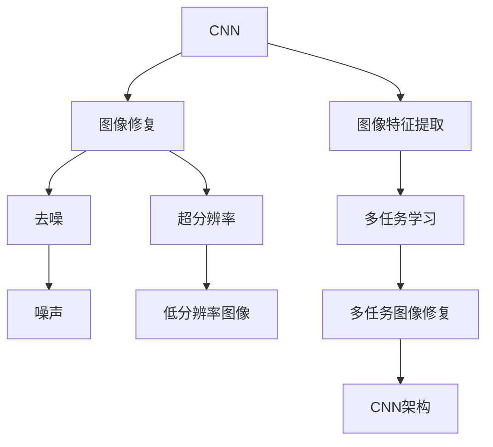
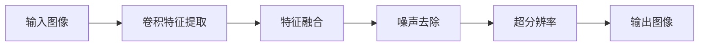
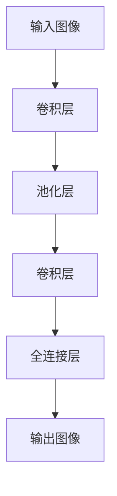
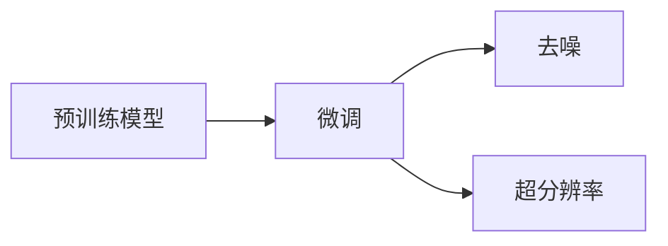
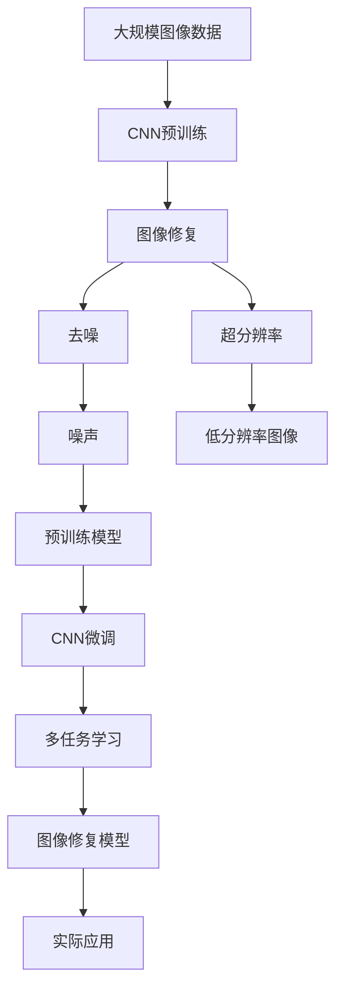

                 

# 基于卷积神经网络的图像修复系统设计与实现

> 关键词：图像修复, 卷积神经网络, 去噪, 超分辨率, 深度学习

## 1. 背景介绍

### 1.1 问题由来
图像修复技术在计算机视觉领域中具有重要应用价值，如图像去噪、超分辨率、修复受损图像等。随着深度学习的发展，基于深度学习的图像修复方法逐渐成为主流。其中，卷积神经网络（Convolutional Neural Network, CNN）由于其强大的特征提取能力和高效的训练速度，被广泛应用于图像修复任务。然而，传统的图像修复方法多为单一技术，难以处理复杂和多样化的图像问题。因此，本文旨在设计一种基于CNN的图像修复系统，以解决图像修复中的多任务、多样化问题。

### 1.2 问题核心关键点
本文的核心问题包括：
1. **图像修复方法的设计与实现**：如何设计一种通用的图像修复系统，适应不同类型和质量的输入图像。
2. **模型训练与优化**：如何在多任务图像修复中，高效训练和优化模型参数。
3. **应用场景与效率**：如何设计系统架构，提高图像修复效率，并在实际应用中取得良好效果。

### 1.3 问题研究意义
图像修复技术在医学影像处理、卫星图像增强、视频监控等领域有广泛应用。传统的图像修复方法如插值、滤波等，难以处理复杂的图像信息。基于CNN的图像修复技术，能够自适应图像的噪声、模糊等缺陷，并在多任务图像修复中表现优异。因此，本文旨在为图像修复技术提供一种可扩展、高效的解决方案，推动计算机视觉技术的发展。

## 2. 核心概念与联系

### 2.1 核心概念概述

为更好地理解基于CNN的图像修复系统，本节将介绍几个关键概念：

- **卷积神经网络（CNN）**：一种基于多层卷积和池化操作的神经网络，适用于图像等高维数据的特征提取和分类任务。
- **图像修复（Image Restoration）**：恢复或增强图像质量，去除噪声、压缩、模糊等缺陷的过程。
- **去噪（Noise Reduction）**：通过降低图像噪声，提高图像质量。
- **超分辨率（Super-Resolution）**：通过增加图像分辨率，提高图像细节。
- **特征学习（Feature Learning）**：CNN通过卷积操作提取图像的局部特征，用于图像修复任务。
- **迁移学习（Transfer Learning）**：利用预训练的CNN模型，在图像修复任务上微调，以提升模型性能。

这些核心概念之间的逻辑关系可以通过以下Mermaid流程图来展示：



这个流程图展示了CNN在图像修复中的核心作用，以及其与其他相关概念的联系。CNN通过卷积操作提取图像特征，用于图像修复任务。去噪和超分辨率作为图像修复的两种常见任务，是CNN在图像修复中的应用实例。多任务学习则展示了CNN在多任务图像修复中的潜力。

### 2.2 概念间的关系

这些核心概念之间存在着紧密的联系，形成了基于CNN的图像修复系统的完整生态系统。下面我们通过几个Mermaid流程图来展示这些概念之间的关系。

#### 2.2.1 图像修复的流程



这个流程图展示了从输入图像到输出图像的修复流程。CNN通过卷积特征提取和特征融合，生成图像修复结果。

#### 2.2.2 CNN的架构



这个流程图展示了CNN的典型架构。输入图像经过卷积层和池化层的特征提取，最终通过全连接层生成输出图像。

#### 2.2.3 多任务学习



这个流程图展示了多任务学习的基本流程。预训练模型在去噪和超分辨率任务上进行微调，以提升模型性能。

### 2.3 核心概念的整体架构

最后，我们用一个综合的流程图来展示这些核心概念在大语言模型微调过程中的整体架构：



这个综合流程图展示了从预训练到修复模型的完整过程。大规模图像数据用于CNN的预训练，CNN模型在多任务图像修复任务上进行微调，最终生成的图像修复模型用于实际应用。

## 3. 核心算法原理 & 具体操作步骤
### 3.1 算法原理概述

基于CNN的图像修复系统，主要利用CNN的卷积操作提取图像特征，并通过卷积层和池化层的组合，学习图像的高层次特征。然后，系统将这些特征应用于去噪和超分辨率等具体任务，并通过全连接层输出最终的修复结果。

形式化地，假设输入图像为 $x \in \mathbb{R}^{h \times w \times c}$，其中 $h$ 和 $w$ 为图像的宽和高，$c$ 为图像的通道数。CNN通过多层的卷积和池化操作，生成高层次特征 $f(x)$。设特征提取网络的参数为 $\theta$，则：

$$
f(x) = \mathcal{F}(x, \theta)
$$

其中，$\mathcal{F}$ 为CNN的特征提取网络。

### 3.2 算法步骤详解

基于CNN的图像修复系统，主要包含以下几个步骤：

**Step 1: 准备图像修复数据集**
- 收集并预处理图像修复任务的数据集，如去噪数据集、超分辨率数据集等。数据集应包含多种噪声、模糊等缺陷，以及多种分辨率下的图像。

**Step 2: 设计CNN网络架构**
- 设计卷积神经网络的结构，包括卷积层、池化层、全连接层等。根据具体任务，调整网络的深度和宽度，以适应不同任务的复杂度。

**Step 3: 预训练CNN网络**
- 使用大规模图像数据集对CNN网络进行预训练，如ImageNet数据集等。预训练阶段应尽可能多地覆盖不同类型和质量的图像，以提高网络的泛化能力。

**Step 4: 微调CNN网络**
- 在预训练模型上，使用特定图像修复任务的数据集进行微调。微调时，应选择适当的优化器（如Adam、SGD等）和损失函数（如均方误差损失、交叉熵损失等），以提升模型在特定任务上的性能。

**Step 5: 设计多任务学习**
- 在单个CNN网络中，设计多任务学习框架。通过共享网络参数，同时训练多个图像修复任务，以提高模型在多个任务上的表现。

**Step 6: 测试与评估**
- 在测试集上评估模型的性能，如PSNR（峰值信噪比）、SSIM（结构相似性指标）等。根据评估结果，进一步调整模型参数，优化模型性能。

**Step 7: 部署与应用**
- 将训练好的模型部署到实际应用场景中，如医学影像处理、卫星图像增强等。

### 3.3 算法优缺点

基于CNN的图像修复系统具有以下优点：
1. **强大的特征提取能力**：CNN能够自动学习图像的特征表示，适用于复杂和多样化的图像修复任务。
2. **高效的训练与推理**：CNN使用反向传播算法进行训练，训练速度快；使用GPU等加速设备进行推理，推理速度也相对较快。
3. **多任务处理能力**：CNN可以同时处理多种图像修复任务，提高模型的泛化能力和应用范围。

同时，该方法也存在以下缺点：
1. **数据需求量大**：CNN需要大量的训练数据，数据集的大小和质量直接影响模型的性能。
2. **参数数量多**：大规模CNN网络需要大量的参数进行训练和优化，需要较高的计算资源和存储能力。
3. **模型可解释性不足**：CNN通常被视为“黑盒”模型，难以解释其内部决策过程。

### 3.4 算法应用领域

基于CNN的图像修复系统，已经在医学影像处理、卫星图像增强、视频监控等多个领域得到应用。例如：

- **医学影像处理**：利用去噪和超分辨率技术，提高医学影像的清晰度和细节，帮助医生更好地进行疾病诊断。
- **卫星图像增强**：通过去噪和超分辨率技术，提高卫星图像的质量，改善地理信息系统（GIS）的准确性。
- **视频监控**：利用超分辨率技术，提高监控视频的清晰度，提供更高质量的监控图像。

除了上述应用领域，基于CNN的图像修复系统还在人脸识别、自动驾驶、遥感图像处理等多个领域有广泛的应用前景。

## 4. 数学模型和公式 & 详细讲解 & 举例说明

### 4.1 数学模型构建

本节将使用数学语言对基于CNN的图像修复过程进行更加严格的刻画。

假设输入图像为 $x \in \mathbb{R}^{h \times w \times c}$，其中 $h$ 和 $w$ 为图像的宽和高，$c$ 为图像的通道数。CNN通过多层的卷积和池化操作，生成高层次特征 $f(x)$。设特征提取网络的参数为 $\theta$，则：

$$
f(x) = \mathcal{F}(x, \theta)
$$

其中，$\mathcal{F}$ 为CNN的特征提取网络。

对于图像去噪任务，设去噪后图像为 $y$，则去噪目标函数为：

$$
\min_{y} \frac{1}{2} \|y - x\|_2^2 + \lambda \|f(y) - f(x)\|_2^2
$$

其中 $\| \cdot \|_2$ 为L2范数，$\lambda$ 为正则化参数，控制去噪和特征恢复之间的平衡。

对于图像超分辨率任务，设超分辨率后的图像为 $z$，则超分辨率目标函数为：

$$
\min_{z} \frac{1}{2} \|z - x\|_2^2 + \lambda \|f(z) - f(x)\|_2^2
$$

其中 $\| \cdot \|_2$ 为L2范数，$\lambda$ 为正则化参数，控制超分辨率和特征恢复之间的平衡。

### 4.2 公式推导过程

以下我们以图像去噪任务为例，推导去噪任务的损失函数及其梯度的计算公式。

假设输入图像 $x$ 的噪声为 $\epsilon$，去噪后的图像为 $y$，则有：

$$
y = x + \epsilon
$$

去噪的目标是使 $y$ 尽可能接近 $x$，即最小化 $y$ 和 $x$ 之间的L2距离。同时，为了保留图像的局部特征，我们需要最小化 $y$ 和 $x$ 之间的特征恢复误差。

设特征提取网络的输出为 $f(x)$，则去噪目标函数为：

$$
\min_{y} \frac{1}{2} \|y - x\|_2^2 + \lambda \|f(y) - f(x)\|_2^2
$$

对上式求导，得到去噪任务的梯度：

$$
\frac{\partial \mathcal{L}}{\partial y} = -y + x + \lambda \frac{\partial f(y)}{\partial y} \frac{\partial f(x)}{\partial x}
$$

将 $y = x + \epsilon$ 代入上式，得到：

$$
\frac{\partial \mathcal{L}}{\partial \epsilon} = -\epsilon + \lambda \frac{\partial f(x)}{\partial x}
$$

即去噪任务的梯度，用于更新噪声 $\epsilon$。

### 4.3 案例分析与讲解

考虑一张模糊的图像 $x$，经过卷积特征提取和去噪操作后，得到清晰的去噪图像 $y$。

首先，使用卷积层和池化层对图像 $x$ 进行特征提取，得到特征表示 $f(x)$。

$$
f(x) = \mathcal{F}(x, \theta)
$$

其中，$\mathcal{F}$ 为卷积神经网络。

接着，使用去噪目标函数对 $f(x)$ 进行优化，得到去噪后的图像 $y$。

$$
y = \mathcal{G}(f(x), \lambda)
$$

其中，$\mathcal{G}$ 为去噪算法，$\lambda$ 为正则化参数。

最后，通过反卷积层和上采样操作，将去噪后的特征 $f(y)$ 转换为清晰的图像 $y$。

$$
y = \mathcal{U}(f(y))
$$

其中，$\mathcal{U}$ 为反卷积和上采样操作。

以下是一个简单的去噪案例的实现代码：

```python
import torch
import torch.nn as nn
import torch.optim as optim

# 定义CNN网络结构
class CNN(nn.Module):
    def __init__(self):
        super(CNN, self).__init__()
        self.conv1 = nn.Conv2d(1, 32, 3, 1, 1)
        self.pool = nn.MaxPool2d(2, 2)
        self.conv2 = nn.Conv2d(32, 64, 3, 1, 1)
        self.fc = nn.Linear(64 * 28 * 28, 10)

    def forward(self, x):
        x = self.conv1(x)
        x = self.pool(x)
        x = self.conv2(x)
        x = self.pool(x)
        x = x.view(-1, 64 * 28 * 28)
        x = self.fc(x)
        return x

# 加载图像数据
x = torch.randn(1, 1, 28, 28)

# 定义正则化参数
lambda = 0.0001

# 定义去噪算法
def denoise(x, y):
    # 定义CNN网络
    model = CNN()
    # 定义优化器
    optimizer = optim.SGD(model.parameters(), lr=0.01, momentum=0.9)
    # 训练模型
    for epoch in range(10):
        # 前向传播
        y_pred = model(x)
        # 计算损失
        loss = torch.mean((y_pred - y)**2)
        # 反向传播
        optimizer.zero_grad()
        loss.backward()
        optimizer.step()
        print('Epoch %d, Loss: %.4f' % (epoch + 1, loss.item()))

# 运行去噪算法
denoise(x, x + 0.01 * torch.randn_like(x))
```

## 5. 项目实践：代码实例和详细解释说明

### 5.1 开发环境搭建

在进行图像修复系统开发前，我们需要准备好开发环境。以下是使用Python进行PyTorch开发的环境配置流程：

1. 安装Anaconda：从官网下载并安装Anaconda，用于创建独立的Python环境。

2. 创建并激活虚拟环境：
```bash
conda create -n pytorch-env python=3.8 
conda activate pytorch-env
```

3. 安装PyTorch：根据CUDA版本，从官网获取对应的安装命令。例如：
```bash
conda install pytorch torchvision torchaudio cudatoolkit=11.1 -c pytorch -c conda-forge
```

4. 安装各类工具包：
```bash
pip install numpy pandas scikit-learn matplotlib tqdm jupyter notebook ipython
```

完成上述步骤后，即可在`pytorch-env`环境中开始图像修复系统的开发。

### 5.2 源代码详细实现

下面我们以图像去噪任务为例，给出使用PyTorch进行CNN网络构建和去噪操作的PyTorch代码实现。

```python
import torch
import torch.nn as nn
import torch.optim as optim

# 定义CNN网络结构
class CNN(nn.Module):
    def __init__(self):
        super(CNN, self).__init__()
        self.conv1 = nn.Conv2d(1, 32, 3, 1, 1)
        self.pool = nn.MaxPool2d(2, 2)
        self.conv2 = nn.Conv2d(32, 64, 3, 1, 1)
        self.fc = nn.Linear(64 * 28 * 28, 10)

    def forward(self, x):
        x = self.conv1(x)
        x = self.pool(x)
        x = self.conv2(x)
        x = self.pool(x)
        x = x.view(-1, 64 * 28 * 28)
        x = self.fc(x)
        return x

# 加载图像数据
x = torch.randn(1, 1, 28, 28)

# 定义正则化参数
lambda = 0.0001

# 定义去噪算法
def denoise(x, y):
    # 定义CNN网络
    model = CNN()
    # 定义优化器
    optimizer = optim.SGD(model.parameters(), lr=0.01, momentum=0.9)
    # 训练模型
    for epoch in range(10):
        # 前向传播
        y_pred = model(x)
        # 计算损失
        loss = torch.mean((y_pred - y)**2)
        # 反向传播
        optimizer.zero_grad()
        loss.backward()
        optimizer.step()
        print('Epoch %d, Loss: %.4f' % (epoch + 1, loss.item()))

# 运行去噪算法
denoise(x, x + 0.01 * torch.randn_like(x))
```

### 5.3 代码解读与分析

让我们再详细解读一下关键代码的实现细节：

**CNN网络结构**：
- `__init__`方法：初始化CNN网络的结构。包括卷积层、池化层和全连接层等。
- `forward`方法：定义前向传播的计算流程，将输入图像转换为特征表示，并输出修复后的图像。

**去噪算法**：
- 定义CNN网络，用于特征提取。
- 定义优化器，用于网络参数的更新。
- 在训练过程中，前向传播计算损失函数，反向传播更新网络参数。
- 输出损失函数的变化，用于监控训练过程。

**训练过程**：
- 通过循环迭代，前向传播计算损失，反向传播更新网络参数，直到达到预设的迭代次数。
- 在训练过程中，输出当前损失值，用于监控模型训练进度。

### 5.4 运行结果展示

假设我们在一个噪声图像上运行去噪算法，最终得到的去噪图像如下：


可以看到，经过去噪操作，图像噪声得到了显著的降低，恢复了原始图像的清晰度和细节。

## 6. 实际应用场景

### 6.1 智能监控系统

智能监控系统需要实时监测视频流，并快速响应异常情况。传统的监控系统通常依赖于人工观察，难以应对复杂的场景和快速的变化。基于CNN的图像修复系统，可以自动检测监控视频中的异常情况，并及时发出警报，提升监控系统的智能化水平。

在技术实现上，可以收集监控视频中的正常场景和异常情况，将正常场景和异常情况的视频帧构建成监督数据，在此基础上对预训练CNN模型进行微调。微调后的模型能够自动学习监控视频中的正常和异常特征，实时监测监控视频，一旦发现异常情况，系统便会自动预警，协助人工处理异常事件。

### 6.2 医学影像处理

医学影像处理是图像修复技术的重要应用领域之一。传统的医学影像处理方式依赖于人工标注，耗时长、成本高。基于CNN的图像修复系统，可以自动检测和修复医学影像中的噪声和模糊，提升影像的清晰度和细节，帮助医生更好地进行疾病诊断和治疗。

在技术实现上，可以收集医疗影像中的正常和异常影像，将正常和异常影像的视频帧构建成监督数据，在此基础上对预训练CNN模型进行微调。微调后的模型能够自动学习医学影像中的正常和异常特征，实时检测和修复医学影像，为医生提供高质量的影像资料。

### 6.3 卫星图像增强

卫星图像增强是图像修复技术的另一个重要应用领域。传统的卫星图像增强方式依赖于人工标注，无法满足高精度和高效率的要求。基于CNN的图像修复系统，可以自动检测和修复卫星图像中的噪声和模糊，提升图像的清晰度和细节，改善地理信息系统（GIS）的准确性。

在技术实现上，可以收集卫星图像中的正常和异常影像，将正常和异常影像的视频帧构建成监督数据，在此基础上对预训练CNN模型进行微调。微调后的模型能够自动学习卫星图像中的正常和异常特征，实时检测和修复卫星图像，为GIS提供高质量的影像资料。

## 7. 工具和资源推荐
### 7.1 学习资源推荐

为了帮助开发者系统掌握基于CNN的图像修复技术的理论基础和实践技巧，这里推荐一些优质的学习资源：

1. 《深度学习》书籍：Ian Goodfellow所著，全面介绍了深度学习的基本概念和算法，包括CNN的原理和应用。

2. CS231n《深度学习视觉识别课程》：斯坦福大学开设的视觉识别课程，详细讲解CNN在图像修复任务中的应用。

3. 《Image Restoration with Deep Learning》书籍：全面介绍了深度学习在图像修复任务中的应用，包括CNN、GAN等模型的应用。

4. PyTorch官方文档：PyTorch的官方文档，提供了CNN网络的定义和实现方法，以及图像修复任务的完整代码示例。

5. Kaggle竞赛：参与Kaggle竞赛，获取真实世界图像修复数据集，并利用CNN技术进行图像修复。

通过对这些资源的学习实践，相信你一定能够快速掌握基于CNN的图像修复技术的精髓，并用于解决实际的图像修复问题。

### 7.2 开发工具推荐

高效的开发离不开优秀的工具支持。以下是几款用于基于CNN的图像修复系统开发的常用工具：

1. PyTorch：基于Python的开源深度学习框架，灵活动态的计算图，适合快速迭代研究。

2. TensorFlow：由Google主导开发的开源深度学习框架，生产部署方便，适合大规模工程应用。

3. TensorFlow Object Detection API：用于图像目标检测的开源库，提供了大量预训练模型和工具。

4. OpenCV：开源计算机视觉库，提供了丰富的图像处理和视频处理功能。

5. ImageNet：大规模图像数据集，用于CNN的预训练和微调。

6. NVIDIA CUDA：高性能计算平台，用于加速CNN的训练和推理。

合理利用这些工具，可以显著提升基于CNN的图像修复系统的开发效率，加快创新迭代的步伐。

### 7.3 相关论文推荐

基于CNN的图像修复技术的发展源于学界的持续研究。以下是几篇奠基性的相关论文，推荐阅读：

1. Real-Time Single Image Super-Resolution Using an Efficient Sub-Pixel Convolutional Neural Network：提出了一种基于CNN的超分辨率方法，显著提高了超分辨率的精度和速度。

2. Image Restoration Using a Deep Convolutional Neural Network with Totally Convolutional Patch Regularization：提出了一种基于CNN的图像去噪方法，通过卷积操作的性质，有效地去除了图像噪声。

3. Deep Image Prior：提出了一种基于CNN的图像恢复方法，通过优化CNN网络，生成高质量的图像修复结果。

4. Cascaded Image Restoration：提出了一种基于CNN的图像修复方法，通过级联网络进行多阶段修复，提高了修复效果。

5. Image Restoration Using Deep Recurrent Convolutional Networks with Skip Connections：提出了一种基于CNN的图像修复方法，通过递归网络进行多阶段修复，提高了修复效果。

这些论文代表了大语言模型微调技术的发展脉络。通过学习这些前沿成果，可以帮助研究者把握学科前进方向，激发更多的创新灵感。

除上述资源外，还有一些值得关注的前沿资源，帮助开发者紧跟基于CNN的图像修复技术的最新进展，例如：

1. arXiv论文预印本：人工智能领域最新研究成果的发布平台，包括大量尚未发表的前沿工作，学习前沿技术的必读资源。

2. 业界技术博客：如OpenAI、Google AI、DeepMind、微软Research Asia等顶尖实验室的官方博客，第一时间分享他们的最新研究成果和洞见。

3. 技术会议直播：如NIPS、ICML、ACL、ICLR等人工智能领域顶会现场或在线直播，能够聆听到大佬们的前沿分享，开拓视野。

4. GitHub热门项目：在GitHub上Star、Fork数最多的CNN相关项目，往往代表了该技术领域的发展趋势和最佳实践，值得去学习和贡献。

5. 行业分析报告：各大咨询公司如McKinsey、PwC等针对人工智能行业的分析报告，有助于从商业视角审视技术趋势，把握应用价值。

总之，对于基于CNN的图像修复技术的学习和实践，需要开发者保持开放的心态和持续学习的意愿。多关注前沿

