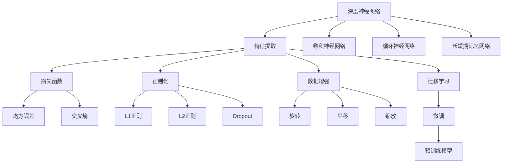
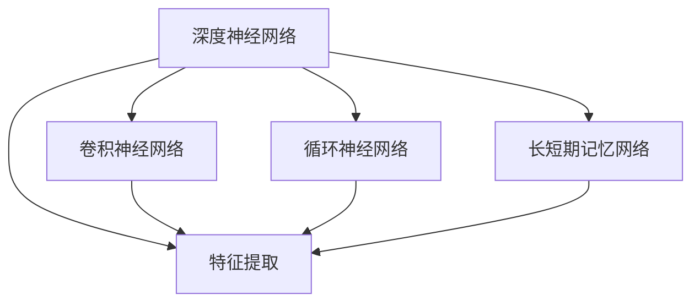
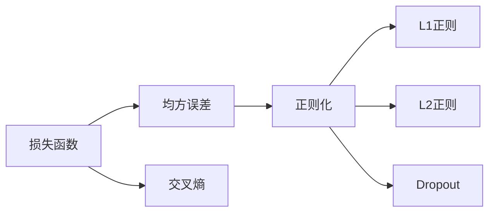
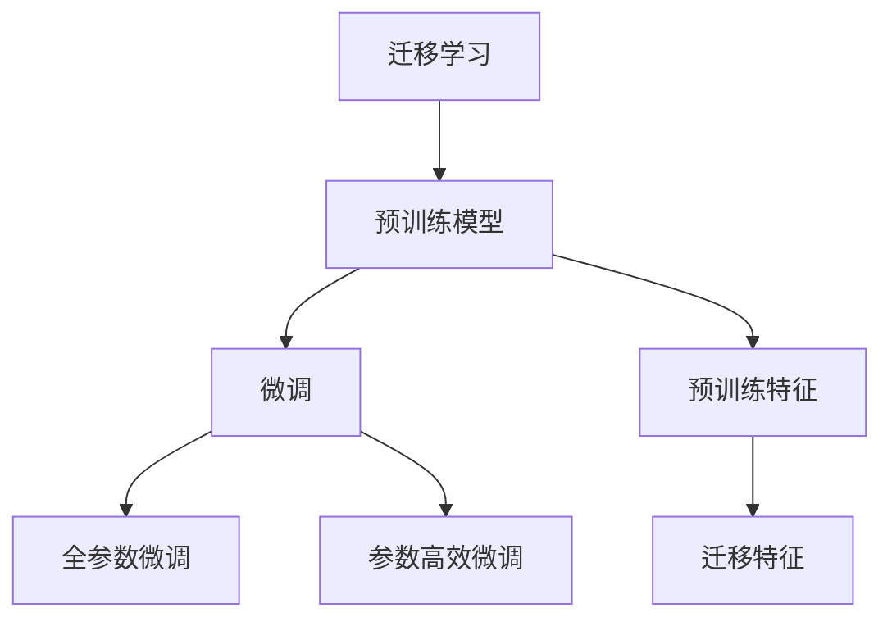

                 

## 1. 背景介绍

### 1.1 问题由来
随着深度学习技术的发展，基于深度学习模型提取图像视频特征（特征提取）已经成为了计算机视觉、图像识别、视频分析等领域的重要基础技术。例如，在目标检测、人脸识别、图像检索、视频分类等任务中，特征提取都扮演着至关重要的角色。然而，传统的特征提取方法往往需要手工设计特征，无法自动从原始数据中学习到更为丰富的语义和细节信息。近年来，深度神经网络在图像和视频特征提取中取得了显著进展，这得益于深度网络强大的非线性建模能力和海量的训练数据。基于深度学习模型提取图像视频特征的范式，不仅提升了特征表达能力，还为后续的图像视频分析任务奠定了坚实基础。

### 1.2 问题核心关键点
本文聚焦于基于深度学习的图像视频特征提取方法。我们将从几个关键点展开讨论：
- **深度网络结构**：介绍卷积神经网络(CNN)和循环神经网络(RNN)等深度网络结构，阐述其在图像视频特征提取中的重要性和基本原理。
- **特征提取算法**：包括传统手工设计特征的缺点和基于深度学习的网络提取特征的方法。
- **模型优化技术**：详细讨论了在训练深度网络时如何优化损失函数、选择正则化技术、设计训练策略等，以提升特征提取效果。
- **应用场景与挑战**：具体分析了基于深度学习的特征提取方法在实际应用中面临的挑战，并提出相应的解决策略。

### 1.3 问题研究意义
特征提取是大规模图像视频数据分析和处理的基础，也是许多高阶视觉任务的前提。基于深度学习的特征提取方法不仅提升了特征的丰富性和鲁棒性，还减少了对手工特征设计的需求，降低了任务实现的难度和成本。此外，特征提取是许多前沿研究的基础，如图像生成、迁移学习、目标检测等，都依赖于高品质的图像特征表示。本文对基于深度学习的特征提取方法进行了全面介绍，对于研究和应用深度学习技术处理图像视频数据具有重要意义。

## 2. 核心概念与联系

### 2.1 核心概念概述

为更好地理解基于深度学习的图像视频特征提取方法，本节将介绍几个密切相关的核心概念：

- **深度神经网络**：包括卷积神经网络(CNN)、循环神经网络(RNN)、长短期记忆网络(LSTM)等。这些网络结构在图像视频特征提取中发挥了核心作用。
- **特征提取**：从原始图像或视频数据中提取有用特征的过程，是图像视频分析的重要基础。
- **损失函数**：衡量模型预测输出与真实标签之间差异的函数，常见的有均方误差(MSE)、交叉熵(Cross-Entropy)等。
- **正则化**：在训练过程中，通过增加额外的约束项来避免过拟合，如L1正则、L2正则、Dropout等。
- **数据增强**：通过旋转、平移、缩放等方式生成新的训练样本，提高模型的鲁棒性和泛化能力。
- **迁移学习**：利用在大规模数据集上预训练的模型，通过微调在新任务上取得更好的性能。

这些概念之间的逻辑关系可以通过以下Mermaid流程图来展示：



这个流程图展示了大规模图像视频特征提取的基本流程：

1. 使用卷积神经网络、循环神经网络等深度网络结构。
2. 从原始数据中提取特征。
3. 通过损失函数评估模型预测与真实标签的差异。
4. 使用正则化技术防止过拟合。
5. 通过数据增强生成新的训练样本。
6. 利用迁移学习在预训练模型上进行微调。

### 2.2 概念间的关系

这些核心概念之间存在着紧密的联系，形成了图像视频特征提取的完整生态系统。下面我们通过几个Mermaid流程图来展示这些概念之间的关系。

#### 2.2.1 深度神经网络与特征提取



这个流程图展示了深度神经网络与特征提取之间的关系：深度网络通过多个层次的抽象处理，从原始图像视频数据中提取特征。

#### 2.2.2 损失函数与正则化



这个流程图展示了损失函数与正则化技术的关系：正则化通过增加额外约束，帮助损失函数更好地优化模型参数。

#### 2.2.3 迁移学习与微调



这个流程图展示了迁移学习与微调的关系：迁移学习通过预训练模型提供的初始化权重，微调模型在新任务上的表现。

## 3. 核心算法原理 & 具体操作步骤

### 3.1 算法原理概述

基于深度学习的图像视频特征提取，主要依赖于卷积神经网络(CNN)和循环神经网络(RNN)等深度网络结构。CNN通过卷积层和池化层逐步提取图像局部特征，并利用非线性激活函数增强特征表达能力。RNN则通过循环结构，逐步处理时间序列数据，并利用长短期记忆网络(LSTM)等机制捕捉序列之间的依赖关系。

特征提取的目标是最大化模型在目标任务上的性能，通过最小化损失函数来优化模型参数。常用的损失函数包括均方误差(MSE)、交叉熵(Cross-Entropy)等。正则化技术通过增加额外的约束项，防止模型过拟合，提升泛化能力。数据增强通过增加数据样本的多样性，提高模型对新数据的适应性。迁移学习通过在大规模数据集上预训练模型，利用其强大的特征表达能力，在新任务上进行微调。

### 3.2 算法步骤详解

基于深度学习的图像视频特征提取通常包括以下几个关键步骤：

**Step 1: 准备数据集**
- 收集并标注目标任务的图像视频数据集。
- 将数据集划分为训练集、验证集和测试集。
- 使用数据增强技术扩充训练集，增加数据多样性。

**Step 2: 搭建深度网络**
- 选择合适的深度网络结构，如卷积神经网络(CNN)、循环神经网络(RNN)等。
- 设计网络架构，包括卷积层、池化层、全连接层等。
- 设置网络参数，如卷积核大小、步幅、池化大小等。

**Step 3: 选择损失函数**
- 根据任务类型，选择合适的损失函数。如分类任务使用交叉熵损失，回归任务使用均方误差损失等。
- 定义损失函数的具体形式和计算方式。

**Step 4: 设置正则化**
- 选择合适的正则化技术，如L1正则、L2正则、Dropout等。
- 定义正则化项的具体形式和计算方式。

**Step 5: 训练网络**
- 使用优化器如Adam、SGD等，设置学习率、批大小等超参数。
- 迭代训练网络，最小化损失函数。
- 使用早停法(Early Stopping)避免过拟合。

**Step 6: 评估和微调**
- 在验证集上评估模型性能，调整超参数。
- 在测试集上最终评估模型性能，优化模型参数。
- 进行迁移学习微调，在新任务上优化模型。

### 3.3 算法优缺点

基于深度学习的图像视频特征提取方法具有以下优点：
- 自动提取特征：无需手工设计特征，减少了任务实现的难度。
- 强大的表达能力：深度网络能够学习到丰富的语义和细节信息，提升特征提取性能。
- 鲁棒性强：通过正则化技术，模型对数据分布的扰动具有较好的鲁棒性。
- 泛化能力强：通过迁移学习，模型能够在新任务上获得较好的泛化性能。

同时，该方法也存在一些缺点：
- 计算资源需求高：深度网络参数量大，计算复杂度高，需要较高的计算资源。
- 训练时间长：网络参数多，训练时间长，需要足够的计算资源和时间。
- 过拟合风险：网络参数多，容易发生过拟合，需要合适的正则化技术和数据增强技术。
- 解释性不足：深度网络作为黑盒模型，难以解释其内部工作机制。

### 3.4 算法应用领域

基于深度学习的图像视频特征提取方法已经广泛应用于计算机视觉和图像处理领域，包括但不限于以下几个方面：

- **图像分类**：如MNIST、CIFAR-10等数据集上的分类任务。
- **目标检测**：如COCO、PASCAL VOC等数据集上的目标检测任务。
- **人脸识别**：如LFW、CelebA等数据集上的人脸识别任务。
- **图像分割**：如PASCAL VOC、Cityscapes等数据集上的图像分割任务。
- **视频分类**：如UCF101、HMDB51等数据集上的视频分类任务。
- **动作识别**：如UCI-HumanAction、HMDB51等数据集上的动作识别任务。

此外，特征提取技术还被广泛应用于医学影像分析、交通监控、视频推荐等更多领域，为实际应用提供了坚实的技术支持。

## 4. 数学模型和公式 & 详细讲解  
### 4.1 数学模型构建

本节将使用数学语言对基于深度学习的图像视频特征提取过程进行更加严格的刻画。

记输入图像视频数据为 $\mathbf{X} \in \mathbb{R}^{n \times d}$，其中 $n$ 为样本数，$d$ 为特征维度。输出标签为 $\mathbf{y} \in \mathbb{R}^{n \times 1}$，其中 $y_i$ 表示第 $i$ 个样本的分类标签。

定义卷积神经网络 $f_{\theta}(\mathbf{X})$，其中 $\theta$ 为网络参数。在目标任务上，定义损失函数 $\mathcal{L}(\theta)$，用于衡量模型预测输出与真实标签之间的差异。

数学模型构建过程如下：

$$
\mathbf{X} = \{\mathbf{x}_1, \mathbf{x}_2, \ldots, \mathbf{x}_n\}
$$

$$
\mathbf{y} = \{y_1, y_2, \ldots, y_n\}
$$

$$
\mathbf{f}_{\theta}(\mathbf{X}) = \{\mathbf{f}_{\theta}(\mathbf{x}_1), \mathbf{f}_{\theta}(\mathbf{x}_2), \ldots, \mathbf{f}_{\theta}(\mathbf{x}_n)\}
$$

$$
\mathcal{L}(\theta) = \frac{1}{N} \sum_{i=1}^N \ell(\mathbf{y}_i, \mathbf{f}_{\theta}(\mathbf{x}_i))
$$

其中 $\ell$ 为损失函数，常见有均方误差损失和交叉熵损失。

### 4.2 公式推导过程

以二分类任务为例，推导交叉熵损失函数及其梯度的计算公式。

定义模型输出为 $\hat{y}_i = f_{\theta}(\mathbf{x}_i)$，则交叉熵损失函数为：

$$
\ell(y_i, \hat{y}_i) = -y_i \log \hat{y}_i - (1-y_i) \log (1-\hat{y}_i)
$$

代入经验风险公式，得：

$$
\mathcal{L}(\theta) = -\frac{1}{N} \sum_{i=1}^N [y_i \log \hat{y}_i + (1-y_i) \log (1-\hat{y}_i)]
$$

根据链式法则，损失函数对参数 $\theta_k$ 的梯度为：

$$
\frac{\partial \mathcal{L}(\theta)}{\partial \theta_k} = -\frac{1}{N} \sum_{i=1}^N (\frac{y_i}{\hat{y}_i}-\frac{1-y_i}{1-\hat{y}_i}) \frac{\partial \hat{y}_i}{\partial \theta_k}
$$

其中 $\frac{\partial \hat{y}_i}{\partial \theta_k}$ 可进一步递归展开，利用反向传播算法完成计算。

### 4.3 案例分析与讲解

以图像分类任务为例，展示如何构建和训练卷积神经网络。

首先，定义卷积神经网络的结构：

```python
import torch.nn as nn
import torch.nn.functional as F

class ConvNet(nn.Module):
    def __init__(self):
        super(ConvNet, self).__init__()
        self.conv1 = nn.Conv2d(3, 32, kernel_size=3, padding=1)
        self.pool1 = nn.MaxPool2d(kernel_size=2, stride=2)
        self.conv2 = nn.Conv2d(32, 64, kernel_size=3, padding=1)
        self.pool2 = nn.MaxPool2d(kernel_size=2, stride=2)
        self.fc1 = nn.Linear(64 * 7 * 7, 512)
        self.fc2 = nn.Linear(512, 10)

    def forward(self, x):
        x = self.pool1(F.relu(self.conv1(x)))
        x = self.pool2(F.relu(self.conv2(x)))
        x = x.view(-1, 64 * 7 * 7)
        x = F.relu(self.fc1(x))
        x = self.fc2(x)
        return x
```

然后，定义损失函数和优化器：

```python
import torch
import torch.optim as optim

criterion = nn.CrossEntropyLoss()
optimizer = optim.SGD(model.parameters(), lr=0.001, momentum=0.9)
```

接着，定义训练和评估函数：

```python
def train(model, device, train_loader, optimizer, criterion):
    model.train()
    for batch_idx, (data, target) in enumerate(train_loader):
        data, target = data.to(device), target.to(device)
        optimizer.zero_grad()
        output = model(data)
        loss = criterion(output, target)
        loss.backward()
        optimizer.step()
        if batch_idx % 100 == 0:
            print(f'Train Epoch: {epoch} [{batch_idx*len(data)}/{len(train_loader.dataset)} ({100*batch_idx/len(train_loader):0.1f}%)]\tLoss: {loss:.6f}')

def evaluate(model, device, test_loader, criterion):
    model.eval()
    test_loss = 0
    correct = 0
    with torch.no_grad():
        for data, target in test_loader:
            data, target = data.to(device), target.to(device)
            output = model(data)
            test_loss += criterion(output, target).item()
            pred = output.argmax(dim=1, keepdim=True)
            correct += pred.eq(target.view_as(pred)).sum().item()

    print(f'Test set: Average loss: {test_loss/len(test_loader):4f}, Accuracy: {100*correct/len(test_loader.dataset):0.1f}%')
```

最后，启动训练流程并在测试集上评估：

```python
import torch
import torchvision.transforms as transforms
import torchvision.datasets as datasets

transform_train = transforms.Compose([
    transforms.RandomCrop(32, padding=4),
    transforms.RandomHorizontalFlip(),
    transforms.ToTensor(),
    transforms.Normalize((0.5, 0.5, 0.5), (0.5, 0.5, 0.5))
])

transform_test = transforms.Compose([
    transforms.ToTensor(),
    transforms.Normalize((0.5, 0.5, 0.5), (0.5, 0.5, 0.5))
])

train_dataset = datasets.CIFAR10(root='./data', train=True, download=True, transform=transform_train)
test_dataset = datasets.CIFAR10(root='./data', train=False, download=True, transform=transform_test)

train_loader = torch.utils.data.DataLoader(train_dataset, batch_size=128, shuffle=True, num_workers=2)
test_loader = torch.utils.data.DataLoader(test_dataset, batch_size=128, shuffle=False, num_workers=2)

device = torch.device('cuda' if torch.cuda.is_available() else 'cpu')

model = ConvNet().to(device)

for epoch in range(10):
    train(model, device, train_loader, optimizer, criterion)
    evaluate(model, device, test_loader, criterion)
```

以上就是使用PyTorch构建和训练卷积神经网络的完整代码实现。可以看到，利用PyTorch的强大封装能力，我们可以用相对简洁的代码实现卷积神经网络的构建和训练。

## 5. 项目实践：代码实例和详细解释说明
### 5.1 开发环境搭建

在进行项目实践前，我们需要准备好开发环境。以下是使用Python进行PyTorch开发的环境配置流程：

1. 安装Anaconda：从官网下载并安装Anaconda，用于创建独立的Python环境。

2. 创建并激活虚拟环境：
```bash
conda create -n pytorch-env python=3.8 
conda activate pytorch-env
```

3. 安装PyTorch：根据CUDA版本，从官网获取对应的安装命令。例如：
```bash
conda install pytorch torchvision torchaudio cudatoolkit=11.1 -c pytorch -c conda-forge
```

4. 安装各类工具包：
```bash
pip install numpy pandas scikit-learn matplotlib tqdm jupyter notebook ipython
```

完成上述步骤后，即可在`pytorch-env`环境中开始项目实践。

### 5.2 源代码详细实现

这里我们以图像分类任务为例，给出使用PyTorch进行卷积神经网络训练的完整代码实现。

首先，定义数据处理函数：

```python
import torch
from torchvision import datasets, transforms
import torch.nn as nn
import torch.optim as optim
from torch.utils.data import DataLoader

transform_train = transforms.Compose([
    transforms.RandomCrop(32, padding=4),
    transforms.RandomHorizontalFlip(),
    transforms.ToTensor(),
    transforms.Normalize((0.5, 0.5, 0.5), (0.5, 0.5, 0.5))
])

transform_test = transforms.Compose([
    transforms.ToTensor(),
    transforms.Normalize((0.5, 0.5, 0.5), (0.5, 0.5, 0.5))
])

train_dataset = datasets.CIFAR10(root='./data', train=True, download=True, transform=transform_train)
test_dataset = datasets.CIFAR10(root='./data', train=False, download=True, transform=transform_test)

train_loader = DataLoader(train_dataset, batch_size=128, shuffle=True, num_workers=2)
test_loader = DataLoader(test_dataset, batch_size=128, shuffle=False, num_workers=2)
```

然后，定义模型和优化器：

```python
import torch.nn as nn
import torch.nn.functional as F
import torch.optim as optim

class ConvNet(nn.Module):
    def __init__(self):
        super(ConvNet, self).__init__()
        self.conv1 = nn.Conv2d(3, 32, kernel_size=3, padding=1)
        self.pool1 = nn.MaxPool2d(kernel_size=2, stride=2)
        self.conv2 = nn.Conv2d(32, 64, kernel_size=3, padding=1)
        self.pool2 = nn.MaxPool2d(kernel_size=2, stride=2)
        self.fc1 = nn.Linear(64 * 7 * 7, 512)
        self.fc2 = nn.Linear(512, 10)

    def forward(self, x):
        x = self.pool1(F.relu(self.conv1(x)))
        x = self.pool2(F.relu(self.conv2(x)))
        x = x.view(-1, 64 * 7 * 7)
        x = F.relu(self.fc1(x))
        x = self.fc2(x)
        return x

model = ConvNet().to(device)

criterion = nn.CrossEntropyLoss()
optimizer = optim.SGD(model.parameters(), lr=0.001, momentum=0.9)
```

接着，定义训练和评估函数：

```python
import torch
import torchvision.transforms as transforms
import torchvision.datasets as datasets
from torch.utils.data import DataLoader

device = torch.device('cuda' if torch.cuda.is_available() else 'cpu')

def train(model, device, train_loader, optimizer, criterion):
    model.train()
    for batch_idx, (data, target) in enumerate(train_loader):
        data, target = data.to(device), target.to(device)
        optimizer.zero_grad()
        output = model(data)
        loss = criterion(output, target)
        loss.backward()
        optimizer.step()
        if batch_idx % 100 == 0:
            print(f'Train Epoch: {epoch} [{batch_idx*len(data)}/{len(train_loader.dataset)} ({100*batch_idx/len(train_loader):0.1f}%)]\tLoss: {loss:.6f}')

def evaluate(model, device, test_loader, criterion):
    model.eval()
    test_loss = 0
    correct = 0
    with torch.no_grad():
        for data, target in test_loader:
            data, target = data.to(device), target.to(device)
            output = model(data)
            test_loss += criterion(output, target).item()
            pred = output.argmax(dim=1, keepdim=True)
            correct += pred.eq(target.view_as(pred)).sum().item()

    print(f'Test set: Average loss: {test_loss/len(test_loader):4f}, Accuracy: {100*correct/len(test_loader.dataset):0.1f}%')
```

最后，启动训练流程并在测试集上评估：

```python
for epoch in range(10):
    train(model, device, train_loader, optimizer, criterion)
    evaluate(model, device, test_loader, criterion)
```

以上就是使用PyTorch进行卷积神经网络训练的完整代码实现。可以看到，利用PyTorch的强大封装能力，我们可以用相对简洁的代码实现卷积神经网络的构建和训练。

### 5.3 代码解读与分析

让我们再详细解读一下关键代码的实现细节：

**卷积神经网络定义**：
- `ConvNet`类：定义了卷积神经网络的基本结构。
- `forward`方法：定义了前向传播的计算流程，包括卷积、池化、全连接等操作。

**数据处理**：
- `transform_train`和`transform_test`：定义了训练和测试数据集的预处理方式。
- `train_dataset`和`test_dataset`：从CIFAR-10数据集中加载并预处理数据。
- `train_loader`和`test_loader`：定义了训练和测试数据集的加载器，进行批量数据处理。

**模型训练和评估**：
- `train`函数：定义了训练循环，计算损失并反向传播更新模型参数。
- `evaluate`函数：定义了模型在测试集上的评估函数，计算准确率和损失。

**训练流程**：
- `device`：定义了训练和测试的数据设备，使用GPU进行加速。
- `criterion`：定义了交叉熵损失函数。
- `optimizer`：定义了随机梯度下降优化器。
- `epoch`循环：进行10个epoch的训练，并在测试集上进行评估。

可以看到，PyTorch的深度学习框架为卷积神经网络的构建和训练提供了强大的工具支持，极大地简化了代码实现。开发者可以更加专注于模型的结构和算法优化，而不必过多关注底层的实现细节。

## 6. 实际应用场景
### 6.1 智能医疗影像分析

基于深度学习的图像视频特征提取，可以广泛应用于智能医疗影像分析中。例如，通过对CT、MRI等医学影像的特征提取，可以实现疾病诊断、病变识别等高价值任务。具体应用场景包括：

- **肺部结节检测**：利用卷积神经网络提取肺部CT影像的特征，检测肺部中的结节并分类为良恶性。
- **乳腺癌识别**：通过卷积神经网络提取乳腺癌影像的特征，实现早期筛查和分类诊断。
- **脑部病变检测**：利用卷积神经网络提取脑部MRI影像的特征，检测脑部的病变情况，如脑梗塞、脑肿瘤等。

这些应用场景不仅能减轻医生的负担，提高诊断效率，还能在早期发现潜在的健康问题，提升医疗服务质量。

### 6.2 自动驾驶系统

在自动驾驶系统中，图像视频特征提取技术也具有重要应用。通过摄像头和激光雷达等传感器获取的实时图像和点云数据，可以提取高层次的语义特征，用于环境感知、路径规划等任务。具体应用场景包括：

- **目标

