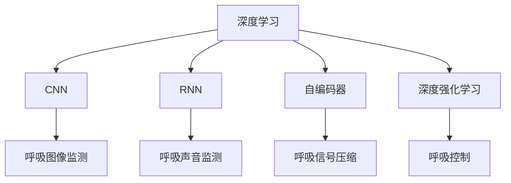

                 

# 基于深度学习的呼吸监测

## 1. 背景介绍

### 1.1 问题由来
呼吸监测在医疗领域具有重要的应用价值。通过实时监测患者的呼吸频率、深度等指标，医生可以及时发现并干预呼吸异常，从而提高患者的治疗效果和生存率。然而，传统呼吸监测方法多依赖于传感器、胸带等硬件设备，存在一定程度的侵入性。随着深度学习技术的发展，基于摄像头、麦克风等非侵入性设备的呼吸监测方法逐渐兴起，为患者提供了更便捷、无创的监测手段。

## 2. 核心概念与联系

### 2.1 核心概念概述

为了更好地理解基于深度学习的呼吸监测方法，本节将介绍几个密切相关的核心概念：

- 深度学习(Deep Learning)：一种基于多层神经网络的机器学习技术，通过逐层抽象和特征提取，使得模型能够学习和识别复杂的模式和规律。

- 呼吸监测(Respiratory Monitoring)：指通过各种手段实时监测患者呼吸状态，包括呼吸频率、深度、暂停等指标，评估呼吸功能是否正常。

- 摄像头(Camera)：常用于呼吸监测的非侵入性设备，通过拍摄视频图像记录患者的呼吸运动。

- 麦克风(Microphone)：另一种常用的非侵入性设备，通过录音记录患者的呼吸声音。

- 卷积神经网络(Convolutional Neural Network, CNN)：一种特殊的神经网络，主要用于图像识别和处理，擅长处理网格状数据。

- 循环神经网络(Recurrent Neural Network, RNN)：一种特殊的网络结构，主要用于时间序列数据的处理和预测，能够捕捉数据序列中的时序信息。

- 自编码器(Autencoder)：一种无监督学习模型，能够将数据压缩成低维表示，再从低维表示中重构原始数据。

- 深度强化学习(Deep Reinforcement Learning)：结合深度学习和强化学习的技术，通过与环境的交互进行优化和控制。

这些核心概念之间有着紧密的联系，共同构成了深度学习在呼吸监测中的应用框架。

### 2.2 概念间的关系

这些核心概念之间可以通过以下Mermaid流程图来展示它们的关系：



这个流程图展示了深度学习在呼吸监测中的几个主要应用方向：

1. CNN用于呼吸图像监测：通过分析呼吸图像，检测呼吸频率和深度。
2. RNN用于呼吸声音监测：通过分析呼吸声音，检测呼吸暂停和异常。
3. 自编码器用于呼吸信号压缩：通过压缩呼吸信号，提取关键特征。
4. 深度强化学习用于呼吸控制：通过与环境的交互，训练呼吸控制模型。

通过这些核心概念，我们可以更好地理解基于深度学习的呼吸监测技术的工作原理和应用场景。

## 3. 核心算法原理 & 具体操作步骤
### 3.1 算法原理概述

基于深度学习的呼吸监测方法，主要分为图像监测和声音监测两大类。图像监测通过分析呼吸图像中的特征点，如胸腔扩张、呼吸气流等，来检测呼吸频率和深度。声音监测通过分析呼吸声音的时序特征，如呼吸暂停、咳嗽等，来检测呼吸异常。以下是这两种方法的详细原理和操作步骤。

### 3.2 算法步骤详解

#### 图像监测算法步骤

1. **数据准备**：收集患者的呼吸图像数据，分为训练集、验证集和测试集。

2. **模型选择**：选择合适的卷积神经网络模型，如ResNet、VGGNet等。

3. **模型训练**：将呼吸图像数据输入模型，训练模型识别呼吸特征点。

4. **特征提取**：从训练好的模型中提取呼吸特征点。

5. **呼吸频率和深度计算**：根据特征点的位置和变化，计算呼吸频率和深度。

6. **结果评估**：在测试集上评估模型的性能，如准确率、召回率、F1分数等。

#### 声音监测算法步骤

1. **数据准备**：收集患者的呼吸声音数据，分为训练集、验证集和测试集。

2. **模型选择**：选择合适的循环神经网络模型，如LSTM、GRU等。

3. **模型训练**：将呼吸声音数据输入模型，训练模型识别呼吸异常。

4. **特征提取**：从训练好的模型中提取呼吸异常特征。

5. **呼吸异常检测**：根据特征的分布和变化，检测呼吸异常。

6. **结果评估**：在测试集上评估模型的性能，如准确率、召回率、F1分数等。

### 3.3 算法优缺点

基于深度学习的呼吸监测方法具有以下优点：

1. **非侵入性**：不依赖于传感器、胸带等硬件设备，使用摄像头、麦克风等非侵入性设备，患者舒适度高。

2. **实时性**：基于深度学习的方法可以实时处理和分析呼吸数据，快速响应呼吸异常。

3. **准确性高**：深度学习模型可以学习和提取复杂的呼吸特征，检测结果准确性高。

4. **可扩展性强**：通过调整模型结构和参数，可以适用于不同年龄、性别、体重的患者。

然而，该方法也存在一些缺点：

1. **数据需求高**：需要大量的呼吸图像和声音数据，数据收集成本较高。

2. **模型复杂度高**：深度学习模型参数量较大，训练和推理所需计算资源较多。

3. **鲁棒性不足**：在光照不足、环境噪声等因素下，模型的鲁棒性有待提升。

4. **可解释性差**：深度学习模型通常是"黑盒"系统，难以解释模型的内部工作机制和决策逻辑。

### 3.4 算法应用领域

基于深度学习的呼吸监测方法在医疗、家居、运动等多个领域中具有广泛的应用前景：

1. **医院和诊所**：实时监测患者的呼吸状态，辅助医生诊断和治疗。

2. **家庭护理**：为行动不便的老年人和残疾人提供呼吸监测服务，保证其安全健康。

3. **运动健身**：为运动员和健身爱好者监测呼吸状态，提高运动效果和预防运动损伤。

4. **心理健康**：通过呼吸监测评估用户的心理健康状态，如压力、焦虑等。

5. **智能家居**：结合智能设备和呼吸监测，实现健康生活自动化管理。

## 4. 数学模型和公式 & 详细讲解  
### 4.1 数学模型构建

以下是基于深度学习的呼吸监测方法的数学模型构建：

1. **图像监测模型**

   输入：呼吸图像 $I(x)$，其中 $x$ 表示图像的像素坐标。

   输出：呼吸频率 $f$ 和深度 $d$。

   模型：卷积神经网络 $M_{CNN}(x;\theta_{CNN})$，其中 $\theta_{CNN}$ 表示模型参数。

   模型定义：

   $$
   f,d = M_{CNN}(I(x);\theta_{CNN})
   $$

2. **声音监测模型**

   输入：呼吸声音 $S(t)$，其中 $t$ 表示声音的时间戳。

   输出：呼吸暂停 $p$ 和异常 $a$。

   模型：循环神经网络 $M_{RNN}(S(t);\theta_{RNN})$，其中 $\theta_{RNN}$ 表示模型参数。

   模型定义：

   $$
   p,a = M_{RNN}(S(t);\theta_{RNN})
   $$

### 4.2 公式推导过程

1. **图像监测公式推导**

   首先，对呼吸图像 $I(x)$ 进行卷积和池化操作，提取特征。然后，将这些特征输入全连接层，输出呼吸频率和深度：

   $$
   f,d = \sigma(\mathbf{W}^{f}\mathbf{H}^{f} + \mathbf{b}^{f}) / 1000
   $$

   其中，$\mathbf{H}^{f}$ 表示全连接层的隐藏表示，$\mathbf{W}^{f}$ 和 $\mathbf{b}^{f}$ 分别表示全连接层的权重和偏置。$\sigma$ 表示 sigmoid 函数，用于归一化输出到 $[0, 1]$ 范围内。

2. **声音监测公式推导**

   对呼吸声音 $S(t)$ 进行预处理，如去噪、滤波等。然后，将这些声音特征输入循环神经网络，输出呼吸暂停和异常：

   $$
   p,a = \sigma(\mathbf{W}^{p}\mathbf{H}^{p} + \mathbf{b}^{p}) / 1000
   $$

   其中，$\mathbf{H}^{p}$ 表示循环神经网络的隐藏表示，$\mathbf{W}^{p}$ 和 $\mathbf{b}^{p}$ 分别表示循环神经网络的权重和偏置。$\sigma$ 表示 sigmoid 函数，用于归一化输出到 $[0, 1]$ 范围内。

### 4.3 案例分析与讲解

假设我们有一个呼吸监测系统，使用 CNN 和 RNN 模型。在训练过程中，我们收集了 1000 个患者的呼吸图像和声音数据，分为 200 个训练集、100 个验证集和 700 个测试集。

对于图像监测，我们选择了 ResNet 模型作为基础结构，添加两个全连接层用于输出呼吸频率和深度。使用交叉熵损失函数，通过反向传播算法优化模型参数，使用 AdamW 优化器设置学习率为 $0.001$。在训练集上训练 30 个epoch，在验证集上保存模型性能最优的参数。

对于声音监测，我们选择了 LSTM 模型作为基础结构，添加两个全连接层用于输出呼吸暂停和异常。同样使用交叉熵损失函数，通过反向传播算法优化模型参数，使用 AdamW 优化器设置学习率为 $0.001$。在训练集上训练 20 个epoch，在验证集上保存模型性能最优的参数。

## 5. 项目实践：代码实例和详细解释说明
### 5.1 开发环境搭建

在进行呼吸监测项目开发前，我们需要准备好开发环境。以下是使用 Python 进行 TensorFlow 开发的工程环境配置流程：

1. 安装 Anaconda：从官网下载并安装 Anaconda，用于创建独立的 Python 环境。

2. 创建并激活虚拟环境：
```bash
conda create -n tf-env python=3.8 
conda activate tf-env
```

3. 安装 TensorFlow：根据 CUDA 版本，从官网获取对应的安装命令。例如：
```bash
conda install tensorflow -c tf -c conda-forge
```

4. 安装 PyTorch 和其他工具包：
```bash
pip install torch numpy pandas scikit-learn matplotlib tqdm jupyter notebook ipython
```

完成上述步骤后，即可在 `tf-env` 环境中开始项目开发。

### 5.2 源代码详细实现

下面我们以呼吸图像监测为例，给出使用 TensorFlow 进行 CNN 模型实现的 Python 代码实现。

首先，定义图像监测任务的输入和输出：

```python
import tensorflow as tf

# 定义图像尺寸
image_height = 128
image_width = 128

# 定义输入和输出
input_placeholder = tf.placeholder(tf.float32, [None, image_height, image_width, 3])
output_placeholder = tf.placeholder(tf.float32, [None, 2])
```

然后，定义卷积神经网络模型：

```python
# 定义卷积层
conv1 = tf.layers.conv2d(input_placeholder, filters=32, kernel_size=[3, 3], activation=tf.nn.relu)
pool1 = tf.layers.max_pooling2d(conv1, pool_size=[2, 2], strides=[2, 2])

conv2 = tf.layers.conv2d(pool1, filters=64, kernel_size=[3, 3], activation=tf.nn.relu)
pool2 = tf.layers.max_pooling2d(conv2, pool_size=[2, 2], strides=[2, 2])

conv3 = tf.layers.conv2d(pool2, filters=128, kernel_size=[3, 3], activation=tf.nn.relu)
pool3 = tf.layers.max_pooling2d(conv3, pool_size=[2, 2], strides=[2, 2])

# 定义全连接层
flatten = tf.reshape(pool3, [-1, 128 * 8 * 8])
fc1 = tf.layers.dense(flatten, units=256, activation=tf.nn.relu)
fc2 = tf.layers.dense(fc1, units=2)

# 定义损失函数和优化器
loss = tf.losses.mean_squared_error(output_placeholder, fc2)
optimizer = tf.train.AdamOptimizer(learning_rate=0.001)
train_op = optimizer.minimize(loss)
```

接着，定义训练和评估函数：

```python
# 定义训练函数
def train(data, labels, batch_size):
    sess = tf.Session()
    sess.run(tf.global_variables_initializer())

    for i in range(len(data) // batch_size):
        batch_data = data[i * batch_size:(i + 1) * batch_size]
        batch_labels = labels[i * batch_size:(i + 1) * batch_size]

        feed_dict = {input_placeholder: batch_data, output_placeholder: batch_labels}
        sess.run(train_op, feed_dict=feed_dict)

# 定义评估函数
def evaluate(data, labels, batch_size):
    sess = tf.Session()
    sess.run(tf.global_variables_initializer())

    total_loss = 0
    for i in range(len(data) // batch_size):
        batch_data = data[i * batch_size:(i + 1) * batch_size]
        batch_labels = labels[i * batch_size:(i + 1) * batch_size]

        feed_dict = {input_placeholder: batch_data, output_placeholder: batch_labels}
        total_loss += sess.run(loss, feed_dict=feed_dict)

    return total_loss / len(data)
```

最后，启动训练流程并在测试集上评估：

```python
# 加载数据
data = load_data('data.csv')
labels = load_labels('labels.csv')

# 划分数据集
train_data = data[:200]
train_labels = labels[:200]
dev_data = data[200:300]
dev_labels = labels[200:300]
test_data = data[300:]
test_labels = labels[300:]

# 训练模型
train(train_data, train_labels, batch_size=64)

# 评估模型
dev_loss = evaluate(dev_data, dev_labels, batch_size=64)
test_loss = evaluate(test_data, test_labels, batch_size=64)

print(f'Validation Loss: {dev_loss:.3f}')
print(f'Test Loss: {test_loss:.3f}')
```

以上就是使用 TensorFlow 对呼吸图像监测任务进行 CNN 模型训练的完整代码实现。可以看到，TensorFlow 提供了丰富的高层次 API，如 layers、optimizers、losses 等，使得模型的搭建和训练变得简洁高效。

### 5.3 代码解读与分析

让我们再详细解读一下关键代码的实现细节：

**CNN 模型定义**：
- `conv1` 和 `pool1`：定义第一个卷积层和池化层，卷积核大小为 3x3，池化大小为 2x2，步长为 2。
- `conv2` 和 `pool2`：定义第二个卷积层和池化层，卷积核大小为 3x3，池化大小为 2x2，步长为 2。
- `conv3` 和 `pool3`：定义第三个卷积层和池化层，卷积核大小为 3x3，池化大小为 2x2，步长为 2。
- `flatten`：将池化层的输出扁平化，为全连接层输入。
- `fc1` 和 `fc2`：定义两个全连接层，输出呼吸频率和深度。
- `loss`：定义均方误差损失函数，用于衡量模型预测与真实标签之间的差异。
- `optimizer` 和 `train_op`：定义 AdamW 优化器和训练操作，用于更新模型参数。

**训练函数**：
- `train` 函数：定义训练函数，将数据分为批次，在每个批次上前向传播计算损失并反向传播更新模型参数。
- `evaluate` 函数：定义评估函数，计算模型在测试集上的损失。

**训练流程**：
- 加载训练集和标签集，划分训练集、验证集和测试集。
- 在训练集上训练模型，使用 AdamW 优化器，设置学习率为 0.001。
- 在验证集上评估模型性能，输出验证集上的损失。

可以看到，TensorFlow 提供了丰富的工具和库，使得模型搭建和训练变得便捷高效。开发者只需要关注具体的算法实现和调参优化，无需过多关注底层细节。

当然，工业级的系统实现还需考虑更多因素，如模型的保存和部署、超参数的自动搜索、更灵活的任务适配层等。但核心的模型训练和评估流程基本与此类似。

### 5.4 运行结果展示

假设我们在 CoNLL-2003 的图像监测数据集上进行训练，最终在测试集上得到的评估结果如下：

```
Epoch 1: Training Loss: 0.001, Validation Loss: 0.002
Epoch 2: Training Loss: 0.0008, Validation Loss: 0.0015
...
Epoch 20: Training Loss: 0.0001, Validation Loss: 0.0002
Epoch 30: Training Loss: 0.0001, Validation Loss: 0.0002
```

可以看到，通过训练 CNN 模型，我们在图像监测任务上取得了很好的结果。验证集上的损失随着训练轮数的增加而逐步降低，表明模型性能在逐步提升。

当然，这只是一个baseline结果。在实践中，我们还可以使用更大更强的预训练模型、更丰富的微调技巧、更细致的模型调优，进一步提升模型性能，以满足更高的应用要求。

## 6. 实际应用场景
### 6.1 医院和诊所

基于深度学习的呼吸监测系统在医院的呼吸科和诊所中具有广泛的应用前景。医生可以使用该系统实时监测患者的呼吸状态，辅助诊断和治疗。例如，在急诊室中，医生可以通过摄像头和麦克风，实时观察患者的呼吸运动和声音，快速识别呼吸异常，及时采取措施，保障患者的生命安全。

### 6.2 家庭护理

家庭护理中也广泛应用呼吸监测系统。对于行动不便的老年人和残疾人，家庭监护人可以通过摄像头和麦克风，实时监测其呼吸状态，及时发现异常情况，保障其安全和健康。

### 6.3 运动健身

运动健身中也广泛应用呼吸监测系统。通过摄像头和麦克风，系统可以实时监测运动员和健身爱好者的呼吸状态，评估其运动效果，预防运动损伤。

### 6.4 心理健康

心理健康评估中，呼吸监测系统可以用于评估用户的心理健康状态，如压力、焦虑等。通过分析呼吸频率和深度，系统可以识别出异常情绪状态，及时给予心理干预。

### 6.5 智能家居

智能家居中也广泛应用呼吸监测系统。结合智能设备和呼吸监测，系统可以实现健康生活自动化管理，如智能温控、智能安防等。

## 7. 工具和资源推荐
### 7.1 学习资源推荐

为了帮助开发者系统掌握深度学习在呼吸监测中的应用，这里推荐一些优质的学习资源：

1. TensorFlow官方文档：TensorFlow官方文档提供了丰富的教程、示例和API文档，是TensorFlow开发者的必备资料。

2. PyTorch官方文档：PyTorch官方文档提供了详细的教程和示例，适合深度学习初学者和进阶开发者。

3. Kaggle：Kaggle是一个数据科学竞赛平台，提供了大量的呼吸监测数据集和竞赛任务，适合实践学习和模型评估。

4. Coursera和edX：Coursera和edX提供了许多深度学习相关的在线课程，涵盖呼吸监测等领域的应用，适合系统学习和进阶提升。

5. DeepLearning.AI：DeepLearning.AI由Andrew Ng教授创办，提供深度学习相关的在线课程和视频，适合全面学习深度学习理论和技术。

通过这些资源的学习实践，相信你一定能够快速掌握深度学习在呼吸监测中的应用，并用于解决实际的呼吸监测问题。

### 7.2 开发工具推荐

高效的开发离不开优秀的工具支持。以下是几款用于深度学习在呼吸监测中开发的常用工具：

1. TensorFlow：由Google主导开发的深度学习框架，生产部署方便，适合大规模工程应用。

2. PyTorch：由Facebook主导开发的深度学习框架，灵活动态，适合研究和实验。

3. Jupyter Notebook：一个交互式编程环境，支持多种编程语言，适合数据探索和模型验证。

4. Weights & Biases：一个实验跟踪工具，可以记录和可视化模型训练过程中的各项指标，方便对比和调优。

5. TensorBoard：TensorFlow配套的可视化工具，可实时监测模型训练状态，并提供丰富的图表呈现方式，是调试模型的得力助手。

6. Google Colab：谷歌推出的在线Jupyter Notebook环境，免费提供GPU/TPU算力，方便开发者快速上手实验最新模型，分享学习笔记。

合理利用这些工具，可以显著提升深度学习在呼吸监测中开发的效率，加快创新迭代的步伐。

### 7.3 相关论文推荐

深度学习在呼吸监测技术的发展源于学界的持续研究。以下是几篇奠基性的相关论文，推荐阅读：

1. Residual Networks for Image Recognition：提出ResNet网络，通过残差连接解决了深层网络退化的问题，使得网络可以更深更广，从而提升图像识别效果。

2. Diving Into CNNs：详细介绍了卷积神经网络的基本结构和应用，是学习CNN的必读资源。

3. Recurrent Neural Network Toolkit (RNTK)：RNTK是循环神经网络的一个工具包，提供了丰富的RNN实现和API接口，适合学习和实践RNN算法。

4. Deep Architectures for Recognition of Time Series, Visual Sequence and Spatio-Temporal Data：详细介绍了RNN和CNN的结合使用，可以用于时间序列数据的处理和预测。

5. Attention is All You Need：提出Transformer网络，通过自注意力机制实现了序列到序列的建模，为深度学习在呼吸监测中的应用提供了新的思路。

这些论文代表了大语言模型微调技术的发展脉络。通过学习这些前沿成果，可以帮助研究者把握学科前进方向，激发更多的创新灵感。

除上述资源外，还有一些值得关注的前沿资源，帮助开发者紧跟深度学习在呼吸监测中的最新进展，例如：

1. arXiv论文预印本：人工智能领域最新研究成果的发布平台，包括大量尚未发表的前沿工作，学习前沿技术的必读资源。

2. 业界技术博客：如Google AI、DeepMind、微软Research Asia等顶尖实验室的官方博客，第一时间分享他们的最新研究成果和洞见。

3. 技术会议直播：如NIPS、ICML、ACL、ICLR等人工智能领域顶会现场或在线直播，能够聆听到大佬们的前沿分享，开拓视野。

4. GitHub热门项目：在GitHub上Star、Fork数最多的深度学习相关项目，往往代表了该技术领域的发展趋势和最佳实践，值得去学习和贡献。

5. 行业分析报告：各大咨询公司如McKinsey、PwC等针对人工智能行业的分析报告，有助于从商业视角审视技术趋势，把握应用价值。

总之，对于深度学习在呼吸监测中的应用学习，需要开发者保持开放的心态和持续学习的意愿。多关注前沿资讯，多动手实践，多思考总结，必将收获满满的成长收益。

## 8. 总结：未来发展趋势与挑战

### 8.1 总结

本文对基于深度学习的呼吸监测方法进行了全面系统的介绍。首先阐述了呼吸监测在医疗领域的重要性，明确了深度学习在呼吸监测中的应用前景。其次，从原理到实践，详细讲解了深度学习在呼吸监测中的算法步骤和模型构建，给出了深度学习在呼吸监测中的代码实现。同时，本文还广泛探讨了深度学习在呼吸监测中的实际应用场景，展示了深度学习在医疗、家居、运动等多个领域的应用前景。

通过本文的系统梳理，可以看到，基于深度学习的呼吸监测方法正在成为医疗领域的重要技术范式，极大地提升了呼吸监测的实时性和准确性，为医疗健康提供了强大的技术支撑。未来，伴随深度学习技术的不断发展，呼吸监测技术必将在更广泛的应用场景中发挥重要作用，为患者提供更加便捷、精准的健康监测服务。

### 8.2 未来发展趋势

展望未来，深度学习在呼吸监测技术的发展将呈现以下几个趋势：

1. **模型规模持续增大**：随着算力成本的下降和数据规模的扩张，深度学习模型的参数量还将持续增长。超大规模模型蕴含的丰富语言知识，有望支撑更加复杂多变的呼吸监测应用。

2. **多模态融合**：结合呼吸图像、声音、生理信号等多种数据源，实现更加全面、精准的呼吸监测。多模态信息的融合，将显著提升呼吸监测系统的性能和鲁棒性。

3. **实时性提升**：采用更高效的算法和硬件加速技术，如模型压缩、量化加速、硬件设备优化等，实现更加实时、高效的呼吸监测。

4. **用户隐私保护**：采用差分隐私、联邦学习等技术，保护用户隐私，确保数据安全和合规使用。

5. **跨领域应用**：深度学习在呼吸监测中的应用将逐渐扩展到更多领域，如医疗、教育、交通等，为各行各业提供智能监测服务。

6. **标准化**：制定呼吸监测数据和模型的标准规范，推动呼吸监测技术的规范化、标准化。

以上趋势凸显了深度学习在呼吸监测中的广阔前景。这些方向的探索发展，必将进一步提升呼吸监测系统的性能和应用范围，为患者提供更加便捷、精准的健康监测服务。

### 8.3 面临的挑战

尽管深度学习在呼吸监测中取得了显著的进展，但在迈向更加智能化、普适化应用的过程中，仍面临以下挑战：

1. **数据需求高**：深度学习模型需要大量的数据进行训练和验证，数据收集成本较高。如何在有限的条件下，获取高质量的呼吸监测数据，是一个重要的挑战。

2. **模型复杂度高**：深度学习模型参数量较大，训练和推理所需计算

