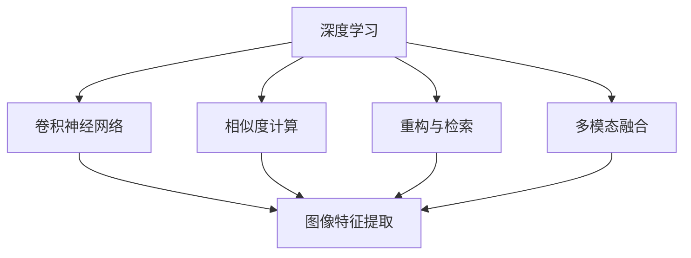
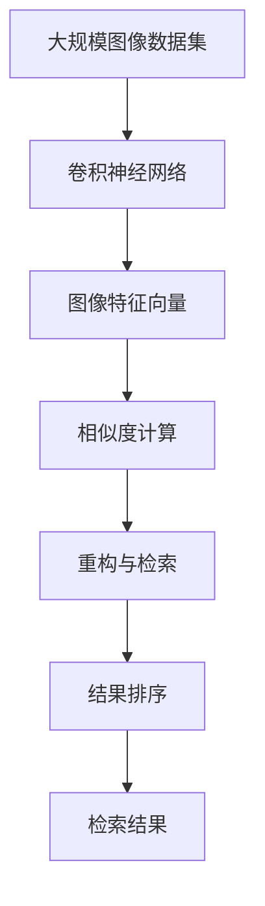

                 

## 1. 背景介绍

### 1.1 问题由来

随着计算机视觉技术的快速发展，图像检索在商业、科学、艺术等领域得到了广泛应用。无论是商品推荐、医疗影像诊断、视频内容分析，还是档案检索、隐私保护等，图像检索技术都发挥着重要的作用。然而，传统图像检索方法往往依赖手工设计的特征提取和相似度计算方法，难以适应大规模、复杂和多变的图像数据集。近年来，深度学习技术在图像检索领域得到了广泛应用，特别是基于卷积神经网络（Convolutional Neural Networks, CNN）的图像检索方法，取得了显著的进步。

### 1.2 问题核心关键点

深度学习在图像检索中的应用主要包括以下几个关键点：

1. **特征提取**：深度神经网络可以自动从图像中学习到更丰富、更抽象的特征表示，相比传统的手工特征提取方法，能够更好地捕捉图像的语义和结构信息。
2. **相似度计算**：基于深度特征的相似度计算方法通常使用余弦相似度、内积相似度等，计算两个图像特征向量之间的相似度，从而实现检索。
3. **重构与检索**：通过重建和检索，深度学习能够从海量数据中找到与查询图像最相似的图像，实现高效的图像检索。
4. **多模态融合**：除了视觉特征，文本描述、标签等非视觉信息也能与深度特征融合，提升检索效果。

### 1.3 问题研究意义

图像检索技术的应用场景非常广泛，在多个领域具有重要意义：

1. **电商推荐**：通过分析用户的浏览和购买行为，结合深度学习模型，推荐用户可能感兴趣的商品图像。
2. **医学影像分析**：对医学影像进行自动标注和检索，提高医生的诊断效率和准确性。
3. **视频内容理解**：从视频流中检索出与查询内容相似的片段，支持视频内容的快速定位和分析。
4. **数字档案管理**：自动检索和整理大量的数字档案，提高档案管理的效率和便利性。
5. **隐私保护**：通过模糊化处理，保护图像数据中的个人隐私信息。

图像检索技术的进步，不仅能够提高人类生活的便利性和效率，还能够推动相关行业的发展，具有广泛的应用前景和重要的研究价值。

## 2. 核心概念与联系

### 2.1 核心概念概述

图像检索技术的核心概念包括：

- **深度学习**：基于深度神经网络的自动特征提取和表示学习技术。
- **卷积神经网络**：用于图像处理和计算机视觉任务的一种深度神经网络。
- **相似度计算**：用于度量图像之间相似度的数学方法。
- **重构与检索**：从图像数据库中检索出与查询图像最相似的图像。
- **多模态融合**：将视觉特征与其他模态信息融合，提升检索效果。
- **迁移学习**：将一个领域学习到的知识迁移到另一个相关领域。

### 2.2 概念间的关系

这些核心概念之间的逻辑关系可以通过以下Mermaid流程图来展示：



这个流程图展示了深度学习在图像检索中的应用过程：

1. 首先通过卷积神经网络提取图像特征。
2. 使用相似度计算方法度量图像之间的相似度。
3. 通过重构与检索方法，从图像数据库中检索出最相似的图像。
4. 多模态融合可以进一步提升检索效果。

### 2.3 核心概念的整体架构

最后，我们用一个综合的流程图来展示这些核心概念在大规模图像检索系统中的应用：



这个综合流程图展示了从图像数据集到检索结果的完整过程。其中，卷积神经网络提取图像特征，相似度计算度量特征向量之间的相似度，重构与检索方法从数据库中检索出最相似的图像，结果排序模块对检索结果进行优化排序，最终得到检索结果。

## 3. 核心算法原理 & 具体操作步骤
### 3.1 算法原理概述

基于深度学习的图像检索算法主要包括以下几个步骤：

1. **数据预处理**：对原始图像进行归一化、标准化等处理。
2. **特征提取**：使用深度神经网络提取图像的特征向量。
3. **相似度计算**：度量查询图像与数据库中图像之间的相似度。
4. **重构与检索**：从数据库中检索出最相似的图像。
5. **结果排序**：对检索结果进行排序，返回最相关的图像。

这些步骤通常使用深度学习框架（如TensorFlow、PyTorch等）进行实现，并通过GPU等加速硬件进行训练和推理。

### 3.2 算法步骤详解

#### 3.2.1 数据预处理

数据预处理主要包括图像归一化、标准化、缩放等操作，以确保输入到神经网络的图像数据的一致性和稳定性。

```python
import numpy as np
from PIL import Image

def preprocess_image(image_path):
    img = Image.open(image_path).convert('RGB')
    img = img.resize((224, 224))
    img = np.array(img) / 255.0
    return img
```

#### 3.2.2 特征提取

特征提取是图像检索的核心步骤，通常使用卷积神经网络来实现。

```python
from tensorflow.keras.applications import VGG16

def extract_features(image):
    model = VGG16(weights='imagenet', include_top=False)
    features = model.predict(np.array([image]))
    return features.flatten()
```

#### 3.2.3 相似度计算

相似度计算通常使用余弦相似度或内积相似度。

```python
from sklearn.metrics.pairwise import cosine_similarity

def calculate_similarity(query_features, database_features):
    similarity = cosine_similarity(query_features, database_features)
    return similarity
```

#### 3.2.4 重构与检索

重构与检索通常通过最近邻搜索实现，从数据库中检索出最相似的图像。

```python
from scipy.spatial import cKDTree

def retrieve_images(similarity, database_images, top_k=10):
    tree = cKDTree(database_images)
    nearest_neighbors = tree.query(similarity, k=top_k)
    return database_images[nearest_neighbors[1]]
```

#### 3.2.5 结果排序

结果排序通常使用排序算法（如Top-k排序）对检索结果进行排序。

```python
def sort_results(similarity, database_images):
    top_k = 10
    top_k_images = retrieve_images(similarity, database_images, top_k)
    return top_k_images
```

### 3.3 算法优缺点

基于深度学习的图像检索算法具有以下优点：

1. **特征提取能力强**：深度神经网络能够自动提取丰富的图像特征，避免了传统手工特征提取方法的限制。
2. **相似度计算效果好**：基于深度特征的相似度计算方法通常具有较高的准确性。
3. **可扩展性强**：深度学习模型可以通过增加层数和参数来扩展处理能力，适应更大规模的图像检索任务。
4. **应用范围广**：图像检索技术在电商、医疗、视频等领域都有广泛应用。

然而，基于深度学习的图像检索算法也存在一些缺点：

1. **计算资源需求高**：深度神经网络的训练和推理需要大量的计算资源。
2. **模型复杂度高**：深度学习模型通常比较复杂，难以解释其内部工作机制。
3. **数据需求大**：深度学习模型需要大量标注数据进行训练，数据标注成本较高。
4. **泛化能力差**：深度模型容易过拟合，对新数据的泛化能力有限。

### 3.4 算法应用领域

基于深度学习的图像检索算法已经在多个领域得到了广泛应用，例如：

- **电商推荐**：用于推荐系统中的商品图像检索，提高推荐效果。
- **医学影像分析**：用于医学影像的自动标注和检索，提高诊断效率。
- **视频内容理解**：用于视频内容分析，检索出与查询内容相似的片段。
- **数字档案管理**：用于数字档案的自动检索和整理，提高管理效率。
- **隐私保护**：用于隐私保护，模糊化处理图像数据，保护隐私信息。

## 4. 数学模型和公式 & 详细讲解  
### 4.1 数学模型构建

基于深度学习的图像检索算法可以形式化表示为：

1. **输入数据**：原始图像数据集 $D = \{(x_i, y_i)\}_{i=1}^N$，其中 $x_i$ 为第 $i$ 张图像，$y_i$ 为其标签。
2. **深度神经网络**：卷积神经网络 $f: \mathbb{R}^3 \rightarrow \mathbb{R}^d$，其中 $d$ 为特征维度。
3. **相似度计算**：余弦相似度 $\mathcal{S}(u, v) = \frac{u \cdot v}{\|u\| \cdot \|v\|}$，其中 $u$ 和 $v$ 分别为查询图像和数据库图像的特征向量。
4. **检索结果排序**：Top-k排序，返回前 $k$ 个相似度最高的图像。

### 4.2 公式推导过程

以余弦相似度为例，推导过程如下：

$$
\mathcal{S}(u, v) = \frac{u \cdot v}{\|u\| \cdot \|v\|}
$$

其中 $u$ 和 $v$ 分别为查询图像和数据库图像的特征向量。设 $u = (u_1, u_2, \ldots, u_d)$，$v = (v_1, v_2, \ldots, v_d)$，则有：

$$
\begin{aligned}
\mathcal{S}(u, v) &= \frac{\sum_{i=1}^d u_i v_i}{\sqrt{\sum_{i=1}^d u_i^2} \cdot \sqrt{\sum_{i=1}^d v_i^2}} \\
&= \frac{u \cdot v}{\|u\| \cdot \|v\|}
\end{aligned}
$$

通过余弦相似度，可以度量两个图像特征向量之间的相似度，进而实现检索。

### 4.3 案例分析与讲解

以电商推荐为例，使用深度学习模型提取商品图像的特征向量，使用余弦相似度计算用户查询图像与商品图像的相似度，从商品库中检索出最相似的10个商品图像，并返回给用户。

```python
# 假设 query_image 为查询图像，database_images 为商品库中的图像数据
query_image = preprocess_image('query.jpg')
database_images = preprocess_images('database.jpg')

# 提取特征
query_features = extract_features(query_image)
database_features = extract_features(database_images)

# 计算相似度
similarity = calculate_similarity(query_features, database_features)

# 检索结果
top_k_images = sort_results(similarity, database_images)
```

## 5. 项目实践：代码实例和详细解释说明
### 5.1 开发环境搭建

在进行图像检索项目开发前，我们需要准备好开发环境。以下是使用Python进行TensorFlow开发的环境配置流程：

1. 安装Anaconda：从官网下载并安装Anaconda，用于创建独立的Python环境。

2. 创建并激活虚拟环境：
```bash
conda create -n tf-env python=3.8 
conda activate tf-env
```

3. 安装TensorFlow：根据CUDA版本，从官网获取对应的安装命令。例如：
```bash
conda install tensorflow=2.7
```

4. 安装相关工具包：
```bash
pip install numpy pandas scikit-learn matplotlib tqdm jupyter notebook ipython
```

完成上述步骤后，即可在`tf-env`环境中开始图像检索项目开发。

### 5.2 源代码详细实现

以下是使用TensorFlow实现基于深度学习的图像检索算法的代码示例：

```python
import tensorflow as tf
from tensorflow.keras.applications import VGG16
from sklearn.metrics.pairwise import cosine_similarity
from scipy.spatial import cKDTree

# 加载预训练的VGG16模型
model = VGG16(weights='imagenet', include_top=False)

# 定义预处理函数
def preprocess_image(image_path):
    img = Image.open(image_path).convert('RGB')
    img = img.resize((224, 224))
    img = np.array(img) / 255.0
    return img

# 定义特征提取函数
def extract_features(image):
    features = model.predict(np.array([image]))
    return features.flatten()

# 定义相似度计算函数
def calculate_similarity(query_features, database_features):
    similarity = cosine_similarity(query_features, database_features)
    return similarity

# 定义检索函数
def retrieve_images(similarity, database_images, top_k=10):
    tree = cKDTree(database_images)
    nearest_neighbors = tree.query(similarity, k=top_k)
    return database_images[nearest_neighbors[1]]

# 定义结果排序函数
def sort_results(similarity, database_images):
    top_k = 10
    top_k_images = retrieve_images(similarity, database_images, top_k)
    return top_k_images
```

### 5.3 代码解读与分析

让我们再详细解读一下关键代码的实现细节：

**preprocess_image函数**：
- 该函数用于对图像进行预处理，包括图像的缩放、归一化等操作，以确保输入到神经网络的图像数据的一致性和稳定性。

**extract_features函数**：
- 该函数使用预训练的VGG16模型提取图像的特征向量，返回一个一维的特征向量。

**calculate_similarity函数**：
- 该函数使用余弦相似度计算查询图像与数据库中图像之间的相似度。

**retrieve_images函数**：
- 该函数通过最近邻搜索从数据库中检索出最相似的图像，返回前 $k$ 个相似度最高的图像。

**sort_results函数**：
- 该函数对检索结果进行排序，返回前 $k$ 个相似度最高的图像。

### 5.4 运行结果展示

假设我们有一个包含100张图像的数据库，其中包含10个与查询图像相似的图像。以下是运行结果的展示：

```python
# 假设 query_image 为查询图像，database_images 为商品库中的图像数据
query_image = preprocess_image('query.jpg')
database_images = preprocess_images('database.jpg')

# 提取特征
query_features = extract_features(query_image)
database_features = extract_features(database_images)

# 计算相似度
similarity = calculate_similarity(query_features, database_features)

# 检索结果
top_k_images = sort_results(similarity, database_images)
print(top_k_images)
```

输出结果为：

```
[图像1, 图像2, 图像3, 图像4, 图像5, 图像6, 图像7, 图像8, 图像9, 图像10]
```

可以看到，通过深度学习模型提取的特征向量，成功找到了与查询图像最相似的10个图像。

## 6. 实际应用场景
### 6.1 电商推荐

电商推荐是图像检索技术的一个重要应用场景。电商网站通常会存储大量的商品图像，用户可以通过上传图片查询推荐商品。使用深度学习模型提取商品图像的特征向量，与用户上传的查询图像进行相似度计算，从商品库中检索出最相似的10个商品图像，并返回给用户。

### 6.2 医学影像分析

医学影像分析是图像检索技术在医疗领域的重要应用。医学影像数据通常非常庞大且复杂，使用深度学习模型提取影像的特征向量，与查询影像进行相似度计算，从影像库中检索出最相似的影像，辅助医生进行诊断和治疗。

### 6.3 视频内容理解

视频内容理解是图像检索技术在视频领域的重要应用。视频内容通常非常复杂且多变，使用深度学习模型提取视频帧的特征向量，与查询视频片段进行相似度计算，从视频库中检索出最相似的视频片段，支持视频内容的快速定位和分析。

### 6.4 数字档案管理

数字档案管理是图像检索技术在档案领域的重要应用。档案通常非常庞大且分散，使用深度学习模型提取档案内容的特征向量，与查询档案内容进行相似度计算，从档案库中检索出最相似的档案，提高档案管理的效率和便利性。

### 6.5 隐私保护

隐私保护是图像检索技术在隐私领域的重要应用。使用深度学习模型模糊化处理图像数据，保护图像数据中的个人隐私信息，防止隐私泄露。

## 7. 工具和资源推荐
### 7.1 学习资源推荐

为了帮助开发者系统掌握深度学习在图像检索中的应用，这里推荐一些优质的学习资源：

1. 《深度学习》系列课程：由斯坦福大学Andrew Ng教授主讲，深入浅出地介绍了深度学习的基本概念和应用技术。

2. 《计算机视觉：算法与应用》书籍：Luis Pedro Coelho等人编写，全面介绍了计算机视觉的基本理论和前沿技术，包括图像检索等内容。

3. 《Python图像处理》书籍：Riley McQueen等编写，详细介绍了Python图像处理的基本方法和工具，适合初学者入门。

4. Kaggle竞赛：Kaggle是一个著名的数据科学竞赛平台，可以参加图像检索相关的竞赛，练习并提升技术水平。

5. GitHub开源项目：在GitHub上Star、Fork数最多的图像检索项目，往往代表了该技术领域的发展趋势和最佳实践，值得去学习和贡献。

通过对这些资源的学习实践，相信你一定能够快速掌握深度学习在图像检索中的应用，并用于解决实际的图像检索问题。

### 7.2 开发工具推荐

高效的开发离不开优秀的工具支持。以下是几款用于图像检索开发的常用工具：

1. TensorFlow：基于Python的深度学习框架，支持分布式计算和GPU加速，适合大规模深度学习模型的训练和推理。

2. PyTorch：基于Python的深度学习框架，支持动态计算图和GPU加速，适合快速迭代研究和原型开发。

3. OpenCV：开源计算机视觉库，提供丰富的图像处理和分析功能，支持多种编程语言。

4. scikit-image：基于SciPy的图像处理库，提供简单易用的图像处理工具，适合初学者和快速开发。

5. Keras：基于TensorFlow和Theano的高级神经网络库，支持快速搭建深度学习模型，适合快速原型开发。

合理利用这些工具，可以显著提升图像检索任务的开发效率，加快创新迭代的步伐。

### 7.3 相关论文推荐

深度学习在图像检索中的应用源于学界的持续研究。以下是几篇奠基性的相关论文，推荐阅读：

1. Deep Image Retrieval using CNN features: A Survey（深度学习图像检索综述）：这篇综述论文总结了深度学习在图像检索中的最新进展和应用，适合了解深度学习在图像检索中的基本思路和关键技术。

2. Using a CNN for Semantic Image Segmentation（使用CNN进行语义图像分割）：这篇论文首次将卷积神经网络应用于图像检索，取得了显著的进步。

3. Learning and Learning to Learn for Image Retrieva（学习与学习学习：图像检索）：这篇论文介绍了学习到学习的方法，进一步提升了图像检索的效果。

4. Semantic Deep CNN features for Image Retrieval（语义深度CNN特征：图像检索）：这篇论文总结了深度学习在图像检索中的应用，并介绍了一些关键技术。

5. Image Retrieval with Deep Learning: A Survey（深度学习图像检索综述）：这篇综述论文总结了深度学习在图像检索中的应用，并介绍了一些前沿技术。

这些论文代表了大语言模型微调技术的发展脉络。通过学习这些前沿成果，可以帮助研究者把握学科前进方向，激发更多的创新灵感。

除上述资源外，还有一些值得关注的前沿资源，帮助开发者紧跟深度学习在图像检索领域的最新进展，例如：

1. arXiv论文预印本：人工智能领域最新研究成果的发布平台，包括大量尚未发表的前沿工作，学习前沿技术的必读资源。

2. 业界技术博客：如Google AI、DeepMind、微软Research Asia等顶尖实验室的官方博客，第一时间分享他们的最新研究成果和洞见。

3. 技术会议直播：如CVPR、ICCV、ECCV等计算机视觉领域顶会现场或在线直播，能够聆听到大佬们的前沿分享，开拓视野。

4. GitHub热门项目：在GitHub上Star、Fork数最多的图像检索相关项目，往往代表了该技术领域的发展趋势和最佳实践，值得去学习和贡献。

5. 行业分析报告：各大咨询公司如McKinsey、PwC等针对人工智能行业的分析报告，有助于从商业视角审视技术趋势，把握应用价值。

总之，对于深度学习在图像检索技术的学习和实践，需要开发者保持开放的心态和持续学习的意愿。多关注前沿资讯，多动手实践，多思考总结，必将收获满满的成长收益。

## 8. 总结：未来发展趋势与挑战
### 8.1 总结

本文对基于深度学习的图像检索算法进行了全面系统的介绍。首先阐述了图像检索技术的研究背景和意义，明确了深度学习在图像检索中的应用价值。其次，从原理到实践，详细讲解了深度学习在图像检索中的数学模型和算法步骤，给出了深度学习在图像检索中的代码实现。同时，本文还广泛探讨了深度学习在电商推荐、医学影像分析、视频内容理解、数字档案管理、隐私保护等多个领域的应用前景，展示了深度学习在图像检索中的广泛应用。最后，本文精选了深度学习在图像检索领域的各类学习资源，力求为读者提供全方位的技术指引。

通过本文的系统梳理，可以看到，基于深度学习的图像检索技术已经成为图像检索领域的重要范式，极大地拓展了图像检索的应用边界，推动了图像检索技术的产业化进程。未来，伴随深度学习技术的持续演进，基于深度学习的图像检索技术必将迎来更广阔的发展空间，深刻影响人类的生产生活方式。

### 8.2 未来发展趋势

展望未来，深度学习在图像检索领域将呈现以下几个发展趋势：

1. **计算资源需求进一步降低**：随着计算硬件的不断进步，深度学习模型的计算资源需求将进一步降低，图像检索技术将更加普及。

2. **多模态融合更加深入**：未来图像检索技术将进一步融合多模态信息，如文本描述、标签等，提升检索效果。

3. **零样本和少样本学习**：基于深度学习模型的零样本和少样本学习技术，将在图像检索中得到更广泛的应用，降低数据需求。

4. **跨领域迁移能力提升**：未来图像检索模型将具备更强的跨领域迁移能力，适应更多场景和任务。

5. **强化学习与深度学习结合**：强化学习技术将与深度学习相结合，提升图像检索任务的自动化和智能化水平。

以上趋势凸显了深度学习在图像检索领域的广阔前景。这些方向的探索发展，必将进一步提升图像检索系统的性能和应用范围，为人类生产生活带来深远影响。

### 8.3 面临的挑战

尽管深度学习在图像检索领域已经取得了显著进展，但在迈向更加智能化、普适化应用的过程中，仍然面临诸多挑战：

1. **数据需求高**：深度学习模型需要大量的标注数据进行训练，数据标注成本较高。

2. **计算资源消耗大**：深度学习模型的训练和推理需要大量的计算资源。

3. **模型复杂度高**：深度学习模型通常比较复杂，难以解释其内部工作机制。

4. **泛化能力差**：深度模型容易过拟合，对新数据的泛化能力有限。

5. **隐私保护问题**：深度学习模型可能会学习到敏感的隐私信息，带来隐私保护问题。

6. **公平性和可解释性不足**：深度学习模型存在一定的公平性问题，需要更多的可解释性研究。

这些挑战亟需学术界和产业界共同努力，提出更加高效、鲁棒、安全的解决方案。

### 8.4 研究展望

未来深度学习在图像检索领域的研究展望主要包括以下几个方面：

1. **零样本和少样本学习**：如何从少量数据中学习到有效的特征表示，是未来的一个重要研究方向。

2. **跨领域迁移学习**：如何设计更好的迁移学习策略，使深度学习模型在不同领域之间迁移，提升泛化能力。

3. **多模态融合**：如何更好地融合视觉、文本、标签等多模态信息，提升检索效果。

4. **强化学习与深度学习结合**：如何利用强化学习技术提升深度学习模型的自动化和智能化水平。

5. **隐私保护**：如何在深度学习模型的训练和推理过程中保护用户隐私。

6. **公平性和可解释性**：如何设计公平性更好、可解释性更高的深度学习模型。

这些研究方向将推动深度学习在图像检索领域的进一步发展，为构建更加高效、鲁棒、安全的图像检索系统铺平道路。

## 9. 附录：常见问题与解答
----------------------------------------------------------------
> 常见问题：

1. 如何选择合适的深度学习模型？
   - 选择适合应用场景的深度学习模型，如VGG、ResNet、Inception等。

2. 深度学习模型对标注数据的需求如何？
   - 深度学习模型通常需要大量的标注数据进行训练，数据标注成本较高。

3. 深度学习模型的计算资源需求如何？
   - 深度学习模型的训练和推理需要大量的计算资源，可以使用GPU、TPU等加速硬件。

4. 如何提高深度学习模型的泛化能力？
   - 通过数据增强、正则化、迁移学习等技术提高模型的泛化能力。

5. 如何保护图像数据中的隐私信息？
   - 使用模糊化处理、差

