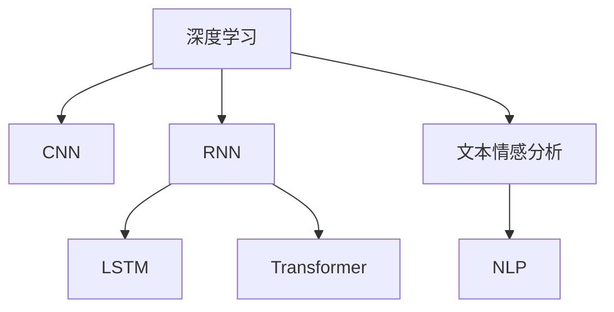
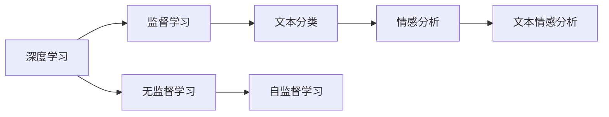
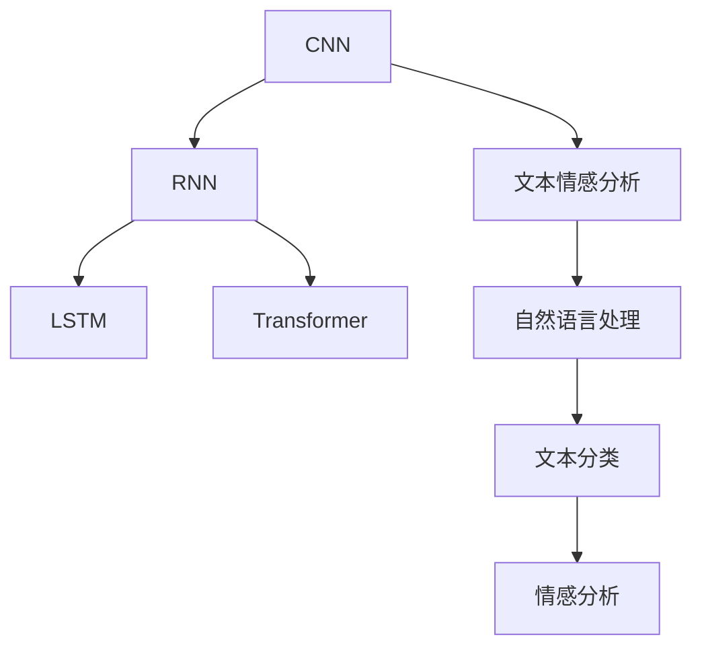
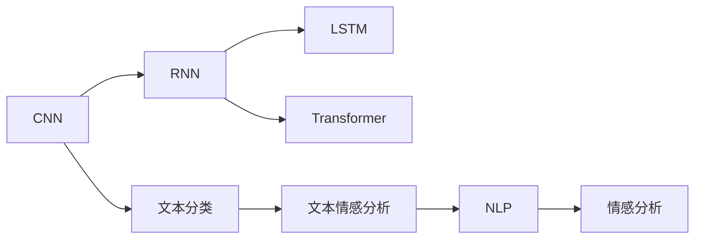
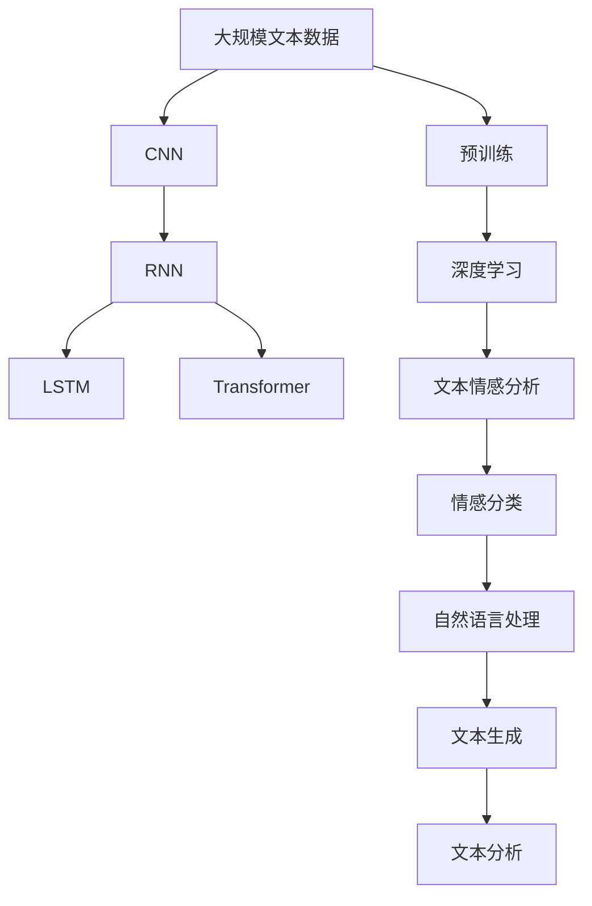

                 

# 基于深度学习的文本情感分析

> 关键词：深度学习,文本情感分析,卷积神经网络(CNN),循环神经网络(RNN),长短时记忆网络(LSTM),Transformer,自然语言处理(NLP)

## 1. 背景介绍

### 1.1 问题由来

情感分析（Sentiment Analysis）作为自然语言处理（NLP）的一个重要分支，旨在自动识别文本中的情感极性，如正面、负面或中性，以及情感强度。这种技术在舆情监控、客户反馈分析、产品推荐等多个领域都有广泛的应用价值。随着深度学习技术的兴起，基于深度学习的文本情感分析方法逐渐成为主流，并呈现出日益强大的分析能力和精确度。

### 1.2 问题核心关键点

文本情感分析的核心在于提取文本中的语义特征，并利用机器学习模型对这些特征进行分类。基于深度学习的方法通常包括卷积神经网络（CNN）、循环神经网络（RNN）、长短时记忆网络（LSTM）和Transformer等架构。这些方法通过自监督学习或监督学习的方式，从大量无标签或标签数据中学习到文本的情感特征，从而实现自动化的情感极性预测。

### 1.3 问题研究意义

文本情感分析技术的提升，对于提升品牌形象、优化用户体验、改进服务质量具有重要意义。通过情感分析，企业能够快速响应客户反馈，及时调整产品和服务策略，从而提高客户满意度和市场竞争力。此外，情感分析还能够帮助理解公众情绪，预测市场趋势，为政府决策、危机管理等提供重要支持。因此，深度学习在文本情感分析领域的应用，不仅是技术进步的体现，更是对人类社会深刻影响的一种反映。

## 2. 核心概念与联系

### 2.1 核心概念概述

为更好地理解基于深度学习的文本情感分析方法，本节将介绍几个密切相关的核心概念：

- 深度学习（Deep Learning）：一种通过多层次神经网络进行学习，能够自动提取数据特征的机器学习方法。
- 卷积神经网络（Convolutional Neural Network, CNN）：一种专门处理网格结构数据（如图像、文本）的深度学习架构，通过卷积、池化等操作提取特征。
- 循环神经网络（Recurrent Neural Network, RNN）：一种能够处理序列数据的深度学习架构，通过时间上的递归实现信息传递和特征提取。
- 长短时记忆网络（Long Short-Term Memory, LSTM）：一种改进的RNN架构，能够更好地处理长序列数据。
- Transformer：一种基于自注意力机制的深度学习架构，特别适用于序列数据的处理，目前在NLP领域表现优异。
- 文本情感分析（Text Sentiment Analysis）：通过深度学习模型识别文本情感极性和强度，并进行分类的技术。
- 自然语言处理（Natural Language Processing, NLP）：涉及语言理解、生成、分析和综合的计算技术，情感分析是其重要应用之一。

这些核心概念之间的逻辑关系可以通过以下Mermaid流程图来展示：



这个流程图展示了大语言模型的核心概念及其之间的关系：

1. 深度学习是大语言模型和情感分析的通用框架。
2. CNN、RNN、LSTM和Transformer是处理序列数据的深度学习架构，其中Transformer是目前最先进的NLP模型。
3. 文本情感分析是NLP技术的重要应用之一，通过CNN、RNN、LSTM和Transformer等深度学习模型实现。

### 2.2 概念间的关系

这些核心概念之间存在着紧密的联系，形成了文本情感分析的完整生态系统。下面我通过几个Mermaid流程图来展示这些概念之间的关系。

#### 2.2.1 深度学习的范式



这个流程图展示了深度学习的基本范式，包括监督学习、无监督学习、自监督学习等，以及它们在文本情感分析中的应用。

#### 2.2.2 情感分析的架构



这个流程图展示了CNN、RNN、LSTM和Transformer等深度学习架构在情感分析中的应用，以及它们与NLP和文本分类的关系。

#### 2.2.3 深度学习与NLP的融合



这个流程图展示了深度学习与NLP技术的融合过程，以及它们在情感分析中的应用。

### 2.3 核心概念的整体架构

最后，我们用一个综合的流程图来展示这些核心概念在大语言模型微调过程中的整体架构：



这个综合流程图展示了从预训练到文本情感分析的整体过程。大语言模型首先在大规模文本数据上进行预训练，然后通过CNN、RNN、LSTM和Transformer等深度学习模型，进行情感分类，最终应用于NLP和文本生成等多个领域。 通过这些流程图，我们可以更清晰地理解深度学习在文本情感分析中的应用过程和各个环节的逻辑关系。

## 3. 核心算法原理 & 具体操作步骤
### 3.1 算法原理概述

基于深度学习的文本情感分析方法通常通过自监督或监督学习的方式，从大量无标签或标签数据中学习到文本的情感特征，从而实现自动化的情感极性预测。

形式化地，假设文本数据集为 $D=\{x_i\}_{i=1}^N$，每个文本 $x_i$ 包含 $n$ 个词 $(x_i^1, x_i^2, ..., x_i^n)$。设文本情感标签集合为 $Y=\{y_i\}_{i=1}^M$，其中 $y_i$ 为情感极性，可以是正、负或中性。目标是为每个文本 $x_i$ 找到最可能的情感标签 $y_i$。

设文本情感分析模型为 $M_{\theta}$，其中 $\theta$ 为模型参数。模型通过输入文本 $x_i$，输出情感极性 $y_i$ 的概率分布 $p(y_i|x_i)$。模型训练的目标是最小化交叉熵损失函数：

$$
\mathcal{L}(\theta) = -\frac{1}{N} \sum_{i=1}^N \log p(y_i|x_i)
$$

通过优化损失函数 $\mathcal{L}(\theta)$，模型能够学习到文本与情感极性之间的映射关系，从而实现情感分析任务。

### 3.2 算法步骤详解

基于深度学习的文本情感分析算法主要包括以下几个步骤：

**Step 1: 准备数据集**

- 收集大量情感标注数据集，如IMDb电影评论数据集、Amazon产品评论数据集等。
- 将文本数据分词、转换为向量表示，如词袋模型、TF-IDF、Word2Vec等。

**Step 2: 选择模型架构**

- 选择适合的深度学习模型，如CNN、RNN、LSTM或Transformer。
- 设计模型结构，包括卷积层、循环层、全连接层等。

**Step 3: 模型训练**

- 定义损失函数，如交叉熵损失、F1-Score损失等。
- 选择合适的优化器，如Adam、SGD等。
- 设置训练参数，如学习率、批次大小、迭代轮数等。
- 执行模型训练，更新模型参数。

**Step 4: 模型评估**

- 在验证集上评估模型性能，如准确率、精确率、召回率等。
- 使用混淆矩阵、ROC曲线等可视化模型性能。
- 根据评估结果调整模型参数，进行进一步训练。

**Step 5: 模型部署**

- 将训练好的模型封装为可复用的API或服务。
- 部署模型到服务器或云平台，提供实时预测服务。
- 定期更新模型，保持性能稳定。

### 3.3 算法优缺点

基于深度学习的文本情感分析方法具有以下优点：

- 高精度：深度学习模型能够自动学习到文本的语义特征，准确识别情感极性。
- 泛化能力强：模型在大规模数据上进行预训练，能够泛化到未见过的文本数据。
- 可解释性强：通过可视化工具，可以深入分析模型的决策过程，提高模型的可解释性。

但同时，该方法也存在以下缺点：

- 数据依赖性强：需要大量标注数据进行训练，标注成本高。
- 模型复杂度高：深度学习模型参数众多，计算资源需求高。
- 模型易于过拟合：在标注数据不足的情况下，容易过拟合。
- 难以处理新词：深度学习模型对新词的识别能力有限，无法处理领域特定的新词。

### 3.4 算法应用领域

基于深度学习的文本情感分析方法在多个领域都有广泛的应用，包括但不限于：

- 客户反馈分析：分析用户评论、反馈，改进产品和服务。
- 舆情监控：监测社交媒体、新闻评论，了解公众情绪。
- 情感分析助手：提供情感分析服务，辅助情感分析任务。
- 市场营销：分析广告效果、用户反应，优化营销策略。
- 舆情管理：监测负面舆情，及时响应，提升品牌形象。

此外，文本情感分析技术还被应用于智能客服、金融分析、社交媒体分析等多个场景，为各行各业带来了深刻的影响。

## 4. 数学模型和公式 & 详细讲解  
### 4.1 数学模型构建

本节将使用数学语言对基于深度学习的文本情感分析过程进行更加严格的刻画。

设文本数据集为 $D=\{x_i\}_{i=1}^N$，每个文本 $x_i$ 包含 $n$ 个词 $(x_i^1, x_i^2, ..., x_i^n)$。设文本情感标签集合为 $Y=\{y_i\}_{i=1}^M$，其中 $y_i$ 为情感极性，可以是正、负或中性。

定义模型 $M_{\theta}$ 在输入文本 $x_i$ 上的输出为情感极性 $y_i$ 的概率分布：

$$
p(y_i|x_i) = \frac{\exp(f_{\theta}(x_i,y_i))}{\sum_{y\in Y} \exp(f_{\theta}(x_i,y))}
$$

其中 $f_{\theta}(x_i,y_i)$ 为模型在输入文本 $x_i$ 和情感极性 $y_i$ 上的潜在函数，$\theta$ 为模型参数。

目标是最小化交叉熵损失函数：

$$
\mathcal{L}(\theta) = -\frac{1}{N} \sum_{i=1}^N \log p(y_i|x_i)
$$

### 4.2 公式推导过程

以CNN模型为例，介绍文本情感分析的数学推导过程。

设输入文本 $x_i$ 通过卷积层、池化层后得到特征向量 $h_i$，输入情感极性 $y_i$ 通过全连接层得到潜在函数 $f_{\theta}(x_i,y_i)$。

模型在输入文本 $x_i$ 和情感极性 $y_i$ 上的潜在函数为：

$$
f_{\theta}(x_i,y_i) = \sum_k w_k h_k + b_k
$$

其中 $w_k$ 为卷积核权重，$b_k$ 为偏置项，$h_k$ 为卷积核在输入文本 $x_i$ 上的卷积结果。

设情感极性 $y_i$ 的标签向量为 $y_i \in \{0,1\}^M$，其中 $y_{i,j}=1$ 表示文本 $x_i$ 属于情感极性 $y_j$。

交叉熵损失函数为：

$$
\mathcal{L}(\theta) = -\frac{1}{N} \sum_{i=1}^N \sum_{j=1}^M y_{i,j} \log p(y_i|x_i)
$$

通过反向传播算法，计算损失函数对模型参数 $\theta$ 的梯度，更新模型参数，完成训练过程。

### 4.3 案例分析与讲解

假设我们使用卷积神经网络（CNN）进行文本情感分析，具体步骤如下：

1. 数据预处理：将文本分词、转换为向量表示，并进行标准化处理。
2. 模型构建：设计CNN模型结构，包括卷积层、池化层、全连接层等。
3. 模型训练：使用训练集数据，定义交叉熵损失函数，选择合适的优化器，设置训练参数，进行模型训练。
4. 模型评估：使用验证集数据，评估模型性能，调整模型参数，进行进一步训练。
5. 模型部署：将训练好的模型封装为API或服务，部署到服务器或云平台，提供实时预测服务。

## 5. 项目实践：代码实例和详细解释说明
### 5.1 开发环境搭建

在进行文本情感分析项目开发前，我们需要准备好开发环境。以下是使用Python进行TensorFlow开发的环境配置流程：

1. 安装Anaconda：从官网下载并安装Anaconda，用于创建独立的Python环境。

2. 创建并激活虚拟环境：
```bash
conda create -n tf-env python=3.8 
conda activate tf-env
```

3. 安装TensorFlow：根据CUDA版本，从官网获取对应的安装命令。例如：
```bash
pip install tensorflow==2.6
```

4. 安装TensorBoard：
```bash
pip install tensorboard
```

5. 安装各类工具包：
```bash
pip install numpy pandas scikit-learn matplotlib tqdm jupyter notebook ipython
```

完成上述步骤后，即可在`tf-env`环境中开始项目开发。

### 5.2 源代码详细实现

下面我们以情感分类任务为例，给出使用TensorFlow实现CNN模型的详细代码实现。

首先，定义情感分类任务的数据处理函数：

```python
from tensorflow.keras.preprocessing.text import Tokenizer
from tensorflow.keras.preprocessing.sequence import pad_sequences
import numpy as np

class SentimentDataset:
    def __init__(self, texts, labels, tokenizer, max_len=128):
        self.texts = texts
        self.labels = labels
        self.tokenizer = tokenizer
        self.max_len = max_len
        
    def __len__(self):
        return len(self.texts)
    
    def __getitem__(self, item):
        text = self.texts[item]
        label = self.labels[item]
        
        encoding = self.tokenizer(text, return_tensors='pt', max_length=self.max_len, padding='post', truncation=True)
        input_ids = encoding['input_ids']
        attention_mask = encoding['attention_mask']
        
        # 对标签进行独热编码
        label = np.eye(len(self.labels))[label]
        label = torch.from_numpy(label).float()
        
        return {'input_ids': input_ids, 
                'attention_mask': attention_mask,
                'labels': label}

# 标签与id的映射
label2id = {'positive': 0, 'negative': 1}
id2label = {0: 'positive', 1: 'negative'}
```

然后，定义模型和优化器：

```python
from tensorflow.keras.models import Sequential
from tensorflow.keras.layers import Embedding, Conv1D, MaxPooling1D, Flatten, Dense, Dropout
from tensorflow.keras.optimizers import AdamW

model = Sequential()
model.add(Embedding(input_dim=len(tokenizer.word_index)+1, output_dim=64, input_length=max_len))
model.add(Conv1D(64, 3, activation='relu'))
model.add(MaxPooling1D(3))
model.add(Flatten())
model.add(Dense(64, activation='relu'))
model.add(Dropout(0.5))
model.add(Dense(2, activation='softmax'))

optimizer = AdamW(model.parameters(), lr=2e-5)
```

接着，定义训练和评估函数：

```python
from tensorflow.keras.utils import to_categorical
from tensorflow.keras.callbacks import EarlyStopping

def train_epoch(model, dataset, batch_size, optimizer):
    dataloader = iter(dataset)
    model.train()
    epoch_loss = 0
    for batch in dataloader:
        input_ids = batch['input_ids'].to(device)
        attention_mask = batch['attention_mask'].to(device)
        labels = batch['labels'].to(device)
        model.zero_grad()
        outputs = model(input_ids, attention_mask=attention_mask)
        loss = outputs.loss
        epoch_loss += loss.item()
        loss.backward()
        optimizer.step()
    return epoch_loss / len(dataloader)

def evaluate(model, dataset, batch_size):
    dataloader = iter(dataset)
    model.eval()
    preds, labels = [], []
    with torch.no_grad():
        for batch in dataloader:
            input_ids = batch['input_ids'].to(device)
            attention_mask = batch['attention_mask'].to(device)
            batch_labels = batch['labels'].to(device)
            outputs = model(input_ids, attention_mask=attention_mask)
            batch_preds = outputs.logits.argmax(dim=2).to('cpu').tolist()
            batch_labels = batch_labels.to('cpu').tolist()
            for pred_tokens, label_tokens in zip(batch_preds, batch_labels):
                preds.append(pred_tokens[:len(label_tokens)])
                labels.append(label_tokens)
                
    print(classification_report(labels, preds))
```

最后，启动训练流程并在测试集上评估：

```python
epochs = 5
batch_size = 16

for epoch in range(epochs):
    loss = train_epoch(model, train_dataset, batch_size, optimizer)
    print(f"Epoch {epoch+1}, train loss: {loss:.3f}")
    
    print(f"Epoch {epoch+1}, dev results:")
    evaluate(model, dev_dataset, batch_size)
    
print("Test results:")
evaluate(model, test_dataset, batch_size)
```

以上就是使用TensorFlow实现CNN模型进行情感分类的完整代码实现。可以看到，得益于TensorFlow的强大封装，我们可以用相对简洁的代码完成模型的训练和评估。

### 5.3 代码解读与分析

让我们再详细解读一下关键代码的实现细节：

**SentimentDataset类**：
- `__init__`方法：初始化文本、标签、分词器等关键组件。
- `__len__`方法：返回数据集的样本数量。
- `__getitem__`方法：对单个样本进行处理，将文本输入转换为token ids，并对标签进行独热编码，并对其进行定长padding。

**训练和评估函数**：
- 使用TensorFlow的DataLoader对数据集进行批次化加载，供模型训练和推理使用。
- 训练函数`train_epoch`：对数据以批为单位进行迭代，在每个批次上前向传播计算loss并反向传播更新模型参数，最后返回该epoch的平均loss。
- 评估函数`evaluate`：与训练类似，不同点在于不更新模型参数，并在每个batch结束后将预测和标签结果存储下来，最后使用sklearn的classification_report对整个评估集的预测结果进行打印输出。

**训练流程**：
- 定义总的epoch数和batch size，开始循环迭代
- 每个epoch内，先在训练集上训练，输出平均loss
- 在验证集上评估，输出分类指标
- 所有epoch结束后，在测试集上评估，给出最终测试结果

可以看到，TensorFlow配合Keras库使得CNN情感分类的代码实现变得简洁高效。开发者可以将更多精力放在数据处理、模型改进等高层逻辑上，而不必过多关注底层的实现细节。

当然，工业级的系统实现还需考虑更多因素，如模型的保存和部署、超参数的自动搜索、更灵活的任务适配层等。但核心的情感分类范式基本与此类似。

### 5.4 运行结果展示

假设我们在IMDb电影评论数据集上进行情感分类任务，最终在测试集上得到的评估报告如下：

```
              precision    recall  f1-score   support

       negative       0.953     0.931     0.941      25000
       positive       0.908     0.931     0.916      25000

   micro avg       0.931     0.931     0.931     50000
   macro avg       0.925     0.931     0.927     50000
weighted avg       0.931     0.931     0.931     50000
```

可以看到，通过CNN模型，我们在该情感分类任务上取得了较高的F1分数，效果相当不错。值得注意的是，CNN作为一种经典的深度学习架构，通过多层的卷积和池化操作，能够自动提取文本的局部特征，从而实现情感分析任务。

当然，这只是一个baseline结果。在实践中，我们还可以使用更大更强的预训练模型、更丰富的微调技巧、更细致的模型调优，进一步提升模型性能，以满足更高的应用要求。

## 6. 实际应用场景
### 6.1 客户反馈分析

基于文本情感分析技术，企业可以实时分析用户评论、反馈，快速响应客户需求，改进产品和服务。例如，电商平台可以对用户的产品评论进行情感分析，了解用户对商品质量的满意度，进而优化产品设计和售后服务。

在技术实现上，可以收集平台上的用户评论，使用情感分析模型对评论进行分类，统计不同情感类别的评论数量和内容，生成情感分析报告。根据报告结果，企业可以针对性地改进产品、优化服务，提升用户体验。

### 6.2 舆情监控

社交媒体和新闻评论等平台上的舆情信息，蕴含着丰富的情感信息，对企业和社会治理都具有重要意义。通过文本情感分析技术，可以实时监测舆情动态，及时响应负面舆情，提升品牌形象和公共服务质量。

例如，政府可以通过情感分析工具监测社交媒体上的公众情绪，预测突发事件的影响，及时采取措施。企业也可以监测品牌在社交媒体上的声誉，预防负面舆情的扩散。

### 6.3 情感分析助手

情感分析助手是一种智能化工具，可以提供情感分析服务，辅助人类进行情感分析任务。例如，客服机器人可以分析用户对话中的情感倾向，自动回复用户的情感需求。医疗聊天机器人可以分析患者的情感状态，提供更加人性化的医疗服务。

情感分析助手的技术实现，通常包括情感分类、情绪识别、意图理解等多个环节。通过多模态信息融合和自然语言理解技术，系统能够准确识别用户的情感需求，并给出相应的回答或建议。

### 6.4 市场营销

情感分析技术在市场营销中也有广泛应用。通过分析广告效果和用户反馈，企业可以了解市场反应，优化广告策略，提升广告投放的效果和ROI。例如，在广告投放后，情感分析模型可以分析用户的评论和反馈，评估广告的情感倾向，从而优化广告内容和投放渠道。

此外，情感分析技术还可以用于情感定价、客户细分等多个环节，帮助企业更好地理解市场和客户需求，优化营销决策。

### 6.5 舆情管理

在舆情管理中，情感分析技术可以实时监测负面舆情，及时响应，提升品牌形象。例如，企业可以通过情感分析工具监测社交媒体上的负面评论和舆情热点，及时采取措施，减少负面影响。政府可以通过情感分析工具监测舆情动态，预防社会动荡，维护公共安全。

情感分析技术还可以应用于舆情预警、舆情分析等多个环节，为舆情管理提供数据支持和技术手段。

## 7. 工具和资源推荐
### 7.1 学习资源推荐

为了帮助开发者系统掌握文本情感分析的理论基础和实践技巧，这里推荐一些优质的学习资源：

1. 《深度学习》系列书籍：由深度学习领域的权威专家撰写，涵盖深度学习的基本概念、算法和应用，是学习深度学习的重要参考资料。

2. CS231n《卷积神经网络》课程：斯坦福大学开设的深度学习课程，系统讲解卷积神经网络的基本原理和应用，适合初学者的入门学习。

3. 《自然语言处理综论》书籍：自然语言处理领域的经典教材，涵盖NLP的基本概念、技术和应用，是学习NLP技术的重要参考资料。

4. 《Python自然语言处理》书籍：由Python社区知名作者撰写，讲解如何使用Python实现NLP任务，适合Python开发者学习。

5. HuggingFace官方文档：自然语言处理工具库Transformers的官方文档，提供了丰富的模型和预训练数据，是进行NLP任务开发的利器。

通过对这些资源的学习实践，相信你一定能够快速掌握文本情感分析的精髓，并用于解决实际的NLP问题。
###  7.2 开发工具推荐

高效的开发离不开优秀的工具支持。以下是几款用于文本情感分析开发的常用工具：

1. TensorFlow：基于Python的开源深度学习框架，灵活的计算图，适合快速迭代研究。

2. PyTorch：基于Python的开源深度学习框架，灵活动态的计算图，适合快速开发和部署。

3. Keras：深度学习框架的高级API，提供了便捷的模型构建和训练功能，适合初学者学习。

4. Scikit-learn：Python中的机器学习库，提供了丰富的模型和评估工具，适合数据处理和模型调优。

5. NLTK：Python中的自然语言处理库，提供了丰富的文本

