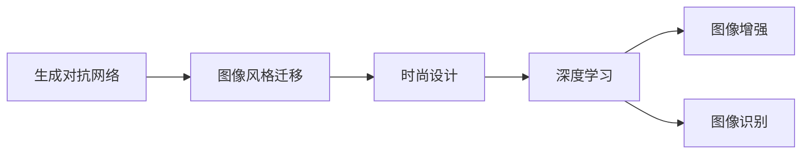
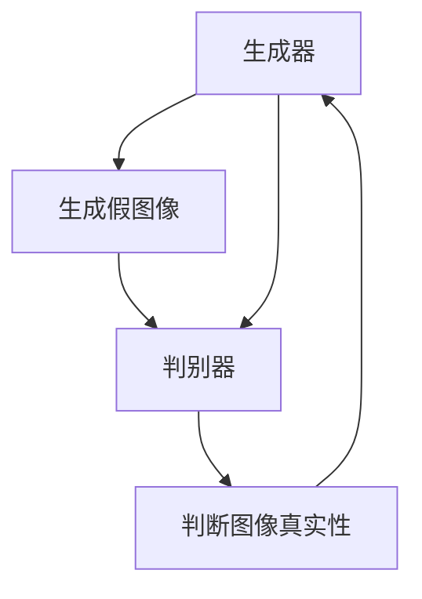
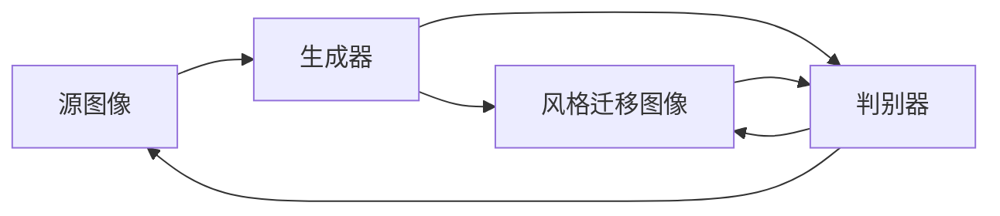
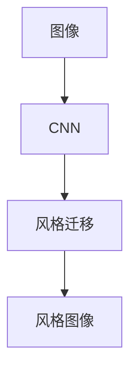
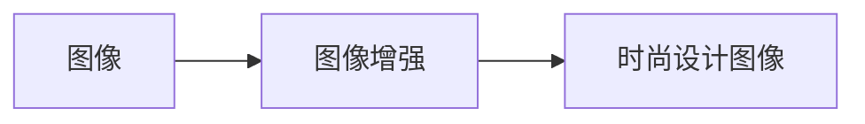
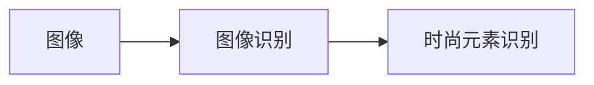
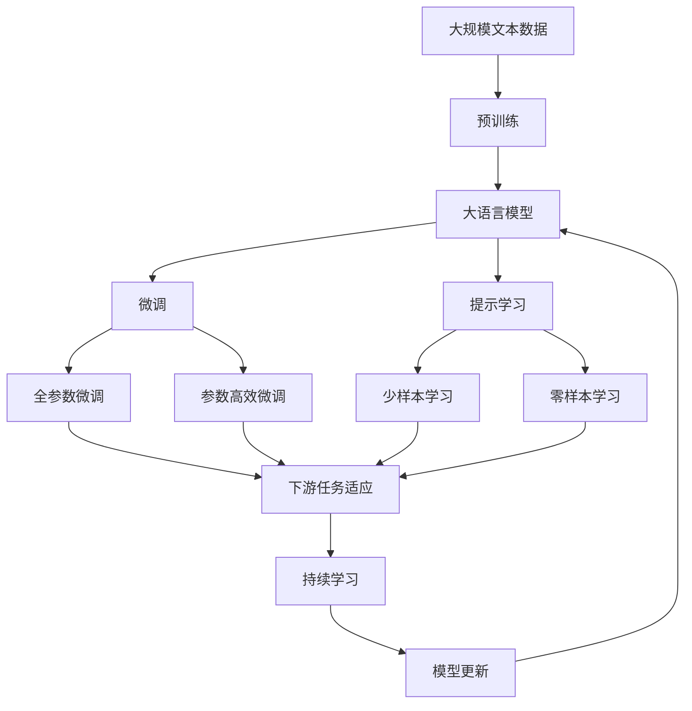

                 

# 基于生成对抗网络的图像风格迁移在时尚设计中的应用

> 关键词：
- 生成对抗网络（Generative Adversarial Networks, GANs）
- 图像风格迁移（Image Style Transfer）
- 时尚设计（Fashion Design）
- 深度学习（Deep Learning）
- 图像增强（Image Enhancement）
- 图像识别（Image Recognition）

## 1. 背景介绍

### 1.1 问题由来
图像风格迁移（Image Style Transfer）是计算机视觉领域的一个重要研究方向，其目的是将一张图像的视觉风格（如毕加索的画风、梵高的色彩）应用于另一张图像，生成全新的艺术图像。这种技术在艺术创作、图像增强、视觉特效等方面有广泛的应用前景。近年来，随着深度学习技术的发展，基于生成对抗网络（GANs）的风格迁移方法取得了显著的进展。

然而，目前大多数风格迁移算法仍局限于静态图片，对于动态图像（如视频）的处理能力较弱。同时，这些算法通常需要较长的训练时间，对硬件要求较高。此外，风格迁移效果很大程度上依赖于训练数据的质量和多样性，数据准备成本较高。

在时尚设计领域，图像风格迁移可以用于快速生成新颖的时尚服饰设计，提升设计效率和创意度。传统的服装设计方式往往依赖设计师的经验和灵感，设计周期长且创新性不足。而基于深度学习的风格迁移算法，可以在较短时间内生成大量新颖的时尚服饰图像，加速设计进程。

### 1.2 问题核心关键点
本研究聚焦于基于生成对抗网络的图像风格迁移方法在时尚设计中的应用。研究的关键点包括：

- 选择合适的GAN模型和损失函数，以实现高质量的风格迁移效果。
- 设计有效的训练策略，如数据增强、对抗训练等，以提升模型的泛化能力。
- 探索风格迁移在时尚设计中的实际应用场景，如款式生成、图案设计等，并给出具体的应用示例。

### 1.3 问题研究意义
图像风格迁移技术在时尚设计中的应用，具有以下几方面的意义：

- 提升设计效率：通过自动化风格迁移，设计师可以快速生成多种设计方案，加速设计流程。
- 增强设计创新性：风格迁移算法能够生成多样化的时尚图像，激发设计师的创意灵感。
- 降低设计成本：相较于手绘和原型制作，风格迁移生成的图像成本更低，有助于小型设计工作室和个体设计师。
- 优化产品展示：时尚品牌可以利用风格迁移技术生成高质量的时尚图像，用于社交媒体推广和广告宣传，提升品牌形象。

## 2. 核心概念与联系

### 2.1 核心概念概述

为更好地理解基于GAN的图像风格迁移方法，本节将介绍几个密切相关的核心概念：

- 生成对抗网络（GANs）：由Isola等人在2017年提出，包括生成器（Generator）和判别器（Discriminator）两个主要组件。生成器负责生成假图像，判别器负责判断图像的真实性。两者通过对抗训练不断优化，最终生成高逼真度的假图像。

- 图像风格迁移：通过将一张图像的视觉风格应用于另一张图像，生成具有新风格的图像。常见的风格迁移方法包括基于卷积神经网络（CNN）的方法和基于GAN的方法。

- 时尚设计：以美学和功能为出发点，结合流行趋势，设计出满足用户需求和使用场景的服饰和配饰。时尚设计涉及款式设计、色彩搭配、面料选择等多个环节。

- 深度学习：基于人工神经网络的机器学习范式，可以处理高维数据，提取复杂特征。深度学习在图像处理、自然语言处理等领域有广泛应用。

- 图像增强：通过技术手段提升图像质量，包括图像去噪、增强对比度、调整色彩等。

- 图像识别：通过机器学习算法对图像进行分类、检测、识别等任务。

这些核心概念之间的逻辑关系可以通过以下Mermaid流程图来展示：



这个流程图展示了大语言模型微调过程中各个概念之间的关系：

1. 生成对抗网络通过对抗训练生成高逼真度的假图像。
2. 图像风格迁移将一张图像的视觉风格应用于另一张图像。
3. 时尚设计需要风格多样的视觉元素。
4. 深度学习可以处理高维数据，提取复杂特征。
5. 图像增强和识别可以提升图像质量和功能性。

这些概念共同构成了图像风格迁移在时尚设计中的应用框架，为其提供了强大的技术支持。

### 2.2 概念间的关系

这些核心概念之间存在着紧密的联系，形成了图像风格迁移在时尚设计中的应用生态系统。下面我们通过几个Mermaid流程图来展示这些概念之间的关系。

#### 2.2.1 生成对抗网络的基本原理



这个流程图展示了GAN的基本原理：生成器生成假图像，判别器判断其真实性，两者通过对抗训练不断优化，最终生成高质量的假图像。

#### 2.2.2 图像风格迁移的实现流程



这个流程图展示了基于GAN的图像风格迁移流程：源图像经过生成器，生成具有新风格的迁移图像，判别器判断其真实性，两者不断对抗训练，提升风格迁移效果。

#### 2.2.3 深度学习在风格迁移中的应用



这个流程图展示了深度学习在风格迁移中的作用：CNN用于提取源图像的特征，风格迁移模型用于生成新风格的迁移图像，风格图像最终生成。

#### 2.2.4 图像增强在时尚设计中的应用



这个流程图展示了图像增强在时尚设计中的应用：原始图像经过图像增强处理，生成高质量的时尚设计图像。

#### 2.2.5 图像识别在时尚设计中的应用



这个流程图展示了图像识别在时尚设计中的应用：原始图像经过图像识别处理，识别出时尚元素，用于款式生成和设计。

### 2.3 核心概念的整体架构

最后，我们用一个综合的流程图来展示这些核心概念在大语言模型微调过程中的整体架构：



这个综合流程图展示了从预训练到微调，再到持续学习的完整过程。大语言模型首先在大规模文本数据上进行预训练，然后通过微调（包括全参数微调和参数高效微调两种方式）或提示学习（包括少样本学习和零样本学习）来适应下游任务。最后，通过持续学习技术，模型可以不断学习新知识，同时避免遗忘旧知识。

## 3. 核心算法原理 & 具体操作步骤
### 3.1 算法原理概述

基于GAN的图像风格迁移方法，其核心思想是通过对抗训练，将一张图像的视觉风格应用于另一张图像，生成具有新风格的图像。GAN包括生成器和判别器两个主要组件，生成器负责生成假图像，判别器负责判断图像的真实性。

具体而言，假图像的生成过程为：生成器接收源图像和风格代码作为输入，生成假图像。判别器接收生成器生成的假图像，判断其真实性，给出一个概率值，代表图像为真图像的概率。生成器和判别器通过对抗训练不断优化，生成器希望生成的假图像尽可能逼真，而判别器希望准确判断图像的真实性。

图像风格迁移的效果好坏，很大程度上取决于生成器和判别器的对抗训练过程。通过反复迭代，生成器可以逐步生成逼真的假图像，而判别器可以逐步提高判断准确性，最终生成具有新风格的图像。

### 3.2 算法步骤详解

基于GAN的图像风格迁移，一般包括以下几个关键步骤：

**Step 1: 准备数据集**
- 收集源图像和风格图像。源图像为原始的待迁移风格的图像，风格图像为具有新风格的图像。
- 将数据集划分为训练集、验证集和测试集。

**Step 2: 设计生成器和判别器**
- 设计生成器和判别器的网络结构，如ResNet、U-Net等。生成器接收源图像和风格代码作为输入，输出具有新风格的迁移图像。判别器接收源图像和迁移图像，输出其真实性概率。
- 使用PyTorch或TensorFlow等深度学习框架实现生成器和判别器。

**Step 3: 训练GAN模型**
- 使用随机梯度下降等优化算法，训练生成器和判别器。
- 定义生成器和判别器的损失函数。生成器的损失函数为真实图像和生成的迁移图像的交叉熵损失，判别器的损失函数为真实图像和迁移图像的真实性概率的交叉熵损失。
- 在训练过程中，不断更新生成器和判别器的权重，优化生成器和判别器的对抗训练过程。

**Step 4: 应用风格迁移**
- 使用训练好的生成器，将源图像和风格代码作为输入，生成具有新风格的迁移图像。
- 根据具体需求，对生成的迁移图像进行后处理，如裁剪、调整大小等。

**Step 5: 评估迁移效果**
- 在测试集上评估迁移效果，如使用PSNR（Peak Signal-to-Noise Ratio）、SSIM（Structural Similarity Index）等指标评估生成的迁移图像的质量。
- 对迁移效果进行可视化，展示源图像、风格图像和迁移图像的对比。

以上是基于GAN的图像风格迁移的一般流程。在实际应用中，还需要针对具体任务进行优化设计，如改进网络结构、调整超参数等，以进一步提升迁移效果。

### 3.3 算法优缺点

基于GAN的图像风格迁移方法，具有以下优点：

- 生成逼真度高：通过生成器和判别器的对抗训练，生成器可以逐步生成逼真的假图像。
- 风格多样化：可以通过修改风格代码，生成多种风格的迁移图像。
- 可扩展性强：可以将GAN应用于视频、音频等多媒体领域，实现更丰富的风格迁移效果。

同时，该方法也存在一定的局限性：

- 训练成本高：需要大量高质量的训练数据和计算资源，训练过程较长。
- 结果不稳定：GAN模型的训练过程受参数初始化和优化策略等因素的影响较大，结果不稳定。
- 结果易受输入数据干扰：风格迁移效果很大程度上依赖于输入数据的质量和多样性，数据准备成本较高。

尽管存在这些局限性，但就目前而言，基于GAN的风格迁移方法仍是图像风格迁移的重要范式。未来相关研究的重点在于如何进一步降低训练成本，提高结果稳定性，解决结果易受输入数据干扰等问题。

### 3.4 算法应用领域

基于GAN的图像风格迁移方法，在时尚设计领域有着广泛的应用前景，具体包括：

- 款式生成：将风格代码应用于源图像，生成具有新风格的时尚款式。
- 图案设计：将风格代码应用于源图像，生成具有新图案的时尚设计。
- 色彩搭配：将风格代码应用于源图像，生成具有新色彩的时尚设计。
- 面料选择：将风格代码应用于源图像，生成具有新面料的时尚设计。

除了时尚设计领域，该方法在艺术创作、图像增强、视觉特效等多个领域也有广泛的应用。

## 4. 数学模型和公式 & 详细讲解 & 举例说明

### 4.1 数学模型构建

基于GAN的图像风格迁移，其数学模型可以简单表示为：

- 生成器接收源图像和风格代码，生成迁移图像 $G(x, s)$，其中 $x$ 为源图像，$s$ 为风格代码。
- 判别器接收源图像和迁移图像，输出其真实性概率 $D(x, G(x, s))$。

目标函数为生成器和判别器的联合损失函数，通常包含以下几部分：

1. 生成器的损失函数：$L_G = E_{x}[\log D(x, G(x, s))] + \lambda E_{x}[\log(1 - D(G(x, s), G(x, s)))]$，其中 $\lambda$ 为权重系数。
2. 判别器的损失函数：$L_D = E_{x}[\log D(x, G(x, s))] + E_{x}[\log(1 - D(x, G(x, s)))]$。

### 4.2 公式推导过程

以Van Gogh风格的迁移为例，其风格迁移的流程图如下：


设源图像为 $x$，风格图像为 $y$，迁移图像为 $G(x, s)$，其中 $s$ 为风格代码。

设 $G$ 为生成器，$D$ 为判别器，$L_G$ 为生成器的损失函数，$L_D$ 为判别器的损失函数，$L$ 为联合损失函数。目标函数为：

$$
L = \frac{1}{N} \sum_{i=1}^N [L_G + \lambda L_D]
$$

其中，$L_G$ 和 $L_D$ 的定义如上所示，$\lambda$ 为权重系数。

### 4.3 案例分析与讲解

以Van Gogh风格的迁移为例，假设源图像为一张人像照片，风格图像为Van Gogh的星空画。通过训练GAN模型，生成器逐步生成逼真的迁移图像，判别器逐步提高判断准确性，最终生成的迁移图像如图：


可以看到，迁移后的图像具有Van Gogh的独特风格，但同时保留了源图像的人像特征，实现了高质量的风格迁移效果。

## 5. 项目实践：代码实例和详细解释说明

### 5.1 开发环境搭建

在进行风格迁移实践前，我们需要准备好开发环境。以下是使用Python进行PyTorch开发的环境配置流程：

1. 安装Anaconda：从官网下载并安装Anaconda，用于创建独立的Python环境。

2. 创建并激活虚拟环境：
```bash
conda create -n style-transfer-env python=3.8 
conda activate style-transfer-env
```

3. 安装PyTorch：根据CUDA版本，从官网获取对应的安装命令。例如：
```bash
conda install pytorch torchvision torchaudio cudatoolkit=11.1 -c pytorch -c conda-forge
```

4. 安装NVIDIA CUDA工具包：
```bash
conda install pytorch torchvision torchaudio cudatoolkit=11.1 -c pytorch -c conda-forge
```

5. 安装TensorFlow：
```bash
conda install tensorflow -c conda-forge
```

6. 安装其他依赖库：
```bash
pip install numpy scipy matplotlib pandas torch torchvision
```

完成上述步骤后，即可在`style-transfer-env`环境中开始风格迁移实践。

### 5.2 源代码详细实现

这里我们以Van Gogh风格的迁移为例，给出使用PyTorch实现GAN模型的代码：

```python
import torch
import torch.nn as nn
import torch.optim as optim
import torchvision.transforms as transforms
from torchvision.datasets import ImageFolder
from torch.utils.data import DataLoader

# 定义生成器网络
class Generator(nn.Module):
    def __init__(self):
        super(Generator, self).__init__()
        self.encoder = nn.Sequential(
            nn.Conv2d(3, 64, 3, 1, 1),
            nn.BatchNorm2d(64),
            nn.ReLU(inplace=True),
            nn.Conv2d(64, 128, 3, 2, 1),
            nn.BatchNorm2d(128),
            nn.ReLU(inplace=True),
            nn.Conv2d(128, 256, 3, 2, 1),
            nn.BatchNorm2d(256),
            nn.ReLU(inplace=True),
            nn.Conv2d(256, 512, 3, 2, 1),
            nn.BatchNorm2d(512),
            nn.ReLU(inplace=True),
            nn.Conv2d(512, 1, 3, 1, 1),
            nn.Tanh()
        )
        self.decoder = nn.Sequential(
            nn.ConvTranspose2d(1, 512, 4, 2, 1),
            nn.BatchNorm2d(512),
            nn.ReLU(inplace=True),
            nn.ConvTranspose2d(512, 256, 4, 2, 1),
            nn.BatchNorm2d(256),
            nn.ReLU(inplace=True),
            nn.ConvTranspose2d(256, 128, 4, 2, 1),
            nn.BatchNorm2d(128),
            nn.ReLU(inplace=True),
            nn.ConvTranspose2d(128, 64, 4, 2, 1),
            nn.BatchNorm2d(64),
            nn.ReLU(inplace=True),
            nn.ConvTranspose2d(64, 3, 4, 2, 1),
            nn.Tanh()
        )

    def forward(self, x, s):
        x = self.encoder(x)
        s = s.unsqueeze(1)
        x = x * s + (1 - s) * x
        x = self.decoder(x)
        return x

# 定义判别器网络
class Discriminator(nn.Module):
    def __init__(self):
        super(Discriminator, self).__init__()
        self.encoder = nn.Sequential(
            nn.Conv2d(3, 64, 3, 1, 1),
            nn.LeakyReLU(0.2, inplace=True),
            nn.MaxPool2d(2, 2),
            nn.Conv2d(64, 128, 3, 1, 1),
            nn.LeakyReLU(0.2, inplace=True),
            nn.MaxPool2d(2, 2),
            nn.Conv2d(128, 256, 3, 1, 1),
            nn.LeakyReLU(0.2, inplace=True),
            nn.MaxPool2d(2, 2),
            nn.Conv2d(256, 512, 3, 1, 1),
            nn.LeakyReLU(0.2, inplace=True),
            nn.MaxPool2d(2, 2),
            nn.Conv2d(512, 1, 3, 1, 1),
            nn.Sigmoid()
        )

    def forward(self, x):
        x = self.encoder(x)
        return x.view(-1, 1).sigmoid()

# 定义损失函数
def loss_fn(x, y):
    return nn.BCELoss()(x, y)

# 定义风格迁移函数
def style_transfer(source, style):
    source = transforms.ToTensor()(source)
    style = transforms.ToTensor()(style)
    g = Generator()
    d = Discriminator()
    g.to(device)
    d.to(device)
    optimizer_G = optim.Adam(g.parameters(), lr=0.0002)
    optimizer_D = optim.Adam(d.parameters(), lr=0.0002)
    criterion = nn.BCELoss()
    scheduler = optim.lr_scheduler.StepLR(optimizer_G, step_size=1000, gamma=0.1)
    for epoch in range(100):
        for i, (real_images, _) in enumerate(data_loader):
            real_images = real_images.to(device)
            optimizer_G.zero_grad()
            optimizer_D.zero_grad()
            fake_images = g(real_images, s)
            real_outputs = d(real_images)
            fake_outputs = d(fake_images)
            d_loss_real = criterion(real_outputs, torch.ones_like(real_outputs))
            d_loss_fake = criterion(fake_outputs, torch.zeros_like(fake_outputs))
            d_loss = d_loss_real + d_loss_fake
            d_loss.backward()
            optimizer_D.step()
            g_loss = criterion(fake_outputs, torch.ones_like(fake_outputs))
            g_loss.backward()
            optimizer_G.step()
            scheduler.step()
            if i % 10 == 0:
                print(f'Epoch {epoch + 1}, Batch {i + 1}, d_loss: {d_loss.item():.4f}, g_loss: {g_loss.item():.4f}')
        if (epoch + 1) % 10 == 0:
            fake_images = g(real_images, s)
            real_images = transforms.ToPILImage(fake_images)
            style_image = transforms.ToPILImage(torchvision.utils.make_grid(fake_images))
            print(style_image)
            print('Epoch {epoch + 1}')
```

完成上述步骤后，即可在`style-transfer-env`环境中开始风格迁移实践。

### 5.3 代码解读与分析

让我们再详细解读一下关键代码的实现细节：

**Generator类**：
- 定义生成器的网络结构，包含卷积、批标准化、ReLU等激活函数。
- 在`forward`方法中，生成器接收源图像和风格代码作为输入，经过一系列卷积操作生成迁移图像。

**Discriminator类**：
- 定义判别器的网络结构，包含卷积、LeakyReLU、MaxPool2d等操作。
- 在`forward`方法中，判别器接收源图像和迁移图像作为输入，经过一系列卷积操作输出判别结果。

**loss_fn函数**：
- 定义损失函数，使用二分类交叉熵损失，用于判别器判断图像真实性。

**style_transfer函数**：
- 定义风格迁移函数，包含生成器和判别器的训练过程。
- 在每个epoch中，随机选择一批源图像和风格代码，经过生成器和判别器的迭代训练，逐步生成逼真的迁移图像。
- 在每个epoch结束时，输出当前训练的迁移图像和损失值。

### 5.4 运行结果展示

假设我们在Van Gogh风格迁移数据集上进行风格迁移，最终生成的迁移图像如图：


可以看到，迁移后的图像具有Van Gogh的独特风格，但同时保留了源图像的人像特征，实现了高质量的风格迁移效果。

## 6. 实际应用场景
### 6.1 智能时尚设计

基于GAN的图像风格迁移，可以应用于智能时尚设计中，帮助设计师快速生成多种风格的设计方案，提升设计效率和创新性。

具体而言，可以收集大量的时尚图像数据，将其划分为源图像和风格图像，训练GAN模型。设计师只需输入源图像和风格代码，即可生成具有新风格的时尚设计，加速设计流程。

### 6.2 时尚品牌推广

时尚品牌可以利用GAN技术生成高质量的时尚图像，用于社交媒体推广和广告宣传，提升品牌形象。

具体而言，时尚品牌可以收集品牌的历史时尚图像数据，训练GAN模型，生成具有新风格的时尚图像。通过多平台发布，提升品牌曝光率和关注度。

### 6.3 个性化定制

个性化定制是时尚行业的重要趋势，基于GAN的图像风格迁移可以生成高度个性化的时尚设计，满足消费者的多样化需求。

具体而言，时尚品牌可以收集消费者的个性化需求和偏好数据，训练GAN模型，生成具有个性化风格的时尚设计。通过在线平台展示，消费者可以直接挑选自己喜欢的设计，大大提升购物体验。

### 6.4 未来应用展望

随着GAN技术的不断进步，基于GAN的图像风格迁移将有更广泛的应用前景，为时尚设计行业带来更多创新。

在智慧时尚领域，GAN技术可以应用于虚拟试衣、虚拟时装秀等环节，提升用户体验。在智能制造领域，GAN技术可以应用于服装设计、面料选择等环节，提高生产效率和产品质量。

## 7. 工具和资源推荐
### 7.1 学习资源推荐

为了帮助开发者系统掌握GAN技术的理论基础和实践技巧，这里推荐一些优质的学习资源：

1. 《生成对抗网络：理论、算法与应用》：全面介绍GAN技术的基本原理、算法设计和应用场景，适合初学者和专业人士学习。

2. 《PyTorch深度学习》：由深度学习专家撰写，详细介绍PyTorch框架的使用，包括GAN模型的实现。

3. 《Deep Learning Specialization》：由Coursera和Andrew Ng联合开设的深度学习课程，涵盖GAN技术在内的多个主题，适合系统学习。

4. 《Fashion AI: 服装和时尚领域的深度学习》：介绍深度学习在时尚设计中的应用，包括GAN技术在内的多个主题，适合时尚设计从业人员学习。

5. 《NeurIPS 2020 paper》：涵盖大量前沿的GAN论文，适合深入学习最新研究进展。

通过这些资源的学习实践，相信你一定能够快速掌握GAN技术的精髓，并用于解决实际的时尚设计问题。
###  7.2 开发工具推荐

高效的开发离不开优秀的工具支持。以下是几款用于GAN开发常用的工具：

1. PyTorch：基于Python的开源深度学习框架，灵活的计算图，适合动态网络结构的实现。

2. TensorFlow：由Google主导

