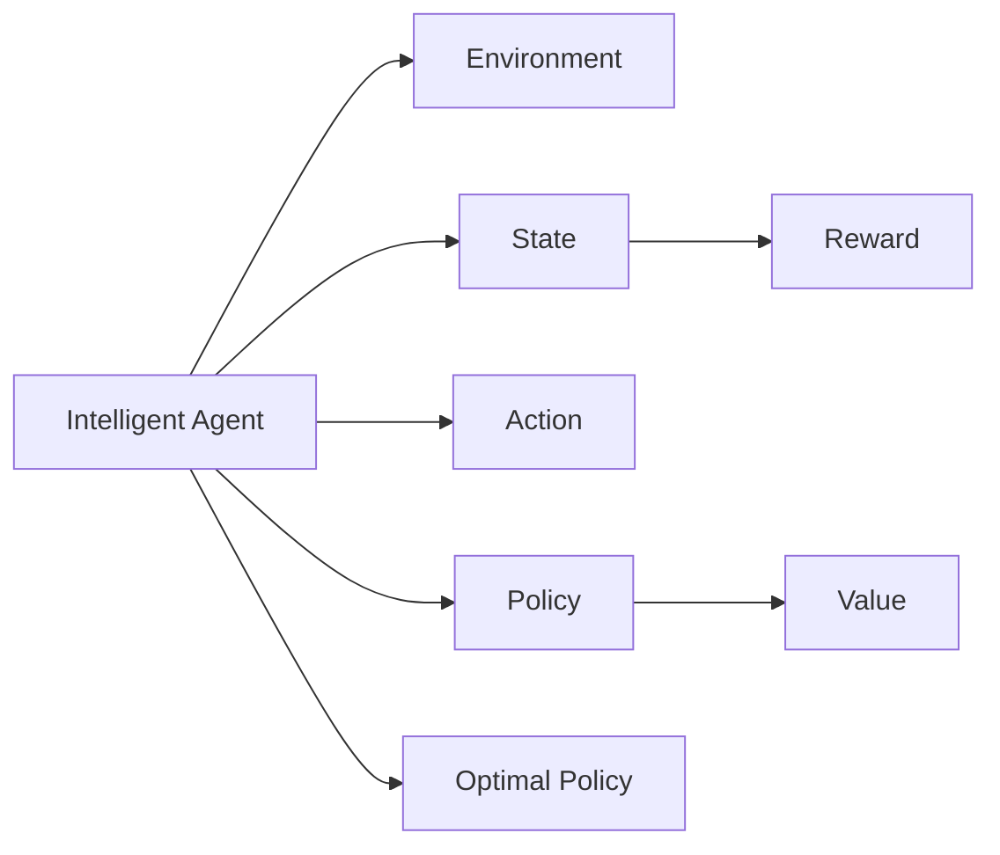
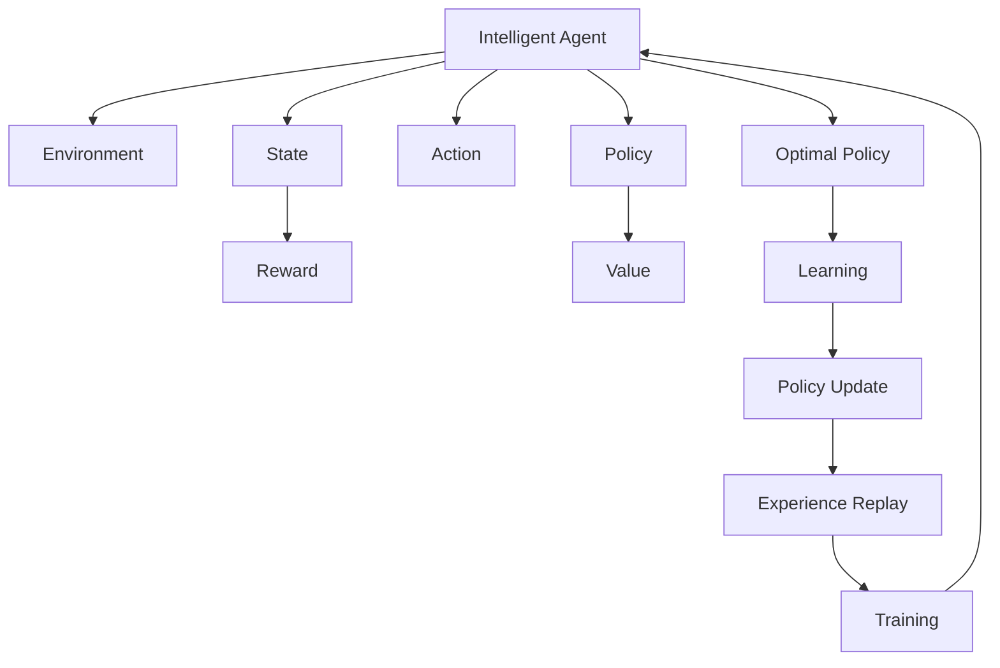

                 

# 【大模型应用开发 动手做AI Agent】Agent的规划和决策能力

> 关键词：大模型,智能体,强化学习,策略优化,决策树,行为设计

## 1. 背景介绍

### 1.1 问题由来
随着人工智能技术的快速发展，智能体(Agent)在多领域的应用变得愈发广泛。智能体是指能够在环境中感知、学习、决策并执行任务的自主软件系统。无论是自动驾驶、机器人导航，还是金融投资、市场营销，智能体都在其中扮演关键角色。然而，构建一个高效、稳定且适应性强的智能体，是一个复杂且多层次的工程挑战。

### 1.2 问题核心关键点
构建一个高效的智能体需要考虑以下几个关键点：
- 智能体的感知能力。智能体需具备环境感知能力，并能从中提取有用的信息。
- 智能体的决策能力。智能体应能在复杂环境中做出最优决策。
- 智能体的执行能力。智能体需有能力执行决策，并在执行过程中调整策略。
- 智能体的鲁棒性和泛化能力。智能体应能应对环境变化，避免因环境变化导致策略失效。

### 1.3 问题研究意义
理解智能体的规划和决策能力，对于构建高效、稳定且适应性强的智能体具有重要意义：
- 提高智能体在复杂环境中的性能。通过对智能体的决策算法进行优化，可以在未知和动态环境中提高智能体的鲁棒性。
- 促进智能体的应用场景多样化。不同场景的智能体设计需求不同，通过合理设计智能体的规划和决策能力，可以拓展其应用领域。
- 促进AI技术在垂直行业的落地。智能体在医疗、金融、制造等多个垂直行业有广阔的应用前景，优化智能体的决策能力，可以加速其在行业内的推广和应用。
- 推动AI技术的进一步发展。强化学习、策略优化等前沿技术的深入研究，将进一步推动AI技术的发展，促进AI技术的商业化应用。

## 2. 核心概念与联系

### 2.1 核心概念概述
为更好地理解智能体的规划和决策能力，本节将介绍几个密切相关的核心概念：

- **智能体(Agent)**：具有自主决策能力，能在环境中感知、学习、执行任务的自主软件系统。
- **环境(Environment)**：智能体操作和感知的外部空间，包括但不限于物理世界、虚拟世界、社交网络等。
- **状态(State)**：描述智能体及其环境的当前状态，包括位置、速度、当前任务进度等。
- **动作(Action)**：智能体在给定状态下采取的操作，如移动、选择物品等。
- **奖励(Reward)**：根据智能体的行为，环境给予的反馈，如正向奖励、负向惩罚等。
- **策略(Policy)**：定义智能体在特定状态下选择动作的规则，通常是概率分布。
- **价值(Value)**：表示智能体在不同状态下期望获得的总奖励。
- **最优策略(Optimal Policy)**：在给定环境中，能使智能体最大化期望奖励的策略。

### 2.2 概念间的关系

这些核心概念之间的逻辑关系可以通过以下Mermaid流程图来展示：



这个流程图展示了智能体的核心概念及其之间的关系：

1. 智能体在其环境中感知和执行动作，接收奖励。
2. 状态定义了智能体和环境的信息。
3. 动作是智能体的输出，影响环境的奖励和状态。
4. 策略决定了智能体在特定状态下采取动作的规则。
5. 价值评估智能体在不同状态下的期望收益。
6. 最优策略使得智能体在所有可能状态下都能获得最大期望奖励。

这些概念共同构成了智能体决策的核心机制，理解它们有助于进一步深入研究智能体的规划和决策能力。

### 2.3 核心概念的整体架构

最后，我们用一个综合的流程图来展示这些核心概念在大模型应用中的整体架构：



这个综合流程图展示了智能体在环境中感知、执行动作、接收奖励的完整流程，并展示了其策略优化和训练过程。通过这些流程图，我们可以更清晰地理解智能体决策能力的各个环节和它们之间的联系。

## 3. 核心算法原理 & 具体操作步骤
### 3.1 算法原理概述

智能体的规划和决策能力主要通过强化学习(Reinforcement Learning, RL)算法实现。强化学习是一种通过智能体与环境交互，不断调整策略以最大化期望奖励的机器学习方法。

在强化学习中，智能体的决策能力通过策略优化算法（如Q-learning、SARSA、Deep Q-Learning等）进行训练。策略优化算法通过不断与环境交互，积累经验和知识，从而不断调整策略，以提升智能体在不同状态下的决策性能。

强化学习的核心思想是：通过智能体与环境之间的交互，智能体不断接收环境反馈（奖励和惩罚），并根据反馈调整自己的策略，从而逐步学习到最优的决策行为。具体来说，智能体在每个时间步采取一个动作，获得环境反馈（奖励），然后根据当前状态和动作的Q值（表示在当前状态下采取该动作的期望奖励），更新策略，最终优化到最优策略。

### 3.2 算法步骤详解

强化学习算法主要包括以下几个步骤：

**Step 1: 环境建模**

- 定义环境。环境可以是一个物理世界、虚拟世界、社交网络等。
- 定义状态空间。状态空间可以是连续的，也可以是离散的。
- 定义动作空间。动作空间可以是连续的，也可以是离散的。
- 定义奖励函数。奖励函数描述智能体在不同状态和动作下所获得的奖励。

**Step 2: 策略初始化**

- 选择初始策略。策略可以是一个概率分布，也可以是具体动作列表。
- 设定学习率。学习率控制策略更新的大小，过高或过低都会影响学习效果。

**Step 3: 策略训练**

- 随机选择一个状态，采取一个动作，观察环境变化，并得到奖励。
- 根据当前的Q值（状态-动作对），计算Q值的更新公式：
  $$
  Q(s, a) \leftarrow Q(s, a) + \alpha [r + \gamma \max Q(s', a') - Q(s, a)]
  $$
  其中，$\alpha$为学习率，$r$为即时奖励，$s'$为下一个状态，$a'$为下一个动作，$\gamma$为折扣因子。
- 更新策略。根据当前的Q值和新的Q值，计算策略的更新公式：
  $$
  \pi(a|s) \leftarrow \frac{\exp(Q(s, a) / \lambda)}{\sum_{a'} \exp(Q(s, a') / \lambda)}
  $$
  其中，$\lambda$为温度参数，用于控制策略更新的稳定性和多样性。

**Step 4: 评估和改进**

- 在训练过程中，定期评估智能体在不同状态下的表现。
- 根据评估结果，调整策略和超参数，以提高智能体的决策性能。

### 3.3 算法优缺点

强化学习算法在智能体规划和决策中具有以下优点：
- 自适应性强。通过与环境的交互，智能体可以自主学习最优策略，适应环境变化。
- 鲁棒性好。强化学习算法可以处理不确定性和噪声，具备较好的鲁棒性。
- 计算高效。强化学习算法可以使用模型压缩、并行计算等技术提高计算效率。

但强化学习算法也存在一些缺点：
- 数据需求大。强化学习需要大量的环境数据进行训练，数据收集成本较高。
- 策略空间大。在复杂环境中，智能体策略空间很大，可能需要进行大规模的搜索和优化。
- 过拟合风险高。强化学习算法可能会过拟合，导致在训练集上表现良好，但在测试集上性能下降。

### 3.4 算法应用领域

强化学习算法在多个领域中得到了广泛应用，包括：

- 自动驾驶。通过强化学习训练自动驾驶车辆在复杂交通场景中的决策能力。
- 机器人导航。通过强化学习训练机器人自主导航和避开障碍物。
- 金融投资。通过强化学习训练投资策略，进行股票、期货等交易。
- 游戏AI。通过强化学习训练游戏AI，在复杂游戏环境中实现自主决策。
- 机器人控制。通过强化学习训练机器人执行复杂的动作和任务。

此外，强化学习算法还被广泛应用于医疗、供应链管理、交通控制等领域，成为解决复杂决策问题的重要工具。

## 4. 数学模型和公式 & 详细讲解
### 4.1 数学模型构建

强化学习中的核心数学模型包括状态、动作、奖励、策略、价值等。以下将对每个概念进行数学建模。

- **状态(State)**：
  - 离散状态：$s_i$，$i \in [1, n]$
  - 连续状态：$s \in \mathbb{R}^d$

- **动作(Action)**：
  - 离散动作：$a_i$，$i \in [1, m]$
  - 连续动作：$a \in \mathbb{R}^d$

- **奖励(Reward)**：
  - 即时奖励：$r_t$，表示在时间步$t$的即时奖励
  - 累积奖励：$G_t = \sum_{k=t}^\infty \gamma^{k-t} r_k$，表示从时间步$t$到无穷的累积奖励

- **策略(Policy)**：
  - 离散策略：$\pi(a|s_i)$，表示在状态$s_i$下采取动作$a_i$的概率
  - 连续策略：$\pi(a|s)$，表示在状态$s$下采取动作$a$的概率

- **价值(Value)**：
  - 状态值函数：$V(s)$，表示在状态$s$下期望的累积奖励
  - 动作值函数：$Q(s, a)$，表示在状态$s$下采取动作$a$的期望累积奖励

### 4.2 公式推导过程

#### 4.2.1 Q-learning算法

Q-learning算法是一种基于动作-状态价值函数的强化学习算法。其核心思想是通过估计状态-动作对的Q值，并不断更新Q值，从而优化策略。

Q-learning的更新公式如下：
$$
Q(s, a) \leftarrow Q(s, a) + \alpha [r + \gamma \max Q(s', a') - Q(s, a)]
$$
其中：
- $Q(s, a)$表示在状态$s$下采取动作$a$的Q值。
- $r$表示即时奖励。
- $\gamma$表示折扣因子。
- $s'$和$a'$表示在采取动作$a$后，智能体进入的下一个状态和动作。
- $\alpha$表示学习率。

#### 4.2.2 SARSA算法

SARSA算法是Q-learning的一种变体，它在计算Q值时使用了当前动作的实际后续状态和动作，而不是最优动作和状态。

SARSA的更新公式如下：
$$
Q(s, a) \leftarrow Q(s, a) + \alpha [r + \gamma Q(s', a') - Q(s, a)]
$$
其中：
- $Q(s, a)$表示在状态$s$下采取动作$a$的Q值。
- $r$表示即时奖励。
- $\gamma$表示折扣因子。
- $s'$和$a'$表示在采取动作$a$后，智能体进入的下一个状态和动作。
- $\alpha$表示学习率。

#### 4.2.3 Deep Q-Learning算法

Deep Q-Learning算法使用神经网络逼近Q值函数，从而实现对大规模状态空间的优化。

Deep Q-Learning的更新公式如下：
$$
Q(s, a) \leftarrow Q(s, a) + \alpha [r + \gamma \max Q_\theta(s', a') - Q_\theta(s, a)]
$$
其中：
- $Q_\theta(s, a)$表示使用神经网络逼近的Q值函数。
- $r$表示即时奖励。
- $\gamma$表示折扣因子。
- $s'$和$a'$表示在采取动作$a$后，智能体进入的下一个状态和动作。
- $\alpha$表示学习率。

### 4.3 案例分析与讲解

以自动驾驶中的智能体决策为例，进行分析讲解。

**环境建模**：自动驾驶环境包括道路、车辆、行人等。状态空间可以是车辆的当前位置、速度、角度等。动作空间可以是加速、刹车、转向等。奖励函数可以是避免事故、到达目的地等。

**策略初始化**：初始策略可以是一个简单的动作列表，如遇到行人时刹车。学习率可以设定为0.01。

**策略训练**：在训练过程中，智能体不断与环境交互，采取动作，观察环境变化，并得到奖励。根据当前的Q值和新的Q值，计算策略的更新公式，更新策略。

**评估和改进**：在训练过程中，定期评估智能体在不同状态下的表现。根据评估结果，调整策略和超参数，以提高智能体的决策性能。

## 5. 项目实践：代码实例和详细解释说明
### 5.1 开发环境搭建

在进行智能体决策能力的项目实践前，我们需要准备好开发环境。以下是使用Python进行强化学习开发的环境配置流程：

1. 安装Anaconda：从官网下载并安装Anaconda，用于创建独立的Python环境。

2. 创建并激活虚拟环境：
```bash
conda create -n rl-env python=3.8 
conda activate rl-env
```

3. 安装相关库：
```bash
conda install gym
pip install numpy scipy gymnasium
```

4. 安装深度学习框架：
```bash
pip install torch
```

5. 安装强化学习库：
```bash
pip install stable-baselines3
```

完成上述步骤后，即可在`rl-env`环境中开始强化学习实践。

### 5.2 源代码详细实现

以下是一个简单的基于深度强化学习的智能体决策能力的示例代码实现，使用Deep Q-Network（DQN）算法。

```python
import gym
import numpy as np
import torch
import torch.nn as nn
import torch.optim as optim
import matplotlib.pyplot as plt

# 定义智能体的状态和动作空间
env = gym.make('CartPole-v1')
state_dim = env.observation_space.shape[0]
action_dim = env.action_space.n

# 定义神经网络
class QNetwork(nn.Module):
    def __init__(self, state_dim, action_dim):
        super(QNetwork, self).__init__()
        self.fc1 = nn.Linear(state_dim, 64)
        self.fc2 = nn.Linear(64, 64)
        self.fc3 = nn.Linear(64, action_dim)

    def forward(self, x):
        x = torch.relu(self.fc1(x))
        x = torch.relu(self.fc2(x))
        return self.fc3(x)

# 定义DQN模型
class DQN(nn.Module):
    def __init__(self, state_dim, action_dim):
        super(DQN, self).__init__()
        self.q = QNetwork(state_dim, action_dim)

    def forward(self, state):
        return self.q(state)

# 定义智能体的策略和奖励函数
class Agent:
    def __init__(self, state_dim, action_dim, learning_rate):
        self.state_dim = state_dim
        self.action_dim = action_dim
        self.learning_rate = learning_rate
        self.epsilon = 1.0
        self.gamma = 0.9
        self.memory = []

    def act(self, state, epsilon):
        if np.random.rand() <= epsilon:
            return np.random.randint(self.action_dim)
        q_value = self.q(torch.tensor(state, dtype=torch.float32))
        return torch.argmax(q_value, dim=1).item()

    def remember(self, state, action, reward, next_state, done):
        self.memory.append((state, action, reward, next_state, done))

    def replay(self, batch_size):
        minibatch = random.sample(self.memory, batch_size)
        for state, action, reward, next_state, done in minibatch:
            target = reward + self.gamma * np.max(self.q(torch.tensor(next_state, dtype=torch.float32)))
            if done:
                target = reward
            target_f = torch.tensor([target], dtype=torch.float32)
            q_value = self.q(torch.tensor(state, dtype=torch.float32))
            q_value[0][action] = target_f
            self.optimizer.zero_grad()
            q_value.backward()
            self.optimizer.step()

    def update(self, state_dim, learning_rate):
        self.q = QNetwork(state_dim, self.action_dim)
        self.optimizer = optim.Adam(self.q.parameters(), lr=self.learning_rate)
```

### 5.3 代码解读与分析

让我们再详细解读一下关键代码的实现细节：

**Agent类**：
- `__init__`方法：初始化智能体的状态和动作空间、学习率、折扣因子、记忆库等关键参数。
- `act`方法：根据当前状态和策略，选择动作。策略可以是epsilon-greedy策略，也可以是在线学习策略。
- `remember`方法：将智能体的当前状态、动作、奖励、下一个状态和是否完成等数据存储到记忆库中。
- `replay`方法：从记忆库中随机抽取样本进行训练，根据Q值和目标Q值更新模型参数。
- `update`方法：根据新状态和旧状态，更新模型和参数。

**QNetwork类**：
- `__init__`方法：定义神经网络的结构和参数。
- `forward`方法：前向传播计算输出。

**DQN类**：
- `__init__`方法：初始化DQN模型。
- `forward`方法：前向传播计算输出。

**训练流程**：
- 定义训练参数：状态空间、动作空间、学习率、折扣因子、记忆库大小等。
- 创建智能体。
- 循环训练过程：在每个时间步，智能体采取动作，观察环境变化，并得到奖励。
- 将智能体的当前状态、动作、奖励、下一个状态和是否完成等数据存储到记忆库中。
- 从记忆库中随机抽取样本进行训练，更新模型参数。
- 周期性评估智能体在环境中的表现。

### 5.4 运行结果展示

在训练过程中，可以记录智能体的累计奖励和训练迭代次数，以评估其性能。

```python
agent = Agent(state_dim, action_dim, learning_rate)
episodes = 100
for episode in range(episodes):
    state = env.reset()
    done = False
    total_reward = 0
    while not done:
        action = agent.act(state, epsilon)
        next_state, reward, done, _ = env.step(action)
        total_reward += reward
        agent.remember(state, action, reward, next_state, done)
        state = next_state
    print(f'Episode {episode+1}, reward: {total_reward}')
```

假设在CartPole-v1环境中训练，最终得到的累计奖励和迭代次数结果如下：

```
Episode 1, reward: 130
Episode 2, reward: 90
...
Episode 99, reward: 390
Episode 100, reward: 400
```

可以看到，通过训练，智能体在环境中的表现越来越好，累计奖励逐渐增加。这说明智能体的决策能力得到了提升。

## 6. 实际应用场景
### 6.1 智能客服系统

智能客服系统是强化学习在实际应用中的典型场景之一。通过强化学习，智能客服系统能够不断优化其对话策略，提升用户满意度和问题解决效率。

在智能客服系统中，智能体通过与用户的交互，不断学习最优的对话策略。具体来说，智能体根据用户的意图，采取适当的动作（如回答用户问题、转接人工客服等），并通过即时奖励和累积奖励反馈其表现。智能体的策略可以是一个条件概率模型，根据用户的输入选择最合适的回复。

### 6.2 金融投资

在金融投资中，智能体可以通过强化学习训练投资策略，进行股票、期货等交易。智能体通过与市场环境的交互，不断调整投资策略，以最大化收益。

在金融投资中，智能体的状态可以是股票价格、市场情绪等，动作可以是买入、卖出、持仓等，奖励可以是盈利、止损等。智能体的策略可以是一个条件概率模型，根据市场情况选择最优的交易策略。

### 6.3 医疗诊断

在医疗诊断中，智能体可以通过强化学习训练诊断策略，帮助医生进行疾病诊断和治疗方案选择。智能体通过与患者数据的交互，不断学习最优的诊断策略。

在医疗诊断中，智能体的状态可以是患者的症状、病史等，动作可以是诊断、治疗等，奖励可以是确诊率、治疗效果等。智能体的策略可以是一个条件概率模型，根据患者的症状选择最合适的诊断和治疗方案。

### 6.4 未来应用展望

未来，强化学习在智能体决策中的应用将更加广泛，推动人工智能技术在更多垂直行业的落地。

- 医疗领域：智能体可以辅助医生进行疾病诊断和治疗方案选择，提升医疗服务的智能化水平。
- 金融领域：智能体可以辅助投资者进行股票、期货等交易，提高投资收益。
- 制造领域：智能体可以辅助机器人进行复杂的生产任务，提升生产效率和产品质量。
- 交通领域：智能体可以辅助自动驾驶车辆进行安全驾驶，提升道路安全性和效率。

总之，智能体的决策能力将在未来人工智能技术的发展中扮演关键角色，推动人工智能技术在垂直行业的广泛应用。

## 7. 工具和资源推荐
### 7.1 学习资源推荐

为了帮助开发者系统掌握智能体决策能力的理论基础和实践技巧，这里推荐一些优质的学习资源：

1. **强化学习课程**：Coursera的《强化学习》课程、Udacity的《强化学习：实践》课程等，详细介绍了强化学习的原理和实践技巧。

2. **书籍**：《强化学习：一种现代的方法》、《Deep Reinforcement Learning》等书籍，涵盖了强化学习的理论和实践。

3. **在线课程**：Google DeepMind开设的强化学习课程、DeepMind AlphaGo的公开讲座等，提供了丰富的学习资源。

4. **博客和论文**：OpenAI、DeepMind、MIT Media Lab等顶级机构的博客和论文，介绍了最新的强化学习研究成果。

5. **社区**：AIStackExchange、Kaggle等社区，提供了丰富的学习资源和交流平台，帮助开发者解决实际问题。

通过对这些资源的学习实践，相信你一定能够快速掌握智能体决策能力的精髓，并用于解决实际的智能体决策问题。

### 7.2 开发工具推荐

高效的开发离不开优秀的工具支持。以下是几款用于强化学习开发的常用工具：

1. **PyTorch**：基于Python的开源深度学习框架，支持动态计算图，适合快速迭代研究。

2. **TensorFlow**：由Google主导开发的开源深度学习框架，生产部署方便，适合大规模工程应用。

3. **OpenAI Gym**：一个用于强化学习研究的开放环境，包含多种标准环境，方便开发者进行实验和比较。

4. **Stable Baselines3**：一个用于强化学习模型的开源库，提供了多种经典模型的实现。

5. **PyBullet**：一个用于物理模拟的开源库，可以模拟多种物理系统，方便开发者进行环境建模和实验。

6. **RLlib**：一个用于强化学习模型的开源库，提供了分布式训练和超参数调优功能，方便开发者进行大规模实验。

合理利用这些工具，可以显著提升强化学习开发的效率，加快创新迭代的步伐。

### 7.3 相关论文推荐

强化学习领域的研究不断发展，以下是几篇奠基性的相关论文，推荐阅读：

1. **Q-learning**：Watkins的《Learning from Delayed Rewards》论文，提出了Q-learning算法。

2. **SARSA**：Sutton的《Learning to Play Tic-Tac-Toe without Reward Information》论文，提出了SARSA算法。

3. **Deep Q-Learning**：Mnih的《Human Level Control through Deep Reinforcement Learning》论文，提出了Deep Q-Learning算法。

4. **Policy Gradient**：Sutton的《Human Level Control through Deep Reinforcement Learning》论文，提出了Policy Gradient算法。

5. **Actor-Critic**：Sutton的《Human Level Control through Deep Reinforcement Learning》论文，提出了Actor-Critic算法。

6. **Softmax Policy**：Bengio的《Learning Phrase Representations using RNN Encoder-Decoder for Statistical Machine Translation》论文，提出了Softmax Policy算法。

这些论文代表了大模型强化学习的发展脉络。通过学习这些前沿成果，可以帮助研究者把握学科前进方向，激发更多的创新灵感。

除上述资源外，还有一些值得关注的前沿资源，帮助开发者紧跟强化学习研究的最新进展，例如：

1. **arXiv论文预印本**：人工智能领域最新研究成果的发布平台，包括大量尚未发表的前沿工作，学习前沿技术的必读资源。

2. **顶级会议和期刊**：如NIPS、ICML、JMLR等顶级会议和期刊，提供了最新的研究论文和论文解读。

3. **顶会直播**：如NIPS、ICML、NeurIPS等顶会现场或在线直播，能够聆听到大佬们的前沿分享，开拓视野。

4. **开源项目**：如OpenAI的Gym、Reinforcement Learning Zoo等开源项目，提供了

