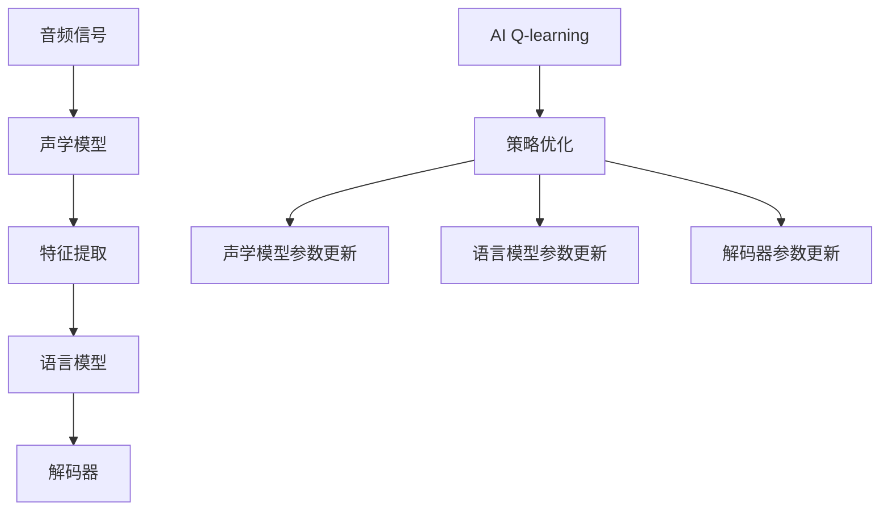

                 

# 一切皆是映射：AI Q-learning在语音识别的探索

## 1. 背景介绍

随着人工智能技术的不断进步，机器学习和深度学习在各个领域的应用越来越广泛。语音识别作为人工智能技术的重要分支，正逐渐从实验室走向实际应用。Q-learning作为强化学习中的一种重要算法，在语音识别中的应用逐渐受到关注。本文将探讨AI Q-learning在语音识别中的应用，并详细介绍其原理和具体操作步骤。

## 2. 核心概念与联系

### 2.1 核心概念概述

为了更好地理解AI Q-learning在语音识别中的应用，首先需要介绍一些核心概念：

- **Q-learning**：一种基于模型无关的强化学习算法，通过与环境交互，逐步学习最优策略。在每一步中，Q-learning根据当前状态和采取的动作，估计下一个状态的价值函数，并更新策略以最大化长期奖励。

- **语音识别**：将人类语音转换为文本的过程。常见的语音识别系统包括声学模型、语言模型和解码器等组件。

- **声学模型**：用于将音频信号转换为文本的模型。常用的声学模型包括隐马尔可夫模型（HMM）、深度神经网络（DNN）和卷积神经网络（CNN）等。

- **语言模型**：用于评估文本序列的概率，衡量模型输出的自然度。常见的语言模型包括N-gram模型、神经语言模型（NLMs）和Transformer模型等。

- **解码器**：用于将声学模型输出的特征序列解码成文本。常见的解码器包括Beam Search、Top-k和深度序列到序列模型（Seq2Seq）等。

这些概念通过AI Q-learning算法结合在一起，可以用于语音识别的各个环节，如声学模型的训练、语言模型的优化和解码器的设计等。

### 2.2 核心概念之间的关系

AI Q-learning在语音识别中的应用可以通过以下流程来描述：

这个流程图展示了AI Q-learning在语音识别中的应用流程：音频信号先通过声学模型转化为特征，再通过语言模型进行解码，最终得到文本输出。AI Q-learning通过优化策略，指导声学模型和语言模型的训练，提升语音识别的性能。

## 3. 核心算法原理 & 具体操作步骤

### 3.1 算法原理概述

AI Q-learning算法通过与环境交互，逐步学习最优策略，用于指导声学模型和语言模型的训练。其核心思想是：通过观察当前状态和采取的动作，估计下一个状态的价值函数，并更新策略以最大化长期奖励。

在语音识别中，AI Q-learning可以将每个语音帧（音素、音节或单词）视为一个状态，将每个状态的动作（声学模型和语言模型参数的更新）视为一个动作，通过逐步优化策略，实现语音识别的最优解。

### 3.2 算法步骤详解

AI Q-learning在语音识别中的应用主要包括以下几个步骤：

**Step 1: 环境定义**

- 将音频信号分割为语音帧，每个语音帧视为一个状态。
- 定义状态转移模型，即从一个状态到另一个状态的转移概率。
- 定义奖励函数，用于评估每个动作的好坏。

**Step 2: 初始策略**

- 随机初始化策略，即随机选择一个动作进行训练。
- 在每个状态中，根据策略选择动作。

**Step 3: 状态价值函数估计**

- 通过与环境的交互，观察当前状态和采取的动作，估计下一个状态的价值函数。
- 使用经验回放（Experience Replay）技术，保存和重新播放历史状态-动作-奖励的样本。

**Step 4: 策略更新**

- 根据状态价值函数，使用策略改进算法（如Sarsa、Q-learning等）更新策略，以最大化长期奖励。
- 更新声学模型和语言模型的参数，以优化语音识别性能。

**Step 5: 模型训练**

- 使用训练数据集对声学模型进行训练。
- 使用训练数据集对语言模型进行训练。
- 使用训练好的声学模型和语言模型进行解码，得到最终的文本输出。

### 3.3 算法优缺点

AI Q-learning在语音识别中的应用有以下优点：

- 可以通过与环境的交互，逐步优化策略，适应语音识别的复杂环境。
- 可以充分利用训练数据，避免过拟合，提高模型的泛化能力。
- 可以适应不同声学模型和语言模型，具有广泛的适用性。

同时，AI Q-learning也存在以下缺点：

- 训练过程较为复杂，需要大量的计算资源和时间。
- 需要定义准确的状态转移模型和奖励函数，难以处理复杂的语音识别问题。
- 需要大量标注数据进行训练，对数据需求较高。

### 3.4 算法应用领域

AI Q-learning在语音识别中的应用非常广泛，可以应用于以下领域：

- **声学模型训练**：通过AI Q-learning优化声学模型参数，提升模型对语音特征的拟合能力。
- **语言模型优化**：通过AI Q-learning优化语言模型参数，提升模型对文本序列的预测能力。
- **解码器设计**：通过AI Q-learning优化解码器策略，提高解码器的效率和准确性。
- **噪声抑制**：通过AI Q-learning优化噪声抑制算法，提升语音识别的鲁棒性。

## 4. 数学模型和公式 & 详细讲解  
### 4.1 数学模型构建

AI Q-learning在语音识别中的应用可以通过以下数学模型来描述：

设当前状态为 $s_t$，采取的动作为 $a_t$，下一个状态为 $s_{t+1}$，奖励为 $r_{t+1}$，策略为 $\pi$，状态价值函数为 $Q$。

则AI Q-learning的目标是最大化长期奖励：

$$
\max_{\pi} \sum_{t=0}^{\infty} \gamma^t r_{t+1}
$$

其中，$\gamma$ 为折扣因子。

AI Q-learning的策略优化过程如下：

1. 初始化策略 $\pi$ 和状态价值函数 $Q$。
2. 通过与环境的交互，观察当前状态和采取的动作，估计下一个状态的价值函数 $Q(s_{t+1}, a_t)$。
3. 根据策略选择动作，得到奖励 $r_{t+1}$。
4. 根据状态价值函数和奖励，更新策略和状态价值函数：
   $$
   Q(s_t, a_t) \leftarrow Q(s_t, a_t) + \alpha [r_{t+1} + \gamma \max_{a} Q(s_{t+1}, a) - Q(s_t, a_t)]
   $$
   其中，$\alpha$ 为学习率。

### 4.2 公式推导过程

以下是AI Q-learning在语音识别中应用的具体公式推导：

1. 假设声学模型输出为 $x_t$，语言模型输出为 $y_t$，解码器输出为 $z_t$。

2. 定义状态转移模型为：
   $$
   P(s_{t+1} | s_t, a_t) = P(x_{t+1} | x_t, a_t) \cdot P(y_{t+1} | y_t, a_t) \cdot P(z_{t+1} | z_t, a_t)
   $$

3. 定义奖励函数为：
   $$
   r_{t+1} = R(x_{t+1}, y_{t+1}, z_{t+1})
   $$

其中，$R(x_{t+1}, y_{t+1}, z_{t+1})$ 表示解码器的输出与文本序列的匹配程度。

4. 根据状态价值函数和奖励，使用AI Q-learning算法更新策略：
   $$
   Q(s_t, a_t) \leftarrow Q(s_t, a_t) + \alpha [r_{t+1} + \gamma \max_{a} Q(s_{t+1}, a) - Q(s_t, a_t)]
   $$

### 4.3 案例分析与讲解

以声学模型的训练为例，可以使用AI Q-learning优化声学模型的参数。具体步骤如下：

1. 将音频信号分割为语音帧，每个语音帧视为一个状态。
2. 定义声学模型输出的概率分布为动作。
3. 定义声学模型输出的概率分布与文本序列的匹配程度为奖励函数。
4. 使用AI Q-learning算法优化声学模型参数，使得声学模型输出的概率分布与文本序列的匹配程度最大化。

## 5. 项目实践：代码实例和详细解释说明

### 5.1 开发环境搭建

在进行AI Q-learning在语音识别的项目实践前，需要准备好开发环境。以下是使用Python进行TensorFlow开发的环

