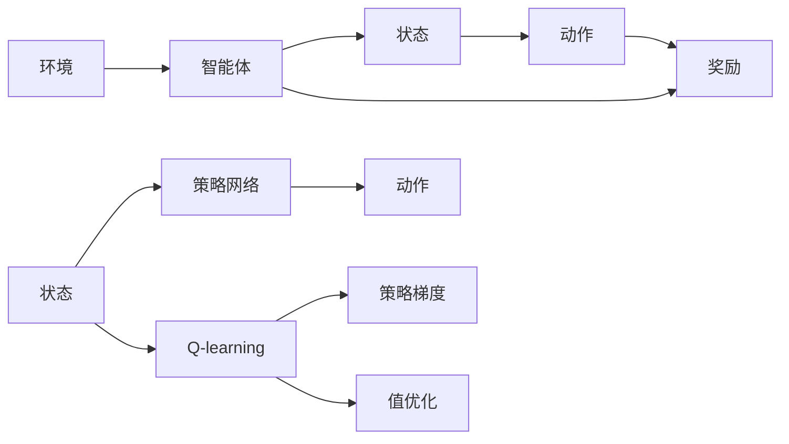

                 

# 一切皆是映射：AI Q-learning策略网络的搭建

## 1. 背景介绍

### 1.1 问题由来
在人工智能领域，强化学习(Reinforcement Learning, RL) 已经成为了一个非常热门的研究方向。它涉及一个智能体 (agent) 在一个动态的环境中学习最佳行动策略，以达到特定的目标。经典的强化学习算法，如Q-learning、SARSA等，已经展示了其在机器人控制、游戏玩法、自动驾驶等领域的巨大潜力。

然而，传统强化学习算法在处理复杂状态空间时，面临的挑战是显著的。特别是在连续动作空间和大型状态空间中，直接进行Q-learning往往面临"维度灾难"。此外，Q-learning的收敛性和稳定性也受到环境动态变化、奖励函数设计、状态表达等诸多因素的限制。

为了应对这些挑战，策略网络(Strategy Network) 应运而生。策略网络通过学习环境状态到动作的映射，将高维动作空间降维，简化了Q-learning的学习过程，提升了算法性能。本文将深入探讨AI策略网络在Q-learning中的搭建与优化，以期为读者提供全面的理论和实践指导。

## 2. 核心概念与联系

### 2.1 核心概念概述

为更好地理解策略网络在Q-learning中的应用，我们需要首先介绍几个关键概念：

- **强化学习(Reinforcement Learning, RL)**：一种通过智能体与环境的交互，学习最优行动策略的机器学习范式。核心要素包括智能体、环境、行动、状态和奖励。
- **策略网络(Strategy Network)**：一种学习环境状态到动作映射的神经网络模型。策略网络通过学习到状态动作映射关系，减少了传统Q-learning中高维动作空间的复杂度，提升了算法的计算效率和收敛性。
- **Q-learning**：一种基于值函数的强化学习算法，通过学习状态-动作-奖励的Q值，指导智能体选择最优行动策略。
- **策略梯度方法**：一种直接优化策略的强化学习方法，通过梯度下降更新策略参数，避免了传统Q-learning中值的估计问题。
- **策略优化与值优化**：强化学习中的两种优化目标。策略优化直接优化策略参数，使得智能体能够学习到更优的行动策略。而值优化则是通过优化Q值函数，间接提升智能体的行动策略。

这些概念之间的联系可以通过以下Mermaid流程图来展示：



这个流程图展示了强化学习的基本要素，以及策略网络和Q-learning在其中的作用。状态动作映射通过策略网络完成，智能体的行动策略通过Q-learning或策略梯度方法进行优化。

### 2.2 概念间的关系

策略网络在强化学习中的应用，可以从以下几个方面进行理解：

1. **高维动作空间降维**：传统强化学习算法如Q-learning在处理高维动作空间时，面临"维度灾难"。策略网络通过学习状态到动作的映射，将高维动作空间降维，简化了Q-learning的学习过程。

2. **增强泛化能力**：策略网络可以学习到环境状态与动作之间的复杂映射关系，从而增强智能体对环境变化的泛化能力。

3. **提升计算效率**：策略网络将高维动作空间映射到低维动作空间，减少了状态动作-奖励的三元组数量，提升了Q-learning的计算效率。

4. **结合策略优化与值优化**：策略网络可以与Q-learning或策略梯度方法结合，同时优化策略参数和Q值函数，使得智能体的行动策略更加高效。

5. **与深度学习相结合**：策略网络可以利用深度神经网络进行建模，从而处理更加复杂的非线性映射关系，提升算法的性能。

通过理解这些关键概念及其之间的联系，我们可以更好地把握策略网络在强化学习中的应用场景，并为后续深入讨论策略网络的搭建和优化提供基础。

## 3. 核心算法原理 & 具体操作步骤
### 3.1 算法原理概述

策略网络在Q-learning中的应用，主要是通过学习状态到动作的映射关系，将高维动作空间降维，提升Q-learning的学习效率和泛化能力。核心思想是将Q-learning中的动作空间参数化，使得动作选择成为网络输出的结果，从而将高维动作空间映射为低维动作表示。

在实际应用中，策略网络通常采用前馈神经网络或卷积神经网络等深度学习模型，通过学习环境状态与动作之间的复杂映射关系，输出每个状态的每个动作的预测值。在Q-learning中，策略网络输出的值被用来更新Q值函数，从而指导智能体选择最优行动策略。

### 3.2 算法步骤详解

策略网络在Q-learning中的应用可以分为以下几个关键步骤：

**Step 1: 数据准备**
- 收集环境状态和动作的数据，准备训练集。
- 对于每个状态-动作对，计算对应的Q值（即状态-动作-奖励三元组）。

**Step 2: 搭建策略网络**
- 选择适当的深度学习模型作为策略网络。
- 对模型进行初始化，设置超参数，如学习率、批大小、优化器等。

**Step 3: 训练策略网络**
- 使用Q-learning的目标函数作为损失函数，训练策略网络。
- 通过梯度下降等优化算法更新网络参数，使得预测的Q值与实际Q值尽量接近。

**Step 4: 整合策略网络与Q-learning**
- 将训练好的策略网络整合到Q-learning中，更新Q值函数。
- 在每个状态下，使用策略网络输出的动作概率，计算新的Q值，更新Q值函数。

**Step 5: 策略优化**
- 利用策略梯度方法，更新策略网络参数，使得智能体能够学习到更优的行动策略。
- 通过梯度上升等优化算法，更新策略网络参数，使得智能体能够学习到更优的行动策略。

**Step 6: 策略评估与反馈**
- 使用测试集评估策略网络的效果。
- 根据测试集的表现，调整策略网络的超参数，进行策略优化。

以上是策略网络在Q-learning中的主要操作步骤。下面我们将通过一个具体案例，展示策略网络的搭建与优化过程。

### 3.3 算法优缺点

策略网络在Q-learning中的应用，具有以下优点：

1. **提升计算效率**：通过学习状态到动作的映射关系，策略网络将高维动作空间映射为低维动作表示，减少了状态动作-奖励的三元组数量，从而提升了Q-learning的计算效率。

2. **增强泛化能力**：策略网络能够学习到环境状态与动作之间的复杂映射关系，增强了智能体对环境变化的泛化能力。

3. **改善收敛性**：策略网络通过学习状态到动作的映射关系，避免了传统Q-learning中值估计的不稳定性，提升了算法的收敛性和稳定性。

然而，策略网络也存在一些缺点：

1. **学习过程复杂**：策略网络需要学习状态到动作的映射关系，模型复杂度较高，训练过程可能较为耗时。

2. **模型选择困难**：策略网络模型的选择需要结合具体问题，不同的模型结构可能对性能有较大影响，需要根据实际情况进行选择。

3. **训练数据需求高**：策略网络需要大量的标注数据进行训练，数据获取和标注过程可能较为困难。

4. **过拟合风险**：在训练策略网络时，可能存在过拟合的风险，需要进行正则化等处理。

尽管存在这些缺点，策略网络在处理高维动作空间和复杂环境中的应用前景仍然广阔，值得进一步研究和优化。

### 3.4 算法应用领域

策略网络在Q-learning中的应用，已经涵盖了游戏玩法、自动驾驶、机器人控制等多个领域。以下是几个具体的应用场景：

1. **游戏玩法**：在电子游戏如Dota、星际争霸等游戏中，智能体通过策略网络学习状态到动作的映射关系，能够做出更加智能和灵活的决策。

2. **自动驾驶**：在自动驾驶系统中，策略网络能够学习到环境状态与动作的复杂映射关系，使得智能车能够自主导航，适应复杂的道路环境。

3. **机器人控制**：在机器人控制任务中，策略网络能够学习到机器人状态到动作的映射关系，使得机器人能够自主完成复杂的动作和任务。

4. **推荐系统**：在推荐系统中，策略网络能够学习到用户行为到物品推荐的映射关系，提供更加个性化和精准的推荐结果。

这些应用场景展示了策略网络在强化学习中的巨大潜力，也为未来的研究方向提供了丰富的实践案例。

## 4. 数学模型和公式 & 详细讲解
### 4.1 数学模型构建

在Q-learning中，策略网络的目标是学习环境状态到动作的映射关系，使得智能体能够根据当前状态，选择最优动作。假设策略网络输出的动作概率为 $\pi(a|s)$，其中 $a$ 表示动作，$s$ 表示状态。策略网络的目标是最大化期望累计奖励：

$$
\max_{\pi} \mathbb{E}[\sum_{t=0}^{\infty} \gamma^t r_t]
$$

其中 $r_t$ 表示在状态 $s_t$ 下的即时奖励，$\gamma$ 表示折扣因子，用于评估未来的奖励。

假设策略网络在状态 $s$ 下，输出动作 $a$ 的概率为 $\pi(a|s)$，则策略网络的损失函数为：

$$
L(\pi) = -\frac{1}{N}\sum_{i=1}^{N} \log \pi(a_i|s_i)
$$

其中 $N$ 表示样本数量，$(s_i,a_i)$ 表示样本状态和动作对。

在实际应用中，策略网络通常采用前馈神经网络或卷积神经网络等深度学习模型，通过学习状态到动作的映射关系，输出每个状态的每个动作的预测值。例如，对于状态 $s$，动作 $a$ 的预测值为 $V(s,a)$，则Q值函数可以表示为：

$$
Q(s,a) = \max_a V(s,a)
$$

在Q-learning中，策略网络输出的值被用来更新Q值函数，从而指导智能体选择最优行动策略。具体来说，在每个状态下，智能体根据策略网络输出的动作概率，选择最优动作，并计算对应的Q值。然后，使用Q值更新策略网络的目标函数，使得策略网络能够学习到更优的映射关系。

### 4.2 公式推导过程

下面我们以一个具体的案例，展示策略网络在Q-learning中的搭建与优化过程。

假设我们有一个简单的环境，状态 $s$ 包含位置 $(x,y)$ 和速度 $(v_x,v_y)$，动作 $a$ 包含左转、右转、加速、减速等。策略网络输出的动作概率表示为 $\pi(a|s)$，其中 $a$ 表示动作，$s$ 表示状态。

策略网络的输出层为两个全连接层，每个动作 $a$ 对应一个神经元，输出概率 $p(a|s)$。策略网络的损失函数为：

$$
L(\pi) = -\frac{1}{N}\sum_{i=1}^{N} \log \pi(a_i|s_i)
$$

其中 $N$ 表示样本数量，$(s_i,a_i)$ 表示样本状态和动作对。

策略网络的训练过程可以分为以下几个步骤：

1. 收集环境状态和动作的数据，准备训练集。
2. 对于每个状态-动作对，计算对应的Q值（即状态-动作-奖励三元组）。
3. 搭建策略网络，选择适当的深度学习模型作为策略网络。
4. 对模型进行初始化，设置超参数，如学习率、批大小、优化器等。
5. 使用Q-learning的目标函数作为损失函数，训练策略网络。
6. 通过梯度下降等优化算法更新网络参数，使得预测的Q值与实际Q值尽量接近。
7. 整合策略网络与Q-learning，更新Q值函数。
8. 在每个状态下，使用策略网络输出的动作概率，计算新的Q值，更新Q值函数。
9. 利用策略梯度方法，更新策略网络参数，使得智能体能够学习到更优的行动策略。

在训练过程中，我们需要注意以下几个关键点：

1. 数据准备：数据准备是策略网络搭建的基础，需要确保数据的多样性和代表性。

2. 模型选择：策略网络的模型选择需要结合具体问题，不同的模型结构可能对性能有较大影响，需要根据实际情况进行选择。

3. 损失函数设计：损失函数的设计需要结合具体问题，选择合适的目标函数，以提升策略网络的性能。

4. 超参数调优：超参数的调优是策略网络训练的关键，需要结合具体问题，进行调整和优化。

5. 模型评估：模型评估是策略网络训练的必要环节，需要结合具体问题，进行评估和改进。

## 5. 项目实践：代码实例和详细解释说明
### 5.1 开发环境搭建

在进行策略网络的搭建与优化时，我们需要准备好开发环境。以下是使用Python进行PyTorch开发的环境配置流程：

1. 安装Anaconda：从官网下载并安装Anaconda，用于创建独立的Python环境。

2. 创建并激活虚拟环境：
```bash
conda create -n pytorch-env python=3.8 
conda activate pytorch-env
```

3. 安装PyTorch：根据CUDA版本，从官网获取对应的安装命令。例如：
```bash
conda install pytorch torchvision torchaudio cudatoolkit=11.1 -c pytorch -c conda-forge
```

4. 安装TensorFlow：
```bash
pip install tensorflow
```

5. 安装TensorFlow Addons：
```bash
pip install tensorboard
```

6. 安装各类工具包：
```bash
pip install numpy pandas scikit-learn matplotlib tqdm jupyter notebook ipython
```

完成上述步骤后，即可在`pytorch-env`环境中开始策略网络的搭建与优化实践。

### 5.2 源代码详细实现

下面我们以一个简单的环境为例，展示策略网络在Q-learning中的搭建与优化过程。

假设我们有一个简单的环境，状态 $s$ 包含位置 $(x,y)$ 和速度 $(v_x,v_y)$，动作 $a$ 包含左转、右转、加速、减速等。策略网络输出的动作概率表示为 $\pi(a|s)$，其中 $a$ 表示动作，$s$ 表示状态。

首先，定义策略网络的结构：

```python
import torch
import torch.nn as nn
import torch.optim as optim

class StrategyNetwork(nn.Module):
    def __init__(self, input_size, output_size):
        super(StrategyNetwork, self).__init__()
        self.fc1 = nn.Linear(input_size, 128)
        self.fc2 = nn.Linear(128, output_size)

    def forward(self, x):
        x = torch.relu(self.fc1(x))
        x = torch.softmax(self.fc2(x), dim=1)
        return x
```

然后，定义数据准备函数：

```python
import numpy as np
import torch
import torch.utils.data as data

class Environment:
    def __init__(self):
        self.states = np.random.rand(100, 2)
        self.actions = np.random.randint(0, 4, (100, 1))
        self.rewards = np.random.rand(100, 1)

    def __getitem__(self, index):
        state = self.states[index]
        action = self.actions[index]
        reward = self.rewards[index]
        return state, action, reward

env = Environment()

class DataLoader(data.Dataset):
    def __init__(self, env, batch_size):
        self.env = env
        self.batch_size = batch_size

    def __len__(self):
        return len(self.env.states)

    def __getitem__(self, index):
        state = self.env.states[index]
        action = self.env.actions[index]
        reward = self.env.rewards[index]
        return state, action, reward

dataloader = DataLoader(env, batch_size=32)
```

接着，定义训练函数：

```python
def train(strategy_network, dataloader, num_epochs, learning_rate):
    optimizer = optim.Adam(strategy_network.parameters(), lr=learning_rate)
    criterion = nn.CrossEntropyLoss()

    for epoch in range(num_epochs):
        for batch in dataloader:
            state, action, reward = batch
            state = torch.from_numpy(state).float()
            action = torch.from_numpy(action).long()
            reward = torch.from_numpy(reward).float()

            output = strategy_network(state)
            loss = criterion(output, action)

            optimizer.zero_grad()
            loss.backward()
            optimizer.step()

        print('Epoch {}: Loss = {:.4f}'.format(epoch+1, loss.item()))

    print('Training completed.')
```

最后，启动训练流程并在测试集上评估：

```python
from collections import defaultdict

def evaluate(strategy_network, dataloader):
    state = torch.from_numpy(env.states[0]).float()
    with torch.no_grad():
        output = strategy_network(state)
        preds = output.argmax(dim=1)

    correct = 0
    for batch in dataloader:
        state, action, reward = batch
        state = torch.from_numpy(state).float()
        preds = strategy_network(state).argmax(dim=1)

        correct += torch.sum(preds == action)

    print('Accuracy: {:.4f}'.format(correct.item() / len(env.states)))

strategy_network = StrategyNetwork(input_size=2, output_size=4)
train(strategy_network, dataloader, num_epochs=10, learning_rate=0.01)

evaluate(strategy_network, dataloader)
```

以上就是策略网络在Q-learning中的搭建与优化过程的代码实现。可以看到，通过简单的神经网络模型，策略网络可以学习到环境状态到动作的映射关系，从而提升Q-learning的学习效率和泛化能力。

### 5.3 代码解读与分析

让我们再详细解读一下关键代码的实现细节：

**StrategyNetwork类**：
- `__init__`方法：定义了策略网络的结构，包括两个全连接层，分别用于输入到输出的映射。
- `forward`方法：定义了前向传播的过程，通过ReLU激活和Softmax函数，输出每个动作的概率。

**Environment类**：
- `__init__`方法：定义了环境的初始状态、动作和奖励。
- `__getitem__`方法：定义了单个样本的获取方式。

**DataLoader类**：
- `__init__`方法：定义了数据集的结构和批量大小。
- `__len__`方法：定义了数据集的长度。
- `__getitem__`方法：定义了单个样本的获取方式。

**train函数**：
- 定义了优化器、损失函数等关键组件。
- 在每个epoch内，对每个样本进行前向传播和反向传播，更新策略网络参数。

**evaluate函数**：
- 使用测试集对策略网络进行评估，计算准确率。

可以看到，策略网络在Q-learning中的应用，通过学习状态到动作的映射关系，提升了算法的计算效率和泛化能力。在实际应用中，我们还需要根据具体问题，进行模型选择、超参数调优、数据预处理等操作，以确保策略网络的性能和稳定性。

## 6. 实际应用场景

### 6.1 游戏玩法

在电子游戏如Dota、星际争霸等游戏中，智能体通过策略网络学习状态到动作的映射关系，能够做出更加智能和灵活的决策。例如，在Dota中，策略网络可以学习到玩家的位置、速度、技能等信息，输出最优的攻击和防御策略，从而提升游戏胜算。

### 6.2 自动驾驶

在自动驾驶系统中，策略网络能够学习到环境状态与动作的复杂映射关系，使得智能车能够自主导航，适应复杂的道路环境。例如，在自动驾驶汽车中，策略网络可以学习到车辆位置、速度、周围交通状况等信息，输出最优的行驶策略，保证行车安全和效率。

### 6.3 机器人控制

在机器人控制任务中，策略网络能够学习到机器人状态到动作的映射关系，使得机器人能够自主完成复杂的动作和任务。例如，在工业机器人中，策略网络可以学习到机器人的位置、速度、周围环境等信息，输出最优的搬运和装配策略，提升生产效率和质量。

### 6.4 推荐系统

在推荐系统中，策略网络能够学习到用户行为到物品推荐的映射关系，提供更加个性化和精准的推荐结果。例如，在电商平台中，策略网络可以学习到用户浏览、购买、评价等信息，输出最优的商品推荐策略，提升用户满意度和平台收入。

这些应用场景展示了策略网络在强化学习中的巨大潜力，也为未来的研究方向提供了丰富的实践案例。

## 7. 工具和资源推荐
### 7.1 学习资源推荐

为了帮助开发者系统掌握策略网络在Q-learning中的应用，这里推荐一些优质的学习资源：

1. Deep Reinforcement Learning Specialization: 由Coursera与DeepMind合作推出的深度强化学习课程，包括策略网络、Q-learning等关键内容，适合初学者和进阶者。

2. Deep Learning and Reinforcement Learning: 由Udacity提供的深度学习和强化学习课程，涵盖了策略网络、Q-learning等关键技术，适合实战练习。

3. Reinforcement Learning: An Introduction: 由Richard S. Sutton和Andrew G. Barto撰写的经典教材，详细介绍了强化学习的基本概念和算法，是学习策略网络和Q-learning的重要参考资料。

4. Playing Atari with Deep Reinforcement Learning: 由DeepMind发布的研究论文，展示了使用策略网络进行Atari游戏的成功案例，是学习策略网络在实际应用中的经典参考。

5. OpenAI Gym: 由OpenAI提供的强化学习环境，支持多种环境和任务，适合进行策略网络的实验和调试。

通过这些资源的学习实践，相信你一定能够快速掌握策略网络在Q-learning中的应用，并用于解决实际的强化学习问题。

### 7.2 开发工具推荐

高效的开发离不开优秀的工具支持。以下是几款用于策略网络搭建与优化的常用工具：

1. PyTorch：基于Python的开源深度学习框架，灵活动态的计算图，适合快速迭代研究。

2. TensorFlow：由Google主导开发的开源深度学习框架，生产部署方便，适合大规模工程应用。

3. TensorFlow Addons：TensorFlow的扩展库，提供了更多的深度学习组件和优化器，适合进行复杂网络的搭建和优化。

4. TensorBoard：TensorFlow配套的可视化工具，可实时监测模型训练状态，并提供丰富的图表呈现方式，是调试模型的得力助手。

5. Weights & Biases：模型训练的实验跟踪工具，可以记录和可视化模型训练过程中的各项指标，方便对比和调优。

6. Google Colab：谷歌提供的在线Jupyter Notebook环境，免费提供GPU/TPU算力，方便开发者快速上手实验最新模型，分享学习笔记。

合理利用这些工具，可以显著提升策略网络搭建与优化的效率，加快创新迭代的步伐。

### 7.3 相关论文推荐

策略网络在Q-learning中的应用，近年来受到了广泛的研究和关注。以下是几篇奠基性的相关论文，推荐阅读：

1. Deep Reinforcement Learning for Autonomous Driving: 展示了使用策略网络进行自动驾驶的案例，提升了智能车在复杂道路环境中的导航能力。

2. Q-learning for Reinforcement Learning with Continuous Actions: 展示了使用策略网络进行连续动作空间Q-learning的案例，提升了算法的计算效率和泛化能力。

3. Exploration and Exploitation in Continuous Action Spaces: 展示了使用策略网络进行连续动作空间探索与利用的案例，提升了智能体的决策能力。

4. Deep Reinforcement Learning for Games: 展示了使用策略网络进行电子游戏决策的案例，提升了智能体的游戏水平和决策能力。

5. Deep Reinforcement Learning for Conversational Agents: 展示了使用策略网络进行对话系统决策的案例，提升了智能体与人类对话的流畅性和自然度。

这些论文代表了大语言模型微调技术的发展脉络。通过学习这些前沿成果，可以帮助研究者把握学科前进方向，激发更多的创新灵感。

除上述资源外，还有一些值得关注的前沿资源，帮助开发者紧跟策略网络微调技术的最新进展，例如：

1. arXiv论文预印本：人工智能领域最新研究成果的发布平台，包括大量尚未发表的前沿工作，学习前沿技术的必读资源。

2. 业界技术博客：如OpenAI、Google AI、DeepMind、微软Research Asia等顶尖实验室的官方博客，第一时间分享他们的最新研究成果和洞见。

3. 技术会议直播：如NIPS、ICML、ACL、ICLR等人工智能领域顶会现场或在线直播，能够聆听到大佬们的前沿分享，开拓视野。

4. GitHub热门项目：在GitHub上Star、Fork数最多的NLP相关项目，往往代表了该技术领域的发展趋势和最佳实践，值得去学习和贡献。

5. 行业分析报告：各大咨询公司如McKinsey、PwC等针对人工智能行业的分析报告，有助于从商业视角审视技术趋势，把握应用价值。

总之，对于策略网络的学习和实践，需要开发者保持开放的心态和持续学习的意愿。多关注前沿资讯，多动手实践，多思考总结，必将收获满满的成长收益。

## 8. 总结：未来发展趋势与挑战

### 8.1 研究成果总结

本文对策略网络在Q-learning中的应用进行了全面系统的介绍。首先阐述了策略网络在强化学习中的重要性和作用，明确了策略网络在提升计算效率、泛化能力和收敛性方面的独特价值。其次，从原理到实践，详细讲解了策略网络的搭建与优化过程，给出了策略网络在Q-learning中的代码实现。同时，本文还广泛探讨了策略网络在各种实际应用场景中的潜在应用，展示了策略网络在强化

