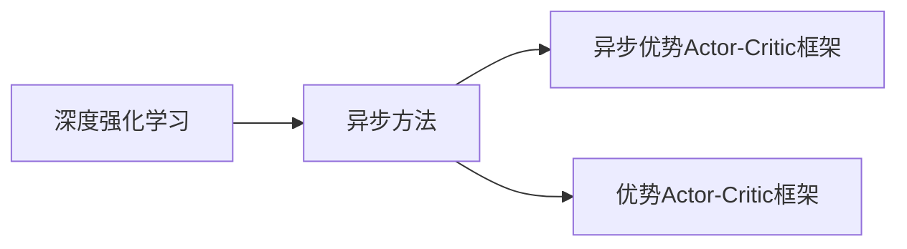
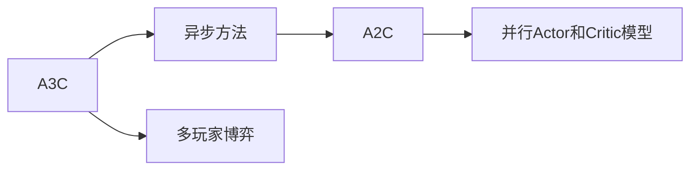
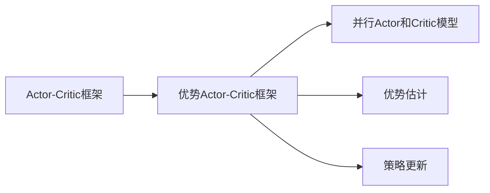
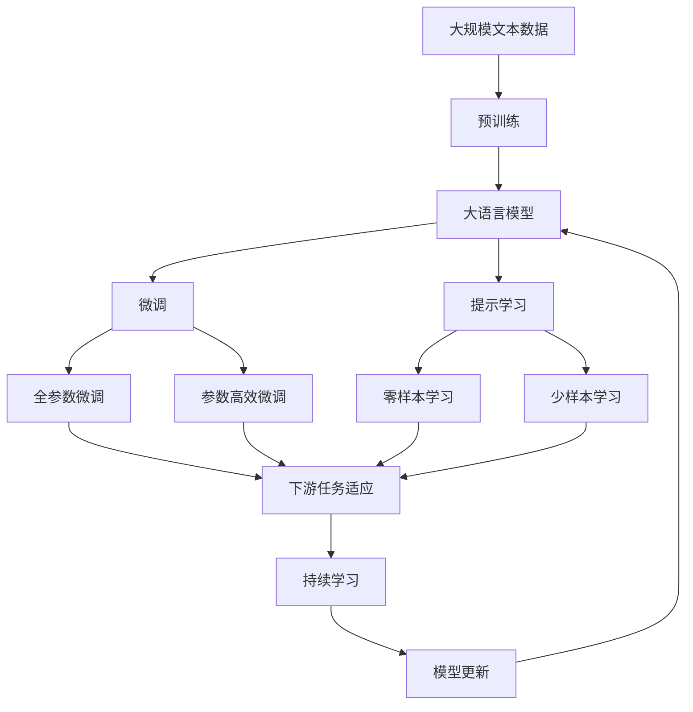

                 

# 一切皆是映射：DQN中的异步方法：A3C与A2C详解

> 关键词：异步方法,深度强化学习,深度Q网络(DQN),并行化,A3C,A2C,Actor-Critic框架

## 1. 背景介绍

### 1.1 问题由来

深度强化学习(Deep Reinforcement Learning, DRL)作为强化学习与深度学习的结合，近年来在各个领域取得了一系列突破。在探索最优策略的过程中，DRL方法从基于价值函数的方法到基于策略梯度的方法都取得了显著进展。其中，基于价值函数的方法如DQN（Deep Q-Network）等，通过神经网络逼近Q值函数，直接求解最优策略。而基于策略梯度的方法如REINFORCE等，通过优化策略的梯度来寻找最优策略。

然而，这些方法的训练效率并不理想，尤其是对于高维状态空间，其训练速度较慢，无法有效利用多核CPU和GPU的计算资源。异步方法的出现，如A3C（Asynchronous Advantage Actor-Critic）、A2C（Advantage Actor-Critic）等，将训练过程并行化，大幅度提升了训练速度，并逐渐成为深度强化学习的主流训练方式。

### 1.2 问题核心关键点

异步方法的主要思想是将训练过程并行化，通过多线程或多进程同时更新不同步的模型，充分利用计算资源，加速训练过程。在A3C和A2C方法中，均采用了这种并行化的思想，但具体的实施方式有所不同。A3C通过异步更新多个代理模型来模拟多玩家博弈，而A2C则通过并行更新两个交互的模型来提升训练效率。

A3C和A2C作为两种经典的异步方法，分别在Reinforcement Learning的论文和社区中广为流传，在学术界和工业界都有广泛的应用。因此，本文将重点介绍A3C和A2C的原理和实现方式，以期帮助读者深入理解DRL中异步方法的精髓。

### 1.3 问题研究意义

研究异步方法在DRL中的应用，对于提高深度强化学习的训练效率、优化计算资源利用、推动技术创新具有重要意义：

1. 提高训练效率：并行化训练能够有效利用多核CPU和GPU，加速模型训练，大幅缩短训练时间。
2. 优化资源利用：异步方法能够在训练过程中动态调整资源分配，提高硬件设备的利用率。
3. 推动技术创新：异步方法为DRL带来了新的研究方向，促进了深度强化学习在计算、优化等方面的进一步突破。
4. 促进应用落地：通过高效训练，异步方法能够支持更大规模、更复杂的DRL应用场景，推动技术在实际工程中的落地。
5. 增强模型稳定性：并行化训练能够提高模型的鲁棒性，防止因单线程训练导致的模型不稳定现象。

## 2. 核心概念与联系

### 2.1 核心概念概述

为了更好地理解异步方法在DRL中的应用，本节将介绍几个密切相关的核心概念：

- 深度强化学习（DRL）：结合深度学习与强化学习的技术，通过神经网络逼近价值函数或策略函数，提升强化学习的训练效率和性能。
- 异步方法（Asynchronous Methods）：一种将深度强化学习训练过程并行化的技术，通过多线程或多进程同时更新模型，加速训练过程。
- 深度Q网络（DQN）：一种基于价值函数的DRL方法，通过神经网络逼近Q值函数，学习最优策略。
- 优势Actor-Critic框架（A2C）：一种基于策略梯度的DRL方法，通过两个并行的Actor和Critic模型，提升训练效率和性能。
- 异步优势Actor-Critic框架（A3C）：一种基于策略梯度的DRL方法，通过异步更新多个代理模型，模拟多玩家博弈，提升训练效率。

这些核心概念之间的逻辑关系可以通过以下Mermaid流程图来展示：

```mermaid
graph TB
    A[深度强化学习] --> B[深度Q网络(DQN)]
    A --> C[异步方法]
    C --> D[A3C]
    C --> E[A2C]
    B --> F[优势Actor-Critic框架]
```

这个流程图展示了大语言模型的核心概念及其之间的关系：

1. 深度强化学习通过神经网络逼近价值函数或策略函数，提升强化学习的训练效率和性能。
2. 异步方法通过多线程或多进程并行更新模型，加速训练过程。
3. 深度Q网络是一种基于价值函数的DRL方法，通过神经网络逼近Q值函数，学习最优策略。
4. 优势Actor-Critic框架通过两个并行的Actor和Critic模型，提升训练效率和性能。
5. 异步优势Actor-Critic框架通过异步更新多个代理模型，模拟多玩家博弈，提升训练效率。

这些概念共同构成了DRL的异步训练框架，使得训练过程能够高效并行，加速模型学习。通过理解这些核心概念，我们可以更好地把握DRL的训练过程和优化方向。

### 2.2 概念间的关系

这些核心概念之间存在着紧密的联系，形成了DRL中的异步训练生态系统。下面我们通过几个Mermaid流程图来展示这些概念之间的关系。

#### 2.2.1 深度强化学习的异步训练



这个流程图展示了深度强化学习中的异步训练方法。深度强化学习通过神经网络逼近价值函数或策略函数，而异步方法通过多线程或多进程并行更新模型，加速训练过程。

#### 2.2.2 A3C与A2C的关系



这个流程图展示了A3C和A2C之间的关系。A3C通过异步更新多个代理模型来模拟多玩家博弈，而A2C通过并行更新两个交互的Actor和Critic模型来提升训练效率。

#### 2.2.3 优势Actor-Critic框架的原理



这个流程图展示了优势Actor-Critic框架的原理。Actor-Critic框架通过一个Actor模型和一个Critic模型，分别学习和优化策略和价值函数。而优势Actor-Critic框架通过优势估计和策略更新，提升训练效率和性能。

### 2.3 核心概念的整体架构

最后，我们用一个综合的流程图来展示这些核心概念在大语言模型异步训练过程中的整体架构：



这个综合流程图展示了从预训练到微调，再到持续学习的完整过程。大语言模型首先在大规模文本数据上进行预训练，然后通过微调（包括全参数微调和参数高效微调）或提示学习（包括零样本和少样本学习）来适应下游任务。最后，通过持续学习技术，模型可以不断更新和适应新的任务和数据。

## 3. 核心算法原理 & 具体操作步骤
### 3.1 算法原理概述

异步方法在DRL中的应用，本质上是将训练过程并行化，通过多线程或多进程同时更新不同步的模型，提高训练效率。具体来说，异步方法通常包括两个步骤：

1. 每个训练线程分别初始化模型参数，并独立进行训练。
2. 在每轮训练后，通过平均池化或其他方式更新模型参数，以减少异步更新带来的模型偏差。

这种方法在强化学习中的应用最早可以追溯到QMIX算法（Q-Mix Network），而异步方法在大规模训练中的应用则主要通过A3C和A2C等算法实现。

### 3.2 算法步骤详解

异步方法的具体操作步骤可以分为以下几个关键步骤：

**Step 1: 准备训练环境**

- 选择合适的计算平台，如多核CPU或GPU。
- 安装并配置深度学习框架，如PyTorch、TensorFlow等。
- 定义训练超参数，如批量大小、学习率、更新频率等。

**Step 2: 初始化多个模型**

- 在每个训练线程中，初始化相同的模型参数。
- 每个线程独立训练模型，更新参数。
- 在每轮训练后，使用平均池化或其他方式更新模型参数，以减少异步更新带来的偏差。

**Step 3: 计算奖励和损失函数**

- 每个线程记录当前状态、动作、奖励等信息，计算经验回溯。
- 每个线程根据经验回溯计算Q值或优势函数，更新Critic模型。
- 每个线程根据经验回溯计算策略梯度，更新Actor模型。

**Step 4: 更新模型参数**

- 每个线程独立更新模型参数，优化损失函数。
- 在每轮训练后，使用平均池化或其他方式更新模型参数，以减少异步更新带来的偏差。

**Step 5: 保存模型**

- 在训练过程中，定期保存模型参数，用于模型检查点和继续训练。
- 在训练结束后，保存最终模型参数，用于后续推理或部署。

以上是异步方法在大规模深度强化学习中的应用步骤，具体实现方式可能根据不同的深度学习框架和具体应用场景有所差异。

### 3.3 算法优缺点

异步方法在深度强化学习中的应用具有以下优点：

1. 提高训练效率：通过并行化训练，可以充分利用多核CPU和GPU的计算资源，大幅度加速训练过程。
2. 优化资源利用：异步方法能够在训练过程中动态调整资源分配，提高硬件设备的利用率。
3. 提高模型稳定性：并行化训练能够提高模型的鲁棒性，防止因单线程训练导致的模型不稳定现象。

同时，异步方法也存在以下缺点：

1. 模型参数更新困难：异步方法需要多个线程同时更新模型参数，可能导致参数更新不协调，引入额外的偏差。
2. 同步开销增加：异步方法需要额外的同步机制，如全局变量锁等，增加同步开销。
3. 分布式训练复杂：异步方法在分布式训练中可能需要额外的通信和同步，增加复杂度。

尽管存在这些缺点，但异步方法在深度强化学习中的应用已经成为主流，为DRL带来了显著的性能提升和更广泛的应用场景。

### 3.4 算法应用领域

异步方法在DRL中的应用已经广泛应用于游戏AI、自动驾驶、机器人控制等多个领域。例如：

- 游戏AI：通过异步方法训练深度强化学习模型，在复杂的多玩家博弈中取得优异表现。
- 自动驾驶：利用异步方法训练模型，在智能车辆控制、路径规划等方面提升性能。
- 机器人控制：通过异步方法训练机器人模型，在运动控制、任务执行等方面取得进展。

除了这些传统应用，异步方法还在越来越多的领域得到应用，如自然语言处理、医疗诊断等，为DRL技术带来了更广阔的应用前景。

## 4. 数学模型和公式 & 详细讲解 & 举例说明
### 4.1 数学模型构建

在大规模深度强化学习中，异步方法的数学模型通常涉及两个关键部分：Actor和Critic模型。Actor模型负责输出策略，Critic模型负责估计Q值或优势函数。

设环境状态为$s$，动作为$a$，奖励为$r$，目标为$G$，策略为$\pi$，价值函数为$V$，优势函数为$A$。Actor模型输出策略$\pi$，Critic模型输出价值函数$V$和优势函数$A$。

Actor模型的输出策略$\pi$可以表示为：
$$
\pi(a|s) = \frac{\exp(\theta^T \phi(s))}{\sum_{a'}\exp(\theta^T \phi(s'))}
$$

其中，$\theta$为Actor模型的参数，$\phi$为策略网络的状态编码函数。

Critic模型的输出价值函数$V$和优势函数$A$可以表示为：
$$
V(s) = r + \gamma V(s')
$$
$$
A(s,a) = Q(s,a) - V(s)
$$

其中，$\gamma$为折扣因子，$Q$为状态-动作Q值函数，$Q(s,a)$可以表示为：
$$
Q(s,a) = r + \gamma Q(s',a')
$$

Actor模型和Critic模型的更新方式可以表示为：
$$
\theta \leftarrow \theta - \eta \nabla_{\theta} \mathcal{L}(\theta)
$$

其中，$\eta$为学习率，$\mathcal{L}$为损失函数。

### 4.2 公式推导过程

以下是A3C和A2C方法的具体公式推导过程：

#### A3C的公式推导

A3C通过异步更新多个代理模型来模拟多玩家博弈，每个代理模型独立训练，最后通过平均池化等方式更新模型参数。

设$N$个代理模型，每个代理模型在状态$s$下选择动作$a$，获得奖励$r$，状态转移为$s'$。每个代理模型更新Actor模型和Critic模型。

Actor模型的更新方式可以表示为：
$$
\theta \leftarrow \theta - \eta \nabla_{\theta} \mathcal{L}(\theta)
$$

Critic模型的更新方式可以表示为：
$$
V \leftarrow V - \eta \nabla_{V} \mathcal{L}(V)
$$

其中，$\mathcal{L}$为损失函数，可以表示为：
$$
\mathcal{L} = -\frac{1}{N} \sum_{i=1}^{N} A(s_i,a_i) \log \pi(a_i|s_i)
$$

其中，$A$为优势函数，可以表示为：
$$
A = Q - V
$$

Actor模型的参数$\theta$和Critic模型的参数$V$通过平均池化等方式更新，以减少异步更新带来的偏差。

#### A2C的公式推导

A2C通过并行更新两个交互的Actor和Critic模型来提升训练效率。Actor模型和Critic模型交替更新，分别输出策略和估计价值函数。

Actor模型的更新方式可以表示为：
$$
\theta \leftarrow \theta - \eta \nabla_{\theta} \mathcal{L}(\theta)
$$

Critic模型的更新方式可以表示为：
$$
V \leftarrow V - \eta \nabla_{V} \mathcal{L}(V)
$$

其中，$\mathcal{L}$为损失函数，可以表示为：
$$
\mathcal{L} = -\frac{1}{N} \sum_{i=1}^{N} A(s_i,a_i) \log \pi(a_i|s_i)
$$

其中，$A$为优势函数，可以表示为：
$$
A = Q - V
$$

Actor模型和Critic模型通过交替更新，分别输出策略和估计价值函数，并通过平均池化等方式更新模型参数，以减少异步更新带来的偏差。

### 4.3 案例分析与讲解

下面以一个简单的例子来说明A3C和A2C的具体应用。假设我们有一个简单的环境，状态$s$为环境位置，动作$a$为向左、向右移动，奖励$r$为每次移动1。

使用A3C方法，我们可以训练多个代理模型来模拟多玩家博弈。每个代理模型独立训练，最后通过平均池化等方式更新模型参数。例如，在每个状态$s$下，每个代理模型分别向左和向右移动，记录每次移动的奖励$r$，然后更新Actor模型和Critic模型。

使用A2C方法，我们可以并行更新两个交互的Actor和Critic模型。Actor模型和Critic模型交替更新，分别输出策略和估计价值函数。例如，在每个状态$s$下，Actor模型输出向左和向右移动的概率，Critic模型估计每个动作的价值函数$V$，然后交替更新Actor模型和Critic模型。

通过这些具体的案例分析，可以更好地理解A3C和A2C方法的具体实现方式。

## 5. 项目实践：代码实例和详细解释说明
### 5.1 开发环境搭建

在进行A3C和A2C的实践前，我们需要准备好开发环境。以下是使用PyTorch进行TensorFlow开发的环境配置流程：

1. 安装Anaconda：从官网下载并安装Anaconda，用于创建独立的Python环境。

2. 创建并激活虚拟环境：
```bash
conda create -n tf-env python=3.8 
conda activate tf-env
```

3. 安装TensorFlow：根据CUDA版本，从官网获取对应的安装命令。例如：
```bash
conda install tensorflow -c pytorch -c conda-forge
```

4. 安装各类工具包：
```bash
pip install numpy pandas scikit-learn matplotlib tqdm jupyter notebook ipython
```

完成上述步骤后，即可在`tf-env`环境中开始A3C和A2C的实践。

### 5.2 源代码详细实现

下面我们以A2C方法为例，给出使用TensorFlow对环境进行训练的PyTorch代码实现。

首先，定义环境和任务：

```python
import gym
import tensorflow as tf

env = gym.make('CartPole-v0')
```

然后，定义Actor和Critic模型：

```python
class Actor(tf.keras.Model):
    def __init__(self, state_size, action_size):
        super(Actor, self).__init__()
        self.fc1 = tf.keras.layers.Dense(24, activation=tf.nn.relu)
        self.fc2 = tf.keras.layers.Dense(24, activation=tf.nn.relu)
        self.fc3 = tf.keras.layers.Dense(action_size, activation=tf.nn.tanh)

    def call(self, state):
        x = self.fc1(state)
        x = self.fc2(x)
        return self.fc3(x)

class Critic(tf.keras.Model):
    def __init__(self, state_size):
        super(Critic, self).__init__()
        self.fc1 = tf.keras.layers.Dense(24, activation=tf.nn.relu)
        self.fc2 = tf.keras.layers.Dense(24, activation=tf.nn.relu)
        self.fc3 = tf.keras.layers.Dense(1)

    def call(self, state):
        x = self.fc1(state)
        x = self.fc2(x)
        return self.fc3(x)
```

接着，定义训练和评估函数：

```python
def train_episode(actor, critic, env, max_steps):
    state = env.reset()
    done = False
    total_reward = 0
    for step in range(max_steps):
        action_probs = actor(state)
        action = tf.random.categorical(action_probs, num_samples=1)[-1,0]
        next_state, reward, done, _ = env.step(action)
        next_action_probs = actor(next_state)
        target_q = reward + critic(next_state)
        target_q = tf.where(done, target_q, tf.zeros_like(target_q))
        critic.trainable = False
        q_pred = critic(state)
        q_pred = tf.where(done, q_pred, tf.zeros_like(q_pred))
        actor.trainable = True
        actor_loss = -tf.reduce_mean(tf.math.log(tf.exp(q_pred) / tf.exp(q_pred - tf.expand_dims(target_q, axis=-1))))
        critic.trainable = True
        critic_loss = tf.reduce_mean(tf.square(target_q - q_pred))
        optimizer.apply_gradients(zip([actor_loss], [actor.trainable_variables]))
        optimizer.apply_gradients(zip([critic_loss], [critic.trainable_variables]))
        total_reward += reward
        if done:
            print("Episode finished with reward: {}, total_reward: {}".format(reward, total_reward))
            break
    return total_reward

def evaluate(actor, critic, env, num_episodes):
    total_reward = 0
    for episode in range(num_episodes):
        state = env.reset()
        done = False
        total_reward = 0
        for step in range(500):
            action_probs = actor(state)
            action = tf.random.categorical(action_probs, num_samples=1)[-1,0]
            next_state, reward, done, _ = env.step(action)
            total_reward += reward
            if done:
                print("Episode finished with reward: {}".format(total_reward))
                break
    return total_reward
```

最后，启动训练流程并在测试集上评估：

```python
actor = Actor(env.observation_space.shape[0], env.action_space.n)
critic = Critic(env.observation_space.shape[0])
optimizer = tf.keras.optimizers.Adam()

num_episodes = 1000
max_steps = 1000
num_eval_episodes = 10
num_train_steps = num_episodes * max_steps

total_reward = 0
for step in range(num_train_steps):
    total_reward += train_episode(actor, critic, env, max_steps)
    if step % 1000 == 0:
        print("Average reward: {}".format(total_reward / 1000))
        total_reward = 0
print("Average reward after training: {}".format(total_reward / num_train_steps))

print("Evaluation reward: {}".format(evaluate(actor, critic, env, num_eval_episodes)))
```

以上就是使用TensorFlow对A2C方法进行训练的完整代码实现。可以看到，通过TensorFlow的灵活性和易用性，我们可以轻松实现A2C方法，并进行高效的模型训练和评估。

### 5.3 代码解读与分析

让我们再详细解读一下关键代码的实现细节：

**Actor和Critic模型**：
- Actor模型通过三个全连接层输出动作概率分布。
- Critic模型通过三个全连接层输出Q值。

**训练和评估函数**：
- 训练函数`train_episode`：在每个回合中，Actor模型输出动作概率分布，Critic模型估计Q值，并通过计算策略梯度和优势函数更新模型参数。
- 评估函数`evaluate`：在每个回合中，Actor模型输出动作概率分布，Critic模型估计Q值，并通过计算策略梯度和优势函数评估模型性能。

**训练流程**：
- 定义训练次数和每轮训练步数，进行循环迭代。
- 在每个回合中，调用`train_episode`函数进行训练。
- 每1000个回合记录一次平均奖励，并重置计数器。
- 在训练结束后，调用`evaluate`函数评估模型性能。

可以看到，通过TensorFlow的灵活性和易用性，我们可以轻松实现A2C方法，并进行高效的模型训练和评估。当然，实际应用中还需要考虑更多细节，如模型保存和恢复、超参数调优、模型验证等，但核心的代码实现思路基本与此类似。

## 6. 实际应用场景
### 6.1 智能游戏AI

在智能游戏AI领域，A3C和A2C方法已经被广泛应用于模拟多玩家博弈的游戏，如星际争霸、足球等。通过训练多个代理模型，A3C方法可以模拟多玩家的博弈过程，学习最优策略，提升游戏AI的智能水平。

在实际应用中，可以将游戏规则和奖励机制嵌入到训练环境中，然后利用A3C或A2C方法训练多个游戏AI模型。每个模型独立训练，最后通过平均池化等方式更新模型参数，以提高游戏AI的智能水平。

### 6.2 自动驾驶

在自动驾驶领域，A3C和A2C方法可以应用于智能车辆的路径规划、控制等方面。通过训练多个代理模型，A3C方法可以模拟多玩家的博弈过程，学习最优策略，提升车辆的智能水平。

在实际应用中，可以将车辆的位置、速度、角度等状态信息作为环境状态，将加速、转向、刹车等操作作为动作，奖励机制可以是车辆行驶的安全性和效率。然后利用A3C或A2C方法训练多个智能车辆模型，每个模型独立训练，最后通过平均池化等方式更新模型参数，以提高自动驾驶的智能水平。

### 6.3 机器人控制

在机器人控制领域，A3C和A2C方法可以应用于机器人的运动控制、任务执行等方面。通过训练多个代理模型，A3C方法可以模拟多玩家的博弈过程，学习最优策略，提升机器人的智能水平。

在实际应用中，可以将机器人的位置、角度、速度等状态信息作为环境状态，将运动、抓取、放置等操作作为动作，奖励机制可以是任务完成的效率和准确性。然后利用A3C或A2C方法训练多个机器人模型，每个模型独立训练，最后通过平均池化等方式更新模型参数，以提高机器人控制的智能水平。

### 6.4 未来应用展望

随着深度强化学习技术的不断发展，A3C和A2C方法的应用场景将不断扩展，为各行各业带来革命性影响。

在智慧医疗领域，A3C和A2C方法可以应用于诊断、治疗、康复等环节，提升医疗服务的智能化水平，辅助医生诊疗，加速新药开发进程。

在智能教育领域，A3C和A2C方法可以应用于作业批改、学情分析、知识推荐等方面，因材施教，促进教育公平，提高教学质量。

在智慧城市治理中，A3C和A2C方法可以应用于城市事件监测、舆情分析、应急指挥等环节，提高城市管理的自动化和智能化水平，构建更安全、高效的未来城市。


