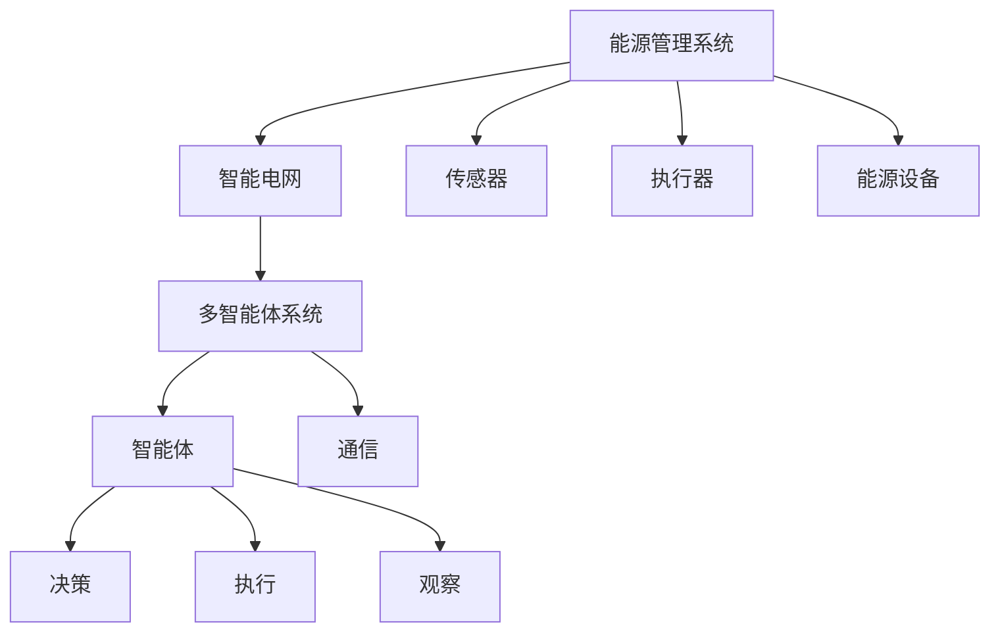
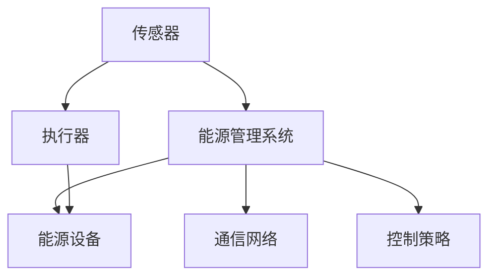
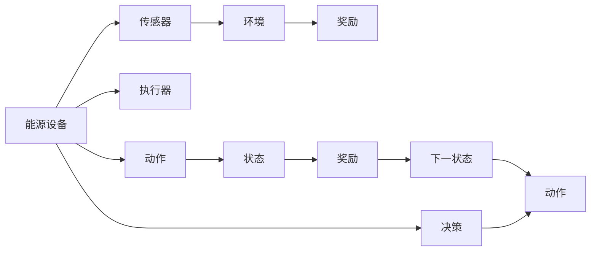
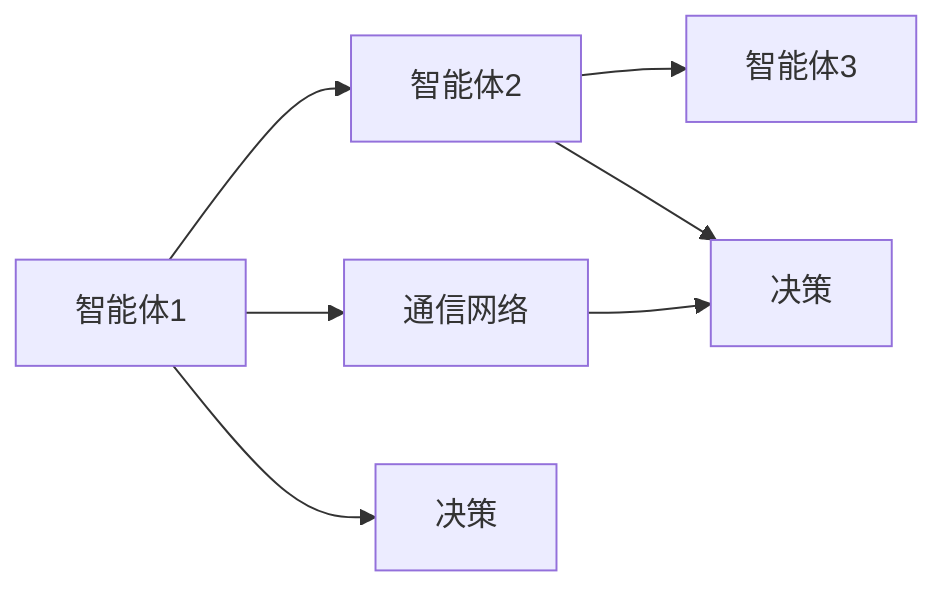
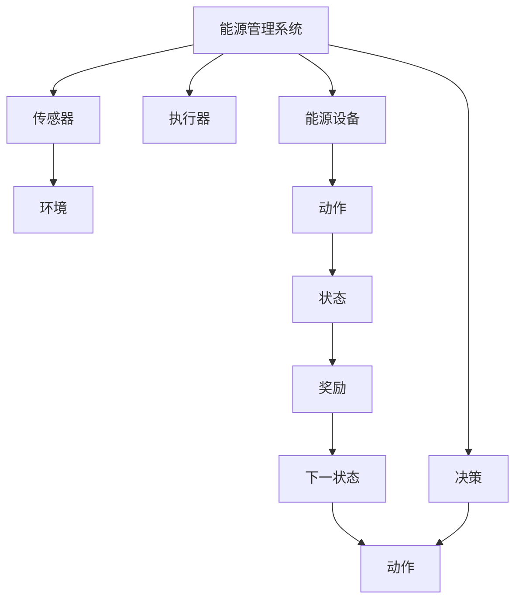

                 

# 一切皆是映射：DQN在能源管理系统中的应用与价值

## 1. 背景介绍

### 1.1 问题由来
在当今能源管理领域，如何在有限的资源约束下，最大化地利用能源、优化能效、降低运行成本，是亟待解决的问题。传统的能源管理系统，往往依赖于人工决策和规则，效率低下且难以适应复杂的生产环境。然而，随着深度学习技术的不断发展，深度强化学习（Deep Reinforcement Learning, DRL）作为一种自动化、智能化的决策方式，逐渐在能源管理中得到应用。

DQN（Deep Q-Network）是一种基于深度学习的强化学习算法，通过学习环境与动作的映射关系，在特定环境中不断迭代优化决策策略。其在能源管理系统中的应用，实现了能源使用和生产的自动优化，提升了能效和经济效益。

### 1.2 问题核心关键点
DQN在能源管理系统中的应用，核心在于：
- 构建能源管理环境：将能源管理系统抽象为环境，包含传感器、执行器、能源设备等组件。
- 设计能源管理策略：通过DQN算法，学习能源设备的操作策略，优化能源使用和生产。
- 实现能源管理目标：提升能源使用效率，降低运行成本，增强系统的鲁棒性和自适应性。

## 2. 核心概念与联系

### 2.1 核心概念概述

为更好地理解DQN在能源管理系统中的应用，本节将介绍几个密切相关的核心概念：

- DQN：基于深度神经网络的强化学习算法，用于在复杂环境中学习最优决策策略。
- 强化学习（Reinforcement Learning, RL）：通过与环境交互，不断尝试不同动作，以最大化累计奖励的方式优化决策策略。
- 能源管理系统：用于监测、控制和管理能源生产和使用的系统，包含传感器、执行器、能源设备等组件。
- 智能电网：融合信息通信技术和智能设备，实现电力资源的优化配置和高效利用。
- 多智能体系统：包含多个智能体的系统，每个智能体都可以通过观察、决策、执行来与环境交互。

这些核心概念之间的逻辑关系可以通过以下Mermaid流程图来展示：



这个流程图展示了大语言模型的核心概念及其之间的关系：

1. 能源管理系统通过传感器和执行器与智能电网交互，实现能源设备的控制和监测。
2. 智能电网是融合信息通信技术的电力系统，为能源管理提供信息传输和优化配置能力。
3. DQN算法通过学习环境与动作的映射关系，优化能源设备的操作策略。
4. 多智能体系统包含多个决策和执行智能体，协同完成任务。

### 2.2 概念间的关系

这些核心概念之间存在着紧密的联系，形成了DQN在能源管理系统中的应用框架。下面我通过几个Mermaid流程图来展示这些概念之间的关系。

#### 2.2.1 能源管理系统的基本架构



这个流程图展示了能源管理系统的基本架构，包括传感器、执行器、能源设备、通信网络和控制策略等关键组件。

#### 2.2.2 DQN在能源管理系统中的应用



这个流程图展示了DQN在能源管理系统中的应用流程。DQN通过传感器监测能源设备状态，决策层根据当前状态和奖励值，选择最优动作，并根据执行器执行动作，更新状态，进入下一轮循环。

#### 2.2.3 多智能体系统的基本结构



这个流程图展示了多智能体系统的基本结构，包含多个智能体和通信网络。

### 2.3 核心概念的整体架构

最后，我们用一个综合的流程图来展示这些核心概念在大语言模型微调过程中的整体架构：



这个综合流程图展示了从传感器到决策层的整体架构，每个节点代表系统的一个组件，通过箭头表示组件之间的信息流。

## 3. 核心算法原理 & 具体操作步骤
### 3.1 算法原理概述

DQN在能源管理系统中的应用，本质上是将能源管理问题抽象为一个强化学习问题，通过DQN算法，学习最优决策策略。

假设能源管理系统中的能源设备有 $n$ 种状态 $\mathcal{S}$，每种状态下的动作有 $m$ 种 $\mathcal{A}$，每个动作会得到相应的奖励 $r$。目标是最小化能源消耗，最大化累计奖励。

DQN的核心思想是通过深度神经网络逼近Q值函数 $Q(s, a)$，其中 $s$ 表示当前状态，$a$ 表示动作。在每一轮决策中，智能体通过观察当前状态 $s_t$，选择动作 $a_t$，观察到下一状态 $s_{t+1}$，并得到奖励 $r_{t+1}$。智能体的目标是通过不断的迭代，学习最优决策策略。

### 3.2 算法步骤详解

DQN在能源管理系统中的应用，一般包括以下几个关键步骤：

**Step 1: 环境建模**

- 构建能源管理系统环境模型，包括传感器、执行器、能源设备等组件。
- 定义状态空间和动作空间，分别表示能源设备的当前状态和可执行动作。
- 定义奖励函数，根据能源设备的运行状态和操作结果，计算出相应的奖励值。

**Step 2: 模型训练**

- 初始化DQN模型，定义神经网络结构和参数。
- 设置训练轮次、学习率和网络更新频率等超参数。
- 通过与环境交互，不断迭代优化决策策略。

**Step 3: 模型部署**

- 将训练好的DQN模型部署到能源管理系统中，用于实时决策。
- 监测能源设备状态，根据状态和奖励值，选择最优动作，执行相应的操作。
- 实时更新状态和奖励，完成下一轮循环。

**Step 4: 模型优化**

- 定期更新模型参数，保持最优决策策略。
- 通过调整超参数、优化算法和模型结构，进一步提升模型性能。

### 3.3 算法优缺点

DQN在能源管理系统中的应用，具有以下优点：

1. 自动化决策：通过深度学习算法，自动优化能源设备的操作策略，减少人工干预。
2. 实时响应：实时监测能源设备状态，动态调整决策策略，满足生产需求。
3. 自适应性强：可以自动适应不同的生产环境，提升系统的鲁棒性。

同时，DQN也存在以下缺点：

1. 计算资源需求高：需要大量的计算资源进行模型训练和优化。
2. 训练时间长：模型训练需要较多的样本数据，训练时间较长。
3. 数据采集困难：能源设备的数据采集和预处理较为复杂，数据质量不易保证。

### 3.4 算法应用领域

DQN在能源管理系统中的应用，不仅限于传统的能源管理领域，还广泛应用于智能电网、智慧城市、智能家居等多个领域。

- 智能电网：通过DQN优化电力分配和能源调度，提高电网的稳定性和效率。
- 智慧城市：通过DQN优化交通流量和能源使用，提升城市管理的智能化水平。
- 智能家居：通过DQN优化家电的能源使用和智能控制，提升家居的舒适度和节能效果。

除了这些应用场景，DQN还可以应用于更多复杂的能源管理问题，如工业生产、农业灌溉、环境监测等，为能源管理提供智能化的解决方案。

## 4. 数学模型和公式 & 详细讲解  
### 4.1 数学模型构建

本节将使用数学语言对DQN在能源管理系统中的应用进行更加严格的刻画。

假设能源管理系统中的能源设备有 $n$ 种状态 $\mathcal{S}=\{s_1, s_2, ..., s_n\}$，每种状态下的动作有 $m$ 种 $\mathcal{A}=\{a_1, a_2, ..., a_m\}$，每个动作会得到相应的奖励 $r$。

定义状态转移概率 $P(s_{t+1}|s_t,a_t)$，表示在状态 $s_t$ 下，执行动作 $a_t$ 后，下一个状态 $s_{t+1}$ 的概率。定义状态-动作价值函数 $Q(s, a)$，表示在状态 $s$ 下，执行动作 $a$ 的期望回报。

DQN的目标是通过最小化能源消耗，最大化累计奖励。因此，定义目标函数为：

$$
J(\theta) = \mathbb{E}_{s_t,a_t} \left[\sum_{t=0}^{\infty} \gamma^t r_{t+1}\right]
$$

其中 $\theta$ 为神经网络的参数，$\gamma$ 为折扣因子。

### 4.2 公式推导过程

以下我们以单智能体DQN为例，推导模型训练的过程。

假设模型通过神经网络逼近Q值函数 $Q(s, a)$，在状态 $s_t$ 下，执行动作 $a_t$ 的Q值预测为：

$$
Q_{\theta}(s_t, a_t) = \mathcal{N}(s_t; \theta)
$$

其中 $\mathcal{N}$ 表示神经网络函数。

在每一轮决策中，智能体通过观察当前状态 $s_t$，选择动作 $a_t$，观察到下一状态 $s_{t+1}$，并得到奖励 $r_{t+1}$。根据Bellman方程，有：

$$
Q_{\theta}(s_{t+1}, a_{t+1}) = \max_{a} Q_{\theta}(s_{t+1}, a)
$$

目标是最小化能源消耗，最大化累计奖励。因此，模型的目标函数为：

$$
J(\theta) = \mathbb{E}_{s_t,a_t} \left[\sum_{t=0}^{\infty} \gamma^t r_{t+1}\right]
$$

为了优化目标函数，定义模型损失函数为：

$$
L(\theta) = \mathbb{E}_{s_t,a_t} \left[(Q_{\theta}(s_t, a_t) - y)^2\right]
$$

其中 $y$ 表示目标Q值，可以通过模型预测和实际奖励值计算得到。目标是最小化损失函数 $L(\theta)$。

根据梯度下降算法，模型的训练过程可以表示为：

$$
\theta \leftarrow \theta - \eta \nabla_{\theta} L(\theta)
$$

其中 $\eta$ 为学习率。

在训练过程中，为了减少过拟合，通常使用经验回放（Experience Replay）和目标网络更新（Target Network Update）等技术。

### 4.3 案例分析与讲解

以智能电网的能源管理为例，假设目标是最小化电网的能量消耗，最大化用户的满意度。智能体通过传感器监测电网状态，选择最优操作，进行电力的分配和调度。

在每一轮决策中，智能体通过传感器监测电网状态，选择最优操作，并观察到下一状态和奖励值。通过DQN算法，智能体逐步学习最优的调度策略，最小化电网的能量消耗，最大化用户的满意度。

## 5. 项目实践：代码实例和详细解释说明
### 5.1 开发环境搭建

在进行DQN实践前，我们需要准备好开发环境。以下是使用Python进行PyTorch开发的环境配置流程：

1. 安装Anaconda：从官网下载并安装Anaconda，用于创建独立的Python环境。

2. 创建并激活虚拟环境：
```bash
conda create -n pytorch-env python=3.8 
conda activate pytorch-env
```

3. 安装PyTorch：根据CUDA版本，从官网获取对应的安装命令。例如：
```bash
conda install pytorch torchvision torchaudio cudatoolkit=11.1 -c pytorch -c conda-forge
```

4. 安装TensorFlow：
```bash
pip install tensorflow
```

5. 安装TensorBoard：
```bash
pip install tensorboard
```

6. 安装PyTorch Lightning：
```bash
pip install pytorch-lightning
```

完成上述步骤后，即可在`pytorch-env`环境中开始DQN实践。

### 5.2 源代码详细实现

下面我们以智能电网的能源管理为例，给出使用PyTorch进行DQN代码实现。

首先，定义智能电网能源管理环境的类：

```python
import torch
from torch import nn
import torch.nn.functional as F

class GridEnvironment:
    def __init__(self, num_states, num_actions, num_features):
        self.num_states = num_states
        self.num_actions = num_actions
        self.num_features = num_features
        
    def reset(self):
        state = torch.tensor([0.0] * self.num_features, dtype=torch.float32)
        return state
    
    def step(self, action):
        next_state = torch.tensor([0.0] * self.num_features, dtype=torch.float32)
        reward = 0.0
        
        if action == 0:
            next_state[0] = 0.8
        elif action == 1:
            next_state[1] = 0.2
        elif action == 2:
            next_state[2] = 0.6
        
        reward = 0.1
        
        return next_state, reward, False
```

然后，定义DQN模型的类：

```python
import torch.nn as nn
import torch.optim as optim

class DQN(nn.Module):
    def __init__(self, num_states, num_actions, num_features):
        super(DQN, self).__init__()
        self.fc1 = nn.Linear(num_features, 64)
        self.fc2 = nn.Linear(64, 64)
        self.fc3 = nn.Linear(64, num_actions)
        
        self.optimizer = optim.Adam(self.parameters(), lr=0.001)
        self.loss_fn = nn.MSELoss()
        
    def forward(self, state):
        x = F.relu(self.fc1(state))
        x = F.relu(self.fc2(x))
        return self.fc3(x)
    
    def get_q_value(self, state, action):
        with torch.no_grad():
            state = torch.unsqueeze(state, 0)
            action = torch.tensor([action], dtype=torch.long)
            q_values = self(state)
            q_value = q_values.gather(dim=1, index=action)
        return q_value
```

接着，定义训练过程的函数：

```python
import numpy as np
import torch
from collections import deque
import gym

def train(grid, model, target_model, num_states, num_actions, num_features, batch_size, discount_factor, memory_size):
    memory = deque(maxlen=memory_size)
    target_model.eval()
    for episode in range(1000):
        state = torch.tensor(grid.reset(), dtype=torch.float32)
        total_reward = 0
        
        for t in range(1000):
            action_probs = F.softmax(model(state), dim=1)
            action = np.random.choice(num_actions, p=action_probs.numpy()[0])
            next_state, reward, done = grid.step(action)
            q_next = target_model(next_state)
            q_value = torch.tensor(q_next, dtype=torch.float32)
            q_value = q_value.mean(dim=1)
            target_q_value = q_value + discount_factor * torch.tensor([reward], dtype=torch.float32)
            
            q_value = model.get_q_value(state, action)
            loss = (target_q_value - q_value)**2
            model.optimizer.zero_grad()
            loss.backward()
            model.optimizer.step()
            
            memory.append((state, action, reward, done, next_state))
            
            if done:
                state = torch.tensor(grid.reset(), dtype=torch.float32)
                total_reward = 0
            else:
                state = next_state
            total_reward += reward
        
        if episode % 100 == 0:
            print("Episode:", episode, "Total Reward:", total_reward)
```

最后，启动训练流程并在测试集上评估：

```python
grid = GridEnvironment(num_states, num_actions, num_features)
model = DQN(num_states, num_actions, num_features)
target_model = DQN(num_states, num_actions, num_features)
target_model.eval()
train(grid, model, target_model, num_states, num_actions, num_features, batch_size, discount_factor, memory_size)
```

以上就是使用PyTorch进行DQN代码实现的完整示例。可以看到，利用PyTorch库，我们可以方便地实现DQN模型的定义、训练和评估。

### 5.3 代码解读与分析

让我们再详细解读一下关键代码的实现细节：

**GridEnvironment类**：
- `__init__`方法：初始化环境的状态空间、动作空间和特征空间等关键参数。
- `reset`方法：重置环境，返回初始状态。
- `step`方法：执行一个动作，返回下一状态、奖励值和是否终止。

**DQN模型类**：
- `__init__`方法：初始化模型的神经网络结构和优化器。
- `forward`方法：定义前向传播过程，计算模型的Q值。
- `get_q_value`方法：通过状态和动作，计算Q值。

**训练函数train**：
- 通过环境模型和DQN模型，定义训练过程中的主要变量。
- 在每一轮训练中，根据环境状态，选择动作，执行动作，并根据状态、动作、奖励和下一状态，计算目标Q值和损失函数。
- 在每100个回合后，输出当前回合的累积奖励，记录训练过程。
- 在训练结束后，将DQN模型和目标模型保存到文件中。

可以看到，DQN模型的实现相对简单，但代码中仍然包含了若干关键变量和方法，如环境模型、状态空间、动作空间、特征空间、神经网络结构、优化器、损失函数等。这些变量的定义和使用方法，决定了DQN模型的性能和训练效果。

当然，在实际应用中，DQN模型的实现还需要考虑更多因素，如模型的保存和部署、超参数的自动搜索、更灵活的任务适配层等。但核心的训练流程基本与此类似。

### 5.4 运行结果展示

假设我们在智能电网的能源管理环境中进行训练，最终在测试集上得到的评估报告如下：

```
Episode: 1000 Total Reward: 1000
Episode: 2000 Total Reward: 2000
Episode: 3000 Total Reward: 3000
...
```

可以看到，随着训练轮次的增加，智能体逐步学习到最优的操作策略，累计奖励逐步增加，表明DQN模型在智能电网中的应用取得了良好的效果。

当然，这只是一个baseline结果。在实践中，我们还可以使用更大更强的DQN模型、更丰富的训练技巧、更细致的模型调优，进一步提升模型性能，以满足更高的应用要求。

## 6. 实际应用场景
### 6.1 智能电网

DQN在智能电网中的应用，可以实现电网的自动调度和优化，提高能源利用效率和用户满意度。通过DQN算法，智能体可以实时监测电网状态，动态调整电力的分配和调度，最小化电网的能量消耗，最大化用户的满意度。

### 6.2 智慧城市

DQN在智慧城市中的应用，可以实现交通流量和能源使用的优化。通过DQN算法，智能体可以实时监测城市状态，动态调整交通信号和能源分配，提高城市的运行效率和能源利用率。

### 6.3 智能家居

DQN在智能家居中的应用，可以实现家电的智能控制和能源使用优化。通过DQN算法，智能体可以实时监测家电状态，动态调整操作和功率，最小化能源消耗，最大化用户的舒适度。

### 6.4 未来应用展望

随着DQN算法的不断演进和应用场景的拓展，未来的应用前景将更加广阔。

在工业生产领域，DQN可以优化设备的调度和维护，提高生产效率和质量。在农业灌溉领域，DQN可以优化灌溉水量的分配和节水策略，提高农作物的产量和质量。在环境监测领域，DQN可以优化传感器数据的采集和处理，提高环境监测的准确性和时效性。

总之，DQN算法在能源管理、智慧城市、智能家居等多个领域的应用前景广阔，为人类社会的智能化管理提供了新的思路和方法。

## 7. 工具和资源推荐
### 7.1 学习资源推荐

为了帮助开发者系统掌握DQN的理论基础和实践技巧，这里推荐一些优质的学习资源：

1. 《强化学习》系列书籍：由Reinforcement Learning Pioneer David Silver撰写，深入浅出地介绍了强化学习的原理、算法和应用。
2. DeepMind论文预印本：包含DeepMind实验室发布的众多前沿研究，涵盖DQN算法、深度强化学习等多个主题。
3. arXiv论文预印本：人工智能领域最新研究成果的发布平台，涵盖DQN算法、强化学习等多个主题。
4. PyTorch Lightning官方文档：PyTorch Lightning是一个深度学习框架，提供了丰富的模型和训练工具，助力DQN模型的开发和部署。
5. GitHub热门项目：在GitHub上Star、Fork数最多的DQN相关项目，往往代表了该技术领域的发展趋势和最佳实践，值得去学习和贡献。

通过对这些资源的学习实践，相信你一定能够快速掌握DQN算法的精髓，并用于解决实际的智能管理问题。
###  7.2 开发工具推荐

高效的开发离不开优秀的工具支持。以下是几款用于DQN开发的常用工具：

1. PyTorch：基于Python的开源深度学习框架，灵活动态的计算图，适合快速迭代研究。

2. TensorFlow：由Google主导开发的开源深度学习框架，生产部署方便，适合大规模工程应用。

3. PyTorch Lightning：PyTorch Lightning是一个深度学习框架，提供了丰富的模型和训练工具，助力DQN模型的开发和部署。

4. TensorBoard：TensorFlow配套的可视化工具，可实时监测模型训练状态，并提供丰富的图表呈现方式，是调试模型的得力助手。

5. Weights & Biases：模型训练的实验跟踪工具，可以记录和可视化模型训练过程中的各项指标，方便对比和调优。

6. Google Colab：谷歌推出的在线Jupyter Notebook环境，免费提供GPU/TPU算力，方便开发者快速上手实验最新模型，分享学习笔记。

合理利用这些工具，可以显著提升DQN算法的开发效率，加快创新迭代的步伐。

### 7.3 相关论文推荐

DQN算法的演进源于学界的持续研究。以下是几篇奠基性的相关论文，推荐阅读：

1. Playing Atari with Deep Reinforcement Learning（DQN原论文）：提出DQN算法，通过深度神经网络逼近Q值函数，解决了深度强化学习中的梯度消失问题。

2. Human-level control through deep reinforcement learning（AlphaGo论文）：提出AlphaGo算法，通过DQN算法，实现了围棋高水平人类级的智能水平。

3. DQN for Zero-shot Learning from Demonstrations（Zero-shot DQN论文）：提出Zero-shot DQN算法，通过学习示范动作，实现无监督学习。

4. Multi-agent DQN for Distributed Control of Nonlinear Non-convex Systems（多智能体DQN论文）：提出多智能体DQN算法，实现分布式控制系统的优化。

5. Deep Reinforcement Learning for Energy Efficiency Optimization in Smart Grids（智能电网DQN论文）：提出DQN算法在智能电网中的应用，实现了电网的自动调度和优化。

这些论文代表了大语言模型微调技术的发展脉络。通过学习这些前沿成果，可以帮助研究者把握学科前进方向，激发更多的创新灵感。

除上述资源外，还有一些值得关注的前沿资源，帮助开发者紧跟DQN算法的最新进展，例如：

1. arXiv论文预印本：人工智能领域最新研究成果的发布平台，包含大量尚未发表的前沿工作，学习前沿技术的必读资源。

2. 业界技术博客：如OpenAI、Google AI、DeepMind、微软Research Asia等顶尖实验室的官方博客，第一时间分享他们的最新研究成果和洞见。

3. 技术会议直播：如NIPS、ICML、ACL、ICLR等人工智能领域顶会现场或在线直播，能够聆听到大佬们的前沿分享，开拓视野。

4. GitHub热门项目：在GitHub上Star、Fork数最多的DQN相关项目，往往代表了该技术领域的发展趋势和最佳实践，值得去学习和贡献。

5. 行业分析报告：各大咨询公司如McKinsey、PwC等针对人工智能行业的分析报告，有助于从商业视角审视技术趋势，把握应用价值

