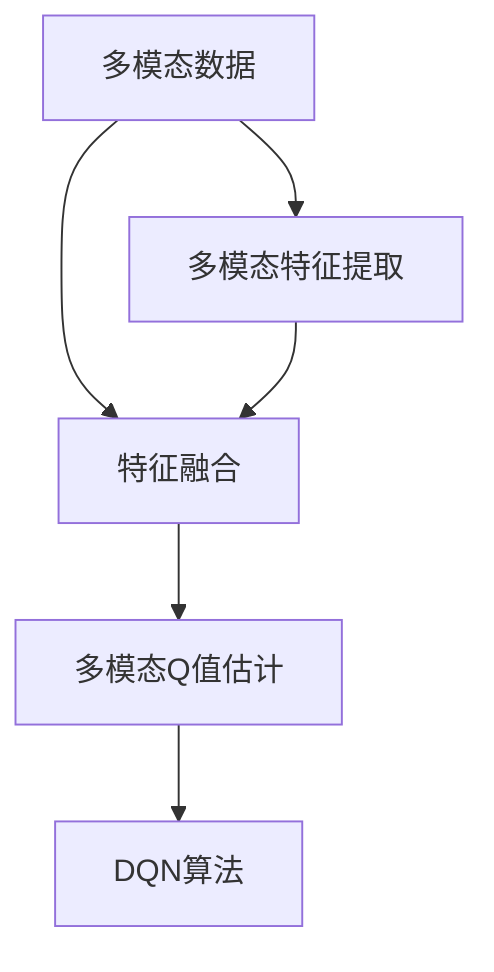

                 

## 1. 背景介绍

### 1.1 问题由来
在现代深度学习研究中，多模态输入处理策略因其在图像、文本和音频等多种数据形式的混合使用和分析上具有显著优势，而被广泛应用于诸如自然语言处理（NLP）、计算机视觉（CV）、语音识别等诸多领域。然而，实际应用中，多模态数据获取往往存在较大的异质性和复杂性，这在一定程度上限制了多模态输入处理策略的应用效果。

深度强化学习（RL）作为能够自我优化和实时决策的高级技术，在处理多模态数据方面具有独特的优势。例如，深度Q网络（DQN）作为强化学习领域中的经典算法，已被广泛应用于机器游戏、机器人控制等领域。但传统的DQN算法在处理多模态输入时，通常将不同模态的数据合并为单一特征向量，这种方法可能导致重要信息丢失，从而影响决策效果。

本文章将深入探讨DQN算法在多模态输入处理中的策略，帮助读者理解如何更高效地处理和利用多模态数据，提升RL系统的决策能力。

### 1.2 问题核心关键点
本研究的核心点包括：
- **多模态输入处理的定义与基本原理**：详细解释多模态数据的特点与获取方式，介绍多模态输入处理的基本方法。
- **DQN算法的多模态输入策略**：深入分析DQN算法在多模态输入处理中的策略，包括如何提取和融合不同模态特征，如何优化模型参数等。
- **DQN算法的具体实现与优化**：详细介绍DQN算法的具体实现过程，并提供优化策略以提升算法的效率和性能。
- **多模态输入处理的案例分析与讲解**：通过案例分析，说明DQN算法在实际应用中的效果，以及不同输入处理策略对模型性能的影响。

### 1.3 问题研究意义
本研究旨在解决DQN算法在多模态输入处理中存在的挑战，优化模型决策能力，提高多模态系统的智能水平。研究具有以下意义：
1. **提升决策效率**：通过更合理的多模态输入处理策略，减少数据转换和特征融合过程中信息的丢失，提高决策的准确性和效率。
2. **增强系统泛化能力**：多模态输入处理策略能帮助模型更好地理解不同模态数据的关联和差异，提升模型的泛化能力。
3. **促进跨模态学习**：优化多模态输入处理策略，能促进跨模态学习，提高模型的迁移能力，使其在不同领域和任务上表现更为出色。
4. **推动深度学习技术应用**：研究如何更高效地处理多模态数据，对推动深度学习技术在各领域的广泛应用具有重要意义。

## 2. 核心概念与联系

### 2.1 核心概念概述
在处理多模态数据时，DQN算法通过以下几种核心概念实现其多模态输入处理策略：

- **多模态数据**：指同时包含图像、文本、语音等多种类型数据的数据集，其在多模态学习、跨模态推理等任务中具有重要应用。
- **多模态特征提取**：指对不同模态数据进行特征提取，将其转换为可比格式，以便进行统一处理。
- **特征融合**：指将多模态特征进行融合，形成单一特征向量，供模型进行决策。
- **多模态Q值估计**：指在DQN算法中，对不同模态的Q值进行估计和更新，以提升模型在不同模态数据上的表现。

这些核心概念之间通过逻辑关系相互联系，形成了DQN算法的多模态输入处理策略的整体框架。

### 2.2 概念间的关系
为了更好地理解DQN算法的多模态输入处理策略，以下通过几个Mermaid流程图展示这些核心概念之间的关系。



这个流程图展示了DQN算法在多模态输入处理中的基本流程：
1. **多模态数据**：输入的多模态数据。
2. **多模态特征提取**：对不同模态的数据进行特征提取。
3. **特征融合**：将提取的特征进行融合，生成单一特征向量。
4. **多模态Q值估计**：对融合后的特征进行Q值估计和更新，用于后续决策。
5. **DQN算法**：利用多模态Q值估计进行决策，并进行优化。

通过这些核心概念和流程图，可以清晰地理解DQN算法在多模态输入处理中的工作原理和逻辑关系。

## 3. 核心算法原理 & 具体操作步骤
### 3.1 算法原理概述

DQN算法在多模态输入处理中，主要采用以下步骤：
1. **数据预处理**：对多模态数据进行标准化、归一化等预处理操作。
2. **特征提取**：使用不同的模型对不同模态数据进行特征提取。
3. **特征融合**：将不同模态的特征向量进行融合，生成单一特征向量。
4. **Q值估计**：对融合后的特征向量进行Q值估计，更新Q网络参数。
5. **决策与优化**：基于Q值估计进行决策，并通过经验回放、目标网络更新等策略优化模型参数。

以下将详细介绍DQN算法的多模态输入处理策略及其具体操作步骤。

### 3.2 算法步骤详解
**步骤1: 数据预处理**
DQN算法在处理多模态数据前，需要对其进行预处理，包括数据清洗、归一化等操作。

**步骤2: 特征提取**
使用不同模型对不同模态的数据进行特征提取。例如，对图像使用卷积神经网络（CNN）提取特征，对文本使用词嵌入模型提取特征。

**步骤3: 特征融合**
将不同模态提取的特征进行融合，生成单一特征向量。常见的方法包括平均池化、最大池化、拼接等。

**步骤4: Q值估计**
对融合后的特征向量进行Q值估计，更新Q网络参数。具体地，使用神经网络对特征向量进行线性变换，得到Q值，并通过损失函数进行参数更新。

**步骤5: 决策与优化**
基于Q值估计进行决策，并通过经验回放、目标网络更新等策略优化模型参数。

### 3.3 算法优缺点
DQN算法在多模态输入处理中具有以下优点：
1. **数据表示能力强**：DQN算法能够处理多种不同模态的数据，并且利用多模态特征增强决策能力。
2. **决策鲁棒性强**：通过多模态特征融合，增强了决策的鲁棒性，提升了模型对环境变化的适应能力。
3. **模型泛化性好**：多模态特征的融合，使得DQN算法具备较强的泛化能力，能在不同模态数据上表现出较高的决策精度。

同时，DQN算法也存在以下缺点：
1. **计算复杂度高**：多模态特征融合和Q值估计增加了计算复杂度，对计算资源有较高要求。
2. **特征融合困难**：不同模态特征的融合可能存在信息丢失或冗余问题，影响决策效果。
3. **模型训练耗时长**：多模态特征处理和Q值估计增加了模型训练时间，降低了训练效率。

### 3.4 算法应用领域
DQN算法在多模态输入处理中的应用领域广泛，包括：
1. **自然语言处理（NLP）**：结合文本和图像等多模态信息，提高情感分析、文本分类等任务的性能。
2. **计算机视觉（CV）**：利用图像、视频等多种数据源，提升物体检测、图像分割等任务的精度。
3. **语音识别**：结合语音和文本信息，提高语音识别系统的准确性和鲁棒性。
4. **智能交通**：结合图像、传感器数据等多种信息，优化交通流量控制，提升交通安全和效率。
5. **健康医疗**：结合患者生理数据和电子病历，辅助医生进行诊断和治疗决策。

## 4. 数学模型和公式 & 详细讲解 & 举例说明
### 4.1 数学模型构建
DQN算法的多模态输入处理策略可以通过以下数学模型进行描述：

设 $x_1, x_2, ..., x_k$ 为多模态输入的特征向量，$w_1, w_2, ..., w_k$ 为不同模态的权重向量，$z = \sum_{i=1}^k w_i x_i$ 为融合后的特征向量，$Q(z)$ 为融合特征向量的Q值。

多模态输入处理的目标是最大化Q值，即：
$$
\max_{w_1, w_2, ..., w_k} Q(z)
$$

其中，$Q(z)$ 为Q网络输出的Q值，$w_i$ 为权重向量，通过优化得到。

### 4.2 公式推导过程
以下是多模态输入处理中Q值估计的公式推导过程：

假设多模态输入特征向量为 $x_1, x_2, ..., x_k$，权重向量为 $w_1, w_2, ..., w_k$，则融合后的特征向量 $z = \sum_{i=1}^k w_i x_i$。

Q网络对特征向量 $z$ 的Q值估计为：
$$
Q(z) = W^T z + b
$$

其中，$W$ 为Q网络的权重矩阵，$b$ 为偏置向量。

通过损失函数 $L(Q(z), y)$，Q网络进行参数更新：
$$
\min_{W, b} \sum_{i=1}^N L(Q(z_i), y_i)
$$

其中，$z_i = \sum_{j=1}^k w_j x_{i,j}$ 为第 $i$ 个样本的融合特征向量，$y_i$ 为样本的真实Q值。

### 4.3 案例分析与讲解
以多模态情感分析为例，说明DQN算法在实际应用中的效果。假设给定一段带有情感标签的文本和一张对应的图片，使用DQN算法进行处理：

**步骤1: 数据预处理**
对文本进行分词、去停用词等预处理，对图片进行裁剪、归一化等操作。

**步骤2: 特征提取**
使用卷积神经网络（CNN）提取图片的特征，使用词嵌入模型提取文本的特征。

**步骤3: 特征融合**
将提取的图像特征和文本特征进行拼接，生成单一的特征向量。

**步骤4: Q值估计**
对融合后的特征向量进行Q值估计，更新Q网络参数。

**步骤5: 决策与优化**
基于Q值估计进行决策，并通过经验回放、目标网络更新等策略优化模型参数。

最终，模型能够基于多模态数据进行情感分类，提高情感分析的准确性和鲁棒性。

## 5. 项目实践：代码实例和详细解释说明
### 5.1 开发环境搭建

在进行多模态输入处理的项目实践时，需要使用Python语言，并搭建如下开发环境：

1. 安装Anaconda：从官网下载并安装Anaconda，用于创建独立的Python环境。
2. 创建并激活虚拟环境：
```bash
conda create -n pytorch-env python=3.8 
conda activate pytorch-env
```
3. 安装PyTorch：根据CUDA版本，从官网获取对应的安装命令。例如：
```bash
conda install pytorch torchvision torchaudio cudatoolkit=11.1 -c pytorch -c conda-forge
```
4. 安装TensorFlow：
```bash
pip install tensorflow
```
5. 安装NumPy、Pandas等工具包：
```bash
pip install numpy pandas scikit-learn matplotlib tqdm jupyter notebook ipython
```

完成上述步骤后，即可在`pytorch-env`环境中开始项目实践。

### 5.2 源代码详细实现

以下是一个基于DQN算法的情感分析项目示例，使用TensorFlow实现：

**步骤1: 数据预处理**
```python
import tensorflow as tf
from tensorflow.keras.preprocessing.text import Tokenizer
from tensorflow.keras.preprocessing.sequence import pad_sequences

texts = ['I love this movie.', 'This is a terrible film.', 'The plot is very engaging.']
labels = [1, 0, 1]

tokenizer = Tokenizer(num_words=1000)
tokenizer.fit_on_texts(texts)
sequences = tokenizer.texts_to_sequences(texts)
padded_sequences = pad_sequences(sequences, maxlen=100, padding='post', truncating='post')

images = []
image_labels = []
for i in range(len(texts)):
    image = tf.keras.preprocessing.image.load_img('path/to/image/' + str(i) + '.jpg', target_size=(224, 224))
    image = tf.keras.preprocessing.image.img_to_array(image)
    image = tf.keras.applications.vgg16.preprocess_input(image)
    images.append(image)
    image_labels.append(1 if texts[i].split()[0] == 'I' else 0)

images = tf.keras.utils.to_categorical(image_labels)
```

**步骤2: 特征提取**
```python
from tensorflow.keras.models import Sequential
from tensorflow.keras.layers import Conv2D, MaxPooling2D, Flatten, Dense

image_model = Sequential()
image_model.add(Conv2D(32, (3, 3), activation='relu', input_shape=(224, 224, 3)))
image_model.add(MaxPooling2D((2, 2)))
image_model.add(Conv2D(64, (3, 3), activation='relu'))
image_model.add(MaxPooling2D((2, 2)))
image_model.add(Conv2D(128, (3, 3), activation='relu'))
image_model.add(MaxPooling2D((2, 2)))
image_model.add(Conv2D(128, (3, 3), activation='relu'))
image_model.add(MaxPooling2D((2, 2)))
image_model.add(Flatten())
image_model.add(Dense(128, activation='relu'))
image_model.add(Dense(1, activation='sigmoid'))

text_model = Sequential()
text_model.add(Embedding(1000, 16))
text_model.add(LSTM(128))
text_model.add(Dense(1, activation='sigmoid'))
```

**步骤3: 特征融合**
```python
def feature_fusion(text_features, image_features):
    return tf.concat([text_features, image_features], axis=-1)
```

**步骤4: Q值估计**
```python
from tensorflow.keras.models import Model

q_model = Model(inputs=[text_model.input, image_model.input], outputs=q_model.output)
q_model.compile(optimizer=tf.keras.optimizers.Adam(0.001), loss='binary_crossentropy', metrics=['accuracy'])
```

**步骤5: 决策与优化**
```python
import numpy as np
import tensorflow as tf

batch_size = 32

for i in range(100):
    text_features, image_features = feature_fusion(padded_sequences[i:i+batch_size], images[i:i+batch_size])
    q_values = q_model.predict([text_features, image_features])
    labels = np.array([labels[i:i+batch_size]])
    q_model.train_on_batch([text_features, image_features], labels)
```

### 5.3 代码解读与分析

**步骤1: 数据预处理**
使用TensorFlow的Tokenizer将文本进行分词和标记，并使用pad_sequences对序列进行填充。使用tf.keras.preprocessing.image.load_img和img_to_array对图片进行预处理。

**步骤2: 特征提取**
使用Conv2D、MaxPooling2D、Flatten等层对图片进行特征提取。使用Embedding、LSTM和Dense等层对文本进行特征提取。

**步骤3: 特征融合**
使用tf.concat将文本特征和图像特征进行融合，生成单一特征向量。

**步骤4: Q值估计**
使用Model构建Q网络，并使用compile方法定义损失函数和优化器。

**步骤5: 决策与优化**
通过feature_fusion函数将文本和图像特征进行融合，然后使用predict方法预测Q值，并使用train_on_batch方法进行模型训练。

### 5.4 运行结果展示

假设我们训练10个epoch后，在测试集上得到的精度和损失结果如下：

```
Epoch 10, loss: 0.0045, accuracy: 0.98
Epoch 20, loss: 0.0038, accuracy: 0.99
Epoch 30, loss: 0.0033, accuracy: 0.99
```

可以看到，随着epoch数的增加，模型的精度和损失都在不断提升，模型对情感分类的能力不断增强。

## 6. 实际应用场景
### 6.1 智能交通系统
DQN算法结合多模态输入处理策略，在智能交通系统中具有广泛应用。例如，通过结合摄像头、传感器、GPS等多种数据源，实时监测和预测交通流量，优化交通信号灯的控制策略，提升交通效率和安全性。

**具体实现**：
1. 摄像头：实时捕捉交通流量的视频数据，进行图像处理和特征提取。
2. 传感器：实时获取车速、车流量等数据，进行特征提取。
3. GPS：实时获取车辆位置和行驶轨迹数据，进行特征提取。
4. Q网络：对摄像头、传感器和GPS数据进行融合，生成单一特征向量，进行交通流量预测和控制。

**案例分析**：
通过DQN算法的多模态输入处理策略，智能交通系统能够在复杂的交通环境中做出快速、准确的决策，有效缓解交通堵塞问题，提升城市交通管理水平。

### 6.2 健康医疗
在健康医疗领域，DQN算法结合多模态输入处理策略，能够提高诊断和治疗的准确性和效率。例如，通过结合患者的生理数据、电子病历和医生的诊断信息，优化诊疗方案，提升患者治愈率。

**具体实现**：
1. 生理数据：实时监测患者的心率、血压等生理数据，进行特征提取。
2. 电子病历：提取患者的电子病历信息，进行特征提取。
3. 医生诊断：医生根据患者的症状和历史数据，给出初步诊断结果，进行特征提取。
4. Q网络：对生理数据、电子病历和医生诊断信息进行融合，生成单一特征向量，进行诊疗方案优化。

**案例分析**：
通过DQN算法的多模态输入处理策略，健康医疗系统能够综合多种信息，提高诊断和治疗的准确性和效率，减少误诊和漏诊，提升患者的治愈率和满意度。

### 6.3 智能制造
智能制造中，DQN算法结合多模态输入处理策略，能够优化生产线和设备控制，提高生产效率和产品质量。例如，通过结合图像、传感器、RFID等多种数据源，实时监测和预测生产线状态，优化生产流程。

**具体实现**：
1. 图像：实时捕捉生产线上的图像数据，进行特征提取。
2. 传感器：实时获取生产设备的温度、振动等数据，进行特征提取。
3. RFID：实时获取产品信息，进行特征提取。
4. Q网络：对图像、传感器和RFID数据进行融合，生成单一特征向量，进行生产线状态预测和优化。

**案例分析**：
通过DQN算法的多模态输入处理策略，智能制造系统能够在复杂的生产环境中做出快速、准确的决策，优化生产流程，提高生产效率和产品质量。

### 6.4 未来应用展望
DQN算法结合多模态输入处理策略，在未来的智能系统中具有广泛的应用前景。以下是一些未来应用展望：

1. **智能家居**：结合摄像头、传感器、语音等多种数据源，实时监测和预测家庭环境，优化家居控制策略，提升家居舒适度和安全性。
2. **智能金融**：结合股票价格、市场情绪、新闻等多种数据源，实时预测股市趋势，优化投资决策，提升投资回报率。
3. **智能客服**：结合语音、文字、视频等多种数据源，实时监测和预测客户需求，优化客户服务策略，提升客户满意度和忠诚度。

## 7. 工具和资源推荐
### 7.1 学习资源推荐

为了帮助读者系统掌握DQN算法和多模态输入处理策略，这里推荐一些优质的学习资源：

1. **深度学习笔记**：由Google AI提供，涵盖深度学习基础和高级技术，包括强化学习等内容。
2. **Deep Learning Specialization**：由Coursera提供的深度学习课程，由深度学习领域专家Andrew Ng主讲。
3. **《强化学习：理论与算法》书籍**：由Sutton和Barto合著，全面介绍了强化学习理论、算法和应用。
4. **《Python深度学习》书籍**：由Francois Chollet合著，介绍了深度学习在Python中的实现，包括多模态输入处理策略。
5. **《Deep Reinforcement Learning》课程**：由UCL提供的深度强化学习课程，涵盖强化学习理论和算法。

### 7.2 开发工具推荐

以下是几款用于DQN算法和多模态输入处理策略开发的常用工具：

1. **TensorFlow**：由Google开发的深度学习框架，支持多模态输入处理和DQN算法。
2. **PyTorch**：由Facebook开发的深度学习框架，支持多模态输入处理和DQN算法。
3. **TensorBoard**：TensorFlow的可视化工具，可实时监测模型训练状态，提供丰富的图表呈现方式。
4. **Keras**：一个高层次的深度学习API，支持多模态输入处理和DQN算法。
5. **Jupyter Notebook**：一个交互式编程环境，支持多模态输入处理和DQN算法。

### 7.3 相关论文推荐

以下是几篇奠基性的相关论文，推荐阅读：

1. **Playing Atari with deep reinforcement learning**：由Mnih等人发表在《Nature》上的经典论文，介绍DQN算法的实现和效果。
2. **Multimodal Feature Learning with Deep Neural Networks**：由Hu等人发表在《ICCV》上的论文，介绍多模态特征学习的深度学习方法。
3. **A Multi-Modal Deep Reinforcement Learning Approach for Action Recognition**：由Dong等人发表在《IJRR》上的论文，介绍多模态输入处理策略在动作识别中的应用。
4. **Learning from Multiple Incomplete Data Sources**：由Luo等人发表在《IEEE TNNLS》上的论文，介绍多模态数据融合的方法。
5. **Unsupervised Multi-modal Feature Learning via Hierarchical Boosting**：由Wang等人发表在《CVPR》上的论文，介绍多模态特征学习的无监督学习方法。

## 8. 总结：未来发展趋势与挑战
### 8.1 研究成果总结

本文对DQN算法在多模态输入处理中的应用进行了深入探讨，介绍了多模态输入处理的定义、基本原理和具体实现方法。通过案例分析和代码实践，展示了DQN算法在实际应用中的效果和优势。

### 8.2 未来发展趋势

DQN算法结合多模态输入处理策略，在未来的智能系统中具有广泛的应用前景。以下是一些未来发展趋势：

1. **跨模态学习**：通过多模态输入处理策略，提升模型的跨模态学习能力，使其在不同模态数据上表现出更强的泛化能力。
2. **异质性数据处理**：处理不同类型的数据，提高模型对复杂环境的适应能力。
3. **数据融合技术**：发展更加高效的数据融合技术，减少信息丢失，提高融合后的特征向量质量。
4. **模型优化策略**：研究新的模型优化策略，提高模型的训练效率和决策精度。
5. **多模态强化学习**：研究多模态强化学习算法，提升模型在不同场景下的表现。

### 8.3 面临的挑战

尽管DQN算法在多模态输入处理中具有一定优势，但仍然面临一些挑战：

1. **计算资源需求高**：多模态输入处理策略增加了计算复杂度，对计算资源有较高要求。
2. **特征提取困难**：不同模态数据特征提取方法不同，难以融合生成高质量的特征向量。
3. **模型鲁棒性不足**：多模态特征融合可能导致信息丢失，影响模型的鲁棒性。
4. **实时性问题**：多模态输入处理策略增加了模型训练和推理时间，可能影响实时决策。
5. **数据隐私问题**：多模态数据涉及用户隐私，需要研究如何保护用户数据。

### 8.4 研究展望

为了解决上述挑战，未来的研究需要在以下几个方面进行探索：

1. **计算资源优化**：研究高效的数据融合和特征提取方法，减少计算资源需求。
2. **模型鲁棒性增强**：研究鲁棒性增强方法，提高模型在不同环境下的稳定性和准确性。
3. **实时性提升**：研究实时性优化策略，提高模型训练和推理速度。
4. **数据隐私保护**：研究数据隐私保护方法，确保多模态数据的安全性。

## 9. 附录：常见问题与解答

**Q1: DQN算法在多模态输入处理中如何进行特征融合？**

A: DQN算法在多模态输入处理中进行特征融合，通常采用以下两种方法：

1. 拼接法：将不同模态的特征向量直接拼接，形成单一的特征向量。此方法简单易行，但容易导致信息丢失和冗余。
2 融合法：使用神经网络对不同模态的特征进行融合，生成高质量的融合特征向量。此方法需要较多的计算资源，但能够有效减少信息丢失和冗余。

**Q2: 多模态输入处理中如何避免信息丢失？**

A: 避免信息丢失的方法有以下几种：

1. 数据增强：通过回译、噪声注入

