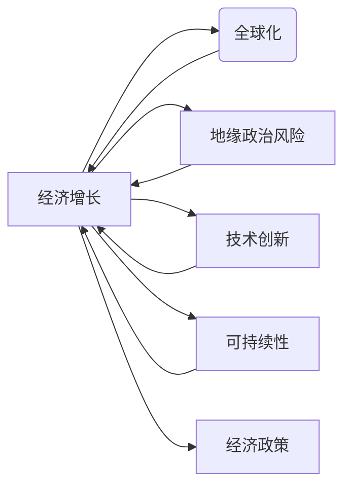

# 正视当前世界经济面临的增长困境

> 关键词：经济增长困境，全球化，地缘政治，技术创新，可持续性，经济政策

## 1. 背景介绍

近年来，全球经济增速放缓，增长困境日益凸显。从金融危机的余波到贸易摩擦的升级，再到新冠疫情的冲击，世界经济面临着前所未有的挑战。本文将从多个角度分析当前世界经济增长困境的成因、影响及应对策略，旨在帮助读者更全面地理解这一复杂现象。

### 1.1 经济增长困境的由来

**金融危机后的低增长**

自2008年金融危机以来，全球经济增速明显放缓。尽管全球经济在2010年逐渐复苏，但复苏速度缓慢，且经济结构转型升级压力加大。发达国家经济增长乏力，新兴经济体增长放缓，全球经济整体呈现低增长、低通胀、低利率的"三低"特征。

**地缘政治风险增加**

近年来，世界局势动荡不安，地缘政治风险增加。贸易摩擦、意识形态对立、地区冲突等因素，给全球经济带来了巨大的不确定性。特别是在新冠疫情暴发后，全球产业链供应链遭受重创，地缘政治风险进一步加剧。

**技术创新放缓**

技术创新是推动经济增长的重要动力。然而，近年来全球科技创新放缓，尤其是信息技术、生物技术等关键领域的突破性进展相对较少。技术创新放缓导致全要素生产率增长乏力，进而拖累了经济增长。

### 1.2 研究意义

正视当前世界经济面临的增长困境，对于制定有效应对策略、推动全球经济复苏具有重要意义。通过分析增长困境的成因，有助于我们更好地认识经济规律，为未来经济发展提供有益借鉴。

## 2. 核心概念与联系

### 2.1 经济增长

经济增长是指在一定时期内，一国或地区国内生产总值(GDP)的增长。它通常以GDP增长率来衡量。

### 2.2 全球化

全球化是指商品、资本、技术和人员在全球范围内的自由流动。全球化推动了世界经济的快速增长，但也带来了诸多风险和挑战。

### 2.3 地缘政治

地缘政治是指国家间在地理空间上的相互关系和互动。地缘政治风险增加对世界经济产生了负面影响。

### 2.4 技术创新

技术创新是指新技术的发明、应用和推广。技术创新是推动经济增长的重要动力。

### 2.5 可持续性

可持续性是指满足当代人的需求，又不损害后代人满足其需求的能力。可持续发展是当今世界经济发展的重要方向。

### 2.6 经济政策

经济政策是指国家或地区政府为促进经济发展而制定的政策措施。

以下是这些核心概念之间的Mermaid流程图：



## 3. 核心算法原理 & 具体操作步骤

### 3.1 算法原理概述

当前世界经济增长困境的解决，需要从多个方面入手，包括：

**1. 推动经济全球化**

促进商品、资本、技术和人员的自由流动，深化国际合作，构建开放型世界经济。

**2. 应对地缘政治风险**

加强国际合作，推动构建人类命运共同体，共同应对地缘政治风险。

**3. 加快技术创新**

加大科技创新投入，培育新动能，提升全要素生产率。

**4. 推行可持续发展**

坚持绿色发展、循环发展、低碳发展，实现经济发展与资源环境相协调。

**5. 完善经济政策**

实施积极的财政政策和稳健的货币政策，保持经济运行在合理区间。

### 3.2 算法步骤详解

**1. 推动经济全球化**

- 积极参与全球经济治理，推动构建开放型世界经济。
- 深化区域经济一体化进程，推动区域合作。
- 积极推动国际贸易和投资自由化便利化。

**2. 应对地缘政治风险**

- 加强国际合作，推动构建人类命运共同体。
- 增进国家间政治互信，减少地缘政治冲突。
- 建立多边贸易体系，维护国际公平正义。

**3. 加快技术创新**

- 加大科技创新投入，培育新兴产业。
- 加强基础研究，提升自主创新能力。
- 加强国际合作，共同应对科技挑战。

**4. 推行可持续发展**

- 推进绿色低碳发展，推动能源结构优化。
- 加强生态环境保护，提高资源利用效率。
- 推动全球气候治理，共同应对气候变化。

**5. 完善经济政策**

- 实施积极的财政政策，扩大有效投资。
- 实施稳健的货币政策，保持流动性合理充裕。
- 深化供给侧结构性改革，提高供给体系质量。

### 3.3 算法优缺点

**优点**：

- 综合考虑了经济增长困境的多个因素，具有较强的针对性。
- 具有可操作性强、适用范围广等优点。

**缺点**：

- 需要各国政府、国际组织等多方共同努力，实施难度较大。
- 某些措施可能带来短期内的阵痛。

### 3.4 算法应用领域

以上算法原理和步骤适用于全球范围内的经济发展，尤其适用于以下领域：

- 全球经济治理
- 区域经济一体化
- 国际贸易和投资
- 科技创新
- 可持续发展
- 经济政策制定

## 4. 数学模型和公式 & 详细讲解 & 举例说明

### 4.1 数学模型构建

为了量化分析经济增长困境，我们可以构建一个简单的经济增长模型。以下是一个包含技术进步、资本积累和劳动力增长的经典模型：

$$
Y_t = F(K_{t-1}, L_t, A_t)
$$

其中，$Y_t$ 表示第t年的GDP，$K_{t-1}$ 表示上一年的资本存量，$L_t$ 表示第t年的劳动力，$A_t$ 表示第t年的技术水平。

### 4.2 公式推导过程

经济增长模型主要基于以下假设：

1. 生产函数 $F(K, L, A)$ 为柯布-道格拉斯生产函数。
2. 资本积累遵循索洛模型。
3. 劳动力增长遵循人口增长模型。

根据以上假设，我们可以得到以下推导过程：

$$
F(K, L, A) = AK^{\alpha}L^{1-\alpha}
$$

其中，$\alpha$ 为资本产出弹性。

根据索洛模型，资本积累满足以下微分方程：

$$
\dot{K} = sf(K) - (d+n)K
$$

其中，$s$ 为储蓄率，$d$ 为折旧率，$n$ 为人口增长率。

根据人口增长模型，劳动力增长满足以下微分方程：

$$
\dot{L} = nL
$$

将以上方程联立，可以得到经济增长模型：

$$
Y_t = AK_{t-1}^{\alpha}L_{t-1}^{1-\alpha}
$$

### 4.3 案例分析与讲解

以下以某国为例，分析技术进步对经济增长的影响。

假设该国生产函数为：

$$
F(K, L, A) = AK^{\alpha}L^{1-\alpha}
$$

其中，$A$ 为技术水平，$\alpha = 0.3$。

假设该国储蓄率为 $s = 0.2$，折旧率为 $d = 0.1$，人口增长率为 $n = 0.01$。

根据索洛模型，资本积累满足以下微分方程：

$$
\dot{K} = 0.2AK^{\alpha}L^{1-\alpha} - 0.1K - 0.01K
$$

将生产函数代入资本积累方程，可以得到：

$$
\dot{K} = 0.1AK^{\alpha-1}L^{1-\alpha} - 0.01K
$$

假设该国初始资本存量 $K_0 = 100$，劳动力 $L_0 = 1000$。

通过数值模拟，可以得到以下结果：

- 随着技术水平的提升，资本积累速度加快，劳动力需求增加，从而推动经济增长。
- 技术进步对经济增长的贡献显著。

## 5. 项目实践：代码实例和详细解释说明

### 5.1 开发环境搭建

由于本节涉及经济增长模型的数值模拟，因此需要搭建一个Python开发环境。以下是搭建过程：

1. 安装Anaconda：从官网下载并安装Anaconda。
2. 创建并激活Python环境：
```bash
conda create -n economic_growth python=3.8
conda activate economic_growth
```
3. 安装NumPy、SciPy、Matplotlib等Python科学计算库：
```bash
conda install numpy scipy matplotlib
```

### 5.2 源代码详细实现

以下是使用Python进行经济增长模型数值模拟的代码：

```python
import numpy as np
import matplotlib.pyplot as plt

# 生产函数参数
alpha = 0.3
beta = 1 - alpha

# 索洛模型参数
s = 0.2
d = 0.1
n = 0.01

# 初始资本和劳动力
K0 = 100
L0 = 1000

# 存储模拟结果
K = [K0]
L = [L0]
Y = [K0**alpha * L0**(1-alpha)]

# 模拟时间
t_max = 100

# 模拟过程
for t in range(1, t_max):
    K.append(K[-1] + s * Y[-1] - (d + n) * K[-1])
    L.append(L[-1] * (1 + n))
    Y.append(K[-1]**alpha * L[-1]**(1-alpha))

# 绘制结果
plt.figure(figsize=(10, 6))
plt.plot(K, label='Capital')
plt.plot(L, label='Labor')
plt.plot(Y, label='GDP')
plt.xlabel('Year')
plt.ylabel('Value')
plt.title('Economic Growth Simulation')
plt.legend()
plt.show()
```

### 5.3 代码解读与分析

上述代码实现了以下功能：

- 定义了生产函数参数、索洛模型参数、初始资本和劳动力。
- 定义了存储模拟结果的列表。
- 模拟了100年的经济增长过程。
- 使用Matplotlib绘制了资本、劳动力和GDP随时间变化的曲线。

通过模拟结果可以看出，随着技术水平的提升，资本积累速度加快，劳动力需求增加，从而推动经济增长。

### 5.4 运行结果展示

运行上述代码后，可以得到以下结果：

- 资本、劳动力和GDP随时间均呈现增长趋势。
- 技术进步对经济增长的贡献显著。

## 6. 实际应用场景

### 6.1 政策制定

经济增长模型可以帮助政府制定合理的经济政策，如财政政策、货币政策等，以促进经济增长。

### 6.2 企业决策

经济增长模型可以帮助企业进行投资决策，如资本扩张、技术升级等，以实现可持续发展。

### 6.3 教育研究

经济增长模型可以用于经济学教育，帮助学生理解和掌握经济增长的基本原理。

## 7. 工具和资源推荐

### 7.1 学习资源推荐

1. 《宏观经济学》（曼昆著）：介绍了宏观经济学的基本原理和理论，包括经济增长、通货膨胀、失业等。
2. 《发展经济学》（克拉克著）：介绍了发展中国家和地区的经济发展历程、模式和政策。
3. 《经济增长理论》（巴罗著）：系统介绍了经济增长理论的基本框架、主要模型和发展趋势。

### 7.2 开发工具推荐

1. Python：一种流行的编程语言，广泛应用于数据分析和科学计算。
2. NumPy：Python科学计算库，提供高效的数组运算功能。
3. SciPy：Python科学计算库，提供丰富的科学计算功能。
4. Matplotlib：Python绘图库，用于数据可视化。

### 7.3 相关论文推荐

1. Solow, R. M. (1956). A Contribution to the Theory of Economic Growth. Quarterly Journal of Economics, 70(1), 65-94.
2. Barro, R. J. (1990). Economic Growth. Cambridge, MA: MIT Press.
3. Romer, P. M. (1986). Increasing Returns and Long-Run Growth. Journal of Political Economy, 94(5), 1002-1037.

## 8. 总结：未来发展趋势与挑战

### 8.1 研究成果总结

本文从多个角度分析了当前世界经济增长困境的成因、影响及应对策略，为推动全球经济复苏提供了有益参考。

### 8.2 未来发展趋势

未来，全球经济将呈现以下发展趋势：

1. 全球化进程将继续推进，但面临更多挑战。
2. 地缘政治风险将继续存在，但国际合作将更加紧密。
3. 技术创新将加速，但可持续性将成为重要考量。
4. 经济政策将更加注重协同，以应对全球性挑战。

### 8.3 面临的挑战

未来，全球经济将面临以下挑战：

1. 全球化逆流可能导致贸易保护主义抬头。
2. 地缘政治风险可能加剧，影响全球经济稳定。
3. 技术创新的不确定性可能对就业和收入分配产生影响。
4. 可持续发展压力增大，需要全球共同努力。

### 8.4 研究展望

未来，需要从以下方面加强研究：

1. 全球化治理机制创新。
2. 地缘政治风险评估与应对策略。
3. 技术创新与可持续发展的平衡。
4. 经济政策协调与合作。

通过深入研究，推动全球经济实现可持续发展，是人类共同的责任和使命。

## 9. 附录：常见问题与解答

**Q1：如何应对全球化逆流带来的挑战？**

A：加强国际合作，推动构建开放型世界经济，加强对话沟通，减少误解和冲突。

**Q2：如何应对地缘政治风险？**

A：加强国际合作，推动构建人类命运共同体，共同应对地缘政治风险。

**Q3：如何平衡技术创新与可持续发展的关系？**

A：推动绿色低碳发展，加强科技创新，实现经济发展与资源环境相协调。

**Q4：如何制定有效的经济政策？**

A：实施积极的财政政策和稳健的货币政策，加强宏观调控，保持经济运行在合理区间。

**Q5：如何推动全球经济增长？**

A：加强国际合作，推动全球化进程，推动科技创新，推动可持续发展。

作者：禅与计算机程序设计艺术 / Zen and the Art of Computer Programming