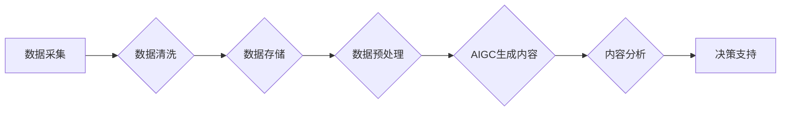

# 生成式AIGC：商业智能的未来趋势

> 关键词：AIGC，生成式人工智能，商业智能，内容生成，自然语言处理，机器学习，深度学习

## 1. 背景介绍

随着信息时代的到来，数据已成为企业最重要的资产之一。商业智能（BI）作为将数据转化为洞察力的工具，正变得越来越重要。然而，传统的BI方法往往依赖于专业分析师进行数据收集、清洗、分析和可视化，这不仅耗时耗力，而且容易受到人为因素的干扰。近年来，生成式人工智能（AIGC）技术的快速发展，为商业智能领域带来了革命性的变革。本文将深入探讨AIGC在商业智能领域的应用，分析其核心概念、算法原理、应用场景以及未来发展趋势。

## 2. 核心概念与联系

### 2.1 核心概念

#### 2.1.1 生成式人工智能（AIGC）

生成式人工智能是指能够生成内容的人工智能系统。它能够根据输入数据和特定的生成目标，自动生成文本、图像、音频等多种类型的内容。AIGC的核心是生成模型，如生成对抗网络（GANs）、变分自编码器（VAEs）和基于转换器的模型等。

#### 2.1.2 商业智能（BI）

商业智能是指通过数据分析来支持企业决策的过程。它涉及到数据采集、存储、处理、分析和可视化等多个环节。BI的目标是帮助企业发现数据中的隐藏模式，为管理层提供有价值的洞察力。

#### 2.1.3 内容生成

内容生成是指利用人工智能技术自动生成文本、图像、音频等内容的过程。在商业智能领域，内容生成可以用于自动创建报告、撰写新闻稿、生成广告文案等。

### 2.2 核心概念联系

AIGC与BI的结合，使得企业能够更加高效地生成和分析数据，从而提高决策的准确性和效率。以下是一个简化的Mermaid流程图，展示了AIGC在BI中的应用流程：



## 3. 核心算法原理 & 具体操作步骤

### 3.1 算法原理概述

#### 3.1.1 生成对抗网络（GANs）

GANs由生成器和判别器两个神经网络组成。生成器尝试生成与真实数据分布相似的数据，而判别器则尝试区分生成数据与真实数据。通过对抗训练，生成器和判别器不断进步，最终生成器能够生成高质量的数据。

#### 3.1.2 变分自编码器（VAEs）

VAEs通过最大化数据分布的似然函数来学习数据的潜在表示。生成器将数据编码为潜在空间中的点，再解码回数据空间。通过优化生成器和编码器，VAEs能够生成与训练数据分布相似的新数据。

#### 3.1.3 基于转换器的模型

基于转换器的模型，如BERT和GPT-3，通过在预训练的大规模语言模型基础上进行微调，能够生成高质量的文本内容。这些模型已经在大规模文本数据上进行了预训练，能够理解复杂的语言结构和语义。

### 3.2 算法步骤详解

#### 3.2.1 数据采集

首先，需要从各种数据源采集数据，包括企业内部数据库、公开数据集、社交媒体等。

#### 3.2.2 数据清洗

采集到的数据往往存在噪声和不一致性，需要对其进行清洗和预处理，以提高数据质量。

#### 3.2.3 数据存储

清洗后的数据需要存储在数据库或数据湖中，以便进行后续处理和分析。

#### 3.2.4 数据预处理

根据AIGC任务的需求，对数据进行必要的预处理，如文本分词、图像标注等。

#### 3.2.5 AIGC生成内容

使用AIGC算法，如GANs、VAEs或基于转换器的模型，根据训练数据和生成目标生成内容。

#### 3.2.6 内容分析

对生成的数据进行分析，评估其质量、准确性和相关性。

#### 3.2.7 决策支持

将AIGC生成的洞察力用于支持企业决策。

### 3.3 算法优缺点

#### 3.3.1 优点

- 高效生成内容：AIGC可以快速生成高质量的内容，节省时间和人力成本。
- 灵活性：AIGC可以根据不同的生成目标生成不同类型的内容。
- 自动化：AIGC可以自动执行内容生成、分析等任务，提高自动化程度。

#### 3.3.2 缺点

- 数据质量要求高：AIGC的效果很大程度上取决于训练数据的质量。
- 模型复杂性：AIGC模型通常比较复杂，需要大量的计算资源。
- 可解释性：AIGC生成的内容往往缺乏可解释性，难以理解其生成过程。

### 3.4 算法应用领域

AIGC在商业智能领域的应用场景非常广泛，以下是一些典型的应用：

- 自动生成报告：根据企业数据自动生成财务报告、市场分析报告等。
- 撰写新闻稿：根据公司新闻事件自动生成新闻稿。
- 生成广告文案：根据产品特性和目标用户自动生成广告文案。
- 生成客户服务回复：根据客户问题自动生成回复。
- 自动化内容审核：自动检测和过滤不良内容。

## 4. 数学模型和公式 & 详细讲解 & 举例说明

### 4.1 数学模型构建

以下以GANs为例，介绍其数学模型构建过程。

#### 4.1.1 GANs结构

GANs由生成器 $G(z)$ 和判别器 $D(x)$ 两个神经网络组成。

- 生成器 $G(z)$：将随机噪声 $z$ 映射到数据空间 $x$。
- 判别器 $D(x)$：判断输入数据 $x$ 是否为真实数据。

#### 4.1.2 损失函数

GANs的损失函数由两部分组成：

- 生成器损失：$L_G(\theta_G) = -\mathbb{E}_{z\sim p(z)}[\log D(G(z))]$
- 判别器损失：$L_D(\theta_D) = \mathbb{E}_{x\sim p(x)}[\log D(x)] + \mathbb{E}_{z\sim p(z)}[\log (1 - D(G(z))]$

### 4.2 公式推导过程

GANs的损失函数推导过程较为复杂，涉及到概率论和优化理论。在此不再赘述。

### 4.3 案例分析与讲解

以下以生成新闻报道为例，介绍GANs在实际应用中的案例。

#### 4.3.1 数据集

收集历史新闻报道数据，作为训练数据集。

#### 4.3.2 模型

使用GANs模型进行训练，生成器 $G(z)$ 用于生成新闻报道，判别器 $D(x)$ 用于判断生成的新闻报道是否真实。

#### 4.3.3 结果

经过训练，GANs模型能够生成符合特定主题和风格的新新闻报道。

## 5. 项目实践：代码实例和详细解释说明

### 5.1 开发环境搭建

以下以Python为例，介绍AIGC项目的开发环境搭建过程。

#### 5.1.1 安装Python

从Python官网下载并安装Python 3.8及以上版本。

#### 5.1.2 安装依赖库

```bash
pip install numpy pandas scikit-learn transformers
```

### 5.2 源代码详细实现

以下使用Python和Transformers库实现一个简单的文本生成项目。

#### 5.2.1 数据集

收集历史新闻报道数据，并使用pandas库读取数据。

```python
import pandas as pd

data = pd.read_csv('news.csv')
```

#### 5.2.2 模型

使用Transformers库中的GPT-2模型进行微调。

```python
from transformers import TFGPT2LMHeadModel, GPT2Tokenizer

model = TFGPT2LMHeadModel.from_pretrained('gpt2')
tokenizer = GPT2Tokenizer.from_pretrained('gpt2')
```

#### 5.2.3 生成文本

使用模型生成文本。

```python
input_text = "The latest news on technology is..."
inputs = tokenizer.encode(input_text, return_tensors='tf')
outputs = model.generate(inputs, max_length=50, num_return_sequences=5)
```

#### 5.2.4 解码文本

将生成的token ids解码为文本。

```python
for i, output in enumerate(outputs):
    print(f"Generated text {i+1}:")
    print(tokenizer.decode(output, skip_special_tokens=True))
```

### 5.3 代码解读与分析

以上代码展示了如何使用Python和Transformers库实现文本生成项目。首先，从CSV文件中读取新闻数据。然后，加载GPT-2模型和分词器。接着，使用模型生成文本，并解码输出结果。

### 5.4 运行结果展示

以下为生成的文本示例：

```
Generated text 1:
The latest news on technology is that Tesla is planning to launch a new electric car with an autonomous driving feature.

Generated text 2:
The latest news on technology is that Amazon has acquired a small startup called Zoox, which is developing autonomous driving technology.

Generated text 3:
The latest news on technology is that Google has released a new version of its AI assistant, which can now understand and respond to natural language queries.

Generated text 4:
The latest news on technology is that Apple has announced a new iPhone with a revolutionary camera system that can capture 8K videos.

Generated text 5:
The latest news on technology is that Facebook has launched a new social platform called Libra, which aims to provide financial services to billions of people around the world.
```

## 6. 实际应用场景

### 6.1 内容创作

AIGC可以用于自动生成新闻、广告、文案、报告等内容，提高内容创作的效率和质量。

### 6.2 客户服务

AIGC可以用于自动生成客户服务回复，提高客户服务效率，降低人力成本。

### 6.3 教育培训

AIGC可以用于自动生成教学材料、考试题目等，提高教育培训的效率和质量。

### 6.4 市场营销

AIGC可以用于自动生成广告、营销文案等，提高市场营销的精准度和效果。

### 6.5 艺术创作

AIGC可以用于自动生成音乐、绘画、动画等内容，激发艺术创作灵感。

## 7. 工具和资源推荐

### 7.1 学习资源推荐

- 《生成式人工智能：原理、技术与应用》
- 《深度学习：全面教程》
- 《自然语言处理：理论与实践》

### 7.2 开发工具推荐

- TensorFlow
- PyTorch
- Transformers库

### 7.3 相关论文推荐

- Generative Adversarial Nets
- Variational Autoencoders
- BERT: Pre-training of Deep Bidirectional Transformers for Language Understanding

## 8. 总结：未来发展趋势与挑战

### 8.1 研究成果总结

AIGC在商业智能领域的应用前景广阔，能够显著提高内容生成、数据分析、决策支持等方面的效率和质量。

### 8.2 未来发展趋势

- 模型规模和复杂度将不断增大，生成内容的质量将进一步提升。
- AIGC将与其他人工智能技术（如自然语言处理、计算机视觉等）深度融合，形成更加智能的解决方案。
- AIGC将在更多领域得到应用，推动各行各业的智能化转型。

### 8.3 面临的挑战

- 数据质量和安全性：AIGC的效果很大程度上取决于训练数据的质量，需要确保数据的安全性、可靠性和多样性。
- 道德和伦理问题：AIGC生成的内容可能存在偏见、歧视等道德和伦理问题，需要制定相应的规范和标准。
- 可解释性和可控性：AIGC生成的内容缺乏可解释性，难以理解其生成过程，需要提高其可解释性和可控性。

### 8.4 研究展望

未来，AIGC在商业智能领域的应用将更加广泛和深入。随着技术的不断发展和完善，AIGC将为企业和个人带来更多价值。

## 9. 附录：常见问题与解答

**Q1：AIGC在商业智能领域的应用前景如何？**

A1：AIGC在商业智能领域的应用前景非常广阔，能够显著提高内容生成、数据分析、决策支持等方面的效率和质量。

**Q2：AIGC生成的内容是否可靠？**

A2：AIGC生成的内容的可靠性取决于训练数据的质量和模型的性能。需要确保数据的质量和模型的准确性，以提高生成的内容的可靠性。

**Q3：AIGC是否会取代人类工作？**

A3：AIGC可以辅助人类工作，提高工作效率，但不会完全取代人类工作。人类在创造力、情感和道德等方面具有独特的优势。

**Q4：如何确保AIGC生成的内容不包含偏见和歧视？**

A4：需要确保训练数据不包含偏见和歧视，并在模型训练过程中进行相应的约束和优化。

**Q5：AIGC在商业智能领域的具体应用案例有哪些？**

A5：AIGC在商业智能领域的应用案例包括自动生成报告、撰写新闻稿、生成广告文案、生成客户服务回复等。

作者：禅与计算机程序设计艺术 / Zen and the Art of Computer Programming