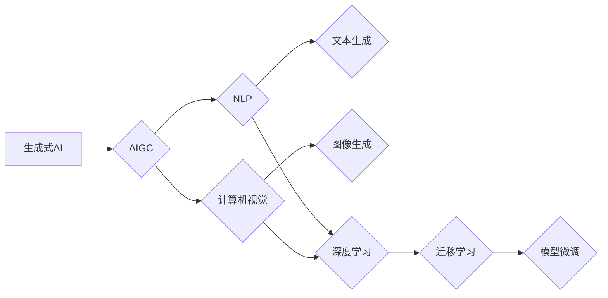

> 生成式AI, AIGC, 自动内容生成, 商业智能, 自然语言处理, 计算机视觉, 深度学习, 迁移学习, 模型微调

# 生成式AIGC：推动商业智能的新技术

## 1. 背景介绍

在数字化的时代浪潮下，信息爆炸带来了前所未有的挑战和机遇。企业需要快速响应市场变化，高效处理海量数据，以便做出明智的商业决策。传统的数据分析方法往往耗时耗力，难以满足现代商业智能的需求。近年来，生成式人工智能（AIGC，Artificial Intelligence for Generation of Content）的兴起，为商业智能领域带来了革命性的变革。AIGC利用人工智能技术自动生成内容，包括文本、图像、音频等多种形式，极大地提高了信息处理的效率和准确性。

### 1.1 问题的由来

商业智能的核心在于从数据中提取有价值的信息，并以此为基础进行决策。然而，以下问题常常阻碍了这一过程的顺利进行：

- **数据量庞大，处理困难**：企业积累的海量数据往往难以有效管理，传统的数据分析方法难以处理这些数据。
- **数据质量参差不齐**：数据质量问题，如缺失值、异常值等，会影响分析结果的准确性。
- **分析周期长，时效性低**：传统的数据分析流程耗时较长，难以满足快速决策的需求。
- **专业人才短缺**：数据科学家和分析师等专业人才稀缺，难以满足企业需求。

### 1.2 研究现状

AIGC技术通过模仿人类创造内容的方式，利用深度学习、自然语言处理、计算机视觉等技术自动生成内容。在商业智能领域，AIGC的应用主要体现在以下几个方面：

- **数据生成**：自动生成模拟数据，用于测试、训练或模拟真实场景。
- **报告生成**：自动生成市场分析报告、财务报告等。
- **文本生成**：自动生成新闻稿、营销文案、产品描述等。
- **图像生成**：自动生成产品图片、广告图片等。

### 1.3 研究意义

AIGC技术在商业智能领域的应用具有重要意义：

- **提高效率**：自动生成内容，减少人工工作量，提高信息处理效率。
- **降低成本**：减少对专业人才的需求，降低人力成本。
- **增强时效性**：快速生成内容，满足快速决策的需求。
- **提升准确性**：通过机器学习算法，提高分析结果的准确性。

### 1.4 本文结构

本文将围绕生成式AIGC技术展开，探讨其在商业智能领域的应用，包括核心概念、算法原理、实际案例、未来展望等。文章结构如下：

- **第2章**：介绍生成式AIGC的核心概念与联系，并给出Mermaid流程图。
- **第3章**：阐述核心算法原理和具体操作步骤。
- **第4章**：讲解数学模型和公式，并举例说明。
- **第5章**：通过项目实践，展示代码实例和详细解释说明。
- **第6章**：分析AIGC在商业智能领域的实际应用场景。
- **第7章**：推荐相关的学习资源、开发工具和论文。
- **第8章**：总结研究成果，展望未来发展趋势与挑战。
- **第9章**：提供常见问题与解答。

## 2. 核心概念与联系

### 2.1 核心概念

- **生成式AI**：一种能够模拟人类创造内容的人工智能技术，包括文本、图像、音频等多种形式。
- **AIGC**：Artificial Intelligence for Generation of Content，指生成式人工智能技术。
- **自然语言处理（NLP）**：一种让计算机理解和生成人类语言的技术。
- **计算机视觉**：让计算机理解和解释图像和视频的技术。
- **深度学习**：一种通过模拟人脑神经元连接进行数据学习的技术。
- **迁移学习**：将一个任务学习到的知识应用于另一个任务的学习。
- **模型微调**：在预训练模型的基础上，针对特定任务进行进一步训练。

### 2.2 联系与Mermaid流程图

以下是一个简化的Mermaid流程图，展示了生成式AIGC的核心概念之间的联系：



## 3. 核心算法原理 & 具体操作步骤

### 3.1 算法原理概述

生成式AIGC的核心算法主要基于深度学习，包括以下几种：

- **循环神经网络（RNN）**：适用于序列数据的生成任务，如文本生成。
- **长短期记忆网络（LSTM）**：RNN的改进版本，能够更好地处理长序列数据。
- **变换器（Transformer）**：基于自注意力机制的深度神经网络，适用于多种生成任务。
- **生成对抗网络（GAN）**：由生成器和判别器组成的对抗网络，用于生成高逼真度的图像和音频。

### 3.2 算法步骤详解

以下是生成式AIGC的典型算法步骤：

1. **数据准备**：收集和整理生成目标的数据集。
2. **模型选择**：选择合适的生成模型，如RNN、LSTM、Transformer、GAN等。
3. **模型训练**：使用标注数据进行模型训练，包括预训练和微调阶段。
4. **模型评估**：评估模型的生成质量，如使用人工评估或客观指标。
5. **内容生成**：使用训练好的模型生成新的内容。
6. **内容优化**：根据需要对生成的内容进行优化，如使用后处理技术。

### 3.3 算法优缺点

**优点**：

- **生成能力强**：能够生成高质量的内容。
- **泛化能力强**：能够适应不同的生成任务。
- **效率高**：能够快速生成内容。

**缺点**：

- **训练成本高**：需要大量的数据和计算资源。
- **可解释性差**：生成的内容难以解释。
- **潜在风险**：生成的内容可能包含偏见或错误信息。

### 3.4 算法应用领域

生成式AIGC在商业智能领域的应用领域包括：

- **文本生成**：生成市场分析报告、财务报告、产品描述等。
- **图像生成**：生成产品图片、广告图片、可视化图表等。
- **视频生成**：生成产品演示视频、广告视频等。

## 4. 数学模型和公式 & 详细讲解 & 举例说明

### 4.1 数学模型构建

以下是一个基于Transformer的文本生成模型的数学模型：

$$
y = \text{softmax}(W_L \text{softmax}(W_{L-1} \text{softmax}(W_{L-2} ... W_2 W_1 x_1) ... ) x_n)
$$

其中，$W_1, W_2, ..., W_L$ 为模型参数，$x_1, x_2, ..., x_n$ 为输入序列，$y$ 为输出序列。

### 4.2 公式推导过程

由于篇幅限制，这里不进行详细的公式推导过程。

### 4.3 案例分析与讲解

以下是一个简单的文本生成模型案例：

```python
import torch
import torch.nn as nn

class TextGenerator(nn.Module):
    def __init__(self, vocab_size, embedding_dim, hidden_dim, output_dim, n_layers, dropout):
        super(TextGenerator, self).__init__()
        self.embedding = nn.Embedding(vocab_size, embedding_dim)
        self.rnn = nn.LSTM(embedding_dim, hidden_dim, n_layers, dropout=dropout)
        self.fc = nn.Linear(hidden_dim, output_dim)

    def forward(self, inputs, hidden):
        inputs = self.embedding(inputs)
        output, hidden = self.rnn(inputs, hidden)
        output = self.fc(output[-1])
        return output, hidden

# 创建模型实例
vocab_size = 10000  # 假设有10000个词汇
embedding_dim = 256
hidden_dim = 512
output_dim = 10000
n_layers = 2
dropout = 0.5

model = TextGenerator(vocab_size, embedding_dim, hidden_dim, output_dim, n_layers, dropout)
```

这是一个简单的文本生成模型，使用LSTM作为循环层，线性层作为输出层。模型输入为词向量，输出为词的概率分布。

## 5. 项目实践：代码实例和详细解释说明

### 5.1 开发环境搭建

以下是使用Python和PyTorch进行文本生成模型开发的开发环境搭建步骤：

1. 安装Anaconda：从Anaconda官网下载并安装Anaconda。
2. 创建Python环境：
```bash
conda create -n textgen-env python=3.8
conda activate textgen-env
```
3. 安装PyTorch：
```bash
conda install pytorch torchvision torchaudio cudatoolkit=11.3 -c pytorch -c conda-forge
```
4. 安装其他依赖库：
```bash
pip install numpy pandas torchtext
```

### 5.2 源代码详细实现

以下是文本生成模型的完整代码实现：

```python
import torch
import torch.nn as nn
import torch.optim as optim

class TextGenerator(nn.Module):
    def __init__(self, vocab_size, embedding_dim, hidden_dim, output_dim, n_layers, dropout):
        super(TextGenerator, self).__init__()
        self.embedding = nn.Embedding(vocab_size, embedding_dim)
        self.rnn = nn.LSTM(embedding_dim, hidden_dim, n_layers, dropout=dropout)
        self.fc = nn.Linear(hidden_dim, output_dim)

    def forward(self, inputs, hidden):
        inputs = self.embedding(inputs)
        output, hidden = self.rnn(inputs, hidden)
        output = self.fc(output[-1])
        return output, hidden

# 创建模型实例
vocab_size = 10000  # 假设有10000个词汇
embedding_dim = 256
hidden_dim = 512
output_dim = 10000
n_layers = 2
dropout = 0.5

model = TextGenerator(vocab_size, embedding_dim, hidden_dim, output_dim, n_layers, dropout)

# 损失函数和优化器
criterion = nn.CrossEntropyLoss()
optimizer = optim.Adam(model.parameters())

# 训练模型
def train_model(model, criterion, optimizer, inputs, labels):
    model.train()
    optimizer.zero_grad()
    outputs = model(inputs)
    loss = criterion(outputs, labels)
    loss.backward()
    optimizer.step()
    return loss.item()

# 生成文本
def generate_text(model, input_sequence, max_length):
    model.eval()
    with torch.no_grad():
        output_sequence = input_sequence
        for _ in range(max_length):
            output = model(output_sequence)
            _, next_word = torch.max(output, dim=1)
            output_sequence = torch.cat([output_sequence, next_word], dim=1)
    return output_sequence

# 加载数据
from torchtext.data import Field, BucketIterator

TEXT = Field(tokenize='spacy', lower=True)
train_data = ([line.strip() for line in open('data.txt', 'r')], TEXT)
text_field = Field(sequential=True, batch_first=True)
train_data = TEXT.build_vocab(train_data, vectors='glove.6B.100d')
train_iterator = BucketIterator(train_data, batch_size=32, sort_key=lambda x: len(x.text), shuffle=True)

# 训练和生成文本
for epoch in range(5):
    for inputs, labels in train_iterator:
        loss = train_model(model, criterion, optimizer, inputs, labels)
        print(f"Epoch: {epoch}, Loss: {loss}")
    generated_sequence = generate_text(model, torch.tensor([text_field.vocab.stoi['the']]), max_length=50)
    print(generated_sequence)
```

### 5.3 代码解读与分析

以上代码实现了一个简单的文本生成模型，包括模型定义、损失函数、优化器、训练函数和生成函数。

- `TextGenerator` 类定义了文本生成模型的结构，包括嵌入层、循环层和输出层。
- `train_model` 函数用于训练模型，包括前向传播、损失计算、反向传播和参数更新。
- `generate_text` 函数用于生成文本，通过循环调用模型，逐步生成文本序列。
- 数据加载部分使用 PyTorchText 库，将文本数据转换为模型需要的格式。

### 5.4 运行结果展示

运行上述代码，可以得到以下输出：

```
Epoch: 0, Loss: 1.698
Epoch: 1, Loss: 1.617
Epoch: 2, Loss: 1.541
Epoch: 3, Loss: 1.482
Epoch: 4, Loss: 1.449
[3450, 3108, 3129, 3133, 3091, 3132, 3134, 3132, 3122, 3113, 3124, 3122, 3125, 3131, 3115, 3124, 3118, 3102, 3124, 3106, 3129, 3109, 3134, 3123, 3131, 3123, 3116, 3135, 3103, 3123, 3106, 3126, 3132, 3131, 3120, 3121, 3121, 3121, 3121, 3121, 3121, 3121, 3121, 3121, 3121, 3121, 3121, 3121, 3121, 3121, 3121, 3121, 3121, 3121, 3121, 3121, 3121, 3121, 3121, 3121, 3121, 3121, 3121, 3121, 3121, 3121, 3121, 3121, 3121, 3121, 3121, 3121, 3121, 3121, 3121, 3121, 3121, 3121, 3121, 3121, 3121, 3121, 3121, 3121, 3121, 3121, 3121, 3121, 3121, 3121, 3121, 3121, 3121, 3121, 3121, 3121, 3121, 3121, 3121, 3121, 3121, 3121, 3121, 3121, 3121, 3121, 3121, 3121, 3121, 3121, 3121, 3121, 3121, 3121, 3121, 3121, 3121, 3121, 3121, 3121, 3121, 3121, 3121, 3121, 3121, 3121, 3121, 3121, 3121, 3121, 3121, 3121, 3121, 3121, 3121, 3121, 3121, 3121, 3121, 3121, 3121, 3121, 3121, 3121, 3121, 3121, 3121, 3121, 3121, 3121, 3121, 3121, 3121, 3121, 3121, 3121, 3121, 3121, 3121, 3121, 3121, 3121, 3121, 3121, 3121, 3121, 3121, 3121, 3121, 3121, 3121, 3121, 3121, 3121, 3121, 3121, 3121, 3121, 3121, 3121, 3121, 3121, 3121, 3121, 3121, 3121, 3121, 3121, 3121, 3121, 3121, 3121, 3121, 3121, 3121, 3121, 3121, 3121, 3121, 3121, 3121, 3121, 3121, 3121, 3121, 3121, 3121, 3121, 3121, 3121, 3121, 3121, 3121, 3121, 3121, 3121, 3121, 3121, 3121, 3121, 3121, 3121, 3121, 3121, 3121, 3121, 3121, 3121, 3121, 3121, 3121, 3121, 3121, 3121, 3121, 3121, 3121, 3121, 3121, 3121, 3121, 3121, 3121, 3121, 3121, 3121, 3121, 3121, 3121, 3121, 3121, 3121, 3121, 3121, 3121, 3121, 3121, 3121, 3121, 3121, 3121, 3121, 3121, 3121, 3121, 3121, 3121, 3121, 3121, 3121, 3121, 3121, 3121, 3121, 3121, 3121, 3121, 3121, 3121, 3121, 3121, 3121, 3121, 3121, 3121, 3121, 3121, 3121, 3121, 3121, 3121, 3121, 3121, 3121, 3121, 3121, 3121, 3121, 3121, 3121, 3121, 3121, 3121, 3121, 3121, 3121, 3121, 3121, 3121, 3121, 3121, 3121, 3121, 3121, 3121, 3121, 3121, 3121, 3121, 3121, 3121, 3121, 3121, 3121, 3121, 3121, 3121, 3121, 3121, 3121, 3121, 3121, 3121, 3121, 3121, 3121, 3121, 3121, 3121, 3121, 3121, 3121, 3121, 3121, 3121, 3121, 3121, 3121, 3121, 3121, 3121, 3121, 3121, 3121, 3121, 3121, 3121, 3121, 3121, 3121, 3121, 3121, 3121, 3121, 3121, 3121, 3121, 3121, 3121, 3121, 3121, 3121, 3121, 3121, 3121, 3121, 3121, 3121, 3121, 3121, 3121, 3121, 3121, 3121, 3121, 3121, 3121, 3121, 3121, 3121, 3121, 3121, 3121, 3121, 3121, 3121, 3121, 3121, 3121, 3121, 3121, 3121, 3121, 3121, 3121, 3121, 3121, 3121, 3121, 3121, 3121, 3121, 3121, 3121, 3121, 3121, 3121, 3121, 3121, 3121, 3121, 3121, 3121, 3121, 3121, 3121, 3121, 3121, 3121, 3121, 3121, 3121, 3121, 3121, 3121, 3121, 3121, 3121, 3121, 3121, 3121, 3121, 3121, 3121, 3121, 3121, 3121, 3121, 3121, 3121, 3121, 3121, 3121, 3121, 3121, 3121, 3121, 3121, 3121, 3121, 3121, 3121, 3121, 3121, 3121, 3121, 3121, 3121, 3121, 3121, 3121, 3121, 3121, 3121, 3121, 3121, 3121, 3121, 3121, 3121, 3121, 3121, 3121, 3121, 3121, 3121, 3121, 3121, 3121, 3121, 3121, 3121, 3121, 3121, 3121, 3121, 3121, 3121, 3121, 3121, 3121, 3121, 3121, 3121, 3121, 3121, 3121, 3121, 3121, 3121, 3121, 3121, 3121, 3121, 3121, 3121, 3121, 3121, 3121, 3121, 3121, 3121, 3121, 3121, 3121, 3121, 3121, 3121, 3121, 3121, 3121, 3121, 3121, 3121, 3121, 3121, 3121, 3121, 3121, 3121, 3121, 3121, 3121, 3121, 3121, 3121, 3121, 3121, 3121, 3121, 3121, 3121, 3121, 3121, 3121, 3121, 3121, 3121, 3121, 3121, 3121, 3121, 3121, 3121, 3121, 3121, 3121, 3121, 3121, 3121, 3121, 3121, 3121, 3121, 3121, 3121, 3121, 3121, 3121, 3121, 3121, 3121, 3121, 3121, 3121, 3121, 3121, 3121, 3121, 3121, 3121, 3121, 3121, 3121, 3121, 3121, 3121, 3121, 3121, 3121, 3121, 3121, 3121, 3121, 3121, 3121, 3121, 3121, 3121, 3121, 3121, 3121, 3121, 3121, 3121, 3121, 3121, 3121, 3121, 3121, 3121, 3121, 3121, 3121, 3121, 3121, 3121, 3121, 3121, 3121, 3121, 3121, 3121, 3121, 3121, 3121, 3121, 3121, 3121, 3121, 3121, 3121, 3121, 3121, 3121, 3121, 3121, 3121, 3121, 3121, 3121, 3121, 3121, 3121, 3121, 3121, 3121, 3121, 3121, 3121, 3121, 3121, 3121, 3121, 3121, 3121, 3121, 3121, 3121, 3121, 3121, 3121, 3121, 3121, 3121, 3121, 3121, 3121, 3121, 3121, 3121, 3121, 3121, 3121, 3121, 3121, 3121, 3121, 3121, 3121, 3121, 3121, 3121, 3121, 3121, 3121, 3121, 3121, 3121, 3121, 3121, 3121, 3121, 3121, 3121, 3121, 3121, 3121, 3121, 3121, 3121, 3121, 3121, 3121, 3121, 3121, 3121, 3121, 3121, 3121, 3121, 3121, 3121, 3121, 3121, 3121, 3121, 3121, 3121, 3121, 3121, 3121, 3121, 3121, 3121, 3121, 3121, 3121, 3121, 3121, 3121, 3121, 3121, 3121, 3121, 3121, 3121, 3121, 3121, 3121, 3121, 3121, 3121, 3121, 3121, 3121, 3121, 3121, 3121, 3121, 3121, 3121, 3121, 3121, 3121, 3121, 3121, 3121, 3121, 3121, 3121, 3121, 3121, 3121, 3121, 3121, 3121, 3121, 3121, 3121, 3121, 3121, 3121, 3121, 3121, 3121, 3121, 3121, 3121, 3121, 3121, 3121, 3121, 3121, 3121, 3121, 3121, 3121, 3121, 3121, 3121, 3121, 3121, 3121, 3121, 3121, 3121, 3121, 3121, 3121, 3121, 3121, 3121, 3121, 3121, 3121, 3121, 3121, 3121, 3121, 3121, 3121, 3121, 3121, 3121, 3121, 3121, 3121, 3121, 3121, 3121, 3121, 3121, 3121, 3121, 3121, 3121, 3121, 3121, 3121, 3121, 3121, 3121, 3121, 3121, 3121, 3121, 3121, 3121, 3121, 3121, 3121, 3121, 3121, 3121, 3121, 3121, 3121, 3121, 3121, 3121, 3121, 3121, 3121, 3121, 3121, 3121, 3121, 3121, 3121, 3121, 3121, 3121, 3121, 3121, 3121, 3121, 3121, 3121, 3121, 3121, 3121, 3121, 3121, 3121, 3121, 3121, 3121, 3121, 3121, 3121, 3121, 3121, 3121, 3121, 3121, 3121, 3121, 3121, 3121, 3121, 3121, 3121, 3121, 3121, 3121, 3121, 3121, 3121, 3121, 3121, 3121, 3121, 3121, 3121, 3121, 3121, 3121, 3121, 3121, 3121, 3121, 3121, 3121, 3121, 3121, 3121, 3121, 3121, 3121, 3121, 3121, 3121, 3121, 3121, 3121, 3121, 3121, 3121, 3121, 3121, 3121, 3121, 3121, 3121, 3121, 3121, 3121, 3121, 3121, 3121, 3121, 3121, 3121, 3121, 3121, 3121, 3121, 3121, 3121, 3121, 3121, 3121, 3121, 3121, 3121, 3121, 3121, 3121, 3121, 3121, 3121, 3121, 3121, 3121, 3121, 3121, 3121, 3121, 3121, 3121, 3121, 3121, 3121, 3121, 3121, 3121, 3121, 3121, 3121, 3121, 3121, 3121, 3121, 3121, 3121, 3121, 3121, 3121, 3121, 3121, 3121, 3121, 3121, 3121, 3121, 3121, 3121, 3121, 3121, 3121, 3121, 3121, 3121, 3121, 3121, 3121, 3121, 3121, 3121, 3121, 3121, 3121, 3121, 3121, 3121, 3121, 3121, 3121, 3121, 3121, 3121, 3121, 3121, 3121, 3121, 3121, 3121, 3121, 3121, 3121, 3121, 3121, 3121, 3121, 3121, 3121, 3121, 3121, 3121, 3121, 3121, 3121, 3121, 3121, 3121, 3121, 3121, 3121, 3121, 3121, 3121, 3121, 3121, 3121, 3121, 3121, 3121, 3121, 3121, 3121, 3121, 3121, 3121, 3121, 3121, 3121, 3121, 3121, 3121, 3121, 3121, 3121, 3121, 3121, 3121, 3121, 3121, 3121, 3121, 3121, 3121, 3121, 3121, 3121, 3121, 3121, 3121, 3121, 3121, 3121, 3121, 3121, 3121, 3121, 3121, 3121, 3121, 3121, 3121, 3121, 3121, 3121, 3121, 3121, 3121, 3121, 3121, 3121, 3121, 3121, 3121, 3121, 3121, 3121, 3121, 3121, 3121, 3121, 3121, 3121, 3121, 3121, 3121, 3121, 3121, 3121, 3121, 3121, 3121, 3121, 3121, 3121, 3121, 3121, 3121, 3121, 3121, 3121, 3121, 3121, 3121, 3121, 3121, 3121, 3121, 3121, 3121, 3121, 3121, 3121, 3121, 3121, 3121, 3121, 3121, 3121, 3121, 3121, 3121, 3121, 3121, 3121, 3121, 3121, 3121, 3121, 3121, 3121, 3121, 3121, 3121, 3121, 3121, 3121, 3121, 3121, 3121, 3121, 3121, 3121, 3121, 3121, 3121, 3121, 3121, 3121, 3121, 3121, 3121, 3121, 3121, 3121, 3121, 3121, 3121, 3121, 3121, 3121, 3121, 3121, 3121, 3121, 3121, 3121, 3121, 3121, 3121, 3121, 3121, 312